# Tài liệu Luồng Xử Lý Chấm Công (Attendance Processing)

## Mục lục

1. [Tổng quan hệ thống](#1-tổng-quan-hệ-thống)
2. [Luồng Xác thực Thiết bị](#2-luồng-xác-thực-thiết-bị)
3. [Luồng Chấm công Thời gian Thực](#3-luồng-chấm-công-thời-gian-thực)
4. [Luồng Chấm công Hàng loạt (Batch)](#4-luồng-chấm-công-hàng-loạt-batch)
5. [Luồng Bù dữ liệu Tự động (Scheduled)](#5-luồng-bù-dữ-liệu-tự-động-scheduled)
6. [Luồng Tính toán Công](#6-luồng-tính-toán-công)
7. [Luồng Đóng Kỳ Chấm công](#7-luồng-đóng-kỳ-chấm-công)
8. [Biểu đồ Trạng thái Bản ghi Chấm công](#8-biểu-đồ-trạng-thái-bản-ghi-chấm-công)

---

## 1. Tổng quan hệ thống

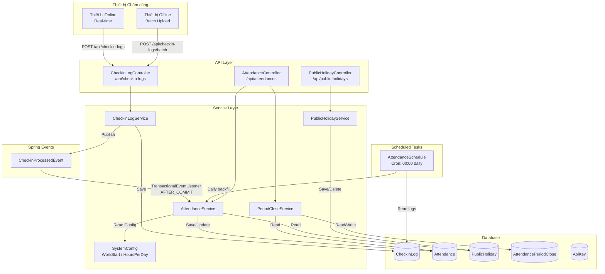

---

## 2. Luồng Xác thực Thiết bị

### 2.1 Tạo API Key cho Thiết bị

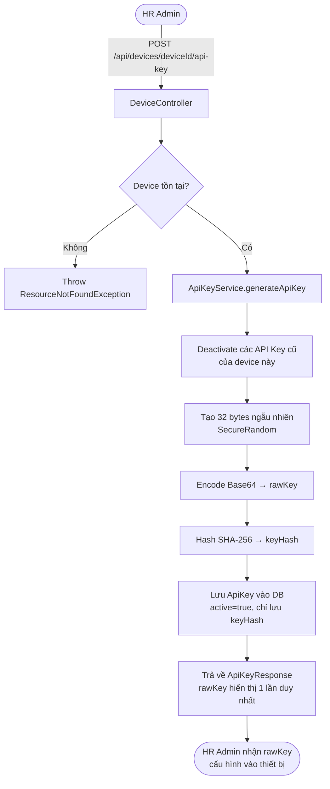

### 2.2 Xác thực Thiết bị khi Gửi Checkin

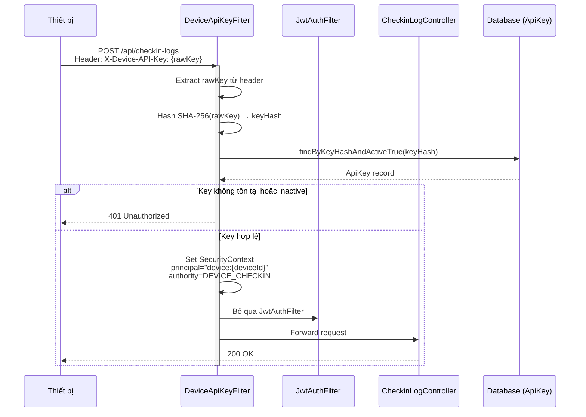

---

## 3. Luồng Chấm công Thời gian Thực

### 3.1 Biểu đồ Luồng (Flowchart)

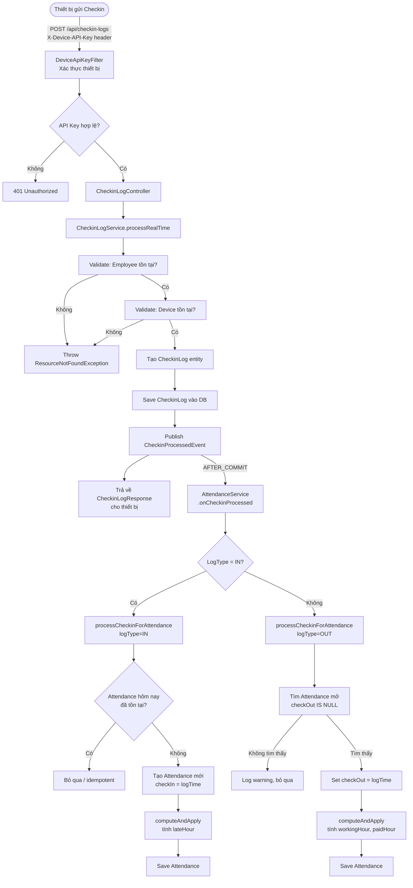

### 3.2 Biểu đồ Trình tự (Sequence Diagram)

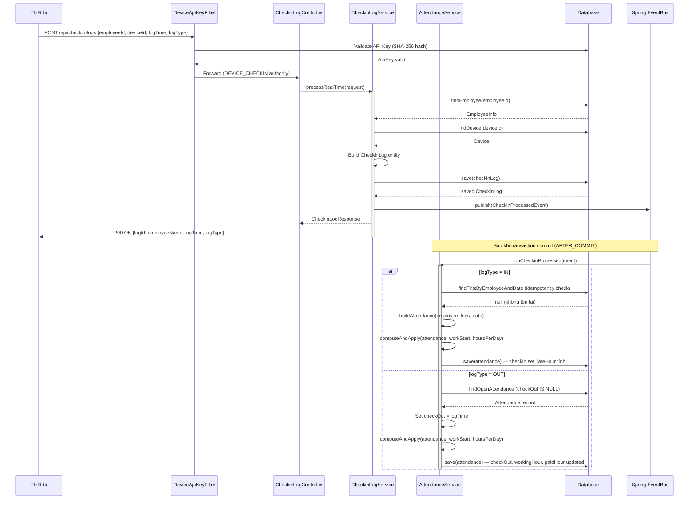

---

## 4. Luồng Chấm công Hàng loạt (Batch)

### 4.1 Biểu đồ Luồng (Flowchart)

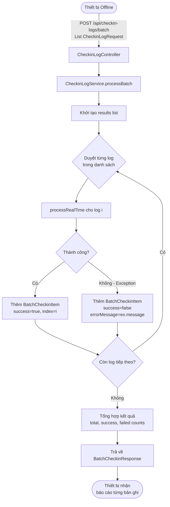

### 4.2 Biểu đồ Trình tự (Sequence Diagram)

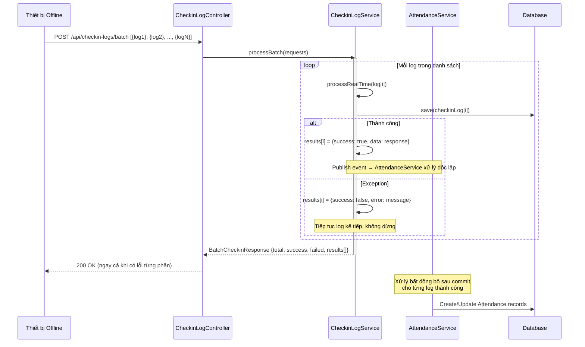

---

## 5. Luồng Bù dữ liệu Tự động (Scheduled)

### 5.1 Biểu đồ Luồng (Flowchart)

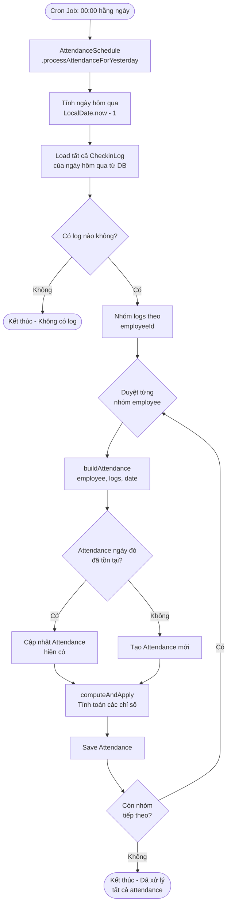

### 5.2 Biểu đồ Trình tự (Sequence Diagram)

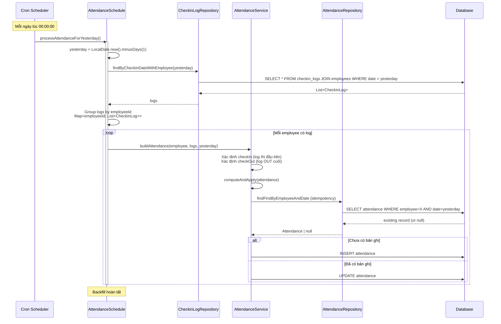

---

## 6. Luồng Tính toán Công

### 6.1 Biểu đồ Luồng Tính toán (Flowchart)

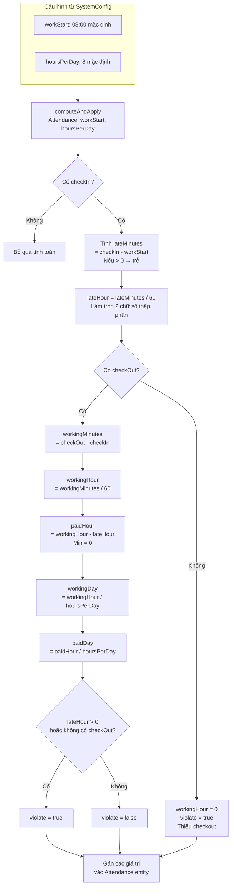

### 6.2 Ví dụ Tính toán Thực tế

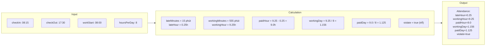

---

## 7. Luồng Đóng Kỳ Chấm công

### 7.1 Biểu đồ Luồng (Flowchart)

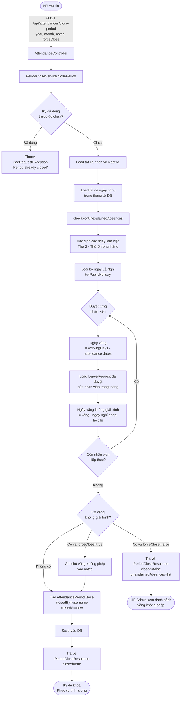

### 7.2 Biểu đồ Trình tự (Sequence Diagram)

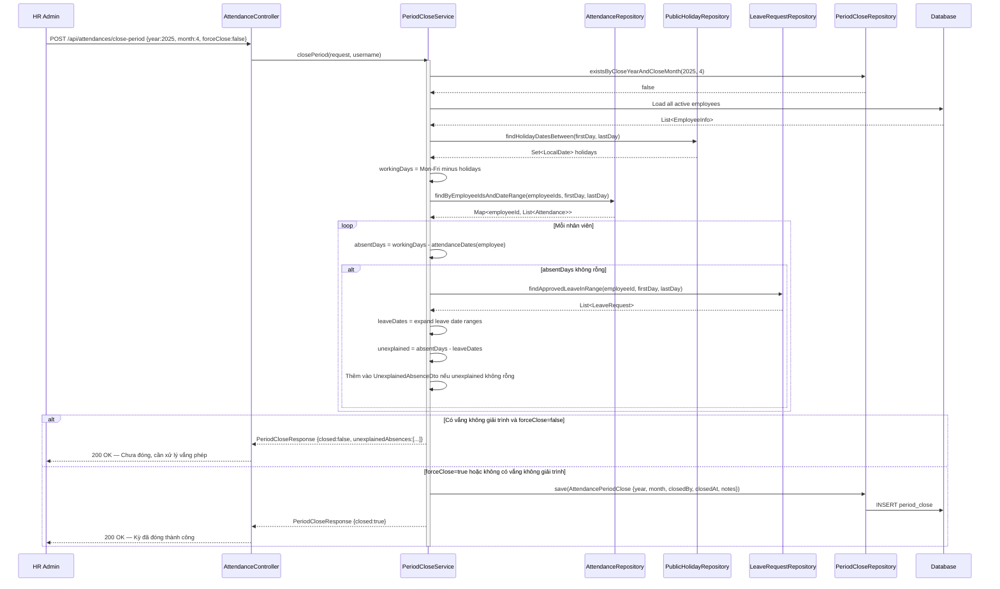

---

## 8. Biểu đồ Trạng thái Bản ghi Chấm công

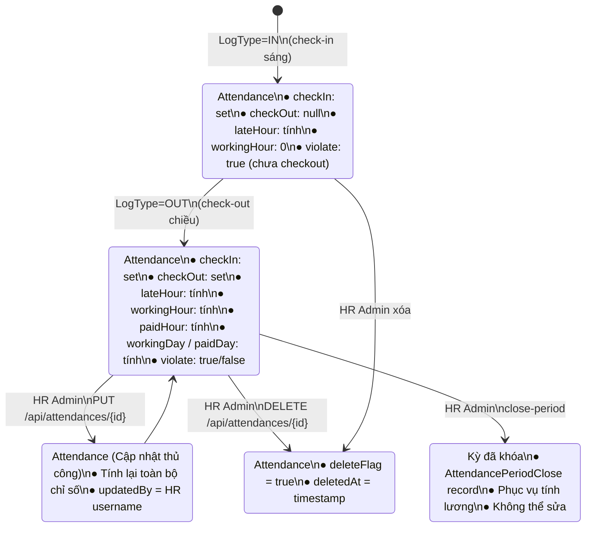

---

## Tóm tắt Các Điểm Quan trọng

| Khía cạnh | Chi tiết |
|---|---|
| **Idempotency** | Check-in `IN` sẽ bị bỏ qua nếu Attendance trong ngày đã tồn tại |
| **Async Processing** | Xử lý Attendance chạy sau khi transaction CheckinLog commit (`AFTER_COMMIT`) |
| **Soft Delete** | Xóa chỉ set `deleteFlag=true`, không xóa vật lý |
| **Xác thực thiết bị** | SHA-256 hash, không lưu raw key, 1 key active/device |
| **Cấu hình động** | `workStart` và `hoursPerDay` đọc từ `SystemConfig` (PostgreSQL jsonb) |
| **Batch chịu lỗi** | Lỗi từng log trong batch không làm dừng toàn bộ; trả về kết quả từng phần |
| **Ngày nghỉ lễ** | Loại khỏi tính ngày công và kiểm tra vắng mặt khi đóng kỳ |
| **Đóng kỳ có bảo vệ** | Phải xử lý vắng không phép trước khi đóng (trừ khi `forceClose=true`) |
