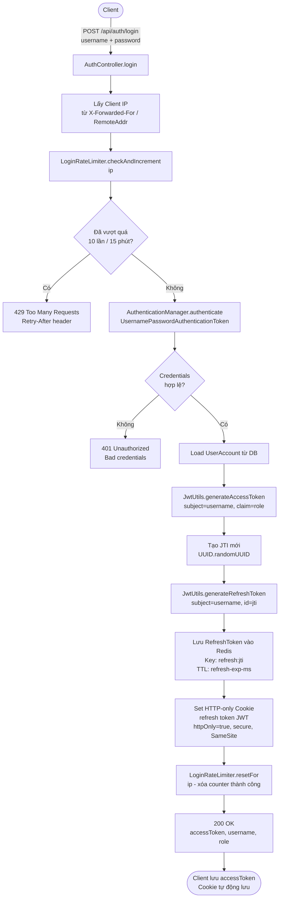
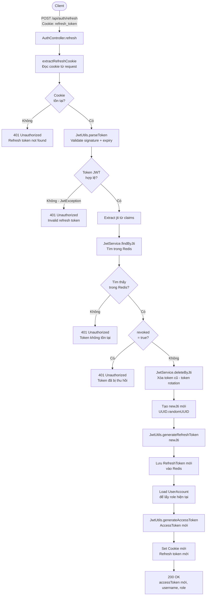
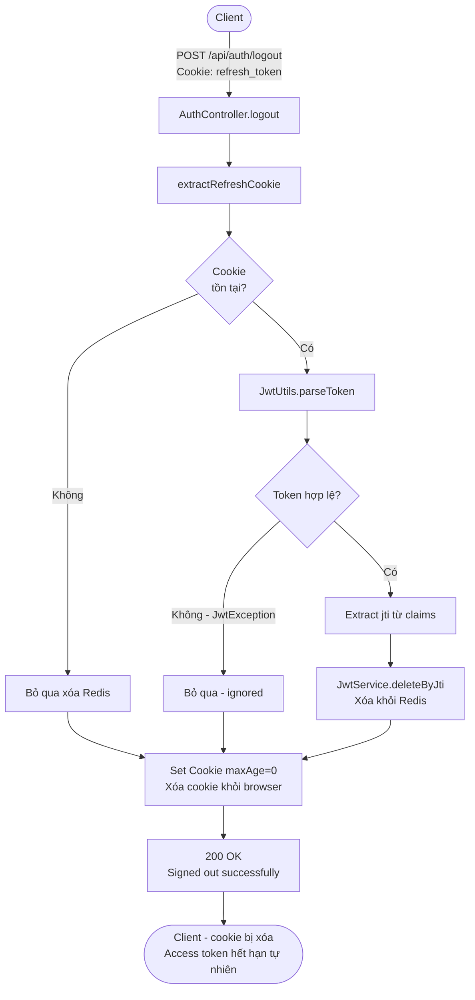
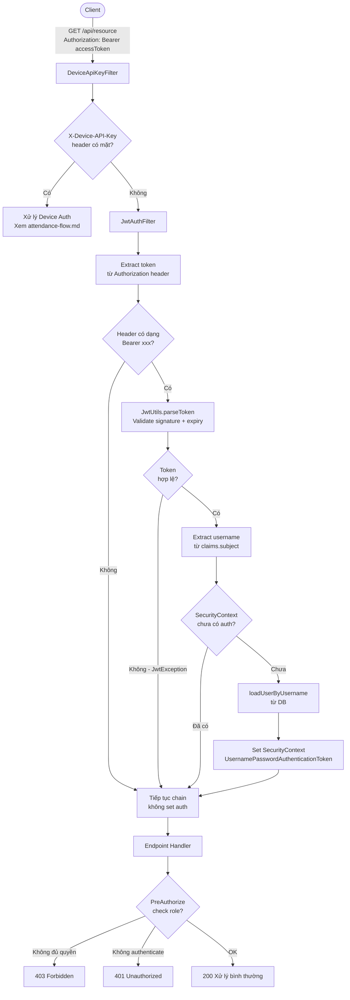
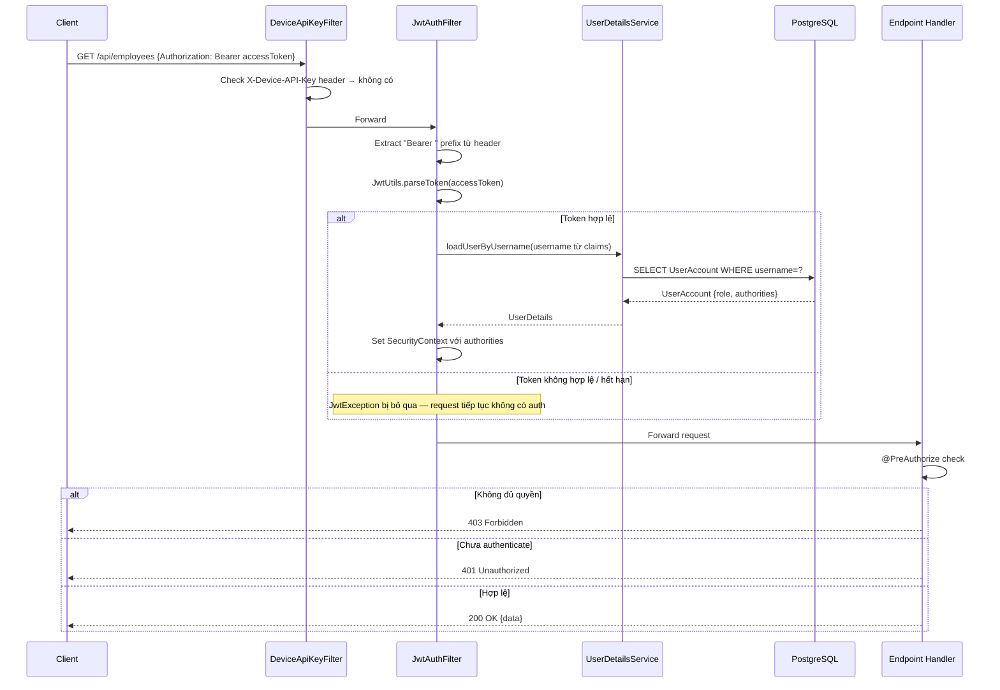
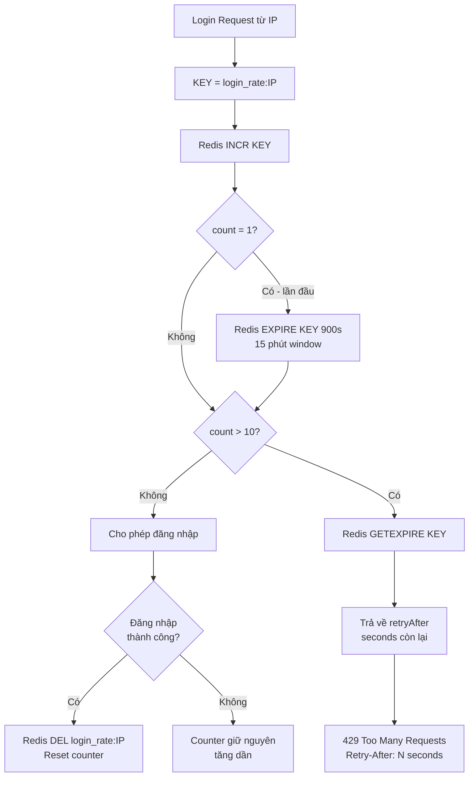
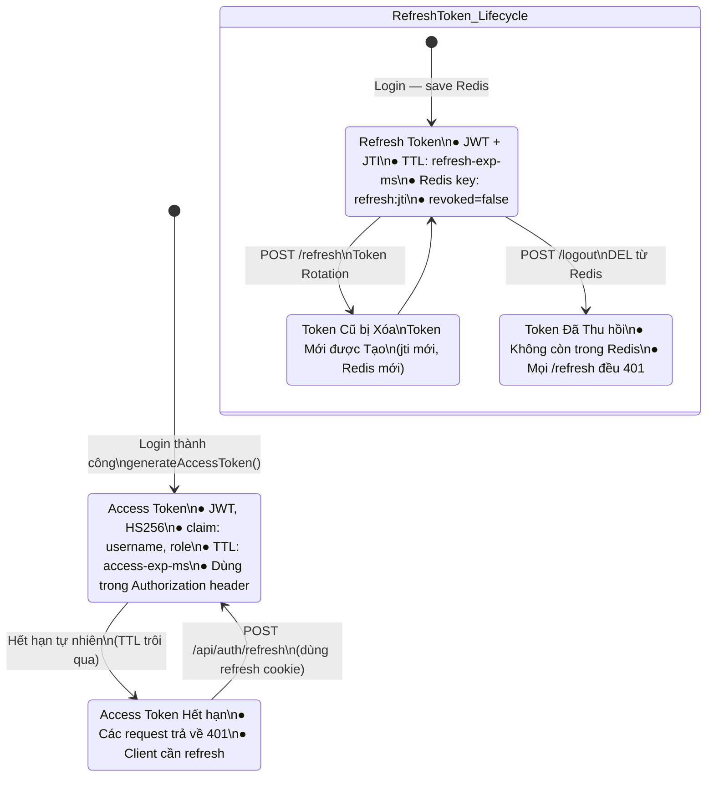

# Tài liệu Luồng Xác thực & Phân quyền (Auth Flow)

## Mục lục

1. [Tổng quan](#1-tổng-quan)
2. [Luồng Đăng nhập (Login)](#2-luồng-đăng-nhập-login)
3. [Luồng Làm mới Token (Refresh)](#3-luồng-làm-mới-token-refresh)
4. [Luồng Đăng xuất (Logout)](#4-luồng-đăng-xuất-logout)
5. [Luồng Xử lý Request được Bảo vệ](#5-luồng-xử-lý-request-được-bảo-vệ)
6. [Cơ chế Rate Limiting](#6-cơ-chế-rate-limiting)
7. [Biểu đồ Trạng thái Token](#7-biểu-đồ-trạng-thái-token)

---

## 1. Tổng quan

```mermaid
graph TB
    subgraph Client["Client (Browser / Mobile)"]
        REQ[HTTP Request]
        COOKIE[HTTP-only Cookie\nrefresh_token JWT]
        HEADER[Authorization Header\nBearer accessToken]
    end

    subgraph Filters["Filter Chain"]
        DKAF[DeviceApiKeyFilter\n1st priority]
        JWTF[JwtAuthFilter\n2nd priority]
    end

    subgraph Auth["Auth Endpoints /api/auth"]
        LOGIN[POST /login]
        REFRESH[POST /refresh]
        LOGOUT[POST /logout]
        ME[GET /me]
        CHPWD[PUT /change-password]
    end

    subgraph Security["Security Layer"]
        RL[LoginRateLimiter\nRedis counter per IP]
        AM[AuthenticationManager\nValidate credentials]
        SC[SecurityContext\nHold principal]
    end

    subgraph Storage["Storage"]
        REDIS[(Redis\nrefresh:{jti})]
        DB[(PostgreSQL\nUserAccount)]
    end

    REQ --> DKAF --> JWTF --> Auth
    LOGIN --> RL --> AM --> REDIS
    REFRESH --> REDIS
    LOGOUT --> REDIS
    JWTF --> SC
    AM --> DB
```

---

## 2. Luồng Đăng nhập (Login)

### 2.1 Biểu đồ Luồng (Flowchart)



### 2.2 Biểu đồ Trình tự (Sequence Diagram)

```mermaid
sequenceDiagram
    participant C as Client
    participant CTL as AuthController
    participant RL as LoginRateLimiter
    participant AM as AuthenticationManager
    participant UDTS as CustomUserDetailService
    participant DB as PostgreSQL
    participant REDIS as Redis
    participant JWT as JwtUtils

    C->>CTL: POST /api/auth/login {username, password}
    CTL->>CTL: resolveClientIp(request)

    CTL->>RL: checkAndIncrement(clientIp)
    RL->>REDIS: INCR login_rate:{ip}
    REDIS-->>RL: count
    RL->>REDIS: EXPIRE login_rate:{ip} 900s (if count==1)

    alt count > 10
        RL-->>CTL: retryAfter (seconds)
        CTL-->>C: 429 Too Many Requests
    else count <= 10
        RL-->>CTL: -1 (allowed)

        CTL->>AM: authenticate(username, password)
        AM->>UDTS: loadUserByUsername(username)
        UDTS->>DB: findUserAccountByUsername(username)
        DB-->>UDTS: UserAccount
        UDTS-->>AM: UserDetails
        AM->>AM: verify password hash
        AM-->>CTL: Authentication (success)

        CTL->>DB: findUserAccountByUsername (load role)
        DB-->>CTL: UserAccount

        CTL->>JWT: generateAccessToken(username, role)
        JWT-->>CTL: accessToken (HS256 JWT, short-lived)

        CTL->>CTL: jti = UUID.randomUUID()
        CTL->>JWT: generateRefreshToken(username, jti)
        JWT-->>CTL: refreshJwt (HS256 JWT, long-lived)

        CTL->>REDIS: SET refresh:{jti} RefreshToken TTL=refreshExpMs
        REDIS-->>CTL: OK

        CTL->>CTL: Build ResponseCookie (HttpOnly, Secure, SameSite)
        CTL->>RL: resetFor(clientIp) — DELETE login_rate:{ip}

        CTL-->>C: 200 OK {accessToken, username, role}\nSet-Cookie: refresh_token=refreshJwt; HttpOnly
    end
```

---

## 3. Luồng Làm mới Token (Refresh)

### 3.1 Biểu đồ Luồng (Flowchart)



### 3.2 Biểu đồ Trình tự (Sequence Diagram)

```mermaid
sequenceDiagram
    participant C as Client
    participant CTL as AuthController
    participant JWT as JwtUtils
    participant REDIS as Redis
    participant DB as PostgreSQL

    C->>CTL: POST /api/auth/refresh (Cookie: refresh_token=oldRefreshJwt)
    CTL->>CTL: extractRefreshCookie(request)

    alt Cookie không tồn tại
        CTL-->>C: 401 Refresh token not found
    else Cookie tồn tại
        CTL->>JWT: parseToken(oldRefreshJwt)

        alt JWT không hợp lệ hoặc hết hạn
            JWT-->>CTL: JwtException
            CTL-->>C: 401 Invalid refresh token
        else JWT hợp lệ
            JWT-->>CTL: Claims {sub=username, jti=oldJti}

            CTL->>REDIS: GET refresh:{oldJti}
            REDIS-->>CTL: RefreshToken | null

            alt Không tìm thấy
                CTL-->>C: 401 Invalid refresh token
            else Tìm thấy
                alt revoked = true
                    CTL-->>C: 401 Token has been revoked
                else revoked = false
                    Note over CTL,REDIS: Token Rotation
                    CTL->>REDIS: DEL refresh:{oldJti}

                    CTL->>CTL: newJti = UUID.randomUUID()
                    CTL->>JWT: generateRefreshToken(username, newJti)
                    JWT-->>CTL: newRefreshJwt

                    CTL->>REDIS: SET refresh:{newJti} RefreshToken TTL=refreshExpMs

                    CTL->>DB: findUserAccountByUsername(username)
                    DB-->>CTL: UserAccount {role}

                    CTL->>JWT: generateAccessToken(username, role)
                    JWT-->>CTL: newAccessToken

                    CTL-->>C: 200 OK {accessToken, username, role}\nSet-Cookie: refresh_token=newRefreshJwt; HttpOnly
                end
            end
        end
    end
```

---

## 4. Luồng Đăng xuất (Logout)

### 4.1 Biểu đồ Luồng (Flowchart)



### 4.2 Biểu đồ Trình tự (Sequence Diagram)

```mermaid
sequenceDiagram
    participant C as Client
    participant CTL as AuthController
    participant JWT as JwtUtils
    participant REDIS as Redis

    C->>CTL: POST /api/auth/logout (Cookie: refresh_token=refreshJwt)
    CTL->>CTL: extractRefreshCookie(request)

    opt Cookie tồn tại
        CTL->>JWT: parseToken(refreshJwt)
        opt JWT hợp lệ
            JWT-->>CTL: Claims {jti}
            CTL->>REDIS: DEL refresh:{jti}
            REDIS-->>CTL: OK
        end
        Note over CTL: JwtException bị bỏ qua (ignored)
    end

    CTL->>CTL: Build ResponseCookie maxAge=0 (clear cookie)
    CTL-->>C: 200 OK {message: "Signed out successfully"}\nSet-Cookie: refresh_token=; Max-Age=0
    Note over C: Cookie bị xóa. Access token sẽ hết hạn tự nhiên.
```

---

## 5. Luồng Xử lý Request được Bảo vệ

### 5.1 Biểu đồ Luồng (Flowchart)



### 5.2 Biểu đồ Trình tự (Sequence Diagram)



---

## 6. Cơ chế Rate Limiting



---

## 7. Biểu đồ Trạng thái Token



---

## Tóm tắt Cấu trúc JWT

| Trường | Access Token | Refresh Token |
|--------|-------------|---------------|
| `sub` | username | username |
| `roles` | tên Role | _(không có)_ |
| `jti` | _(không có)_ | UUID (tracking rotation) |
| `iat` | thời điểm tạo | thời điểm tạo |
| `exp` | `now + access-exp-ms` | `now + refresh-exp-ms` |
| Thuật toán | HS256 | HS256 |
| Lưu ở đâu | Response body | HTTP-only Cookie |
| Lưu server | Không (stateless) | Redis: `refresh:{jti}` |
