# Tài liệu Luồng Nhân viên, Phòng ban & Hợp đồng

## Mục lục

1. [Luồng Quản lý Nhân viên](#1-luồng-quản-lý-nhân-viên)
2. [Luồng Upload Ảnh đại diện](#2-luồng-upload-ảnh-đại-diện)
3. [Luồng Quản lý Phòng ban](#3-luồng-quản-lý-phòng-ban)
4. [Luồng Quản lý Hợp đồng](#4-luồng-quản-lý-hợp-đồng)
5. [Luồng Cảnh báo Hợp đồng Sắp hết hạn (Scheduler)](#5-luồng-cảnh-báo-hợp-đồng-sắp-hết-hạn-scheduler)
6. [Biểu đồ Quan hệ Entity](#6-biểu-đồ-quan-hệ-entity)

---

## 1. Luồng Quản lý Nhân viên

### 1.1 Tạo Nhân viên mới

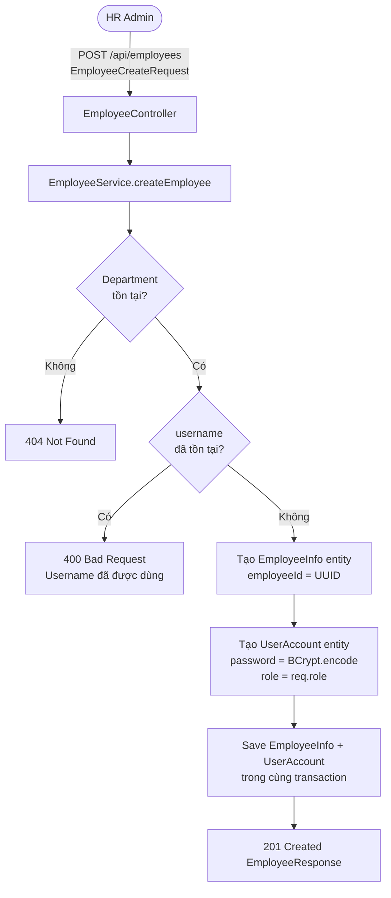

### 1.2 Biểu đồ Trình tự Tạo Nhân viên (Sequence Diagram)

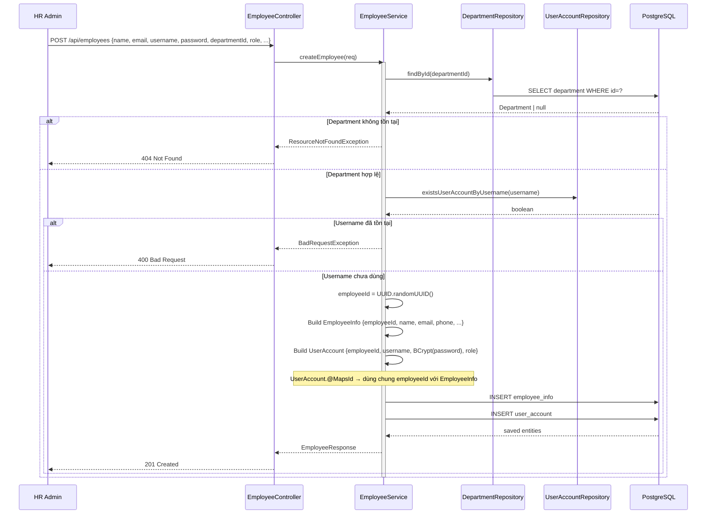

### 1.3 Luồng Cập nhật Nhân viên

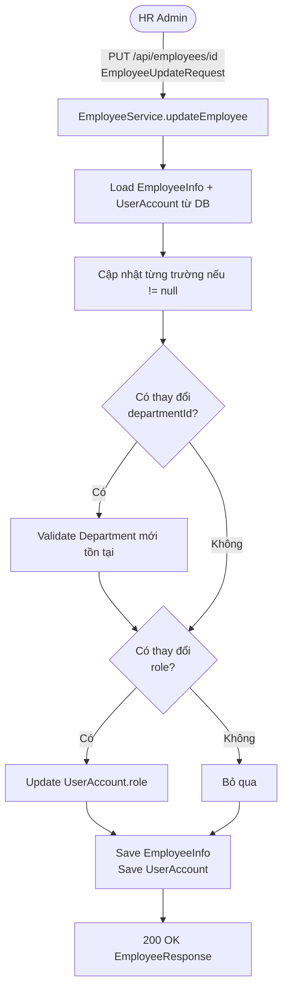

### 1.4 Luồng Xóa Nhân viên (Soft Delete)

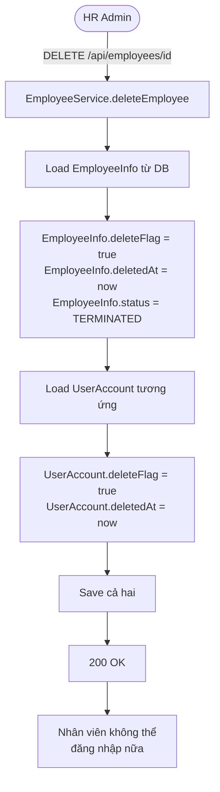

---

## 2. Luồng Upload Ảnh đại diện

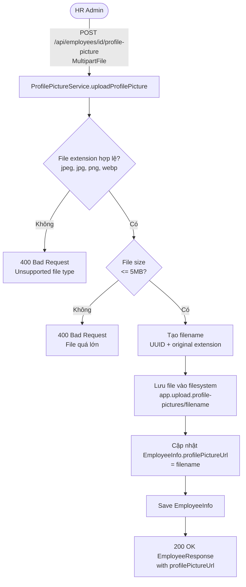

---

## 3. Luồng Quản lý Phòng ban

### 3.1 CRUD Phòng ban

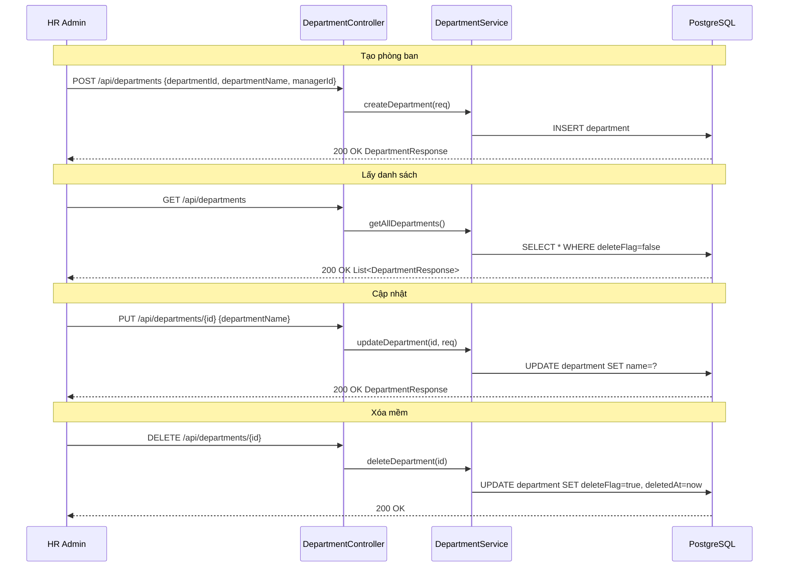

---

## 4. Luồng Quản lý Hợp đồng

### 4.1 Tạo Hợp đồng mới

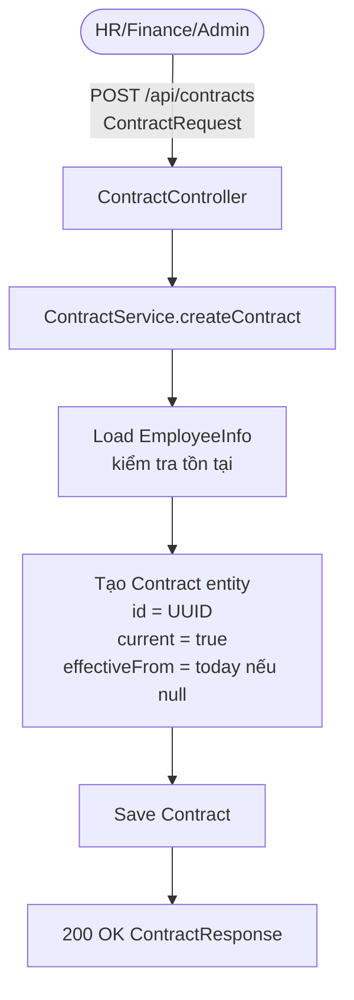

### 4.2 Cập nhật Hợp đồng — Version Control

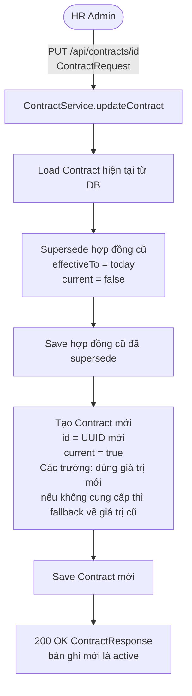

### 4.3 Biểu đồ Trình tự Toàn bộ Luồng Hợp đồng (Sequence Diagram)

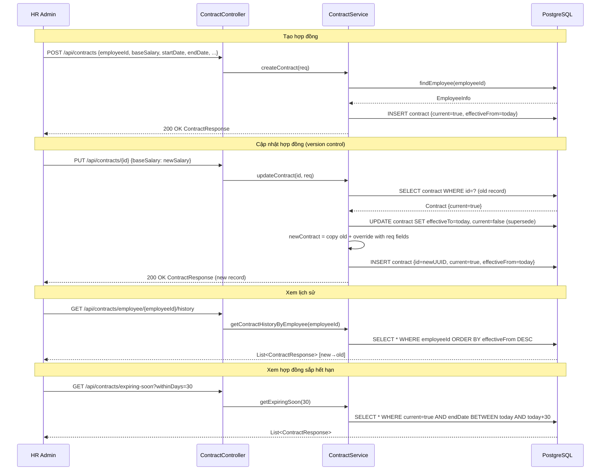

---

## 5. Luồng Cảnh báo Hợp đồng Sắp hết hạn (Scheduler)

### 5.1 Biểu đồ Luồng (Flowchart)

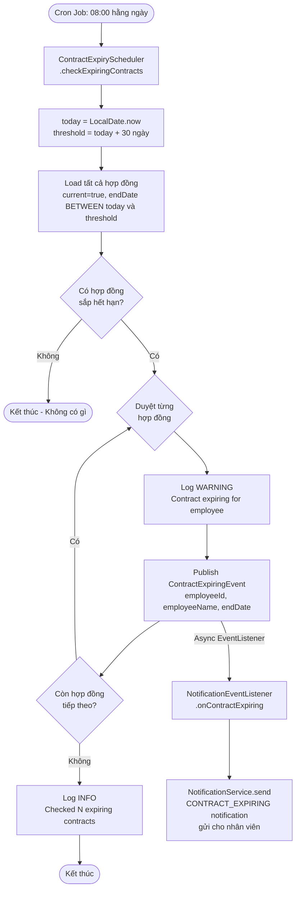

### 5.2 Biểu đồ Trình tự (Sequence Diagram)

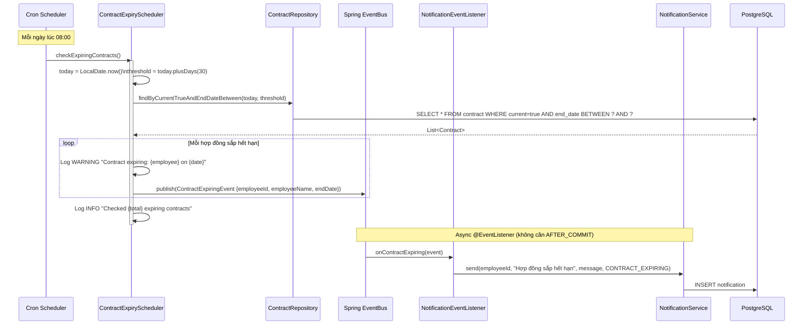

---

## 6. Biểu đồ Quan hệ Entity

```mermaid
erDiagram
    Department {
        string departmentId PK
        string departmentName
        string managerId FK
        boolean deleteFlag
        datetime deletedAt
    }

    EmployeeInfo {
        string employeeId PK
        string name
        string email
        string phone
        string departmentId FK
        enum status
        string nationalId
        string taxCode
        string socialInsuranceCode
        string bankAccount
        date dateOfJoining
        date dateOfBirth
        enum gender
        boolean deleteFlag
        datetime deletedAt
    }

    UserAccount {
        string employeeId PK_FK
        string username
        string passwordHash
        string lastPasswordHash
        enum role
        boolean deleteFlag
        datetime deletedAt
    }

    Contract {
        string id PK
        string employeeId FK
        date startDate
        date endDate
        date effectiveFrom
        date effectiveTo
        boolean current
        string contractType
        long baseSalary
        long insuranceBase
        string positionCode
        int salaryStep
        int dependentCount
        boolean deleteFlag
    }

    TaxDependent {
        string id PK
        string employeeId FK
        string fullName
        string nationalId
        date dateOfBirth
        string relationship
        boolean active
    }

    Department ||--o{ EmployeeInfo : "có nhiều"
    EmployeeInfo ||--|| UserAccount : "có 1 tài khoản"
    EmployeeInfo ||--o{ Contract : "có lịch sử hợp đồng"
    EmployeeInfo ||--o{ TaxDependent : "có người phụ thuộc"
    Department }o--o| EmployeeInfo : "có 1 quản lý"
```
