# Tài liệu Luồng Nghỉ phép & Tăng ca (Leave & OT Request Flow)

## Mục lục

1. [Tổng quan Quy trình Phê duyệt](#1-tổng-quan-quy-trình-phê-duyệt)
2. [Luồng Tạo Đơn Nghỉ phép](#2-luồng-tạo-đơn-nghỉ-phép)
3. [Luồng Phê duyệt / Từ chối Đơn Nghỉ phép](#3-luồng-phê-duyệt--từ-chối-đơn-nghỉ-phép)
4. [Luồng Tạo Đơn Tăng ca (OT)](#4-luồng-tạo-đơn-tăng-ca-ot)
5. [Luồng Phê duyệt / Từ chối Đơn Tăng ca](#5-luồng-phê-duyệt--từ-chối-đơn-tăng-ca)
6. [Biểu đồ Trạng thái Chung](#6-biểu-đồ-trạng-thái-chung)
7. [Quản lý Số dư Nghỉ phép](#7-quản-lý-số-dư-nghỉ-phép)

---

## 1. Tổng quan Quy trình Phê duyệt

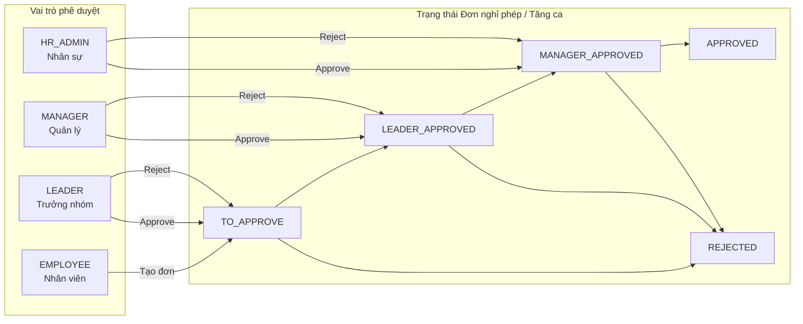

---

## 2. Luồng Tạo Đơn Nghỉ phép

### 2.1 Biểu đồ Luồng (Flowchart)

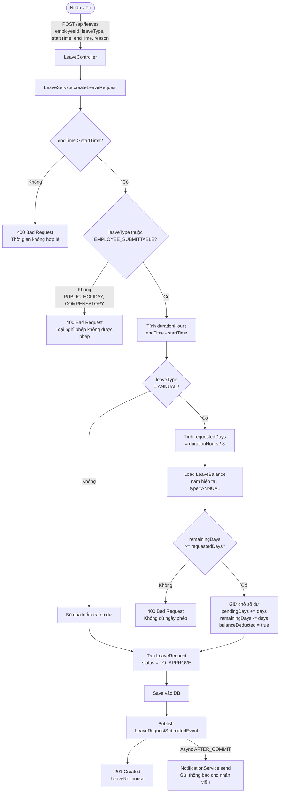

### 2.2 Biểu đồ Trình tự (Sequence Diagram)

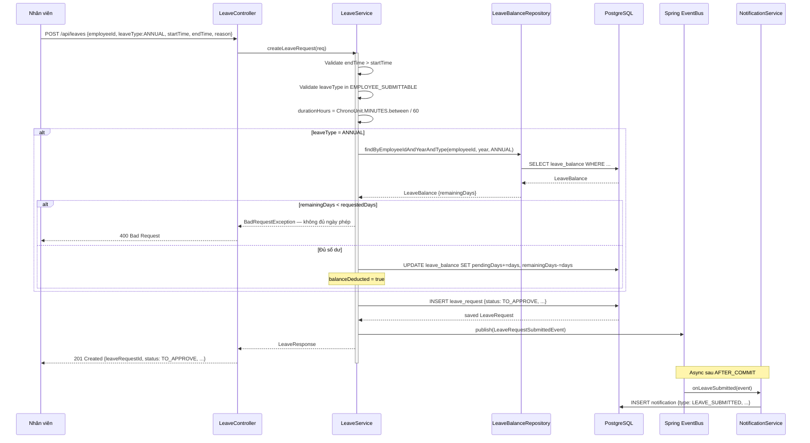

---

## 3. Luồng Phê duyệt / Từ chối Đơn Nghỉ phép

### 3.1 Biểu đồ Luồng Phê duyệt (Flowchart)

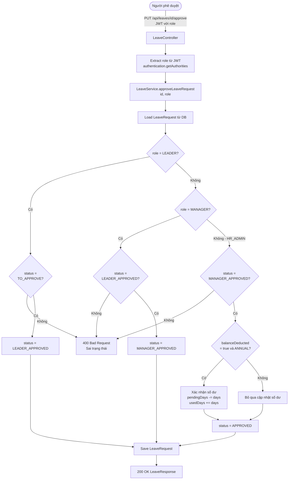

### 3.2 Biểu đồ Luồng Từ chối (Flowchart)

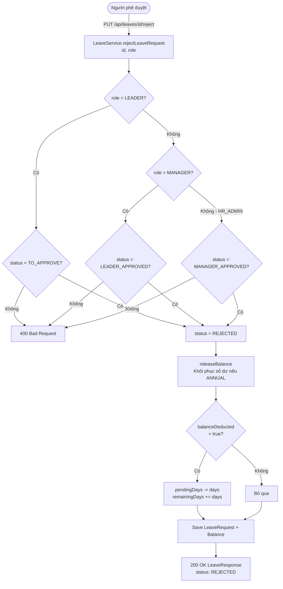

### 3.3 Biểu đồ Trình tự Phê duyệt 3 cấp (Sequence Diagram)

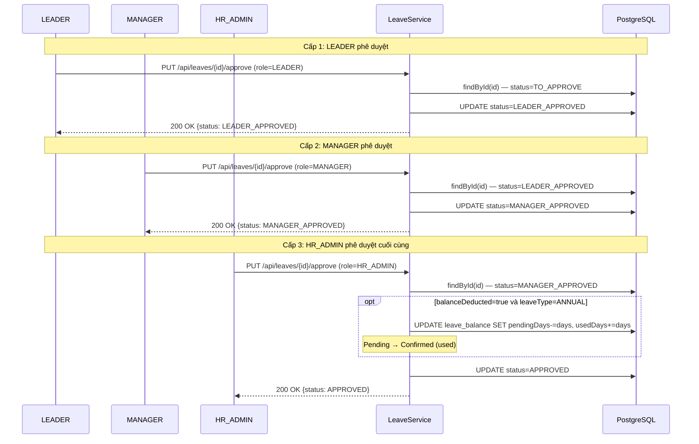

---

## 4. Luồng Tạo Đơn Tăng ca (OT)

### 4.1 Biểu đồ Luồng (Flowchart)

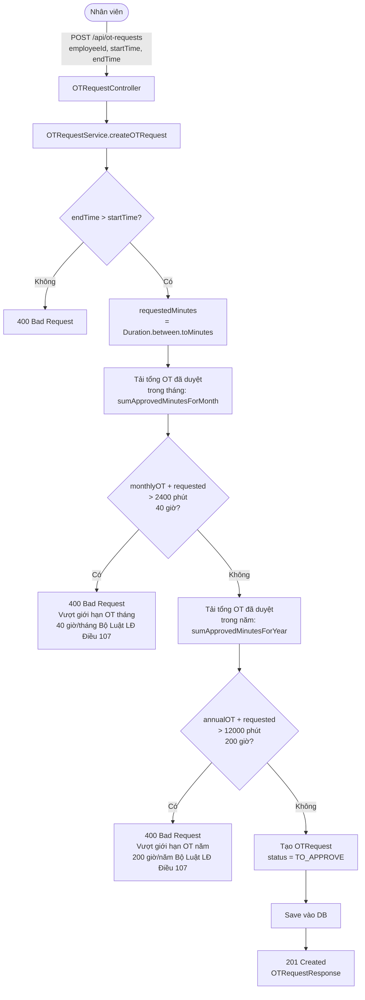

### 4.2 Biểu đồ Trình tự (Sequence Diagram)

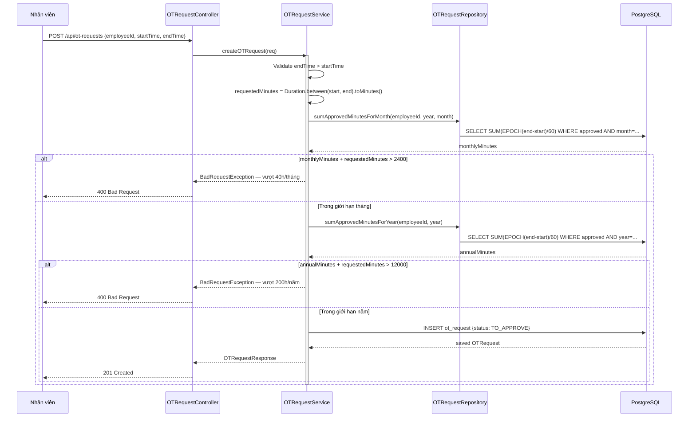

---

## 5. Luồng Phê duyệt / Từ chối Đơn Tăng ca

### 5.1 Biểu đồ Trình tự 3 cấp (Sequence Diagram)

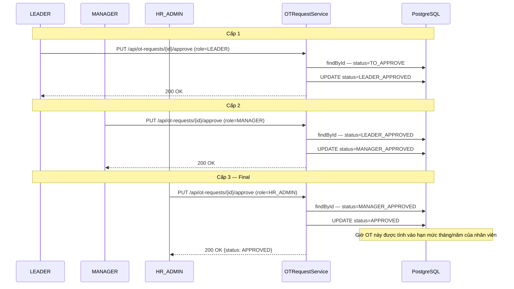

---

## 6. Biểu đồ Trạng thái Chung

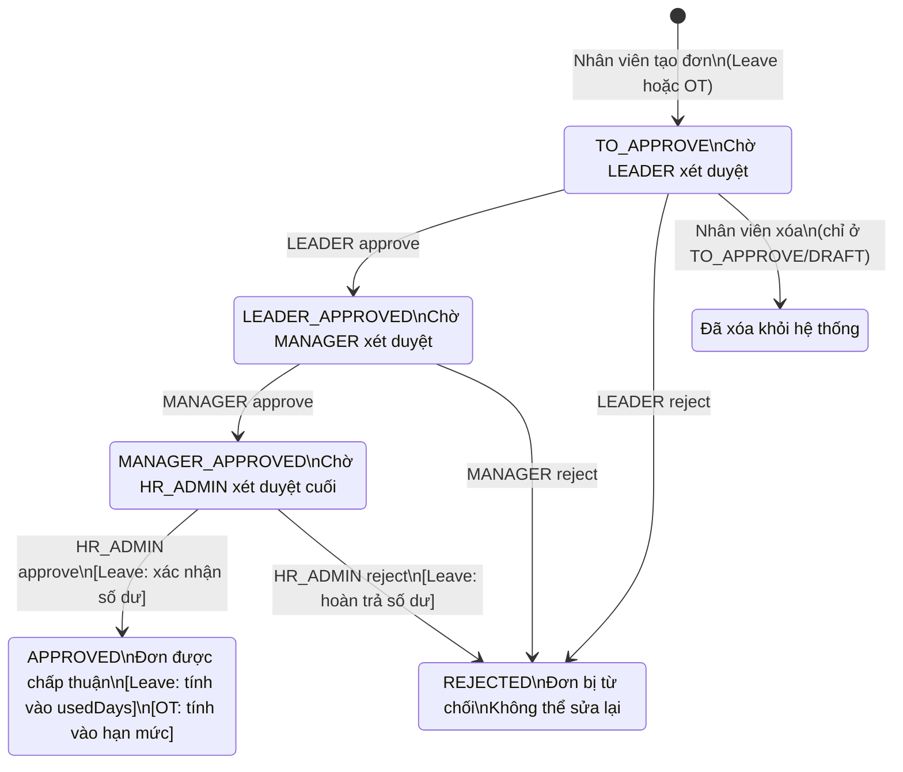

---

## 7. Quản lý Số dư Nghỉ phép

### 7.1 Vòng đời Số dư Nghỉ phép Năm (ANNUAL)

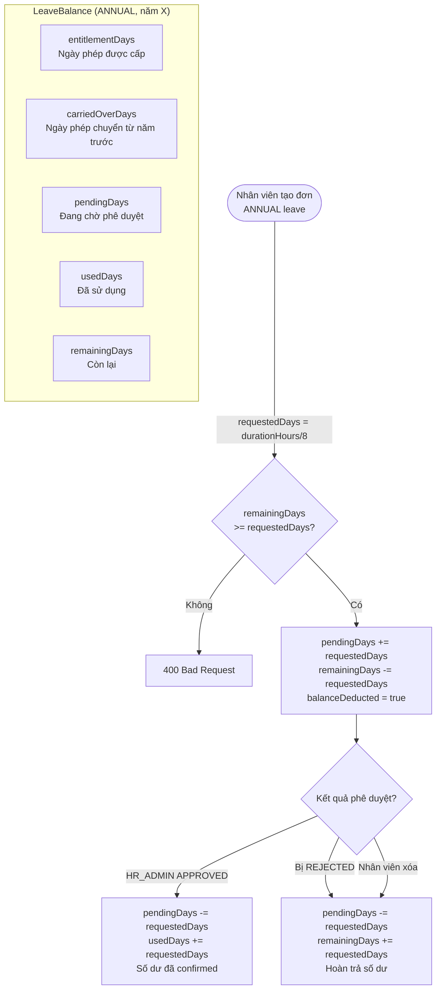

### 7.2 Các loại Nghỉ phép

| LeaveType | Nhân viên tạo | Kiểm tra số dư | Nguồn |
|-----------|:---:|:---:|---|
| `ANNUAL` | Có | Có | Phép năm cấp theo hợp đồng |
| `SICK` | Có | Không | Nghỉ ốm |
| `MATERNITY` | Có | Không | Thai sản |
| `PATERNITY` | Có | Không | Nghỉ chăm con |
| `BEREAVEMENT` | Có | Không | Tang chế |
| `MARRIAGE` | Có | Không | Nghỉ cưới |
| `UNPAID` | Có | Không | Nghỉ không lương |
| `PUBLIC_HOLIDAY` | Không (system) | Không | Ngày lễ quốc gia |
| `COMPENSATORY` | Không (system) | Không | Nghỉ bù |
