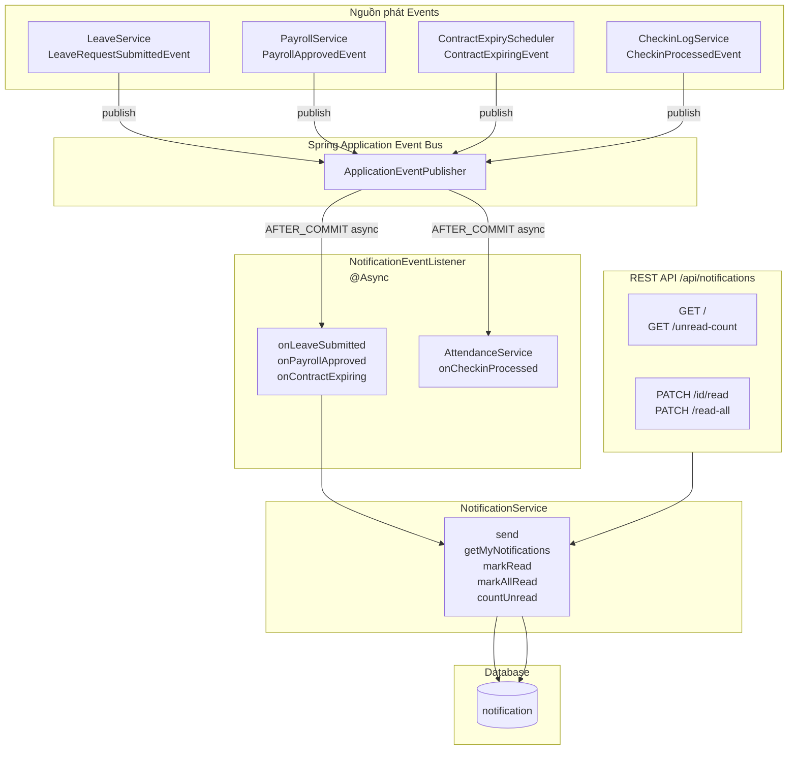
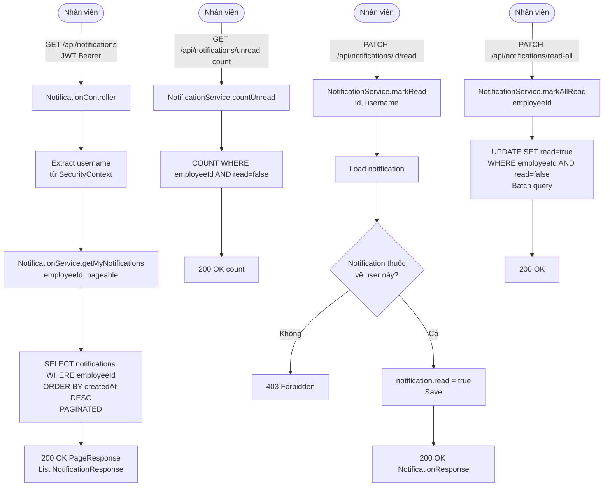
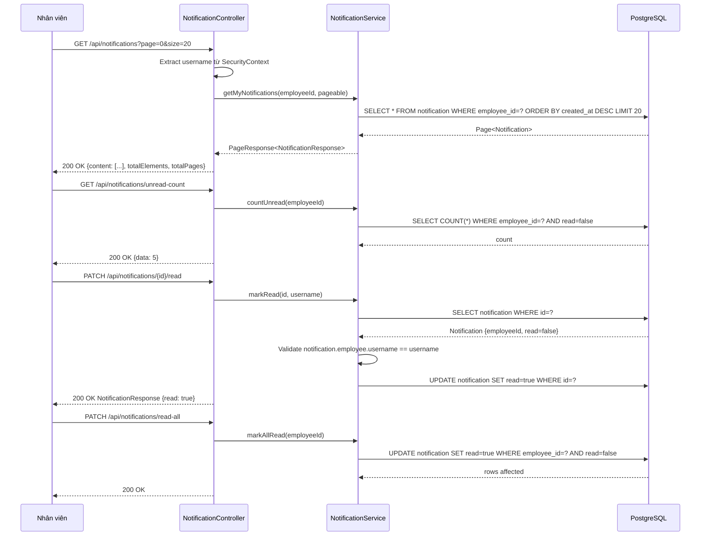
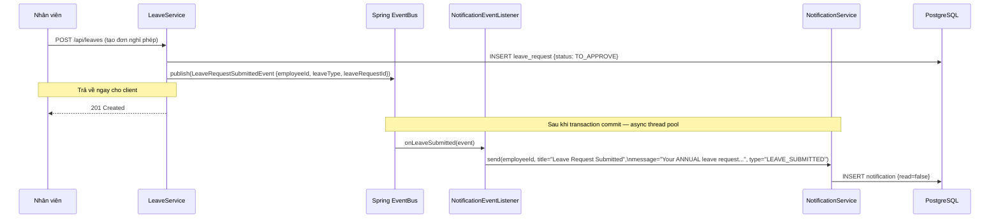
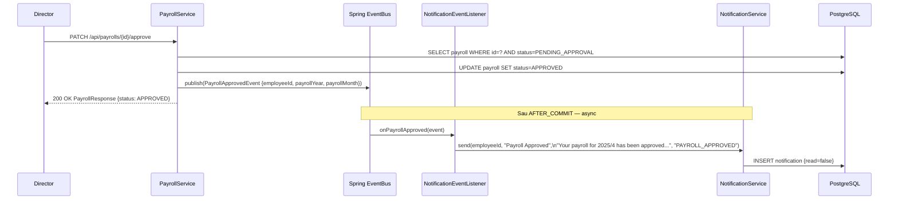
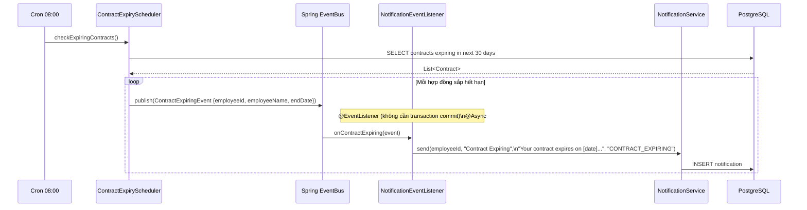
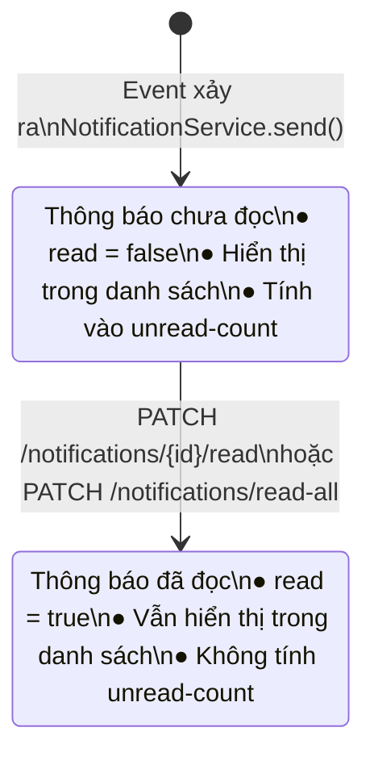

# Tài liệu Luồng Thông báo (Notification Flow)

## Mục lục

1. [Tổng quan Hệ thống Thông báo](#1-tổng-quan-hệ-thống-thông-báo)
2. [Luồng Gửi Thông báo qua Spring Events](#2-luồng-gửi-thông-báo-qua-spring-events)
3. [Luồng Xem & Đánh dấu Đã đọc](#3-luồng-xem--đánh-dấu-đã-đọc)
4. [Biểu đồ Trình tự cho từng Event](#4-biểu-đồ-trình-tự-cho-từng-event)
5. [Biểu đồ Trạng thái Thông báo](#5-biểu-đồ-trạng-thái-thông-báo)

---

## 1. Tổng quan Hệ thống Thông báo



---

## 2. Luồng Gửi Thông báo qua Spring Events

### 2.1 Biểu đồ Luồng tổng quát (Flowchart)

```mermaid
flowchart TD
    A[Business Action\nvd: tạo đơn nghỉ phép] --> B[Service xử lý\n+ Publish ApplicationEvent]
    B --> C[ApplicationEventPublisher.publishEvent\nevent object]
    C --> D{Transaction\nPhase?}
    D -->|AFTER_COMMIT\nLeave, Payroll, Checkin| E[Sau khi transaction commit\nmới xử lý event]
    D -->|@EventListener mặc định\nContract| F[Xử lý ngay trong thread\nScheduler không có transaction]
    E --> G[NotificationEventListener\n@Async - chạy trên thread pool riêng]
    F --> G
    G --> H[NotificationService.send\nemployeeId, title, message, type]
    H --> I[Tạo Notification entity\nnotificationId = UUID\nread = false]
    I --> J[Save vào DB]
```

### 2.2 Bảng Event và Thông báo tương ứng

| Event | Publisher | Trigger | Loại Listener | Thông báo |
|---|---|---|---|---|
| `LeaveRequestSubmittedEvent` | LeaveService | Nhân viên tạo đơn nghỉ | `@TransactionalEventListener(AFTER_COMMIT)` | "Your [type] leave request has been submitted and is pending approval." |
| `PayrollApprovedEvent` | PayrollService | DIRECTOR approve payroll | `@TransactionalEventListener(AFTER_COMMIT)` | "Your payroll for [year]/[month] has been approved. Your payslip is now available." |
| `ContractExpiringEvent` | ContractExpiryScheduler | Cron hàng ngày 08:00 | `@EventListener` | "Your employment contract expires on [date]. Please contact HR to discuss renewal." |
| `CheckinProcessedEvent` | CheckinLogService | Thiết bị gửi check-in | `@TransactionalEventListener(AFTER_COMMIT)` | Xử lý Attendance (không tạo notification) |

---

## 3. Luồng Xem & Đánh dấu Đã đọc

### 3.1 Biểu đồ Luồng (Flowchart)



### 3.2 Biểu đồ Trình tự (Sequence Diagram)



---

## 4. Biểu đồ Trình tự cho từng Event

### 4.1 LeaveRequestSubmittedEvent



### 4.2 PayrollApprovedEvent



### 4.3 ContractExpiringEvent



---

## 5. Biểu đồ Trạng thái Thông báo


