# Tài liệu Luồng Tính lương (Payroll Flow)

## Mục lục

1. [Tổng quan Module Lương](#1-tổng-quan-module-lương)
2. [Luồng Tính lương Đơn lẻ](#2-luồng-tính-lương-đơn-lẻ)
3. [Luồng Tính lương Hàng loạt Bất đồng bộ](#3-luồng-tính-lương-hàng-loạt-bất-đồng-bộ)
4. [Luồng Phê duyệt Bảng lương](#4-luồng-phê-duyệt-bảng-lương)
5. [Luồng Tính lương Tự động (Scheduler)](#5-luồng-tính-lương-tự-động-scheduler)
6. [Công thức Tính lương Chi tiết](#6-công-thức-tính-lương-chi-tiết)
7. [Luồng Cấu hình Hệ thống (SystemConfig)](#7-luồng-cấu-hình-hệ-thống-systemconfig)
8. [Biểu đồ Trạng thái Payroll](#8-biểu-đồ-trạng-thái-payroll)

---

## 1. Tổng quan Module Lương

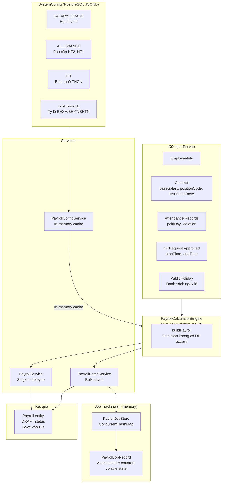

---

## 2. Luồng Tính lương Đơn lẻ

### 2.1 Biểu đồ Luồng (Flowchart)

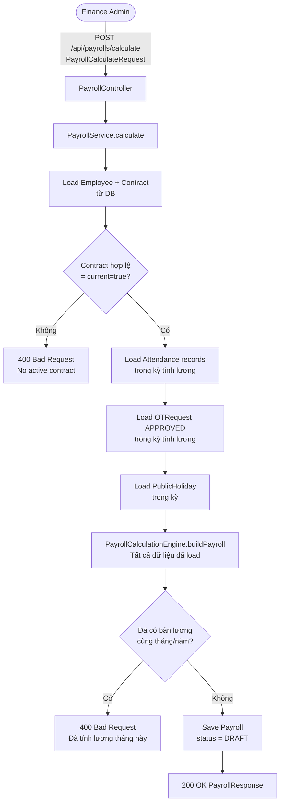

### 2.2 Biểu đồ Trình tự (Sequence Diagram)

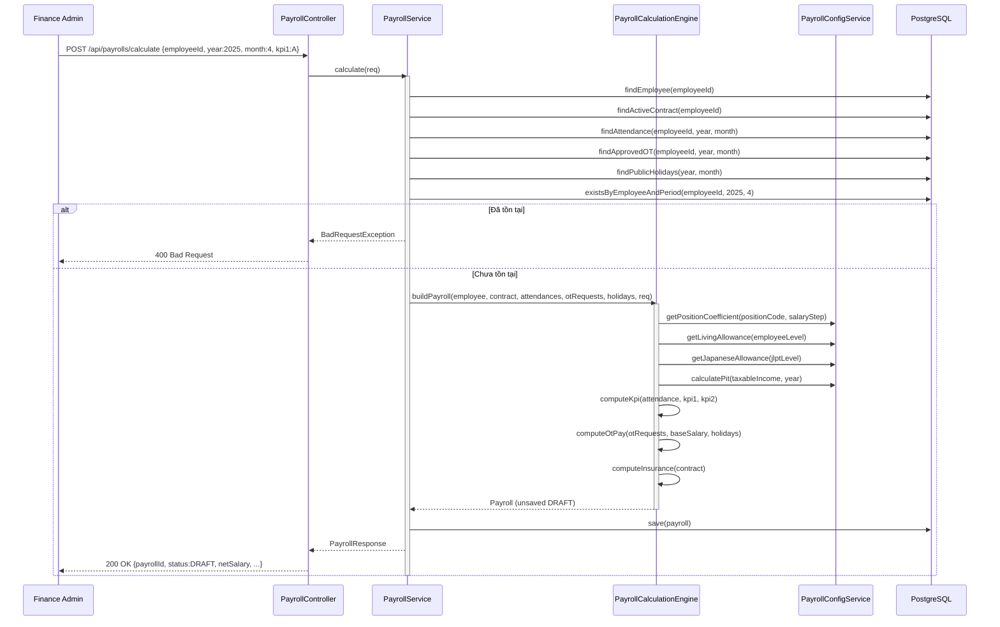

---

## 3. Luồng Tính lương Hàng loạt Bất đồng bộ

### 3.1 Biểu đồ Luồng Tổng thể (Flowchart)

```mermaid
flowchart TD
    A([Finance Admin]) -->|POST /api/payrolls/batch-calculate\nyear, month, standardWorkingDays| B[PayrollController]
    B --> C[PayrollBatchService.triggerBatch\nChạy trên HTTP thread]
    C --> D[PayrollJobStore.createJob\njobId = UUID\nstate = PENDING]
    D --> E[Gọi batchService.runBatch\ntrên INJECTED bean qua proxy]
    E --> F[202 Accepted\njobId trả về ngay]
    F --> G([Finance Admin polling\nGET /api/payrolls/jobs/jobId])

    E -->|@Async payrollExecutor\nThread pool riêng| H[PayrollBatchService.runBatch]
    H --> I[job.state = RUNNING\njob.startedAt = now]
    I --> J[Load tất cả Employee ACTIVE\n1 query]
    J --> K{Có nhân viên?}
    K -->|Không| L[job.state = COMPLETED]
    K -->|Có| M[Load IDs đã tính lương\ntrong tháng - 1 query]
    M --> N[Bulk load tất cả dữ liệu\n4 queries: contracts, attendance, OT, holidays]
    N --> O{Duyệt từng nhân viên\ntrong memory}
    O --> P{Đã tính lương?}
    P -->|Có| Q[job.skipped++]
    P -->|Không| R{Contract hợp lệ?}
    R -->|Không| S[job.failedCount++\njob.errors.add]
    R -->|Có| T[PayrollCalculationEngine.buildPayroll\nno DB call]
    T --> U{Exception?}
    U -->|Có| S
    U -->|Không| V[payrolls.add\njob.succeeded++]
    Q --> W{Còn nhân viên?}
    S --> W
    V --> W
    W -->|Có| O
    W -->|Không| X[payrollRepository.saveAll\n1 batch insert]
    X --> Y[job.state = COMPLETED\njob.completedAt = now]
    Y --> Z([Finance Admin xem kết quả\nGET /api/payrolls/jobs/jobId])
```

### 3.2 Biểu đồ Trình tự Chi tiết (Sequence Diagram)

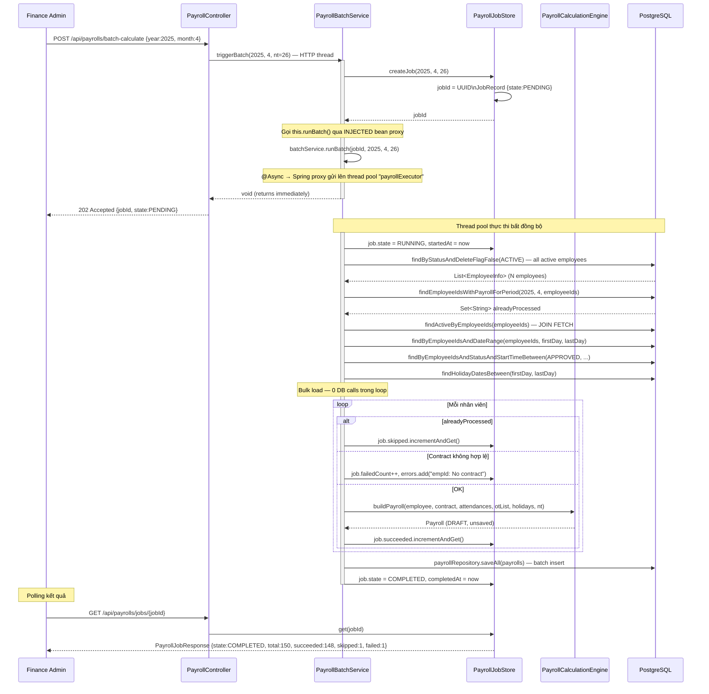

### 3.3 Thread Safety của Job Record

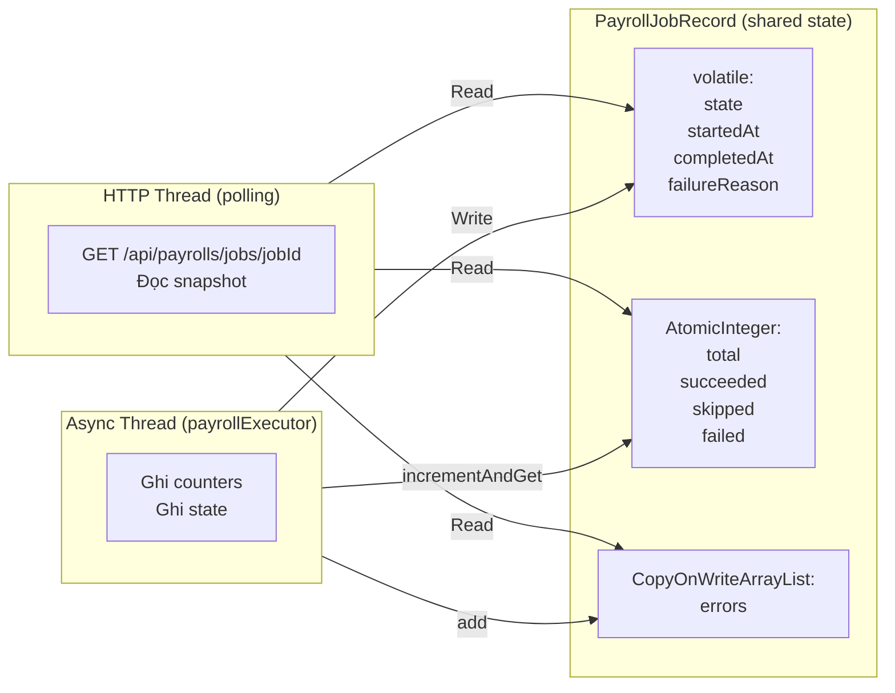

---

## 4. Luồng Phê duyệt Bảng lương

### 4.1 Biểu đồ Luồng (Flowchart)

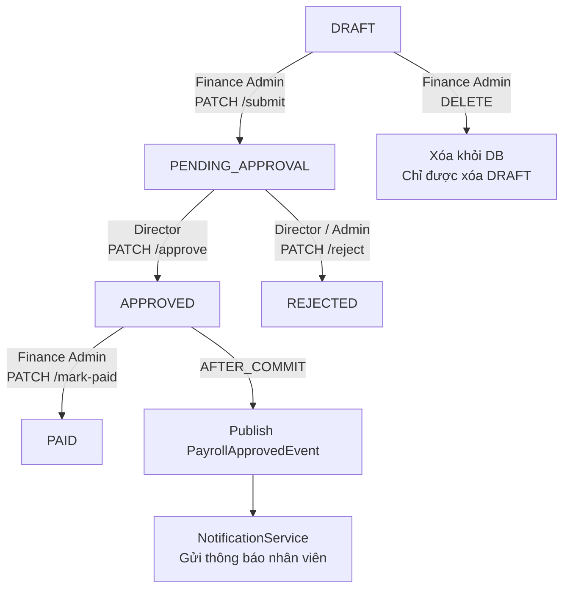

### 4.2 Biểu đồ Trình tự (Sequence Diagram)

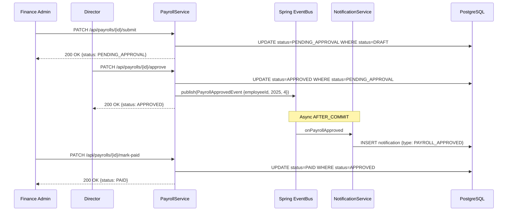

---

## 5. Luồng Tính lương Tự động (Scheduler)

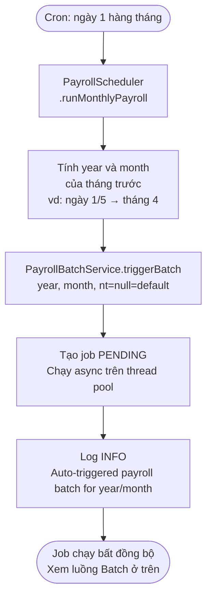

---

## 6. Công thức Tính lương Chi tiết

### 6.1 Công thức Lương Gộp (Gross Salary)

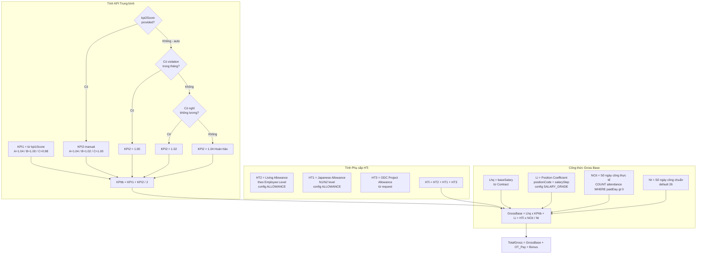

### 6.2 Công thức Tính lương OT

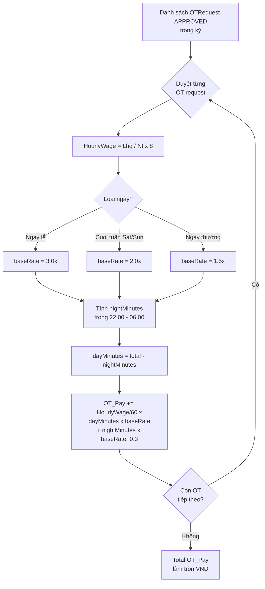

### 6.3 Công thức Bảo hiểm & Thuế TNCN

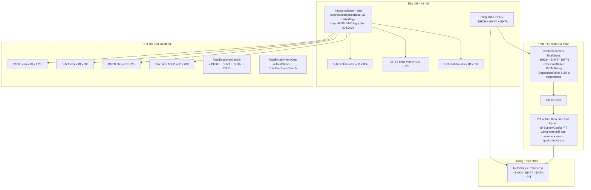

---

## 7. Luồng Cấu hình Hệ thống (SystemConfig)

### 7.1 Tổng quan SystemConfig

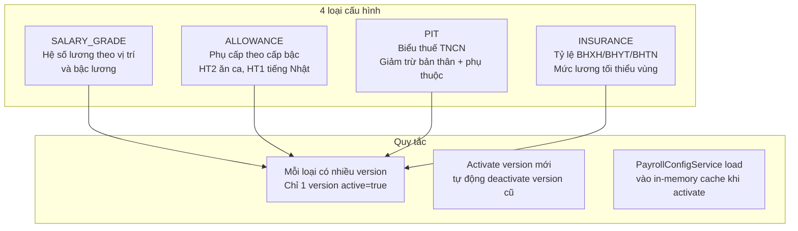

### 7.2 Luồng Kích hoạt Cấu hình mới

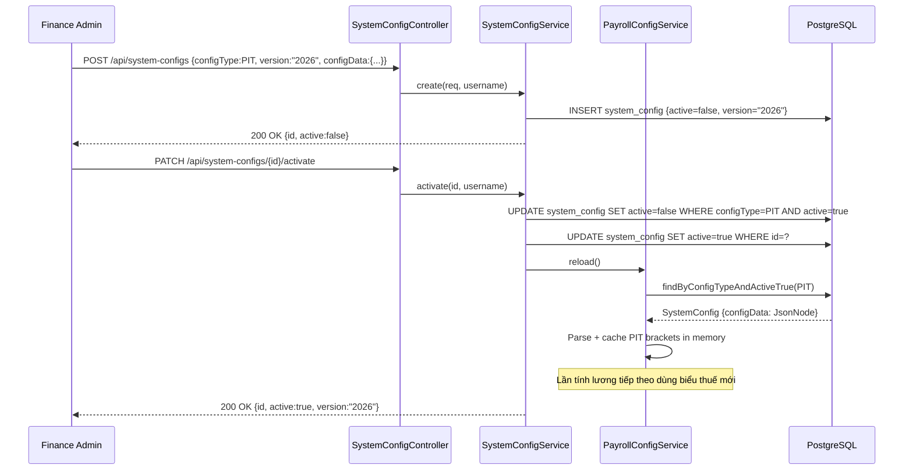

---

## 8. Biểu đồ Trạng thái Payroll

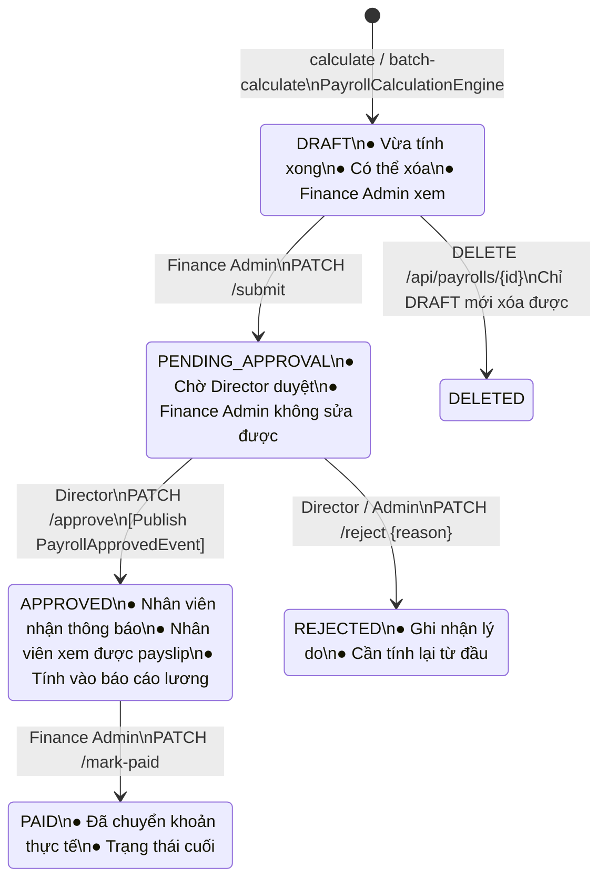
