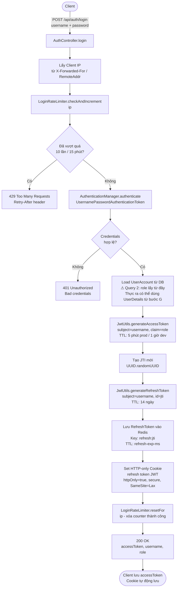
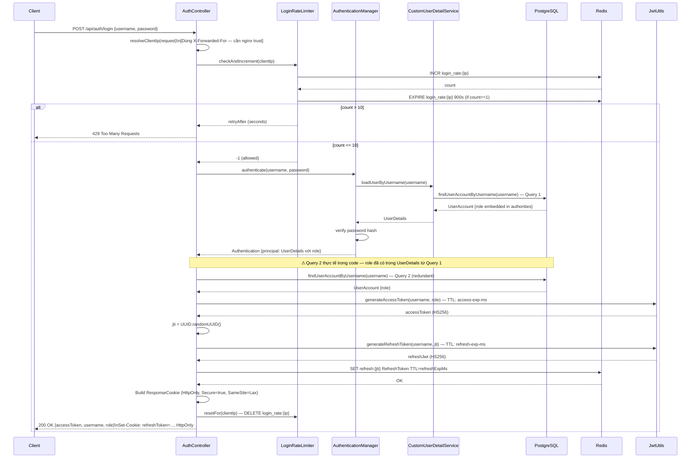
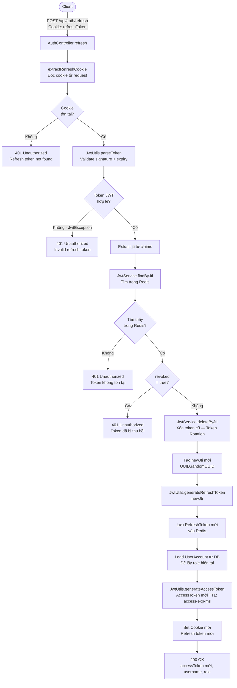
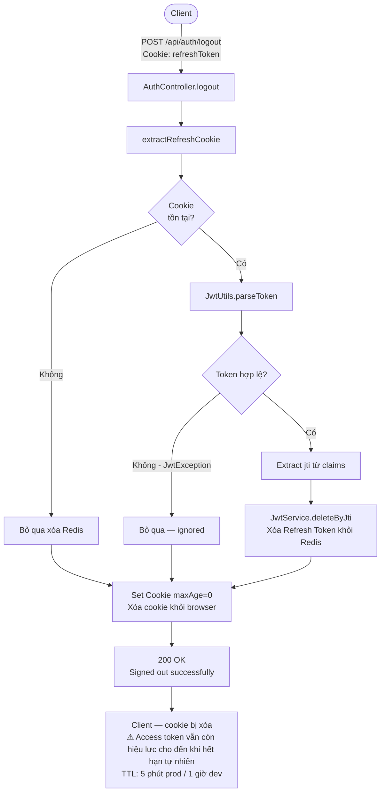
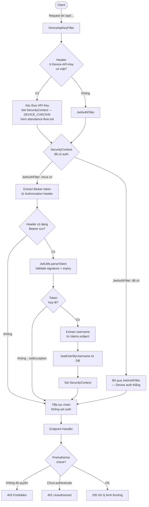
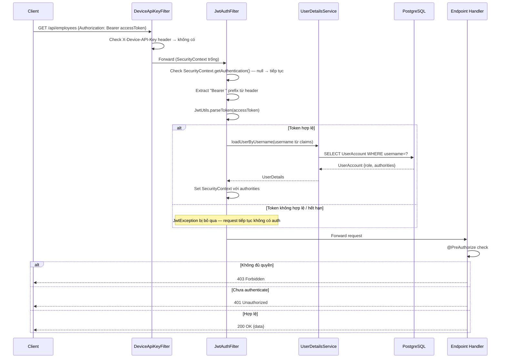
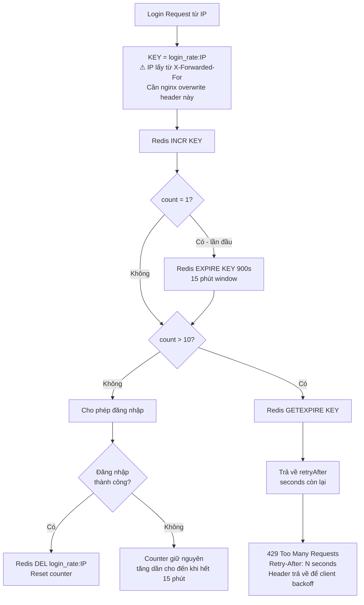
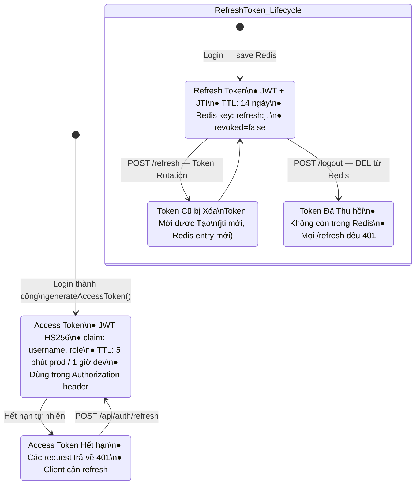

# Tài liệu Luồng Xác thực & Phân quyền (Auth Flow) — v2

> **Thay đổi so với v1:** Làm rõ hành vi khi cả hai filter header cùng có mặt; ghi chú access token TTL sau logout; annotate double DB query trong login; bổ sung giả định infrastructure cho rate limiting.

## Mục lục

1. [Tổng quan & Giả định Infrastructure](#1-tổng-quan--giả-định-infrastructure)
2. [Luồng Đăng nhập (Login)](#2-luồng-đăng-nhập-login)
3. [Luồng Làm mới Token (Refresh)](#3-luồng-làm-mới-token-refresh)
4. [Luồng Đăng xuất (Logout)](#4-luồng-đăng-xuất-logout)
5. [Luồng Xử lý Request được Bảo vệ](#5-luồng-xử-lý-request-được-bảo-vệ)
6. [Cơ chế Rate Limiting](#6-cơ-chế-rate-limiting)
7. [Biểu đồ Trạng thái Token](#7-biểu-đồ-trạng-thái-token)
8. [Giới hạn Đã biết](#8-giới-hạn-đã-biết)

---

## 1. Tổng quan & Giả định Infrastructure

```mermaid
graph TB
    subgraph Client["Client (Browser / Mobile)"]
        REQ[HTTP Request]
        COOKIE[HTTP-only Cookie\nrefresh_token JWT]
        HEADER[Authorization Header\nBearer accessToken]
    end

    subgraph Filters["Filter Chain — Thứ tự ưu tiên"]
        DKAF["1. DeviceApiKeyFilter\nChỉ active nếu có X-Device-API-Key header\nNếu set SecurityContext → JwtAuthFilter bỏ qua"]
        JWTF["2. JwtAuthFilter\nChỉ chạy nếu SecurityContext còn trống"]
    end

    subgraph Auth["Auth Endpoints /api/auth"]
        LOGIN[POST /login]
        REFRESH[POST /refresh]
        LOGOUT[POST /logout]
        ME[GET /me]
        CHPWD[PUT /change-password]
    end

    subgraph Security["Security Layer"]
        RL[LoginRateLimiter\nRedis counter per IP]
        AM[AuthenticationManager\nValidate credentials]
        SC[SecurityContext\nHold principal]
    end

    subgraph Storage["Storage"]
        REDIS[(Redis\nrefresh:{jti}\nlogin_rate:{ip})]
        DB[(PostgreSQL\nUserAccount)]
    end

    REQ --> DKAF --> JWTF --> Auth
    LOGIN --> RL --> AM --> REDIS
    REFRESH --> REDIS
    LOGOUT --> REDIS
    JWTF --> SC
    AM --> DB
```

> **Giả định Infrastructure:**
> - **Single-instance deployment.** Nếu scale horizontally, Redis rate limiter vẫn hoạt động đúng (shared state), nhưng không có thêm thay đổi cần thiết.
> - **Rate limiting dùng `X-Forwarded-For`.** Cần có nginx/load balancer cấu hình `proxy_set_header X-Forwarded-For $remote_addr` (overwrite, không append) để tránh client tự set header giả mạo. Nếu không có proxy, cần đổi sang `RemoteAddr` only.
> - **Filter chain conflict:** Nếu request có cả `X-Device-API-Key` lẫn `Authorization: Bearer`, `DeviceApiKeyFilter` chạy trước và set SecurityContext → `JwtAuthFilter` kiểm tra `SecurityContext.getAuthentication() != null` nên bỏ qua. **Device auth luôn thắng.**

---

## 2. Luồng Đăng nhập (Login)

### 2.1 Biểu đồ Luồng (Flowchart)



### 2.2 Biểu đồ Trình tự (Sequence Diagram)



---

## 3. Luồng Làm mới Token (Refresh)

### 3.1 Biểu đồ Luồng (Flowchart)



### 3.2 Biểu đồ Trình tự (Sequence Diagram)

```mermaid
sequenceDiagram
    participant C as Client
    participant CTL as AuthController
    participant JWT as JwtUtils
    participant REDIS as Redis
    participant DB as PostgreSQL

    C->>CTL: POST /api/auth/refresh (Cookie: refreshToken=oldRefreshJwt)
    CTL->>CTL: extractRefreshCookie(request)

    alt Cookie không tồn tại
        CTL-->>C: 401 Refresh token not found
    else Cookie tồn tại
        CTL->>JWT: parseToken(oldRefreshJwt)

        alt JWT không hợp lệ hoặc hết hạn
            JWT-->>CTL: JwtException
            CTL-->>C: 401 Invalid refresh token
        else JWT hợp lệ
            JWT-->>CTL: Claims {sub=username, jti=oldJti}

            CTL->>REDIS: GET refresh:{oldJti}
            REDIS-->>CTL: RefreshToken | null

            alt Không tìm thấy
                CTL-->>C: 401 Invalid refresh token
            else Tìm thấy
                alt revoked = true
                    CTL-->>C: 401 Token has been revoked
                else revoked = false
                    Note over CTL,REDIS: Token Rotation
                    CTL->>REDIS: DEL refresh:{oldJti}

                    CTL->>CTL: newJti = UUID.randomUUID()
                    CTL->>JWT: generateRefreshToken(username, newJti)
                    JWT-->>CTL: newRefreshJwt

                    CTL->>REDIS: SET refresh:{newJti} RefreshToken TTL=refreshExpMs

                    CTL->>DB: findUserAccountByUsername(username) — lấy role hiện tại
                    DB-->>CTL: UserAccount {role}

                    CTL->>JWT: generateAccessToken(username, role)
                    JWT-->>CTL: newAccessToken

                    CTL-->>C: 200 OK {accessToken, username, role}\nSet-Cookie: refreshToken=newRefreshJwt; HttpOnly
                end
            end
        end
    end
```

---

## 4. Luồng Đăng xuất (Logout)

### 4.1 Biểu đồ Luồng (Flowchart)



### 4.2 Biểu đồ Trình tự (Sequence Diagram)

```mermaid
sequenceDiagram
    participant C as Client
    participant CTL as AuthController
    participant JWT as JwtUtils
    participant REDIS as Redis

    C->>CTL: POST /api/auth/logout (Cookie: refreshToken=refreshJwt)
    CTL->>CTL: extractRefreshCookie(request)

    opt Cookie tồn tại
        CTL->>JWT: parseToken(refreshJwt)
        opt JWT hợp lệ
            JWT-->>CTL: Claims {jti}
            CTL->>REDIS: DEL refresh:{jti}
            REDIS-->>CTL: OK
        end
        Note over CTL: JwtException bị bỏ qua (ignored)
    end

    CTL->>CTL: Build ResponseCookie maxAge=0 (clear cookie)
    CTL-->>C: 200 OK {message: "Signed out successfully"}\nSet-Cookie: refreshToken=; Max-Age=0

    Note over C: Refresh token đã bị revoke trên server.\nAccess token còn sống đến hết TTL (5 phút prod).\nRủi ro chấp nhận được với TTL ngắn.
```

---

## 5. Luồng Xử lý Request được Bảo vệ

### 5.1 Biểu đồ Luồng (Flowchart) — Kể cả conflict case



### 5.2 Biểu đồ Trình tự (Sequence Diagram)



---

## 6. Cơ chế Rate Limiting



---

## 7. Biểu đồ Trạng thái Token



---

## 8. Giới hạn Đã biết

| Giới hạn | Mô tả | Mức độ rủi ro | Ghi chú |
|---|---|---|---|
| **Access token sau logout** | Sau khi logout, access token vẫn hiệu lực đến hết TTL (5 phút prod). Refresh token đã bị revoke — không cấp mới được. | Thấp | Chấp nhận được với TTL 5 phút. Nếu cần mức độ bảo mật cao hơn, cần blacklist access token trong Redis. |
| **Double DB query trong login** | `AuthController` load `UserAccount` 2 lần: lần 1 qua `AuthenticationManager`, lần 2 trực tiếp để lấy role. Role đã có trong `UserDetails` từ lần 1. | Thấp | Ảnh hưởng performance nhỏ, không ảnh hưởng security. |
| **X-Forwarded-For spoofing** | Nếu không có proxy đáng tin cậy phía trước, client có thể set header này để bypass rate limiting. | Trung bình | Cần nginx cấu hình `proxy_set_header X-Forwarded-For $remote_addr` (overwrite mode). |
| **Filter conflict không document rõ** | Khi cả hai header cùng có mặt, DeviceApiKeyFilter thắng do chạy trước và set SecurityContext. | Thấp | Hành vi đúng, đã document ở section 1 và 5. |

---

## Tóm tắt Cấu trúc JWT

| Trường | Access Token | Refresh Token |
|--------|-------------|---------------|
| `sub` | username | username |
| `roles` | tên Role | _(không có)_ |
| `jti` | _(không có)_ | UUID (tracking rotation) |
| `iat` | thời điểm tạo | thời điểm tạo |
| `exp` | `now + 5 phút (prod)` | `now + 14 ngày` |
| Thuật toán | HS256 | HS256 |
| Lưu ở đâu | Response body | HTTP-only Cookie |
| Lưu server | Không (stateless) | Redis: `refresh:{jti}` |
