# Tài liệu Luồng Nhân viên, Phòng ban & Hợp đồng — v2

> **Thay đổi so với v1:** Ghi rõ giả định single-instance cho upload file; thêm ghi chú về audit trail qua `AuditableEntity`; document giới hạn contract scheduler (duplicate notification hàng ngày); ghi nhận không validate circular reference và không validate active employees khi xóa phòng ban.

## Mục lục

1. [Luồng Quản lý Nhân viên](#1-luồng-quản-lý-nhân-viên)
2. [Luồng Upload Ảnh đại diện](#2-luồng-upload-ảnh-đại-diện)
3. [Luồng Quản lý Phòng ban](#3-luồng-quản-lý-phòng-ban)
4. [Luồng Quản lý Hợp đồng](#4-luồng-quản-lý-hợp-đồng)
5. [Luồng Cảnh báo Hợp đồng Sắp hết hạn (Scheduler)](#5-luồng-cảnh-báo-hợp-đồng-sắp-hết-hạn-scheduler)
6. [Biểu đồ Quan hệ Entity](#6-biểu-đồ-quan-hệ-entity)
7. [Giới hạn Đã biết](#7-giới-hạn-đã-biết)

---

## 1. Luồng Quản lý Nhân viên

> **Audit trail:** `EmployeeInfo` và `UserAccount` kế thừa `AuditableEntity` — tất cả thao tác Create/Update đều tự động lưu `createdBy`, `updatedBy`, `createdAt`, `updatedAt` qua Spring Data JPA Auditing. `AuditorAwareImpl` lấy username từ `SecurityContext` (fallback "system" cho cron job).

### 1.1 Tạo Nhân viên mới

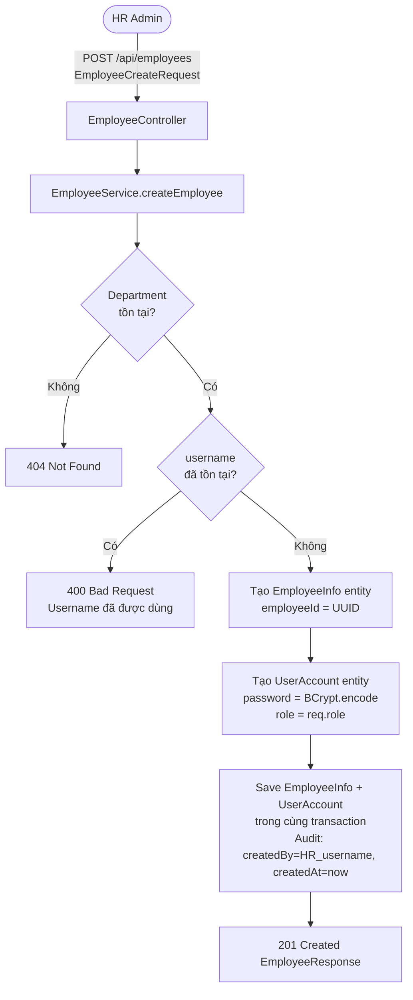

### 1.2 Biểu đồ Trình tự Tạo Nhân viên (Sequence Diagram)

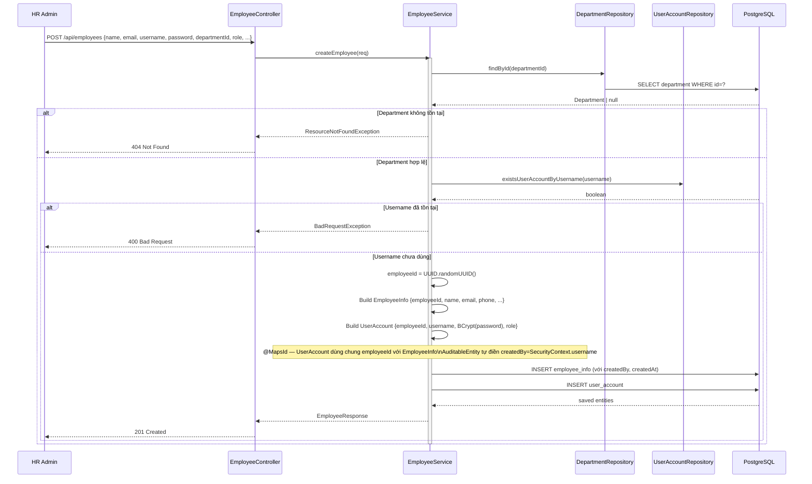

### 1.3 Luồng Cập nhật Nhân viên

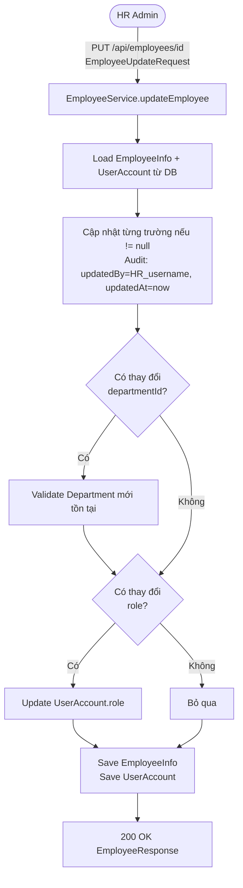

### 1.4 Luồng Xóa Nhân viên (Soft Delete)

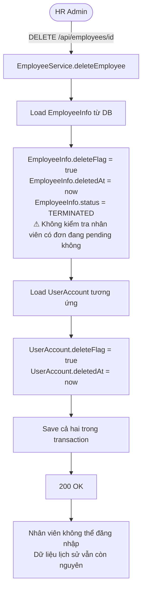

---

## 2. Luồng Upload Ảnh đại diện

> **Giả định:** File lưu trên local filesystem (`app.upload.profile-pictures/`). Phù hợp với **single-instance deployment**. Nếu scale horizontally (nhiều instance), các instance khác không chia sẻ được filesystem → cần object storage (S3, MinIO, GCS).

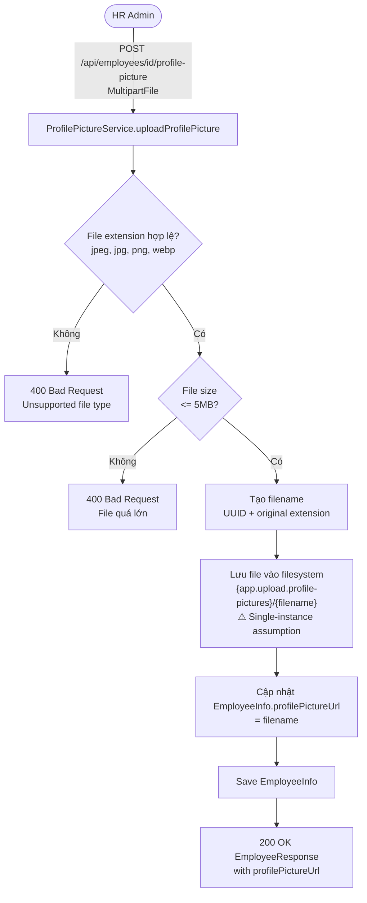

---

## 3. Luồng Quản lý Phòng ban

### 3.1 CRUD Phòng ban

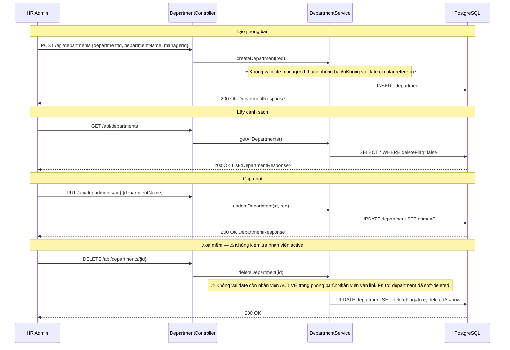

---

## 4. Luồng Quản lý Hợp đồng

### 4.1 Tạo Hợp đồng mới

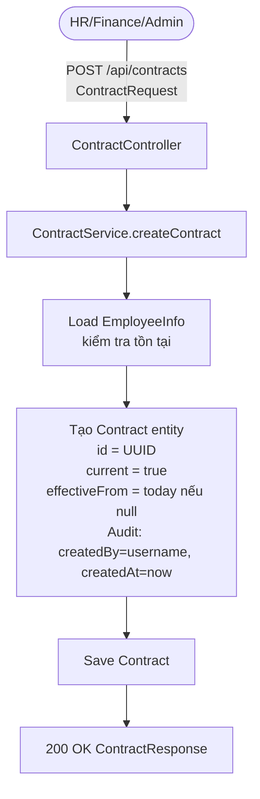

### 4.2 Cập nhật Hợp đồng — Version Control

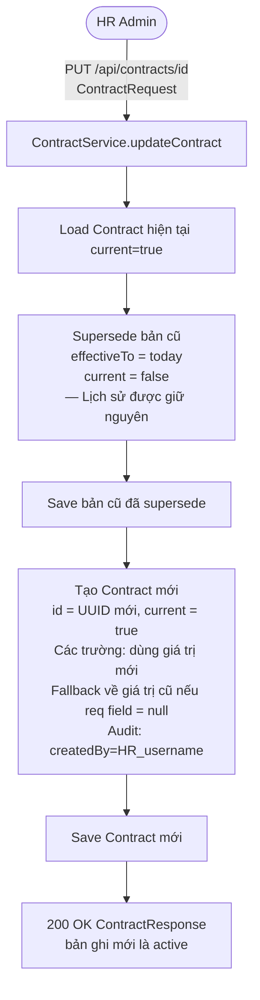

### 4.3 Biểu đồ Trình tự Toàn bộ Luồng Hợp đồng (Sequence Diagram)

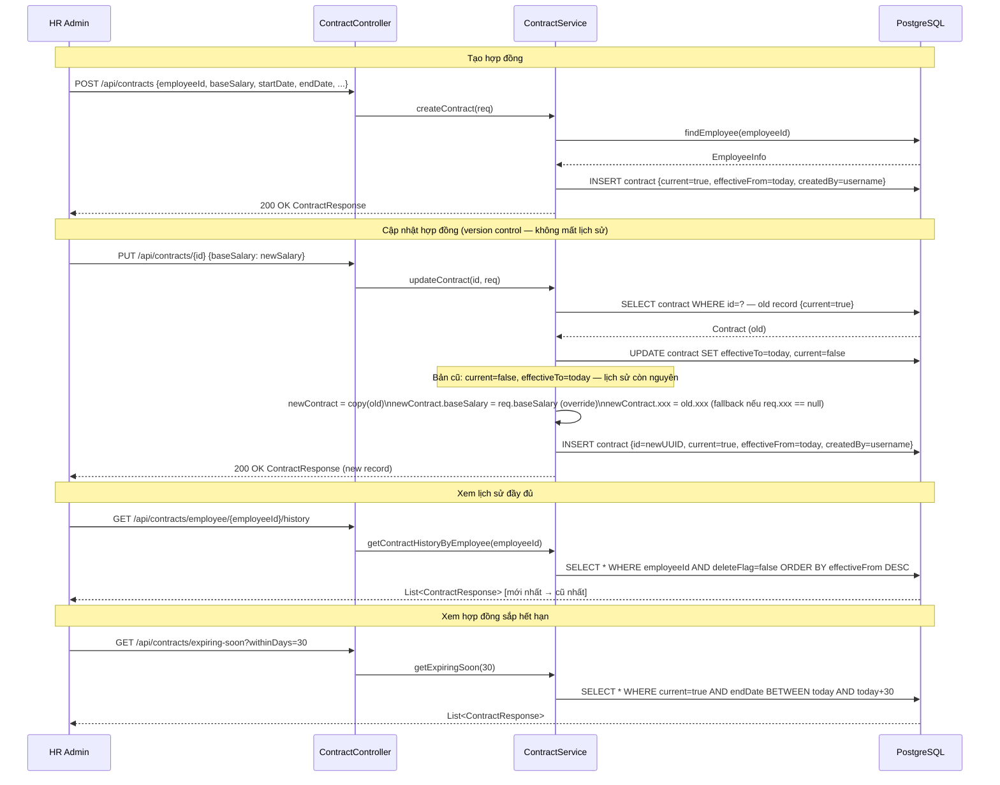

---

## 5. Luồng Cảnh báo Hợp đồng Sắp hết hạn (Scheduler)

> **Giới hạn đã biết:** Mỗi ngày scheduler chạy sẽ tạo một notification mới cho nhân viên có hợp đồng sắp hết hạn. Nếu hợp đồng còn 30 ngày và chưa được gia hạn, nhân viên sẽ nhận **30 notification riêng biệt** trong 30 ngày. Không có cơ chế deduplication.

### 5.1 Biểu đồ Luồng (Flowchart)

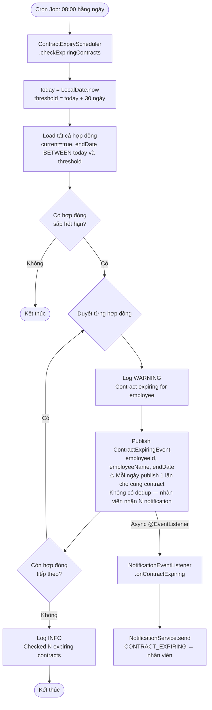

### 5.2 Biểu đồ Trình tự (Sequence Diagram)

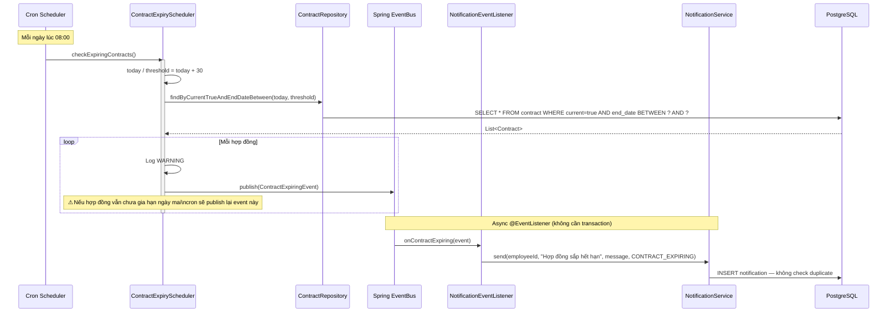

---

## 6. Biểu đồ Quan hệ Entity

```mermaid
erDiagram
    Department {
        string departmentId PK
        string departmentName
        string managerId FK
        boolean deleteFlag
        datetime deletedAt
    }

    EmployeeInfo {
        string employeeId PK
        string name
        string email
        string phone
        string departmentId FK
        enum status
        string nationalId
        string taxCode
        string socialInsuranceCode
        string bankAccount
        date dateOfJoining
        date dateOfBirth
        enum gender
        boolean deleteFlag
        datetime deletedAt
        string createdBy
        string updatedBy
        datetime createdAt
        datetime updatedAt
    }

    UserAccount {
        string employeeId PK_FK
        string username
        string passwordHash
        string lastPasswordHash
        enum role
        boolean deleteFlag
        datetime deletedAt
    }

    Contract {
        string id PK
        string employeeId FK
        date startDate
        date endDate
        date effectiveFrom
        date effectiveTo
        boolean current
        string contractType
        long baseSalary
        long insuranceBase
        string positionCode
        int salaryStep
        int dependentCount
        boolean deleteFlag
        string createdBy
        datetime createdAt
    }

    TaxDependent {
        string id PK
        string employeeId FK
        string fullName
        string nationalId
        date dateOfBirth
        string relationship
        boolean active
    }

    Department ||--o{ EmployeeInfo : "có nhiều"
    EmployeeInfo ||--|| UserAccount : "có 1 tài khoản"
    EmployeeInfo ||--o{ Contract : "có lịch sử hợp đồng"
    EmployeeInfo ||--o{ TaxDependent : "có người phụ thuộc"
    Department }o--o| EmployeeInfo : "có 1 quản lý"
```

---

## 7. Giới hạn Đã biết

| Giới hạn | Mô tả | Mức độ ảnh hưởng |
|---|---|---|
| **Upload file lưu local filesystem** | `ProfilePictureService` lưu file vào `app.upload.profile-pictures/` trên disk local. Chỉ hoạt động với **single-instance**. Scale horizontally cần shared storage (NFS, S3). | Trung bình — Cần plan trước khi scale. |
| **Contract scheduler không dedup notification** | Mỗi ngày cron tạo 1 notification mới cho cùng 1 nhân viên có hợp đồng sắp hết hạn. Hợp đồng còn 30 ngày → 30 notification. | Trung bình UX — Cần thêm logic check "đã gửi notification cho contract này trong N ngày gần đây chưa". |
| **Xóa phòng ban không kiểm tra nhân viên active** | `deleteDepartment()` soft-delete ngay mà không kiểm tra còn nhân viên `ACTIVE` trong phòng ban. Nhân viên vẫn giữ FK trỏ tới phòng ban đã xóa. | Trung bình — Có thể gây data inconsistency. Cần thêm validation trước khi cho phép xóa. |
| **Không validate circular reference phòng ban** | `managerId` của Department là `employeeId` bất kỳ, không bắt buộc phải thuộc phòng ban đó. Không validate để tránh vòng lặp quản lý. | Thấp — Chỉ ảnh hưởng logic hiển thị org chart. |
| **Không có bảng audit log riêng** | Lịch sử thay đổi dữ liệu nhân viên chỉ ghi `updatedBy` và `updatedAt` (overwrite mỗi lần update). Contract có version history tự nhiên qua `effectiveFrom/effectiveTo`. Các entity khác mất lịch sử thay đổi. | Cao nếu cần audit compliance — Cần bảng audit log riêng cho dữ liệu nhạy cảm. |
