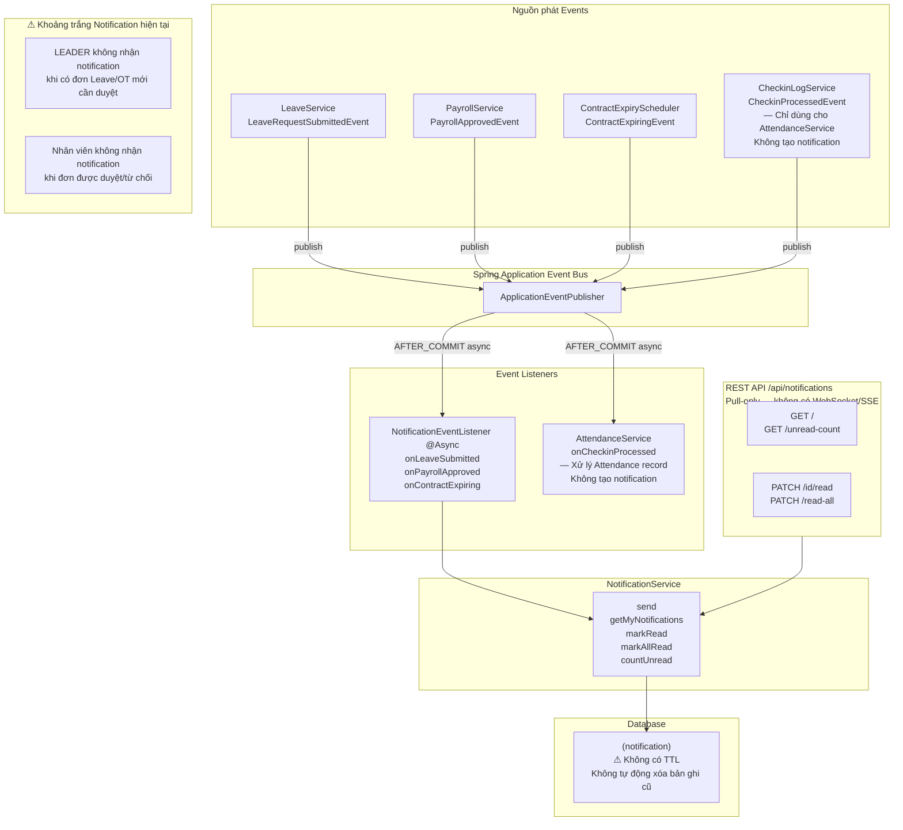
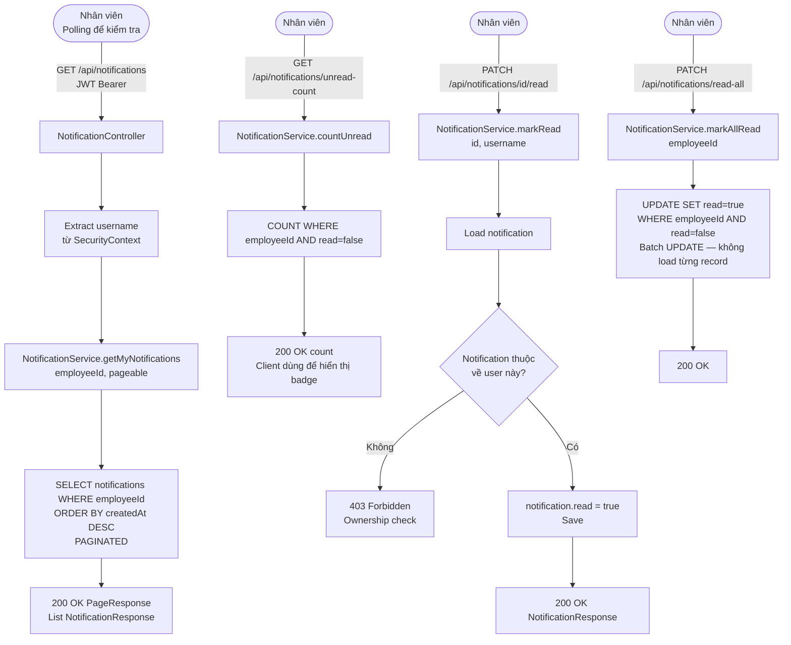
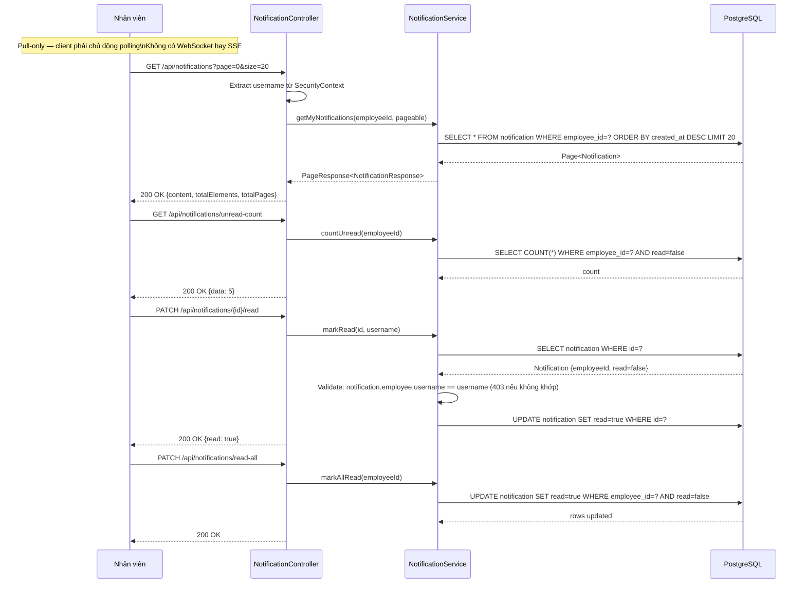
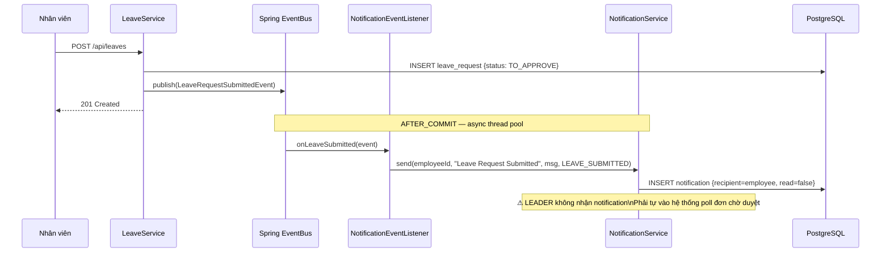
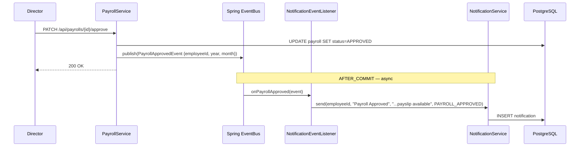
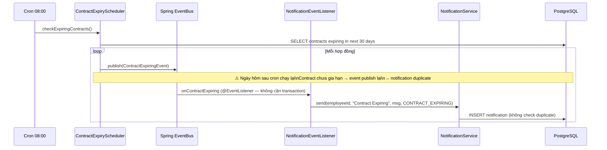
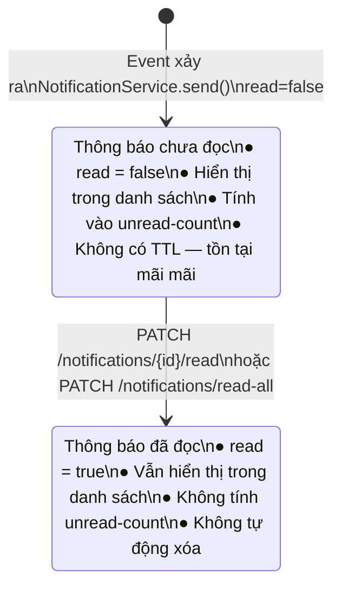

# Tài liệu Luồng Thông báo (Notification Flow) — v2

> **Thay đổi so với v1:** Bổ sung ghi chú khoảng trắng notification cho approver; làm rõ vai trò `CheckinProcessedEvent` (không tạo notification); ghi rõ mô hình pull-only và không có TTL/cleanup; bảng event được mở rộng với trạng thái đầy đủ của approval workflow.

## Mục lục

1. [Tổng quan Hệ thống Thông báo](#1-tổng-quan-hệ-thống-thông-báo)
2. [Luồng Gửi Thông báo qua Spring Events](#2-luồng-gửi-thông-báo-qua-spring-events)
3. [Luồng Xem & Đánh dấu Đã đọc](#3-luồng-xem--đánh-dấu-đã-đọc)
4. [Biểu đồ Trình tự cho từng Event](#4-biểu-đồ-trình-tự-cho-từng-event)
5. [Biểu đồ Trạng thái Thông báo](#5-biểu-đồ-trạng-thái-thông-báo)
6. [Giới hạn Đã biết](#6-giới-hạn-đã-biết)

---

## 1. Tổng quan Hệ thống Thông báo



---

## 2. Luồng Gửi Thông báo qua Spring Events

### 2.1 Biểu đồ Luồng tổng quát (Flowchart)

```mermaid
flowchart TD
    A[Business Action\nvd: tạo đơn nghỉ phép] --> B[Service xử lý\n+ Publish ApplicationEvent]
    B --> C[ApplicationEventPublisher.publishEvent]
    C --> D{Transaction\nPhase của Publisher?}
    D -->|AFTER_COMMIT\nLeave, Payroll, Checkin| E[Sau khi transaction commit\nmới dispatch event — đảm bảo data đã persist]
    D -->|@EventListener mặc định\nContract Scheduler| F[Dispatch ngay\nScheduler không có transaction context]
    E --> G[NotificationEventListener\n@Async — chạy trên thread pool riêng\nException trong listener không rollback publisher]
    F --> G
    G --> H[NotificationService.send\nemployeeId, title, message, type]
    H --> I[Tạo Notification entity\nnotificationId = UUID\nread = false]
    I --> J[Save vào DB\nKhông có dedup/TTL]
```

### 2.2 Bảng Event, Thông báo, và Khoảng trắng

| Event | Publisher | Trigger | Listener Type | Recipient | Nội dung | Khoảng trắng |
|---|---|---|---|---|---|---|
| `LeaveRequestSubmittedEvent` | LeaveService | Nhân viên tạo đơn | `@TransactionalEventListener(AFTER_COMMIT)` | Nhân viên tạo đơn | "Your [type] leave request has been submitted..." | **LEADER không biết có đơn mới** |
| `PayrollApprovedEvent` | PayrollService | DIRECTOR approve | `@TransactionalEventListener(AFTER_COMMIT)` | Nhân viên được tính lương | "Your payroll for [y]/[m] has been approved..." | — |
| `ContractExpiringEvent` | ContractExpiryScheduler | Cron 08:00 daily | `@EventListener` | Nhân viên có hợp đồng hết hạn | "Your contract expires on [date]..." | **Duplicate mỗi ngày** |
| `CheckinProcessedEvent` | CheckinLogService | Thiết bị gửi log | `@TransactionalEventListener(AFTER_COMMIT)` | AttendanceService | _(xử lý Attendance, không phải notification)_ | Dùng Event Bus để decoupling — không tạo notification |

> **Khoảng trắng trong approval workflow:** Các sự kiện sau hiện **không có notification**:
> - Nhân viên nộp đơn → LEADER không được thông báo
> - LEADER approve → MANAGER không được thông báo
> - MANAGER approve → HR_ADMIN không được thông báo
> - HR_ADMIN approve/reject → Nhân viên không được thông báo kết quả

---

## 3. Luồng Xem & Đánh dấu Đã đọc

### 3.1 Biểu đồ Luồng (Flowchart)



### 3.2 Biểu đồ Trình tự (Sequence Diagram)



---

## 4. Biểu đồ Trình tự cho từng Event

### 4.1 LeaveRequestSubmittedEvent



### 4.2 PayrollApprovedEvent



### 4.3 ContractExpiringEvent



---

## 5. Biểu đồ Trạng thái Thông báo



---

## 6. Giới hạn Đã biết

| Giới hạn | Mô tả | Mức độ ảnh hưởng |
|---|---|---|
| **Không có notification cho người phê duyệt** | LEADER/MANAGER/HR không nhận notification khi có đơn Leave/OT cần duyệt ở cấp của mình. Phải chủ động poll hệ thống. Ngược lại, nhân viên cũng không biết đơn được duyệt hay từ chối mà không tự kiểm tra. | Cao về UX — Workflow phê duyệt thiếu push notification ở cả hai chiều. |
| **Không có TTL / retention policy** | Notification không bao giờ bị xóa. Bảng tích lũy theo thời gian. Với 200 nhân viên và vài event/ngày, sau 3 năm có thể có hàng trăm nghìn records. | Trung bình — Cần định kỳ archive hoặc xóa notification đã đọc sau N ngày (ví dụ: 90 ngày). |
| **Pull-only model** | Client phải polling `GET /api/notifications/unread-count` để biết có notification mới. Không có WebSocket hay Server-Sent Events (SSE). | Trung bình UX — Delay giữa event xảy ra và user thấy notification phụ thuộc vào tần suất polling. |
| **CheckinProcessedEvent qua EventBus không tạo notification** | Event này chỉ dùng để trigger `AttendanceService` (xử lý bản ghi công). Không tạo notification. Dùng Event Bus để decoupling `CheckinLogService` và `AttendanceService` — tránh circular dependency và đảm bảo xử lý Attendance sau khi CheckinLog commit xong. | Thấp — Thiết kế đúng về kỹ thuật. Cần ghi chú để không nhầm là "thiếu notification". |
| **Exception trong async listener không propagate** | Nếu `NotificationEventListener` throw exception (DB down, v.v.), exception bị nuốt trong async thread pool. Notification không được tạo nhưng caller không biết. Không có retry, dead letter hay alert. | Trung bình — Cần add error logging ít nhất. Xem xét alert nếu notification là critical. |
