# Tài liệu Luồng Tính lương (Payroll Flow) — v2

> **Thay đổi so với v1:** Ghi rõ in-memory job store mất dữ liệu khi restart; document luồng xử lý sau REJECTED (payroll bị reject không thể xóa — là gap); thêm note về single-instance config cache; ghi rõ không có timeout batch; bổ sung giả định infrastructure.

## Mục lục

1. [Tổng quan Module Lương & Giả định](#1-tổng-quan-module-lương--giả-định)
2. [Luồng Tính lương Đơn lẻ](#2-luồng-tính-lương-đơn-lẻ)
3. [Luồng Tính lương Hàng loạt Bất đồng bộ](#3-luồng-tính-lương-hàng-loạt-bất-đồng-bộ)
4. [Luồng Phê duyệt Bảng lương](#4-luồng-phê-duyệt-bảng-lương)
5. [Luồng Tính lương Tự động (Scheduler)](#5-luồng-tính-lương-tự-động-scheduler)
6. [Công thức Tính lương Chi tiết](#6-công-thức-tính-lương-chi-tiết)
7. [Luồng Cấu hình Hệ thống (SystemConfig)](#7-luồng-cấu-hình-hệ-thống-systemconfig)
8. [Biểu đồ Trạng thái Payroll](#8-biểu-đồ-trạng-thái-payroll)
9. [Giới hạn Đã biết](#9-giới-hạn-đã-biết)

---

## 1. Tổng quan Module Lương & Giả định

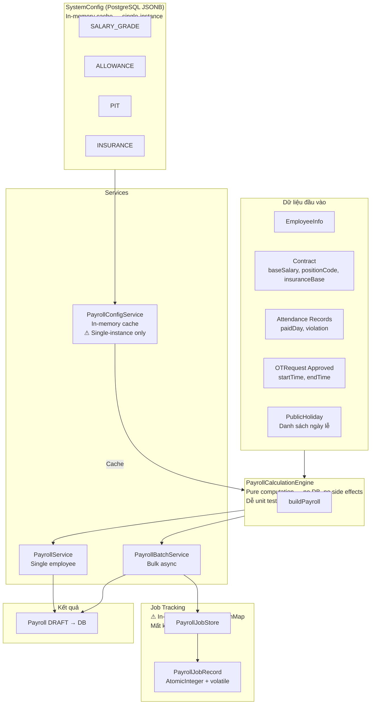

> **Giả định Infrastructure:**
> - **Single-instance deployment.** `PayrollConfigService` cache in-memory — khi activate SystemConfig mới, chỉ instance nhận request mới reload cache. Instances khác dùng config cũ đến khi restart.
> - **Job history không persistent.** `PayrollJobStore` là `ConcurrentHashMap` in-memory. Server restart → mất toàn bộ job history. Finance Admin không thể tra cứu batch cũ sau restart.
> - **Scheduler tự động không có override.** Cron ngày 1 hàng tháng trigger batch tự động. Không có cơ chế pause/skip từ UI.

---

## 2. Luồng Tính lương Đơn lẻ

### 2.1 Biểu đồ Luồng (Flowchart)

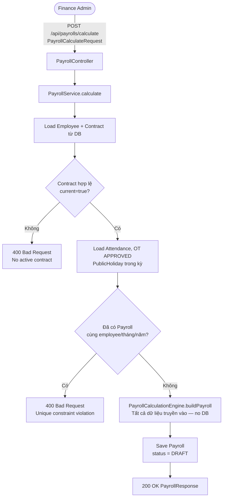

### 2.2 Biểu đồ Trình tự (Sequence Diagram)

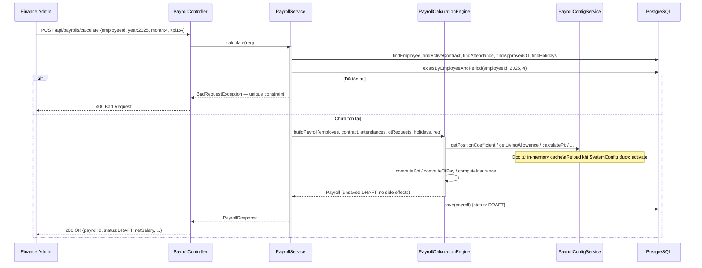

---

## 3. Luồng Tính lương Hàng loạt Bất đồng bộ

### 3.1 Biểu đồ Luồng Tổng thể (Flowchart)

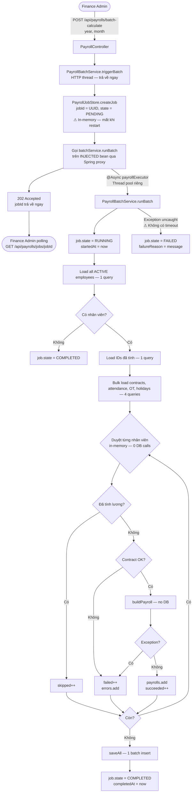

### 3.2 Biểu đồ Trình tự Chi tiết (Sequence Diagram)

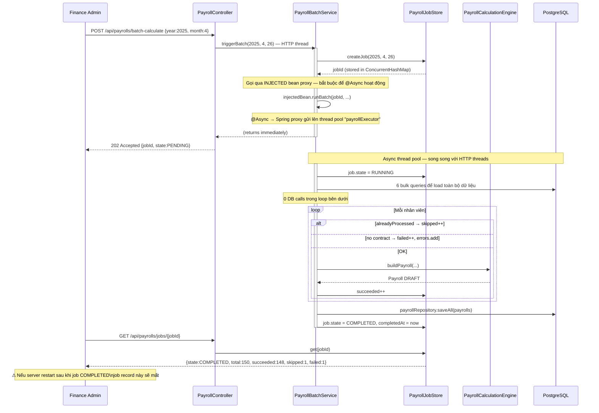

### 3.3 Thread Safety của Job Record

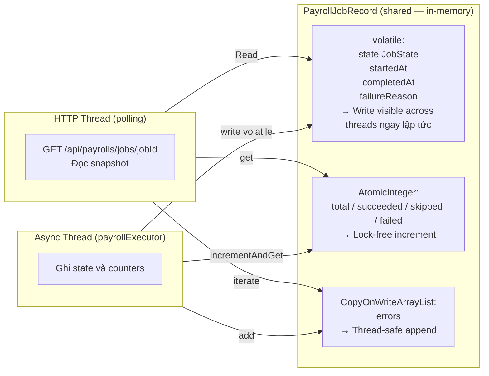

---

## 4. Luồng Phê duyệt Bảng lương

### 4.1 Biểu đồ Trạng thái + Xử lý sau REJECTED

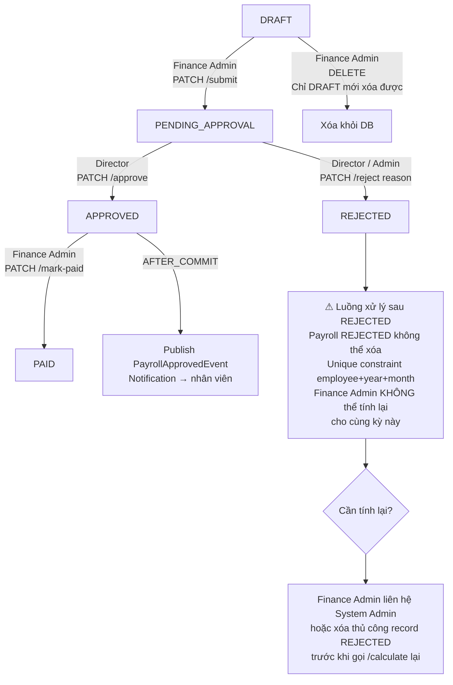

> **Lưu ý:** Khi Payroll bị `REJECTED`, Finance Admin không có đường dùng API bình thường để tính lại:
> - `DELETE /api/payrolls/{id}` chỉ được phép nếu status = `DRAFT`.
> - `POST /api/payrolls/calculate` sẽ fail vì unique constraint `(employee_id, payroll_year, payroll_month)` đã tồn tại record `REJECTED`.
> - Cần xóa record `REJECTED` trực tiếp hoặc cần thêm endpoint `recalculate` để override.

### 4.2 Biểu đồ Trình tự (Sequence Diagram)

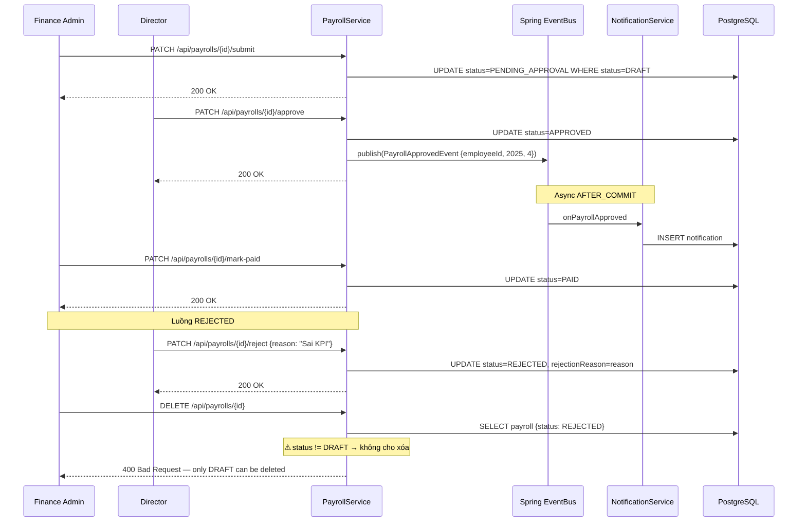

---

## 5. Luồng Tính lương Tự động (Scheduler)

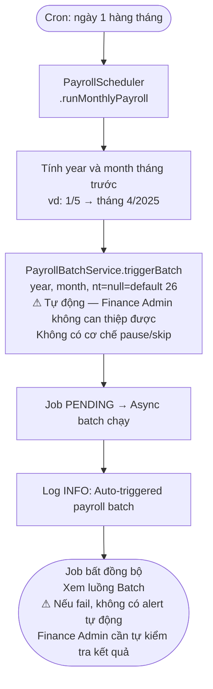

---

## 6. Công thức Tính lương Chi tiết

### 6.1 Công thức Lương Gộp (Gross Salary)

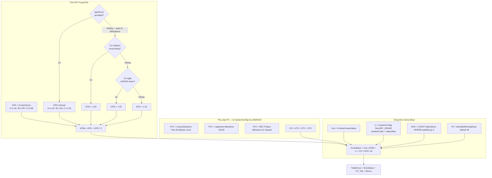

### 6.2 Công thức Tính lương OT

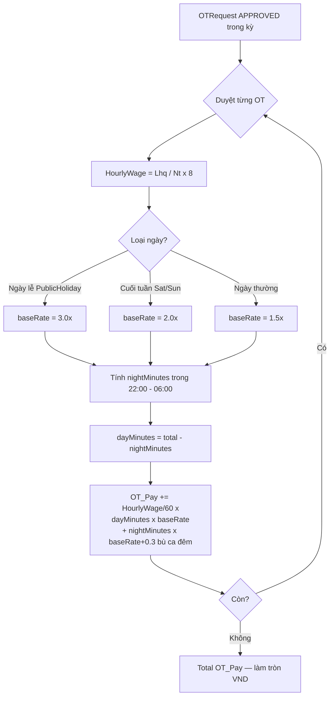

### 6.3 Công thức Bảo hiểm & Thuế TNCN

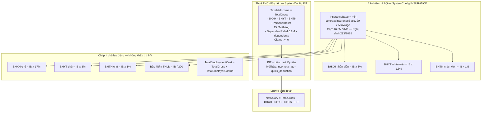

---

## 7. Luồng Cấu hình Hệ thống (SystemConfig)

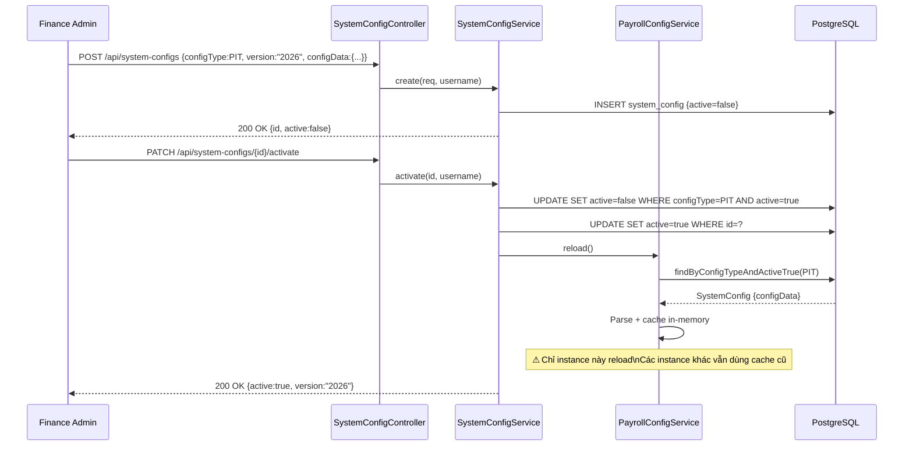

---

## 8. Biểu đồ Trạng thái Payroll

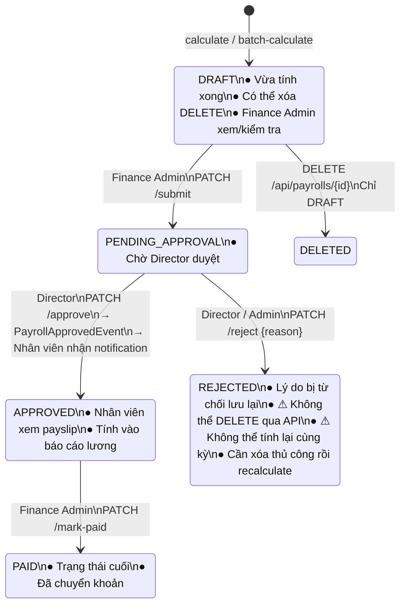

---

## 9. Giới hạn Đã biết

| Giới hạn | Mô tả | Mức độ ảnh hưởng |
|---|---|---|
| **Job tracking in-memory mất khi restart** | `PayrollJobStore` là `ConcurrentHashMap` trong JVM heap. Restart server mất toàn bộ job history. Finance Admin không tra cứu được batch cũ. | Trung bình — Chấp nhận được nếu có log đầy đủ. Nâng cấp: persist job record vào DB hoặc Redis. |
| **Không có timeout cho batch job** | Không có watchdog/timeout mechanism. Nếu batch bị treo (deadlock, OOM), job.state = RUNNING mãi mãi. Finance Admin không biết job treo hay đang chạy bình thường. | Trung bình — Cần thêm timeout hoặc heartbeat check. |
| **Scheduler tự động không có override** | Cron ngày 1 trigger batch tự động. Không có API để pause/skip/reschedule. Nếu cần hoãn tháng đó (nghỉ lễ, sự cố), phải can thiệp kỹ thuật (disable cron tạm thời). | Thấp — Tháng nào cũng cần tính lương, ít khi cần skip. |
| **Config cache không nhất quán khi multi-instance** | Khi activate SystemConfig mới, chỉ instance nhận request gọi `PCS.reload()`. Các instance khác vẫn dùng config cũ cho đến khi restart. | Cao nếu scale horizontally — Cần distributed cache (Redis) hoặc broadcast invalidation. |
| **REJECTED payroll không thể tính lại qua API** | `DELETE` chỉ cho phép status `DRAFT`. Unique constraint `(employee_id, year, month)` block `calculate` lại. Finance Admin phải yêu cầu xóa thủ công record `REJECTED` trước. | Cao về UX — Cần thêm endpoint `PATCH /api/payrolls/{id}/recalculate` hoặc cho phép `DELETE` status `REJECTED`. |
| **Batch scheduler fail không có alert** | Nếu cron tháng 1 fail (exception, DB down), không có alert tự động. Finance Admin phải chủ động poll job status để biết kết quả. | Trung bình — Cần thêm monitoring/alerting cho scheduled jobs. |
