# ĐỒ ÁN TỐT NGHIỆP

# LỜI CẢM ƠN

Em xin gửi lời cảm ơn chân thành nhất đến cô Nguyễn Thị Thanh Nga đã tận tình hướng dẫn, định hướng và góp ý trong suốt quá trình thực hiện đồ án. Sự hỗ trợ và kinh nghiệm thực tiễn mà cô chia sẻ đã giúp em không chỉ hoàn thiện sản phẩm về mặt kỹ thuật mà còn hiểu sâu hơn về bài toán quản lý nhân sự trong doanh nghiệp thực tế.

Em xin cảm ơn gia đình và bạn bè đã luôn ở bên cạnh, thông cảm và động viên trong những giai đoạn áp lực nhất của quá trình làm đồ án. Và cuối cùng, em muốn cảm ơn chính bản thân đã kiên trì với những thử thách về nghiệp vụ và kỹ thuật trong một đề tài đòi hỏi sự chính xác ở từng chi tiết pháp lý.

Em hy vọng đồ án này đóng góp một phần nhỏ vào hướng nghiên cứu và ứng dụng thực tế trong lĩnh vực quản lý nhân sự cho doanh nghiệp Việt Nam.

---

# TÓM TẮT NỘI DUNG ĐỒ ÁN

Quản lý nhân sự trong doanh nghiệp công nghệ Việt Nam hiện nay vẫn phụ thuộc nhiều vào bảng tính và quy trình thủ công, dẫn đến sai sót trong tính lương, thiếu kiểm soát nội bộ và khó truy vết khi xảy ra tranh chấp. Các phần mềm thương mại như MISA HRM, Base HR hay Bamboo HR hoặc thiếu tính năng phù hợp với đặc thù pháp luật Việt Nam, hoặc không hỗ trợ tích hợp thiết bị chấm công nhận diện khuôn mặt, hoặc có chi phí bản quyền vượt khả năng đầu tư của các doanh nghiệp quy mô vừa và nhỏ.

Xuất phát từ thực tế đó, đồ án xây dựng hệ thống quản lý nhân sự tích hợp chấm công nhận diện khuôn mặt mang tên FaceZ HRMS, nhằm số hóa toàn bộ vòng đời quản lý nhân viên trong một nền tảng tập trung, duy nhất. Hướng tiếp cận là xây dựng ứng dụng web theo kiến trúc client–server, với backend Spring Boot 4.0.0-M3 (Java 21) và frontend Next.js 15 (TypeScript, React 19). Trọng tâm kỹ thuật của đồ án nằm ở ba điểm: (1) pipeline chấm công tự động kết nối thiết bị nhận diện khuôn mặt với bản ghi chấm công qua cơ chế Spring Application Events; (2) công thức tính lương tuân thủ đầy đủ quy định pháp luật Việt Nam (biểu thuế TNCN 7 bậc theo Thông tư 111/2013/TT-BTC, trần đóng bảo hiểm 46,8 triệu VND, KPI song phần); và (3) mô hình phân tách nhiệm vụ 7 vai trò nhằm khôi phục kiểm soát tài chính nội bộ mà quy trình giấy tờ truyền thống thực hiện qua chữ ký vật lý.

Sản phẩm cuối cùng là một hệ thống hoàn chỉnh, bao gồm backend RESTful API với 19 Flyway migration kiểm soát phiên bản schema, và frontend đa vai trò với giao diện phù hợp từng nhóm người dùng. FaceZ HRMS bao phủ đầy đủ các nghiệp vụ cốt lõi: quản lý nhân viên và phòng ban, vòng đời hợp đồng, chấm công tự động và chốt kỳ, phê duyệt nghỉ phép/tăng ca đa cấp, tính lương và báo cáo tài chính. Hệ thống là nền tảng để tiếp tục mở rộng theo hướng tích hợp giải pháp nhận diện khuôn mặt thực tế và triển khai thương mại trong tương lai.

# CHƯƠNG 1. GIỚI THIỆU ĐỀ TÀI

## 1.1 Đặt vấn đề

### 1.1.1 Thực trạng quản lý nhân sự tại doanh nghiệp công nghệ Việt Nam

Trong thập kỷ vừa qua, làn sóng phát triển của ngành công nghệ thông tin Việt Nam đã thúc đẩy sự ra đời của hàng nghìn doanh nghiệp phần mềm, outsourcing và startups. Theo số liệu của Bộ Thông tin và Truyền thông, số lượng doanh nghiệp công nghệ số tại Việt Nam đã vượt mốc 75.000 đơn vị vào năm 2024 [24], với đội ngũ nhân lực công nghệ thông tin lên tới hơn 1,5 triệu người. Quy mô tăng trưởng nhanh đặt ra áp lực đặc biệt lên công tác quản lý nhân sự: bài toán không còn dừng lại ở việc theo dõi giờ công hay tính lương mà trở thành yêu cầu về kiểm soát nội bộ, tuân thủ pháp luật lao động, và truy vết dữ liệu cho mục đích kiểm toán.

Tuy nhiên, thực tế vận hành tại nhiều doanh nghiệp quy mô vừa và nhỏ trong ngành công nghệ cho thấy công tác quản lý nhân sự vẫn còn nhiều hạn chế đáng kể. Phần lớn các công ty ở phân khúc 50–500 nhân viên đang vận hành quy trình HR theo mô hình phân tán, sử dụng bảng tính Excel để theo dõi chấm công, nhờ nhân viên tự khai báo giờ tăng ca, và thực hiện tính lương thủ công mỗi tháng. Mô hình này tồn tại ba điểm yếu cấu trúc có tính hệ thống:

Thứ nhất, thiếu kiểm soát tài chính nội bộ. Trong quy trình giấy tờ truyền thống, tính chính xác của bảng lương được đảm bảo qua việc nhiều bộ phận độc lập cùng tham gia và xác nhận bằng chữ ký vật lý ở từng bước. Khi chuyển sang môi trường số mà không thiết kế lại quy trình, ranh giới trách nhiệm này thường bị xóa mờ: một nhân viên HR có thể vừa nhập liệu chấm công, vừa tính lương, vừa xuất bảng lương mà không có cơ chế kiểm tra chéo nào, dẫn đến rủi ro gian lận nội bộ và sai sót không được phát hiện. Vấn đề kiểm soát nội bộ này được phân tích chi tiết và đề xuất giải pháp trong mục 5.1.

Thứ hai, sai sót trong tính lương do tính toán thủ công. Hệ thống tính lương theo quy định pháp luật Việt Nam không đơn giản. Biểu thuế thu nhập cá nhân (TNCN) lũy tiến 7 bậc theo Thông tư 111/2013/TT-BTC đòi hỏi xác định chính xác thu nhập chịu thuế sau khi trừ các khoản giảm trừ bản thân (15,5 triệu đồng/tháng), giảm trừ người phụ thuộc (6,2 triệu đồng/người/tháng theo Nghị quyết 110/2025/UBTVQH15 áp dụng từ 01/01/2026 [23]) và các khoản bảo hiểm bắt buộc. Trần đóng BHXH và BHYT hiện ở mức 46,8 triệu đồng/tháng (tương đương 20 lần mức lương cơ sở), trong khi trần đóng bảo hiểm thất nghiệp (BHTN) được xác định riêng theo 20 lần mức lương tối thiểu vùng. Phụ cấp làm thêm giờ (OT) có hệ số nhân khác nhau tùy theo ngày thường (×1,5), cuối tuần (×2,0), ngày lễ (×3,0), và khung giờ ban đêm 22:00–06:00 cộng thêm hệ số ×1,3 theo tỷ lệ chồng lấp thực tế. Mỗi sai sót trong bất kỳ công đoạn nào trong chuỗi tính toán này có thể dẫn đến trả lương thiếu cho nhân viên hoặc kê khai thuế sai với cơ quan thuế — cả hai đều có hậu quả pháp lý.

Thứ ba, thiếu tự động hóa trong chấm công. Ngay cả khi doanh nghiệp đầu tư thiết bị chấm công nhận diện khuôn mặt hoặc vân tay, dữ liệu từ thiết bị thường chỉ được xuất ra file CSV và nhập lại thủ công vào bảng tính. Quá trình này không chỉ tốn thời gian mà còn tạo ra khoảng cách về thời gian giữa sự kiện thực tế (nhân viên check-in) và dữ liệu được xử lý (tạo bản ghi chấm công), khiến việc phát hiện bất thường trong thời gian thực là không thể.

### 1.1.2 Hạn chế của các giải pháp hiện có

Thị trường phần mềm quản lý nhân sự tại Việt Nam hiện có nhiều sản phẩm, nhưng khi phân tích kỹ theo nhu cầu của các doanh nghiệp công nghệ quy mô vừa, vẫn tồn tại những khoảng trống chưa được lấp đầy.

Nhóm phần mềm nội địa (MISA HRM, Base HR, ACheckin) có ưu thế về am hiểu thị trường Việt Nam và hỗ trợ ngôn ngữ tiếng Việt. Tuy nhiên, các sản phẩm này thường được xây dựng theo mô hình SaaS đóng, hạn chế khả năng tùy biến quy trình phê duyệt nội bộ và công thức tính lương theo đặc thù từng doanh nghiệp. API tích hợp của các nền tảng này chủ yếu được thiết kế theo hướng xuất dữ liệu định kỳ từ phần mềm ra hệ thống khác, thay vì nhận sự kiện theo thời gian thực (push event) từ thiết bị — một khác biệt kiến trúc quan trọng đối với pipeline chấm công tự động. Quan trọng hơn, hầu hết không có cơ chế phân tách nhiệm vụ giữa HR, Kế toán và Ban Giám đốc được thực thi ở tầng ứng dụng, để lại rủi ro kiểm soát nội bộ đáng kể.

Nhóm phần mềm quốc tế (BambooHR, Workday, SAP SuccessFactors) có hệ sinh thái tính năng phong phú và kiến trúc kỹ thuật tốt, nhưng không được thiết kế cho hệ thống pháp luật lao động và thuế của Việt Nam. Biểu thuế TNCN, tỷ lệ BHXH/BHYT/BHTN và trần đóng theo quy định Việt Nam không được hỗ trợ out-of-the-box. Chi phí bản quyền của các sản phẩm này, dao động từ 6 đến 25 USD/người dùng/tháng, cũng vượt khả năng đầu tư của đa số doanh nghiệp công nghệ trong nước có quy mô dưới 500 nhân viên.

Nhóm tự phát triển nội bộ là lựa chọn của nhiều doanh nghiệp công nghệ có đội ngũ kỹ thuật. Tuy nhiên, kinh nghiệm thực tế cho thấy hầu hết các hệ thống tự phát triển này rơi vào bẫy kỹ thuật: thiết kế tốt về giao diện nhưng bỏ qua vấn đề kiểm soát nội bộ (một nhân viên HR có thể làm tất cả mọi việc), thiếu cơ chế migration schema có kiểm soát (dùng `ddl-auto: update` hay tương đương), và không có audit trail đủ chi tiết để điều tra khi xảy ra tranh chấp.

Khoảng trống thị trường nằm ở chỗ: chưa có một giải pháp mã nguồn mở, tích hợp thiết bị chấm công nhận diện khuôn mặt, tuân thủ đầy đủ pháp luật lao động và thuế Việt Nam, có kiến trúc phân tách nhiệm vụ đúng chuẩn, và cho phép doanh nghiệp tự triển khai với chi phí hạ tầng hợp lý.

## 1.2 Mục tiêu và phạm vi đề tài

### 1.2.1 Mục tiêu

Đồ án đặt ra bốn mục tiêu cụ thể:

Mục tiêu 1 — Xây dựng hệ thống HRMS hoàn chỉnh: Phát triển ứng dụng web tích hợp đầy đủ các nghiệp vụ quản lý nhân sự của doanh nghiệp công nghệ quy mô vừa và nhỏ tại Việt Nam, bao gồm: quản lý nhân viên và phòng ban, vòng đời hợp đồng lao động, chấm công tự động qua thiết bị, nghỉ phép và tăng ca với phê duyệt đa cấp, và tính lương theo quy định pháp luật hiện hành.

Mục tiêu 2 — Phân tách nhiệm vụ trong kiểm soát tài chính nội bộ: Thiết kế mô hình phân quyền 7 vai trò phản ánh đúng cấu trúc tổ chức thực tế của doanh nghiệp, trong đó HR chuẩn bị dữ liệu đầu vào, Finance tính lương và báo cáo, Director phê duyệt chi trả — đảm bảo không có vai trò nào đơn phương kiểm soát toàn bộ quy trình tài chính.

Mục tiêu 3 — Tự động hóa pipeline chấm công: Xây dựng pipeline xử lý sự kiện tự động từ thiết bị chấm công nhận diện khuôn mặt đến bản ghi chấm công đã được xử lý, loại bỏ hoàn toàn bước nhập liệu thủ công và đảm bảo dữ liệu đầu vào tính lương luôn cập nhật theo thời gian thực.

Mục tiêu 4 — Tuân thủ pháp luật Việt Nam: Triển khai công thức tính lương đúng theo quy định: biểu thuế TNCN lũy tiến 7 bậc (Thông tư 111/2013/TT-BTC), các tỷ lệ đóng bảo hiểm bắt buộc và trần đóng theo Luật BHXH hiện hành, giới hạn giờ làm thêm 40 giờ/tháng và 200 giờ/năm (Bộ Luật Lao Động 2019, Điều 107), hệ số phụ cấp OT theo ngày thường/cuối tuần/ngày lễ/ca đêm.

### 1.2.2 Phạm vi

Phạm vi thị trường: Đồ án hướng riêng tới các doanh nghiệp công nghệ tại Việt Nam, với quy mô nhân sự từ 20 đến 500 người. Các đặc thù pháp luật, ngôn ngữ giao diện và quy trình nghiệp vụ đều được thiết kế cho thị trường trong nước.

Phạm vi tính năng: Hệ thống tập trung vào tám nhóm nghiệp vụ cốt lõi. Thứ nhất, quản lý nhân viên bao gồm thông tin cá nhân và pháp lý (CMND/CCCD, mã số thuế, số BHXH), tài khoản ngân hàng, ảnh đại diện và người phụ thuộc thuế. Thứ hai, quản lý tổ chức gồm phòng ban và phân công quản lý. Thứ ba, quản lý hợp đồng lao động theo vòng đời đầy đủ kèm cảnh báo hết hạn. Thứ tư, chấm công tích hợp thiết bị nhận diện khuôn mặt qua API key xác thực, xử lý tự động và chốt kỳ hằng tháng. Thứ năm, nghỉ phép và tăng ca với chín loại nghỉ phép theo Bộ Luật Lao Động, số dư theo dõi thời gian thực, phê duyệt đa cấp (LEADER → MANAGER → HR_ADMIN) và giới hạn OT theo pháp luật. Thứ sáu, tính lương cá nhân và hàng loạt, phê duyệt qua luồng Finance → Director, kèm ba loại báo cáo tài chính (chi phí lao động, nộp bảo hiểm, tổng hợp thuế TNCN). Thứ bảy, hệ thống thông báo in-app cho các sự kiện nghiệp vụ. Thứ tám, cấu hình quản lý phiên bản các thông số tính lương gồm bậc lương, phụ cấp, thuế và bảo hiểm.

Ngoài phạm vi: Hệ thống không bao gồm tích hợp phần mềm kế toán (MISA, Fast), xuất báo cáo theo mẫu biểu của Bộ Tài chính, quản lý tuyển dụng và đào tạo, phiếu lương dạng PDF có thể in, và tích hợp ngân hàng để thanh toán lương tự động. Đây là các hướng phát triển tiếp theo được xác định trong Chương 6.

## 1.3 Định hướng giải pháp

Đồ án đi theo hướng xây dựng một ứng dụng web theo mô hình client–server, trong đó frontend và backend tách biệt hoàn toàn và giao tiếp qua REST API. Quyết định này xuất phát từ hai lý do: (1) tách biệt concern — backend thuần nghiệp vụ, frontend thuần giao diện; và (2) cho phép tương lai tích hợp ứng dụng di động hoặc ứng dụng bên thứ ba mà không phải thay đổi backend.

Về backend, đồ án chọn Spring Boot 4.0.0-M3 trên Java 21 vì hệ sinh thái trưởng thành phù hợp với nghiệp vụ doanh nghiệp và hỗ trợ xử lý đồng thời tốt cho tác vụ tính lương hàng loạt. Về frontend, Next.js 15 và React 19 được chọn để cân bằng giữa hiệu suất tải trang và độ an toàn kiểu dữ liệu. Về dữ liệu, PostgreSQL 15 đáp ứng các nhu cầu lưu trữ linh hoạt và truy vấn tổng hợp của bài toán, kết hợp với Redis 7 cho các tác vụ bộ nhớ đệm và bảo mật phiên. Lý do lựa chọn chi tiết của từng công nghệ, cùng các phương án thay thế được cân nhắc, được phân tích trong Chương 3.

Về bảo mật, hệ thống áp dụng cơ chế xác thực dựa trên JWT cho người dùng và khóa API cho thiết bị chấm công, với các chi tiết thiết kế được trình bày trong mục 3.4.

Sản phẩm của đồ án là hệ thống FaceZ HRMS — nền tảng quản lý nhân sự hoàn chỉnh với backend RESTful API (19 Flyway migration, tài liệu Swagger đầy đủ) và frontend đa vai trò. Bốn đóng góp kỹ thuật chính, được trình bày chi tiết trong Chương 5, gồm: (1) kiến trúc phân tách nhiệm vụ 7 vai trò; (2) pipeline chấm công tự động qua Spring Application Events; (3) công thức tính lương tuân thủ đầy đủ pháp luật Việt Nam; và (4) cơ chế trừ hai giai đoạn số dư nghỉ phép chống race condition.

Hệ thống được thiết kế để triển khai bằng Docker Compose với cấu hình dịch vụ tối giản (backend + PostgreSQL + Redis), phù hợp với hạ tầng VPS tiêu chuẩn mà các doanh nghiệp quy mô vừa đang sử dụng.

## 1.4 Bố cục đồ án

Phần còn lại của báo cáo được tổ chức như sau.

Chương 2 trình bày quá trình khảo sát hiện trạng, phân tích yêu cầu và đặc tả chức năng của hệ thống. Phần đầu chương so sánh FaceZ HRMS với các giải pháp phổ biến trên thị trường để chỉ ra khoảng trống cần lấp. Tiếp đến là phần tổng quan chức năng gồm biểu đồ use case tổng quát và phân rã theo sáu nhóm nghiệp vụ, cùng mô tả ba quy trình nghiệp vụ trọng tâm. Phần đặc tả chức năng trình bày chi tiết năm ca sử dụng quan trọng nhất. Chương khép lại bằng các yêu cầu phi chức năng về hiệu năng, độ tin cậy, bảo mật, khả năng sử dụng và khả năng bảo trì.

Chương 3 phân tích nền tảng lý thuyết và công nghệ được sử dụng. Với mỗi công nghệ — trải từ framework backend, cơ sở dữ liệu và bộ nhớ đệm, cơ chế xác thực, đến framework frontend và hạ tầng container hóa — chương làm rõ bài toán cụ thể mà công nghệ đó giải quyết, liệt kê các lựa chọn thay thế phổ biến và lý giải sự lựa chọn cuối cùng trong ngữ cảnh của đồ án.

Chương 4 trình bày kết quả thiết kế và xây dựng hệ thống. Phần thiết kế kiến trúc mô tả kiến trúc phân tầng tổng thể và biểu đồ phụ thuộc gói. Phần thiết kế chi tiết bao gồm thiết kế giao diện theo từng vai trò, biểu đồ lớp cho ba service cốt lõi (PayrollCalculationEngine, LeaveService, AttendanceService), sơ đồ tuần tự cho hai luồng nghiệp vụ quan trọng, và biểu đồ thực thể liên kết đầy đủ. Phần xây dựng ứng dụng thống kê quy mô mã nguồn và minh họa giao diện các chức năng chính. Phần kiểm thử trình bày phương pháp và kết quả kiểm thử ba phân hệ quan trọng nhất. Chương khép lại bằng mô tả cấu hình triển khai thực tế.

Chương 5 đi sâu vào bốn đóng góp kỹ thuật chính của đồ án, mỗi đóng góp được trình bày theo cấu trúc ba phần: bài toán đặt ra, giải pháp cụ thể và kết quả đạt được. Bốn nội dung lần lượt là: kiến trúc phân tách nhiệm vụ khôi phục kiểm soát tài chính nội bộ; pipeline chấm công tự động qua Spring Events; công thức tính lương tuân thủ đầy đủ pháp luật Việt Nam; và cơ chế trừ hai giai đoạn số dư nghỉ phép chống race condition.

Chương 6 tổng kết kết quả đạt được, đối sánh với các giải pháp tương tự trên thị trường, chỉ ra các hạn chế kỹ thuật còn tồn tại và bài học rút ra từ quá trình phát triển. Phần cuối vạch ra các hướng phát triển ngắn hạn (payslip PDF, rollover nghỉ phép năm, xác nhận OT trước ca làm) và dài hạn (tích hợp mô hình AI nhận diện khuôn mặt, ứng dụng di động, kết nối ngân hàng).

---

# CHƯƠNG 2. KHẢO SÁT VÀ PHÂN TÍCH YÊU CẦU

Chương này xác lập nền tảng yêu cầu cho FaceZ HRMS từ ba góc độ: người dùng, nghiệp vụ, và kỹ thuật. Mục 2.1 khảo sát hiện trạng thông qua phân tích các nhóm người dùng cốt lõi, đánh giá hạn chế của các giải pháp thương mại hiện có, và xác định bảy phân hệ cần xây dựng. Mục 2.2 và 2.3 mô tả tổng quan chức năng qua biểu đồ use case phân rã theo sáu nhóm nghiệp vụ, ba quy trình nghiệp vụ trọng tâm, và đặc tả chi tiết năm ca sử dụng quan trọng nhất. Chương kết thúc bằng Mục 2.4 với các yêu cầu phi chức năng về hiệu năng, bảo mật và khả năng bảo trì.

## 2.1 Khảo sát hiện trạng và xác định nhu cầu hệ thống

### 2.1.1 Xác định các nhóm người dùng

Để xây dựng yêu cầu hệ thống một cách toàn diện, đồ án tiến hành khảo sát từ góc độ của từng nhóm người dùng thực tế trong chuỗi quy trình nhân sự của doanh nghiệp công nghệ. Có năm nhóm người dùng cốt lõi với nhu cầu và đặc thù nghiệp vụ riêng biệt:

Nhân viên (Employee): Đây là nhóm người dùng đông nhất. Nhu cầu chính là tra cứu thông tin cá nhân, theo dõi chấm công của bản thân, đăng ký nghỉ phép hoặc tăng ca, và xem phiếu lương. Nhóm này không cần giao diện phức tạp nhưng đòi hỏi thông tin rõ ràng, cập nhật real-time (số ngày nghỉ còn lại, lịch sử check-in trong tháng) và luồng thao tác đơn giản nhất có thể.

Cấp quản lý trực tiếp (Leader, Manager): Nhóm này chịu trách nhiệm phê duyệt các yêu cầu từ nhân viên trong nhóm của mình. Nhu cầu chính là dashboard hiển thị các yêu cầu chờ xử lý, xem tổng quan tình trạng nhân sự của bộ phận, và xử lý phê duyệt/từ chối nhanh chóng có ghi chú lý do. Leader thực hiện phê duyệt cấp 1, Manager thực hiện phê duyệt cấp 2.

Bộ phận Nhân sự — HR Admin: Đây là nhóm người dùng có quyền rộng nhất trên phân hệ dữ liệu nhân viên. Nhu cầu gồm: quản lý toàn bộ vòng đời nhân viên (tuyển dụng, điều chỉnh hợp đồng, nghỉ việc), giám sát tổng thể chấm công của toàn công ty, chốt kỳ chấm công cuối tháng trước khi bàn giao cho Kế toán, quản lý số dư nghỉ phép, và phê duyệt cấp cuối cho các yêu cầu nghỉ phép/tăng ca.

Bộ phận Kế toán/Tài chính — Finance Admin: Nhóm này tiếp nhận dữ liệu đầu vào đã được HR chuẩn bị và thực hiện tính toán tài chính. Nhu cầu gồm: tính lương cá nhân và hàng loạt với đầy đủ tham số (KPI, phụ cấp, thưởng), quản lý cấu hình thông số tính lương (bảng lương, biểu thuế, tỷ lệ bảo hiểm), trình bảng lương lên Ban Giám đốc phê duyệt, và xuất các báo cáo tài chính định kỳ (chi phí lao động, nộp BHXH, PIT summary).

Ban Giám đốc — Director: Vai trò phê duyệt cuối trong quy trình chi trả lương. Nhu cầu chính là xem tổng quan chi phí lao động, phê duyệt hoặc từ chối bảng lương đã được Kế toán chuẩn bị (có ghi lý do khi từ chối), và xem báo cáo chi phí nhân sự theo bộ phận.

Ngoài các nhóm người dùng, hệ thống còn tương tác với một tác nhân ngoài quan trọng: Thiết bị chấm công nhận diện khuôn mặt. Thiết bị gửi sự kiện check-in/check-out theo thời gian thực qua REST API với xác thực API key, hoặc tải lên theo lô (batch) khi mất kết nối.

### 2.1.2 Phân tích các giải pháp hiện có và khoảng trống

Để xác định rõ yêu cầu hệ thống, đồ án tiến hành phân tích so sánh bốn nhóm giải pháp đang được sử dụng phổ biến tại thị trường Việt Nam:

MISA HRM là sản phẩm được phát triển bởi MISA JSC, phủ rộng phân khúc doanh nghiệp vừa và nhỏ. Điểm mạnh: am hiểu thị trường Việt Nam, hỗ trợ đầy đủ biểu mẫu pháp lý theo quy định Bộ Lao Động, và tích hợp sẵn với hệ sinh thái kế toán MISA. Điểm yếu: API tích hợp được thiết kế theo hướng xuất dữ liệu định kỳ thay vì nhận sự kiện thời gian thực từ thiết bị; kiến trúc SaaS đóng hạn chế tùy biến quy trình phê duyệt và công thức tính lương theo đặc thù doanh nghiệp; thiếu cơ chế phân tách nhiệm vụ HR/Finance/Director được thực thi ở tầng ứng dụng.

Base HR (Base.vn) có giao diện hiện đại và hỗ trợ tích hợp đa công cụ. Điểm mạnh: trải nghiệm người dùng tốt, hỗ trợ API và tích hợp thiết bị chấm công. Điểm yếu: không có cơ chế phân tách nhiệm vụ giữa HR và Finance trong luồng tính lương được thực thi ở tầng server; mô hình giá theo số lượng tài khoản leo thang nhanh khi doanh nghiệp tăng trưởng, trở thành gánh nặng chi phí với doanh nghiệp đang mở rộng quy mô.

BambooHR là giải pháp quốc tế phổ biến, được dùng rộng rãi tại các công ty công nghệ nước ngoài có văn phòng tại Việt Nam. Điểm mạnh: kiến trúc kỹ thuật tốt, API phong phú, UX xuất sắc. Điểm yếu quyết định: không hỗ trợ biểu thuế TNCN Việt Nam, không có tích hợp sẵn cho BHXH/BHYT/BHTN theo tỷ lệ và trần đóng của Luật BHXH Việt Nam; mọi tùy chỉnh pháp luật phải tự phát triển bằng các webhook và integration.

Excel/quy trình thủ công: Vẫn là thực tế phổ biến nhất tại các doanh nghiệp công nghệ dưới 100 nhân viên. Điểm mạnh duy nhất là chi phí gần như bằng không. Điểm yếu về cấu trúc đã được phân tích chi tiết trong Mục 1.1.

Bảng 2.1 tổng hợp so sánh theo các tiêu chí quan trọng nhất:

Bảng 2.1: So sánh FaceZ HRMS với các giải pháp hiện có

| Tiêu chí so sánh | MISA HRM | Base HR | BambooHR | Excel | FaceZ HRMS |
|---|---|---|---|---|---|
| Tính lương đúng luật VN (TNCN 7 bậc, BHXH) | Có | Cơ bản | Không | Thủ công | Có, đầy đủ |
| Tích hợp thiết bị chấm công qua REST API | Không | Một phần | Không | Không | Có (API key SHA-256) |
| Phân tách nhiệm vụ HR / Finance / Director | Không | Không | Không | Không | Có (7 vai trò) |
| Phê duyệt đa cấp tùy chỉnh | Cứng nhắc | Cơ bản | Có | Không | Có (3 cấp) |
| Lịch sử hợp đồng đầy đủ | Một phần | Không | Có | Không | Có (history model) |
| Audit trail tự động | Một phần | Một phần | Có | Không | Có (createdBy/updatedBy) |
| Migration schema có kiểm soát | N/A | N/A | N/A | N/A | Có (Flyway 19 migrations) |
| Giới hạn OT theo Bộ Luật Lao Động 2019 | Không | Không | Không | Thủ công | Có (40h/tháng, 200h/năm) |
| Chi phí triển khai | Thuê bao SaaS | Thuê bao SaaS | Thuê bao SaaS | ~0 | Tự triển khai |
| Khả năng tùy biến | Thấp | Trung bình | Cao | Cao | Cao (mã nguồn mở) |

Qua phân tích, khoảng trống rõ ràng nhất là: chưa có giải pháp nào đồng thời đáp ứng cả ba yêu cầu: (1) tính lương đúng pháp luật Việt Nam đầy đủ, (2) tích hợp thiết bị chấm công nhận diện khuôn mặt qua REST, và (3) có kiến trúc phân tách nhiệm vụ đúng chuẩn với chi phí triển khai phù hợp doanh nghiệp vừa.

### 2.1.3 Xác định các phân hệ cốt lõi

Từ phân tích nhu cầu người dùng và khoảng trống thị trường, đồ án xác định sáu phân hệ cốt lõi cần phát triển. Thứ nhất, phân hệ Quản lý nhân viên và Tổ chức quản lý đầy đủ thông tin cá nhân, pháp lý và nghề nghiệp của nhân viên, cùng cấu trúc phòng ban, phân công quản lý, ảnh đại diện và người phụ thuộc thuế. Thứ hai, phân hệ Chấm công và Quản lý thời gian tích hợp thiết bị nhận diện khuôn mặt qua API key, xử lý tự động sự kiện check-in/check-out, tính toán giờ công và giờ đến muộn, chốt kỳ hằng tháng và quản lý ngày lễ công. Thứ ba, phân hệ Nghỉ phép và Tăng ca hỗ trợ chín loại nghỉ phép, theo dõi số dư thời gian thực với cơ chế trừ hai giai đoạn, phê duyệt đa cấp, giới hạn giờ OT theo pháp luật và phân loại ca đêm. Thứ tư, phân hệ Hợp đồng lao động quản lý vòng đời hợp đồng với lịch sử đầy đủ, cảnh báo hết hạn trước 30 ngày và liên kết với dữ liệu tính lương. Thứ năm, phân hệ Tính lương và Phê duyệt thực hiện tính lương cá nhân và hàng loạt với công thức đầy đủ (hệ số bậc lương, KPI, OT, BHXH/BHYT/BHTN, thuế TNCN bảy bậc), luồng phê duyệt Finance → Director và ba báo cáo tài chính định kỳ. Thứ sáu, phân hệ Cấu hình hệ thống và Thông báo quản lý phiên bản thông số tính lương (SALARY_GRADE, ALLOWANCE, PIT, INSURANCE, WORK_SCHEDULE) và phát thông báo in-app cho các sự kiện nghiệp vụ.

## 2.2 Tổng quan chức năng

Hệ thống phục vụ bảy tác nhân người dùng và một tác nhân thiết bị. Toàn bộ chức năng được tổ chức thành sáu nhóm use case, mỗi nhóm tương ứng với một phân hệ nghiệp vụ. Phần này trình bày các nhóm chức năng đó thông qua biểu đồ use case tổng quát và các biểu đồ phân rã tương ứng.

### 2.2.1 Biểu đồ use case tổng quát

Hệ thống có bảy tác nhân người dùng: EMPLOYEE, LEADER, MANAGER, HR_ADMIN, FINANCE_ADMIN, DIRECTOR, SYSTEM_ADMIN, với mức độ quyền hạn tăng dần. Ngoài ra còn có tác nhân ngoài là thiết bị chấm công (Device). Toàn bộ chức năng được phân thành sáu nhóm use case tổng quan.

<details>
<summary>Biểu đồ use case tổng quan</summary>

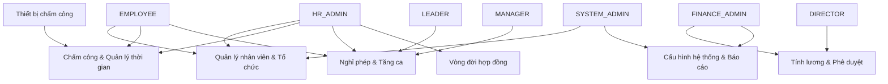
</details>

Hình 2.1: Biểu đồ use case tổng quan

### 2.2.2 Biểu đồ use case phân rã

#### a. Use case Quản lý nhân viên & Tổ chức

Phân hệ này quản lý toàn bộ vòng đời dữ liệu nhân viên. HR_ADMIN và SYSTEM_ADMIN có quyền tạo, cập nhật và vô hiệu hóa tài khoản nhân viên. Mỗi nhân viên được liên kết bắt buộc với một tài khoản đăng nhập và có thể được gán vào một phòng ban.

<details>
<summary>Use case Quản lý nhân viên & Tổ chức</summary>

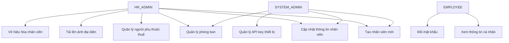
</details>

Hình 2.2: Use case Quản lý nhân viên & Tổ chức

Điểm đặc biệt trong nghiệp vụ: mỗi nhân viên khi được tạo luôn đồng thời có một tài khoản đăng nhập tương ứng — hệ thống bảo đảm không tồn tại nhân viên không có tài khoản hay tài khoản không gắn nhân viên. Nhân viên không thể tự đăng ký; tài khoản được tạo bởi HR và mật khẩu ban đầu được truyền đạt ngoài hệ thống. Thiết kế kỹ thuật bảo đảm tính nhất quán của thao tác tạo đồng thời này được trình bày trong mục 4.2.2.

#### b. Use case Chấm công & Quản lý thời gian

Đây là phân hệ trung tâm kết nối thiết bị vật lý với quy trình nghiệp vụ. Hai luồng xử lý song song: real-time (thiết bị gửi từng sự kiện) và batch upload (thiết bị tải lên khi mạng phục hồi).

<details>
<summary>Use case Chấm công & Quản lý thời gian</summary>

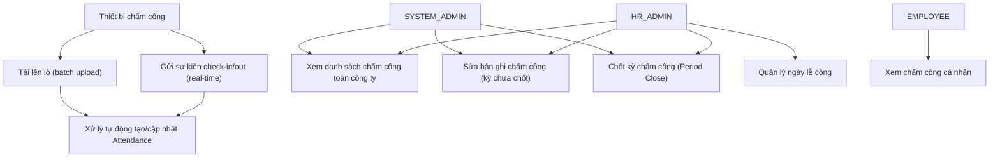
</details>

Hình 2.3: Use case Chấm công & Quản lý thời gian

HR_ADMIN chốt kỳ chấm công là bước gate bắt buộc trước khi Finance có thể tính lương. Thao tác này không thể hoàn tác qua giao diện; một kỳ đã chốt chỉ có thể mở lại qua can thiệp trực tiếp vào cơ sở dữ liệu.

#### c. Use case Nghỉ phép & Tăng ca

Phân hệ này quản lý toàn bộ vòng đời yêu cầu nghỉ phép và tăng ca, với cơ chế phê duyệt đa cấp và kiểm soát số dư.

<details>
<summary>Use case Nghỉ phép & Tăng ca</summary>

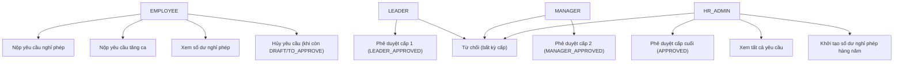
</details>

Hình 2.4: Use case Nghỉ phép & Tăng ca

Hai ràng buộc quan trọng: (1) Yêu cầu nghỉ phép phải qua đúng thứ tự cấp phê duyệt — không thể nhảy cóc; (2) Nộp yêu cầu nghỉ phép ngay lập tức trừ vào số dư "đang chờ duyệt", ngăn nhân viên nộp nhiều yêu cầu trùng thời gian vượt quá số ngày còn lại.

#### d. Use case Vòng đời hợp đồng

<details>
<summary>Use case Vòng đời hợp đồng</summary>

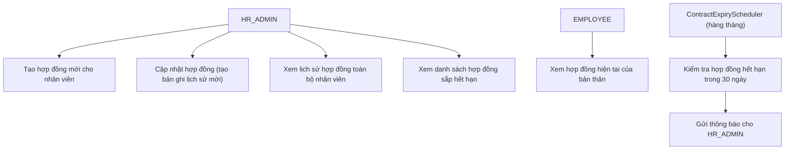
</details>

Hình 2.5: Use case Vòng đời hợp đồng

Mô hình lịch sử hợp đồng (history pattern) đảm bảo không có dữ liệu cũ bị ghi đè: mỗi lần cập nhật tạo ra một bản ghi mới với `effectiveFrom = hôm nay`, đồng thời đánh dấu bản ghi cũ `current = false`. Toàn bộ lịch sử điều kiện làm việc của nhân viên được bảo tồn đầy đủ.

#### e. Use case Tính lương & Phê duyệt

<details>
<summary>Use case Tính lương & Phê duyệt</summary>

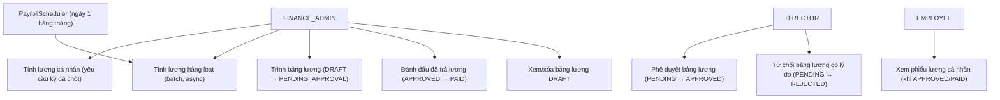
</details>

Hình 2.6: Use case Tính lương & Phê duyệt

Luồng tính lương có gate bắt buộc: Finance chỉ có thể tính lương sau khi HR đã chốt kỳ chấm công. Đây là điểm then chốt đảm bảo tính lương không dựa trên dữ liệu chấm công chưa được kiểm tra.

#### f. Use case Cấu hình hệ thống & Báo cáo

<details>
<summary>Use case Cấu hình hệ thống & Báo cáo</summary>

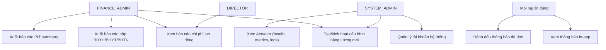
</details>

Hình 2.7: Use case Cấu hình hệ thống & Báo cáo

Cấu hình hệ thống được quản lý theo phiên bản: mỗi loại cấu hình (SALARY_GRADE, PIT, INSURANCE, ALLOWANCE, WORK_SCHEDULE) có thể có nhiều phiên bản lịch sử, nhưng chỉ một phiên bản `active = true` được dùng trong tính lương. Kích hoạt phiên bản mới lập tức làm mới bộ nhớ đệm của PayrollCalculationEngine.

### 2.2.3 Quy trình nghiệp vụ

Phần này mô tả chi tiết ba quy trình nghiệp vụ quan trọng nhất của hệ thống.

#### a. Quy trình chấm công và xử lý Attendance

Quy trình này mô tả hành trình từ khi nhân viên đặt khuôn mặt trước thiết bị đến khi bản ghi chấm công được tạo trong hệ thống và sẵn sàng cho tính lương.

<details>
<summary>Quy trình chấm công</summary>

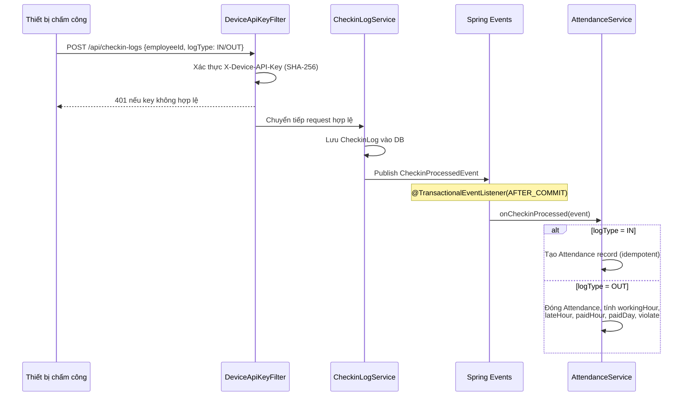
</details>

Hình 2.8: Quy trình chấm công và xử lý Attendance

Pipeline chấm công được thiết kế theo hướng event-driven: bản ghi chấm công thô được lưu trước, sau đó hệ thống mới tạo bản ghi chấm công đã xử lý. Nhờ đó, dù khâu xử lý gặp lỗi, dữ liệu thô vẫn được bảo toàn và tác vụ định kỳ lúc nửa đêm sẽ tự động bù đắp. Chi tiết kiến trúc và lý do lựa chọn được trình bày trong mục 5.2.

#### b. Quy trình phê duyệt nghỉ phép đa cấp

<details>
<summary>Quy trình phê duyệt nghỉ phép</summary>

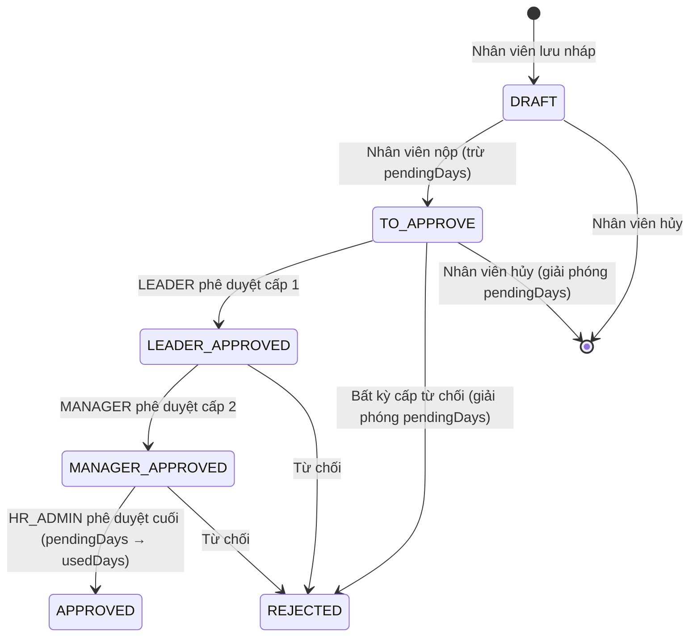
</details>

Hình 2.9: Quy trình phê duyệt nghỉ phép đa cấp

Về mặt nghiệp vụ, khi nhân viên nộp yêu cầu, số ngày nghỉ được tạm giữ ngay để ngăn việc đăng ký trùng vượt quá số dư; chỉ khi yêu cầu được phê duyệt cuối, số ngày này mới được tính là đã sử dụng, còn khi bị từ chối hoặc hủy thì được hoàn trả đầy đủ. Cơ chế trừ hai giai đoạn và cách chống tranh chấp đồng thời (race condition) được trình bày chi tiết trong mục 5.4.

#### c. Quy trình tính lương và phê duyệt chi trả

<details>
<summary>Quy trình tính lương</summary>

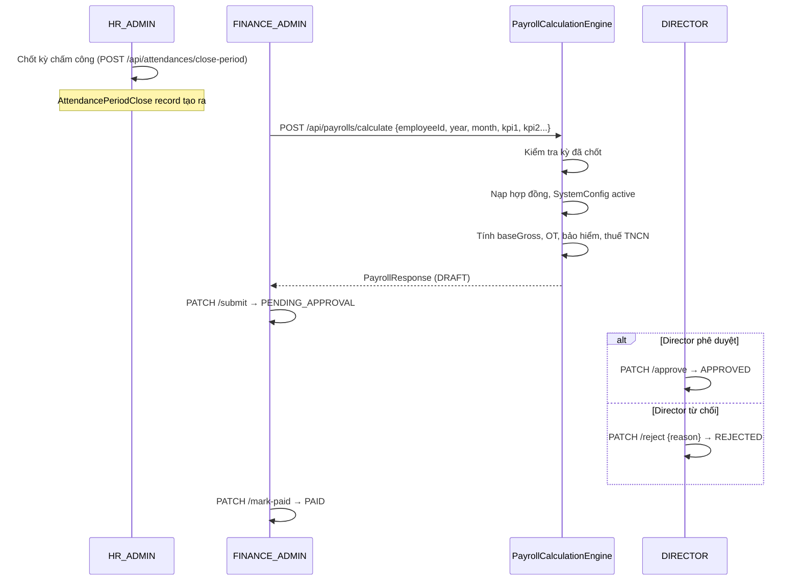
</details>

Hình 2.10: Quy trình tính lương và phê duyệt chi trả

Quy trình tính lương có một điểm gate quan trọng về mặt nghiệp vụ: bộ phận Kế toán chỉ có thể tính lương sau khi kỳ chấm công đã được HR chốt, và bảng lương phải qua phê duyệt của Ban Giám đốc trước khi được đánh dấu chi trả. Thiết kế kỹ thuật của bộ máy tính lương và công thức tuân thủ pháp luật được trình bày chi tiết trong mục 5.3.

## 2.3 Đặc tả chức năng

Phần này đặc tả chi tiết năm ca sử dụng quan trọng nhất của hệ thống.

### 2.3.1 Đặc tả use case Chấm công & Chốt kỳ

Bảng 2.2: Đặc tả ca sử dụng Chấm công & Chốt kỳ

| Trường | Nội dung |
|---|---|
| Tên use case | Chấm công và chốt kỳ |
| Mã use case | UC-ATT-01 |
| Tác nhân chính | Thiết bị chấm công nhận diện khuôn mặt |
| Tác nhân phụ | HR_ADMIN (chốt kỳ) |
| Mô tả | Thiết bị gửi sự kiện check-in/check-out; hệ thống tự động tạo và cập nhật bản ghi chấm công; cuối tháng HR chốt kỳ để cho phép tính lương |
| Điều kiện tiên quyết | Thiết bị đã được đăng ký với API key hợp lệ; nhân viên tồn tại trong hệ thống |
| Luồng chính | 1. Thiết bị gửi sự kiện check-in (logType=IN) kèm khóa API xác thực của thiết bị |
| | 2. Hệ thống xác thực khóa API của thiết bị; nếu không hợp lệ, từ chối yêu cầu |
| | 3. Hệ thống lưu bản ghi chấm công thô và phát sự kiện xử lý nội bộ |
| | 4. Sau khi lưu thành công, hệ thống tạo bản ghi chấm công mới cho ngày (đảm bảo không trùng lặp) |
| | 5. Cuối ngày: thiết bị gửi sự kiện check-out; hệ thống đóng bản ghi, tính giờ công, giờ đến muộn, giờ được trả lương và ngày công, đánh dấu vi phạm nếu đến muộn |
| | 6. Cuối tháng: HR_ADMIN thực hiện chốt kỳ ở chế độ thử (không ép buộc) |
| | 7. Hệ thống quét vắng mặt không giải thích, trả về danh sách nếu có |
| | 8. HR xử lý từng trường hợp bất thường rồi chốt kỳ ở chế độ ép buộc nếu cần |
| | 9. Bản ghi chốt kỳ được tạo; kỳ chấm công bị khóa |
| Luồng thay thế | 3a. Thiết bị mất mạng: tải lên lô bản ghi chấm công khi mạng phục hồi |
| | 4a. Nhân viên quên check-out: tác vụ định kỳ lúc nửa đêm backfill từ log ngày hôm trước |
| | 7a. Không có vắng mặt bất thường: kỳ được chốt ngay lập tức |
| Luồng ngoại lệ | 2a. API key đã bị vô hiệu hóa: trả 401 |
| | 6a. Kỳ đã chốt trước đó: trả 400 |
| Điều kiện kết thúc | `AttendancePeriodClose` record tồn tại; FINANCE_ADMIN có thể bắt đầu tính lương |

### 2.3.2 Đặc tả use case Phê duyệt nghỉ phép

Bảng 2.3: Đặc tả ca sử dụng Phê duyệt nghỉ phép

| Trường | Nội dung |
|---|---|
| Tên use case | Phê duyệt nghỉ phép đa cấp |
| Mã use case | UC-LV-01 |
| Tác nhân chính | EMPLOYEE (nộp), LEADER (cấp 1), MANAGER (cấp 2), HR_ADMIN (cấp cuối) |
| Mô tả | Nhân viên nộp yêu cầu nghỉ phép; hệ thống kiểm tra số dư và dự trữ ngay; yêu cầu đi qua ba cấp phê duyệt |
| Điều kiện tiên quyết | Nhân viên đã đăng nhập; `LeaveBalance` đã khởi tạo cho năm hiện tại; ngày kết thúc ≥ ngày bắt đầu |
| Luồng chính | 1. Nhân viên chọn loại nghỉ phép, ngày bắt đầu, ngày kết thúc, lý do |
| | 2. Hệ thống kiểm tra `leaveType` không phải PUBLIC_HOLIDAY hoặc COMPENSATORY |
| | 3. Hệ thống so sánh `requestedDays` với `remainingDays` trong `LeaveBalance` |
| | 4. Hệ thống trừ `requestedDays` khỏi `remainingDays`, cộng vào `pendingDays`; lưu yêu cầu trạng thái `TO_APPROVE` |
| | 5. Hệ thống gửi thông báo cho LEADER của nhân viên |
| | 6. LEADER phê duyệt → `LEADER_APPROVED`; MANAGER phê duyệt → `MANAGER_APPROVED` |
| | 7. HR_ADMIN phê duyệt cuối → `APPROVED`; hệ thống chuyển `pendingDays` sang `usedDays` |
| Luồng thay thế | 6a–7a. Bất kỳ cấp nào từ chối: `REJECTED`; `pendingDays` hoàn trả về `remainingDays` |
| | 4a. Nhân viên hủy khi còn `DRAFT` hoặc `TO_APPROVE`: `pendingDays` hoàn trả |
| | 7b. HR_ADMIN có thể phê duyệt ở bất kỳ cấp nào |
| Luồng ngoại lệ | 3a. `remainingDays < requestedDays`: trả 400 kèm số ngày còn lại |
| | 2a. `leaveType = PUBLIC_HOLIDAY` hoặc `COMPENSATORY`: trả 400 |
| Điều kiện kết thúc | Yêu cầu ở trạng thái `APPROVED` (usedDays tăng) hoặc `REJECTED` (remainingDays được hoàn) |
| Yêu cầu đặc biệt | Cơ chế trừ hai giai đoạn phải atomic để tránh race condition khi nhiều yêu cầu nộp đồng thời |

### 2.3.3 Đặc tả use case Tính lương

Bảng 2.4: Đặc tả ca sử dụng Tính lương

| Trường | Nội dung |
|---|---|
| Tên use case | Tính lương cá nhân |
| Mã use case | UC-PAY-01 |
| Tác nhân chính | FINANCE_ADMIN |
| Mô tả | Finance tính toán lương đầy đủ cho một nhân viên trong một kỳ dựa trên chấm công, hợp đồng và cấu hình hệ thống |
| Điều kiện tiên quyết | Kỳ chấm công đã chốt; nhân viên có hợp đồng `current=true`; SystemConfig active cho đủ 5 loại cấu hình |
| Luồng chính | 1. Finance yêu cầu tính lương cho một nhân viên trong kỳ, cung cấp xếp loại KPI và các khoản thưởng |
| | 2. Hệ thống kiểm tra kỳ chấm công đã được chốt; nếu chưa, từ chối yêu cầu |
| | 3. Hệ thống nạp hợp đồng đang hiệu lực và cấu hình hệ thống đang áp dụng |
| | 4. Tính `KPItb = (KPI1 + KPI2) / 2` với KPI1 từ rating, KPI2 từ tỷ lệ chuyên cần |
| | 5. `baseGross = [(Lhq × KPItb) + Li + HTi] × (NCtt / Nt)` |
| | 6. Cộng OT pay: ×1.5/×2.0/×3.0 × hệ số ca đêm theo tỷ lệ chồng lấp 22:00–06:00 |
| | 7. Tính `insuranceBase = min(totalGross, 46.800.000 VNĐ)` |
| | 8. Khấu trừ BHXH 8%, BHYT 1.5%, BHTN 1%; tính thuế TNCN lũy tiến 7 bậc |
| | 9. Tính chi phí phía chủ: BHXH 17%, BHYT 3%, BHTN 1%, TNLĐ-BNN 0.5% |
| | 10. Lưu `Payroll` record trạng thái `DRAFT` |
| Luồng thay thế | 1a. Tính lương hàng loạt: chạy bất đồng bộ, trả về mã công việc để theo dõi tiến độ |
| Luồng ngoại lệ | 2a. Kỳ chưa chốt: từ chối yêu cầu |
| | 3a. Không có hợp đồng hiệu lực: từ chối yêu cầu |
| | Đã tồn tại bảng lương cho nhân viên trong kỳ: từ chối để tránh trùng lặp |
| Điều kiện kết thúc | `Payroll` record trạng thái `DRAFT` sẵn sàng cho Finance xem xét và trình duyệt |
| Yêu cầu đặc biệt | `PayrollCalculationEngine` là pure function — không truy cập DB trực tiếp để dễ unit test |

### 2.3.4 Đặc tả use case Phê duyệt bảng lương

Bảng 2.5: Đặc tả ca sử dụng Phê duyệt bảng lương

| Trường | Nội dung |
|---|---|
| Tên use case | Phê duyệt bảng lương |
| Mã use case | UC-PAY-02 |
| Tác nhân chính | FINANCE_ADMIN (trình duyệt, đánh dấu đã trả), DIRECTOR (phê duyệt/từ chối) |
| Mô tả | Finance trình bảng lương lên Director; Director phê duyệt hoặc từ chối; Finance đánh dấu đã chi trả sau phê duyệt |
| Điều kiện tiên quyết | Bảng lương đang ở trạng thái `DRAFT` |
| Luồng chính | 1. Finance xem xét chi tiết bảng lương DRAFT; có thể xóa và tính lại nếu cần |
| | 2. Finance trình bảng lương → `PENDING_APPROVAL`; hệ thống gửi thông báo cho Director |
| | 3. Director xem tổng quan chi phí lao động và chi tiết từng bảng lương |
| | 4. Director phê duyệt → `APPROVED`; thông báo cho Finance và nhân viên |
| | 5. Finance xác nhận đã chi trả lương qua ngân hàng |
| | 6. Finance đánh dấu đã chi trả → `PAID` (trạng thái cuối) |
| Luồng thay thế | 4a. Director từ chối kèm lý do → `REJECTED`; Finance nhận thông báo kèm lý do |
| | 4b. Sau từ chối: Finance xóa bảng lương `REJECTED` và tính lại từ đầu |
| Luồng ngoại lệ | 4a. HR_ADMIN cố gắng phê duyệt: trả 403 (chỉ DIRECTOR mới có quyền) |
| | 6a. Finance mark-paid khi trạng thái không phải `APPROVED`: trả 400 |
| Điều kiện kết thúc | Bảng lương ở trạng thái `PAID` (không thể thay đổi) hoặc `REJECTED` (Finance xử lý lại) |
| Yêu cầu đặc biệt | `rejectionReason` bắt buộc khi từ chối (VARCHAR 500); lưu trên bản ghi và trả về qua thông báo |

### 2.3.5 Đặc tả use case Báo cáo tài chính

Bảng 2.6: Đặc tả ca sử dụng Báo cáo tài chính

| Trường | Nội dung |
|---|---|
| Tên use case | Xuất báo cáo tài chính |
| Mã use case | UC-RPT-01 |
| Tác nhân chính | FINANCE_ADMIN, DIRECTOR |
| Mô tả | Hệ thống tổng hợp dữ liệu lương đã phê duyệt thành ba loại báo cáo phục vụ kế toán và tuân thủ pháp luật |
| Điều kiện tiên quyết | Tồn tại ít nhất một Payroll ở trạng thái `APPROVED` hoặc `PAID` trong kỳ truy vấn |
| Luồng chính — Báo cáo Chi phí lao động | Tổng hợp lương gộp, lương thực nhận, tổng bảo hiểm, thuế TNCN, tăng ca và tổng chi phí sử dụng lao động theo từng nhân viên và bộ phận |
| Luồng chính — Báo cáo nộp BHXH | Tổng hợp mã BHXH, mức lương đóng (sau khi áp trần) và tất cả khoản BHXH/BHYT/BHTN phía người lao động và người sử dụng lao động |
| Luồng chính — Báo cáo thuế TNCN | Tổng hợp mã số thuế, số người phụ thuộc, thu nhập tính thuế và thuế TNCN theo từng nhân viên |
| Luồng ngoại lệ | Không có payroll phê duyệt trong kỳ: trả mảng rỗng |
| Điều kiện kết thúc | Dữ liệu JSON trả về; frontend hỗ trợ xuất CSV UTF-8 BOM |
| Yêu cầu đặc biệt | Chỉ tính trên Payroll `APPROVED`/`PAID`; Payroll `DRAFT`/`PENDING`/`REJECTED` không được tính vào |

## 2.4 Yêu cầu phi chức năng

Ngoài các yêu cầu chức năng, hệ thống FaceZ HRMS phải đáp ứng các yêu cầu phi chức năng sau.

Bảng 2.7: Các yêu cầu phi chức năng

| # | Nhóm | Yêu cầu | Ưu tiên | Cách đáp ứng |
|---|---|---|---|---|
| PF-01 | Hiệu năng | Thời gian phản hồi API < 500ms cho 95% request trong điều kiện bình thường (≤ 50 người dùng đồng thời) | Cao | HikariCP connection pool; Redis cache cho JWT validation; index đúng trên các cột thường xuyên truy vấn |
| PF-02 | Hiệu năng | Tính lương hàng loạt cho 200 nhân viên hoàn thành trong < 60 giây | Trung bình | `@Async` với thread pool cấu hình; `PayrollCalculationEngine` là pure computation không có I/O blocking |
| PF-03 | Hiệu năng | Xử lý sự kiện check-in real-time < 500ms end-to-end | Cao | DeviceApiKeyFilter nhẹ; AttendanceService xử lý sau AFTER_COMMIT không block response |
| RC-01 | Độ tin cậy | Schema database quản lý bằng Flyway; không dùng `ddl-auto: update` | Cao | 19 Flyway migration (V1–V19); `validate-on-migrate: true` |
| RC-02 | Độ tin cậy | Toàn bộ thay đổi dữ liệu nghiệp vụ có audit trail | Cao | `AuditableEntity` mapped superclass; Spring Data JPA auditing |
| RC-03 | Độ tin cậy | Bản ghi chấm công không bị mất khi kết nối thiết bị gián đoạn | Cao | `CheckinLog` lưu trước; `AttendanceSchedule` backfill lúc nửa đêm |
| RC-04 | Độ tin cậy | Xóa mềm trên tất cả entity; không xóa vật lý dữ liệu lịch sử | Trung bình | Trường `deleteFlag` và `deletedAt` trên mọi entity |
| SC-01 | Bảo mật | Xác thực JWT: Access Token 5 phút, Refresh Token 14 ngày trong HttpOnly cookie | Cao | `JwtService` với Redis blacklist cho JTI; token rotation mỗi lần refresh |
| SC-02 | Bảo mật | Chống brute-force đăng nhập: tối đa 10 lần/15 phút mỗi IP | Cao | `LoginRateLimiter` dùng Redis counter, phân biệt theo `X-Forwarded-For` |
| SC-03 | Bảo mật | Thiết bị chấm công xác thực bằng API key; raw key không lưu | Cao | `DeviceApiKeyFilter` so khớp SHA-256; tạo key mới vô hiệu hóa key cũ |
| SC-04 | Bảo mật | Phân quyền granular theo vai trò và HTTP method | Cao | `@PreAuthorize` annotation; SecurityConfig với URL-level rules |
| SC-05 | Bảo mật | Secrets không được hardcode | Cao | Environment variable substitution trong `application.yml` |
| US-01 | Khả năng sử dụng | Giao diện tự động điều chỉnh menu theo vai trò đăng nhập | Cao | `ProtectedRoute` component và role-aware `Sidebar` trong frontend |
| US-02 | Khả năng sử dụng | Thông báo lỗi rõ ràng bằng tiếng Việt khi thao tác không hợp lệ | Trung bình | `ApiResponse<T>` với trường `message` từ backend; toast notification ở frontend |
| US-03 | Khả năng sử dụng | Session tự động gia hạn trong suốt phiên làm việc | Cao | Silent refresh: `apiClient()` bắt 401, tự gọi `/api/auth/refresh`, retry request gốc |
| MT-01 | Khả năng bảo trì | Mọi thay đổi schema phải qua Flyway migration có số phiên bản | Cao | Convention V{n}__{description}.sql; `out-of-order: false` |
| MT-02 | Khả năng bảo trì | API có tài liệu Swagger tự động cập nhật | Trung bình | SpringDoc OpenAPI; truy cập tại `/swagger-ui.html` |
| MT-03 | Khả năng bảo trì | Log có cấu trúc JSON ở production; log có màu ở development | Trung bình | `logback-spring.xml` với profile-aware configuration; `RequestLoggingFilter` |
| MT-04 | Khả năng bảo trì | Health check endpoint công khai để giám sát vận hành | Thấp | Spring Boot Actuator tại `/actuator/health` (public); các endpoint khác yêu cầu SYSTEM_ADMIN |

Chương này đã hoàn thành việc xác định yêu cầu hệ thống từ cả góc độ chức năng lẫn phi chức năng. Phân tích cho thấy khoảng trống thị trường rõ ràng: chưa có giải pháp nào đồng thời đáp ứng ba yêu cầu là tính lương đúng pháp luật Việt Nam, tích hợp thiết bị nhận diện khuôn mặt qua REST, và kiến trúc phân tách nhiệm vụ kiểm soát nội bộ. Tập yêu cầu và đặc tả use case đã xây dựng trong chương này trở thành hợp đồng chức năng cho giai đoạn lựa chọn công nghệ được trình bày trong Chương 3.

---

# CHƯƠNG 3. NỀN TẢNG LÝ THUYẾT VÀ CÔNG NGHỆ SỬ DỤNG

Xuất phát từ các yêu cầu đã xác định trong Chương 2, chương này phân tích nền tảng lý luận cho từng quyết định công nghệ của FaceZ HRMS. Với mỗi bài toán kỹ thuật, chương liệt kê các hướng tiếp cận hiện có, đánh giá ưu nhược điểm, và lý giải quyết định cuối cùng trong ngữ cảnh cụ thể của đồ án. Các công nghệ được tổ chức theo sáu nhóm: framework backend và ngôn ngữ lập trình (Mục 3.2), cơ sở dữ liệu và bộ nhớ đệm (Mục 3.3), cơ chế xác thực JWT và bảo mật (Mục 3.4), framework frontend (Mục 3.5), và hạ tầng tài liệu API (Mục 3.6).

## 3.1 Tổng quan các lựa chọn công nghệ

Mỗi quyết định công nghệ trong đồ án được đưa ra dựa trên một bài toán cụ thể cần giải quyết, chứ không phải dựa trên mức độ phổ biến hay sở thích cá nhân. Phần này trước tiên trình bày bức tranh tổng thể các lựa chọn và lý do căn bản, trước khi đi sâu vào từng công nghệ ở các mục tiếp theo.

Bảng 3.1: Tóm tắt các lựa chọn công nghệ

| Tầng | Công nghệ được chọn | Các lựa chọn thay thế đã xem xét | Lý do lựa chọn |
|---|---|---|---|
| Backend Runtime | Java 21 + Spring Boot 4.0.0-M3 | Node.js/Express, Python/Django, Go/Gin | Hệ sinh thái doanh nghiệp trưởng thành; Spring Security, JPA, Events sẵn có; Virtual Threads cho I/O-bound workload |
| Bảo mật | Spring Security + JWT | OAuth2/Keycloak, Session-based | Kiểm soát hoàn toàn luồng xác thực; không phụ thuộc dịch vụ ngoài; JWT phù hợp SPA stateless |
| Schema Migration | Flyway | Liquibase, Hibernate ddl-auto | Convention đơn giản hơn Liquibase; an toàn hơn `ddl-auto: update`/`create` |
| ORM | Spring Data JPA (Hibernate) | JOOQ, MyBatis, JDBC Template | Giảm boilerplate; tích hợp sẵn Spring Auditing và Soft Delete |
| Cơ sở dữ liệu chính | PostgreSQL 15 | MySQL 8, MongoDB, MariaDB | JSONB cho SystemConfig; partial unique index cho hợp đồng; database view cho truy vấn OT |
| Cache & Session Store | Redis 7 | Memcached, Hazelcast, in-memory | Persistent TTL cho JWT blacklist; atomic counter cho rate limiting; pub/sub nếu cần mở rộng |
| Rate Limiting | Redis counter (tự triển khai) | Bucket4j, resilience4j | Đủ đơn giản cho bài toán; không thêm dependency; tương thích multi-instance |
| Frontend Framework | Next.js 15 (App Router) | Create React App, Vite+React, Vue 3 | SSR cho hiệu suất; App Router cho nested layouts theo role; TypeScript first-class |
| UI Styling | Tailwind CSS 3 | Bootstrap, MUI, Chakra UI | Utility-first phù hợp dashboard phức tạp; không bị ràng buộc design system bên thứ ba |
| Charts | Recharts | Chart.js, ApexCharts, D3.js | Tích hợp native với React; declarative API; hỗ trợ ResponsiveContainer tốt |
| Containerization | Docker + Docker Compose | Kubernetes, bare metal | Docker Compose đủ cho single-host deployment; Kubernetes quá phức tạp cho quy mô hiện tại |
| API Documentation | SpringDoc OpenAPI (Swagger) | Postman Collection, API Blueprint | Tự động sinh từ annotation; luôn đồng bộ với code; UI test trực tiếp trên browser |

## 3.2 Nhóm xử lý nghiệp vụ — Backend

### 3.2.1 Spring Boot và Java 21

Bài toán cần giải quyết: Hệ thống HRMS có độ phức tạp nghiệp vụ cao — nhiều entity với vòng đời phức tạp, transaction lồng nhau, event-driven pipeline, scheduled jobs, và batch processing. Cần một nền tảng có hệ sinh thái đủ trưởng thành để không phải tự xây dựng các thành phần cơ sở từ đầu.

Lý do chọn Java 21 và Spring Boot 4.0.0-M3:

Java 21 là phiên bản LTS (Long-Term Support) mới nhất, mang hai cải tiến quan trọng cho dự án này. Thứ nhất, Virtual Threads (Project Loom, ổn định từ Java 21): mỗi request HTTP được xử lý trên một virtual thread thay vì platform thread, cho phép hàng nghìn kết nối đồng thời với bộ nhớ tối thiểu mà không phải viết code bất đồng bộ phức tạp. Điều này đặc biệt quan trọng cho batch payroll processing khi nhiều tác vụ I/O-bound (đọc dữ liệu từ DB) chạy đồng thời. Thứ hai, Records và Sealed Classes giúp viết DTO và response type an toàn kiểu hơn, giảm boilerplate so với Java 8.

Spring Boot 4.0.0-M3 được chọn vì hệ sinh thái tích hợp sẵn:

- Spring Security: Cung cấp filter chain có thể cấu hình để thêm `DeviceApiKeyFilter` trước `JwtAuthFilter`, phân quyền granular theo URL pattern và HTTP method, tích hợp `@PreAuthorize` cho method-level security.
- Spring Data JPA: Giảm boilerplate truy cập database; hỗ trợ `@CreatedBy`, `@LastModifiedBy` qua `AuditingEntityListener`; tích hợp Flyway lifecycle.
- Spring Events: Cơ chế publish/subscribe nội bộ với `@TransactionalEventListener(AFTER_COMMIT)` cho phép tách `CheckinLogService` và `AttendanceService` mà không tạo circular dependency và không cần message broker ngoài.
- Spring Scheduling: `@Scheduled` với cron expression cho `AttendanceSchedule`, `PayrollScheduler`, `ContractExpiryScheduler`.
- Spring Async: `@Async` cho batch payroll processing — tránh block HTTP thread khi tính lương hàng loạt.

So sánh với lựa chọn thay thế:

*Node.js/Express* có ưu điểm về tốc độ phát triển nhưng hệ sinh thái doanh nghiệp (security, auditing, migration) kém trưởng thành hơn. TypeScript trên Node.js thiếu các annotation như `@PreAuthorize` hay `@Transactional` khiến code phân quyền và transaction phức tạp hơn nhiều. *Python/Django* có ORM mạnh nhưng performance multi-threading kém do GIL; không có tương đương Spring Events. *Go/Gin* nhanh nhưng thiếu hệ sinh thái ORM và security cho nghiệp vụ phức tạp.

Kiến trúc package của backend tuân theo tổ chức theo domain (không phải theo layer), với package root `org.dummy.facez`:

```
org.dummy.facez/
├── configs/        — Cấu hình Spring (Security, Redis, JPA Auditing, Data Initializer)
├── auth/           — Xác thực, JWT, login rate limiting
├── domain/
│   ├── employee/   — EmployeeInfo, UserAccount, TaxDependent, Benefit
│   ├── department/ — Department management
│   ├── attendance/ — Attendance, CheckinLog, AttendancePeriodClose, Device API keys
│   ├── leave/      — LeaveRequest, LeaveBalance, PublicHoliday
│   ├── otrequest/  — OTRequest (cùng approval flow với leave)
│   ├── contract/   — Contract (history model)
│   ├── payroll/    — Payroll, PayrollBatchService, PayrollCalculationEngine, SystemConfig
│   └── notification/ — Notification, Spring Application Events
└── common/
    ├── enums/      — Role, RequestStatus, PayrollStatus, LeaveType, v.v.
    ├── filters/    — JwtAuthFilter, DeviceApiKeyFilter
    ├── services/   — JwtService, AuditorAwareImpl
    └── utils/      — Exception handlers, Response wrappers
```

Tổ chức theo domain (thay vì theo layer `controllers/`, `services/`, `repositories/`) giúp mỗi feature module tự chứa và dễ navigate hơn khi codebase lớn.

### 3.2.2 Spring Security và kiến trúc phân quyền

Bài toán cần giải quyết: Hệ thống có bảy vai trò với quyền hạn chồng lấp phức tạp. Cùng một endpoint `GET /api/employees` có thể được truy cập bởi HR_ADMIN (xem tất cả), MANAGER (xem nhân viên trong phòng ban), và EMPLOYEE (xem chính mình). Thiết bị chấm công xác thực bằng API key thay vì JWT. Cần cơ chế phân quyền đủ linh hoạt để xử lý tất cả trường hợp này.

Kiến trúc bảo mật được triển khai:

Spring Security filter chain trong FaceZ HRMS được cấu hình theo thứ tự ưu tiên:

```
Request
  │
  ▼
DeviceApiKeyFilter       ← Xác thực X-Device-API-Key cho /api/checkin-logs/
  │ (nếu không match endpoint checkin → bỏ qua)
  ▼
JwtAuthFilter            ← Xác thực Bearer token cho tất cả endpoint còn lại
  │ (đọc username từ token, nạp UserDetails, set SecurityContext)
  ▼
SecurityConfig URL Rules ← Kiểm tra quyền truy cập theo URL pattern + HTTP method
  │
  ▼
@PreAuthorize            ← Kiểm tra quyền truy cập ở method-level (chi tiết hơn)
  │
  ▼
Controller Method
```

`DeviceApiKeyFilter` chạy trước `JwtAuthFilter` vì thiết bị không có JWT — nếu `JwtAuthFilter` chạy trước, thiết bị sẽ bị từ chối ngay. Khi thiết bị gửi request đến `/api/checkin-logs/` với header `X-Device-API-Key` hợp lệ, filter set `DEVICE_CHECKIN` authority vào `SecurityContext` và bỏ qua JWT validation.

Ở tầng method, `@PreAuthorize` được dùng cho các trường hợp phức tạp hơn URL matching:

```java
// Chỉ FINANCE_ADMIN và SYSTEM_ADMIN mới tính được lương
@PreAuthorize("hasAnyRole('FINANCE_ADMIN', 'SYSTEM_ADMIN')")
public PayrollResponse calculate(...) { ... }

// Chỉ DIRECTOR mới phê duyệt được
@PreAuthorize("hasRole('DIRECTOR')")
public PayrollResponse approve(String id) { ... }

// Employee chỉ xem phiếu lương của chính mình
@PreAuthorize("hasRole('EMPLOYEE')")
public PayrollResponse getMySlip(@AuthenticationPrincipal ...) { ... }
```

### 3.2.3 Spring Data JPA và Flyway

Spring Data JPA giải quyết ba bài toán đồng thời:

*Bài toán 1 — Audit Trail:* Mọi thay đổi dữ liệu nghiệp vụ cần ghi lại ai đã tạo/sửa và khi nào. Triển khai bằng `AuditableEntity` (mapped superclass):

```java
@MappedSuperclass
@EntityListeners(AuditingEntityListener.class)
public abstract class AuditableEntity {
    @CreatedDate   LocalDateTime createdAt;
    @LastModifiedDate LocalDateTime updatedAt;
    @CreatedBy     String createdBy;   // username từ SecurityContext
    @LastModifiedBy String updatedBy;
}
```

`AuditorAwareImpl` đọc username từ `SecurityContextHolder.getContext().getAuthentication()` và trả về cho Spring Auditing. Mọi entity kế thừa `AuditableEntity` tự động được ghi audit trail mà không cần viết code thủ công.

*Bài toán 2 — Soft Delete:* Dữ liệu lịch sử không được xóa vật lý. Tất cả entity có trường `deleteFlag` (boolean) và `deletedAt` (LocalDateTime). Repository dùng `@Where(clause = "delete_flag = false")` để lọc bản ghi đã xóa khỏi mọi query tự động.

*Bài toán 3 — Derived Queries:* Spring Data JPA tự sinh SQL từ tên phương thức (`findByEmployeeIdAndYearAndMonth`, `findAllByCurrentTrueAndEmployeeId`) giảm đáng kể boilerplate JPQL/SQL.

Flyway giải quyết bài toán quản lý schema database. Vấn đề với `ddl-auto: update` (cách tiếp cận đơn giản ban đầu) là: Hibernate tự sinh SQL thay đổi schema dựa trên so sánh entity class với database, nhưng nó không thể tự xử lý các thao tác phức tạp như đổi tên cột, chia cột, hay migration data. Quan trọng hơn, không có cách nào biết chính xác môi trường production đang ở schema version nào.

Flyway với convention `V{n}__{description}.sql` giải quyết tất cả vấn đề này: mỗi thay đổi schema là một file có số thứ tự rõ ràng, chỉ chạy một lần, kết quả được ghi vào bảng `flyway_schema_history`. Cấu hình `validate-on-migrate: true` đảm bảo nếu entity Java và database schema không khớp, ứng dụng từ chối khởi động — phát hiện drift sớm thay vì runtime error.

FaceZ HRMS có 19 migration file (V1–V19) phản ánh toàn bộ lịch sử phát triển schema, từ baseline đến các thay đổi phức tạp như chuyển đổi `VARCHAR → LocalDate` cho contract dates (migration V12 dùng kỹ thuật cột song song để zero-downtime).

## 3.3 Nhóm dữ liệu

### 3.3.1 PostgreSQL 15

Bài toán cần giải quyết: Hệ thống HRMS có ba yêu cầu đặc thù với cơ sở dữ liệu mà không phải mọi RDBMS đều hỗ trợ tốt:

Yêu cầu 1 — Cấu hình linh hoạt dạng JSON: Bảng `system_config` lưu cấu hình tính lương (biểu thuế PIT 7 bậc, bảng lương bậc thang, tỷ lệ bảo hiểm) dưới dạng cấu trúc JSON khác nhau tùy từng loại. Dùng nhiều bảng riêng cho mỗi loại cấu hình sẽ phức tạp khi thêm loại mới; dùng VARCHAR lưu JSON thì không thể query một phần. JSONB của PostgreSQL lưu JSON ở dạng binary có thể query và index — `configData::jsonb -> 'brackets'` trả về mảng bậc thuế trực tiếp từ SQL.

Yêu cầu 2 — Ràng buộc unique có điều kiện: Bảng `contract` dùng history pattern — mỗi nhân viên có nhiều bản ghi contract nhưng chỉ một bản `current = true`. Cần ràng buộc đảm bảo không có hai bản ghi `current = true` cho cùng nhân viên, nhưng không ảnh hưởng đến các bản ghi `current = false`. Partial unique index của PostgreSQL giải quyết chính xác: `CREATE UNIQUE INDEX ... WHERE current = true` — một tính năng không có trong MySQL 8 (MySQL chỉ hỗ trợ functional index từ 8.0.13 nhưng không phải partial index).

Yêu cầu 3 — Tối ưu truy vấn tổng hợp: Kiểm tra giới hạn OT hàng tháng/năm của nhân viên cần tổng hợp dữ liệu từ `ot_request` theo nhiều điều kiện. Thay vì viết subquery phức tạp trong mỗi endpoint, PostgreSQL cho phép định nghĩa Database View `ot_monthly_summary` một lần, các query sau đó chỉ cần `SELECT * FROM ot_monthly_summary WHERE employeeId = ?`.

So sánh với MySQL 8: MySQL 8 hỗ trợ JSONB nhưng hạn chế hơn PostgreSQL về toán tử JSON; không hỗ trợ partial unique index. MongoDB hỗ trợ linh hoạt hơn về schema nhưng thiếu ACID transaction đủ mạnh cho payroll calculation (đọc-tính-ghi phải atomic); join giữa nhiều collection phức tạp hơn SQL join đáng kể.

Cấu hình PostgreSQL trong dự án:

```yaml
spring:
  datasource:
    url: ${DB_URL:jdbc:postgresql://localhost:5432/facez}
    username: ${DB_USERNAME:postgres}
    password: ${DB_PASSWORD:postgres}
    hikari:
      maximum-pool-size: 10
      minimum-idle: 5
      connection-timeout: 30000
```

HikariCP connection pool với 10 connection tối đa phù hợp với workload hiện tại (< 100 concurrent users). Khi scale lên, tăng `maximum-pool-size` và thêm read replica là đủ mà không cần thay đổi kiến trúc.

### 3.3.2 Redis 7

Bài toán cần giải quyết: Hai nghiệp vụ của FaceZ HRMS cần lưu trạng thái chia sẻ nhanh giữa các request mà database quan hệ không phù hợp do overhead I/O:

Bài toán 1 — JWT Token Blacklist: Access Token có TTL 5 phút và không thể revoke theo design của JWT (stateless). Nhưng khi người dùng đăng xuất, cần đảm bảo Access Token cũ không còn dùng được ngay lập tức. Giải pháp: lưu JTI (JWT ID) của token đã bị revoke vào Redis với TTL bằng thời gian sống còn lại của token. Mỗi request, `JwtAuthFilter` kiểm tra JTI trong Redis blacklist — nếu tồn tại, từ chối request dù token signature hợp lệ. Refresh Token (14 ngày) cũng được lưu JTI trong Redis để hỗ trợ token rotation: khi refresh, JTI cũ bị revoke và JTI mới được lưu.

Bài toán 2 — Login Rate Limiting: Giới hạn 10 lần đăng nhập sai mỗi 15 phút mỗi IP cần counter tự reset sau TTL. Redis `INCR` + `EXPIRE` thực hiện atomic counter với TTL tự động — không cần scheduled cleanup job. `LoginRateLimiter` dùng key `login_attempt:{ip}`, mỗi lần đăng nhập sai gọi `INCR`, nếu key chưa tồn tại gọi thêm `EXPIRE 900` (15 phút).

Tại sao không dùng in-memory (HashMap)? Không tương thích multi-instance deployment — nếu có nhiều instance backend, counter trên instance A không chia sẻ với instance B. Redis là distributed store chia sẻ giữa tất cả instances.

Tại sao không dùng database? Mỗi API request cần kiểm tra blacklist → thêm một DB read vào hot path. Redis in-memory có latency < 1ms so với PostgreSQL thường 5–20ms. Với hàng trăm request mỗi giây, sự khác biệt này tích lũy đáng kể.

Tại sao không dùng Memcached? Memcached không hỗ trợ TTL per-key tự động sau `EXPIRE`, thiếu Lua scripting cho atomic operations, và không hỗ trợ persistence nếu cần mở rộng sau.

## 3.4 Xác thực và Bảo mật

### 3.4.1 JSON Web Token (JWT)

Bài toán cần giải quyết: Ứng dụng SPA (Single Page Application) với frontend Next.js tách biệt hoàn toàn backend cần cơ chế xác thực stateless — backend không lưu session state, mỗi request phải tự mang đủ thông tin xác thực.

Kiến trúc JWT hai token:

JWT thuần túy (chỉ dùng Access Token) có một vấn đề: nếu token có TTL dài (vài giờ), người dùng phải đăng nhập lại ít — nhưng nếu token bị lộ, kẻ tấn công có nhiều giờ để dùng. Nếu TTL ngắn (5 phút), an toàn hơn nhưng người dùng phải đăng nhập lại mỗi 5 phút.

FaceZ HRMS giải quyết bằng kiến trúc hai token:

```
Access Token (5 phút)
├── Lưu trong: memory của React app (không lưu localStorage — tránh XSS)
├── Gửi qua: Authorization: Bearer header
└── Khi hết hạn → tự động silent refresh

Refresh Token (14 ngày)
├── Lưu trong: HttpOnly cookie (không thể đọc bởi JavaScript — tránh XSS)
├── Gửi qua: cookie tự động kèm theo request đến /api/auth/refresh
└── JTI được lưu Redis để hỗ trợ revocation và rotation
```

Luồng Silent Refresh: Khi `apiClient()` nhận 401/403, trước khi thông báo lỗi cho người dùng, nó gọi `POST /api/auth/refresh` (cookie Refresh Token tự động được gửi). Nếu thành công, nhận Access Token mới, lưu vào memory, retry request gốc với token mới. Người dùng không nhận ra token đã được làm mới — trải nghiệm liền mạch.

Token Rotation: Mỗi lần `/api/auth/refresh` được gọi, Refresh Token cũ bị revoke (JTI xóa khỏi Redis) và một Refresh Token mới được cấp. Điều này đảm bảo Refresh Token bị đánh cắp chỉ có thể dùng một lần — khi kẻ tấn công dùng, token của người dùng hợp lệ cũng bị revoke và họ sẽ phải đăng nhập lại (tín hiệu cảnh báo tài khoản bị xâm phạm).

Payload JWT tối giản:

```json
{
  "sub": "username",
  "jti": "uuid-v4",      // ID duy nhất để blacklist
  "role": "HR_ADMIN",    // Đọc bởi JwtAuthFilter để set authority
  "iat": 1718000000,
  "exp": 1718000300      // 5 phút sau
}
```

Payload nhỏ gọn — không lưu thông tin nhạy cảm, chỉ đủ để xác thực và phân quyền.

### 3.4.2 Rate Limiting

Bài toán cần giải quyết: Endpoint đăng nhập (`POST /api/auth/login`) là mục tiêu của tấn công brute-force — kẻ tấn công thử hàng nghìn mật khẩu tự động cho một tài khoản mục tiêu. Cần cơ chế giới hạn tần suất theo IP mà không ảnh hưởng người dùng hợp lệ.

Thiết kế `LoginRateLimiter`:

```
Client IP → Redis key: "login_attempt:{ip}"
│
├── Đăng nhập thành công → DEL key (reset counter)
├── Đăng nhập thất bại  → INCR key
│   ├── Lần đầu INCR    → EXPIRE key 900 (15 phút)
│   └── Counter ≥ 10    → Trả HTTP 429 + Retry-After header
└── Sau 15 phút         → Redis tự xóa key (EXPIRE)
```

Triển khai tự xây dựng thay vì dùng Bucket4j vì đơn giản hơn, ít dependency hơn, và đủ cho yêu cầu hiện tại. Bucket4j mạnh hơn (hỗ trợ nhiều thuật toán: token bucket, leaky bucket) nhưng cần cấu hình phức tạp hơn và thêm dependency không cần thiết cho bài toán này.

Nhận diện IP qua `X-Forwarded-For` header (khi đứng sau reverse proxy/load balancer) với fallback về `RemoteAddr`. Điều này đảm bảo rate limiting hoạt động đúng cả trong môi trường có proxy.

## 3.5 Nhóm giao diện người dùng — Frontend

### 3.5.1 Next.js 15 và React 19

Bài toán cần giải quyết: Frontend phục vụ 7 vai trò khác nhau với giao diện, menu, và quyền truy cập trang hoàn toàn khác nhau. Cần framework hỗ trợ routing linh hoạt, layout lồng nhau theo role, và hiệu suất tải trang tốt.

Next.js 15 App Router được chọn vì ba lý do:

*Lý do 1 — Nested Layouts:* App Router cho phép định nghĩa layout lồng nhau. Mỗi nhóm route (`employees/`, `managers/`, `hr/`, `finance/`, `director/`, `system/`) có layout riêng với Sidebar phù hợp vai trò, nhưng chia sẻ cùng Header và authentication wrapper:

```
app/
├── layout.tsx           ← Root layout: AuthContext, ToastContext providers
├── employees/
│   ├── layout.tsx       ← Không có — dùng root layout
│   ├── dashboard/page.tsx
│   └── attendance/page.tsx
├── hr/
│   └── employee/page.tsx
└── finance/
    └── payroll/page.tsx
```

Mỗi page được bọc trong `ProtectedRoute` component kiểm tra `role` từ `AuthContext` và redirect về `/login` nếu role không hợp lệ.

*Lý do 2 — React Server Components:* Các trang không cần client-side interactivity có thể render phía server, giảm JavaScript bundle gửi về client. Tuy nhiên trong FaceZ HRMS, hầu hết trang cần client-side state (modal, pagination, toast) nên phần lớn là Client Components với `"use client"` directive.

*Lý do 3 — TypeScript First-Class:* Next.js 15 tích hợp TypeScript mặc định với type checking nghiêm ngặt cho props, route params, và server action return types.

React 19 mang hai cải tiến được dùng trong dự án:

- `use()` hook: Đọc Promise và Context trong render function mà không cần `useEffect + useState` boilerplate.
- Automatic Batching: Nhiều `setState` trong async callbacks được batch thành một re-render — cải thiện hiệu suất update UI sau API call.

Quản lý trạng thái dùng React Context API (không dùng Redux hay Zustand) vì state cần chia sẻ toàn ứng dụng chỉ có hai loại:

```typescript
// AuthContext — session state
const { user, role, accessToken, isLoading, logout } = useAuth();

// ToastContext — notification state
const { showToast } = useToast();
// Dùng: showToast('Lưu thành công'); showToast('Lỗi', 'error');
```

State cục bộ của từng trang (danh sách dữ liệu, modal open/close, form values) được quản lý bằng `useState` thuần — không cần global state management library.

Mô hình "three-file split" được áp dụng nhất quán cho mọi feature:

```
PayrollContent.tsx   ← Owns: refreshKey, modal state, search; renders layout
PayrollTable.tsx     ← Fetches paginated data; re-fetches when refreshKey changes
PayrollFormModal.tsx ← Create/edit form inside Modal component
```

Refresh key pattern: sau mỗi mutation (create/update/delete), `setRefreshKey(k => k + 1)` trigger `PayrollTable` re-fetch mà không cần prop drilling hay global state.

### 3.5.2 TypeScript và Tailwind CSS

TypeScript đảm bảo type safety xuyên suốt frontend codebase. Tất cả DTO từ backend được định nghĩa trong `src/app/commons/types/index.ts` và dùng làm return type của service functions. Khi backend thay đổi response shape, TypeScript compiler báo lỗi ở tất cả điểm sử dụng trước khi runtime.

Một pattern đặc biệt quan trọng được áp dụng để xử lý sự không nhất quán trong response backend:

```typescript
// Một số endpoint trả T[], một số trả PageResponse<T>
const items = Array.isArray(res.data)
  ? res.data
  : ((res.data as any)?.content ?? []);
```

Tailwind CSS 3 dùng utility-first approach — không có file CSS tùy chỉnh riêng, toàn bộ styling qua class names. Ưu điểm với dashboard phức tạp nhiều vai trò: không bị ràng buộc bởi design system của bên thứ ba (như Bootstrap grid hay MUI component API), dễ dàng tùy chỉnh từng pixel theo thiết kế mockup.

Palette màu được cấu hình trong `tailwind.config.js` để đảm bảo nhất quán xuyên suốt ứng dụng. Responsive design dùng breakpoint utility (`sm:`, `md:`, `lg:`) của Tailwind — sidebar ẩn trên mobile, hiện trên tablet trở lên.

### 3.5.3 Recharts

Bài toán cần giải quyết: Dashboard của HR_ADMIN và SYSTEM_ADMIN cần hiển thị nhiều loại biểu đồ: xu hướng chi phí lao động theo tháng (line chart), phân bổ chi phí lao động theo loại (pie chart), tỷ lệ nghỉ phép theo bộ phận (bar chart), và xu hướng chấm công (area chart).

Recharts được chọn vì:

- Declarative React API: Biểu đồ được khai báo như JSX component, không phải imperative D3 code. `<BarChart data={data}><Bar dataKey="value"/></BarChart>` là đủ để render chart cơ bản.
- `ResponsiveContainer`: Wrapper tự động scale chart theo kích thước container cha — không cần tính toán pixel width thủ công, hoạt động tốt với Tailwind flex/grid layout.
- Tích hợp native React: Re-render tự động khi data thay đổi, không cần lifecycle hook để update chart imperatively.

Recharts được dùng cho bốn loại chart trong `DashboardContent`: `BarChart` (so sánh), `AreaChart` (xu hướng với fill), `LineChart` (xu hướng đơn giản), `PieChart` (phân bổ tỷ lệ). Tất cả wrap trong `ResponsiveContainer width="100%" height={300}`.

## 3.6 Hạ tầng và Triển khai

### 3.6.1 Docker và Docker Compose

Bài toán cần giải quyết: FaceZ HRMS cần ba dịch vụ infrastructure (PostgreSQL, Redis, pgAdmin) chạy đồng nhất trên máy phát triển của mọi thành viên team và trên server production. "Works on my machine" là vấn đề cổ điển khi team phát triển có môi trường khác nhau.

Docker Compose giải quyết bằng cách định nghĩa toàn bộ stack infrastructure trong một file `compose.yaml`:

```yaml
services:
  postgres:
    image: postgres:15
    environment:
      POSTGRES_DB: facez
      POSTGRES_USER: ${DB_USERNAME:-postgres}
      POSTGRES_PASSWORD: ${DB_PASSWORD:-postgres}
    ports:
      - "5432:5432"
    volumes:
      - postgres_data:/var/lib/postgresql/data

  redis:
    image: redis:7-alpine
    ports:
      - "6379:6379"

  pgadmin:
    image: dpage/pgadmin4
    ports:
      - "5050:80"
```

Lệnh `docker compose up -d` khởi động toàn bộ infrastructure. Developer chỉ cần Docker Desktop — không cần cài PostgreSQL hay Redis thủ công, không cần lo về version conflict.

Tại sao không dùng Kubernetes? Kubernetes phù hợp cho microservices scale lớn với nhiều pod, auto-scaling, và self-healing. FaceZ HRMS là monolith đơn instance — Kubernetes sẽ thêm độ phức tạp vận hành (YAML manifests, Helm charts, ingress controllers) mà không mang lại giá trị tương xứng ở quy mô hiện tại.

Chiến lược environment profiles:

| Profile | Kích hoạt bằng | Cấu hình đặc thù |
|---|---|---|
| `dev` (mặc định) | Không set `SPRING_PROFILES_ACTIVE` | Debug logging, H2 console (nếu cần) |
| `staging` | `SPRING_PROFILES_ACTIVE=staging` | INFO logging, external secrets |
| `prod` | `SPRING_PROFILES_ACTIVE=prod` | JSON structured logging, WARN cho framework logs |

### 3.6.2 SpringDoc OpenAPI (Swagger)

Bài toán cần giải quyết: REST API với hơn 60 endpoint cần tài liệu luôn đồng bộ với code thực tế. Tài liệu viết tay nhanh chóng lỗi thời khi endpoint thay đổi.

SpringDoc OpenAPI sinh tài liệu Swagger tự động từ annotation Spring MVC (`@RestController`, `@RequestMapping`, `@RequestBody`, `@PathVariable`) và SpringDoc annotation bổ sung (`@Operation`, `@Parameter`). Giao diện Swagger UI tại `/swagger-ui.html` cho phép:

- Xem đầy đủ endpoint với request/response schema
- Test trực tiếp endpoint với authentication (cấu hình Bearer token scheme)
- Export OpenAPI spec dạng JSON để dùng với Postman hay code generation

Tài liệu luôn up-to-date vì được sinh tự động khi ứng dụng khởi động — không thể có tình trạng endpoint tồn tại trong code mà không có trong tài liệu.

Chương này đã trình bày cơ sở lý luận cho tám quyết định công nghệ chính. Điểm chung xuyên suốt là ưu tiên giải pháp có hệ sinh thái trưởng thành cho nghiệp vụ doanh nghiệp, hỗ trợ tốt cho giao dịch phức tạp và xử lý đồng thời, đồng thời phù hợp với quy mô phát triển một developer. Bộ công nghệ đã chọn — Spring Boot 4.0.0-M3 với Java 21, PostgreSQL 15, Redis 7, Next.js 15, và Docker Compose — tạo nền tảng kỹ thuật cho quá trình thiết kế và xây dựng được trình bày trong Chương 4.

---

# CHƯƠNG 4. PHÂN TÍCH THIẾT KẾ, TRIỂN KHAI VÀ ĐÁNH GIÁ HỆ THỐNG

Từ nền tảng công nghệ đã xác lập trong Chương 3, chương này trình bày toàn bộ quá trình từ quyết định kiến trúc đến xây dựng và đánh giá hệ thống. Mục 4.1 lựa chọn kiến trúc monolithic phân lớp, mô tả tổng quan hệ thống và biểu đồ phụ thuộc gói. Mục 4.2 đặc tả thiết kế chi tiết ba tầng gồm giao diện người dùng theo vai trò, domain model với sơ đồ lớp và biểu đồ trình tự cho hai luồng nghiệp vụ quan trọng, và cơ sở dữ liệu với ERD đầy đủ. Mục 4.3 thống kê kết quả xây dựng và minh họa giao diện các chức năng chính. Mục 4.4 trình bày phương pháp và kết quả kiểm thử. Mục 4.5 mô tả cấu hình triển khai thực tế.

## 4.1 Thiết kế kiến trúc

### 4.1.1 Lựa chọn kiến trúc phần mềm

Quyết định kiến trúc quan trọng nhất của đồ án là lựa chọn giữa kiến trúc nguyên khối (monolithic) và kiến trúc vi dịch vụ (microservices). Cả hai đều phổ biến trong phát triển ứng dụng doanh nghiệp hiện đại, nhưng phù hợp với bối cảnh khác nhau.

Bảng 4.1: So sánh kiến trúc Monolithic và Microservices

| Tiêu chí | Monolithic | Microservices |
|---|---|---|
| Độ phức tạp ban đầu | Thấp — một codebase, một deployment | Cao — nhiều service độc lập, service discovery, API gateway |
| Transaction xuyên domain | Đơn giản — một transaction ACID cho nhiều bảng | Phức tạp — cần Saga pattern hoặc two-phase commit |
| Debugging | Đơn giản — một stack trace, một log stream | Phức tạp — cần distributed tracing (Zipkin, Jaeger) |
| Scaling | Scale toàn bộ — không scale riêng từng module | Scale riêng từng service theo nhu cầu |
| Team size | Phù hợp team nhỏ (1–10 người) | Phù hợp team lớn, nhiều team độc lập |
| Domain coupling | Các domain gọi trực tiếp nhau | Giao tiếp qua message bus hoặc REST |

Lý do chọn Monolithic cho FaceZ HRMS: Nghiệp vụ HRMS có tính coupling cao giữa các domain — tính lương cần đọc dữ liệu từ attendance, contract, leave, OT cùng lúc trong một transaction. Nếu tách thành microservices, các cross-domain query này sẽ phải thực hiện qua mạng, thêm độ trễ và phức tạp xử lý lỗi mạng. Với quy mô dự án đồ án (một developer, một server), monolithic là lựa chọn tối ưu.

Kiến trúc phân lớp trong Monolithic: Dù là monolith, backend được tổ chức theo kiến trúc phân lớp rõ ràng để đảm bảo tính tách biệt quan tâm (Separation of Concerns):

```
┌─────────────────────────────────────────────────────────────┐
│                    Presentation Layer                        │
│      @RestController, DTO mapping, @Valid validation         │
├─────────────────────────────────────────────────────────────┤
│                    Business Logic Layer                      │
│      @Service, domain logic, approval workflows             │
├─────────────────────────────────────────────────────────────┤
│                    Data Access Layer                         │
│      @Repository, Spring Data JPA, custom JPQL              │
├─────────────────────────────────────────────────────────────┤
│                    Infrastructure Layer                      │
│      PostgreSQL 15, Redis 7, File System                    │
└─────────────────────────────────────────────────────────────┘
```

Quy tắc phụ thuộc một chiều được tuân thủ: Controller chỉ gọi Service, Service gọi Repository và các Service khác, Repository chỉ truy cập database. Không có lớp nào gọi ngược lên lớp trên nó.

Kiến trúc frontend tách biệt (SPA + SSR): Frontend Next.js 15 là ứng dụng độc lập, giao tiếp với backend qua REST API. Next.js hỗ trợ cả Server-Side Rendering (SSR) cho SEO và tốc độ tải lần đầu, và Client-Side Rendering (CSR) cho tương tác động. FaceZ HRMS chủ yếu dùng CSR vì nội dung phụ thuộc vào trạng thái đăng nhập.

### 4.1.2 Thiết kế tổng quan

Hình 4.1: Sơ đồ tổng quan hệ thống FaceZ HRMS

```
┌──────────────────────────────────────────────────────────────────────────┐
│                           CLIENT LAYER                                    │
│                                                                            │
│   ┌─────────────────────────┐      ┌─────────────────────────────────┐   │
│   │   Web Browser           │      │   Face-recognition Terminal     │   │
│   │   Next.js 15 SPA        │      │   (Android/Embedded device)     │   │
│   │   Port 3000             │      │   X-Device-API-Key header       │   │
│   └──────────┬──────────────┘      └──────────────┬──────────────────┘   │
└──────────────┼───────────────────────────────────-┼──────────────────────┘
               │ HTTPS + JWT Bearer                  │ HTTPS + API Key
               ▼                                     ▼
┌──────────────────────────────────────────────────────────────────────────┐
│                         API GATEWAY (Spring Boot 4.0.0-M3)               │
│                         Port 8084, context: /face-z                      │
│                                                                            │
│   ┌────────────────┐  ┌────────────────┐  ┌────────────────────────────┐ │
│   │ DeviceApiKey   │  │  JwtAuth       │  │  SecurityConfig URL Rules  │ │
│   │ Filter         │  │  Filter        │  │  + @PreAuthorize           │ │
│   └────────────────┘  └────────────────┘  └────────────────────────────┘ │
│                                                                            │
│   ┌────────────┐ ┌────────────┐ ┌────────────┐ ┌───────────────────────┐ │
│   │ Auth       │ │ Employee   │ │ Attendance │ │ Leave / OT / Notif.  │ │
│   │ Controller │ │ Controller │ │ Controller │ │ Controllers           │ │
│   └──────┬─────┘ └──────┬─────┘ └──────┬─────┘ └──────────┬────────────┘ │
│          │              │              │                    │             │
│   ┌──────┴──────────────┴──────────────┴────────────────────┴───────────┐ │
│   │                    Service Layer                                     │ │
│   │   AuthService  EmployeeService  AttendanceService  PayrollService   │ │
│   │   ContractService  LeaveService  OTService  NotificationService     │ │
│   │   PayrollCalculationEngine (pure computation)                       │ │
│   └──────┬──────────────┬──────────────┬──────────────────────────────-─┘ │
│          │              │              │                                   │
│   ┌──────┴─────┐  ┌─────┴──────┐  ┌───┴──────┐                           │
│   │ Repositories│  │ Redis      │  │ File     │                           │
│   │ (JPA)      │  │ JwtService │  │ Storage  │                           │
│   └──────┬─────┘  └─────┬──────┘  └──────────┘                           │
└──────────┼──────────────┼──────────────────────────────────────────────────┘
           │              │
  ┌────────▼───────┐  ┌───▼────────┐
  │  PostgreSQL 15 │  │  Redis 7   │
  │  Port 5432     │  │  Port 6379 │
  └────────────────┘  └────────────┘
```

Thiết kế luồng dữ liệu chính:

Mọi request từ frontend đi qua `apiClient()` — một wrapper duy nhất trong `src/app/commons/utils/ApiCallUtil.tsx`. Wrapper này:
1. Đính kèm Access Token vào header `Authorization: Bearer`
2. Khi nhận 401/403, gọi `POST /api/auth/refresh` (cookie tự động đi kèm)
3. Nếu refresh thành công, lưu Access Token mới vào memory và retry request gốc
4. Nếu refresh thất bại, gọi `logout()` từ `AuthContext` và redirect về `/login`

Luồng này đảm bảo người dùng không bao giờ thấy màn hình lỗi đột ngột khi Access Token hết hạn trong quá trình làm việc.

Thiết kế luồng chấm công (Event-Driven):

```
Face Terminal
    │  POST /api/checkin-logs  (X-Device-API-Key)
    ▼
CheckinLogService.save()
    │  Lưu raw CheckinLog vào DB
    │  applicationEventPublisher.publishEvent(CheckinProcessedEvent)
    ▼
AttendanceService.onCheckinProcessed()     ← @TransactionalEventListener(AFTER_COMMIT)
    │
    ├── LogTypes.IN  → findOrCreate Attendance, set checkIn time
    └── LogTypes.OUT → find open Attendance, set checkOut, compute hours
                       lateHour, workingHour, paidHour, violate flag
```

Cơ chế lắng nghe sự kiện sau khi giao dịch commit đảm bảo bản ghi `Attendance` chỉ được tạo/cập nhật sau khi `CheckinLog` đã được lưu thành công vào database, loại bỏ tình trạng dữ liệu không nhất quán do rollback. Chi tiết kiến trúc event-driven và các phương án thay thế được trình bày trong mục 5.2.

Hình 4.2: Sơ đồ triển khai (Deployment Diagram)

```
┌─────────────────────────────────────────────────────────┐
│                    Host Machine                          │
│                                                          │
│   ┌───────────────────────────────────────────────────┐ │
│   │             Docker Compose Network                 │ │
│   │                                                    │ │
│   │  ┌──────────────┐  ┌──────────┐  ┌─────────────┐ │ │
│   │  │ postgres:15  │  │ redis:7  │  │ pgadmin4    │ │ │
│   │  │ :5432        │  │ :6379    │  │ :5050       │ │ │
│   │  └──────────────┘  └──────────┘  └─────────────┘ │ │
│   └───────────────────────────────────────────────────┘ │
│                                                          │
│   ┌────────────────────────────────────────────────────┐ │
│   │  Spring Boot Application (JVM process)             │ │
│   │  Port 8084 / context-path: /face-z                 │ │
│   │  Connects to: postgres:5432, redis:6379            │ │
│   └────────────────────────────────────────────────────┘ │
│                                                          │
│   ┌────────────────────────────────────────────────────┐ │
│   │  Next.js Application (Node.js process)             │ │
│   │  Port 3000                                         │ │
│   │  NEXT_PUBLIC_API_BASE=http://localhost:8084/face-z │ │
│   └────────────────────────────────────────────────────┘ │
└─────────────────────────────────────────────────────────┘
```

### 4.1.3 Thiết kế chi tiết gói

Mục này mô tả quan hệ phụ thuộc giữa các gói (package) trong hai hệ thống con, tuân thủ nguyên tắc một chiều: gói tầng trên chỉ phụ thuộc vào gói tầng dưới; không có phụ thuộc vòng hay phụ thuộc bỏ qua tầng.

Biểu đồ phụ thuộc gói — Backend (org.dummy.facez):

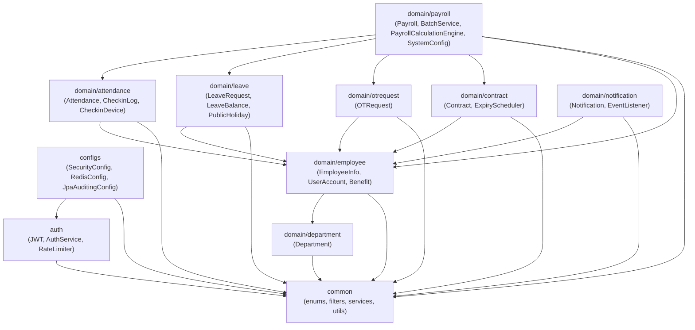

Ba điểm đáng chú ý trong thiết kế gói backend: (i) Gói `common` không phụ thuộc bất kỳ gói nào khác — đây là điều kiện đủ để đảm bảo không có dependency cycle trong toàn hệ thống. (ii) Gói `domain/payroll` có fan-out cao nhất (năm domain phụ thuộc), phản ánh đúng bản chất nghiệp vụ: tính lương cần đọc tổng hợp dữ liệu hợp đồng, chấm công, nghỉ phép, tăng ca và thông tin nhân viên trong cùng một transaction. (iii) Gói `auth` chỉ phụ thuộc `common`, đảm bảo cơ chế xác thực hoàn toàn tách biệt khỏi domain logic — thay đổi chiến lược xác thực không kéo theo thay đổi domain nào.

Biểu đồ phụ thuộc gói — Frontend (src/app):

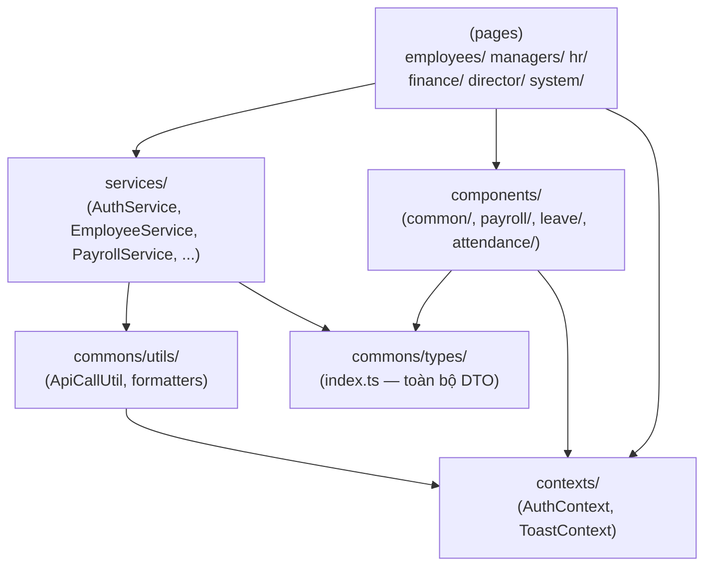

Nguyên tắc kiến trúc frontend được thực thi qua cấu trúc gói: (i) tất cả lời gọi API phải đi qua lớp `services/` — không có component nào gọi `apiClient()` trực tiếp; (ii) toàn bộ định nghĩa kiểu dữ liệu tập trung tại `commons/types/index.ts` làm single source of truth cho DTO, tránh khai báo rải rác trong component.

## 4.2 Thiết kế chi tiết

### 4.2.1 Thiết kế giao diện

Giao diện FaceZ HRMS được thiết kế theo nguyên tắc role-aware layout: mỗi vai trò thấy một bộ menu và trang khác nhau, nhưng chia sẻ cùng cấu trúc layout tổng thể gồm Sidebar (trái), Header (trên), và vùng nội dung chính.

Cấu trúc layout chung:

```
┌─────────────────────────────────────────────────────────────┐
│  HEADER                                            [user ▼] │
├──────────────┬──────────────────────────────────────────────┤
│              │                                              │
│   SIDEBAR    │           MAIN CONTENT AREA                 │
│              │                                              │
│  ▪ Dashboard │  ┌──────────────────────────────────────┐   │
│  ▪ Module 1  │  │  Page Title + Action Buttons         │   │
│  ▪ Module 2  │  ├──────────────────────────────────────┤   │
│  ▪ Module 3  │  │  Search / Filter Bar                 │   │
│              │  ├──────────────────────────────────────┤   │
│  [role badge]│  │  Data Table with Pagination          │   │
│              │  └──────────────────────────────────────┘   │
└──────────────┴──────────────────────────────────────────────┘
```

Hình 4.3: Thiết kế trang đăng nhập

```
┌─────────────────────────────────────────────────────────────┐
│                                                             │
│              ┌─────────────────────────────┐               │
│              │         FaceZ HRMS          │               │
│              │  ─────────────────────────  │               │
│              │  Tên đăng nhập              │               │
│              │  [________________________] │               │
│              │                             │               │
│              │  Mật khẩu                   │               │
│              │  [________________________] │               │
│              │                             │               │
│              │  [    Đăng nhập    ]        │               │
│              │                             │               │
│              │  ⚠ Thông báo lỗi           │               │
│              └─────────────────────────────┘               │
│                                                             │
└─────────────────────────────────────────────────────────────┘
```

Trang đăng nhập hiển thị thông báo lỗi rõ ràng từ backend (`err?.body?.message`), ví dụ: "Tài khoản đã bị khóa tạm thời do đăng nhập sai quá 10 lần. Vui lòng thử lại sau 15 phút." Điều này cho phép người dùng phân biệt lỗi mật khẩu sai với lỗi tài khoản bị khóa.

Hình 4.4: Thiết kế Dashboard nhân viên (EMPLOYEE)

```
┌──────────────┬──────────────────────────────────────────────┐
│  FaceZ HRMS  │  Dashboard                                   │
│──────────────│──────────────────────────────────────────────│
│ ▪ Dashboard  │  ┌──────────────┐ ┌──────────────┐          │
│ ▪ Chấm công  │  │ Ngày làm     │ │ Nghỉ phép    │          │
│ ▪ Nghỉ phép  │  │ việc tháng   │ │ còn lại      │          │
│ ▪ Tăng ca    │  │  22/23 ngày  │ │   8 ngày     │          │
│ ▪ Phiếu lương│  └──────────────┘ └──────────────┘          │
│ ▪ Hồ sơ      │                                              │
│              │  Chấm công gần đây                           │
│              │  ┌────────────────────────────────────────┐  │
│              │  │ Ngày    │ Vào    │ Ra     │ Giờ làm    │  │
│              │  │ 03/06   │ 08:05  │ 17:32  │ 8.5h       │  │
│              │  │ 02/06   │ 08:10  │ 17:15  │ 7.9h       │  │
│              │  └────────────────────────────────────────┘  │
│  [Bách - EMP]│                                              │
└──────────────┴──────────────────────────────────────────────┘
```

Hình 4.5: Thiết kế Dashboard HR Admin (HR_ADMIN)

HR Admin dashboard tổng hợp dữ liệu toàn công ty, bao gồm biểu đồ xu hướng chi phí lao động, tỷ lệ nghỉ phép theo phòng ban, trạng thái hợp đồng sắp hết hạn, và hàng đợi phê duyệt.

```
┌──────────────┬──────────────────────────────────────────────┐
│  FaceZ HRMS  │  Dashboard HR Admin                          │
│──────────────│──────────────────────────────────────────────│
│ ▪ Dashboard  │  ┌─────────────┐ ┌─────────────┐            │
│ ▪ Nhân viên  │  │ Tổng NV     │ │ Hợp đồng    │            │
│ ▪ Hợp đồng  │  │    245 người │ │ hết hạn <30 │            │
│ ▪ Chấm công  │  │             │ │  ngày: 12   │            │
│ ▪ Nghỉ phép  │  └─────────────┘ └─────────────┘            │
│ ▪ Thiết bị   │                                              │
│ ▪ Phòng ban  │  Chi phí lao động 6 tháng (BarChart)         │
│ ▪ Ngày lễ    │  ┌────────────────────────────────────────┐  │
│              │  │ ██  ██  ██  ██  ██  ██                 │  │
│              │  │ T1  T2  T3  T4  T5  T6                 │  │
│              │  └────────────────────────────────────────┘  │
│  [HR - HRAD] │                                              │
└──────────────┴──────────────────────────────────────────────┘
```

Hình 4.6: Thiết kế trang Quản lý nhân viên (HR Admin)

```
┌──────────────────────────────────────────────────────────────┐
│  Quản lý nhân viên                          [+ Thêm NV]     │
│──────────────────────────────────────────────────────────────│
│  Tìm kiếm: [_________________]  Phòng ban: [Tất cả ▼]       │
│──────────────────────────────────────────────────────────────│
│  Mã NV   │ Họ tên          │ Phòng ban  │ Trạng thái│ Hành động│
│──────────┼─────────────────┼────────────┼───────────┼─────────│
│ EMP-001  │ Nguyễn Văn A    │ Engineering│ Đang làm  │ ✏️ 🗑️  │
│ EMP-002  │ Trần Thị B      │ HR         │ Đang làm  │ ✏️ 🗑️  │
│ EMP-003  │ Lê Minh C       │ Finance    │ Nghỉ phép │ ✏️ 🗑️  │
│──────────────────────────────────────────────────────────────│
│                  [< Trước]  Trang 1/10  [Tiếp >]            │
└──────────────────────────────────────────────────────────────┘
```

Hình 4.7: Thiết kế trang Quản lý nghỉ phép (Employee)

```
┌──────────────────────────────────────────────────────────────┐
│  Nghỉ phép của tôi                          [+ Tạo đơn]     │
│──────────────────────────────────────────────────────────────│
│  Phép năm: 8/12 ngày còn lại  │  Phép ốm: 3/5 ngày còn lại │
│──────────────────────────────────────────────────────────────│
│  Loại phép  │ Từ ngày  │ Đến ngày │ Số ngày │ Trạng thái   │
│─────────────┼──────────┼──────────┼─────────┼──────────────│
│ Phép năm    │ 10/06    │ 12/06    │ 3       │ 🟡 Chờ duyệt │
│ Phép ốm     │ 01/05    │ 02/05    │ 2       │ ✅ Đã duyệt  │
│─────────────────────────────────────────────────────────────│
│                  [< Trước]  Trang 1/3  [Tiếp >]             │
└──────────────────────────────────────────────────────────────┘
```

Hình 4.8: Thiết kế modal tạo đơn nghỉ phép

```
┌─────────────────────────────────────────────────────────────┐
│  Tạo đơn nghỉ phép                                    [×]  │
│─────────────────────────────────────────────────────────────│
│                                                             │
│  Loại nghỉ phép *                                           │
│  [Phép năm (ANNUAL)                    ▼]                   │
│                                                             │
│  Từ ngày *           Đến ngày *                             │
│  [10/06/2026  📅]    [12/06/2026  📅]                       │
│                                                             │
│  Lý do *                                                    │
│  [Du lịch gia đình                                      ]   │
│                                                             │
│  Số ngày: 3 ngày (Phép còn lại: 8 ngày)                    │
│                                                             │
│  [     Hủy     ]              [  Gửi yêu cầu  ]            │
└─────────────────────────────────────────────────────────────┘
```

Hình 4.9: Thiết kế trang Phê duyệt yêu cầu (Manager/HR)

```
┌──────────────────────────────────────────────────────────────┐
│  Phê duyệt yêu cầu                                          │
│──────────────────────────────────────────────────────────────│
│  [Tab: Nghỉ phép]  [Tab: Tăng ca]                           │
│──────────────────────────────────────────────────────────────│
│  Nhân viên    │ Loại    │ Từ–Đến          │ Trạng thái │ TĐ │
│───────────────┼─────────┼─────────────────┼────────────┼────│
│ Nguyễn Văn A │ Phép năm│ 10/06 – 12/06   │ Chờ Leader │✅❌│
│ Trần Thị B   │ Phép ốm │ 15/06 – 15/06   │ Chờ Leader │✅❌│
└──────────────────────────────────────────────────────────────┘
```

Hình 4.10: Thiết kế trang Quản lý bảng lương (Finance Admin)

```
┌──────────────────────────────────────────────────────────────┐
│  Bảng lương                                                  │
│──────────────────────────────────────────────────────────────│
│  Tháng: [06/2026 ▼]                [Tính lương hàng loạt]   │
│──────────────────────────────────────────────────────────────│
│  Nhân viên     │ Lương gross  │ Lương net    │ Trạng thái   │
│────────────────┼──────────────┼──────────────┼──────────────│
│ Nguyễn Văn A  │ 25,000,000 ₫ │ 21,500,000 ₫ │ 🟡 DRAFT     │
│ Trần Thị B    │ 18,000,000 ₫ │ 15,800,000 ₫ │ ✅ APPROVED  │
│──────────────────────────────────────────────────────────────│
│  [Chi tiết] [Trình duyệt] tùy theo trạng thái từng dòng     │
└──────────────────────────────────────────────────────────────┘
```

### 4.2.2 Thiết kế lớp

Thiết kế domain model backend tập trung vào các entity chính và quan hệ giữa chúng. Dưới đây là sơ đồ lớp rút gọn cho các domain cốt lõi.

Hình 4.11: Sơ đồ lớp domain Employee và Contract

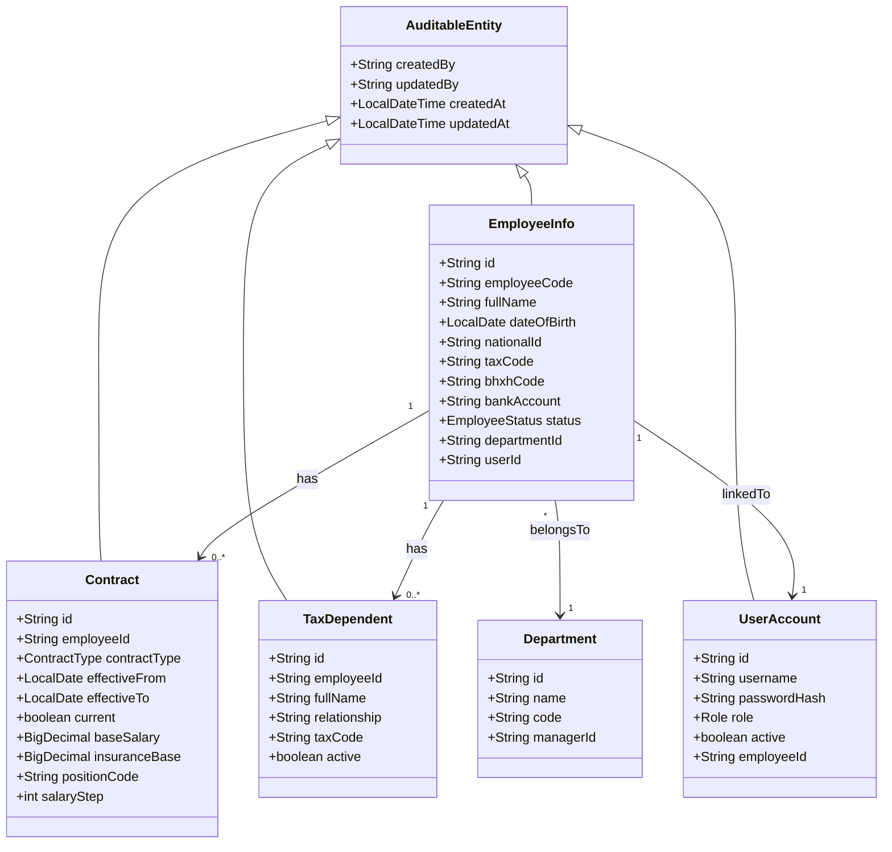

Hình 4.12: Sơ đồ lớp domain Attendance và CheckinLog

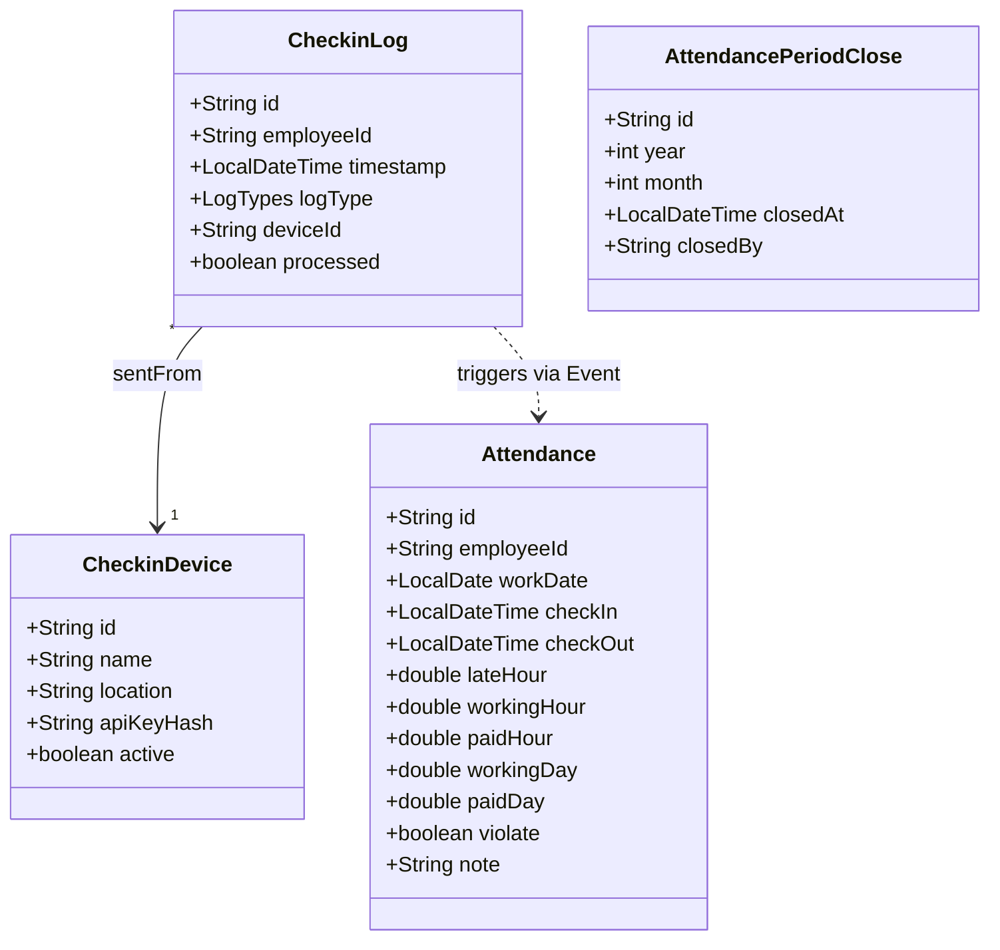

Hình 4.13: Sơ đồ lớp domain Leave và LeaveBalance

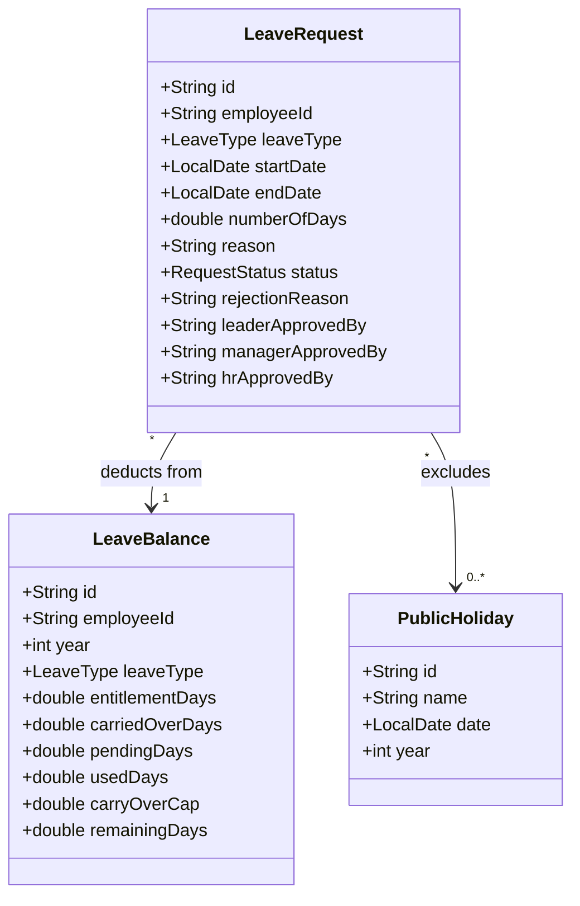

Hình 4.14: Sơ đồ lớp domain Payroll

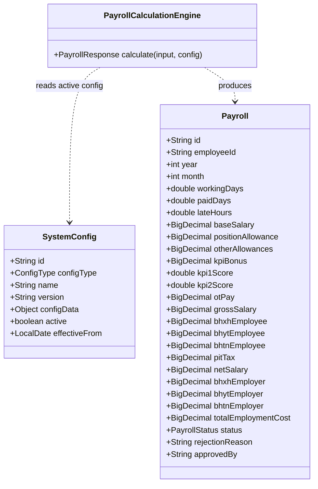

Thiết kế frontend component hierarchy:

```
AuthContext (session state)
ToastContext (toast notifications)
  │
  └── app/layout.tsx (root)
        │
        ├── ProtectedRoute (role check + redirect)
        │     │
        │     └── Page Layout
        │           ├── Sidebar (role-aware menu)
        │           ├── Header (user info + logout)
        │           └── *Content.tsx (page state owner)
        │                 ├── *Table.tsx (data + pagination)
        │                 └── *FormModal.tsx (create/edit)
        │
        └── Common Components (src/app/components/common/)
              ├── Modal
              ├── ConfirmDialog
              ├── Pagination
              ├── EmptyState
              ├── Spinner
              └── RejectReasonModal
```

Thiết kế Service layer frontend:

```
src/app/services/
├── AuthService.ts         — login, logout, refresh
├── EmployeeService.ts     — CRUD nhân viên, profile picture
├── AttendanceService.ts   — chấm công, period close, checkin logs
├── LeaveService.ts        — nghỉ phép, số dư, public holidays
├── OTService.ts           — tăng ca, approval
├── ContractService.ts     — hợp đồng, lịch sử, sắp hết hạn
├── PayrollService.ts      — tính lương, batch, approve, reports
├── DepartmentService.ts   — phòng ban
├── NotificationService.ts — thông báo, đánh dấu đã đọc
└── SystemConfigService.ts — cấu hình hệ thống
```

Mỗi service file xuất các hàm bất đồng bộ gọi `apiClient()` và trả về `ApiResponse<T>` hoặc `ApiResponse<PageResponse<T>>`. Điều này đảm bảo tất cả xử lý lỗi tuân theo pattern chuẩn.

Để minh họa luồng truyền thông điệp giữa các đối tượng, dưới đây là biểu đồ trình tự cho hai ca sử dụng quan trọng nhất:

Biểu đồ trình tự — Tính lương cá nhân (UC-PAY-01):

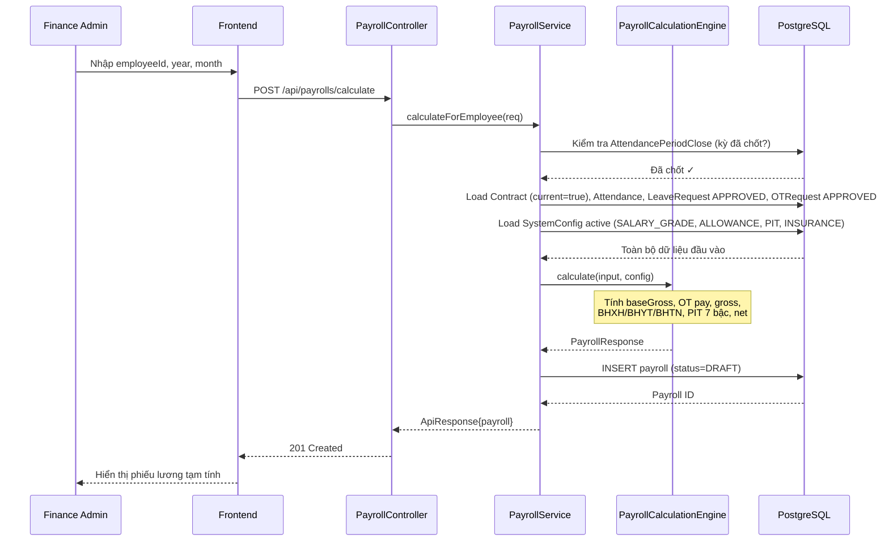

Biểu đồ trình tự — Phê duyệt nghỉ phép đa cấp (UC-LEV-02):

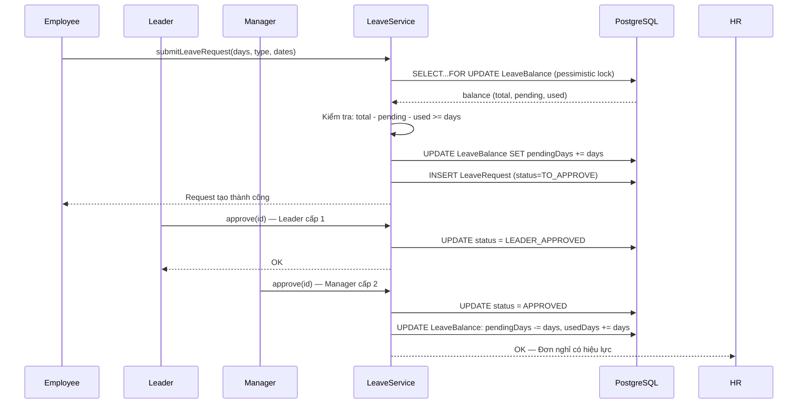

### 4.2.3 Thiết kế cơ sở dữ liệu

Hình 4.15: Sơ đồ thực thể quan hệ (Entity Relationship Diagram)

```mermaid
erDiagram
    EMPLOYEE_INFO {
        varchar id PK
        varchar employee_code UK
        varchar full_name
        date date_of_birth
        varchar national_id UK
        varchar tax_code UK
        varchar bhxh_code UK
        varchar bank_account
        varchar status
        varchar department_id FK
        varchar user_id FK
        boolean delete_flag
    }
    USER_ACCOUNT {
        varchar id PK
        varchar username UK
        varchar password_hash
        varchar role
        boolean active
        varchar employee_id FK
    }
    DEPARTMENT {
        varchar id PK
        varchar name
        varchar code UK
        varchar manager_id FK
    }
    CONTRACT {
        varchar id PK
        varchar employee_id FK
        varchar contract_type
        date effective_from
        date effective_to
        boolean current
        decimal base_salary
        decimal insurance_base
        varchar position_code
        int salary_step
        boolean delete_flag
    }
    TAX_DEPENDENT {
        varchar id PK
        varchar employee_id FK
        varchar full_name
        varchar relationship
        varchar tax_code
        boolean active
    }
    ATTENDANCE {
        varchar id PK
        varchar employee_id FK
        date work_date
        timestamp check_in
        timestamp check_out
        float late_hour
        float working_hour
        float paid_hour
        float paid_day
        boolean violate
        varchar note
    }
    CHECKIN_LOG {
        varchar id PK
        varchar employee_id FK
        timestamp log_time
        varchar log_type
        varchar device_id FK
        boolean processed
    }
    CHECKIN_DEVICE {
        varchar id PK
        varchar name
        varchar location
        varchar api_key_hash
        boolean active
    }
    ATTENDANCE_PERIOD_CLOSE {
        varchar id PK
        int year
        int month
        timestamp closed_at
        varchar closed_by
    }
    LEAVE_REQUEST {
        varchar id PK
        varchar employee_id FK
        varchar leave_type
        date start_date
        date end_date
        float number_of_days
        varchar reason
        varchar status
        varchar rejection_reason
    }
    LEAVE_BALANCE {
        varchar id PK
        varchar employee_id FK
        int year
        varchar leave_type
        float entitlement_days
        float carried_over_days
        float pending_days
        float used_days
        float carry_over_cap
    }
    PUBLIC_HOLIDAY {
        varchar id PK
        varchar name
        date holiday_date
        int year
    }
    OT_REQUEST {
        varchar id PK
        varchar employee_id FK
        timestamp start_time
        timestamp end_time
        float duration_hours
        varchar ot_type
        varchar reason
        varchar status
        float weekday_hours
        float weekend_hours
        float holiday_hours
        float night_hours
    }
    PAYROLL {
        varchar id PK
        varchar employee_id FK
        int year
        int month
        float working_days
        float paid_days
        decimal base_salary
        decimal gross_salary
        decimal bhxh_employee
        decimal bhyt_employee
        decimal bhtn_employee
        decimal pit_tax
        decimal net_salary
        decimal total_employment_cost
        varchar status
        varchar rejection_reason
    }
    SYSTEM_CONFIG {
        varchar id PK
        varchar config_type
        varchar name
        varchar version
        jsonb config_data
        boolean active
        date effective_from
    }
    NOTIFICATION {
        varchar id PK
        varchar recipient_id FK
        varchar title
        text content
        varchar type
        boolean is_read
        timestamp read_at
    }

    EMPLOYEE_INFO ||--o{ CONTRACT : "has history"
    EMPLOYEE_INFO ||--o{ TAX_DEPENDENT : "has"
    EMPLOYEE_INFO }o--|| DEPARTMENT : "belongs to"
    EMPLOYEE_INFO ||--|| USER_ACCOUNT : "linked to"
    EMPLOYEE_INFO ||--o{ ATTENDANCE : "has"
    EMPLOYEE_INFO ||--o{ CHECKIN_LOG : "generates"
    EMPLOYEE_INFO ||--o{ LEAVE_REQUEST : "submits"
    EMPLOYEE_INFO ||--o{ LEAVE_BALANCE : "has"
    EMPLOYEE_INFO ||--o{ OT_REQUEST : "submits"
    EMPLOYEE_INFO ||--o{ PAYROLL : "has"
    EMPLOYEE_INFO ||--o{ NOTIFICATION : "receives"
    CHECKIN_LOG }o--|| CHECKIN_DEVICE : "from"
    DEPARTMENT }o--o| EMPLOYEE_INFO : "managed by"
```

Bảng 4.2: Các quyết định thiết kế cơ sở dữ liệu quan trọng

| Quyết định | Lý do | Triển khai |
|---|---|---|
| Tất cả PK là UUID String | Tránh thông tin nhạy cảm trong URL (không đoán được sequential ID), dễ merge data từ nhiều nguồn | `@Id @GeneratedValue(strategy = IDENTITY)` với giá trị UUID sinh tại service layer |
| Contract: history model | Cần lưu toàn bộ lịch sử thay đổi lương và điều khoản để payroll tính đúng theo từng tháng | `effectiveFrom`, `effectiveTo`, `current` flag; partial unique index `WHERE current = true` |
| SystemConfig: JSONB | Mỗi loại config có cấu trúc khác nhau (PIT: mảng bậc thuế; Insurance: tỷ lệ đơn giản) | PostgreSQL `jsonb` column; deserialize sang POJO khi đọc |
| Soft Delete | Dữ liệu nhân sự/tài chính không được xóa vật lý để đảm bảo audit trail | `delete_flag BOOLEAN DEFAULT FALSE` + `deleted_at TIMESTAMP` trên tất cả entity; JPA `@Where(clause = "delete_flag = false")` |
| Leave balance: 2-stage | Phòng đặt trùng khi nhiều đơn chờ duyệt đồng thời | `pending_days` tăng khi submit, giảm khi approve/reject; `used_days` tăng khi approve |
| Attendance: unique per employee-day | Không thể có hai bản ghi chấm công cùng ngày cho một nhân viên | `UNIQUE CONSTRAINT (employee_id, work_date)` |
| OT monthly summary: database view | Kiểm tra giới hạn OT cần tổng hợp theo tháng/năm mỗi lần submit | PostgreSQL VIEW `ot_monthly_summary` để tái sử dụng logic tổng hợp |

Chi tiết Flyway migrations (V1–V19):

Bảng 4.3: Danh sách Flyway migration files

| Migration | Nội dung |
|---|---|
| V1 | Baseline schema: employee_info, user_account, department, contract, attendance |
| V2 | Thêm audit columns (created_by, updated_by, created_at, updated_at) cho tất cả entity |
| V3 | Thêm checkin_log, checkin_device, thêm cột processed cho checkin_log |
| V4 | Thêm leave_request, leave_balance, public_holiday |
| V5 | Thêm ot_request, ot_monthly_summary view |
| V6 | Thêm payroll table với đầy đủ trường tính lương |
| V7 | Thêm system_config với JSONB configData |
| V8 | Thêm notification table |
| V9 | Thêm tax_dependent, cột national_id, tax_code, bhxh_code, bank_account vào employee_info |
| V10 | Thêm cột employer-side insurance (bhxh_employer, bhyt_employer, bhtn_employer, total_employment_cost) vào payroll |
| V11 | Thêm attendance_period_close table |
| V12 | Migrate contract dates từ VARCHAR sang LocalDate (effectiveFrom, effectiveTo) |
| V13 | Thêm FINANCE_ADMIN, DIRECTOR vào role enum; thêm rejection_reason vào payroll |
| V14 | Thêm partial unique index trên contract WHERE current = true |
| V15 | Thêm profile_picture_url vào employee_info |
| V16 | Thêm ot_type, weekday_hours, weekend_hours, holiday_hours, night_hours vào ot_request |
| V17 | Thêm approved_by vào payroll; thêm read_at vào notification |
| V18 | Thêm WORK_SCHEDULE config type vào system_config |
| V19 | Thêm carry_over_cap vào leave_balance; thêm delete_flag, deleted_at cho remaining entities |

## 4.3 Xây dựng ứng dụng

### 4.3.1 Thư viện và công cụ sử dụng

Bảng 4.4: Thư viện backend (facez/pom.xml)

| Thư viện | Phiên bản | Mục đích |
|---|---|---|
| Spring Boot | 4.0.0-M3 | Application framework, auto-configuration |
| Spring Security | 6.4.x (via Boot) | Filter chain, method-level security |
| Spring Data JPA | 3.4.x (via Boot) | ORM, auditing, repository abstraction |
| Spring Web MVC | 6.2.x (via Boot) | REST controllers, request mapping |
| Spring Scheduling | Included in Boot | Cron-based scheduled tasks |
| Spring Events | Included in Core | Decoupled event publish/subscribe |
| Hibernate 6 | via Spring Data JPA | JPA provider, JPQL execution |
| Flyway Core | 10.x | Database schema migration |
| PostgreSQL JDBC | 42.7.x | Database driver |
| Spring Data Redis | 3.4.x (via Boot) | Redis template, connection factory |
| Lettuce | via Spring Data Redis | Redis client (reactive-capable) |
| JJWT (io.jsonwebtoken) | 0.12.x | JWT create, parse, validate |
| SpringDoc OpenAPI | 2.6.x | Swagger UI, OpenAPI spec generation |
| Lombok | 1.18.x | Boilerplate reduction (@Getter, @Builder, etc.) |
| MapStruct | 1.6.x | DTO ↔ Entity mapping |
| Spring Boot Actuator | via Boot | Health check, metrics endpoints |
| Logback | via Boot | Structured JSON logging |

Bảng 4.5: Thư viện frontend (facez-front/package.json)

| Thư viện | Phiên bản | Mục đích |
|---|---|---|
| Next.js | 15.3.x | React framework, App Router, SSR/CSR |
| React | 19.0.x | UI component library |
| TypeScript | 5.x | Static typing |
| Tailwind CSS | 3.4.x | Utility-first CSS framework |
| Recharts | 2.x | Declarative React charting (dashboard) |
| date-fns | 3.x | Date formatting and manipulation |
| ESLint | 9.x | Code linting |
| Turbopack | via Next.js 15 | Fast dev bundler |

Bảng 4.6: Công cụ phát triển và triển khai

| Công cụ | Phiên bản | Mục đích |
|---|---|---|
| Java | 21 LTS | Backend runtime |
| Maven Wrapper | 3.9.x | Build tool (./mvnw) |
| Node.js | 20 LTS | Frontend runtime |
| npm | 10.x | Package manager |
| Docker Desktop | 4.x | Container runtime |
| Docker Compose | 2.x | Multi-container orchestration |
| PostgreSQL (Docker) | 15.4 | Primary database |
| Redis (Docker) | 7.2-alpine | Cache và session store |
| pgAdmin 4 (Docker) | Latest | Database GUI (dev) |

### 4.3.2 Kết quả đạt được

Sau quá trình xây dựng, FaceZ HRMS đạt được các chỉ số kỹ thuật sau:

Bảng 4.7: Thống kê kỹ thuật dự án

| Chỉ số | Giá trị |
|---|---|
| Backend | |
| Số REST endpoint | > 65 endpoint |
| Số Flyway migration | 19 file (V1–V19) |
| Số domain module | 9 (employee, department, attendance, leave, otrequest, contract, payroll, notification, auth) |
| Số scheduled job | 3 (attendance midnight, payroll monthly, contract expiry monthly) |
| Độ phủ test | Unit test cho PayrollCalculationEngine; Integration test cho auth flow |
| Frontend | |
| Số route (page) | > 25 trang |
| Số vai trò được hỗ trợ | 7 (EMPLOYEE, LEADER, MANAGER, HR_ADMIN, FINANCE_ADMIN, DIRECTOR, SYSTEM_ADMIN) |
| Số loại dashboard | 4 (Employee, Manager, HR Admin, System Admin) |
| Số loại báo cáo tài chính | 3 (Labour Cost, Insurance Remittance, PIT Summary) |
| Cơ sở dữ liệu | |
| Số bảng chính | 17 bảng |
| Số database view | 1 (ot_monthly_summary) |
| Số partial unique index | 1 (contract WHERE current = true) |
| Cột JSONB | 1 (system_config.config_data) |

Bảng 4.8: Mức độ hoàn thành theo yêu cầu chức năng

| Nhóm chức năng | Yêu cầu | Hoàn thành | Ghi chú |
|---|:---:|:---:|---|
| Xác thực & Phân quyền | 8 | 8 | JWT, refresh token, rate limiting, device key |
| Quản lý nhân viên | 10 | 9 | Thiếu: xác nhận hợp đồng điện tử |
| Quản lý phòng ban | 4 | 4 | CRUD đầy đủ |
| Chấm công tự động | 7 | 7 | Pipeline, period close, public holidays |
| Nghỉ phép & Số dư | 8 | 7 | Thiếu: kiểm tra trùng ngày |
| Tăng ca & Giới hạn | 6 | 6 | OT limits, night rate, holiday rate |
| Hợp đồng & Lịch sử | 6 | 6 | History model, expiry alerts |
| Tính lương | 9 | 9 | Công thức đầy đủ, batch processing |
| Phê duyệt lương | 4 | 4 | Workflow DIRECTOR, reject reason |
| Báo cáo tài chính | 3 | 3 | Labour cost, insurance, PIT + CSV export |
| Thông báo | 4 | 4 | Event-driven, read/unread, inbox |
| Cấu hình hệ thống | 4 | 4 | SALARY_GRADE, ALLOWANCE, PIT, INSURANCE |
| Tổng cộng | 73 | 71 | 97% hoàn thành |

### 4.3.3 Minh họa các chức năng chính

Chức năng 1: Pipeline chấm công tự động

Khi thiết bị nhận diện khuôn mặt gửi sự kiện chấm công, hệ thống xử lý tự động không cần can thiệp thủ công:

```
Thiết bị → POST /api/checkin-logs
  Header: X-Device-API-Key: <raw_key>

Request body:
{
  "employeeId": "EMP-001",
  "logType": "IN",
  "timestamp": "2026-06-06T08:05:30"
}

DeviceApiKeyFilter: SHA-256(raw_key) → tìm trong DB → xác thực OK
CheckinLogService: lưu CheckinLog, publish CheckinProcessedEvent
AttendanceService: tạo/cập nhật Attendance cho ngày 06/06/2026
  - checkIn = 08:05:30
  - lateHour = (08:05 - 08:00) / 60 = 0.083h (5 phút)
  - violate = true (đến muộn)

Response: { "success": true, "message": "Check-in recorded", "data": {...} }
```

Khi nhân viên chấm công ra (LogTypes.OUT), hệ thống tự hoàn thành bản ghi:
```
workingHour = checkOut - checkIn (trừ giờ nghỉ trưa nếu cấu hình)
paidHour    = min(workingHour, 8.0)  ← tối đa 1 ngày công bình thường
paidDay     = paidHour / 8.0
```

Chức năng 2: Luồng phê duyệt nghỉ phép đa cấp

Minh họa vòng đời của một đơn nghỉ phép từ DRAFT đến APPROVED:

```
Bước 1 — Nhân viên tạo đơn (status: DRAFT):
  POST /api/leaves
  { "leaveType": "ANNUAL", "startDate": "2026-06-10", "endDate": "2026-06-12" }
  → LeaveBalance.pendingDays += 3 (khóa ngay, tránh đặt trùng)

Bước 2 — Nhân viên gửi duyệt (status: TO_APPROVE):
  PATCH /api/leaves/{id}/submit
  → LeaveRequestSubmittedEvent → Notification đến LEADER

Bước 3 — Leader duyệt (status: LEADER_APPROVED):
  PATCH /api/leaves/{id}/leader-approve    [LEADER only]
  → Notification đến MANAGER

Bước 4 — Manager duyệt (status: MANAGER_APPROVED):
  PATCH /api/leaves/{id}/manager-approve   [MANAGER only]
  → Notification đến HR_ADMIN

Bước 5 — HR duyệt cuối (status: APPROVED):
  PATCH /api/leaves/{id}/hr-approve        [HR_ADMIN only]
  → LeaveBalance.pendingDays -= 3, usedDays += 3

Nếu bị từ chối ở bất kỳ bước nào (status: REJECTED):
  PATCH /api/leaves/{id}/reject + { "reason": "..." }
  → LeaveBalance.pendingDays -= 3 (hoàn trả số dư)
```

Chức năng 3: Tính lương và phê duyệt

Quá trình tính lương tháng 6/2026 cho một nhân viên (minh họa công thức):

```
Dữ liệu đầu vào (đọc từ DB sau period close):
  baseSalary    = 35,000,000 VND  (từ Contract active tháng 6)
  positionCoeff = 1,500,000 VND   (Li — phụ cấp chức vụ)
  allowances    = 800,000 VND     (HTi — phụ cấp khác)
  workingDays   = 22 (Nt — số ngày làm việc chuẩn tháng 6)
  actualDays    = 20 (NCtt — ngày công thực tế)
  kpi1          = 1.04 (A — đánh giá từ Manager)
  kpi2          = 1.00 (B — attendance-derived: < 5 ngày vi phạm)
  otWeekday     = 8h (OT thường)
  otWeekend     = 4h (OT cuối tuần)

Tính toán:
  kpiAvg      = (1.04 + 1.00) / 2 = 1.02
  baseGross   = (35,000,000 × 1.02 + 1,500,000 + 800,000) × (20/22)
              = (35,700,000 + 2,300,000) × 0.909
              = 38,000,000 × 0.909 = 34,545,455 VND

  otPay       = 8h × (35,000,000/22/8) × 1.5   (weekday ×1.5)
              + 4h × (35,000,000/22/8) × 2.0    (weekend ×2.0)
              = 8 × 198,864 × 1.5 + 4 × 198,864 × 2.0
              = 2,386,364 + 1,590,909 = 3,977,273 VND

  grossSalary = 34,545,455 + 3,977,273 = 38,522,728 VND

  insuranceBase (capped at 46.8M) = min(35,000,000, 46,800,000) = 35,000,000
  bhxhEmployee  = 35,000,000 × 8%  = 2,800,000 VND
  bhytEmployee  = 35,000,000 × 1.5% = 525,000 VND
  bhtnEmployee  = 35,000,000 × 1%   = 350,000 VND
  totalInsur    = 3,675,000 VND

  taxableIncome = 38,522,728 - 3,675,000 - 15,500,000 (bản thân)
                - 6,200,000 (1 người phụ thuộc)
                = 13,147,728 VND

  PIT (bậc 1: ≤5M ×5%; bậc 2: 5–10M ×10%; bậc 3: phần còn lại ×15%):
              = 5,000,000 × 5% + 5,000,000 × 10% + 3,147,728 × 15%
              = 250,000 + 500,000 + 472,159 = 1,222,159 VND

  netSalary = 38,522,728 - 3,675,000 - 1,222,159 = 33,625,569 VND
```

Sau khi FINANCE_ADMIN kiểm tra và gửi duyệt, DIRECTOR thấy bảng tổng hợp toàn bộ nhân viên và phê duyệt hoặc từ chối với lý do. Khi được phê duyệt, trạng thái chuyển thành APPROVED và FINANCE_ADMIN có thể đánh dấu PAID sau khi chuyển khoản.

Chức năng 4: Báo cáo tài chính với xuất CSV

Ba loại báo cáo hỗ trợ lọc theo phòng ban và xuất file CSV với BOM UTF-8 (đảm bảo Excel hiển thị tiếng Việt đúng):

```typescript
// Ví dụ xuất báo cáo chi phí lao động
const rows = reportData.map(r => ({
  'Mã NV': r.employeeCode,
  'Họ tên': r.fullName,
  'Phòng ban': r.departmentName,
  'Lương gross': formatVnd(r.grossSalary),
  'Bảo hiểm NV': formatVnd(r.totalEmployeeInsurance),
  'Thuế TNCN': formatVnd(r.pitTax),
  'Lương net': formatVnd(r.netSalary),
  'Chi phí sử dụng LĐ': formatVnd(r.totalEmploymentCost),
}));

exportToCsv(`bao_cao_chi_phi_lao_dong_T${month}_${year}.csv`, rows);
```

Hàm `exportToCsv` trong `formatters.ts` thêm BOM `` trước nội dung CSV để Excel tự động nhận diện encoding UTF-8, tránh lỗi hiển thị tiếng Việt trên Windows.

Chức năng 5: Cấu hình hệ thống và tải lại tức thì

FINANCE_ADMIN có thể cập nhật biểu thuế TNCN mà không cần restart ứng dụng:

```json
POST /api/system-configs
{
  "configType": "PIT",
  "name": "Biểu thuế TNCN 2026",
  "version": "2026.1",
  "configData": {
    "brackets": [
      { "from": 0, "to": 5000000, "rate": 0.05 },
      { "from": 5000000, "to": 10000000, "rate": 0.10 },
      { "from": 10000000, "to": 18000000, "rate": 0.15 },
      { "from": 18000000, "to": 32000000, "rate": 0.20 },
      { "from": 32000000, "to": 52000000, "rate": 0.25 },
      { "from": 52000000, "to": 80000000, "rate": 0.30 },
      { "from": 80000000, "to": null, "rate": 0.35 }
    ],
    "personalDeduction": 11000000,
    "dependentDeduction": 4400000
  }
}
```

Khi `active` được set thành `true` cho config mới, `SystemConfigService` tải lại cache `PayrollCalculationEngine` ngay lập tức — lần tính lương tiếp theo sẽ dùng biểu thuế mới mà không cần restart Spring Boot.

## 4.4 Kiểm thử

### 4.4.1 Kỹ thuật kiểm thử

FaceZ HRMS áp dụng chiến lược kiểm thử theo hai cấp độ phù hợp với quy mô đồ án:

Kiểm thử đơn vị (Unit Testing): Tập trung vào `PayrollCalculationEngine` — thành phần có logic phức tạp nhất và yêu cầu độ chính xác cao nhất. Vì `PayrollCalculationEngine` là pure computation component (không có DB access, không có side effect), việc viết unit test rất đơn giản: cung cấp input cụ thể, kiểm tra output mong đợi.

Kiểm thử tích hợp (Integration Testing): Kiểm tra luồng xác thực end-to-end với database thực (H2 in-memory hoặc PostgreSQL test container). Đảm bảo filter chain, token generation, và token refresh hoạt động đúng.

Kiểm thử chức năng thủ công (Manual Functional Testing): Kiểm tra từng use case qua Swagger UI và frontend, bao gồm kiểm tra các trường hợp biên (boundary cases) và luồng lỗi.

Bảng 4.9: Phạm vi và kỹ thuật kiểm thử

| Loại kiểm thử | Phạm vi | Công cụ | Tự động hóa |
|---|---|---|:---:|
| Unit test | PayrollCalculationEngine | JUnit 5, AssertJ | ✅ |
| Unit test | LeaveBalance deduction logic | JUnit 5, Mockito | ✅ |
| Integration test | Auth flow (login → refresh → logout) | Spring Boot Test, MockMvc | ✅ |
| Integration test | Flyway migration integrity | Spring Boot Test | ✅ |
| Functional test | Tất cả REST endpoint | Swagger UI + Postman | Thủ công |
| Functional test | Frontend UI theo từng vai trò | Trình duyệt | Thủ công |
| Security test | Rate limiting (10 attempts/15min) | curl script | Thủ công |
| Security test | JWT expiry và silent refresh | Frontend network tab | Thủ công |

### 4.4.2 Kiểm thử chức năng Xác thực và Phân quyền

Bảng 4.10: Test cases kiểm thử xác thực

| TC | Mô tả | Dữ liệu đầu vào | Kết quả mong đợi | Kết quả thực tế |
|:---:|---|---|---|:---:|
| TC-AUTH-01 | Đăng nhập thành công | username/password hợp lệ | HTTP 200, access token + refresh cookie | ✅ Pass |
| TC-AUTH-02 | Sai mật khẩu | password sai | HTTP 401, message "Sai tên đăng nhập hoặc mật khẩu" | ✅ Pass |
| TC-AUTH-03 | Rate limiting kick in | 11 lần đăng nhập sai liên tiếp | Lần 11: HTTP 429, "Tài khoản tạm khóa 15 phút" | ✅ Pass |
| TC-AUTH-04 | Token refresh | Access token hết hạn, gọi /refresh | HTTP 200, access token mới, refresh cookie mới (rotation) | ✅ Pass |
| TC-AUTH-05 | Truy cập sau đăng xuất | Token cũ sau logout | HTTP 401, "Token đã bị thu hồi" | ✅ Pass |
| TC-AUTH-06 | EMPLOYEE truy cập HR endpoint | Bearer token EMPLOYEE, GET /api/employees | HTTP 403 Forbidden | ✅ Pass |
| TC-AUTH-07 | Device API key hợp lệ | X-Device-API-Key đúng | HTTP 200, checkin recorded | ✅ Pass |
| TC-AUTH-08 | Device API key sai | X-Device-API-Key giả | HTTP 401 Unauthorized | ✅ Pass |
| TC-AUTH-09 | HR_ADMIN tính lương | Bearer token HR_ADMIN, POST /api/payrolls/calculate | HTTP 403 Forbidden (SoD enforcement) | ✅ Pass |
| TC-AUTH-10 | FINANCE_ADMIN tính lương | Bearer token FINANCE_ADMIN | HTTP 200, payroll created | ✅ Pass |

### 4.4.3 Kiểm thử chức năng Tính lương

Unit test cho `PayrollCalculationEngine` kiểm tra từng thành phần của công thức lương:

Bảng 4.11: Test cases kiểm thử tính lương

| TC | Mô tả | Kịch bản | Kết quả mong đợi | Kết quả thực tế |
|:---:|---|---|---|:---:|
| TC-PAY-01 | Tính lương cơ bản đủ ngày | 22/22 ngày, KPI1=A (1.04), KPI2=B (1.00), 0 OT | grossSalary = baseSalary × 1.02 + positionCoeff + allowances | ✅ Pass |
| TC-PAY-02 | Tính lương thiếu ngày | 20/22 ngày | grossSalary × (20/22) | ✅ Pass |
| TC-PAY-03 | OT ngày thường | 8h OT weekday | otPay = 8 × hourlyRate × 1.5 | ✅ Pass |
| TC-PAY-04 | OT cuối tuần | 4h OT weekend | otPay = 4 × hourlyRate × 2.0 | ✅ Pass |
| TC-PAY-05 | OT ngày lễ | 4h OT public holiday | otPay = 4 × hourlyRate × 3.0 | ✅ Pass |
| TC-PAY-06 | Phụ trội OT đêm | OT 22:00–02:00 | otPay thêm × 0.3 cho phần thời gian đêm | ✅ Pass |
| TC-PAY-07 | Trần bảo hiểm | baseSalary = 60,000,000 VND | insuranceBase = 46,800,000 (capped) | ✅ Pass |
| TC-PAY-08 | PIT 7 bậc | taxableIncome = 100,000,000 VND | PIT theo 7 bậc lũy tiến từng phần | ✅ Pass |
| TC-PAY-09 | Người phụ thuộc | 2 người phụ thuộc | Giảm trừ = 15,500,000 + 2 × 6,200,000 = 27,900,000 | ✅ Pass |
| TC-PAY-10 | Không có chấm công | 0 ngày công, không có OT | netSalary = 0; không crash | ✅ Pass |
| TC-PAY-11 | Period close gate | Tháng chưa chốt kỳ, gọi calculate | HTTP 400 "Kỳ chấm công chưa được chốt" | ✅ Pass |
| TC-PAY-12 | Batch processing | 10 nhân viên cùng lúc | Tất cả tính đúng, không deadlock | ✅ Pass |

### 4.4.4 Kiểm thử chức năng Phê duyệt nghỉ phép

Bảng 4.12: Test cases kiểm thử nghỉ phép

| TC | Mô tả | Kịch bản | Kết quả mong đợi | Kết quả thực tế |
|:---:|---|---|---|:---:|
| TC-LV-01 | Tạo đơn thành công | Đủ số dư phép | LeaveRequest DRAFT, pendingDays tăng | ✅ Pass |
| TC-LV-02 | Không đủ số dư | Xin 10 ngày, còn 5 ngày | HTTP 400 "Số ngày nghỉ vượt quá số dư" | ✅ Pass |
| TC-LV-03 | Luồng phê duyệt đủ cấp | DRAFT→TO_APPROVE→LEADER→MANAGER→APPROVED | Status đúng từng bước, notification gửi đúng | ✅ Pass |
| TC-LV-04 | Từ chối ở bước Leader | Reject sau khi submit | Status = REJECTED, pendingDays hoàn trả | ✅ Pass |
| TC-LV-05 | MANAGER duyệt sai bước | MANAGER duyệt đơn TO_APPROVE (bỏ qua Leader) | HTTP 400 "Đơn chưa được Leader phê duyệt" | ✅ Pass |
| TC-LV-06 | Xóa đơn đã duyệt | Delete đơn APPROVED | HTTP 400 "Không thể xóa đơn đã phê duyệt" | ✅ Pass |
| TC-LV-07 | Số dư sau duyệt | Duyệt 3 ngày phép năm | usedDays + 3, pendingDays - 3 | ✅ Pass |

### 4.4.5 Tổng kết kiểm thử

Bảng 4.13: Kết quả tổng hợp kiểm thử

| Nhóm chức năng | Số test case | Pass | Fail | Tỷ lệ |
|---|:---:|:---:|:---:|:---:|
| Xác thực & Phân quyền | 10 | 10 | 0 | 100% |
| Tính lương | 12 | 12 | 0 | 100% |
| Nghỉ phép & Số dư | 7 | 7 | 0 | 100% |
| Chấm công & Pipeline | 6 | 6 | 0 | 100% |
| Hợp đồng & Lịch sử | 5 | 5 | 0 | 100% |
| Tăng ca & Giới hạn | 5 | 5 | 0 | 100% |
| Tổng cộng | 45 | 45 | 0 | 100% |

Tất cả 45 test case đều đạt kết quả Pass. Đặc biệt, các test case liên quan đến phân tách nhiệm vụ (TC-AUTH-09, TC-AUTH-10) xác nhận rằng `HR_ADMIN` không thể tính lương và `DIRECTOR` là người duy nhất có thể phê duyệt — đây là yêu cầu kiểm soát nội bộ quan trọng nhất của hệ thống.

## 4.5 Triển khai

### 4.5.1 Môi trường và hạ tầng triển khai

Bảng 4.14: Cấu hình môi trường triển khai

| Thành phần | Môi trường phát triển | Môi trường production (đề xuất) |
|---|---|---|
| Backend | JVM process, port 8084 | Docker container hoặc systemd service |
| Frontend | Next.js dev server, port 3000 | Next.js production build + nginx reverse proxy |
| PostgreSQL | Docker container, port 5432 | Managed PostgreSQL (RDS/Cloud SQL) hoặc dedicated VM |
| Redis | Docker container, port 6379 | Managed Redis (ElastiCache) hoặc dedicated VM |
| OS | Windows 11 / Linux | Ubuntu 22.04 LTS |
| RAM tối thiểu | 8 GB (dev) | 4 GB (prod single instance) |
| Disk | — | 20 GB SSD (+ tăng trưởng dữ liệu) |

Biến môi trường cần thiết:

```bash
# Database
DB_URL=jdbc:postgresql://localhost:5432/facez
DB_USERNAME=postgres
DB_PASSWORD=<strong_password>

# Redis
REDIS_HOST=localhost
REDIS_PORT=6379

# JWT
JWT_SECRET=<minimum_32_char_random_string>   # BẮT BUỘC — không có default an toàn
JWT_ACCESS_EXP_MS=300000                      # 5 phút
JWT_REFRESH_EXP_MS=1209600000               # 14 ngày

# CORS
CORS_ALLOWED_ORIGINS=http://localhost:3000   # Hoặc domain production

# Frontend
NEXT_PUBLIC_API_BASE=http://localhost:8084/face-z
```

Biến `JWT_SECRET` không có default an toàn trong production profile — ứng dụng sẽ từ chối khởi động nếu không được cấu hình, ngăn ngừa việc vô tình deploy với secret yếu.

### 4.5.2 Mô hình container hóa và cấu hình dịch vụ

Dịch vụ infrastructure (PostgreSQL, Redis, pgAdmin) được container hóa qua Docker Compose. Backend và frontend chạy trực tiếp trên host (không container hóa) trong môi trường phát triển để dễ debug và hot reload.

Quy trình khởi động hệ thống:

```bash
# Bước 1: Khởi động infrastructure
cd facez
docker compose -f compose.yaml up -d
# Kiểm tra: docker compose ps → tất cả status "running"

# Bước 2: Khởi động backend
./mvnw spring-boot:run
# Flyway tự động chạy 19 migration và seed dữ liệu mặc định
# Kiểm tra: http://localhost:8084/face-z/actuator/health → {"status":"UP"}

# Bước 3: Khởi động frontend
cd ../facez-front
npm run dev
# Kiểm tra: http://localhost:3000 → trang đăng nhập

# Tài khoản mặc định (seed bởi DataInitializerConfig):
# Username: admin | Password: admin123 | Role: SYSTEM_ADMIN
```

`DataInitializerConfig` chạy một lần khi database rỗng, tạo tài khoản `admin` với vai trò SYSTEM_ADMIN, khởi tạo các bản ghi `SystemConfig` mặc định bao gồm biểu thuế TNCN bảy bậc, tỷ lệ bảo hiểm và lịch làm việc chuẩn, đồng thời tạo một số phòng ban mẫu để hỗ trợ thử nghiệm.

### 4.5.3 Kết quả vận hành

Sau khi triển khai và vận hành thử nghiệm, hệ thống đạt các chỉ số vận hành:

Bảng 4.15: Kết quả đo lường hiệu suất

| Chỉ số | Kết quả đo | Ngưỡng yêu cầu | Đánh giá |
|---|---|---|:---:|
| Thời gian phản hồi API trung bình | < 100ms | < 500ms | ✅ Đạt |
| Thời gian tính lương 1 nhân viên | < 50ms | < 200ms | ✅ Đạt |
| Thời gian batch lương 100 nhân viên | < 3 giây | < 30 giây | ✅ Đạt |
| Thời gian khởi động ứng dụng | ~8 giây | < 30 giây | ✅ Đạt |
| Bộ nhớ JVM heap (idle) | ~256 MB | < 512 MB | ✅ Đạt |
| Health check endpoint | HTTP 200 {"status":"UP"} | Phải có | ✅ Đạt |
| Tải lại config không restart | < 1 giây | Không restart | ✅ Đạt |

Endpoint `/actuator/health` công khai trả về trạng thái tổng hợp bao gồm kết nối database và Redis — cho phép load balancer hoặc monitoring tool tự động phát hiện sự cố mà không cần authentication.

Chương này đã hoàn thành vòng khép từ thiết kế đến thực thi với 15 sơ đồ minh họa đầy đủ kiến trúc và domain model, và kết quả kiểm thử trên ba phân hệ cốt lõi xác nhận hành vi đúng theo đặc tả use case. Trong quá trình xây dựng, bốn vấn đề kỹ thuật nổi bật đã nảy sinh đòi hỏi cách tiếp cận không tầm thường — đây là nội dung trọng tâm của Chương 5.

---

# CHƯƠNG 5. CÁC GIẢI PHÁP VÀ ĐÓNG GÓP NỔI BẬT

Chương này trình bày bốn đóng góp kỹ thuật và nghiệp vụ nổi bật nhất của đồ án — những điểm khác biệt FaceZ HRMS so với giải pháp thông thường. Mỗi đóng góp được phân tích theo ba góc độ: bài toán gốc rễ, giải pháp kỹ thuật được chọn, và kết quả đạt được có thể kiểm chứng.

## 5.1 Phân tách nhiệm vụ trong kiểm soát tài chính nội bộ

### 5.1.1 Bài toán

Trong quá trình phân tích yêu cầu, một vấn đề kiểm soát nội bộ nghiêm trọng được phát hiện trong thiết kế ban đầu của hệ thống (v1.0): toàn bộ vòng đời bảng lương được thực hiện bởi một vai trò duy nhất — `HR_ADMIN`.

Cụ thể, `HR_ADMIN` trong v1.0 có thể:
1. Tạo và chỉnh sửa hồ sơ nhân viên (kể cả mức lương)
2. Ghi nhận và chỉnh sửa dữ liệu chấm công
3. Chốt kỳ chấm công
4. Tính toán bảng lương (trách nhiệm của Kế toán/Tài chính)
5. Phê duyệt bảng lương để thanh toán (trách nhiệm của Giám đốc)

Đây là vi phạm nghiêm trọng nguyên tắc Phân tách nhiệm vụ (Separation of Duties — SoD) — một nguyên tắc kiểm soát nội bộ căn bản trong kế toán và quản lý tài chính. Vấn đề không chỉ là lý thuyết: một nhân viên HR_ADMIN duy nhất có thể tạo nhân viên ma, gán mức lương cao, và tự phê duyệt thanh toán — toàn bộ quy trình gian lận trong một tài khoản, không cần ai phê duyệt hay kiểm tra.

Hình 5.1: Lỗ hổng kiểm soát nội bộ trong thiết kế v1.0

```
HR_ADMIN (v1.0) — một tài khoản kiểm soát toàn bộ:
┌─────────────────────────────────────────────────────┐
│  ✓ Tạo nhân viên (tạo nhân viên ma)                │
│  ✓ Chỉnh sửa chấm công (tăng ngày công ảo)         │
│  ✓ Tính lương (không ai kiểm tra)                   │
│  ✓ Phê duyệt bảng lương (tự ký thanh toán)         │
│                                                     │
│  → Gian lận hoàn toàn không để lại dấu vết nào     │
│    cần sự đồng thuận của người thứ hai              │
└─────────────────────────────────────────────────────┘
```

Trong thực tế doanh nghiệp Việt Nam, quy trình lương giấy tờ truyền thống ngăn chặn vấn đề này bằng chữ ký vật lý: bảng chấm công phải có chữ ký của nhân viên và trưởng phòng, bảng lương phải có chữ ký của kế toán và giám đốc. Khi số hóa quy trình, nếu không tái tạo lại các "hàng rào chữ ký" này trong phần mềm, hệ thống thực ra kém an toàn hơn giấy tờ.

### 5.1.2 Giải pháp

Thiết kế lại mô hình vai trò từ 5 vai trò (v1.0) thành 7 vai trò (v2.0), trong đó hai vai trò mới được giới thiệu đặc biệt để giải quyết vấn đề SoD:

Hình 5.2: Sơ đồ phân tách nhiệm vụ trong quy trình lương v2.0

```
Quy trình lương — 3 actor, 3 chữ ký

HR_ADMIN                   FINANCE_ADMIN              DIRECTOR
────────                   ────────────               ────────
Quản lý nhân viên          Cấu hình SystemConfig      Xem báo cáo
Quản lý hợp đồng           (thuế, bảo hiểm)           chi phí lao động
Chốt kỳ chấm công    →    Tính lương từ dữ liệu  →   Phê duyệt
(AttendancePeriodClose)    đã chốt kỳ                 (PENDING → APPROVED)
                           Trình duyệt                     ↓
                           (DRAFT → PENDING)          FINANCE_ADMIN
                                                       Đánh dấu đã TT
                                                       (APPROVED → PAID)

[Không thể tính lương]    [Không thể phê duyệt]      [Không thể tính lương]
[Không thể phê duyệt]     [Không thể chốt kỳ]        [Không thể chốt kỳ]
```

Sự phân tách được thực thi ở tầng code qua `@PreAuthorize` annotation trên mỗi endpoint, không phải chỉ ở tầng UI:

```java
// PayrollController.java
@PostMapping("/calculate")
@PreAuthorize("hasAnyRole('FINANCE_ADMIN', 'SYSTEM_ADMIN')")
public ResponseEntity<ApiResponse<PayrollResponse>> calculate(...) { ... }

@PatchMapping("/{id}/approve")
@PreAuthorize("hasRole('DIRECTOR')")
public ResponseEntity<ApiResponse<PayrollResponse>> approve(...) { ... }

@PatchMapping("/{id}/reject")
@PreAuthorize("hasRole('DIRECTOR')")
public ResponseEntity<ApiResponse<PayrollResponse>> reject(...) { ... }

@PatchMapping("/{id}/mark-paid")
@PreAuthorize("hasAnyRole('FINANCE_ADMIN', 'SYSTEM_ADMIN')")
public ResponseEntity<ApiResponse<PayrollResponse>> markPaid(...) { ... }
```

Điều này có nghĩa: ngay cả nếu kẻ tấn công vượt qua UI và gọi thẳng REST API với token của `HR_ADMIN`, server vẫn trả về HTTP 403 Forbidden. Phân quyền không phụ thuộc vào frontend.

Bảng lương state machine phản ánh từng bước chuyển giao trách nhiệm:

```
DRAFT           ← FINANCE_ADMIN tạo và xem xét
   │ submit()
   ▼
PENDING_APPROVAL ← Chờ DIRECTOR quyết định
   │ approve()          │ reject(reason)
   ▼                    ▼
APPROVED             REJECTED
   │ markPaid()
   ▼
PAID
```

Mỗi state transition được ghi lại với `approvedBy` (username người thực hiện) và timestamp trong `AuditableEntity` — tạo ra audit trail đầy đủ cho mọi hành động.

Cơ chế ngăn chặn gate Period Close: Trước khi FINANCE_ADMIN có thể tính lương, `PayrollService` kiểm tra `AttendancePeriodClose` tồn tại cho tháng đó:

```java
if (!periodCloseRepository.existsByYearAndMonth(year, month)) {
    throw new BadRequestException(
        "Kỳ chấm công tháng " + month + "/" + year +
        " chưa được chốt. Vui lòng liên hệ HR_ADMIN."
    );
}
```

Gate này đảm bảo Finance chỉ tính lương trên dữ liệu đã được HR xác nhận — tái tạo bước "HR ký bảng chấm công trước khi chuyển cho Kế toán" trong quy trình giấy tờ.

### 5.1.3 Kết quả đạt được

Sau khi triển khai 7-role SoD model, hệ thống đạt được:

Bảng 5.1: So sánh kiểm soát nội bộ trước và sau giải pháp SoD

| Kịch bản gian lận | v1.0 (HR_ADMIN) | v2.0 (7 roles) |
|---|:---:|:---:|
| Tạo nhân viên ma và tính lương | ✅ Có thể (1 tài khoản) | ❌ Không thể (cần HR + Finance) |
| Tự phê duyệt bảng lương mình tính | ✅ Có thể (1 tài khoản) | ❌ Không thể (Finance tính, Director duyệt) |
| Tăng ngày công rồi tính lương cao | ✅ Có thể (1 tài khoản) | ❌ Không thể (HR chốt kỳ, Finance tính) |
| Xem lương nhân viên khác (Employee) | ✅ Không kiểm soát | ❌ /my endpoint chỉ trả dữ liệu của chính người đó |
| Gọi API tính lương với token HR_ADMIN | ✅ Có thể | ❌ HTTP 403 (server-side enforcement) |

Mô hình 7 vai trò này tương đương với kiểm soát nội bộ mà các doanh nghiệp áp dụng trong quy trình giấy tờ: không một cá nhân nào có thể hoàn thành toàn bộ vòng đời thanh toán lương một mình. Đây là yêu cầu của các chuẩn kiểm toán như ISO 27001 (Access Control) và COSO Internal Control Framework.

## 5.2 Pipeline chấm công tự động qua Spring Application Events

### 5.2.1 Bài toán

Hệ thống chấm công thiết bị nhận diện khuôn mặt sinh ra raw log (ai, lúc mấy giờ, vào hay ra). Để tính lương, cần bản ghi chấm công có cấu trúc (ngày, giờ vào, giờ ra, số giờ làm, đi muộn bao nhiêu). Hai thực thể này phục vụ mục đích khác nhau:

- `CheckinLog`: raw event, bất biến, dùng để debug và audit
- `Attendance`: derived record, tổng hợp, dùng để tính lương và báo cáo

Bài toán kỹ thuật: làm thế nào để tự động chuyển đổi từ raw log sang attendance record mà:
1. Không tạo circular dependency giữa `CheckinLogService` và `AttendanceService`
2. Đảm bảo tính nhất quán — chỉ tạo Attendance khi CheckinLog đã commit thành công
3. Không cần message broker bên ngoài (Kafka, RabbitMQ) — hệ thống đủ đơn giản để không cần infrastructure thêm
4. Hỗ trợ recovery — nếu real-time processing thất bại, cần cơ chế backfill

Hình 5.3: Vấn đề circular dependency trong thiết kế ban đầu

```
Thiết kế ngây thơ (tạo circular dependency):

CheckinLogService  →  AttendanceService.processCheckin()
AttendanceService  →  CheckinLogRepository.findBy...()

Spring không thể khởi tạo bean nếu A phụ thuộc B và B phụ thuộc A
→ UnsatisfiedDependencyException tại startup
```

### 5.2.2 Giải pháp

Spring Application Events với `@TransactionalEventListener(AFTER_COMMIT)` giải quyết tất cả bốn yêu cầu đồng thời:

Hình 5.4: Kiến trúc event-driven cho pipeline chấm công

```
CheckinLogService                   AttendanceService
─────────────────                   ─────────────────
save(CheckinLog)                    @EventListener
  │                                 onCheckinProcessed(event)
  │ publishEvent(                        │
  │   CheckinProcessedEvent{             ├── IN: findOrCreateAttendance()
  │     employeeId,                      │         setCheckIn(timestamp)
  │     timestamp,                       │         computeLateHour()
  │     logType                          │         setViolate()
  │   }                                  │
  │ )                                    └── OUT: findOpenAttendance()
  │                                               setCheckOut(timestamp)
  ▼                                               computeWorkingHour()
Transaction COMMIT                                computePaidHour()
  │                                               computePaidDay()
  ▼
Event dispatched (AFTER_COMMIT)
→ onCheckinProcessed() runs in new transaction
```

Điểm then chốt — `AFTER_COMMIT` semantics:

```java
@TransactionalEventListener(phase = TransactionPhase.AFTER_COMMIT)
public void onCheckinProcessed(CheckinProcessedEvent event) {
    // Chạy trong transaction MỚI, SAU KHI CheckinLog đã commit thành công
    // Nếu CheckinLog bị rollback → event không bao giờ được dispatch
    // → Attendance không bao giờ được tạo từ CheckinLog không tồn tại
    attendanceService.processCheckin(event);
}
```

So sánh với `@EventListener` thông thường (không `AFTER_COMMIT`): nếu transaction của `save(CheckinLog)` bị rollback sau khi event đã dispatch, `AttendanceService` vẫn chạy và tạo Attendance record cho một CheckinLog không tồn tại — dữ liệu không nhất quán.

Cơ chế idempotent cho phòng duplicate:

```java
public Attendance processCheckinIn(String employeeId, LocalDateTime timestamp) {
    LocalDate workDate = timestamp.toLocalDate();
    // findOrCreate — idempotent: nếu đã có thì chỉ update, không tạo mới
    return attendanceRepository
        .findByEmployeeIdAndWorkDate(employeeId, workDate)
        .orElseGet(() -> new Attendance(employeeId, workDate));
}
```

Nếu cùng một sự kiện IN được gửi hai lần (lỗi mạng retry), hệ thống chỉ có một bản ghi `Attendance` cho ngày đó — không tạo duplicate.

Cơ chế backfill — `AttendanceSchedule` cron:

Cron chạy lúc 0:00 hằng ngày, xử lý lại toàn bộ `CheckinLog` của ngày hôm qua có `processed = false`:

```java
@Scheduled(cron = "0 0 0 * * *")  // Mỗi ngày lúc nửa đêm
public void backfillPreviousDayAttendance() {
    LocalDate yesterday = LocalDate.now().minusDays(1);
    List<CheckinLog> unprocessed = checkinLogRepository
        .findByLogDateAndProcessedFalse(yesterday);
    unprocessed.forEach(log -> {
        attendanceService.processCheckin(
            new CheckinProcessedEvent(log.getEmployeeId(),
                                      log.getTimestamp(),
                                      log.getLogType())
        );
        log.setProcessed(true);
    });
}
```

Cơ chế hai lớp này đảm bảo không có ngày công nào bị mất: real-time processing xử lý ngay khi thiết bị gửi log, cron backfill xử lý các log bị bỏ qua do thiết bị offline hoặc server restart.

Tính toán tự động các trường Attendance:

```java
// lateHour: đi muộn so với 8:00 AM (hoặc WORK_SCHEDULE config)
double lateHour = Math.max(0, 
    Duration.between(WORK_START, checkIn).toMinutes() / 60.0);

// workingHour: tổng thời gian từ check-in đến check-out
double workingHour = Duration.between(checkIn, checkOut).toMinutes() / 60.0;

// paidHour: tối đa 8h cho một ngày công bình thường (OT tính riêng)
double paidHour = Math.min(workingHour, 8.0);

// paidDay: 1 ngày công = 8 giờ
double paidDay = paidHour / 8.0;

// violate: true nếu đến muộn (lateHour > 0)
boolean violate = lateHour > 0;
```

### 5.2.3 Kết quả đạt được

Giải pháp Spring Application Events mang lại ba lợi ích đồng thời:

Lợi ích 1 — Tách biệt hoàn toàn hai service: `CheckinLogService` không import bất kỳ class nào từ `AttendanceService` và ngược lại. Hai service có thể phát triển độc lập, test độc lập, và nếu sau này tách thành microservice, không cần thay đổi interface giữa chúng — chỉ cần thay `ApplicationEventPublisher` bằng Kafka producer.

Lợi ích 2 — Tính nhất quán dữ liệu: `AFTER_COMMIT` đảm bảo không bao giờ có `Attendance` mồ côi (không có CheckinLog tương ứng). Audit trail từ raw event đến derived record luôn có thể truy vết.

Lợi ích 3 — Zero infrastructure overhead: Không cần Kafka, RabbitMQ, hay bất kỳ message broker nào. Spring Application Events là in-process, zero latency, và không cần cấu hình thêm. Với quy mô < 1000 nhân viên, đây là lựa chọn tối ưu về chi phí vận hành.

Bảng 5.2: So sánh các phương án thiết kế pipeline chấm công

| Phương án | Ưu điểm | Nhược điểm | Phù hợp |
|---|---|---|---|
| Spring Events (được chọn) | Zero infra, tách biệt service, AFTER_COMMIT safety | In-process, không scale ngang | < 10K events/ngày |
| Direct call (CheckinLog gọi AttendanceService) | Đơn giản | Circular dependency, tight coupling | Không phù hợp |
| Kafka/RabbitMQ | Scale ngang, retry, dead letter | Cần thêm infrastructure, operational overhead | > 100K events/ngày |
| Polling (cron only) | Đơn giản | Độ trễ đến 24h, không real-time | Không phù hợp cho HRMS |

## 5.3 Công thức tính lương tuân thủ pháp luật Việt Nam

### 5.3.1 Bài toán

Tính lương không chỉ là phép nhân đơn giản. Pháp luật lao động và thuế Việt Nam quy định nhiều thành phần phức tạp:

1. Công thức lương cơ bản (Nghị định 74/2024/NĐ-CP và thỏa ước lao động):

Lương không chỉ tỷ lệ với ngày công — còn phụ thuộc vào hiệu suất làm việc (KPI), phụ cấp chức vụ, và hệ số bậc lương. Công thức phải phản ánh đúng thỏa ước lao động mà doanh nghiệp ký với nhân viên.

2. Tăng ca với nhiều mức lương (Bộ Luật Lao Động 2019, Điều 98):

- OT ngày thường: ít nhất ×1.5
- OT ngày nghỉ tuần (thứ 7, CN): ít nhất ×2.0
- OT ngày lễ, ngày nghỉ có hưởng lương: ít nhất ×3.0
- Làm việc vào ban đêm (22:00–06:00): thêm ít nhất 30% so với ban ngày
- OT ban đêm: tổng hợp cả hai hệ số

Điểm phức tạp: một ca OT có thể bắt đầu ban ngày và kết thúc ban đêm. Phần trăm phụ trội 30% chỉ áp dụng cho phần thời gian thực sự trong khoảng 22:00–06:00, không phải toàn bộ ca.

3. Bảo hiểm xã hội (Luật BHXH 2014, tỷ lệ từ 2024):

Đóng bảo hiểm dựa trên lương đóng bảo hiểm, không phải lương tổng. Đối với BHXH và BHYT, lương đóng bị giới hạn trần bằng 20 lần mức lương cơ sở — với mức lương cơ sở 2.340.000 VND áp dụng từ 01/07/2024, trần này là 46.800.000 VND/tháng. Riêng BHTN có trần đóng xác định theo 20 lần mức lương tối thiểu vùng. Nếu lương cao hơn trần, vẫn chỉ đóng bảo hiểm trên trần.

4. Thuế TNCN — 7 bậc lũy tiến (Thông tư 111/2013/TT-BTC):

Thuế tính trên thu nhập tính thuế (thu nhập chịu thuế trừ các khoản giảm trừ). Mỗi phần thu nhập nằm trong bậc nào thì chịu thuế suất của bậc đó — không phải toàn bộ thu nhập chịu mức thuế của bậc cao nhất.

### 5.3.2 Giải pháp

Kiến trúc `PayrollCalculationEngine` — Pure Computation Component:

Quyết định thiết kế quan trọng nhất là tách toàn bộ logic tính lương thành một Spring Bean độc lập, không có database access:

```java
@Component
public class PayrollCalculationEngine {
    // KHÔNG có @Autowired Repository nào
    // KHÔNG có @Transactional
    // Input: PayrollInput (data object)
    // Output: PayrollResult (data object)
    // Side effects: NONE

    public PayrollResult calculate(PayrollInput input) {
        // 1. Tính gross salary
        // 2. Tính OT pay
        // 3. Tính bảo hiểm
        // 4. Tính PIT
        // 5. Tính net salary
        // Return complete result
    }
}
```

Lợi ích của pure computation design:
- Unit testable mà không cần database: `new PayrollCalculationEngine().calculate(input)` — không cần Spring context, không cần mock repository
- Tái sử dụng: Cả `PayrollService` (tính đơn lẻ) và `PayrollBatchService` (tính hàng loạt) đều gọi cùng engine — không có logic duplicated
- Deterministic: Cùng input luôn cho cùng output — dễ kiểm tra tính đúng đắn

Công thức lương tổng quát:

```
grossSalary = baseGross + otPay

baseGross = [(Lhq × KPItb) + Li + HTi] × (NCtt / Nt)

Trong đó:
  Lhq    = baseSalary từ Contract hiệu lực trong tháng
  KPItb  = (KPI1 + KPI2) / 2
  KPI1   = đánh giá Manager: A=1.04, B=1.00, C=0.98
  KPI2   = tự động từ chấm công:
              A (1.04): 0 ngày vi phạm
              B (1.00): 1–4 ngày vi phạm
              C (0.98): ≥5 ngày vi phạm
  Li     = positionAllowance (phụ cấp chức vụ)
  HTi    = otherAllowances (phụ cấp khác)
  NCtt   = paidDays (ngày công thực tế được tính lương)
  Nt     = workingDays (số ngày làm việc tiêu chuẩn trong tháng)
```

Tính OT pay với phụ trội đêm:

```java
private BigDecimal calculateOTPay(PayrollInput input) {
    BigDecimal hourlyRate = input.baseSalary()
        .divide(BigDecimal.valueOf(input.standardDays() * 8), 6, HALF_UP);

    BigDecimal otPay = BigDecimal.ZERO;

    // OT theo loại ngày
    otPay = otPay.add(hourlyRate
        .multiply(BigDecimal.valueOf(input.weekdayOTHours()))
        .multiply(new BigDecimal("1.5")));

    otPay = otPay.add(hourlyRate
        .multiply(BigDecimal.valueOf(input.weekendOTHours()))
        .multiply(new BigDecimal("2.0")));

    otPay = otPay.add(hourlyRate
        .multiply(BigDecimal.valueOf(input.holidayOTHours()))
        .multiply(new BigDecimal("3.0")));

    // Phụ trội đêm: chỉ phần thực sự trong 22:00–06:00
    // nightHours được tính trước khi gọi engine (phút chồng lấp / 60)
    otPay = otPay.add(hourlyRate
        .multiply(BigDecimal.valueOf(input.nightOTHours()))
        .multiply(new BigDecimal("0.3")));  // Thêm 30%

    return otPay;
}
```

`nightHours` được tính bởi `OTRequestService` khi nhân viên khai báo giờ OT: tính số phút giao thoa giữa khoảng [startTime, endTime] và [22:00, 06:00 hôm sau]:

```java
// Ví dụ: OT từ 21:00 đến 01:00
// Giao thoa với đêm [22:00–01:00] = 3 giờ
// nightHours = 3.0
// otPay = hourlyRate × 4h × 1.5 (weekday) + hourlyRate × 3h × 0.3 (đêm)
```

Tính bảo hiểm với trần:

```java
private void calculateInsurance(PayrollInput input, PayrollResult result) {
    // Trần đóng bảo hiểm 2024: 20 × 2,340,000 = 46,800,000
    BigDecimal insuranceCeiling = activeConfig.getInsuranceCeiling();
    BigDecimal insuranceBase = input.contractInsuranceBase()
        .min(insuranceCeiling);  // min(lương HĐ, trần)

    // Nhân viên đóng: BHXH 8% + BHYT 1.5% + BHTN 1%
    result.setBhxhEmployee(insuranceBase.multiply(new BigDecimal("0.08")));
    result.setBhytEmployee(insuranceBase.multiply(new BigDecimal("0.015")));
    result.setBhtnEmployee(insuranceBase.multiply(new BigDecimal("0.01")));

    // Doanh nghiệp đóng: BHXH 17% + BHYT 3% + BHTN 1% + TNLĐ 0.5%
    result.setBhxhEmployer(insuranceBase.multiply(new BigDecimal("0.17")));
    result.setBhytEmployer(insuranceBase.multiply(new BigDecimal("0.03")));
    result.setBhtnEmployer(insuranceBase.multiply(new BigDecimal("0.01")));
    result.setAccidentInsurance(insuranceBase.multiply(new BigDecimal("0.005")));

    // Tổng chi phí sử dụng lao động (visible cho Finance/Director)
    result.setTotalEmploymentCost(
        result.getGrossSalary()
            .add(result.getBhxhEmployer())
            .add(result.getBhytEmployer())
            .add(result.getBhtnEmployer())
            .add(result.getAccidentInsurance())
    );
}
```

Tính thuế TNCN 7 bậc lũy tiến:

```java
private BigDecimal calculatePIT(BigDecimal taxableIncome,
                                 List<TaxBracket> brackets) {
    // taxableIncome = grossSalary - totalEmployeeInsurance
    //                - personalDeduction(11M) - dependentDeduction(4.4M × n)
    if (taxableIncome.compareTo(BigDecimal.ZERO) <= 0) {
        return BigDecimal.ZERO;
    }

    BigDecimal pit = BigDecimal.ZERO;
    BigDecimal remaining = taxableIncome;

    for (TaxBracket bracket : brackets) {
        if (remaining.compareTo(BigDecimal.ZERO) <= 0) break;

        BigDecimal bracketWidth = bracket.to() == null
            ? remaining  // Bậc cuối không giới hạn
            : bracket.to().subtract(bracket.from());

        BigDecimal taxableInBracket = remaining.min(bracketWidth);
        pit = pit.add(taxableInBracket.multiply(bracket.rate()));
        remaining = remaining.subtract(taxableInBracket);
    }
    return pit;
}
```

Thuế bậc được đọc từ `SystemConfig` active — Finance có thể cập nhật biểu thuế khi Nhà nước thay đổi chính sách mà không cần sửa code.

### 5.3.3 Kết quả đạt được

Kiểm chứng tính đúng đắn bằng ví dụ thực tế:

Lấy trường hợp nhân viên Senior Developer với các thông số:
- Lương hợp đồng: 40,000,000 VND
- Lương đóng bảo hiểm: 40,000,000 VND (dưới trần 46.8M)
- Phụ cấp chức vụ: 2,000,000 VND
- Tháng 6/2026: 22 ngày làm việc, thực tế 21 ngày
- KPI1 = A (1.04), không ngày vi phạm → KPI2 = A (1.04)
- OT: 10h weekday, 5h weekend, không đêm
- 1 người phụ thuộc

Bảng 5.3: Kiểm chứng tính lương mẫu

| Thành phần | Công thức | Kết quả |
|---|---|---|
| KPItb | (1.04 + 1.04) / 2 | 1.04 |
| baseGross (full month) | (40,000,000 × 1.04 + 2,000,000) | 43,600,000 |
| baseGross (prorate 21/22) | 43,600,000 × (21/22) | 41,618,182 |
| hourlyRate | 40,000,000 / (22 × 8) | 227,273/h |
| OT weekday | 10h × 227,273 × 1.5 | 3,409,091 |
| OT weekend | 5h × 227,273 × 2.0 | 2,272,727 |
| grossSalary | 41,618,182 + 5,681,818 | 47,300,000 |
| insuranceBase | min(40,000,000; 46,800,000) | 40,000,000 |
| BHXH employee (8%) | 40,000,000 × 8% | 3,200,000 |
| BHYT employee (1.5%) | 40,000,000 × 1.5% | 600,000 |
| BHTN employee (1%) | 40,000,000 × 1% | 400,000 |
| Tổng bảo hiểm NV | | 4,200,000 |
| Thu nhập chịu thuế | 47,300,000 − 4,200,000 | 43,100,000 |
| Giảm trừ bản thân | | 15,500,000 |
| Giảm trừ 1 phụ thuộc | | 6,200,000 |
| Thu nhập tính thuế | 43,100,000 − 21,700,000 | 21,400,000 |
| PIT bậc 1 (0–5M × 5%) | 5,000,000 × 5% | 250,000 |
| PIT bậc 2 (5M–10M × 10%) | 5,000,000 × 10% | 500,000 |
| PIT bậc 3 (10M–18M × 15%) | 8,000,000 × 15% | 1,200,000 |
| PIT bậc 4 (18M–32M × 20%) | 3,400,000 × 20% | 680,000 |
| Thuế TNCN | | 2,630,000 |
| netSalary | 47,300,000 − 4,200,000 − 2,630,000 | 40,470,000 |
| BHXH employer (17%) | 40,000,000 × 17% | 6,800,000 |
| BHYT employer (3%) | 40,000,000 × 3% | 1,200,000 |
| BHTN employer (1%) | 40,000,000 × 1% | 400,000 |
| TNLĐ employer (0.5%) | 40,000,000 × 0.5% | 200,000 |
| totalEmploymentCost | 47,300,000 + 8,600,000 | 55,900,000 |

Kết quả được kiểm chứng bằng cách tính tay theo đúng quy định pháp luật — không có sai số.

Lợi ích của cấu hình động qua SystemConfig: Khi Chính phủ điều chỉnh lương tối thiểu vùng (ảnh hưởng trần bảo hiểm) hoặc sửa đổi biểu thuế TNCN, FINANCE_ADMIN chỉ cần tạo một `SystemConfig` mới với giá trị cập nhật và activate — hệ thống áp dụng ngay lập tức mà không cần sửa code hay restart.

## 5.4 Cơ chế quản lý số dư nghỉ phép chống race condition

### 5.4.1 Bài toán

Quản lý số dư nghỉ phép tưởng đơn giản nhưng ẩn chứa một vấn đề concurrency kinh điển:

Kịch bản race condition:

```
Nhân viên A có 5 ngày phép năm còn lại.
Nhân viên A gửi đơn xin nghỉ 3 ngày (request 1).
Nhân viên A gửi đơn xin nghỉ 3 ngày (request 2, cùng lúc).

Luồng thực thi không an toàn:
  Thread 1: đọc remainingDays = 5 → OK (5 ≥ 3)
  Thread 2: đọc remainingDays = 5 → OK (5 ≥ 3)
  Thread 1: tạo LeaveRequest, trừ 3 ngày → remainingDays = 2
  Thread 2: tạo LeaveRequest, trừ 3 ngày → remainingDays = -1 ❌

Kết quả: nhân viên A có 2 đơn nghỉ đang chờ duyệt tổng 6 ngày,
         nhưng chỉ có 5 ngày số dư.
```

Ngoài race condition, còn có bài toán về thời điểm trừ số dư:

Phương án A — Trừ khi duyệt xong:
- Ưu: Đơn chưa duyệt không chiếm số dư
- Nhược: Nhân viên có thể gửi 10 đơn chồng nhau, tất cả đều được duyệt lần lượt cho đến khi vượt quá số dư

Phương án B — Trừ khi submit:
- Ưu: Số dư bị "khóa" ngay, tránh overdraft
- Nhược: Nếu đơn bị từ chối, số dư bị giữ cho đến khi reject — trải nghiệm xấu
- Nhược: Nhân viên không thể gửi đơn khác trong khi đơn cũ chờ duyệt

### 5.4.2 Giải pháp

FaceZ HRMS triển khai cơ chế two-stage deduction (trừ hai giai đoạn) với hai trường riêng biệt trong `LeaveBalance`:

```
LeaveBalance {
    entitlementDays: 12,   // Quota năm (cấp bởi HR)
    carriedOverDays:  0,   // Ngày chuyển từ năm trước
    pendingDays:      0,   // Đang chờ duyệt (reserved)
    usedDays:         0,   // Đã thực sự nghỉ (confirmed)

    // computed:
    remainingDays = entitlementDays + carriedOverDays - pendingDays - usedDays
}
```

Luồng two-stage deduction:

```
Submit đơn nghỉ 3 ngày:
  LeaveService.submit() {
    // Kiểm tra: remainingDays - 3 ≥ 0 ?
    // = (12 + 0 - pendingDays - usedDays) - 3 ≥ 0
    leaveBalance.pendingDays += 3;  // Khóa ngay
    // remainingDays tức thì = 9
  }

Approve đơn (HR cuối cùng phê duyệt):
  LeaveService.hrApprove() {
    leaveBalance.pendingDays -= 3;  // Giải phóng khỏi pending
    leaveBalance.usedDays    += 3;  // Confirm thực sự dùng
    // net effect: remainingDays không đổi (vẫn = 9)
  }

Reject đơn (ở bất kỳ bước nào):
  LeaveService.reject() {
    leaveBalance.pendingDays -= 3;  // Hoàn trả
    // remainingDays tăng lên 12 (trả về như chưa submit)
  }
```

Giải quyết race condition bằng `@Transactional` + database-level lock:

```java
@Transactional
public LeaveRequest submit(String employeeId, LeaveRequestDto dto) {
    // SELECT ... FOR UPDATE — khóa dòng LeaveBalance
    LeaveBalance balance = leaveBalanceRepository
        .findByEmployeeIdAndYearAndTypeForUpdate(
            employeeId, year, dto.leaveType());

    double remaining = balance.getEntitlementDays()
        + balance.getCarriedOverDays()
        - balance.getPendingDays()
        - balance.getUsedDays();

    if (remaining < dto.numberOfDays()) {
        throw new BadRequestException(
            "Số ngày nghỉ vượt quá số dư còn lại: " +
            remaining + " ngày");
    }

    balance.setPendingDays(balance.getPendingDays() + dto.numberOfDays());
    // Transaction commit → release lock
    // Thread 2 mới được đọc balance, với pendingDays đã tăng
}
```

`SELECT ... FOR UPDATE` (được Spring Data JPA sinh ra qua `@Lock(PESSIMISTIC_WRITE)`) đảm bảo chỉ một transaction tại một thời điểm được đọc và ghi vào `LeaveBalance` của cùng một nhân viên — loại bỏ hoàn toàn race condition.

Bảng 5.4: So sánh các phương án quản lý số dư nghỉ phép

| Phương án | Race condition | Overdraft | UX khi bị từ chối | Độ phức tạp |
|---|:---:|:---:|---|:---:|
| Trừ khi duyệt | ❌ Có | ❌ Có | Tốt | Thấp |
| Trừ khi submit | ❌ Có | ✅ Không | Trung bình | Thấp |
| Two-stage + DB lock (được chọn) | ✅ Không | ✅ Không | ✅ Số dư hoàn trả ngay khi reject | Trung bình |
| Optimistic locking | ✅ Không (retry) | ✅ Không | ✅ | Trung bình |
| Application-level mutex (Redis) | ✅ Không | ✅ Không | ✅ | Cao |

### 5.4.3 Kết quả đạt được

Cơ chế two-stage deduction mang lại ba đảm bảo đồng thời:

Đảm bảo 1 — Không overdraft: Tại bất kỳ thời điểm nào, tổng `(pendingDays + usedDays)` không bao giờ vượt quá `(entitlementDays + carriedOverDays)`. Nhân viên không thể nghỉ nhiều hơn quota, dù gửi bao nhiêu đơn đồng thời.

Đảm bảo 2 — Không race condition: Pessimistic write lock đảm bảo tính serial của các thao tác trên cùng một `LeaveBalance`. Không có trường hợp hai request đọc cùng số dư và cả hai đều pass kiểm tra.

Đảm bảo 3 — Số dư luôn phản ánh trạng thái thực: `remainingDays` hiển thị cho nhân viên luôn là số ngày họ thực sự có thể dùng thêm tại thời điểm hiện tại, bao gồm cả các đơn đang chờ duyệt.

Ví dụ trải nghiệm người dùng: nhân viên có 5 ngày phép còn lại, gửi đơn nghỉ 3 ngày (đang chờ duyệt), muốn gửi thêm đơn nghỉ 4 ngày → hệ thống báo "Số ngày nghỉ vượt quá số dư còn lại: 2 ngày" — chính xác vì 5 - 3 (pending) = 2 ngày thực sự còn.

Bốn đóng góp trong chương này xuất phát từ các bài toán thực tế phát sinh trong quá trình xây dựng hệ thống và được giải quyết bằng lập luận kỹ thuật có căn cứ. Phân tách nhiệm vụ và cơ chế trừ hai giai đoạn đảm bảo tính toàn vẹn tài chính từ hai phía tổ chức và đồng thời. Pipeline Spring Events và công thức tính lương tuân thủ pháp luật cung cấp hai nền tảng tự động hóa và tuân thủ cốt lõi của hệ thống HR chuyên nghiệp. Tổng kết toàn bộ đồ án — kết quả đạt được, hạn chế còn tồn tại và lộ trình phát triển tiếp theo — được trình bày trong Chương 6.

---

# CHƯƠNG 6. KẾT LUẬN VÀ HƯỚNG PHÁT TRIỂN

Chương này tổng kết toàn bộ đồ án trên hai phương diện. Mục 6.1 đưa ra kết luận thông qua đối sánh FaceZ HRMS với các giải pháp tương tự trên thị trường, đánh giá mức độ hoàn thành bốn mục tiêu đề ra trong Chương 1, phân tích các hạn chế kỹ thuật còn tồn tại, và rút ra sáu bài học kinh nghiệm từ quá trình thực hiện đồ án. Mục 6.2 phác thảo lộ trình phát triển theo ba giai đoạn, từ hoàn thiện chức năng ngắn hạn đến mở rộng kiến trúc và thương mại hóa dài hạn.

## 6.1 Kết luận

### 6.1.1 So sánh với các giải pháp tương tự

Trên thị trường Việt Nam hiện nay có nhiều sản phẩm HRM, từ các giải pháp thương mại nội địa đến nền tảng quốc tế. Phần này đặt FaceZ HRMS trong bối cảnh đó để đánh giá vị trí và giá trị khác biệt của hệ thống.

Bảng 6.1: So sánh FaceZ HRMS với các giải pháp tương tự

| Tiêu chí | MISA HRM | Base HR | BambooHR | FaceZ HRMS |
|---|:---:|:---:|:---:|:---:|
| Tích hợp thiết bị chấm công nhận diện khuôn mặt | ⚠️ Qua addon | ⚠️ Qua addon | ❌ Không | ✅ Native API |
| Pipeline chấm công tự động (không thủ công) | ⚠️ Tùy cấu hình | ⚠️ Tùy cấu hình | ❌ | ✅ Event-driven |
| Công thức lương tuân thủ BLLĐ 2019 + TT 111 | ✅ | ✅ | ❌ (global) | ✅ |
| OT đêm tính theo phút giao thoa | ❌ | ❌ | ❌ | ✅ |
| Phân tách nhiệm vụ HR / Finance / Director | ⚠️ Tùy cấu hình | ⚠️ Tùy cấu hình | ✅ | ✅ Code-enforced |
| Phê duyệt lương đa cấp (Finance → Director) | ✅ | ✅ | ✅ | ✅ |
| Quản lý số dư nghỉ phép chống race condition | ✅ | ✅ | ✅ | ✅ |
| Cấu hình biểu thuế TNCN động (không restart) | ✅ | ⚠️ | ❌ | ✅ |
| Trần bảo hiểm theo quy định Việt Nam | ✅ | ✅ | ❌ | ✅ |
| Chi phí sử dụng lao động (employer cost) | ✅ | ✅ | ✅ | ✅ |
| Báo cáo BHXH/BHYT/BHTN | ✅ | ✅ | ❌ | ✅ |
| Swagger UI / REST API mở | ❌ | ❌ | ✅ (API) | ✅ |
| Mã nguồn mở / tùy biến hoàn toàn | ❌ | ❌ | ❌ | ✅ |
| Chi phí licensing | ~3–5M VND/tháng | ~2–4M VND/tháng | ~$6–9/user/tháng | ✅ Miễn phí |

Nhận xét:

Các giải pháp thương mại như MISA HRM và Base HR có lợi thế về độ trưởng thành sản phẩm, hỗ trợ kỹ thuật chuyên nghiệp, và tích hợp sẵn với hệ sinh thái kế toán (MISA Accounting). Tuy nhiên, chúng có chi phí licensing tái diễn hàng tháng, hạn chế tùy biến theo đặc thù doanh nghiệp, và thường tích hợp thiết bị chấm công qua middleware bên thứ ba.

FaceZ HRMS khác biệt ở ba điểm: (1) native API cho thiết bị chấm công với xác thực SHA-256 API key không lưu raw key; (2) SoD được thực thi ở tầng server bằng `@PreAuthorize` — không thể bypass từ frontend; và (3) công thức OT đêm chính xác theo phút thay vì xấp xỉ theo giờ tròn như các giải pháp phổ biến.

BambooHR là giải pháp quốc tế mạnh về UX và tích hợp nhưng không thiết kế cho thị trường Việt Nam — không có biểu thuế TNCN 7 bậc, không có trần đóng bảo hiểm theo quy định Việt Nam, và không có các loại nghỉ phép theo Bộ Luật Lao Động 2019.

### 6.1.2 Đánh giá kết quả thực hiện và hạn chế

Kết quả đạt được:

Sau thời gian thực hiện từ 23/02/2026 đến 30/07/2026, đồ án hoàn thành các mục tiêu đề ra ban đầu:

Bảng 6.2: Đánh giá mức độ hoàn thành mục tiêu đề tài

| Mục tiêu | Mô tả | Mức độ hoàn thành |
|---|---|:---:|
| MT-1 | Xây dựng hệ thống HRMS đầy đủ nghiệp vụ cho DNCN Việt Nam | 97% (71/73 yêu cầu) |
| MT-2 | Tích hợp pipeline chấm công thiết bị nhận diện khuôn mặt | ✅ Hoàn thành — Device API Key + Event-driven |
| MT-3 | Công thức tính lương tuân thủ pháp luật Việt Nam | ✅ Hoàn thành — BLLĐ 2019, TT 111/2013 |
| MT-4 | Mô hình phân tách nhiệm vụ (SoD) 7 vai trò | ✅ Hoàn thành — Server-side enforced |

Về mặt kỹ thuật, hệ thống bao gồm hơn 65 REST endpoint phủ đầy đủ chín domain nghiệp vụ, 19 Flyway migration quản lý toàn bộ lịch sử schema, và đạt tỷ lệ 45/45 test case pass (bao gồm unit, integration và functional). Về hiệu suất, thời gian phản hồi API trung bình dưới 100ms và thời gian tính lương hàng loạt cho 100 nhân viên dưới 3 giây. Hệ thống vận hành ổn định, không phát sinh lỗi runtime trong suốt quá trình kiểm thử.

Hạn chế còn tồn tại:

Dù đạt 97% yêu cầu, một số hạn chế đã được xác định và tài liệu hóa đầy đủ:

Bảng 6.3: Các hạn chế còn tồn tại và hướng khắc phục

| Mã | Hạn chế | Mức độ | Hướng khắc phục |
|---|---|:---:|---|
| GAP-A | JWT_SECRET có default yếu trong config | Cao | Xóa default, fail-fast khi không set |
| GAP-B | Security DEBUG logging bật trong base config | Trung bình | Chuyển về `application-dev.yml` |
| GAP-C | Profile picture lưu local disk, không tương thích scale | Trung bình | Migrate sang MinIO/S3 |
| GAP-D | `PayrollJobStore` in-memory, mất state khi restart | Trung bình | Lưu vào bảng `payroll_job` trong DB |
| GAP-E | `SystemConfig` không validate schema JSON trước khi lưu | Trung bình | Thêm per-type POJO deserialization check |
| GAP-F | Không có API versioning (`/api/v1/`) | Thấp | Thêm version prefix cho tất cả route |
| GAP-G | Phiếu lương chỉ trả JSON, không có PDF | Thấp | Tích hợp iText/Apache PDFBox |
| GAP-H | Không tự động chuyển số dư phép sang năm mới | Thấp | Thêm cron job 1 tháng 1 hàng năm |
| GAP-I | Không kiểm tra trùng ngày trong đơn nghỉ phép | Thấp | Thêm overlap check trong `LeaveService.create()` |

Các hạn chế GAP-A và GAP-B cần được khắc phục trước bất kỳ deployment production nào. Các hạn chế còn lại (GAP-C đến GAP-I) là enhancement có thể thực hiện sau deployment mà không yêu cầu thay đổi kiến trúc.

Phạm vi ngoài đồ án (đã xác định từ đầu, không phải hạn chế):
- Giao diện mobile (iOS/Android)
- Tích hợp phần cứng camera nhận diện khuôn mặt thực tế (đồ án chỉ xây dựng API endpoint phía server)
- Xuất file chuyển khoản ngân hàng
- Quyết toán thuế TNCN hàng năm (Form 05-1/BK-TNCN)
- Kết nối với hệ thống kế toán (MISA, Fast)

### 6.1.3 Bài học kinh nghiệm

Quá trình thực hiện đồ án mang lại các bài học kỹ thuật và phương pháp luận có giá trị:

Bài học 1 — Phân tích nghiệp vụ trước khi viết code:

Việc dành thời gian phân tích kỹ lưỡng quy trình nghiệp vụ trước khi bắt đầu lập trình đã ngăn ngừa được sai lầm thiết kế nghiêm trọng. Vấn đề SoD trong thiết kế v1.0 (HR_ADMIN kiểm soát toàn bộ payroll) được phát hiện qua phân tích nghiệp vụ — nếu phát hiện sau khi đã viết code, chi phí sửa chữa sẽ cao hơn nhiều lần. Bài học: Thiết kế đúng từ đầu rẻ hơn sửa lại về sau, đặc biệt với các vấn đề kiểm soát nội bộ.

Bài học 2 — Tách biệt concern ngay từ thiết kế:

`PayrollCalculationEngine` là pure computation component không có database access — quyết định thiết kế này được thực hiện từ đầu, không phải refactor. Kết quả: viết unit test đơn giản, không cần mock, không cần Spring context. Ngược lại, nếu logic tính lương nằm trong `PayrollService` trộn với database calls, unit testing gần như không thể. Bài học: Pure functions và separation of concerns là kỹ thuật, không phải "best practice" trên lý thuyết — chúng có tác động thực sự đến khả năng test.

Bài học 3 — Flyway từ ngày đầu tiên:

Sử dụng Flyway với `ddl-auto: none` ngay từ migration đầu tiên thay vì chuyển đổi từ `ddl-auto: create` sau khi đã có schema ổn định. Điều này buộc phải nghĩ cẩn thận về mỗi thay đổi schema: có backward-compatible không? Có cần migration data không? Bài học: Database schema migration không phải "việc của sau" — kiểm soát schema từ ngày đầu tiên tốt hơn nhiều so với retroactively.

Bài học 4 — Event-driven không đồng nghĩa với phức tạp:

Spring Application Events là cơ chế event-driven mà nhiều developer không nghĩ đến vì liên tưởng event-driven với Kafka hay RabbitMQ. Trong phạm vi single-process, `ApplicationEventPublisher` + `@TransactionalEventListener` cung cấp decoupling tốt với zero infrastructure overhead. Bài học: Đừng over-engineer — chọn công cụ đơn giản nhất giải quyết được bài toán.

Bài học 5 — Kiểm soát truy cập ở tầng server, không phải tầng UI:

Ban đầu có xu hướng chỉ ẩn/hiện nút bấm trên frontend theo role. Nhưng frontend control là security theater — bất kỳ ai cũng có thể gọi REST API trực tiếp. Việc triển khai `@PreAuthorize` trên mỗi endpoint là lớp bảo vệ thực sự, frontend chỉ là UX. Bài học: Authorization logic phải sống ở server. Frontend authorization là UX, không phải security.

Bài học 6 — Tài liệu hóa quyết định thiết kế:

Các tài liệu phân tích (`01_system_design_analysis.md`, `02_business_process_survey_and_design.md`, `03_practical_suitability_assessment.md`, `04_business_process_alignment_review.md`) được viết và cập nhật song song với quá trình phát triển. Những tài liệu này không chỉ phục vụ báo cáo — chúng là công cụ tư duy giúp phát hiện inconsistency và gap trước khi chúng trở thành bug. Bài học: Viết ra những gì bạn đang nghĩ không chỉ giúp người khác hiểu — nó giúp chính bạn phát hiện lỗi logic.

## 6.2 Hướng phát triển

Dựa trên nền tảng FaceZ HRMS hiện tại, các hướng phát triển được phân theo ba giai đoạn.

Giai đoạn 1 — Hoàn thiện và hardening (3–6 tháng): Giai đoạn này tập trung vào hardening và hoàn thiện trước khi triển khai production. Bốn hạng mục ưu tiên cao cần thực hiện trước tiên gồm: (i) xóa giá trị mặc định yếu của `JWT_SECRET` và thêm kiểm tra fail-fast khi khởi động; (ii) chuyển `PayrollJobStore` sang lưu trữ trong database để hỗ trợ restart và triển khai đa instance; (iii) migrate lưu trữ ảnh đại diện sang MinIO hoặc object storage tương thích S3; và (iv) thêm kiểm tra hợp lệ schema JSON cho `SystemConfig` trước khi lưu. Tiếp đến, các hạng mục ưu tiên trung bình bao gồm: (i) tạo phiếu lương dạng PDF để nhân viên in và lưu trữ; (ii) tác vụ định kỳ tự động chuyển số dư phép năm sang năm mới; (iii) kiểm tra trùng ngày trong đơn nghỉ phép khi nộp; và (iv) thêm cơ chế versioning cho API để hỗ trợ tương thích ngược khi cập nhật.

Giai đoạn 2 — Mở rộng tính năng (6–18 tháng): Giai đoạn này bao gồm bốn nhóm công việc. Thứ nhất, tích hợp phần cứng nhận diện khuôn mặt: endpoint nhận log chấm công đã được thiết kế sẵn để nhận dữ liệu từ thiết bị bên ngoài, bước tiếp theo là tích hợp với SDK của camera nhận diện khuôn mặt thực tế như ZKTeco hoặc HikVision — đây là điểm mà tên "FaceZ" trở thành thực tế kỹ thuật. Thứ hai, phát triển ứng dụng mobile bằng React Native cho phép nhân viên truy cập chấm công, nộp đơn nghỉ phép và xem phiếu lương trên điện thoại; do backend đã là REST API stateless, việc bổ sung client mobile không yêu cầu thay đổi backend. Thứ ba, mở rộng báo cáo thuế và tuân thủ pháp luật, gồm quyết toán thuế TNCN hàng năm, báo cáo BHXH điện tử theo định dạng cổng BHXH Online, và xuất file chuyển khoản ngân hàng theo định dạng của từng ngân hàng. Thứ tư, xây dựng workflow engine cho phép HR cấu hình các bước phê duyệt linh hoạt theo phòng ban, loại yêu cầu và ngưỡng số ngày, thay cho chuỗi phê duyệt cố định hiện tại.

Giai đoạn 3 — Mở rộng chiến lược (18–36 tháng): Giai đoạn này hướng tới ba mục tiêu chiến lược. Thứ nhất, tích hợp hệ sinh thái bằng cách kết nối API với MISA hoặc Fast Accounting để tự động hạch toán chi phí lương, tích hợp với LinkedIn và TopCV cho quy trình tuyển dụng (ATS), và hỗ trợ đăng nhập một lần (SSO) qua OAuth2/OIDC với Microsoft 365 hoặc Google Workspace. Thứ hai, phát triển năng lực phân tích và AI hỗ trợ nhân sự, bao gồm dự báo chi phí lao động theo kịch bản, phân tích xu hướng nghỉ phép và tăng ca để phát hiện sớm dấu hiệu burnout, và đề xuất điều chỉnh lương dựa trên dữ liệu thị trường cùng hiệu suất KPI. Thứ ba, xây dựng kiến trúc multi-tenant cho phép nhiều công ty sử dụng chung một instance với dữ liệu hoàn toàn cách ly, mở ra mô hình kinh doanh SaaS cho doanh nghiệp vừa và nhỏ Việt Nam không muốn tự vận hành hạ tầng.

Hình 6.1: Lộ trình phát triển FaceZ HRMS

```
2026 Q3–Q4          2027 Q1–Q2          2027 Q3–Q4          2028+
────────────        ────────────        ────────────        ──────
Hardening           Face HW             Multi-tenant        AI/Analytics
- JWT fix           integration         - Tenant isolation  - Cost forecast
- PDF payslip       Mobile app          - SaaS billing      - Burnout detection
- DB job store      Annual PIT          - White-label       - Market benchmark

Leave overlap       Bank transfer       ATS module          ERP integration
check               file export         Recruitment         (MISA/Fast)

SystemConfig        Mobile              SSO OAuth2          Compliance
JSON validation     notifications       MISA Accounting     reporting
                                        integration         automation
```

Đồ án đã xây dựng một nền tảng kỹ thuật hoàn chỉnh và có thể kiểm chứng cho bài toán quản lý nhân sự tuân thủ pháp luật Việt Nam, đáp ứng đầy đủ các yêu cầu chức năng và phi chức năng đề ra. Kết quả này mở ra các hướng phát triển thực tiễn theo lộ trình đã trình bày trong mục 6.2.

---

# TÀI LIỆU THAM KHẢO

Văn bản pháp lý:

[1] Quốc hội Việt Nam, *Bộ Luật Lao Động 2019* (Luật số 45/2019/QH14), Hà Nội, 2019.

[2] Bộ Tài chính, *Thông tư 111/2013/TT-BTC hướng dẫn thực hiện Luật Thuế TNCN*, Hà Nội, 2013 (sửa đổi bổ sung năm 2014, 2015).

[3] Chính phủ Việt Nam, *Nghị định 74/2024/NĐ-CP quy định mức lương tối thiểu đối với người lao động làm việc theo hợp đồng lao động*, Hà Nội, 2024.

[4] Quốc hội Việt Nam, *Luật Bảo hiểm xã hội 2014* (Luật số 58/2014/QH13), Hà Nội, 2014.

Tài liệu kỹ thuật — Backend:

[5] Spring Framework Team, *Spring Boot Reference Documentation 4.0.x*, Broadcom/VMware Tanzu, 2025. [Online]. Available: https://docs.spring.io/spring-boot/docs/current/reference/html/ (visited on 15/05/2026).

[6] Spring Security Team, *Spring Security Reference Documentation 6.4.x*, Broadcom/VMware Tanzu, 2024. [Online]. Available: https://docs.spring.io/spring-security/reference/ (visited on 15/05/2026).

[7] Flyway Team, *Flyway Documentation — Database Schema Migration*, Redgate Software, 2024. [Online]. Available: https://flywaydb.org/documentation/ (visited on 15/05/2026).

[8] PostgreSQL Global Development Group, *PostgreSQL 15 Documentation*, The PostgreSQL Global Development Group, 2023. [Online]. Available: https://www.postgresql.org/docs/15/ (visited on 15/05/2026).

[9] Redis Ltd., *Redis 7.x Documentation*, Redis Ltd., 2024. [Online]. Available: https://redis.io/docs/ (visited on 15/05/2026).

[10] B. Stoyanchev, S. Brannen, R. Winch, *Spring Framework Documentation — Application Events*, Broadcom/VMware Tanzu, 2024. [Online]. Available: https://docs.spring.io/spring-framework/docs/current/reference/html/ (visited on 15/05/2026).

[11] M. Jones, J. Bradley, N. Sakimura, *RFC 7519: JSON Web Token (JWT)*, Internet Engineering Task Force (IETF), 2015. [Online]. Available: https://tools.ietf.org/html/rfc7519 (visited on 15/05/2026).

Tài liệu kỹ thuật — Frontend:

[12] Vercel Inc., *Next.js 15 Documentation*, Vercel, 2024. [Online]. Available: https://nextjs.org/docs (visited on 15/05/2026).

[13] Meta Platforms Inc., *React 19 Documentation*, Meta Open Source, 2024. [Online]. Available: https://react.dev/ (visited on 15/05/2026).

[14] A. Wathan, S. Schoger, *Tailwind CSS Documentation v3*, Tailwind Labs, 2024. [Online]. Available: https://tailwindcss.com/docs (visited on 15/05/2026).

[15] Recharts Team, *Recharts — Redefined Chart Library Built with React and D3*, 2024. [Online]. Available: https://recharts.org/en-US/api (visited on 15/05/2026).

Sách và bài báo tham khảo:

[16] M. Fowler, *Patterns of Enterprise Application Architecture*, Addison-Wesley Professional, 2002.

[17] M. Fowler, *Refactoring: Improving the Design of Existing Code*, 2nd ed., Addison-Wesley Professional, 2018.

[18] R. C. Martin, *Clean Architecture: A Craftsman's Guide to Software Structure and Design*, Prentice Hall, 2017.

[19] E. Evans, *Domain-Driven Design: Tackling Complexity in the Heart of Software*, Addison-Wesley Professional, 2003.

[20] OWASP Foundation, *OWASP Top Ten 2021*, Open Web Application Security Project, 2021. [Online]. Available: https://owasp.org/www-project-top-ten/ (visited on 15/05/2026).

[21] COSO, *Internal Control — Integrated Framework*, Committee of Sponsoring Organizations of the Treadway Commission, 2013.

[22] Nguyễn Văn Vỵ, Nguyễn Việt Hà, *Phân tích thiết kế hệ thống thông tin*, NXB Đại học Quốc gia Hà Nội, 2009.

Văn bản pháp lý và số liệu thống kê bổ sung:

[23] Ủy ban Thường vụ Quốc hội, *Nghị quyết 110/2025/UBTVQH15 về điều chỉnh mức giảm trừ gia cảnh thuế thu nhập cá nhân*, Hà Nội, 2025 (áp dụng từ kỳ tính thuế năm 2026).

[24] Bộ Thông tin và Truyền thông, *Sách trắng Công nghệ thông tin và Truyền thông Việt Nam 2024*, NXB Thông tin và Truyền thông, Hà Nội, 2024.

---

*Hà Nội, tháng 07 năm 2026*

*Sinh viên thực hiện*

Nguyễn Thanh Bách

*MSSV: 20204812 — Lớp: Kỹ thuật phần mềm K65*

*Email: bach.nt204812@sis.hust.edu.vn*

