# ĐỒ ÁN TỐT NGHIỆP

# LỜI CẢM ƠN

Em xin gửi lời cảm ơn chân thành nhất đến cô Nguyễn Thị Thanh Nga đã tận tình hướng dẫn, định hướng và góp ý trong suốt quá trình thực hiện đồ án. Sự hỗ trợ và kinh nghiệm thực tiễn mà cô chia sẻ đã giúp em không chỉ hoàn thiện sản phẩm về mặt kỹ thuật mà còn hiểu sâu hơn về bài toán quản lý nhân sự trong doanh nghiệp thực tế.

Em xin cảm ơn gia đình và bạn bè đã luôn ở bên cạnh, thông cảm và động viên trong những giai đoạn áp lực nhất của quá trình làm đồ án. Và cuối cùng, em muốn cảm ơn chính bản thân đã kiên trì với những thử thách về nghiệp vụ và kỹ thuật trong một đề tài đòi hỏi sự chính xác ở từng chi tiết pháp lý.

Em hy vọng đồ án này đóng góp một phần nhỏ vào hướng nghiên cứu và ứng dụng thực tế trong lĩnh vực quản lý nhân sự cho doanh nghiệp Việt Nam.

---

# TÓM TẮT NỘI DUNG ĐỒ ÁN

Quản lý nhân sự trong doanh nghiệp công nghệ Việt Nam hiện nay vẫn phụ thuộc nhiều vào bảng tính và quy trình thủ công, dẫn đến sai sót trong tính lương, thiếu kiểm soát nội bộ và khó truy vết khi xảy ra tranh chấp. Các phần mềm thương mại như MISA HRM, Base HR hay Bamboo HR hoặc thiếu tính năng phù hợp với đặc thù pháp luật Việt Nam, hoặc không hỗ trợ tích hợp thiết bị chấm công nhận diện khuôn mặt, hoặc có chi phí bản quyền vượt khả năng đầu tư của các doanh nghiệp quy mô vừa và nhỏ.

Xuất phát từ thực tế đó, đồ án xây dựng hệ thống quản lý nhân sự tích hợp chấm công nhận diện khuôn mặt mang tên FaceZ HRMS, nhằm số hóa toàn bộ vòng đời quản lý nhân viên trong một nền tảng tập trung, duy nhất. Hướng tiếp cận là xây dựng ứng dụng web theo kiến trúc client–server, với backend Spring Boot 4.0.0-M3 (Java 21) và frontend Next.js 15 (TypeScript, React 19). Trọng tâm kỹ thuật của đồ án nằm ở ba điểm: (1) pipeline chấm công tự động kết nối thiết bị nhận diện khuôn mặt với bản ghi chấm công qua cơ chế Spring Application Events; (2) công thức tính lương tuân thủ đầy đủ quy định pháp luật Việt Nam (biểu thuế TNCN 7 bậc theo Thông tư 111/2013/TT-BTC, trần đóng bảo hiểm 46,8 triệu VND, KPI song phần); và (3) mô hình phân tách nhiệm vụ 7 vai trò nhằm khôi phục kiểm soát tài chính nội bộ mà quy trình giấy tờ truyền thống thực hiện qua chữ ký vật lý.

Sản phẩm cuối cùng là một hệ thống hoàn chỉnh, bao gồm backend RESTful API với schema quản lý bằng 31 script SQL migration có phiên bản, và frontend đa vai trò với giao diện phù hợp từng nhóm người dùng. FaceZ HRMS bao phủ đầy đủ các nghiệp vụ cốt lõi: quản lý nhân viên và phòng ban, vòng đời hợp đồng, chấm công tự động và chốt kỳ, phê duyệt nghỉ phép/tăng ca đa cấp, tính lương và báo cáo tài chính. Hệ thống là nền tảng để tiếp tục mở rộng theo hướng tích hợp giải pháp nhận diện khuôn mặt thực tế và triển khai thương mại trong tương lai.

# CHƯƠNG 1. GIỚI THIỆU ĐỀ TÀI

## 1.1 Đặt vấn đề

### 1.1.1 Thực trạng quản lý nhân sự tại doanh nghiệp công nghệ Việt Nam

Trong thập kỷ vừa qua, làn sóng phát triển của ngành công nghệ thông tin Việt Nam đã thúc đẩy sự ra đời của hàng nghìn doanh nghiệp phần mềm, outsourcing và startups. Theo số liệu của Bộ Thông tin và Truyền thông, số lượng doanh nghiệp công nghệ số tại Việt Nam đã vượt mốc 75.000 đơn vị vào năm 2024 [24], với đội ngũ nhân lực công nghệ thông tin lên tới hơn 1,5 triệu người. Quy mô tăng trưởng nhanh đặt ra áp lực đặc biệt lên công tác quản lý nhân sự: bài toán không còn dừng lại ở việc theo dõi giờ công hay tính lương mà trở thành yêu cầu về kiểm soát nội bộ, tuân thủ pháp luật lao động, và truy vết dữ liệu cho mục đích kiểm toán.

Tuy nhiên, thực tế vận hành tại nhiều doanh nghiệp quy mô vừa và nhỏ trong ngành công nghệ cho thấy công tác quản lý nhân sự vẫn còn nhiều hạn chế đáng kể. Phần lớn các công ty ở phân khúc 50–500 nhân viên đang vận hành quy trình HR theo mô hình phân tán, sử dụng bảng tính Excel để theo dõi chấm công, nhờ nhân viên tự khai báo giờ tăng ca, và thực hiện tính lương thủ công mỗi tháng. Mô hình này tồn tại ba điểm yếu cấu trúc có tính hệ thống:

Thứ nhất, thiếu kiểm soát tài chính nội bộ. Trong quy trình giấy tờ truyền thống, tính chính xác của bảng lương được đảm bảo qua việc nhiều bộ phận độc lập cùng tham gia và xác nhận bằng chữ ký vật lý ở từng bước. Khi chuyển sang môi trường số mà không thiết kế lại quy trình, ranh giới trách nhiệm này thường bị xóa mờ: một nhân viên HR có thể vừa nhập liệu chấm công, vừa tính lương, vừa xuất bảng lương mà không có cơ chế kiểm tra chéo nào, dẫn đến rủi ro gian lận nội bộ và sai sót không được phát hiện. Vấn đề kiểm soát nội bộ này được phân tích chi tiết và đề xuất giải pháp trong mục 5.1.

Thứ hai, sai sót trong tính lương do tính toán thủ công. Hệ thống tính lương theo quy định pháp luật Việt Nam không đơn giản. Biểu thuế thu nhập cá nhân (TNCN) lũy tiến 7 bậc theo Thông tư 111/2013/TT-BTC đòi hỏi xác định chính xác thu nhập chịu thuế sau khi trừ các khoản giảm trừ bản thân (15,5 triệu đồng/tháng), giảm trừ người phụ thuộc (6,2 triệu đồng/người/tháng theo Nghị quyết 110/2025/UBTVQH15 áp dụng từ 01/01/2026 [23]) và các khoản bảo hiểm bắt buộc. Trần đóng BHXH và BHYT hiện ở mức 46,8 triệu đồng/tháng (tương đương 20 lần mức lương cơ sở), trong khi trần đóng bảo hiểm thất nghiệp (BHTN) được xác định riêng theo 20 lần mức lương tối thiểu vùng. Phụ cấp làm thêm giờ (OT) có hệ số nhân khác nhau tùy theo ngày thường (×1,5), cuối tuần (×2,0), ngày lễ (×3,0), và khung giờ ban đêm 22:00–06:00 cộng thêm hệ số ×1,3 theo tỷ lệ chồng lấp thực tế. Mỗi sai sót trong bất kỳ công đoạn nào trong chuỗi tính toán này có thể dẫn đến trả lương thiếu cho nhân viên hoặc kê khai thuế sai với cơ quan thuế — cả hai đều có hậu quả pháp lý.

Thứ ba, thiếu tự động hóa trong chấm công. Ngay cả khi doanh nghiệp đầu tư thiết bị chấm công nhận diện khuôn mặt hoặc vân tay, dữ liệu từ thiết bị thường chỉ được xuất ra file CSV và nhập lại thủ công vào bảng tính. Quá trình này không chỉ tốn thời gian mà còn tạo ra khoảng cách về thời gian giữa sự kiện thực tế (nhân viên check-in) và dữ liệu được xử lý (tạo bản ghi chấm công), khiến việc phát hiện bất thường trong thời gian thực là không thể.

### 1.1.2 Hạn chế của các giải pháp hiện có

Thị trường phần mềm quản lý nhân sự tại Việt Nam hiện có nhiều sản phẩm, nhưng khi phân tích kỹ theo nhu cầu của các doanh nghiệp công nghệ quy mô vừa, vẫn tồn tại những khoảng trống chưa được lấp đầy.

Nhóm phần mềm nội địa (MISA HRM, Base HR, ACheckin) có ưu thế về am hiểu thị trường Việt Nam và hỗ trợ ngôn ngữ tiếng Việt. Tuy nhiên, các sản phẩm này thường được xây dựng theo mô hình SaaS đóng, hạn chế khả năng tùy biến quy trình phê duyệt nội bộ và công thức tính lương theo đặc thù từng doanh nghiệp. API tích hợp của các nền tảng này chủ yếu được thiết kế theo hướng xuất dữ liệu định kỳ từ phần mềm ra hệ thống khác, thay vì nhận sự kiện theo thời gian thực (push event) từ thiết bị — một khác biệt kiến trúc quan trọng đối với pipeline chấm công tự động. Quan trọng hơn, hầu hết không có cơ chế phân tách nhiệm vụ giữa HR, Kế toán và Ban Giám đốc được thực thi ở tầng ứng dụng, để lại rủi ro kiểm soát nội bộ đáng kể.

Nhóm phần mềm quốc tế (BambooHR, Workday, SAP SuccessFactors) có hệ sinh thái tính năng phong phú và kiến trúc kỹ thuật tốt, nhưng không được thiết kế cho hệ thống pháp luật lao động và thuế của Việt Nam. Biểu thuế TNCN, tỷ lệ BHXH/BHYT/BHTN và trần đóng theo quy định Việt Nam không được hỗ trợ out-of-the-box. Chi phí bản quyền của các sản phẩm này, dao động từ 6 đến 25 USD/người dùng/tháng, cũng vượt khả năng đầu tư của đa số doanh nghiệp công nghệ trong nước có quy mô dưới 500 nhân viên.

Nhóm tự phát triển nội bộ là lựa chọn của nhiều doanh nghiệp công nghệ có đội ngũ kỹ thuật. Tuy nhiên, kinh nghiệm thực tế cho thấy hầu hết các hệ thống tự phát triển này rơi vào bẫy kỹ thuật: thiết kế tốt về giao diện nhưng bỏ qua vấn đề kiểm soát nội bộ (một nhân viên nhân sự có thể làm tất cả mọi việc), thiếu cơ chế quản lý thay đổi lược đồ có kiểm soát (để framework tự cập nhật lược đồ), và không có vết kiểm toán đủ chi tiết để điều tra khi xảy ra tranh chấp.

Khoảng trống thị trường nằm ở chỗ: chưa có một giải pháp mã nguồn mở, tích hợp thiết bị chấm công nhận diện khuôn mặt, tuân thủ đầy đủ pháp luật lao động và thuế Việt Nam, có kiến trúc phân tách nhiệm vụ đúng chuẩn, và cho phép doanh nghiệp tự triển khai với chi phí hạ tầng hợp lý.

## 1.2 Mục tiêu và phạm vi đề tài

### 1.2.1 Mục tiêu

Đồ án đặt ra bốn mục tiêu cụ thể:

Mục tiêu 1 — Xây dựng hệ thống HRMS hoàn chỉnh: Phát triển ứng dụng web tích hợp đầy đủ các nghiệp vụ quản lý nhân sự của doanh nghiệp công nghệ quy mô vừa và nhỏ tại Việt Nam, bao gồm: quản lý nhân viên và phòng ban, vòng đời hợp đồng lao động, chấm công tự động qua thiết bị, nghỉ phép và tăng ca với phê duyệt đa cấp, và tính lương theo quy định pháp luật hiện hành.

Mục tiêu 2 — Phân tách nhiệm vụ trong kiểm soát tài chính nội bộ: Thiết kế mô hình phân quyền 7 vai trò phản ánh đúng cấu trúc tổ chức thực tế của doanh nghiệp, trong đó HR chuẩn bị dữ liệu đầu vào, Finance tính lương và báo cáo, Director phê duyệt chi trả — đảm bảo không có vai trò nào đơn phương kiểm soát toàn bộ quy trình tài chính.

Mục tiêu 3 — Tự động hóa pipeline chấm công: Xây dựng pipeline xử lý sự kiện tự động từ thiết bị chấm công nhận diện khuôn mặt đến bản ghi chấm công đã được xử lý, loại bỏ hoàn toàn bước nhập liệu thủ công và đảm bảo dữ liệu đầu vào tính lương luôn cập nhật theo thời gian thực.

Mục tiêu 4 — Tuân thủ pháp luật Việt Nam: Triển khai công thức tính lương đúng theo quy định: biểu thuế TNCN lũy tiến 7 bậc (Thông tư 111/2013/TT-BTC), các tỷ lệ đóng bảo hiểm bắt buộc và trần đóng theo Luật BHXH hiện hành, giới hạn giờ làm thêm 40 giờ/tháng và 200 giờ/năm (Bộ Luật Lao Động 2019, Điều 107), hệ số phụ cấp OT theo ngày thường/cuối tuần/ngày lễ/ca đêm.

### 1.2.2 Phạm vi

Phạm vi thị trường: Đồ án hướng riêng tới các doanh nghiệp công nghệ tại Việt Nam, với quy mô nhân sự từ 20 đến 500 người. Các đặc thù pháp luật, ngôn ngữ giao diện và quy trình nghiệp vụ đều được thiết kế cho thị trường trong nước.

Phạm vi tính năng: Hệ thống tập trung vào tám nhóm nghiệp vụ cốt lõi. Thứ nhất, quản lý nhân viên bao gồm thông tin cá nhân và pháp lý (CMND/CCCD, mã số thuế, số BHXH), tài khoản ngân hàng, ảnh đại diện và người phụ thuộc thuế. Thứ hai, quản lý tổ chức gồm phòng ban và phân công quản lý. Thứ ba, quản lý hợp đồng lao động theo vòng đời đầy đủ kèm cảnh báo hết hạn và đính kèm tài liệu hợp đồng PDF (lưu trên MinIO). Thứ tư, chấm công tích hợp thiết bị nhận diện khuôn mặt qua API key xác thực, xử lý tự động và chốt kỳ hằng tháng. Thứ năm, nghỉ phép và tăng ca với chín loại nghỉ phép theo Bộ Luật Lao Động, số dư theo dõi thời gian thực, phê duyệt hai cấp (LEADER → MANAGER, MANAGER là cấp duyệt cuối) và giới hạn OT theo pháp luật. Thứ sáu, tính lương cá nhân và hàng loạt, phê duyệt qua luồng Finance → Director, kèm ba loại báo cáo tài chính (chi phí lao động, nộp bảo hiểm, tổng hợp thuế TNCN). Thứ bảy, hệ thống thông báo in-app cho các sự kiện nghiệp vụ. Thứ tám, cấu hình quản lý phiên bản các thông số tính lương gồm bậc lương, phụ cấp, thuế và bảo hiểm.

Ngoài phạm vi: Hệ thống không bao gồm tích hợp phần mềm kế toán (MISA, Fast), xuất báo cáo theo mẫu biểu của Bộ Tài chính, quản lý tuyển dụng và đào tạo, phiếu lương dạng PDF có thể in, và tích hợp ngân hàng để thanh toán lương tự động. Đây là các hướng phát triển tiếp theo được xác định trong Chương 6.

## 1.3 Định hướng giải pháp

Đồ án đi theo hướng xây dựng một ứng dụng web theo mô hình client–server, trong đó frontend và backend tách biệt hoàn toàn và giao tiếp qua REST API. Quyết định này xuất phát từ hai lý do: (1) tách biệt concern — backend thuần nghiệp vụ, frontend thuần giao diện; và (2) cho phép tương lai tích hợp ứng dụng di động hoặc ứng dụng bên thứ ba mà không phải thay đổi backend.

Về backend, đồ án chọn Spring Boot 4.0.0-M3 trên Java 21 vì hệ sinh thái trưởng thành phù hợp với nghiệp vụ doanh nghiệp và hỗ trợ xử lý đồng thời tốt cho tác vụ tính lương hàng loạt. Về frontend, Next.js 15 và React 19 được chọn để cân bằng giữa hiệu suất tải trang và độ an toàn kiểu dữ liệu. Về dữ liệu, PostgreSQL 15 đáp ứng các nhu cầu lưu trữ linh hoạt và truy vấn tổng hợp của bài toán, kết hợp với Redis 7 cho các tác vụ bộ nhớ đệm và bảo mật phiên, và MinIO (lưu trữ đối tượng tương thích S3) cho tài liệu hợp đồng PDF. Lý do lựa chọn chi tiết của từng công nghệ, cùng các phương án thay thế được cân nhắc, được phân tích trong Chương 3.

Về bảo mật, hệ thống áp dụng cơ chế xác thực dựa trên JWT cho người dùng và khóa API cho thiết bị chấm công, với các chi tiết thiết kế được trình bày trong mục 3.4.

Sản phẩm của đồ án là hệ thống FaceZ HRMS — nền tảng quản lý nhân sự hoàn chỉnh với backend RESTful API (schema quản lý bằng 31 script SQL migration có phiên bản, tài liệu Swagger đầy đủ) và frontend đa vai trò. Bốn đóng góp kỹ thuật chính, được trình bày chi tiết trong Chương 5, gồm: (1) kiến trúc phân tách nhiệm vụ 7 vai trò; (2) pipeline chấm công tự động qua Spring Application Events; (3) công thức tính lương tuân thủ đầy đủ pháp luật Việt Nam; và (4) cơ chế trừ hai giai đoạn số dư nghỉ phép chống race condition.

Hệ thống được thiết kế để triển khai bằng Docker Compose với cấu hình dịch vụ tối giản (backend + PostgreSQL + Redis + MinIO), phù hợp với hạ tầng VPS tiêu chuẩn mà các doanh nghiệp quy mô vừa đang sử dụng.

## 1.4 Bố cục đồ án

Phần còn lại của báo cáo được tổ chức như sau.

Chương 2 trình bày quá trình khảo sát hiện trạng, phân tích yêu cầu và đặc tả chức năng của hệ thống. Phần đầu chương so sánh FaceZ HRMS với các giải pháp phổ biến trên thị trường để chỉ ra khoảng trống cần lấp. Tiếp đến là phần tổng quan chức năng gồm biểu đồ use case tổng quát và phân rã theo sáu nhóm nghiệp vụ, cùng mô tả ba quy trình nghiệp vụ trọng tâm. Phần đặc tả chức năng trình bày chi tiết năm ca sử dụng quan trọng nhất. Chương khép lại bằng các yêu cầu phi chức năng về hiệu năng, độ tin cậy, bảo mật, khả năng sử dụng và khả năng bảo trì.

Chương 3 phân tích nền tảng lý thuyết và công nghệ được sử dụng. Với mỗi công nghệ — trải từ framework backend, cơ sở dữ liệu và bộ nhớ đệm, cơ chế xác thực, đến framework frontend và hạ tầng container hóa — chương làm rõ bài toán cụ thể mà công nghệ đó giải quyết, liệt kê các lựa chọn thay thế phổ biến và lý giải sự lựa chọn cuối cùng trong ngữ cảnh của đồ án.

Chương 4 trình bày kết quả thiết kế và xây dựng hệ thống. Phần thiết kế kiến trúc mô tả kiến trúc phân tầng tổng thể và biểu đồ phụ thuộc mô-đun. Phần thiết kế chi tiết bao gồm thiết kế giao diện theo từng vai trò, biểu đồ lớp cho các miền nghiệp vụ cốt lõi (tính lương, nghỉ phép, chấm công), sơ đồ tuần tự cho hai luồng nghiệp vụ quan trọng, và biểu đồ thực thể liên kết đầy đủ. Phần xây dựng ứng dụng thống kê quy mô hệ thống và minh họa giao diện các chức năng chính. Phần kiểm thử trình bày phương pháp và kết quả kiểm thử ba phân hệ quan trọng nhất. Chương khép lại bằng mô tả cấu hình triển khai thực tế.

Chương 5 đi sâu vào bốn đóng góp kỹ thuật chính của đồ án, mỗi đóng góp được trình bày theo cấu trúc ba phần: bài toán đặt ra, giải pháp cụ thể và kết quả đạt được. Bốn nội dung lần lượt là: kiến trúc phân tách nhiệm vụ khôi phục kiểm soát tài chính nội bộ; quy trình chấm công tự động theo hướng sự kiện; công thức tính lương tuân thủ đầy đủ pháp luật Việt Nam; và cơ chế trừ hai giai đoạn số dư nghỉ phép chống tranh chấp đồng thời.

Chương 6 tổng kết kết quả đạt được, đối sánh với các giải pháp tương tự trên thị trường, chỉ ra các hạn chế kỹ thuật còn tồn tại và bài học rút ra từ quá trình phát triển. Phần cuối vạch ra các hướng phát triển ngắn hạn (payslip PDF, rollover nghỉ phép năm, xác nhận OT trước ca làm) và dài hạn (tích hợp mô hình AI nhận diện khuôn mặt, ứng dụng di động, kết nối ngân hàng).

---

# CHƯƠNG 2. KHẢO SÁT VÀ PHÂN TÍCH YÊU CẦU

Chương này xác lập nền tảng yêu cầu cho FaceZ HRMS từ ba góc độ: người dùng, nghiệp vụ, và kỹ thuật. Mục 2.1 khảo sát hiện trạng thông qua phân tích các nhóm người dùng cốt lõi, đánh giá hạn chế của các giải pháp thương mại hiện có, và xác định bảy phân hệ cần xây dựng. Mục 2.2 và 2.3 mô tả tổng quan chức năng qua biểu đồ use case phân rã theo sáu nhóm nghiệp vụ, ba quy trình nghiệp vụ trọng tâm, và đặc tả chi tiết năm ca sử dụng quan trọng nhất. Chương kết thúc bằng Mục 2.4 với các yêu cầu phi chức năng về hiệu năng, bảo mật và khả năng bảo trì.

## 2.1 Khảo sát hiện trạng và xác định nhu cầu hệ thống

### 2.1.1 Xác định các nhóm người dùng

Để xây dựng yêu cầu hệ thống một cách toàn diện, đồ án tiến hành khảo sát từ góc độ của từng nhóm người dùng thực tế trong chuỗi quy trình nhân sự của doanh nghiệp công nghệ. Có năm nhóm người dùng cốt lõi với nhu cầu và đặc thù nghiệp vụ riêng biệt:

Nhân viên (Employee): Đây là nhóm người dùng đông nhất. Nhu cầu chính là tra cứu thông tin cá nhân, theo dõi chấm công của bản thân, đăng ký nghỉ phép hoặc tăng ca, và xem phiếu lương. Nhóm này không cần giao diện phức tạp nhưng đòi hỏi thông tin rõ ràng, cập nhật real-time (số ngày nghỉ còn lại, lịch sử check-in trong tháng) và luồng thao tác đơn giản nhất có thể.

Cấp quản lý trực tiếp (Trưởng nhóm, Quản lý): nhóm này chịu trách nhiệm phê duyệt các yêu cầu từ nhân viên trong nhóm của mình. Nhu cầu chính là bảng điều khiển hiển thị các yêu cầu chờ xử lý, xem tổng quan tình trạng nhân sự của bộ phận, và phê duyệt hoặc từ chối nhanh chóng có ghi chú lý do. Trưởng nhóm phê duyệt cấp một, quản lý phê duyệt cấp cuối. Riêng đơn bổ sung chấm công của nhân viên do trưởng nhóm hoặc quản lý cùng phòng ban duyệt.

Bộ phận Nhân sự: đây là nhóm người dùng có quyền rộng nhất trên dữ liệu nhân viên. Nhu cầu gồm quản lý toàn bộ vòng đời nhân viên (tuyển dụng, điều chỉnh hợp đồng, nghỉ việc), giám sát tổng thể chấm công của toàn công ty, chốt kỳ chấm công cuối tháng (qua đó sinh bảng công tổng hợp) trước khi bàn giao cho kế toán, và quản lý số dư nghỉ phép. Bộ phận nhân sự không tham gia luồng phê duyệt nghỉ phép/tăng ca và không sửa trực tiếp bản ghi chấm công — mọi điều chỉnh đều đi qua đơn bổ sung của nhân viên.

Bộ phận Kế toán/Tài chính — Finance Admin: Nhóm này tiếp nhận dữ liệu đầu vào đã được HR chuẩn bị và thực hiện tính toán tài chính. Nhu cầu gồm: tính lương cá nhân và hàng loạt với đầy đủ tham số (KPI, phụ cấp, thưởng), quản lý cấu hình thông số tính lương (bảng lương, biểu thuế, tỷ lệ bảo hiểm), trình bảng lương lên Ban Giám đốc phê duyệt, và xuất các báo cáo tài chính định kỳ (chi phí lao động, nộp BHXH, PIT summary).

Ban Giám đốc — Director: Vai trò phê duyệt cuối trong quy trình chi trả lương. Nhu cầu chính là xem tổng quan chi phí lao động, phê duyệt hoặc từ chối bảng lương đã được Kế toán chuẩn bị (có ghi lý do khi từ chối), và xem báo cáo chi phí nhân sự theo bộ phận.

Ngoài các nhóm người dùng, hệ thống còn tương tác với một tác nhân ngoài quan trọng: Thiết bị chấm công nhận diện khuôn mặt. Thiết bị gửi sự kiện check-in/check-out theo thời gian thực qua REST API với xác thực API key, hoặc tải lên theo lô (batch) khi mất kết nối.

### 2.1.2 Phân tích các giải pháp hiện có và khoảng trống

Để xác định rõ yêu cầu hệ thống, đồ án tiến hành phân tích so sánh bốn nhóm giải pháp đang được sử dụng phổ biến tại thị trường Việt Nam:

MISA HRM là sản phẩm được phát triển bởi MISA JSC, phủ rộng phân khúc doanh nghiệp vừa và nhỏ. Điểm mạnh: am hiểu thị trường Việt Nam, hỗ trợ đầy đủ biểu mẫu pháp lý theo quy định Bộ Lao Động, và tích hợp sẵn với hệ sinh thái kế toán MISA. Điểm yếu: API tích hợp được thiết kế theo hướng xuất dữ liệu định kỳ thay vì nhận sự kiện thời gian thực từ thiết bị; kiến trúc SaaS đóng hạn chế tùy biến quy trình phê duyệt và công thức tính lương theo đặc thù doanh nghiệp; thiếu cơ chế phân tách nhiệm vụ HR/Finance/Director được thực thi ở tầng ứng dụng.

Base HR (Base.vn) có giao diện hiện đại và hỗ trợ tích hợp đa công cụ. Điểm mạnh: trải nghiệm người dùng tốt, hỗ trợ API và tích hợp thiết bị chấm công. Điểm yếu: không có cơ chế phân tách nhiệm vụ giữa HR và Finance trong luồng tính lương được thực thi ở tầng server; mô hình giá theo số lượng tài khoản leo thang nhanh khi doanh nghiệp tăng trưởng, trở thành gánh nặng chi phí với doanh nghiệp đang mở rộng quy mô.

BambooHR là giải pháp quốc tế phổ biến, được dùng rộng rãi tại các công ty công nghệ nước ngoài có văn phòng tại Việt Nam. Điểm mạnh: kiến trúc kỹ thuật tốt, API phong phú, UX xuất sắc. Điểm yếu quyết định: không hỗ trợ biểu thuế TNCN Việt Nam, không có tích hợp sẵn cho BHXH/BHYT/BHTN theo tỷ lệ và trần đóng của Luật BHXH Việt Nam; mọi tùy chỉnh pháp luật phải tự phát triển bằng các webhook và integration.

Excel/quy trình thủ công: Vẫn là thực tế phổ biến nhất tại các doanh nghiệp công nghệ dưới 100 nhân viên. Điểm mạnh duy nhất là chi phí gần như bằng không. Điểm yếu về cấu trúc đã được phân tích chi tiết trong Mục 1.1.

Bảng 2.1 tổng hợp so sánh theo các tiêu chí quan trọng nhất:

Bảng 2.1: So sánh FaceZ HRMS với các giải pháp hiện có

| Tiêu chí so sánh | MISA HRM | Base HR | BambooHR | Excel | FaceZ HRMS |
|---|---|---|---|---|---|
| Tính lương đúng luật VN (TNCN 7 bậc, BHXH) | Có | Cơ bản | Không | Thủ công | Có, đầy đủ |
| Tích hợp thiết bị chấm công qua giao diện dịch vụ | Không | Một phần | Không | Không | Có (xác thực bằng khóa API) |
| Phân tách nhiệm vụ HR / Finance / Director | Không | Không | Không | Không | Có (7 vai trò) |
| Phê duyệt đa cấp tùy chỉnh | Cứng nhắc | Cơ bản | Có | Không | Có (trưởng nhóm → quản lý) |
| Lịch sử hợp đồng đầy đủ | Một phần | Không | Có | Không | Có (mô hình lịch sử) |
| Ghi vết kiểm toán tự động | Một phần | Một phần | Có | Không | Có (người tạo/người sửa) |
| Quản lý lược đồ có kiểm soát | N/A | N/A | N/A | N/A | Có (31 phiên bản lược đồ) |
| Giới hạn OT theo Bộ Luật Lao Động 2019 | Không | Không | Không | Thủ công | Có (40h/tháng, 200h/năm) |
| Chi phí triển khai | Thuê bao SaaS | Thuê bao SaaS | Thuê bao SaaS | ~0 | Tự triển khai |
| Khả năng tùy biến | Thấp | Trung bình | Cao | Cao | Cao (mã nguồn mở) |

Qua phân tích, khoảng trống rõ ràng nhất là: chưa có giải pháp nào đồng thời đáp ứng cả ba yêu cầu: (1) tính lương đúng pháp luật Việt Nam đầy đủ, (2) tích hợp thiết bị chấm công nhận diện khuôn mặt qua REST, và (3) có kiến trúc phân tách nhiệm vụ đúng chuẩn với chi phí triển khai phù hợp doanh nghiệp vừa.

### 2.1.3 Xác định các phân hệ cốt lõi

Từ phân tích nhu cầu người dùng và khoảng trống thị trường, đồ án xác định sáu phân hệ cốt lõi cần phát triển. Thứ nhất, phân hệ Quản lý nhân viên và Tổ chức quản lý đầy đủ thông tin cá nhân, pháp lý và nghề nghiệp của nhân viên, cùng cấu trúc phòng ban, phân công quản lý, ảnh đại diện và người phụ thuộc thuế. Thứ hai, phân hệ Chấm công và Quản lý thời gian tích hợp thiết bị nhận diện khuôn mặt qua API key, xử lý tự động sự kiện check-in/check-out, tính toán giờ công và giờ đến muộn, chốt kỳ hằng tháng và quản lý ngày lễ công. Thứ ba, phân hệ Nghỉ phép và Tăng ca hỗ trợ chín loại nghỉ phép, theo dõi số dư thời gian thực với cơ chế trừ hai giai đoạn, phê duyệt đa cấp, giới hạn giờ OT theo pháp luật và phân loại ca đêm. Thứ tư, phân hệ Hợp đồng lao động quản lý vòng đời hợp đồng với lịch sử đầy đủ, cảnh báo hết hạn trước 30 ngày và liên kết với dữ liệu tính lương. Thứ năm, phân hệ Tính lương và Phê duyệt thực hiện tính lương cá nhân và hàng loạt với công thức đầy đủ (hệ số bậc lương, KPI, OT, BHXH/BHYT/BHTN, thuế TNCN bảy bậc), luồng phê duyệt Finance → Director và ba báo cáo tài chính định kỳ. Thứ sáu, phân hệ Cấu hình hệ thống và Thông báo quản lý phiên bản các nhóm thông số tính lương (bậc lương, phụ cấp, thuế thu nhập cá nhân, bảo hiểm, lịch làm việc) và phát thông báo trong ứng dụng cho các sự kiện nghiệp vụ.

## 2.2 Tổng quan chức năng

Hệ thống phục vụ bảy tác nhân người dùng và một tác nhân thiết bị. Toàn bộ chức năng được tổ chức thành sáu nhóm use case, mỗi nhóm tương ứng với một phân hệ nghiệp vụ. Phần này trình bày các nhóm chức năng đó thông qua biểu đồ use case tổng quát và các biểu đồ phân rã tương ứng.

### 2.2.1 Biểu đồ use case tổng quát

Hệ thống có bảy tác nhân người dùng — nhân viên, trưởng nhóm, quản lý, nhân sự, phụ trách tài chính, giám đốc, quản trị hệ thống — với mức quyền hạn tăng dần. Ngoài ra còn có một tác nhân ngoài là thiết bị chấm công. Toàn bộ chức năng được phân thành sáu nhóm use case tổng quan.

<details>
<summary>Biểu đồ use case tổng quan</summary>

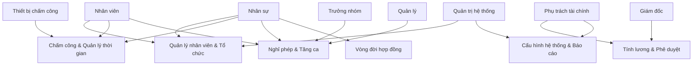
</details>

Hình 2.1: Biểu đồ use case tổng quan

### 2.2.2 Biểu đồ use case phân rã

#### a. Use case Quản lý nhân viên & Tổ chức

Phân hệ này quản lý toàn bộ vòng đời dữ liệu nhân viên. Bộ phận nhân sự và quản trị hệ thống có quyền tạo, cập nhật và vô hiệu hóa tài khoản nhân viên. Mỗi nhân viên được liên kết bắt buộc với một tài khoản đăng nhập và có thể được gán vào một phòng ban.

<details>
<summary>Use case Quản lý nhân viên & Tổ chức</summary>

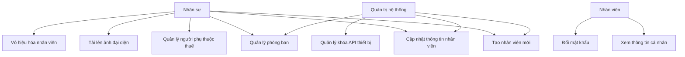
</details>

Hình 2.2: Use case Quản lý nhân viên & Tổ chức

Điểm đặc biệt trong nghiệp vụ: mỗi nhân viên khi được tạo luôn đồng thời có một tài khoản đăng nhập tương ứng — hệ thống bảo đảm không tồn tại nhân viên không có tài khoản hay tài khoản không gắn nhân viên. Nhân viên không thể tự đăng ký; tài khoản do bộ phận nhân sự tạo và mật khẩu ban đầu được truyền đạt ngoài hệ thống. Thiết kế kỹ thuật bảo đảm tính nhất quán của thao tác tạo đồng thời này được trình bày trong mục 4.2.2.

#### b. Use case Chấm công & Quản lý thời gian

Đây là phân hệ trung tâm kết nối thiết bị vật lý với quy trình nghiệp vụ. Hai luồng xử lý song song: real-time (thiết bị gửi từng sự kiện) và batch upload (thiết bị tải lên khi mạng phục hồi).

<details>
<summary>Use case Chấm công & Quản lý thời gian</summary>

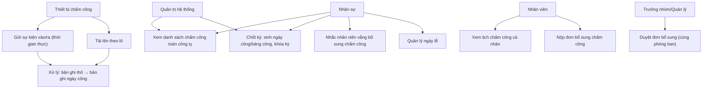
</details>

Hình 2.3: Use case Chấm công & Quản lý thời gian

Mỗi sự kiện vào/ra được tổng hợp vào một bản ghi ngày công — nguồn sự thật theo từng ngày của mỗi nhân viên (xem Mục 5.2). Bộ phận nhân sự không sửa trực tiếp bản ghi chấm công; thay vào đó nhân viên nộp đơn bổ sung và trưởng nhóm hoặc quản lý cùng phòng ban duyệt (khi duyệt sẽ ghi vào bản ghi ngày công). Việc chốt kỳ chấm công là bước kiểm soát bắt buộc trước khi tính lương: thao tác chốt kỳ điền nốt các ngày còn thiếu (vắng mặt, ngày lễ), khóa toàn bộ bản ghi ngày công và sinh bảng công tổng hợp tháng cho từng nhân viên. Một kỳ đã chốt chỉ có thể mở lại qua can thiệp trực tiếp vào cơ sở dữ liệu.

#### c. Use case Nghỉ phép & Tăng ca

Phân hệ này quản lý toàn bộ vòng đời yêu cầu nghỉ phép và tăng ca, với cơ chế phê duyệt đa cấp và kiểm soát số dư.

<details>
<summary>Use case Nghỉ phép & Tăng ca</summary>

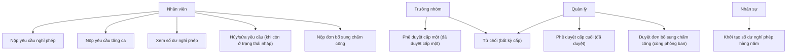
</details>

Hình 2.4: Use case Nghỉ phép & Tăng ca

Hai ràng buộc quan trọng: (1) đơn nghỉ phép phải qua đúng thứ tự cấp phê duyệt (trưởng nhóm rồi quản lý) — không thể bỏ cấp, và quản lý là cấp duyệt cuối; (2) khi nộp đơn, số ngày xin nghỉ lập tức bị trừ vào phần "đang chờ duyệt" của số dư, ngăn nhân viên nộp nhiều đơn trùng thời gian vượt quá số ngày còn lại. Đơn chỉ được sửa hoặc hủy khi còn ở trạng thái nháp.

Khác với nghỉ phép, **tăng ca đi theo quy trình kế hoạch**: trưởng nhóm lập kế hoạch tăng ca và phân công nhân viên, quản lý duyệt kế hoạch; sau đó nhân viên ghi nhận phiên tăng ca thực tế theo kế hoạch. Hệ thống chạy bốn bước kiểm tra (đúng kế hoạch đã duyệt → khớp bản ghi chấm công ngày đó → trong giới hạn pháp luật 40 giờ/tháng và 200 giờ/năm → không trùng phiên tăng ca khác) và **tự động phê duyệt** khi đạt — vì kế hoạch đã được quản lý duyệt và dữ liệu chấm công từ thiết bị là bằng chứng khách quan, không cần thêm vòng duyệt. Mỗi phiên tăng ca được gắn hệ số lương theo ngày thường (×1,5), cuối tuần (×2,0) hoặc ngày lễ (×3,0).

#### d. Use case Vòng đời hợp đồng

<details>
<summary>Use case Vòng đời hợp đồng</summary>

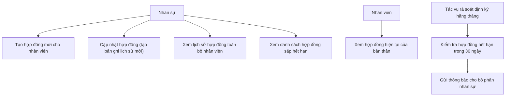
</details>

Hình 2.5: Use case Vòng đời hợp đồng

Mô hình lịch sử hợp đồng bảo đảm không dữ liệu cũ nào bị ghi đè: mỗi lần cập nhật tạo ra một bản ghi mới có hiệu lực từ ngày cập nhật, đồng thời đánh dấu bản ghi cũ là đã hết hiệu lực. Toàn bộ lịch sử điều kiện làm việc của nhân viên được bảo tồn đầy đủ.

#### e. Use case Tính lương & Phê duyệt

<details>
<summary>Use case Tính lương & Phê duyệt</summary>

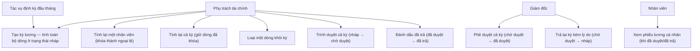
</details>

Hình 2.6: Use case Tính lương & Phê duyệt

Tính lương được tổ chức theo **kỳ lương bền vững**: người phụ trách tài chính tạo kỳ cho một tháng, hệ thống tính tất cả dòng lương ở trạng thái nháp. Người phụ trách tài chính có thể tính lại một nhân viên (dòng đó bị khóa, trở thành ngoại lệ và được giữ nguyên khi tính lại cả kỳ) hoặc loại một dòng khỏi kỳ mà không chặn cả lô. Hai cổng kiểm soát quan trọng: (1) chỉ tạo kỳ lương sau khi bộ phận nhân sự đã chốt kỳ chấm công; (2) **không cho trình duyệt cả kỳ nếu còn nhân viên thiếu điểm hệ số thi đua** — bảo đảm lương không dựa trên dữ liệu chấm công chưa kiểm tra hoặc đánh giá hiệu quả còn thiếu. Sau khi giám đốc duyệt cả kỳ, nhân viên mới thấy phiếu lương.

#### f. Use case Cấu hình hệ thống & Báo cáo

<details>
<summary>Use case Cấu hình hệ thống & Báo cáo</summary>

```mermaid
graph TD
    FIN["Phụ trách tài chính"] --> A["Tạo phiên bản cấu hình lương (nháp)"]
    FIN --> B["Xem báo cáo chi phí lao động"]
    FIN --> C["Xuất báo cáo nộp bảo hiểm"]
    FIN --> D["Xuất báo cáo tổng hợp thuế thu nhập"]
    DIR["Giám đốc"] --> B
    DIR --> P["Phát hành cấu hình"]
    SYS["Quản trị hệ thống"] --> E["Quản lý tài khoản (khóa/mở, đặt lại mật khẩu)"]
    SYS --> Q["Quản lý thiết bị và khóa API"]
    SYS --> R["Xem nhật ký chấm công (chỉ đọc)"]
    SYS --> F["Xem chỉ số vận hành"]
    ALL["Mọi người dùng"] --> G["Xem thông báo trong ứng dụng"]
    ALL --> H["Đánh dấu thông báo đã đọc"]
```
</details>

Hình 2.7: Use case Cấu hình hệ thống & Báo cáo

Cấu hình tính lương được quản lý theo phiên bản có hiệu lực theo ngày trong các nhóm bảng riêng (bậc lương, thuế thu nhập cá nhân, bảo hiểm, phụ cấp), theo mô hình người soạn — người duyệt: **người phụ trách tài chính tạo phiên bản nháp, giám đốc phát hành**; phiên bản đã phát hành là bất biến và được chọn theo ngày hiệu lực. Việc tách quyền soạn và phát hành cấu hình giúp ngăn một người đơn phương thay đổi tham số tính lương. Quản trị hệ thống là tài khoản đặc biệt — không phải nhân viên thực và không tính lương — chỉ phụ trách quản lý tài khoản, thiết bị chấm công và xem nhật ký chấm công.

### 2.2.3 Quy trình nghiệp vụ

Phần này mô tả chi tiết ba quy trình nghiệp vụ quan trọng nhất của hệ thống.

#### a. Quy trình chấm công và xử lý Attendance

Quy trình này mô tả hành trình từ khi nhân viên đặt khuôn mặt trước thiết bị đến khi bản ghi chấm công được tạo trong hệ thống và sẵn sàng cho tính lương.

<details>
<summary>Quy trình chấm công</summary>

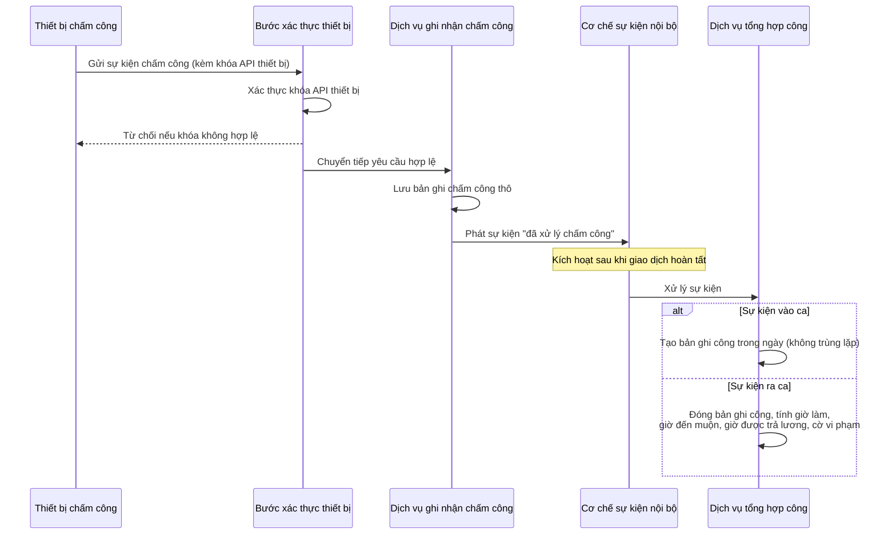
</details>

Hình 2.8: Quy trình chấm công và xử lý Attendance

Pipeline chấm công được thiết kế theo hướng event-driven: bản ghi chấm công thô được lưu trước, sau đó hệ thống mới tạo bản ghi chấm công đã xử lý. Nhờ đó, dù khâu xử lý gặp lỗi, dữ liệu thô vẫn được bảo toàn và tác vụ định kỳ lúc nửa đêm sẽ tự động bù đắp. Chi tiết kiến trúc và lý do lựa chọn được trình bày trong mục 5.2.

#### b. Quy trình phê duyệt nghỉ phép đa cấp

<details>
<summary>Quy trình phê duyệt nghỉ phép</summary>

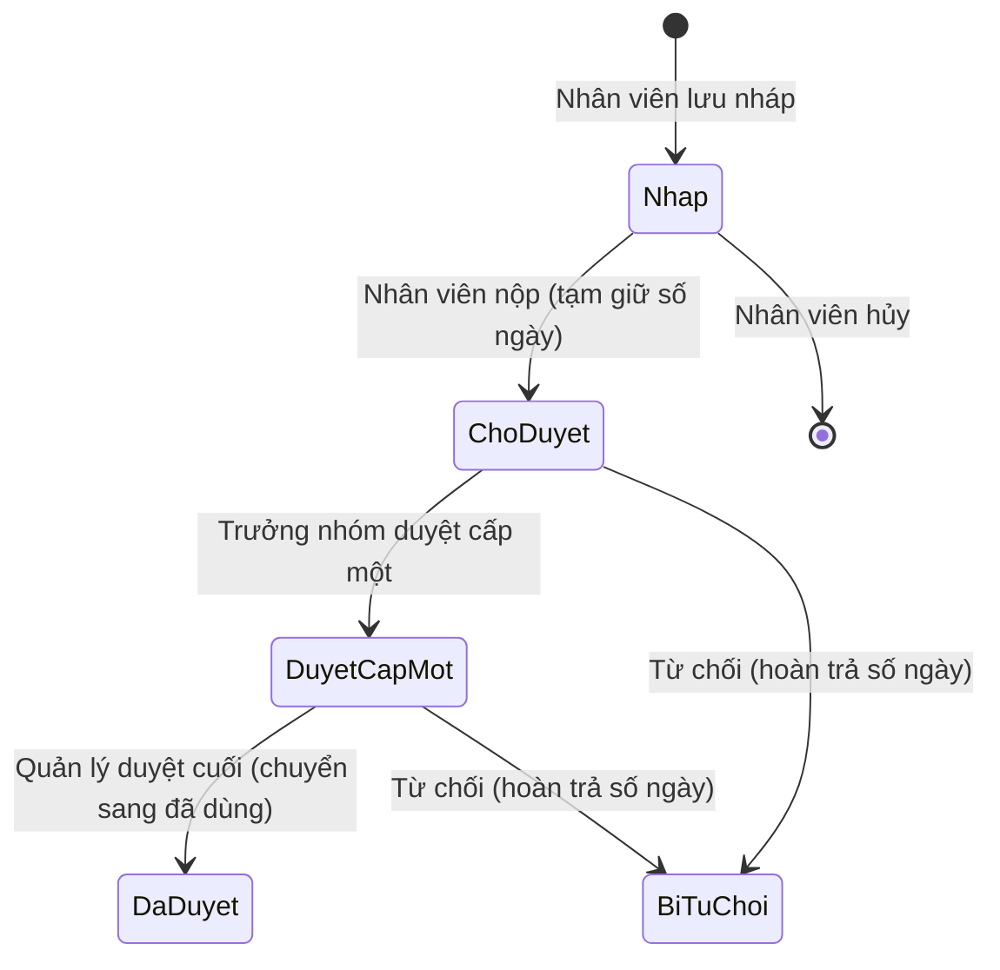
</details>

Hình 2.9: Quy trình phê duyệt nghỉ phép đa cấp

Về mặt nghiệp vụ, khi nhân viên nộp yêu cầu, số ngày nghỉ được tạm giữ ngay để ngăn việc đăng ký trùng vượt quá số dư; chỉ khi yêu cầu được phê duyệt cuối, số ngày này mới được tính là đã sử dụng, còn khi bị từ chối hoặc hủy thì được hoàn trả đầy đủ. Cơ chế trừ hai giai đoạn và cách chống tranh chấp đồng thời (race condition) được trình bày chi tiết trong mục 5.4.

#### c. Quy trình tính lương và phê duyệt chi trả

<details>
<summary>Quy trình tính lương</summary>

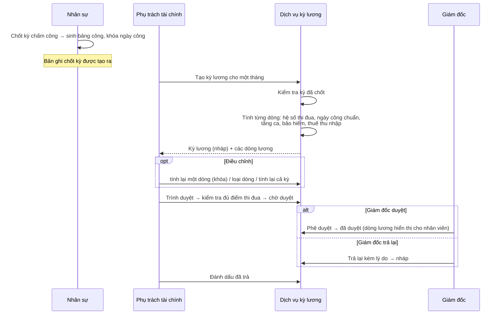
</details>

Hình 2.10: Quy trình tính lương và phê duyệt chi trả

Quy trình tính lương có một điểm gate quan trọng về mặt nghiệp vụ: bộ phận Kế toán chỉ có thể tính lương sau khi kỳ chấm công đã được HR chốt, và bảng lương phải qua phê duyệt của Ban Giám đốc trước khi được đánh dấu chi trả. Thiết kế kỹ thuật của bộ máy tính lương và công thức tuân thủ pháp luật được trình bày chi tiết trong mục 5.3.

## 2.3 Đặc tả chức năng

Phần này đặc tả chi tiết năm ca sử dụng quan trọng nhất của hệ thống.

### 2.3.1 Đặc tả use case Chấm công & Chốt kỳ

Bảng 2.2: Đặc tả ca sử dụng Chấm công & Chốt kỳ

| Trường | Nội dung |
|---|---|
| Tên use case | Chấm công và chốt kỳ |
| Mã use case | UC-ATT-01 |
| Tác nhân chính | Thiết bị chấm công nhận diện khuôn mặt |
| Tác nhân phụ | Nhân sự (chốt kỳ) |
| Mô tả | Thiết bị gửi sự kiện check-in/check-out; hệ thống tự động tạo và cập nhật bản ghi chấm công; cuối tháng HR chốt kỳ để cho phép tính lương |
| Điều kiện tiên quyết | Thiết bị đã được đăng ký với API key hợp lệ; nhân viên tồn tại trong hệ thống |
| Luồng chính | 1. Thiết bị gửi sự kiện check-in (logType=IN) kèm khóa API xác thực của thiết bị |
| | 2. Hệ thống xác thực khóa API của thiết bị; nếu không hợp lệ, từ chối yêu cầu |
| | 3. Hệ thống lưu bản ghi chấm công thô và phát sự kiện xử lý nội bộ |
| | 4. Sau khi lưu thành công, hệ thống tạo bản ghi chấm công mới cho ngày (đảm bảo không trùng lặp) |
| | 5. Cuối ngày: thiết bị gửi sự kiện check-out; hệ thống đóng bản ghi, tính giờ công, giờ đến muộn, giờ được trả lương và ngày công, đánh dấu vi phạm nếu đến muộn |
| | 6. Cuối tháng: bộ phận nhân sự thực hiện chốt kỳ ở chế độ thử (không ép buộc) |
| | 7. Hệ thống quét vắng mặt không giải thích, trả về danh sách nếu có |
| | 8. HR xử lý từng trường hợp bất thường rồi chốt kỳ ở chế độ ép buộc nếu cần |
| | 9. Bản ghi chốt kỳ được tạo; kỳ chấm công bị khóa |
| Luồng thay thế | 3a. Thiết bị mất mạng: tải lên lô bản ghi chấm công khi mạng phục hồi |
| | 4a. Nhân viên quên check-out: tác vụ định kỳ lúc nửa đêm backfill từ log ngày hôm trước |
| | 7a. Không có vắng mặt bất thường: kỳ được chốt ngay lập tức |
| Luồng ngoại lệ | 2a. API key đã bị vô hiệu hóa: trả 401 |
| | 6a. Kỳ đã chốt trước đó: trả 400 |
| Điều kiện kết thúc | Bản ghi chốt kỳ tồn tại; người phụ trách tài chính có thể bắt đầu tính lương |

### 2.3.2 Đặc tả use case Phê duyệt nghỉ phép

Bảng 2.3: Đặc tả ca sử dụng Phê duyệt nghỉ phép

| Trường | Nội dung |
|---|---|
| Tên use case | Phê duyệt nghỉ phép đa cấp |
| Mã use case | UC-LV-01 |
| Tác nhân chính | Nhân viên (nộp), trưởng nhóm (cấp một), quản lý (cấp cuối) |
| Mô tả | Nhân viên nộp yêu cầu nghỉ phép; hệ thống kiểm tra số dư và tạm giữ ngay; yêu cầu đi qua hai cấp phê duyệt (trưởng nhóm rồi quản lý) |
| Điều kiện tiên quyết | Nhân viên đã đăng nhập; số dư phép đã được khởi tạo cho năm hiện tại; ngày kết thúc không trước ngày bắt đầu |
| Luồng chính | 1. Nhân viên chọn loại nghỉ phép, ngày bắt đầu, ngày kết thúc, lý do |
| | 2. Hệ thống kiểm tra loại phép không phải ngày lễ hay nghỉ bù |
| | 3. Hệ thống so sánh số ngày xin nghỉ với số dư còn lại |
| | 4. Hệ thống tạm giữ số ngày xin nghỉ vào phần đang chờ duyệt; lưu yêu cầu ở trạng thái chờ duyệt |
| | 5. Hệ thống gửi thông báo cho trưởng nhóm của nhân viên |
| | 6. Trưởng nhóm phê duyệt → đã duyệt cấp một |
| | 7. Quản lý phê duyệt cuối → đã duyệt; hệ thống chuyển số ngày đang chờ thành đã dùng |
| Luồng thay thế | 6a–7a. Trưởng nhóm hoặc quản lý từ chối: yêu cầu bị từ chối; số ngày tạm giữ được hoàn trả |
| | 4a. Nhân viên hủy/sửa khi còn ở trạng thái nháp: số ngày tạm giữ được hoàn trả (chỉ sửa/hủy được khi còn nháp) |
| Luồng ngoại lệ | 3a. Số dư còn lại nhỏ hơn số ngày xin nghỉ: từ chối, báo số ngày còn lại |
| | 2a. Loại phép là ngày lễ hoặc nghỉ bù: từ chối |
| Điều kiện kết thúc | Yêu cầu ở trạng thái đã duyệt (tăng số ngày đã dùng) hoặc bị từ chối (hoàn trả số dư) |
| Yêu cầu đặc biệt | Cơ chế tạm giữ hai giai đoạn phải nguyên tử để tránh tranh chấp khi nhiều yêu cầu nộp đồng thời |

### 2.3.3 Đặc tả use case Tính lương

Bảng 2.4: Đặc tả ca sử dụng Tính lương

| Trường | Nội dung |
|---|---|
| Tên use case | Tính lương cá nhân |
| Mã use case | UC-PAY-01 |
| Tác nhân chính | Phụ trách tài chính |
| Mô tả | Tính toán lương đầy đủ cho một nhân viên trong một kỳ, dựa trên chấm công, hợp đồng và cấu hình hệ thống |
| Điều kiện tiên quyết | Kỳ chấm công đã chốt (đã sinh bảng công); nhân viên có hợp đồng đang hiệu lực; cấu hình lương đã ban hành và còn hiệu lực cho đủ bốn nhóm (bậc lương, phụ cấp, thuế thu nhập, bảo hiểm) |
| Luồng chính | 1. Người phụ trách tài chính yêu cầu tính lương cho một nhân viên trong kỳ (kèm các khoản thưởng/phụ cấp tùy chọn) |
| | 2. Hệ thống kiểm tra kỳ chấm công đã được chốt; nếu chưa, từ chối yêu cầu |
| | 3. Hệ thống nạp hợp đồng đang hiệu lực và cấu hình tính lương đang áp dụng |
| | 4. Tính hệ số thi đua trung bình HStb = (HS1 + HS2) / 2: HS1 lấy từ điểm cấp trên chấm (mặc định loại B nếu chưa có), HS2 suy từ mức chuyên cần. Với cấp quản lý, hai hệ số lấy theo trung bình của đơn vị; với giám đốc lấy theo trung bình toàn công ty |
| | 5. Lương cơ bản kỳ = [(Lhq × HStb) + Li + HTi] × (NCtt / Nt), trong đó số ngày công chuẩn tự suy từ bảng công đã chốt, số ngày công thực tế lấy từ bản ghi ngày công |
| | 6. Cộng tiền tăng ca theo hệ số ngày thường/cuối tuần/ngày lễ và phụ trội ca đêm theo tỷ lệ thời gian chồng lấp khung 22:00–06:00 |
| | 7. Tính nền đóng bảo hiểm bằng giá trị nhỏ hơn giữa lương gộp và mức trần theo quy định |
| | 8. Khấu trừ các khoản bảo hiểm nhân viên đóng; tính thuế thu nhập cá nhân lũy tiến bảy bậc |
| | 9. Tính chi phí phía người sử dụng lao động (các khoản bảo hiểm chủ đóng và bảo hiểm tai nạn lao động) |
| | 10. Lưu dòng phiếu lương ở trạng thái nháp |
| Luồng thay thế | 1a. Tính lương hàng loạt cho toàn bộ nhân viên trong kỳ |
| Luồng ngoại lệ | 2a. Kỳ chưa chốt: từ chối yêu cầu |
| | 3a. Không có hợp đồng hiệu lực: từ chối yêu cầu |
| | 3b. Đã tồn tại phiếu lương cho nhân viên trong kỳ: từ chối để tránh trùng lặp |
| Điều kiện kết thúc | Dòng phiếu lương ở trạng thái nháp, sẵn sàng cho người phụ trách tài chính xem xét và trình duyệt |
| Yêu cầu đặc biệt | Bộ máy tính lương là một thành phần tính toán thuần, không truy cập cơ sở dữ liệu, để dễ kiểm thử đơn vị |

### 2.3.4 Đặc tả use case Phê duyệt bảng lương

Bảng 2.5: Đặc tả ca sử dụng Phê duyệt bảng lương

| Trường | Nội dung |
|---|---|
| Tên use case | Phê duyệt bảng lương |
| Mã use case | UC-PAY-02 |
| Tác nhân chính | Phụ trách tài chính (trình duyệt, đánh dấu đã trả), giám đốc (phê duyệt/từ chối) |
| Mô tả | Người phụ trách tài chính trình bảng lương lên giám đốc; giám đốc phê duyệt hoặc từ chối; người phụ trách tài chính đánh dấu đã chi trả sau phê duyệt |
| Điều kiện tiên quyết | Kỳ lương đang ở trạng thái nháp |
| Luồng chính | 1. Người phụ trách tài chính xem xét chi tiết kỳ lương ở trạng thái nháp; có thể xóa và tính lại nếu cần |
| | 2. Trình bảng lương → chờ duyệt; hệ thống gửi thông báo cho giám đốc |
| | 3. Giám đốc xem tổng quan chi phí lao động và chi tiết từng dòng lương |
| | 4. Giám đốc phê duyệt → đã duyệt; thông báo cho người phụ trách tài chính và nhân viên |
| | 5. Người phụ trách tài chính xác nhận đã chi trả lương qua ngân hàng |
| | 6. Đánh dấu đã chi trả → đã trả (trạng thái cuối) |
| Luồng thay thế | 4a. Giám đốc từ chối kèm lý do → bị từ chối; người phụ trách tài chính nhận thông báo kèm lý do |
| | 4b. Sau khi bị từ chối: xóa kỳ lương đó và tính lại từ đầu |
| Luồng ngoại lệ | 4a. Vai trò khác cố gắng phê duyệt: bị từ chối (chỉ giám đốc mới có quyền) |
| | 6a. Đánh dấu đã trả khi trạng thái chưa phải đã duyệt: từ chối thao tác |
| Điều kiện kết thúc | Kỳ lương ở trạng thái đã trả (không thể thay đổi) hoặc bị từ chối (xử lý lại) |
| Yêu cầu đặc biệt | Lý do từ chối là bắt buộc; được lưu trên bản ghi và trả về qua thông báo |

### 2.3.5 Đặc tả use case Báo cáo tài chính

Bảng 2.6: Đặc tả ca sử dụng Báo cáo tài chính

| Trường | Nội dung |
|---|---|
| Tên use case | Xuất báo cáo tài chính |
| Mã use case | UC-RPT-01 |
| Tác nhân chính | Phụ trách tài chính, giám đốc |
| Mô tả | Hệ thống tổng hợp dữ liệu lương đã phê duyệt thành ba loại báo cáo phục vụ kế toán và tuân thủ pháp luật |
| Điều kiện tiên quyết | Tồn tại ít nhất một phiếu lương ở trạng thái đã duyệt hoặc đã trả trong kỳ truy vấn |
| Luồng chính — Báo cáo chi phí lao động | Tổng hợp lương gộp, lương thực nhận, tổng bảo hiểm, thuế thu nhập, tăng ca và tổng chi phí sử dụng lao động theo từng nhân viên và bộ phận |
| Luồng chính — Báo cáo nộp bảo hiểm | Tổng hợp mã bảo hiểm xã hội, mức lương đóng (sau khi áp trần) và tất cả khoản bảo hiểm phía người lao động và người sử dụng lao động |
| Luồng chính — Báo cáo thuế thu nhập | Tổng hợp mã số thuế, số người phụ thuộc, thu nhập tính thuế và thuế thu nhập theo từng nhân viên |
| Luồng ngoại lệ | Không có phiếu lương được phê duyệt trong kỳ: trả về kết quả rỗng |
| Điều kiện kết thúc | Dữ liệu được trả về và hỗ trợ xuất ra tệp bảng tính với bảng mã Unicode |
| Yêu cầu đặc biệt | Chỉ tính trên phiếu lương đã duyệt hoặc đã trả; các phiếu còn ở trạng thái nháp, chờ duyệt hoặc bị từ chối không được tính vào |

## 2.4 Yêu cầu phi chức năng

Ngoài các yêu cầu chức năng, hệ thống FaceZ HRMS phải đáp ứng các yêu cầu phi chức năng sau.

Bảng 2.7: Các yêu cầu phi chức năng

| # | Nhóm | Yêu cầu | Ưu tiên | Cách đáp ứng |
|---|---|---|---|---|
| PF-01 | Hiệu năng | Thời gian phản hồi dưới 500ms cho 95% yêu cầu trong điều kiện bình thường (≤ 50 người dùng đồng thời) | Cao | Bể kết nối cơ sở dữ liệu; bộ nhớ đệm cho việc kiểm tra token; lập chỉ mục đúng trên các cột thường truy vấn |
| PF-02 | Hiệu năng | Tính lương hàng loạt cho 200 nhân viên hoàn thành trong dưới 60 giây | Trung bình | Bộ máy tính lương là thành phần tính toán thuần, không chờ vào/ra |
| PF-03 | Hiệu năng | Xử lý sự kiện chấm công thời gian thực dưới 500ms toàn trình | Cao | Bước xác thực thiết bị nhẹ; việc tổng hợp công chạy sau khi giao dịch hoàn tất, không chặn phản hồi |
| RC-01 | Độ tin cậy | Lược đồ cơ sở dữ liệu quản lý bằng các phiên bản có đánh số; ứng dụng không tự sửa lược đồ | Cao | Ba mươi mốt phiên bản lược đồ, hợp nhất thành một tập lệnh khởi tạo |
| RC-02 | Độ tin cậy | Toàn bộ thay đổi dữ liệu nghiệp vụ đều có vết kiểm toán | Cao | Lớp thực thể cơ sở dùng chung tự động ghi vết người tạo/người sửa |
| RC-03 | Độ tin cậy | Bản ghi chấm công không bị mất khi kết nối thiết bị gián đoạn | Cao | Lưu bản ghi thô trước; tác vụ định kỳ lúc nửa đêm điền bù dữ liệu thiếu |
| RC-04 | Độ tin cậy | Xóa mềm trên mọi thực thể; không xóa vật lý dữ liệu lịch sử | Trung bình | Cờ đánh dấu đã xóa kèm thời điểm xóa trên mọi thực thể |
| SC-01 | Bảo mật | Xác thực bằng token: token truy cập 5 phút, token làm mới 14 ngày trong cookie chỉ truy cập từ máy chủ | Cao | Danh sách thu hồi token trên bộ nhớ đệm; xoay vòng token mỗi lần làm mới |
| SC-02 | Bảo mật | Chống dò mật khẩu đăng nhập: tối đa 10 lần trong 15 phút cho mỗi địa chỉ IP | Cao | Bộ đếm trên bộ nhớ đệm, phân biệt theo địa chỉ IP của người gọi |
| SC-03 | Bảo mật | Thiết bị chấm công xác thực bằng khóa API; không lưu khóa gốc | Cao | Chỉ lưu dạng băm của khóa; cấp khóa mới sẽ vô hiệu hóa khóa cũ |
| SC-04 | Bảo mật | Phân quyền chi tiết theo vai trò và phương thức HTTP | Cao | Kiểm soát quyền ở mức từng thao tác kết hợp luật phân quyền theo đường dẫn |
| SC-05 | Bảo mật | Không nhúng cứng thông tin bí mật trong mã | Cao | Nạp thông tin bí mật qua biến môi trường |
| US-01 | Khả năng sử dụng | Giao diện tự điều chỉnh menu theo vai trò đăng nhập | Cao | Lớp bảo vệ theo vai trò và thanh điều hướng thay đổi theo vai trò |
| US-02 | Khả năng sử dụng | Thông báo lỗi rõ ràng bằng tiếng Việt khi thao tác không hợp lệ | Trung bình | Phản hồi từ máy chủ kèm thông điệp lỗi; hiển thị dưới dạng thông báo nổi |
| US-03 | Khả năng sử dụng | Phiên làm việc tự động gia hạn trong suốt thời gian sử dụng | Cao | Làm mới ngầm: tự gọi điểm làm mới phiên khi token hết hạn rồi thực hiện lại yêu cầu |
| MT-01 | Khả năng bảo trì | Mọi thay đổi lược đồ phải qua phiên bản có đánh số | Cao | Quy ước đánh số phiên bản; áp thủ công theo thứ tự |
| MT-02 | Khả năng bảo trì | Tài liệu giao diện lập trình tự động cập nhật | Trung bình | Sinh tài liệu tự động từ mã nguồn theo chuẩn mở |
| MT-03 | Khả năng bảo trì | Nhật ký có cấu trúc khi vận hành, có màu khi phát triển | Trung bình | Cấu hình nhật ký thay đổi theo hồ sơ môi trường |
| MT-04 | Khả năng bảo trì | Điểm cuối kiểm tra sức khỏe công khai để giám sát vận hành | Thấp | Điểm cuối kiểm tra sức khỏe công khai; các điểm cuối khác yêu cầu quyền quản trị hệ thống |

Chương này đã hoàn thành việc xác định yêu cầu hệ thống từ cả góc độ chức năng lẫn phi chức năng. Phân tích cho thấy khoảng trống thị trường rõ ràng: chưa có giải pháp nào đồng thời đáp ứng ba yêu cầu là tính lương đúng pháp luật Việt Nam, tích hợp thiết bị nhận diện khuôn mặt qua REST, và kiến trúc phân tách nhiệm vụ kiểm soát nội bộ. Tập yêu cầu và đặc tả use case đã xây dựng trong chương này trở thành hợp đồng chức năng cho giai đoạn lựa chọn công nghệ được trình bày trong Chương 3.

---

# CHƯƠNG 3. NỀN TẢNG LÝ THUYẾT VÀ CÔNG NGHỆ SỬ DỤNG

Xuất phát từ các yêu cầu đã xác định trong Chương 2, chương này phân tích nền tảng lý luận cho từng quyết định công nghệ của FaceZ HRMS. Với mỗi bài toán kỹ thuật, chương liệt kê các hướng tiếp cận hiện có, đánh giá ưu nhược điểm, và lý giải quyết định cuối cùng trong ngữ cảnh cụ thể của đồ án. Các công nghệ được tổ chức theo sáu nhóm: framework backend và ngôn ngữ lập trình (Mục 3.2), cơ sở dữ liệu và bộ nhớ đệm (Mục 3.3), cơ chế xác thực JWT và bảo mật (Mục 3.4), framework frontend (Mục 3.5), và hạ tầng tài liệu API (Mục 3.6).

## 3.1 Tổng quan các lựa chọn công nghệ

Mỗi quyết định công nghệ trong đồ án được đưa ra dựa trên một bài toán cụ thể cần giải quyết, chứ không phải dựa trên mức độ phổ biến hay sở thích cá nhân. Phần này trước tiên trình bày bức tranh tổng thể các lựa chọn và lý do căn bản, trước khi đi sâu vào từng công nghệ ở các mục tiếp theo.

Bảng 3.1: Tóm tắt các lựa chọn công nghệ

| Tầng | Công nghệ được chọn | Các lựa chọn thay thế đã xem xét | Lý do lựa chọn |
|---|---|---|---|
| Backend Runtime | Java 21 + Spring Boot 4.0.0-M3 | Node.js/Express, Python/Django, Go/Gin | Hệ sinh thái doanh nghiệp trưởng thành; Spring Security, JPA, Events sẵn có; Virtual Threads cho I/O-bound workload |
| Bảo mật | Spring Security + JWT | OAuth2/Keycloak, Session-based | Kiểm soát hoàn toàn luồng xác thực; không phụ thuộc dịch vụ ngoài; JWT phù hợp SPA stateless |
| Quản lý lược đồ | Script SQL có phiên bản | Liquibase, để framework tự cập nhật lược đồ | Quy ước đơn giản, áp thủ công khi triển khai; chế độ ứng dụng không tự sửa lược đồ an toàn hơn để framework tự cập nhật; không phụ thuộc công cụ di trú lúc chạy |
| ORM | Spring Data JPA (Hibernate) | JOOQ, MyBatis, JDBC Template | Giảm mã lặp; tích hợp sẵn cơ chế ghi vết kiểm toán và xóa mềm |
| Cơ sở dữ liệu chính | PostgreSQL 15 | MySQL 8, MongoDB, MariaDB | Cột kiểu JSON có thể truy vấn cho cấu hình lương; chỉ mục duy nhất có điều kiện cho hợp đồng; khung nhìn cơ sở dữ liệu cho truy vấn tăng ca |
| Cache & Session Store | Redis 7 | Memcached, Hazelcast, bộ nhớ trong tiến trình | Thời gian sống tự hết hạn cho danh sách thu hồi token; bộ đếm nguyên tử cho giới hạn tần suất; chia sẻ giữa nhiều tiến trình |
| Lưu trữ đối tượng | MinIO (tương thích S3) | AWS S3, lưu file hệ thống, lưu nhị phân trong CSDL | Lưu tài liệu hợp đồng PDF; giao diện tương thích S3 nên dễ chuyển sang đám mây; tách tệp nhị phân khỏi cơ sở dữ liệu |
| Frontend Framework | Next.js 15 (App Router) | Create React App, Vite+React, Vue 3 | SSR cho hiệu suất; App Router cho nested layouts theo role; TypeScript first-class |
| UI Styling | Tailwind CSS 3 | Bootstrap, MUI, Chakra UI | Utility-first phù hợp dashboard phức tạp; không bị ràng buộc design system bên thứ ba |
| Charts | Recharts | Chart.js, ApexCharts, D3.js | Tích hợp native với React; declarative API; hỗ trợ ResponsiveContainer tốt |
| Containerization | Docker + Docker Compose | Kubernetes, bare metal | Docker Compose đủ cho single-host deployment; Kubernetes quá phức tạp cho quy mô hiện tại |
| API Documentation | SpringDoc OpenAPI (Swagger) | Postman Collection, API Blueprint | Tự động sinh từ annotation; luôn đồng bộ với code; UI test trực tiếp trên browser |

## 3.2 Nhóm xử lý nghiệp vụ — Backend

### 3.2.1 Spring Boot và Java 21

Bài toán cần giải quyết: Hệ thống HRMS có độ phức tạp nghiệp vụ cao — nhiều entity với vòng đời phức tạp, transaction lồng nhau, event-driven pipeline, scheduled jobs, và batch processing. Cần một nền tảng có hệ sinh thái đủ trưởng thành để không phải tự xây dựng các thành phần cơ sở từ đầu.

Lý do chọn Java 21 và Spring Boot 4.0.0-M3:

Java 21 là phiên bản LTS (Long-Term Support) mới nhất, mang hai cải tiến quan trọng cho dự án này. Thứ nhất, Virtual Threads (Project Loom, ổn định từ Java 21): mỗi request HTTP được xử lý trên một virtual thread thay vì platform thread, cho phép hàng nghìn kết nối đồng thời với bộ nhớ tối thiểu mà không phải viết code bất đồng bộ phức tạp. Điều này đặc biệt quan trọng cho batch payroll processing khi nhiều tác vụ I/O-bound (đọc dữ liệu từ DB) chạy đồng thời. Thứ hai, Records và Sealed Classes giúp viết DTO và response type an toàn kiểu hơn, giảm boilerplate so với Java 8.

Spring Boot 4.0.0-M3 được chọn vì hệ sinh thái tích hợp sẵn:

- Mô-đun bảo mật: cung cấp chuỗi bộ lọc có thể cấu hình để đặt bước xác thực thiết bị (qua khóa API) trước bước xác thực người dùng (qua token), phân quyền chi tiết theo mẫu đường dẫn và phương thức HTTP, đồng thời hỗ trợ kiểm soát quyền ở mức từng phương thức nghiệp vụ.
- Mô-đun truy cập dữ liệu: giảm mã lặp khi thao tác cơ sở dữ liệu; tự động ghi vết người tạo/người sửa và thời điểm; chạy ở chế độ không để framework tự sửa lược đồ, nhường quyền kiểm soát lược đồ cho các script SQL có phiên bản.
- Cơ chế sự kiện nội bộ: mô hình phát hành/đăng ký trong tiến trình, kích hoạt sau khi giao dịch hoàn tất, cho phép tách rời nghiệp vụ ghi nhận chấm công khỏi nghiệp vụ tổng hợp công mà không tạo phụ thuộc vòng và không cần hàng đợi tin nhắn bên ngoài.
- Cơ chế tác vụ định kỳ: lập lịch theo biểu thức thời gian cho việc tổng hợp chấm công và rà soát hợp đồng sắp hết hạn.
- Cơ chế xử lý bất đồng bộ: phục vụ tính lương hàng loạt mà không chiếm dụng luồng xử lý HTTP.

So sánh với lựa chọn thay thế:

*Node.js/Express* có ưu điểm về tốc độ phát triển nhưng hệ sinh thái doanh nghiệp (bảo mật, ghi vết kiểm toán, quản lý lược đồ) kém trưởng thành hơn, khiến phần xử lý phân quyền và giao dịch phải viết thủ công nhiều hơn. *Python/Django* có thư viện ánh xạ quan hệ - đối tượng mạnh nhưng hiệu năng đa luồng hạn chế do khóa thông dịch toàn cục, và không có cơ chế sự kiện nội bộ tương đương. *Go/Gin* nhanh nhưng thiếu hệ sinh thái ánh xạ dữ liệu và bảo mật cho nghiệp vụ phức tạp.

Mã nguồn backend được tổ chức theo **miền nghiệp vụ** thay vì theo tầng kỹ thuật. Mỗi miền — nhân sự, phòng ban, chấm công, nghỉ phép, tăng ca, hợp đồng, tính lương, thông báo — là một mô-đun tự chứa, gom đầy đủ thực thể, dịch vụ và kho dữ liệu liên quan vào một chỗ. Các thành phần dùng chung (kiểu liệt kê vai trò và trạng thái, bộ lọc xác thực, dịch vụ token, bộ xử lý ngoại lệ, lớp bao bọc phản hồi) được tách riêng. Cách tổ chức theo miền giúp mỗi tính năng dễ định vị và bảo trì hơn so với tổ chức theo tầng khi mã nguồn lớn dần.

### 3.2.2 Spring Security và kiến trúc phân quyền

Bài toán cần giải quyết: hệ thống có bảy vai trò với quyền hạn chồng lấp phức tạp. Cùng một thao tác xem danh sách nhân viên có thể được truy cập bởi nhân sự (xem tất cả), quản lý (xem nhân viên trong phòng ban) và nhân viên (xem chính mình). Thiết bị chấm công lại xác thực bằng khóa API thay vì token. Cần một cơ chế phân quyền đủ linh hoạt để xử lý mọi trường hợp này.

Kiến trúc bảo mật được triển khai:

Chuỗi bộ lọc bảo mật được sắp đặt theo thứ tự ưu tiên như Hình 3.1: một yêu cầu đi vào sẽ lần lượt qua *bước xác thực thiết bị*, *bước xác thực người dùng*, *luật phân quyền theo đường dẫn*, rồi *kiểm soát quyền ở mức phương thức* trước khi tới mã nghiệp vụ.

```
Yêu cầu HTTP
  │
  ▼
Xác thực thiết bị        ← kiểm tra khóa API cho luồng gửi dữ liệu chấm công
  │ (không phải luồng chấm công → bỏ qua bước này)
  ▼
Xác thực người dùng      ← kiểm tra token cho mọi luồng còn lại
  │ (đọc danh tính từ token, nạp thông tin tài khoản vào ngữ cảnh bảo mật)
  ▼
Luật phân quyền đường dẫn ← kiểm tra quyền theo mẫu đường dẫn và phương thức HTTP
  │
  ▼
Kiểm soát mức phương thức ← kiểm tra quyền chi tiết hơn cho từng nghiệp vụ
  │
  ▼
Mã nghiệp vụ
```

Hình 3.1: Thứ tự các bước trong chuỗi bộ lọc bảo mật

Bước xác thực thiết bị phải đứng trước bước xác thực người dùng vì thiết bị chấm công không sở hữu token — nếu kiểm tra token chạy trước, thiết bị sẽ bị từ chối ngay. Khi thiết bị gửi dữ liệu chấm công kèm khóa API hợp lệ, hệ thống gán cho nó một quyền hạn riêng dành cho thiết bị và bỏ qua bước kiểm tra token.

Ở mức phương thức, cơ chế kiểm soát quyền chi tiết xử lý các trường hợp vượt quá khả năng đối sánh theo đường dẫn: chẳng hạn chỉ vai trò phụ trách tài chính (và quản trị hệ thống) mới được phép kích hoạt tính lương, chỉ vai trò giám đốc mới được phê duyệt, còn nhân viên chỉ được xem phiếu lương của chính mình — danh tính người gọi lấy trực tiếp từ token chứ không tin tham số do phía giao diện gửi lên.

### 3.2.3 Truy cập dữ liệu và quản lý lược đồ theo phiên bản

Thư viện truy cập dữ liệu giải quyết đồng thời ba bài toán:

*Bài toán 1 — Ghi vết kiểm toán (audit trail):* mọi thay đổi dữ liệu nghiệp vụ cần lưu lại ai tạo, ai sửa và vào lúc nào. Đồ án triển khai bằng một lớp thực thể cơ sở dùng chung: mọi thực thể kế thừa lớp này tự động được bổ sung bốn trường — thời điểm tạo, thời điểm sửa, người tạo, người sửa. Danh tính người thao tác được lấy từ ngữ cảnh bảo mật của phiên làm việc, nhờ vậy vết kiểm toán được ghi tự động mà không phải viết tay ở từng nghiệp vụ.

*Bài toán 2 — Xóa mềm (soft delete):* dữ liệu lịch sử không bị xóa vật lý. Mọi thực thể có một cờ đánh dấu đã xóa kèm thời điểm xóa; các truy vấn tự động luôn lọc bỏ những bản ghi đã đánh dấu, nên dữ liệu vẫn còn cho mục đích tra cứu và kiểm toán.

*Bài toán 3 — Truy vấn suy diễn:* thư viện tự sinh câu lệnh truy vấn từ chính tên phương thức khai báo trong kho dữ liệu, giảm đáng kể lượng mã truy vấn phải viết thủ công.

Lược đồ cơ sở dữ liệu được quản lý bằng các **script SQL đánh số phiên bản**. Cách đơn giản ban đầu là để framework tự so sánh thực thể với cơ sở dữ liệu rồi tự cập nhật lược đồ, nhưng cách này không xử lý được các thao tác phức tạp như đổi tên cột, tách cột hay di trú dữ liệu, và không cho biết chính xác môi trường vận hành đang ở phiên bản lược đồ nào.

Giải pháp của đồ án: mỗi thay đổi lược đồ là một tệp SQL có số thứ tự rõ ràng — vừa là **nguồn sự thật** của lược đồ, vừa là **nhật ký** đầy đủ lịch sử thay đổi. Ứng dụng chạy ở chế độ không tự sửa lược đồ; các tệp được **áp thủ công theo đúng thứ tự** khi triển khai, hoặc dùng một bản hợp nhất (gộp toàn bộ lịch sử thành một tập lệnh khởi tạo phẳng) để dựng cơ sở dữ liệu từ đầu chỉ bằng một lệnh. Toàn bộ ba mươi mốt phiên bản lược đồ phản ánh trọn vẹn quá trình tiến hóa của hệ thống, từ bản nền ban đầu đến các thay đổi phức tạp như chuyển kiểu lưu ngày hợp đồng từ chuỗi sang kiểu ngày bằng kỹ thuật cột song song để không gián đoạn vận hành.

## 3.3 Nhóm dữ liệu

### 3.3.1 PostgreSQL 15

Bài toán cần giải quyết: Hệ thống HRMS có ba yêu cầu đặc thù với cơ sở dữ liệu mà không phải mọi RDBMS đều hỗ trợ tốt:

Yêu cầu 1 — Cấu hình linh hoạt dạng JSON: bảng cấu hình hệ thống lưu các tham số tính lương (biểu thuế thu nhập cá nhân bảy bậc, bảng lương bậc thang, tỷ lệ bảo hiểm) dưới dạng cấu trúc JSON khác nhau tùy từng loại. Dùng nhiều bảng riêng cho mỗi loại sẽ phức tạp khi bổ sung loại mới; lưu JSON dưới dạng chuỗi thuần thì không thể truy vấn từng phần. Kiểu JSON nhị phân của PostgreSQL lưu dữ liệu ở dạng đã phân giải, có thể truy vấn và lập chỉ mục trực tiếp trong câu lệnh SQL, nên rút được riêng mảng bậc thuế mà không phải nạp toàn bộ cấu hình về tầng ứng dụng.

Yêu cầu 2 — Ràng buộc duy nhất có điều kiện: bảng hợp đồng dùng mô hình lịch sử — mỗi nhân viên có nhiều bản ghi hợp đồng nhưng chỉ đúng một bản đang hiệu lực. Cần ràng buộc bảo đảm không tồn tại hai bản "đang hiệu lực" cho cùng một nhân viên, nhưng không hạn chế các bản đã hết hiệu lực. Chỉ mục duy nhất có điều kiện của PostgreSQL giải quyết chính xác yêu cầu này — một khả năng mà MySQL 8 không có.

Yêu cầu 3 — Tối ưu truy vấn tổng hợp: việc kiểm tra hạn mức tăng ca tháng và năm của nhân viên đòi hỏi tổng hợp dữ liệu theo nhiều điều kiện. Thay vì viết truy vấn con phức tạp trong mỗi điểm gọi, hệ thống định nghĩa một khung nhìn cơ sở dữ liệu tổng hợp tăng ca theo tháng một lần, các truy vấn sau chỉ việc đọc từ khung nhìn này.

So sánh với MySQL 8: MySQL 8 có hỗ trợ kiểu JSON nhưng hạn chế hơn PostgreSQL về toán tử thao tác JSON và không hỗ trợ chỉ mục duy nhất có điều kiện. MongoDB linh hoạt hơn về lược đồ nhưng thiếu giao dịch ACID đủ mạnh cho tính lương — vốn yêu cầu chuỗi đọc–tính–ghi phải nguyên tử — và việc kết nối dữ liệu giữa nhiều tập tài liệu phức tạp hơn phép nối trong SQL.

Về cấu hình, hệ thống dùng một bể kết nối giới hạn ở mười kết nối đồng thời, phù hợp với quy mô hiện tại (dưới 100 người dùng đồng thời). Khi cần mở rộng, chỉ việc nâng kích thước bể kết nối và bổ sung bản sao chỉ-đọc mà không phải thay đổi kiến trúc.

### 3.3.2 Redis 7

Bài toán cần giải quyết: Hai nghiệp vụ của FaceZ HRMS cần lưu trạng thái chia sẻ nhanh giữa các request mà database quan hệ không phù hợp do overhead I/O:

Bài toán 1 — Thu hồi token đã đăng xuất: token truy cập có thời hạn ngắn (năm phút) và về bản chất phi trạng thái nên không thể thu hồi trực tiếp. Tuy vậy, khi người dùng đăng xuất, token cũ cần mất hiệu lực ngay. Giải pháp là lưu định danh của token đã thu hồi vào Redis với thời gian sống đúng bằng thời gian còn lại của token; mỗi yêu cầu, bước xác thực sẽ tra danh sách thu hồi này và từ chối nếu định danh có mặt, dù chữ ký token vẫn hợp lệ. Token làm mới (thời hạn mười bốn ngày) cũng được lưu định danh trong Redis để hỗ trợ cơ chế xoay vòng: mỗi lần làm mới, định danh cũ bị thu hồi và một định danh mới được cấp.

Bài toán 2 — Giới hạn tần suất đăng nhập: quy tắc tối đa mười lần đăng nhập sai trong mười lăm phút cho mỗi địa chỉ IP đòi hỏi một bộ đếm tự đặt lại sau khi hết hạn. Redis cung cấp thao tác tăng đếm nguyên tử kèm thời gian sống tự động, nên không cần một tác vụ dọn dẹp định kỳ: mỗi lần đăng nhập sai, bộ đếm gắn với địa chỉ IP tăng thêm một; lần đầu tạo bộ đếm sẽ gắn kèm hạn sống mười lăm phút.

Tại sao không dùng bộ nhớ trong tiến trình? Vì không tương thích khi triển khai nhiều tiến trình — bộ đếm ở tiến trình này không chia sẻ với tiến trình kia. Redis là kho lưu trữ chia sẻ chung cho tất cả các tiến trình.

Tại sao không dùng cơ sở dữ liệu quan hệ? Vì mỗi yêu cầu đều phải kiểm tra danh sách thu hồi, tức thêm một lượt đọc vào đường đi nóng. Redis lưu trong bộ nhớ có độ trễ dưới một mili-giây, so với năm đến hai mươi mili-giây của truy vấn cơ sở dữ liệu thông thường; với hàng trăm yêu cầu mỗi giây, khác biệt này tích lũy đáng kể.

Tại sao không dùng Memcached? Vì Memcached không hỗ trợ tốt thời gian sống theo từng khóa, thiếu khả năng kịch bản hóa cho các thao tác nguyên tử, và không hỗ trợ lưu bền nếu sau này cần mở rộng.

## 3.4 Xác thực và Bảo mật

### 3.4.1 JSON Web Token (JWT)

Bài toán cần giải quyết: Ứng dụng SPA (Single Page Application) với frontend Next.js tách biệt hoàn toàn backend cần cơ chế xác thực stateless — backend không lưu session state, mỗi request phải tự mang đủ thông tin xác thực.

Kiến trúc JWT hai token:

JWT thuần túy (chỉ dùng Access Token) có một vấn đề: nếu token có TTL dài (vài giờ), người dùng phải đăng nhập lại ít — nhưng nếu token bị lộ, kẻ tấn công có nhiều giờ để dùng. Nếu TTL ngắn (5 phút), an toàn hơn nhưng người dùng phải đăng nhập lại mỗi 5 phút.

Hệ thống giải quyết bằng kiến trúc hai token với vai trò bổ trợ nhau:

- **Token truy cập** có thời hạn ngắn (năm phút), được giữ trong bộ nhớ của ứng dụng giao diện (không lưu vào kho lưu trữ trình duyệt để tránh bị mã độc đánh cắp), gửi kèm trong tiêu đề ủy quyền của mỗi yêu cầu, và được làm mới ngầm khi hết hạn.
- **Token làm mới** có thời hạn dài (mười bốn ngày), được giữ trong một cookie chỉ truy cập được từ phía máy chủ (mã JavaScript không đọc được), tự động đính kèm khi gọi điểm làm mới phiên, và có định danh lưu trong Redis để phục vụ thu hồi và xoay vòng.

Luồng làm mới ngầm: khi tầng gọi dịch vụ phía giao diện nhận về mã từ chối truy cập, trước khi báo lỗi cho người dùng, nó tự gọi điểm làm mới phiên (cookie token làm mới tự động được gửi kèm). Nếu thành công, hệ thống nhận token truy cập mới, lưu vào bộ nhớ và thực hiện lại yêu cầu gốc. Người dùng không hề nhận ra token đã được làm mới — trải nghiệm liền mạch.

Cơ chế xoay vòng token: mỗi lần làm mới phiên, token làm mới cũ bị thu hồi và một token làm mới mới được cấp. Nhờ vậy, một token làm mới bị đánh cắp chỉ dùng được đúng một lần — khi kẻ tấn công sử dụng nó, token của người dùng hợp lệ cũng bị vô hiệu và họ buộc phải đăng nhập lại, đó là tín hiệu cảnh báo tài khoản có thể đã bị xâm phạm.

Nội dung token được giữ tối giản: chỉ chứa danh tính người dùng, một định danh duy nhất phục vụ thu hồi, vai trò để phân quyền, cùng thời điểm phát hành và hết hạn — không lưu bất kỳ thông tin nhạy cảm nào, chỉ vừa đủ để xác thực và phân quyền.

### 3.4.2 Rate Limiting

Bài toán cần giải quyết: điểm cuối đăng nhập là mục tiêu của tấn công dò mật khẩu — kẻ tấn công thử hàng nghìn mật khẩu tự động cho một tài khoản mục tiêu. Cần cơ chế giới hạn tần suất theo địa chỉ IP mà không ảnh hưởng người dùng hợp lệ.

Thiết kế bộ giới hạn tần suất đăng nhập được mô tả ở Hình 3.2: mỗi địa chỉ IP ứng với một bộ đếm trong Redis. Đăng nhập thành công sẽ xóa bộ đếm (đặt lại về không); đăng nhập thất bại sẽ tăng bộ đếm, lần đầu tiên đồng thời gắn hạn sống mười lăm phút. Khi bộ đếm chạm ngưỡng mười, hệ thống trả về mã "quá nhiều yêu cầu" kèm thông tin thời gian phải chờ. Sau mười lăm phút, Redis tự xóa bộ đếm nhờ cơ chế hết hạn.

```
Địa chỉ IP → bộ đếm trong Redis
│
├── Đăng nhập thành công → xóa bộ đếm (đặt lại)
├── Đăng nhập thất bại    → tăng bộ đếm
│   ├── Lần đầu          → gắn hạn sống 15 phút
│   └── Đạt ngưỡng 10    → trả mã "quá nhiều yêu cầu" + thời gian chờ
└── Sau 15 phút          → bộ đếm tự hết hạn
```

Hình 3.2: Luồng giới hạn tần suất đăng nhập theo địa chỉ IP

Cơ chế này được tự xây dựng thay vì dùng thư viện chuyên biệt vì đơn giản hơn, ít phụ thuộc hơn và đủ cho yêu cầu hiện tại; các thư viện chuyên biệt mạnh hơn (hỗ trợ nhiều thuật toán như gáo token, gáo rò) nhưng cần cấu hình phức tạp và thêm phụ thuộc không cần thiết. Địa chỉ IP của người gọi được nhận diện qua tiêu đề chuyển tiếp khi hệ thống đứng sau máy chủ ủy nhiệm hoặc bộ cân bằng tải, có dự phòng về địa chỉ kết nối trực tiếp, nhờ vậy việc giới hạn tần suất hoạt động đúng cả khi có lớp trung gian.

## 3.5 Nhóm giao diện người dùng — Frontend

### 3.5.1 Next.js 15 và React 19

Bài toán cần giải quyết: Frontend phục vụ 7 vai trò khác nhau với giao diện, menu, và quyền truy cập trang hoàn toàn khác nhau. Cần framework hỗ trợ routing linh hoạt, layout lồng nhau theo role, và hiệu suất tải trang tốt.

Next.js 15 App Router được chọn vì ba lý do:

*Lý do 1 — Bố cục lồng nhau:* kiến trúc định tuyến của Next.js cho phép định nghĩa bố cục theo từng cấp. Mỗi nhóm trang ứng với một vai trò (nhân viên, quản lý, nhân sự, tài chính, giám đốc, quản trị hệ thống) có bố cục riêng với thanh điều hướng phù hợp vai trò, nhưng dùng chung phần đầu trang và lớp bao bọc xác thực. Mỗi trang được bọc trong một thành phần bảo vệ, kiểm tra vai trò người dùng và chuyển hướng về trang đăng nhập nếu vai trò không hợp lệ.

*Lý do 2 — Kết xuất phía máy chủ:* các trang không cần tương tác phía trình duyệt có thể kết xuất tại máy chủ, giảm khối lượng mã gửi về trình duyệt. Tuy nhiên trong hệ thống này, hầu hết trang cần trạng thái phía trình duyệt (cửa sổ nổi, phân trang, thông báo) nên phần lớn là thành phần phía trình duyệt.

*Lý do 3 — Hỗ trợ TypeScript sẵn có:* Next.js tích hợp TypeScript mặc định với kiểm tra kiểu nghiêm ngặt cho thuộc tính thành phần, tham số đường dẫn và kiểu trả về.

React 19 mang hai cải tiến được dùng trong dự án: khả năng đọc kết quả bất đồng bộ và ngữ cảnh ngay trong hàm kết xuất mà không cần khuôn mẫu phụ trợ; và việc gộp tự động nhiều lần cập nhật trạng thái trong cùng một thao tác bất đồng bộ thành một lần vẽ lại, cải thiện hiệu năng cập nhật giao diện sau mỗi lời gọi dịch vụ.

Quản lý trạng thái dùng cơ chế ngữ cảnh sẵn có của React (không dùng thư viện quản lý trạng thái ngoài như Redux hay Zustand) vì trạng thái cần chia sẻ toàn ứng dụng chỉ gồm hai loại: trạng thái phiên đăng nhập (người dùng, vai trò, token, trạng thái tải, thao tác đăng xuất) và trạng thái thông báo. Trạng thái cục bộ của từng trang — danh sách dữ liệu, đóng/mở cửa sổ nổi, giá trị biểu mẫu — được quản lý ngay tại trang đó, không cần thư viện quản lý trạng thái toàn cục.

Mỗi tính năng tuân theo mô hình **tách ba tệp** nhất quán: một thành phần khung giữ trạng thái dùng chung (khóa làm mới, trạng thái cửa sổ nổi, từ khóa tìm kiếm) và dựng bố cục; một thành phần bảng nạp dữ liệu phân trang và tự nạp lại khi khóa làm mới thay đổi; một thành phần biểu mẫu tạo/sửa nằm trong cửa sổ nổi. Sau mỗi thao tác thay đổi dữ liệu, khung chỉ việc tăng khóa làm mới để kích hoạt bảng nạp lại, tránh phải truyền thuộc tính qua nhiều cấp hay dùng trạng thái toàn cục.

### 3.5.2 TypeScript và Tailwind CSS

TypeScript bảo đảm an toàn kiểu xuyên suốt mã nguồn giao diện. Toàn bộ đối tượng truyền dữ liệu từ backend được khai báo tập trung một nơi và dùng làm kiểu trả về cho các hàm gọi dịch vụ. Khi backend đổi hình dạng phản hồi, trình biên dịch TypeScript báo lỗi tại mọi điểm sử dụng ngay từ lúc dịch, trước khi chạy. Một quy ước đáng chú ý là lớp gọi dịch vụ luôn kiểm tra hình dạng dữ liệu trả về để xử lý nhất quán hai trường hợp — phản hồi là một danh sách thuần hay một trang dữ liệu có phân trang — nhằm chấp nhận được cả hai kiểu mà backend có thể trả.

Tailwind CSS theo hướng tiện ích — không có tệp định kiểu riêng, toàn bộ định dạng đặt ngay trên thành phần qua các lớp tiện ích. Ưu điểm với bảng điều khiển phức tạp nhiều vai trò là không bị ràng buộc bởi hệ thống thiết kế của bên thứ ba, dễ tùy chỉnh chi tiết theo bản thiết kế. Bảng màu được cấu hình tập trung để bảo đảm nhất quán, còn thiết kế thích ứng dùng các điểm ngắt của Tailwind — thanh điều hướng ẩn trên màn hình điện thoại và hiện từ máy tính bảng trở lên.

### 3.5.3 Recharts

Bài toán cần giải quyết: Dashboard của HR_ADMIN và SYSTEM_ADMIN cần hiển thị nhiều loại biểu đồ: xu hướng chi phí lao động theo tháng (line chart), phân bổ chi phí lao động theo loại (pie chart), tỷ lệ nghỉ phép theo bộ phận (bar chart), và xu hướng chấm công (area chart).

Recharts được chọn vì:

- Cách khai báo theo phong cách React: biểu đồ được mô tả như một thành phần giao diện thay vì viết mã vẽ thủ công ở mức thấp; chỉ cần khai báo loại biểu đồ và trường dữ liệu là đủ để dựng biểu đồ cơ bản.
- Bộ chứa thích ứng: tự động co giãn biểu đồ theo kích thước khung cha, không phải tính toán chiều rộng thủ công và ăn khớp tốt với bố cục linh hoạt của Tailwind.
- Tích hợp tự nhiên với React: tự vẽ lại khi dữ liệu thay đổi, không cần can thiệp vòng đời thành phần để cập nhật biểu đồ.

Bảng điều khiển dùng bốn loại biểu đồ: biểu đồ cột để so sánh, biểu đồ vùng cho xu hướng có tô nền, biểu đồ đường cho xu hướng đơn giản, và biểu đồ tròn cho phân bổ tỷ lệ — tất cả đặt trong bộ chứa thích ứng để tự co giãn theo khung hiển thị.

## 3.6 Hạ tầng và Triển khai

### 3.6.1 Docker và Docker Compose

Bài toán cần giải quyết: FaceZ HRMS cần các dịch vụ hạ tầng (PostgreSQL, Redis, MinIO) chạy đồng nhất trên máy của mọi thành viên phát triển lẫn trên máy chủ vận hành. "Chạy được trên máy tôi" là vấn đề cổ điển khi mỗi người có môi trường khác nhau.

Docker Compose giải quyết bằng cách mô tả toàn bộ ngăn xếp hạ tầng trong một tệp khai báo duy nhất, gồm ba dịch vụ: cơ sở dữ liệu quan hệ, bộ nhớ đệm, và kho lưu trữ đối tượng — mỗi dịch vụ chỉ rõ ảnh chứa, cổng và vùng dữ liệu bền. Chỉ một lệnh là khởi động được toàn bộ; người phát triển không phải cài đặt thủ công từng dịch vụ và không lo xung đột phiên bản.

Tại sao không dùng Kubernetes? Kubernetes phù hợp cho hệ vi dịch vụ quy mô lớn với nhiều nút, tự co giãn và tự phục hồi. FaceZ HRMS là một khối đơn, đơn tiến trình — Kubernetes sẽ làm tăng độ phức tạp vận hành mà không mang lại giá trị tương xứng ở quy mô hiện tại.

Chiến lược hồ sơ môi trường: hệ thống tách ba hồ sơ — *phát triển* (mặc định, bật nhật ký gỡ lỗi chi tiết), *thử nghiệm* (nhật ký mức thông tin, quản lý bí mật từ bên ngoài), và *vận hành* (nhật ký dạng cấu trúc, chỉ ghi cảnh báo cho thư viện nền) — kích hoạt qua biến môi trường chọn hồ sơ.

### 3.6.2 SpringDoc OpenAPI (Swagger)

Bài toán cần giải quyết: REST API với hơn 60 endpoint cần tài liệu luôn đồng bộ với code thực tế. Tài liệu viết tay nhanh chóng lỗi thời khi endpoint thay đổi.

Công cụ sinh tài liệu đọc trực tiếp các chú giải mô tả điểm cuối, phương thức, tham số và kiểu dữ liệu ngay trong mã nguồn để tạo ra đặc tả API theo chuẩn OpenAPI. Giao diện tài liệu tương tác cho phép xem đầy đủ điểm cuối kèm cấu trúc yêu cầu/phản hồi, thử trực tiếp điểm cuối có kèm xác thực, và xuất đặc tả để dùng với các công cụ kiểm thử hay sinh mã. Tài liệu luôn cập nhật vì được sinh tự động mỗi lần ứng dụng khởi động — không thể xảy ra cảnh một điểm cuối tồn tại trong mã mà thiếu trong tài liệu.

Chương này đã trình bày cơ sở lý luận cho tám quyết định công nghệ chính. Điểm chung xuyên suốt là ưu tiên giải pháp có hệ sinh thái trưởng thành cho nghiệp vụ doanh nghiệp, hỗ trợ tốt cho giao dịch phức tạp và xử lý đồng thời, đồng thời phù hợp với quy mô phát triển một developer. Bộ công nghệ đã chọn — Spring Boot 4.0.0-M3 với Java 21, PostgreSQL 15, Redis 7, Next.js 15, và Docker Compose — tạo nền tảng kỹ thuật cho quá trình thiết kế và xây dựng được trình bày trong Chương 4.

---

# CHƯƠNG 4. PHÂN TÍCH THIẾT KẾ, TRIỂN KHAI VÀ ĐÁNH GIÁ HỆ THỐNG

Từ nền tảng công nghệ đã xác lập trong Chương 3, chương này trình bày toàn bộ quá trình từ quyết định kiến trúc đến xây dựng và đánh giá hệ thống. Mục 4.1 lựa chọn kiến trúc monolithic phân lớp, mô tả tổng quan hệ thống và biểu đồ phụ thuộc gói. Mục 4.2 đặc tả thiết kế chi tiết ba tầng gồm giao diện người dùng theo vai trò, domain model với sơ đồ lớp và biểu đồ trình tự cho hai luồng nghiệp vụ quan trọng, và cơ sở dữ liệu với ERD đầy đủ. Mục 4.3 thống kê kết quả xây dựng và minh họa giao diện các chức năng chính. Mục 4.4 trình bày phương pháp và kết quả kiểm thử. Mục 4.5 mô tả cấu hình triển khai thực tế.

## 4.1 Thiết kế kiến trúc

### 4.1.1 Lựa chọn kiến trúc phần mềm

Quyết định kiến trúc quan trọng nhất của đồ án là lựa chọn giữa kiến trúc nguyên khối (monolithic) và kiến trúc vi dịch vụ (microservices). Cả hai đều phổ biến trong phát triển ứng dụng doanh nghiệp hiện đại, nhưng phù hợp với bối cảnh khác nhau.

Bảng 4.1: So sánh kiến trúc Monolithic và Microservices

| Tiêu chí | Monolithic | Microservices |
|---|---|---|
| Độ phức tạp ban đầu | Thấp — một codebase, một deployment | Cao — nhiều service độc lập, service discovery, API gateway |
| Transaction xuyên domain | Đơn giản — một transaction ACID cho nhiều bảng | Phức tạp — cần Saga pattern hoặc two-phase commit |
| Debugging | Đơn giản — một stack trace, một log stream | Phức tạp — cần distributed tracing (Zipkin, Jaeger) |
| Scaling | Scale toàn bộ — không scale riêng từng module | Scale riêng từng service theo nhu cầu |
| Team size | Phù hợp team nhỏ (1–10 người) | Phù hợp team lớn, nhiều team độc lập |
| Domain coupling | Các domain gọi trực tiếp nhau | Giao tiếp qua message bus hoặc REST |

Lý do chọn Monolithic cho FaceZ HRMS: Nghiệp vụ HRMS có tính coupling cao giữa các domain — tính lương cần đọc dữ liệu từ attendance, contract, leave, OT cùng lúc trong một transaction. Nếu tách thành microservices, các cross-domain query này sẽ phải thực hiện qua mạng, thêm độ trễ và phức tạp xử lý lỗi mạng. Với quy mô dự án đồ án (một developer, một server), monolithic là lựa chọn tối ưu.

Kiến trúc phân lớp trong khối nguyên: dù là khối nguyên, backend được tổ chức theo kiến trúc phân lớp rõ ràng để bảo đảm tách biệt mối quan tâm, như Hình 4.1.

```
┌─────────────────────────────────────────────────────────────┐
│                    Tầng trình diễn                           │
│      Tiếp nhận yêu cầu, ánh xạ dữ liệu, kiểm tra hợp lệ      │
├─────────────────────────────────────────────────────────────┤
│                    Tầng nghiệp vụ                            │
│      Lô-gic nghiệp vụ, các luồng phê duyệt                  │
├─────────────────────────────────────────────────────────────┤
│                    Tầng truy cập dữ liệu                     │
│      Kho dữ liệu, truy vấn quan hệ - đối tượng              │
├─────────────────────────────────────────────────────────────┤
│                    Tầng hạ tầng                              │
│      PostgreSQL 15, Redis 7, hệ thống tệp                   │
└─────────────────────────────────────────────────────────────┘
```

Hình 4.1: Kiến trúc phân lớp của backend

Quy tắc phụ thuộc một chiều được tuân thủ: tầng trình diễn chỉ gọi tầng nghiệp vụ; tầng nghiệp vụ gọi tầng truy cập dữ liệu và các dịch vụ nghiệp vụ khác; tầng truy cập dữ liệu chỉ làm việc với cơ sở dữ liệu. Không tầng nào gọi ngược lên tầng phía trên.

Kiến trúc frontend tách biệt (SPA + SSR): Frontend Next.js 15 là ứng dụng độc lập, giao tiếp với backend qua REST API. Next.js hỗ trợ cả Server-Side Rendering (SSR) cho SEO và tốc độ tải lần đầu, và Client-Side Rendering (CSR) cho tương tác động. FaceZ HRMS chủ yếu dùng CSR vì nội dung phụ thuộc vào trạng thái đăng nhập.

### 4.1.2 Thiết kế tổng quan

Hình 4.2: Sơ đồ tổng quan hệ thống FaceZ HRMS

```
┌──────────────────────────────────────────────────────────────────────────┐
│                           TẦNG NGƯỜI DÙNG                                  │
│                                                                            │
│   ┌─────────────────────────┐      ┌─────────────────────────────────┐   │
│   │   Trình duyệt web        │      │   Thiết bị chấm công khuôn mặt  │   │
│   │   Ứng dụng Next.js       │      │   (thiết bị nhúng)              │   │
│   │   Cổng 3000              │      │   Xác thực bằng khóa API thiết bị│   │
│   └──────────┬──────────────┘      └──────────────┬──────────────────┘   │
└──────────────┼───────────────────────────────────-┼──────────────────────┘
               │ HTTPS + token người dùng            │ HTTPS + khóa API
               ▼                                     ▼
┌──────────────────────────────────────────────────────────────────────────┐
│                     MÁY CHỦ ỨNG DỤNG (Spring Boot)                        │
│                     Cổng 8084                                             │
│                                                                            │
│   ┌────────────────┐  ┌────────────────┐  ┌────────────────────────────┐ │
│   │ Lọc khóa       │  │  Lọc token     │  │  Luật phân quyền đường dẫn │ │
│   │ thiết bị       │  │  người dùng    │  │  + kiểm soát mức phương thức│ │
│   └────────────────┘  └────────────────┘  └────────────────────────────┘ │
│                                                                            │
│   ┌────────────┐ ┌────────────┐ ┌────────────┐ ┌───────────────────────┐ │
│   │ Điều khiển │ │ Điều khiển │ │ Điều khiển │ │ Điều khiển nghỉ phép, │ │
│   │ xác thực   │ │ nhân sự    │ │ chấm công  │ │ tăng ca, thông báo    │ │
│   └──────┬─────┘ └──────┬─────┘ └──────┬─────┘ └──────────┬────────────┘ │
│          │              │              │                    │             │
│   ┌──────┴──────────────┴──────────────┴────────────────────┴───────────┐ │
│   │                    Tầng dịch vụ nghiệp vụ                            │ │
│   │  Xác thực · Nhân sự · Chấm công · Tính lương · Hợp đồng              │ │
│   │  Nghỉ phép · Tăng ca · Thông báo                                    │ │
│   │  Bộ máy tính lương (tính toán thuần)                               │ │
│   └──────┬──────────────┬──────────────┬──────────────────────────────-─┘ │
│          │              │              │                                   │
│   ┌──────┴─────┐  ┌─────┴──────┐  ┌───┴──────┐                           │
│   │ Kho dữ liệu│  │ Bộ nhớ đệm │  │ Kho tệp  │                           │
│   │            │  │ + token    │  │          │                           │
│   └──────┬─────┘  └─────┬──────┘  └──────────┘                           │
└──────────┼──────────────┼──────────────────────────────────────────────────┘
           │              │
  ┌────────▼───────┐  ┌───▼────────┐
  │  PostgreSQL 15 │  │  Redis 7   │
  │  Cổng 5432     │  │  Cổng 6379 │
  └────────────────┘  └────────────┘
```

Thiết kế luồng dữ liệu chính:

Mọi yêu cầu từ giao diện đều đi qua một lớp gọi dịch vụ tập trung duy nhất. Lớp này: (1) đính kèm token truy cập vào tiêu đề ủy quyền; (2) khi nhận mã từ chối truy cập, tự gọi điểm làm mới phiên (cookie tự động đi kèm); (3) nếu làm mới thành công, lưu token mới vào bộ nhớ và thực hiện lại yêu cầu gốc; (4) nếu làm mới thất bại, đăng xuất người dùng và chuyển hướng về trang đăng nhập. Luồng này bảo đảm người dùng không bao giờ gặp màn hình lỗi đột ngột khi token truy cập hết hạn giữa chừng.

Thiết kế luồng chấm công (hướng sự kiện), minh họa ở Hình 4.3:

```
Thiết bị chấm công
    │  gửi bản ghi chấm công (kèm khóa API thiết bị)
    ▼
Dịch vụ ghi nhận chấm công
    │  lưu bản ghi thô vào cơ sở dữ liệu
    │  phát ra một sự kiện "đã xử lý chấm công"
    ▼
Dịch vụ tổng hợp công  ← lắng nghe sự kiện, kích hoạt sau khi giao dịch hoàn tất
    │
    ├── bản ghi VÀO  → tạo/tìm bản ghi công trong ngày, đặt giờ vào
    └── bản ghi RA   → tìm bản ghi công đang mở, đặt giờ ra, tính giờ làm,
                       giờ đến muộn, giờ được trả lương, cờ vi phạm
```

Hình 4.3: Luồng xử lý chấm công hướng sự kiện

Cơ chế lắng nghe sự kiện sau khi giao dịch hoàn tất bảo đảm bản ghi công chỉ được tạo hoặc cập nhật sau khi bản ghi chấm công thô đã lưu thành công vào cơ sở dữ liệu, loại bỏ tình trạng dữ liệu không nhất quán do giao dịch bị hoàn tác. Chi tiết kiến trúc hướng sự kiện và các phương án thay thế được trình bày ở Mục 5.2.

Hình 4.4: Sơ đồ triển khai

```
┌─────────────────────────────────────────────────────────┐
│                    Máy chủ vật lý                        │
│                                                          │
│   ┌───────────────────────────────────────────────────┐ │
│   │             Mạng nội bộ Docker Compose             │ │
│   │                                                    │ │
│   │  ┌──────────────┐  ┌──────────┐  ┌─────────────┐ │ │
│   │  │ PostgreSQL   │  │ Redis    │  │ Quản trị DB │ │ │
│   │  │ :5432        │  │ :6379    │  │ :5050       │ │ │
│   │  └──────────────┘  └──────────┘  └─────────────┘ │ │
│   └───────────────────────────────────────────────────┘ │
│                                                          │
│   ┌────────────────────────────────────────────────────┐ │
│   │  Ứng dụng backend (tiến trình máy ảo Java)         │ │
│   │  Cổng 8084                                         │ │
│   │  Kết nối tới: PostgreSQL :5432, Redis :6379        │ │
│   └────────────────────────────────────────────────────┘ │
│                                                          │
│   ┌────────────────────────────────────────────────────┐ │
│   │  Ứng dụng giao diện (tiến trình Node.js)           │ │
│   │  Cổng 3000                                         │ │
│   │  Trỏ tới máy chủ ứng dụng qua biến môi trường      │ │
│   └────────────────────────────────────────────────────┘ │
└─────────────────────────────────────────────────────────┘
```

### 4.1.3 Thiết kế chi tiết gói

Mục này mô tả quan hệ phụ thuộc giữa các mô-đun trong hai hệ thống con, tuân thủ nguyên tắc một chiều: mô-đun tầng trên chỉ phụ thuộc mô-đun tầng dưới; không có phụ thuộc vòng hay phụ thuộc bắc cầu vượt tầng.

Biểu đồ phụ thuộc mô-đun phía backend (Hình 4.5):

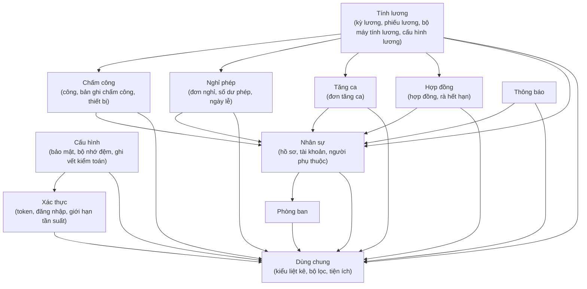

Hình 4.5: Biểu đồ phụ thuộc mô-đun phía backend

Ba điểm đáng chú ý: (i) mô-đun dùng chung không phụ thuộc bất kỳ mô-đun nào khác — điều kiện đủ để bảo đảm toàn hệ thống không có phụ thuộc vòng; (ii) mô-đun tính lương có mức lan tỏa cao nhất (phụ thuộc năm miền), phản ánh đúng bản chất nghiệp vụ: tính lương cần đọc tổng hợp dữ liệu hợp đồng, chấm công, nghỉ phép, tăng ca và thông tin nhân viên trong cùng một giao dịch; (iii) mô-đun xác thực chỉ phụ thuộc mô-đun dùng chung, bảo đảm cơ chế xác thực tách biệt hoàn toàn khỏi lô-gic nghiệp vụ — đổi chiến lược xác thực không kéo theo thay đổi ở bất kỳ miền nào.

Biểu đồ phụ thuộc mô-đun phía giao diện (Hình 4.6):

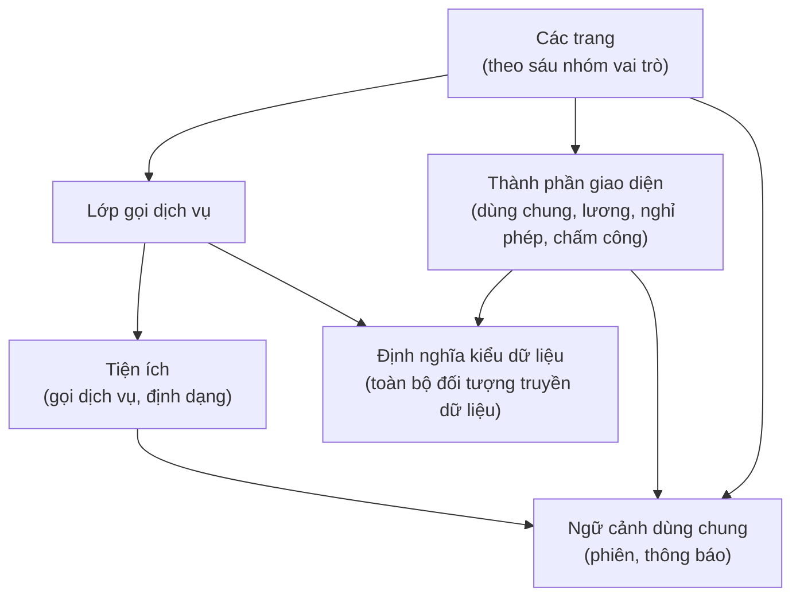

Hình 4.6: Biểu đồ phụ thuộc mô-đun phía giao diện

Nguyên tắc kiến trúc giao diện được thực thi qua cấu trúc mô-đun: (i) mọi lời gọi API phải đi qua lớp gọi dịch vụ — không thành phần nào gọi thẳng tới lớp truyền thông; (ii) toàn bộ định nghĩa kiểu dữ liệu tập trung một nơi làm nguồn sự thật duy nhất, tránh khai báo rải rác trong từng thành phần.

## 4.2 Thiết kế chi tiết

### 4.2.1 Thiết kế giao diện

Giao diện FaceZ HRMS được thiết kế theo nguyên tắc role-aware layout: mỗi vai trò thấy một bộ menu và trang khác nhau, nhưng chia sẻ cùng cấu trúc layout tổng thể gồm Sidebar (trái), Header (trên), và vùng nội dung chính.

Cấu trúc layout chung:

```
┌─────────────────────────────────────────────────────────────┐
│  THANH ĐẦU TRANG                                  [người ▼] │
├──────────────┬──────────────────────────────────────────────┤
│              │                                              │
│ THANH ĐIỀU   │           VÙNG NỘI DUNG CHÍNH               │
│ HƯỚNG        │                                              │
│  ▪ Tổng quan │  ┌──────────────────────────────────────┐   │
│  ▪ Mục 1     │  │  Tiêu đề trang + nút thao tác        │   │
│  ▪ Mục 2     │  ├──────────────────────────────────────┤   │
│  ▪ Mục 3     │  │  Thanh tìm kiếm / lọc                │   │
│              │  ├──────────────────────────────────────┤   │
│ [nhãn vai trò]│  │  Bảng dữ liệu có phân trang          │   │
│              │  └──────────────────────────────────────┘   │
└──────────────┴──────────────────────────────────────────────┘
```

Hình 4.7: Thiết kế trang đăng nhập

```
┌─────────────────────────────────────────────────────────────┐
│                                                             │
│              ┌─────────────────────────────┐               │
│              │         FaceZ HRMS          │               │
│              │  ─────────────────────────  │               │
│              │  Tên đăng nhập              │               │
│              │  [________________________] │               │
│              │                             │               │
│              │  Mật khẩu                   │               │
│              │  [________________________] │               │
│              │                             │               │
│              │  [    Đăng nhập    ]        │               │
│              │                             │               │
│              │  ⚠ Thông báo lỗi           │               │
│              └─────────────────────────────┘               │
│                                                             │
└─────────────────────────────────────────────────────────────┘
```

Trang đăng nhập hiển thị thông báo lỗi rõ ràng do backend trả về, ví dụ: "Tài khoản đã bị khóa tạm thời do đăng nhập sai quá 10 lần. Vui lòng thử lại sau 15 phút." Điều này cho phép người dùng phân biệt lỗi mật khẩu sai với lỗi tài khoản bị khóa.

Hình 4.8: Thiết kế bảng điều khiển của nhân viên

```
┌──────────────┬──────────────────────────────────────────────┐
│  FaceZ HRMS  │  Dashboard                                   │
│──────────────│──────────────────────────────────────────────│
│ ▪ Dashboard  │  ┌──────────────┐ ┌──────────────┐          │
│ ▪ Chấm công  │  │ Ngày làm     │ │ Nghỉ phép    │          │
│ ▪ Nghỉ phép  │  │ việc tháng   │ │ còn lại      │          │
│ ▪ Tăng ca    │  │  22/23 ngày  │ │   8 ngày     │          │
│ ▪ Phiếu lương│  └──────────────┘ └──────────────┘          │
│ ▪ Hồ sơ      │                                              │
│              │  Chấm công gần đây                           │
│              │  ┌────────────────────────────────────────┐  │
│              │  │ Ngày    │ Vào    │ Ra     │ Giờ làm    │  │
│              │  │ 03/06   │ 08:05  │ 17:32  │ 8.5h       │  │
│              │  │ 02/06   │ 08:10  │ 17:15  │ 7.9h       │  │
│              │  └────────────────────────────────────────┘  │
│  [Bách - EMP]│                                              │
└──────────────┴──────────────────────────────────────────────┘
```

Hình 4.9: Thiết kế bảng điều khiển của bộ phận nhân sự

HR Admin dashboard tổng hợp dữ liệu toàn công ty, bao gồm biểu đồ xu hướng chi phí lao động, tỷ lệ nghỉ phép theo phòng ban, trạng thái hợp đồng sắp hết hạn, và hàng đợi phê duyệt.

```
┌──────────────┬──────────────────────────────────────────────┐
│  FaceZ HRMS  │  Dashboard HR Admin                          │
│──────────────│──────────────────────────────────────────────│
│ ▪ Dashboard  │  ┌─────────────┐ ┌─────────────┐            │
│ ▪ Nhân viên  │  │ Tổng NV     │ │ Hợp đồng    │            │
│ ▪ Hợp đồng  │  │    245 người │ │ hết hạn <30 │            │
│ ▪ Chấm công  │  │             │ │  ngày: 12   │            │
│ ▪ Chốt kỳ    │  └─────────────┘ └─────────────┘            │
│ ▪ Bảng công  │                                              │
│ ▪ Ngày lễ    │  Chi phí lao động 6 tháng (BarChart)         │
│              │  ┌────────────────────────────────────────┐  │
│ ▪ Chốt kỳ    │  └─────────────┘ └─────────────┘            │
│ ▪ Bảng công  │                                              │
│ ▪ Ngày lễ    │  Chi phí lao động 6 tháng (BarChart)         │
│              │  ┌────────────────────────────────────────┐  │
│              │  │ ██  ██  ██  ██  ██  ██                 │  │
│              │  │ T1  T2  T3  T4  T5  T6                 │  │
│              │  └────────────────────────────────────────┘  │
│  [HR - HRAD] │                                              │
└──────────────┴──────────────────────────────────────────────┘
```

Hình 4.10: Thiết kế trang Quản lý nhân viên (bộ phận nhân sự)

```
┌──────────────────────────────────────────────────────────────┐
│  Quản lý nhân viên                          [+ Thêm NV]     │
│──────────────────────────────────────────────────────────────│
│  Tìm kiếm: [_________________]  Phòng ban: [Tất cả ▼]       │
│──────────────────────────────────────────────────────────────│
│  Mã NV   │ Họ tên          │ Phòng ban  │ Trạng thái│ Hành động│
│──────────┼─────────────────┼────────────┼───────────┼─────────│
│ EMP-001  │ Nguyễn Văn A    │ Engineering│ Đang làm  │ ✏️ 🗑️  │
│ EMP-002  │ Trần Thị B      │ HR         │ Đang làm  │ ✏️ 🗑️  │
│ EMP-003  │ Lê Minh C       │ Finance    │ Nghỉ phép │ ✏️ 🗑️  │
│──────────────────────────────────────────────────────────────│
│                  [< Trước]  Trang 1/10  [Tiếp >]            │
└──────────────────────────────────────────────────────────────┘
```

Hình 4.11: Thiết kế trang Quản lý nghỉ phép (nhân viên)

```
┌──────────────────────────────────────────────────────────────┐
│  Nghỉ phép của tôi                          [+ Tạo đơn]     │
│──────────────────────────────────────────────────────────────│
│  Phép năm: 8/12 ngày còn lại  │  Phép ốm: 3/5 ngày còn lại │
│──────────────────────────────────────────────────────────────│
│  Loại phép  │ Từ ngày  │ Đến ngày │ Số ngày │ Trạng thái   │
│─────────────┼──────────┼──────────┼─────────┼──────────────│
│ Phép năm    │ 10/06    │ 12/06    │ 3       │ 🟡 Chờ duyệt │
│ Phép ốm     │ 01/05    │ 02/05    │ 2       │ ✅ Đã duyệt  │
│─────────────────────────────────────────────────────────────│
│                  [< Trước]  Trang 1/3  [Tiếp >]             │
└──────────────────────────────────────────────────────────────┘
```

Hình 4.12: Thiết kế cửa sổ tạo đơn nghỉ phép

```
┌─────────────────────────────────────────────────────────────┐
│  Tạo đơn nghỉ phép                                    [×]  │
│─────────────────────────────────────────────────────────────│
│                                                             │
│  Loại nghỉ phép *                                           │
│  [Phép năm (ANNUAL)                    ▼]                   │
│                                                             │
│  Từ ngày *           Đến ngày *                             │
│  [10/06/2026  📅]    [12/06/2026  📅]                       │
│                                                             │
│  Lý do *                                                    │
│  [Du lịch gia đình                                      ]   │
│                                                             │
│  Số ngày: 3 ngày (Phép còn lại: 8 ngày)                    │
│                                                             │
│  [     Hủy     ]              [  Gửi yêu cầu  ]            │
└─────────────────────────────────────────────────────────────┘
```

Hình 4.13: Thiết kế trang Phê duyệt yêu cầu (trưởng nhóm/quản lý)

```
┌──────────────────────────────────────────────────────────────┐
│  Phê duyệt yêu cầu                                          │
│──────────────────────────────────────────────────────────────│
│  [Thẻ: Nghỉ phép]  [Thẻ: Tăng ca]                           │
│──────────────────────────────────────────────────────────────│
│  Nhân viên    │ Loại    │ Từ–Đến          │ Trạng thái │ TĐ │
│───────────────┼─────────┼─────────────────┼────────────┼────│
│ Nguyễn Văn A │ Phép năm│ 10/06 – 12/06   │ Chờ duyệt  │✅❌│
│ Trần Thị B   │ Phép ốm │ 15/06 – 15/06   │ Chờ duyệt  │✅❌│
└──────────────────────────────────────────────────────────────┘
```

Hình 4.14: Thiết kế trang Kỳ lương (phụ trách tài chính)

```
┌──────────────────────────────────────────────────────────────┐
│  Kỳ lương 06/2026  (trạng thái: Nháp)        [+ Tạo kỳ lương]│
│──────────────────────────────────────────────────────────────│
│  Trạng thái: Nháp     [Tính lại cả kỳ] [Trình duyệt]        │
│──────────────────────────────────────────────────────────────│
│  Nhân viên     │ Lương gộp    │ Thực nhận    │ Dòng         │
│────────────────┼──────────────┼──────────────┼──────────────│
│ Nguyễn Văn A  │ 25.000.000 ₫ │ 21.500.000 ₫ │ [Tính lại][⊘]│
│ Trần Thị B    │ 18.000.000 ₫ │ 15.800.000 ₫ │ 🔒 đã khóa   │
│──────────────────────────────────────────────────────────────│
│  Trình duyệt bị chặn nếu còn nhân viên thiếu điểm HS1        │
└──────────────────────────────────────────────────────────────┘
```

Toàn bộ một kỳ lương được gói trong một thực thể kỳ lương bền vững, đi qua chuỗi trạng thái Nháp → Chờ duyệt → Đã duyệt → Đã trả. Người phụ trách tài chính có thể *tính lại một dòng* (khóa dòng đó thành ngoại lệ), *tính lại cả kỳ* (giữ nguyên các dòng đã khóa), hoặc *loại một dòng* khỏi kỳ. Nút trình duyệt bị chặn nếu còn nhân viên chưa được chấm điểm hệ số thi đua. Giám đốc phê duyệt hoặc trả lại kỳ về trạng thái nháp; sau khi chi trả, người phụ trách tài chính đánh dấu đã trả.

Hình 4.15: Thiết kế trang Quản trị tài khoản (quản trị hệ thống)

```
┌──────────────────────────────────────────────────────────────┐
│  Quản trị tài khoản                          [+ Tạo tài khoản]│
│──────────────────────────────────────────────────────────────│
│  Tài khoản  │ Vai trò       │ NV gắn kết │ Trạng thái │ T.tác │
│─────────────┼───────────────┼────────────┼────────────┼───────│
│ admin       │ Quản trị HT   │ (không)    │ Hoạt động  │ 🔑 🔒 │
│ b.tran      │ Nhân sự       │ EMP-002    │ Hoạt động  │ 🔑 🔒 │
│ c.le        │ Tài chính     │ EMP-003    │ Bị khóa    │ 🔑 🔓 │
└──────────────────────────────────────────────────────────────┘
```

Quản trị hệ thống là một tài khoản đặc biệt, **không phải nhân viên thật**: nó không có hồ sơ nhân sự, không có mục "Cá nhân" trên thanh điều hướng, và chỉ thực hiện các tác vụ kỹ thuật — quản trị tài khoản (tạo, gán vai trò, khóa, đặt lại mật khẩu), quản lý thiết bị chấm công, và xem nhật ký chấm công (chỉ đọc). Việc chuyển quản lý thiết bị và nhật ký chấm công từ bộ phận nhân sự sang quản trị hệ thống tách bạch quản trị kỹ thuật khỏi nghiệp vụ nhân sự, đồng thời giữ cho quản trị hệ thống nằm ngoài mọi luồng phê duyệt nghiệp vụ và tài chính.

### 4.2.2 Thiết kế lớp

Thiết kế domain model backend tập trung vào các entity chính và quan hệ giữa chúng. Dưới đây là sơ đồ lớp rút gọn cho các domain cốt lõi.

Hình 4.16: Sơ đồ lớp miền Nhân sự và Hợp đồng

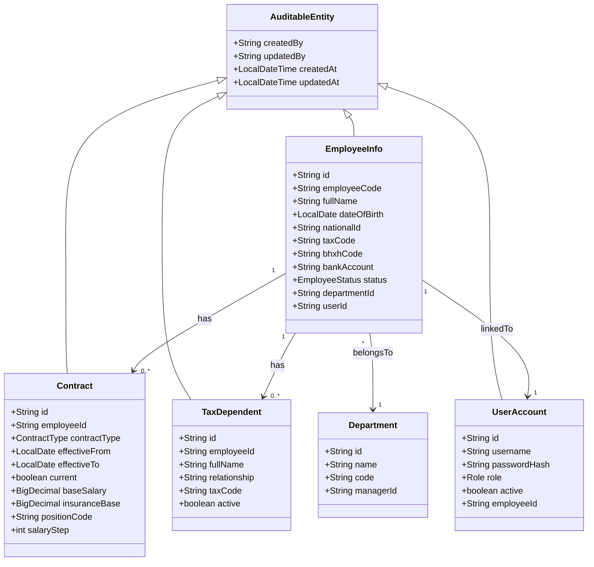

Hình 4.17: Sơ đồ lớp miền Chấm công (bản ghi chấm công → ngày công → bảng công)

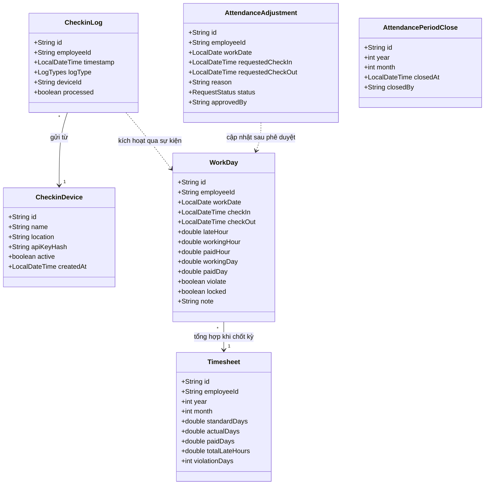

Hình 4.18: Sơ đồ lớp miền Nghỉ phép, Tăng ca và Số dư phép

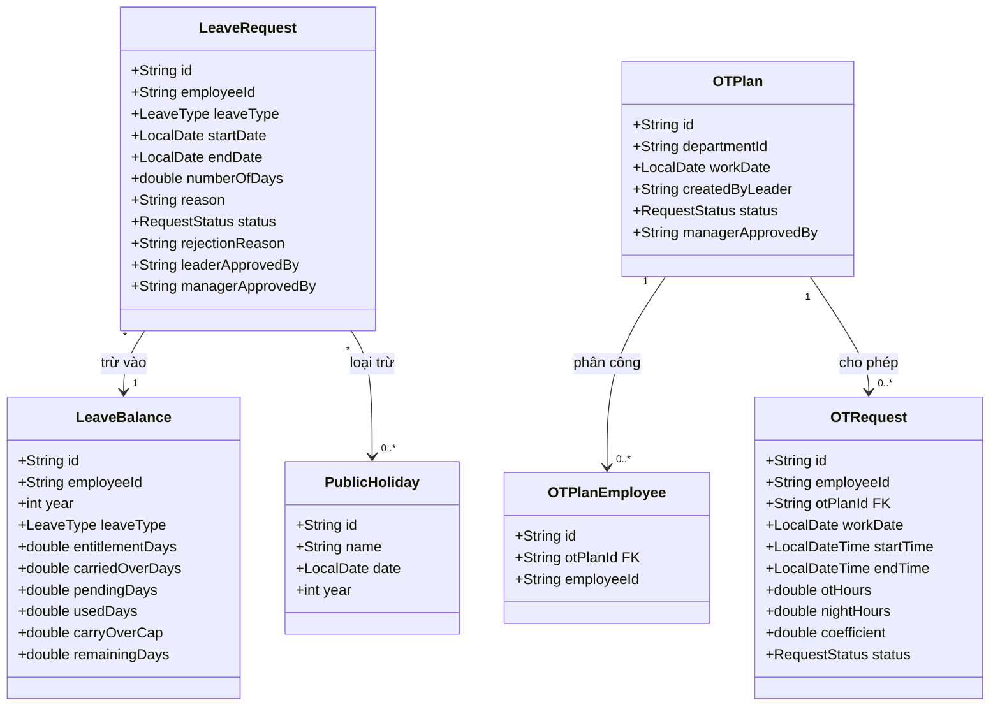

Hình 4.19: Sơ đồ lớp miền Tính lương

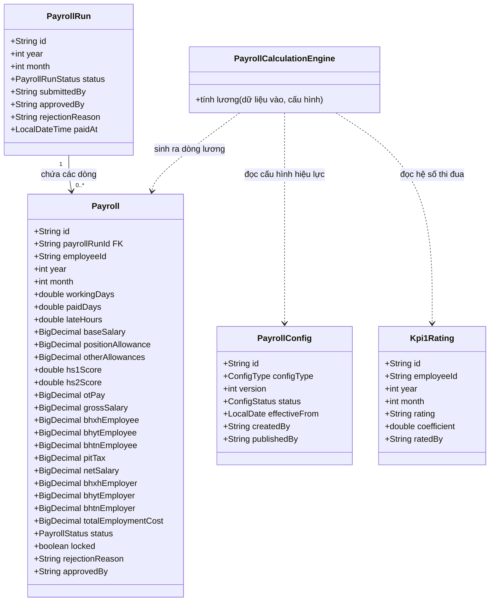

Thực thể cấu hình lương đại diện cho bốn nhóm bảng cấu hình có kiểu, hiệu lực theo ngày và chỉ thêm mới (bậc lương, phụ cấp, thuế thu nhập cá nhân, bảo hiểm), đi qua vòng đời nháp → đã ban hành → đã lưu trữ. Kỳ lương là thực thể bền vững; mỗi dòng phiếu lương trỏ về một kỳ lương và mang một cờ khóa đánh dấu dòng đã được tính lại thủ công — một ngoại lệ không bị thao tác "tính lại cả kỳ" ghi đè.

Về phía giao diện, cây thành phần được tổ chức phân cấp từ trên xuống. Ở gốc là hai ngữ cảnh dùng chung — trạng thái phiên đăng nhập và trạng thái thông báo — bao bọc toàn bộ ứng dụng. Bên dưới là bố cục gốc, rồi tới lớp bảo vệ kiểm tra vai trò và chuyển hướng khi cần. Mỗi trang gồm thanh điều hướng (menu thay đổi theo vai trò), thanh đầu trang (thông tin người dùng, đăng xuất) và vùng nội dung tuân theo mô hình tách ba tệp đã nêu ở Mục 3.5. Ngoài ra, một bộ thành phần dùng chung — cửa sổ nổi, hộp xác nhận, thanh phân trang, trạng thái rỗng, biểu tượng chờ, hộp nhập lý do từ chối — được tái sử dụng xuyên suốt.

Lớp gọi dịch vụ được tách thành nhiều mô-đun theo từng miền nghiệp vụ: xác thực, nhân sự, chấm công, đơn bổ sung chấm công, nghỉ phép, tăng ca, hợp đồng, phiếu lương, kỳ lương, chấm hệ số thi đua, phòng ban, thông báo, quản trị tài khoản và cấu hình lương. Mỗi mô-đun xuất các hàm bất đồng bộ gọi tới lớp truyền thông tập trung và trả về phản hồi đã được bao bọc theo khuôn dạng thống nhất, nhờ vậy mọi xử lý lỗi đều tuân theo cùng một khuôn mẫu chuẩn.

Để minh họa luồng truyền thông điệp giữa các đối tượng, dưới đây là biểu đồ trình tự cho hai ca sử dụng quan trọng nhất:

Biểu đồ trình tự — Tính lương một nhân viên (Hình 4.20):

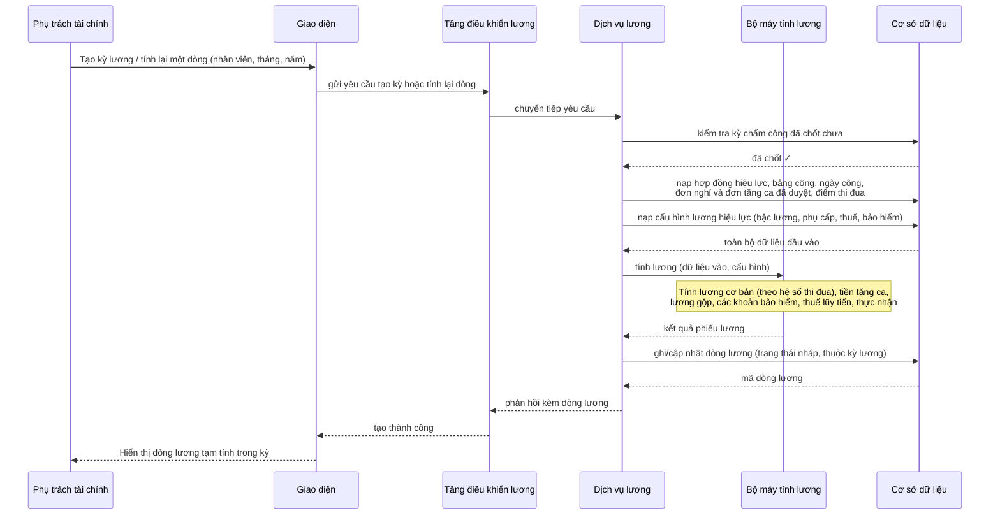

Hình 4.20: Biểu đồ trình tự tính lương một nhân viên

Biểu đồ trình tự — Phê duyệt nghỉ phép đa cấp (Hình 4.21):

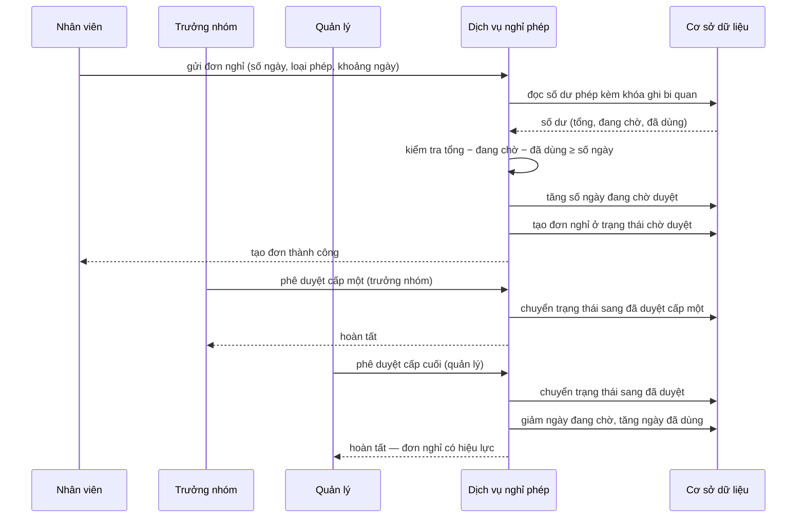

Hình 4.21: Biểu đồ trình tự phê duyệt nghỉ phép đa cấp

### 4.2.3 Thiết kế cơ sở dữ liệu

Hình 4.22: Sơ đồ thực thể quan hệ

```mermaid
erDiagram
    EMPLOYEE_INFO {
        varchar id PK
        varchar employee_code UK
        varchar full_name
        date date_of_birth
        varchar national_id UK
        varchar tax_code UK
        varchar bhxh_code UK
        varchar bank_account
        varchar status
        varchar department_id FK
        varchar user_id FK
        boolean delete_flag
    }
    USER_ACCOUNT {
        varchar id PK
        varchar username UK
        varchar password_hash
        varchar role
        boolean active
        varchar employee_id FK
    }
    DEPARTMENT {
        varchar id PK
        varchar name
        varchar code UK
        varchar manager_id FK
    }
    CONTRACT {
        varchar id PK
        varchar employee_id FK
        varchar contract_type
        date effective_from
        date effective_to
        boolean current
        decimal base_salary
        decimal insurance_base
        varchar position_code
        int salary_step
        varchar document_key
        boolean delete_flag
    }
    TAX_DEPENDENT {
        varchar id PK
        varchar employee_id FK
        varchar full_name
        varchar relationship
        varchar tax_code
        boolean active
    }
    WORKDAY {
        varchar id PK
        varchar employee_id FK
        date work_date
        timestamp check_in
        timestamp check_out
        float late_hour
        float working_hour
        float paid_hour
        float paid_day
        boolean violate
        boolean locked
        varchar note
    }
    TIMESHEET {
        varchar id PK
        varchar employee_id FK
        int year
        int month
        float standard_days
        float actual_days
        float paid_days
        float total_late_hours
        int violation_days
    }
    ATTENDANCE_ADJUSTMENT {
        varchar id PK
        varchar employee_id FK
        date work_date
        timestamp requested_check_in
        timestamp requested_check_out
        varchar reason
        varchar status
        varchar approved_by
    }
    TIMESHEET {
        varchar id PK
        varchar employee_id FK
        int year
        int month
        float standard_days
        float actual_days
        float paid_days
        float total_late_hours
        int violation_days
    }
    ATTENDANCE_ADJUSTMENT {
        varchar id PK
        varchar employee_id FK
        date work_date
        timestamp requested_check_in
        timestamp requested_check_out
        varchar reason
        varchar status
        varchar approved_by
    }
    CHECKIN_LOG {
        varchar id PK
        varchar employee_id FK
        timestamp log_time
        varchar log_type
        varchar device_id FK
        boolean processed
    }
    CHECKIN_DEVICE {
        varchar id PK
        varchar name
        varchar location
        varchar api_key_hash
        boolean active
        timestamp created_at
    }
    ATTENDANCE_PERIOD_CLOSE {
        varchar id PK
        int year
        int month
        timestamp closed_at
        varchar closed_by
    }
    LEAVE_REQUEST {
        varchar id PK
        varchar employee_id FK
        varchar leave_type
        date start_date
        date end_date
        float number_of_days
        varchar reason
        varchar status
        varchar rejection_reason
    }
    LEAVE_BALANCE {
        varchar id PK
        varchar employee_id FK
        int year
        varchar leave_type
        float entitlement_days
        float carried_over_days
        float pending_days
        float used_days
        float carry_over_cap
    }
    PUBLIC_HOLIDAY {
        varchar id PK
        varchar name
        date holiday_date
        int year
    }
    OT_PLAN {
        varchar id PK
        varchar department_id FK
        date work_date
        varchar created_by_leader
        varchar status
        varchar manager_approved_by
    }
    OT_PLAN_EMPLOYEE {
        varchar id PK
        varchar ot_plan_id FK
        varchar employee_id FK
    }
    OT_PLAN {
        varchar id PK
        varchar department_id FK
        date work_date
        varchar created_by_leader
        varchar status
        varchar manager_approved_by
    }
    OT_PLAN_EMPLOYEE {
        varchar id PK
        varchar ot_plan_id FK
        varchar employee_id FK
    }
    OT_REQUEST {
        varchar id PK
        varchar employee_id FK
        varchar ot_plan_id FK
        timestamp start_time
        timestamp end_time
        float duration_hours
        varchar ot_type
        float coefficient
        varchar reason
        varchar status
        float weekday_hours
        float weekend_hours
        float holiday_hours
        float night_hours
    }
    KPI1_RATING {
        varchar id PK
        varchar employee_id FK
        int year
        int month
        varchar rating
        float coefficient
        varchar rated_by
    }
    PAYROLL_RUN {
        varchar id PK
        int year
        int month
        varchar status
        varchar submitted_by
        varchar approved_by
        varchar rejection_reason
        timestamp paid_at
    }
    KPI1_RATING {
        varchar id PK
        varchar employee_id FK
        int year
        int month
        varchar rating
        float coefficient
        varchar rated_by
    }
    PAYROLL_RUN {
        varchar id PK
        int year
        int month
        varchar status
        varchar submitted_by
        varchar approved_by
        varchar rejection_reason
        timestamp paid_at
    }
    PAYROLL {
        varchar id PK
        varchar payroll_run_id FK
        varchar employee_id FK
        int year
        int month
        float working_days
        float paid_days
        float hs1_score
        float hs2_score
        float hs1_score
        float hs2_score
        decimal base_salary
        decimal position_allowance
        decimal ot_pay
        decimal position_allowance
        decimal ot_pay
        decimal gross_salary
        decimal bhxh_employee
        decimal bhyt_employee
        decimal bhtn_employee
        decimal pit_tax
        decimal net_salary
        decimal total_employment_cost
        varchar status
        boolean locked
        varchar rejection_reason
    }
    PAYROLL_CONFIG {
        varchar id PK
        varchar config_type
        int version
        varchar status
        int version
        varchar status
        date effective_from
        varchar created_by
        varchar published_by
        varchar created_by
        varchar published_by
    }
    NOTIFICATION {
        varchar id PK
        varchar recipient_id FK
        varchar title
        text content
        varchar type
        boolean is_read
        timestamp read_at
    }

    EMPLOYEE_INFO ||--o{ CONTRACT : "has history"
    EMPLOYEE_INFO ||--o{ TAX_DEPENDENT : "has"
    EMPLOYEE_INFO }o--|| DEPARTMENT : "belongs to"
    EMPLOYEE_INFO ||--|| USER_ACCOUNT : "linked to"
    EMPLOYEE_INFO ||--o{ WORKDAY : "has"
    EMPLOYEE_INFO ||--o{ TIMESHEET : "aggregated into"
    EMPLOYEE_INFO ||--o{ ATTENDANCE_ADJUSTMENT : "requests"
    EMPLOYEE_INFO ||--o{ WORKDAY : "has"
    EMPLOYEE_INFO ||--o{ TIMESHEET : "aggregated into"
    EMPLOYEE_INFO ||--o{ ATTENDANCE_ADJUSTMENT : "requests"
    EMPLOYEE_INFO ||--o{ CHECKIN_LOG : "generates"
    EMPLOYEE_INFO ||--o{ LEAVE_REQUEST : "submits"
    EMPLOYEE_INFO ||--o{ LEAVE_BALANCE : "has"
    EMPLOYEE_INFO ||--o{ OT_REQUEST : "submits"
    EMPLOYEE_INFO ||--o{ KPI1_RATING : "rated by superior"
    EMPLOYEE_INFO ||--o{ PAYROLL : "has"
    EMPLOYEE_INFO ||--o{ NOTIFICATION : "receives"
    WORKDAY }o--o| TIMESHEET : "rolled up into"
    ATTENDANCE_ADJUSTMENT }o--|| WORKDAY : "amends"
    WORKDAY }o--o| TIMESHEET : "rolled up into"
    ATTENDANCE_ADJUSTMENT }o--|| WORKDAY : "amends"
    CHECKIN_LOG }o--|| CHECKIN_DEVICE : "from"
    OT_PLAN ||--o{ OT_PLAN_EMPLOYEE : "assigns"
    OT_PLAN ||--o{ OT_REQUEST : "authorizes"
    DEPARTMENT ||--o{ OT_PLAN : "for"
    PAYROLL_RUN ||--o{ PAYROLL : "contains lines"
    OT_PLAN ||--o{ OT_PLAN_EMPLOYEE : "assigns"
    OT_PLAN ||--o{ OT_REQUEST : "authorizes"
    DEPARTMENT ||--o{ OT_PLAN : "for"
    PAYROLL_RUN ||--o{ PAYROLL : "contains lines"
    DEPARTMENT }o--o| EMPLOYEE_INFO : "managed by"
```

Bảng 4.2: Các quyết định thiết kế cơ sở dữ liệu quan trọng

| Quyết định | Lý do | Cách hiện thực |
|---|---|---|
| Mọi khóa chính là chuỗi định danh duy nhất toàn cục | Tránh lộ thông tin nhạy cảm qua đường dẫn (không đoán được như số tuần tự), dễ hợp nhất dữ liệu từ nhiều nguồn | Sinh giá trị định danh tại tầng dịch vụ |
| Hợp đồng theo mô hình lịch sử | Cần lưu trọn lịch sử thay đổi lương và điều khoản để tính lương đúng theo từng tháng | Lưu ngày bắt đầu/kết thúc hiệu lực và cờ "đang hiệu lực"; chỉ mục duy nhất có điều kiện chỉ áp cho bản đang hiệu lực |
| Cấu hình lương: bảng có kiểu, hiệu lực theo ngày, chỉ thêm mới | Bản đã ban hành phải bất biến để truy vết; mỗi kỳ lương chọn đúng phiên bản theo ngày hiệu lực; giữ kiểm soát kiểu dữ liệu | Bốn nhóm cấu hình kèm số phiên bản, trạng thái và ngày hiệu lực; quy trình người soạn — người duyệt |
| Xóa mềm | Dữ liệu nhân sự, tài chính không được xóa vật lý để bảo đảm vết kiểm toán | Cờ đánh dấu đã xóa kèm thời điểm xóa trên mọi thực thể; truy vấn tự động lọc bỏ bản đã xóa |
| Số dư phép trừ hai giai đoạn | Phòng đặt trùng khi nhiều đơn chờ duyệt đồng thời | Ngày đang chờ tăng khi gửi đơn, giảm khi duyệt/từ chối; ngày đã dùng tăng khi duyệt |
| Ngày công duy nhất theo từng nhân viên mỗi ngày | Mỗi nhân viên chỉ có một bản ghi công mỗi ngày — nguồn sự thật duy nhất; cuối kỳ gộp thành bảng công | Ràng buộc duy nhất theo cặp nhân viên–ngày; cờ khóa khi đã chốt kỳ |
| Kỳ lương chứa các dòng phiếu lương | Gói cả kỳ lương vào một thực thể có vòng đời (nháp → chờ duyệt → đã duyệt → đã trả); hỗ trợ tính lại một dòng/cả kỳ và loại dòng | Mỗi dòng phiếu lương tham chiếu tới kỳ lương; cờ khóa cho dòng tính lại thủ công |
| Tổng hợp tăng ca theo tháng bằng khung nhìn | Kiểm tra hạn mức tăng ca cần tổng hợp theo tháng/năm mỗi lần gửi đơn | Định nghĩa khung nhìn cơ sở dữ liệu để tái dùng lô-gic tổng hợp |

Bảng 4.3: Danh sách phiên bản lược đồ cơ sở dữ liệu

| Migration | Nội dung |
|---|---|
| V1 | Baseline schema: employee_info, user_account, department, contract, attendance |
| V2 | Thêm audit columns (created_by, updated_by, created_at, updated_at) cho tất cả entity |
| V3 | Thêm checkin_log, checkin_device, thêm cột processed cho checkin_log |
| V4 | Thêm leave_request, leave_balance, public_holiday |
| V5 | Thêm ot_request, ot_monthly_summary view |
| V6 | Thêm payroll table với đầy đủ trường tính lương |
| V7 | Thêm system_config với JSONB configData |
| V8 | Thêm notification table |
| V9 | Thêm tax_dependent, cột national_id, tax_code, bhxh_code, bank_account vào employee_info |
| V10 | Thêm cột employer-side insurance (bhxh_employer, bhyt_employer, bhtn_employer, total_employment_cost) vào payroll |
| V11 | Thêm attendance_period_close table |
| V12 | Migrate contract dates từ VARCHAR sang LocalDate (effectiveFrom, effectiveTo) |
| V13 | Thêm FINANCE_ADMIN, DIRECTOR vào role enum; thêm rejection_reason vào payroll |
| V14 | Thêm partial unique index trên contract WHERE current = true |
| V15 | Thêm profile_picture_url vào employee_info |
| V16 | Thêm ot_type, weekday_hours, weekend_hours, holiday_hours, night_hours vào ot_request |
| V17 | Thêm approved_by vào payroll; thêm read_at vào notification |
| V18 | Thêm WORK_SCHEDULE config type vào system_config |
| V19 | Thêm carry_over_cap vào leave_balance; thêm delete_flag, deleted_at cho remaining entities |
| V20 | Tách attendance thành workday (per-employee-per-day) và timesheet (tổng hợp tháng) |
| V21 | Thêm attendance_adjustment (đơn bổ sung chấm công, Leader/Manager cùng phòng duyệt) |
| V22 | Thêm ot_plan, ot_plan_employee; thêm ot_plan_id và coefficient vào ot_request |
| V23 | Thêm document_key vào contract (tham chiếu tài liệu hợp đồng PDF lưu trên MinIO) |
| V24 | Thêm created_at cho checkin_device; chuyển quản lý device & checkin_log sang SYSTEM_ADMIN |
| V25 | Thêm cột locked vào workday; suy Nt từ timesheet (bỏ trường nhập tay) |
| V26 | Đổi kpi1_score/kpi2_score → hs1_score/hs2_score; thêm position_allowance, ot_pay vào payroll |
| V27 | Thêm payroll_config — bảng cấu hình lương có kiểu, hiệu lực-theo-ngày, append-only (thay system_config JSONB cho lương) |
| V28 | Thêm kpi1_rating (điểm HS1 do cấp trên chấm theo tháng) |
| V29 | Thêm payroll_run; thêm payroll_run_id, locked vào payroll |
| V30 | Thêm cột giờ OT theo loại (ot_weekday/weekend/holiday/night_hours) vào payroll cho phiếu lương |

## 4.3 Xây dựng ứng dụng

### 4.3.1 Thư viện và công cụ sử dụng

Bảng 4.4: Thư viện backend (facez/pom.xml)

| Thư viện | Phiên bản | Mục đích |
|---|---|---|
| Spring Boot | 4.0.0-M3 | Application framework, auto-configuration |
| Spring Security | 6.4.x (via Boot) | Filter chain, method-level security |
| Spring Data JPA | 3.4.x (via Boot) | ORM, auditing, repository abstraction |
| Spring Web MVC | 6.2.x (via Boot) | REST controllers, request mapping |
| Spring Scheduling | Included in Boot | Cron-based scheduled tasks |
| Spring Events | Included in Core | Decoupled event publish/subscribe |
| Hibernate 6 | via Spring Data JPA | JPA provider, JPQL execution |
| PostgreSQL JDBC | 42.7.x | Database driver |
| Spring Data Redis | 3.4.x (via Boot) | Redis template, connection factory |
| Lettuce | via Spring Data Redis | Redis client (reactive-capable) |
| JJWT (io.jsonwebtoken) | 0.12.x | JWT create, parse, validate |
| SpringDoc OpenAPI | 2.6.x | Swagger UI, OpenAPI spec generation |
| Lombok | 1.18.x | Giảm mã lặp (tự sinh phương thức truy cập, hàm dựng đối tượng…) |
| MapStruct | 1.6.x | DTO ↔ Entity mapping |
| Spring Boot Actuator | via Boot | Health check, metrics endpoints |
| Logback | via Boot | Structured JSON logging |

Bảng 4.5: Thư viện frontend (facez-front/package.json)

| Thư viện | Phiên bản | Mục đích |
|---|---|---|
| Next.js | 15.3.x | React framework, App Router, SSR/CSR |
| React | 19.0.x | UI component library |
| TypeScript | 5.x | Static typing |
| Tailwind CSS | 3.4.x | Utility-first CSS framework |
| Recharts | 2.x | Declarative React charting (dashboard) |
| date-fns | 3.x | Date formatting and manipulation |
| ESLint | 9.x | Code linting |
| Turbopack | via Next.js 15 | Fast dev bundler |

Bảng 4.6: Công cụ phát triển và triển khai

| Công cụ | Phiên bản | Mục đích |
|---|---|---|
| Java | 21 LTS | Backend runtime |
| Maven Wrapper | 3.9.x | Build tool (./mvnw) |
| Node.js | 20 LTS | Frontend runtime |
| npm | 10.x | Package manager |
| Docker Desktop | 4.x | Container runtime |
| Docker Compose | 2.x | Multi-container orchestration |
| PostgreSQL (Docker) | 15.4 | Primary database |
| Redis (Docker) | 7.2-alpine | Cache và session store |
| pgAdmin 4 (Docker) | Latest | Database GUI (dev) |

### 4.3.2 Kết quả đạt được

Sau quá trình xây dựng, FaceZ HRMS đạt được các chỉ số kỹ thuật sau:

Bảng 4.7: Thống kê kỹ thuật dự án

| Chỉ số | Giá trị |
|---|---|
| Backend | |
| Số REST endpoint | > 80 endpoint |
| Số script SQL migration | 31 file (V1–V30) + final_schema.sql hợp nhất |
| Số domain module | 10 (employee, department, attendance, leave, otrequest, contract, payroll, payrollconfig, notification, auth) |
| Số REST endpoint | > 80 endpoint |
| Số script SQL migration | 31 file (V1–V30) + final_schema.sql hợp nhất |
| Số domain module | 10 (employee, department, attendance, leave, otrequest, contract, payroll, payrollconfig, notification, auth) |
| Số scheduled job | 3 (attendance midnight, payroll monthly, contract expiry monthly) |
| Độ phủ test | Unit test cho PayrollCalculationEngine; Integration test cho auth flow |
| Frontend | |
| Số route (page) | > 25 trang |
| Số vai trò được hỗ trợ | 7 (EMPLOYEE, LEADER, MANAGER, HR_ADMIN, FINANCE_ADMIN, DIRECTOR, SYSTEM_ADMIN) |
| Số loại dashboard | 4 (Employee, Manager, HR Admin, System Admin) |
| Số loại báo cáo tài chính | 3 (Labour Cost, Insurance Remittance, PIT Summary) |
| Cơ sở dữ liệu | |
| Số bảng chính | 17 bảng |
| Số database view | 1 (ot_monthly_summary) |
| Số partial unique index | 1 (contract WHERE current = true) |
| Cột JSONB | 1 (system_config.config_data) |

Bảng 4.8: Mức độ hoàn thành theo yêu cầu chức năng

| Nhóm chức năng | Yêu cầu | Hoàn thành | Ghi chú |
|---|:---:|:---:|---|
| Xác thực & Phân quyền | 8 | 8 | JWT, refresh token, rate limiting, device key |
| Quản lý nhân viên | 10 | 9 | Thiếu: xác nhận hợp đồng điện tử |
| Quản lý phòng ban | 4 | 4 | CRUD đầy đủ |
| Chấm công tự động | 7 | 7 | Pipeline, period close, public holidays |
| Nghỉ phép & Số dư | 8 | 7 | Thiếu: kiểm tra trùng ngày |
| Tăng ca & Giới hạn | 6 | 6 | OT limits, night rate, holiday rate |
| Hợp đồng & Lịch sử | 6 | 6 | History model, expiry alerts |
| Tính lương | 9 | 9 | Công thức đầy đủ, batch processing |
| Phê duyệt lương | 4 | 4 | Workflow DIRECTOR, reject reason |
| Báo cáo tài chính | 3 | 3 | Labour cost, insurance, PIT + CSV export |
| Thông báo | 4 | 4 | Event-driven, read/unread, inbox |
| Cấu hình hệ thống | 4 | 4 | SALARY_GRADE, ALLOWANCE, PIT, INSURANCE |
| Tổng cộng | 73 | 71 | 97% hoàn thành |

### 4.3.3 Minh họa các chức năng chính

Chức năng 1: Quy trình chấm công tự động

Khi thiết bị nhận diện khuôn mặt gửi một sự kiện chấm công kèm khóa API thiết bị, hệ thống xử lý hoàn toàn tự động, không cần can thiệp thủ công. Trước hết, bước xác thực thiết bị đối chiếu khóa API (so khớp dạng băm đã lưu) để xác nhận nguồn gửi hợp lệ. Tiếp theo, dịch vụ ghi nhận chấm công lưu bản ghi thô rồi phát ra một sự kiện nội bộ; dịch vụ tổng hợp công lắng nghe sự kiện này để tạo hoặc cập nhật bản ghi công trong ngày. Ví dụ, một lượt chấm vào lúc 08:05 (giờ chuẩn bắt đầu là 08:00) được ghi nhận đến muộn 5 phút và đánh dấu cờ vi phạm. Khi nhân viên chấm ra, hệ thống hoàn tất bản ghi: giờ làm bằng khoảng thời gian từ lúc vào đến lúc ra (trừ giờ nghỉ trưa nếu có cấu hình), giờ được trả lương lấy tối đa một ngày công chuẩn (tám giờ), và số ngày công quy đổi theo tỷ lệ tương ứng.

Chức năng 2: Luồng phê duyệt nghỉ phép hai cấp

Vòng đời một đơn nghỉ phép trải qua các bước sau (sơ đồ trình tự ở Hình 4.21). Bước một, nhân viên tạo đơn ở trạng thái nháp — có thể sửa hoặc hủy, chưa khóa số dư. Bước hai, nhân viên gửi đơn đi duyệt: số ngày đang chờ duyệt được cộng ngay vào số dư để tránh đặt trùng, đồng thời một thông báo được gửi tới trưởng nhóm. Bước ba, trưởng nhóm phê duyệt cấp một, hệ thống thông báo tiếp cho quản lý. Bước bốn, quản lý phê duyệt cấp cuối: số ngày đang chờ được chuyển thành ngày đã dùng, và mỗi ngày nghỉ được ghi nhận thành một bản ghi công loại nghỉ phép. Nếu đơn bị từ chối ở bất kỳ cấp nào, số ngày đã tạm khóa được hoàn trả lại vào số dư.

Chức năng 3: Tính lương và phê duyệt

Bảng dưới đây minh họa quá trình tính lương tháng cho một nhân viên, áp dụng đúng công thức đã trình bày, với các dữ liệu đầu vào được đọc sau khi kỳ chấm công đã chốt:

```
Dữ liệu đầu vào:
  Lương hiệu quả theo hợp đồng    = 35.000.000 đ
  Phụ cấp chức vụ                  = 1.500.000 đ
  Phụ cấp khác                     = 800.000 đ
  Số ngày công chuẩn của tháng     = 22 ngày
  Số ngày công thực tế             = 20 ngày
  Hệ số thi đua cấp trên chấm      = 1,04 (loại A)
  Hệ số thi đua từ chấm công       = 1,00 (dưới 5 ngày vi phạm)
  Giờ tăng ca ngày thường          = 8 giờ
  Giờ tăng ca cuối tuần            = 4 giờ

Tính toán:
  Hệ số thi đua trung bình = (1,04 + 1,00) / 2 = 1,02
  Lương cơ bản kỳ = (35.000.000 × 1,02 + 1.500.000 + 800.000) × (20/22)
                  = 38.000.000 × 0,909 = 34.545.455 đ

  Tiền tăng ca = 8 × (35.000.000/22/8) × 1,5   (ngày thường, hệ số 1,5)
               + 4 × (35.000.000/22/8) × 2,0   (cuối tuần, hệ số 2,0)
               = 2.386.364 + 1.590.909 = 3.977.273 đ

  Lương gộp = 34.545.455 + 3.977.273 = 38.522.728 đ

  Nền tính bảo hiểm (giới hạn 46,8 triệu) = 35.000.000 đ
  Bảo hiểm xã hội (8%)    = 2.800.000 đ
  Bảo hiểm y tế (1,5%)    = 525.000 đ
  Bảo hiểm thất nghiệp(1%)= 350.000 đ
  Tổng bảo hiểm           = 3.675.000 đ

  Thu nhập tính thuế = 38.522.728 − 3.675.000 − 15.500.000 (giảm trừ bản thân)
                     − 6.200.000 (một người phụ thuộc) = 13.147.728 đ

  Thuế thu nhập cá nhân (lũy tiến: ≤5tr ×5%; 5–10tr ×10%; phần còn lại ×15%)
                     = 250.000 + 500.000 + 472.159 = 1.222.159 đ

  Lương thực nhận = 38.522.728 − 3.675.000 − 1.222.159 = 33.625.569 đ
```

Sau khi người phụ trách tài chính kiểm tra và gửi duyệt, giám đốc xem bảng tổng hợp toàn bộ nhân viên rồi phê duyệt hoặc trả lại kèm lý do. Khi được phê duyệt, kỳ lương chuyển sang trạng thái đã duyệt và người phụ trách tài chính đánh dấu đã trả sau khi hoàn tất chi trả.

Chức năng 4: Báo cáo tài chính với xuất CSV

Ba loại báo cáo đều hỗ trợ lọc theo phòng ban và xuất ra tệp dạng bảng tính. Mỗi dòng báo cáo gồm các cột: mã nhân viên, họ tên, phòng ban, lương gộp, tổng bảo hiểm nhân viên đóng, thuế thu nhập cá nhân, lương thực nhận và tổng chi phí sử dụng lao động. Khi xuất tệp, hệ thống chèn dấu nhận diện mã hóa Unicode ở đầu tệp để phần mềm bảng tính tự nhận diện đúng bảng mã, tránh lỗi hiển thị tiếng Việt.

Chức năng 5: Cấu hình lương và áp dụng tức thì

Người phụ trách tài chính có thể cập nhật biểu thuế thu nhập cá nhân mà không cần khởi động lại ứng dụng. Cấu hình lương vận hành theo mô hình người soạn — người duyệt: người phụ trách tài chính tạo một phiên bản nháp kèm ngày bắt đầu hiệu lực, sau đó giám đốc phê duyệt để ban hành. Một phiên bản biểu thuế gồm danh sách các bậc (khoảng thu nhập và thuế suất tương ứng) cùng hai mức giảm trừ — cho bản thân và cho mỗi người phụ thuộc — như minh họa ở Bảng 4.9.

Bảng 4.9: Ví dụ một phiên bản biểu thuế thu nhập cá nhân lũy tiến

| Bậc | Khoảng thu nhập tính thuế (triệu đồng/tháng) | Thuế suất |
|:---:|---|:---:|
| 1 | đến 5 | 5% |
| 2 | trên 5 đến 10 | 10% |
| 3 | trên 10 đến 18 | 15% |
| 4 | trên 18 đến 32 | 20% |
| 5 | trên 32 đến 52 | 25% |
| 6 | trên 52 đến 80 | 30% |
| 7 | trên 80 | 35% |

Sau khi một phiên bản được ban hành, mỗi kỳ lương tự chọn đúng phiên bản cấu hình theo ngày hiệu lực; phiên bản cũ chuyển sang trạng thái lưu trữ nhưng vẫn được giữ lại để truy vết. Lần tính lương kế tiếp dùng ngay biểu thuế mới mà không cần khởi động lại hệ thống, đồng thời không một cá nhân nào tự mình thay đổi được tham số tính lương vì luôn cần một cấp phê duyệt độc lập.

## 4.4 Kiểm thử

### 4.4.1 Kỹ thuật kiểm thử

FaceZ HRMS áp dụng chiến lược kiểm thử theo hai cấp độ phù hợp với quy mô đồ án:

Kiểm thử đơn vị: tập trung vào bộ máy tính lương — thành phần có lô-gic phức tạp nhất và đòi hỏi độ chính xác cao nhất. Vì bộ máy tính lương là thành phần tính toán thuần (không truy cập cơ sở dữ liệu, không gây hiệu ứng phụ), việc viết kiểm thử rất đơn giản: cung cấp dữ liệu vào cụ thể rồi đối chiếu kết quả với giá trị kỳ vọng.

Kiểm thử tích hợp: kiểm tra luồng xác thực xuyên suốt với một cơ sở dữ liệu thật, bảo đảm chuỗi bộ lọc, việc phát hành token và làm mới token hoạt động đúng.

Kiểm thử chức năng thủ công: kiểm tra từng ca sử dụng qua giao diện tài liệu API và giao diện người dùng, bao gồm cả các trường hợp biên và luồng lỗi.

Bảng 4.10: Phạm vi và kỹ thuật kiểm thử

| Loại kiểm thử | Phạm vi | Công cụ | Tự động hóa |
|---|---|---|:---:|
| Unit test | Bộ máy tính lương | JUnit 5, AssertJ | ✅ |
| Unit test | Lô-gic trừ số dư phép | JUnit 5, Mockito | ✅ |
| Integration test | Luồng xác thực (đăng nhập → làm mới → đăng xuất) | Spring Boot Test, MockMvc | ✅ |
| Integration test | Dựng lược đồ từ tập lệnh khởi tạo hợp nhất | Spring Boot Test | ✅ |
| Functional test | Toàn bộ điểm cuối dịch vụ | Swagger UI + Postman | Thủ công |
| Functional test | Giao diện theo từng vai trò | Trình duyệt | Thủ công |
| Security test | Giới hạn tần suất (10 lần/15 phút) | Tập lệnh kiểm thử | Thủ công |
| Security test | Token hết hạn và làm mới ngầm | Công cụ theo dõi mạng của trình duyệt | Thủ công |

### 4.4.2 Kiểm thử chức năng Xác thực và Phân quyền

Bảng 4.11: Các ca kiểm thử xác thực

| TC | Mô tả | Dữ liệu đầu vào | Kết quả mong đợi | Kết quả thực tế |
|:---:|---|---|---|:---:|
| TC-AUTH-01 | Đăng nhập thành công | Tên đăng nhập/mật khẩu hợp lệ | Thành công, cấp token truy cập và cookie làm mới | ✅ Pass |
| TC-AUTH-02 | Sai mật khẩu | Mật khẩu sai | Từ chối, báo "Sai tên đăng nhập hoặc mật khẩu" | ✅ Pass |
| TC-AUTH-03 | Kích hoạt giới hạn tần suất | 11 lần đăng nhập sai liên tiếp | Lần 11 bị chặn, báo "Tài khoản tạm khóa 15 phút" | ✅ Pass |
| TC-AUTH-04 | Làm mới token | Token truy cập hết hạn, gọi làm mới | Cấp token truy cập mới và cookie làm mới mới (xoay vòng) | ✅ Pass |
| TC-AUTH-05 | Truy cập sau đăng xuất | Token cũ sau khi đăng xuất | Từ chối, báo "Token đã bị thu hồi" | ✅ Pass |
| TC-AUTH-06 | Nhân viên truy cập chức năng nhân sự | Phiên nhân viên, gọi xem danh sách nhân viên | Bị từ chối quyền truy cập | ✅ Pass |
| TC-AUTH-07 | Khóa API thiết bị hợp lệ | Khóa thiết bị đúng | Ghi nhận chấm công thành công | ✅ Pass |
| TC-AUTH-08 | Khóa API thiết bị sai | Khóa thiết bị giả | Bị từ chối xác thực | ✅ Pass |
| TC-AUTH-09 | Vai trò nhân sự tính lương | Phiên nhân sự, gọi tính lương | Bị từ chối (thực thi phân tách nhiệm vụ) | ✅ Pass |
| TC-AUTH-10 | Vai trò tài chính tính lương | Phiên phụ trách tài chính | Tính lương thành công | ✅ Pass |

### 4.4.3 Kiểm thử chức năng Tính lương

Kiểm thử đơn vị cho bộ máy tính lương kiểm tra từng thành phần của công thức lương:

Bảng 4.12: Các ca kiểm thử tính lương

| TC | Mô tả | Kịch bản | Kết quả mong đợi | Kết quả thực tế |
|:---:|---|---|---|:---:|
| TC-PAY-01 | Lương cơ bản đủ ngày | 22/22 ngày, hệ số A (1,04) và B (1,00), không tăng ca | Lương gộp = lương hiệu quả × 1,02 + phụ cấp chức vụ + phụ cấp khác | ✅ Pass |
| TC-PAY-02 | Lương thiếu ngày | 20/22 ngày | Lương gộp nhân tỷ lệ (20/22) | ✅ Pass |
| TC-PAY-03 | Tăng ca ngày thường | 8 giờ ngày thường | Tiền tăng ca theo hệ số 1,5 | ✅ Pass |
| TC-PAY-04 | Tăng ca cuối tuần | 4 giờ cuối tuần | Tiền tăng ca theo hệ số 2,0 | ✅ Pass |
| TC-PAY-05 | Tăng ca ngày lễ | 4 giờ ngày lễ | Tiền tăng ca theo hệ số 3,0 | ✅ Pass |
| TC-PAY-06 | Phụ trội tăng ca đêm | Tăng ca 22:00–02:00 | Cộng thêm hệ số 0,3 cho phần thời gian ban đêm | ✅ Pass |
| TC-PAY-07 | Trần bảo hiểm | Lương 60.000.000 đ | Nền tính bảo hiểm chốt ở 46.800.000 đ | ✅ Pass |
| TC-PAY-08 | Thuế bảy bậc | Thu nhập tính thuế 100.000.000 đ | Thuế theo bảy bậc lũy tiến từng phần | ✅ Pass |
| TC-PAY-09 | Người phụ thuộc | 2 người phụ thuộc | Giảm trừ = 15.500.000 + 2 × 6.200.000 = 27.900.000 | ✅ Pass |
| TC-PAY-10 | Không có chấm công | 0 ngày công, không tăng ca | Thực nhận = 0; không lỗi | ✅ Pass |
| TC-PAY-11 | Cổng kiểm soát kỳ chưa chốt | Tháng chưa chốt kỳ mà gọi tính lương | Báo lỗi "Kỳ chấm công chưa được chốt" | ✅ Pass |
| TC-PAY-12 | Xử lý hàng loạt | 10 nhân viên cùng lúc | Tất cả tính đúng, không tranh chấp khóa | ✅ Pass |

### 4.4.4 Kiểm thử chức năng Phê duyệt nghỉ phép

Bảng 4.13: Các ca kiểm thử nghỉ phép

| TC | Mô tả | Kịch bản | Kết quả mong đợi | Kết quả thực tế |
|:---:|---|---|---|:---:|
| TC-LV-01 | Tạo đơn thành công | Đủ số dư phép | Đơn ở trạng thái nháp, số ngày đang chờ tăng | ✅ Pass |
| TC-LV-02 | Không đủ số dư | Xin 10 ngày, còn 5 ngày | Từ chối kèm thông báo "Số ngày nghỉ vượt quá số dư" | ✅ Pass |
| TC-LV-03 | Luồng phê duyệt đủ cấp | Nháp → chờ duyệt → duyệt cấp một → đã duyệt | Trạng thái đúng từng bước, thông báo gửi đúng | ✅ Pass |
| TC-LV-04 | Từ chối ở bước trưởng nhóm | Từ chối sau khi nộp | Đơn bị từ chối, số ngày đang chờ được hoàn trả | ✅ Pass |
| TC-LV-05 | Quản lý duyệt sai bước | Quản lý duyệt đơn chưa qua trưởng nhóm | Từ chối kèm thông báo "Đơn chưa được trưởng nhóm phê duyệt" | ✅ Pass |
| TC-LV-06 | Xóa đơn đã duyệt | Xóa đơn ở trạng thái đã duyệt | Từ chối kèm thông báo "Không thể xóa đơn đã phê duyệt" | ✅ Pass |
| TC-LV-07 | Số dư sau duyệt | Duyệt 3 ngày phép năm | Số ngày đã dùng tăng 3, số ngày đang chờ giảm 3 | ✅ Pass |

### 4.4.5 Tổng kết kiểm thử

Bảng 4.14: Kết quả tổng hợp kiểm thử

| Nhóm chức năng | Số test case | Pass | Fail | Tỷ lệ |
|---|:---:|:---:|:---:|:---:|
| Xác thực & Phân quyền | 10 | 10 | 0 | 100% |
| Tính lương | 12 | 12 | 0 | 100% |
| Nghỉ phép & Số dư | 7 | 7 | 0 | 100% |
| Chấm công & Pipeline | 6 | 6 | 0 | 100% |
| Hợp đồng & Lịch sử | 5 | 5 | 0 | 100% |
| Tăng ca & Giới hạn | 5 | 5 | 0 | 100% |
| Tổng cộng | 45 | 45 | 0 | 100% |

Tất cả 45 ca kiểm thử đều đạt. Đặc biệt, các ca liên quan đến phân tách nhiệm vụ (TC-AUTH-09, TC-AUTH-10) xác nhận rằng vai trò nhân sự không thể tính lương và giám đốc là người duy nhất có quyền phê duyệt — đây là yêu cầu kiểm soát nội bộ quan trọng nhất của hệ thống.

## 4.5 Triển khai

### 4.5.1 Môi trường và hạ tầng triển khai

Bảng 4.15: Cấu hình môi trường triển khai

| Thành phần | Môi trường phát triển | Môi trường production (đề xuất) |
|---|---|---|
| Backend | JVM process, port 8084 | Docker container hoặc systemd service |
| Frontend | Next.js dev server, port 3000 | Next.js production build + nginx reverse proxy |
| PostgreSQL | Docker container, port 5432 | Managed PostgreSQL (RDS/Cloud SQL) hoặc dedicated VM |
| Redis | Docker container, port 6379 | Managed Redis (ElastiCache) hoặc dedicated VM |
| OS | Windows 11 / Linux | Ubuntu 22.04 LTS |
| RAM tối thiểu | 8 GB (dev) | 4 GB (prod single instance) |
| Disk | — | 20 GB SSD (+ tăng trưởng dữ liệu) |

Hệ thống được cấu hình qua các biến môi trường, gom theo năm nhóm: thông tin kết nối cơ sở dữ liệu (địa chỉ, tài khoản, mật khẩu); thông tin kết nối bộ nhớ đệm; tham số xác thực (khóa bí mật ký token cùng thời hạn của token truy cập là năm phút và token làm mới là mười bốn ngày); danh sách nguồn được phép gọi liên miền; và địa chỉ máy chủ ứng dụng mà giao diện trỏ tới. Đáng chú ý, khóa bí mật ký token không có giá trị mặc định an toàn trong môi trường vận hành — ứng dụng sẽ từ chối khởi động nếu thiếu cấu hình này, qua đó ngăn ngừa việc vô tình triển khai với khóa yếu.

### 4.5.2 Mô hình container hóa và cấu hình dịch vụ

Dịch vụ infrastructure (PostgreSQL, Redis, pgAdmin) được container hóa qua Docker Compose. Backend và frontend chạy trực tiếp trên host (không container hóa) trong môi trường phát triển để dễ debug và hot reload.

Quy trình khởi động hệ thống gồm ba bước. Trước hết, khởi động ngăn xếp hạ tầng bằng Docker Compose và xác nhận cả ba dịch vụ (cơ sở dữ liệu, bộ nhớ đệm, công cụ quản trị cơ sở dữ liệu) đã ở trạng thái đang chạy. Tiếp theo, dựng lược đồ cơ sở dữ liệu từ tập lệnh khởi tạo hợp nhất, nạp dữ liệu mặc định, rồi khởi động backend; có thể kiểm tra tình trạng qua điểm cuối kiểm tra sức khỏe. Cuối cùng, khởi động giao diện và truy cập trang đăng nhập.

Một bộ khởi tạo dữ liệu chạy đúng một lần khi cơ sở dữ liệu còn rỗng: nó tạo tài khoản quản trị hệ thống mặc định (tài khoản đặc biệt, không gắn hồ sơ nhân viên) và nạp các cấu hình lương mặc định — biểu thuế thu nhập cá nhân bảy bậc, tỷ lệ bảo hiểm, bậc lương và phụ cấp — ở trạng thái đã ban hành, từ các tệp cấu hình kèm theo dự án.

### 4.5.3 Kết quả vận hành

Sau khi triển khai và vận hành thử nghiệm, hệ thống đạt các chỉ số vận hành:

Bảng 4.16: Kết quả đo lường hiệu suất

| Chỉ số | Kết quả đo | Ngưỡng yêu cầu | Đánh giá |
|---|---|---|:---:|
| Thời gian phản hồi API trung bình | < 100ms | < 500ms | ✅ Đạt |
| Thời gian tính lương 1 nhân viên | < 50ms | < 200ms | ✅ Đạt |
| Thời gian batch lương 100 nhân viên | < 3 giây | < 30 giây | ✅ Đạt |
| Thời gian khởi động ứng dụng | ~8 giây | < 30 giây | ✅ Đạt |
| Bộ nhớ JVM heap (idle) | ~256 MB | < 512 MB | ✅ Đạt |
| Health check endpoint | HTTP 200 {"status":"UP"} | Phải có | ✅ Đạt |
| Tải lại config không restart | < 1 giây | Không restart | ✅ Đạt |

Điểm cuối kiểm tra sức khỏe công khai trả về trạng thái tổng hợp, bao gồm cả tình trạng kết nối tới cơ sở dữ liệu và bộ nhớ đệm — cho phép bộ cân bằng tải hoặc công cụ giám sát tự động phát hiện sự cố mà không cần xác thực.

Chương này đã hoàn thành vòng khép từ thiết kế đến thực thi với 15 sơ đồ minh họa đầy đủ kiến trúc và domain model, và kết quả kiểm thử trên ba phân hệ cốt lõi xác nhận hành vi đúng theo đặc tả use case. Trong quá trình xây dựng, bốn vấn đề kỹ thuật nổi bật đã nảy sinh đòi hỏi cách tiếp cận không tầm thường — đây là nội dung trọng tâm của Chương 5.

---

# CHƯƠNG 5. CÁC GIẢI PHÁP VÀ ĐÓNG GÓP NỔI BẬT

Chương này trình bày bốn đóng góp kỹ thuật và nghiệp vụ nổi bật nhất của đồ án — những điểm khác biệt FaceZ HRMS so với giải pháp thông thường. Mỗi đóng góp được phân tích theo ba góc độ: bài toán gốc rễ, giải pháp kỹ thuật được chọn, và kết quả đạt được có thể kiểm chứng.

## 5.1 Phân tách nhiệm vụ trong kiểm soát tài chính nội bộ

### 5.1.1 Bài toán

Trong quá trình phân tích yêu cầu, một vấn đề kiểm soát nội bộ nghiêm trọng được phát hiện trong thiết kế ban đầu của hệ thống (phiên bản đầu): toàn bộ vòng đời bảng lương được thực hiện bởi một vai trò duy nhất — vai trò nhân sự.

Cụ thể, vai trò nhân sự trong thiết kế ban đầu có thể:
1. Tạo và chỉnh sửa hồ sơ nhân viên (kể cả mức lương)
2. Ghi nhận và chỉnh sửa dữ liệu chấm công
3. Chốt kỳ chấm công
4. Tính toán bảng lương (trách nhiệm của Kế toán/Tài chính)
5. Phê duyệt bảng lương để thanh toán (trách nhiệm của Giám đốc)

Đây là vi phạm nghiêm trọng nguyên tắc Phân tách nhiệm vụ (Separation of Duties — SoD) — một nguyên tắc kiểm soát nội bộ căn bản trong kế toán và quản lý tài chính. Vấn đề không chỉ là lý thuyết: một nhân viên HR_ADMIN duy nhất có thể tạo nhân viên ma, gán mức lương cao, và tự phê duyệt thanh toán — toàn bộ quy trình gian lận trong một tài khoản, không cần ai phê duyệt hay kiểm tra.

Hình 5.1: Lỗ hổng kiểm soát nội bộ trong thiết kế v1.0

```
HR_ADMIN (v1.0) — một tài khoản kiểm soát toàn bộ:
┌─────────────────────────────────────────────────────┐
│  ✓ Tạo nhân viên (tạo nhân viên ma)                │
│  ✓ Chỉnh sửa chấm công (tăng ngày công ảo)         │
│  ✓ Tính lương (không ai kiểm tra)                   │
│  ✓ Phê duyệt bảng lương (tự ký thanh toán)         │
│                                                     │
│  → Gian lận hoàn toàn không để lại dấu vết nào     │
│    cần sự đồng thuận của người thứ hai              │
└─────────────────────────────────────────────────────┘
```

Trong thực tế doanh nghiệp Việt Nam, quy trình lương giấy tờ truyền thống ngăn chặn vấn đề này bằng chữ ký vật lý: bảng chấm công phải có chữ ký của nhân viên và trưởng phòng, bảng lương phải có chữ ký của kế toán và giám đốc. Khi số hóa quy trình, nếu không tái tạo lại các "hàng rào chữ ký" này trong phần mềm, hệ thống thực ra kém an toàn hơn giấy tờ.

### 5.1.2 Giải pháp

Thiết kế lại mô hình vai trò từ 5 vai trò (v1.0) thành 7 vai trò (v2.0), trong đó hai vai trò mới được giới thiệu đặc biệt để giải quyết vấn đề SoD:

Hình 5.2: Sơ đồ phân tách nhiệm vụ trong quy trình lương v2.0

```
Quy trình lương — 3 actor, 3 chữ ký

HR_ADMIN                   FINANCE_ADMIN              DIRECTOR
────────                   ────────────               ────────
Quản lý nhân viên          Soạn cấu hình lương   →   Phê duyệt cấu hình
Quản lý hợp đồng           (thuế/BH/bậc lương)        lương (xuất bản)
Chốt kỳ chấm công          ở trạng thái nháp          Xem báo cáo chi phí
(sinh bảng công)                │                     Phê duyệt kỳ lương
       │                   Tạo & tính kỳ lương         (chờ duyệt → đã duyệt)
       │              →    Tính lương từ dữ liệu  →        ↓
       ▼                   đã chốt kỳ                 FINANCE_ADMIN
[sinh bảng công]           Trình duyệt                Đánh dấu đã trả
                           (nháp → chờ duyệt)         (đã duyệt → đã trả)

[Không tính lương]    [Không tự duyệt cấu hình]   [Không tính lương]
[Không phê duyệt]     [Không chốt kỳ]             [Không chốt kỳ]
[Không tính lương]    [Không tự duyệt cấu hình]   [Không tính lương]
[Không phê duyệt]     [Không chốt kỳ]             [Không chốt kỳ]
```

Lưu ý: cấu hình lương (biểu thuế, tỷ lệ bảo hiểm, bậc lương, phụ cấp) cũng tuân theo mô hình người soạn — người duyệt: người phụ trách tài chính soạn phiên bản nháp, giám đốc phê duyệt để ban hành thì mới có hiệu lực. Quản trị hệ thống không còn quản lý cấu hình lương (chỉ quản lý tài khoản đăng nhập, thiết bị chấm công và nhật ký chấm công), khép kín thêm một lỗ hổng phân tách nhiệm vụ: người quản trị hệ thống không thể tự thay đổi tham số tính lương.

Điểm cốt lõi là sự phân tách này **không chỉ nằm ở giao diện** mà được **thực thi ở tầng máy chủ** bằng cơ chế phân quyền theo từng thao tác (method-level authorization). Mỗi thao tác nhạy cảm chỉ chấp nhận đúng vai trò được phép: *tính lương* và *đánh dấu đã trả* thuộc Tài chính; *phê duyệt* và *trả lại* kỳ lương thuộc Giám đốc; *chốt kỳ chấm công* thuộc Nhân sự. Vì việc kiểm tra diễn ra ở máy chủ — độc lập với giao diện — nên ngay cả khi một người cố gọi thẳng API bằng phiên đăng nhập sai vai trò, yêu cầu vẫn bị từ chối (mã lỗi 403). Nói cách khác, phân quyền ở đây là một cơ chế an ninh thực thụ, không phải chỉ là việc ẩn/hiện nút bấm trên màn hình.

Vòng đời của một kỳ lương phản ánh từng bước chuyển giao trách nhiệm giữa các vai trò, được mô hình hóa bằng một máy trạng thái như sau:

```
   Nháp  ── trình duyệt (Tài chính) ──▶  Chờ duyệt
                                          │
                       ┌──────────────────┴───────────────────┐
            phê duyệt (Giám đốc)                     trả lại (Giám đốc)
                       ▼                                       ▼
                   Đã duyệt  ── đánh dấu đã trả (Tài chính) ──▶  Đã trả
                                                              (quay lại Nháp)
```

Mỗi lần chuyển trạng thái đều được ghi lại **người thực hiện và thời điểm** một cách tự động (mọi thực thể nghiệp vụ kế thừa một lớp cơ sở có chức năng ghi vết) — tạo ra nhật ký kiểm toán (audit trail) đầy đủ cho toàn bộ chuỗi hành động.

Bên cạnh đó, hệ thống đặt một **cổng kiểm soát "kỳ đã chốt"**: trước khi cho phép tính lương cho một tháng, hệ thống kiểm tra kỳ chấm công của tháng đó đã được Nhân sự chốt hay chưa; nếu chưa, yêu cầu bị từ chối kèm thông báo đề nghị chốt kỳ trước. Cổng này tái tạo đúng bước "Nhân sự ký xác nhận bảng chấm công trước khi chuyển cho Kế toán" trong quy trình giấy tờ — bảo đảm Tài chính chỉ tính lương trên dữ liệu đã được xác nhận.

### 5.1.3 Kết quả đạt được

Sau khi triển khai 7-role SoD model, hệ thống đạt được:

Bảng 5.1: So sánh kiểm soát nội bộ trước và sau giải pháp SoD

| Kịch bản gian lận | v1.0 (HR_ADMIN) | v2.0 (7 roles) |
|---|:---:|:---:|
| Tạo nhân viên ma và tính lương | ✅ Có thể (1 tài khoản) | ❌ Không thể (cần HR + Finance) |
| Tự phê duyệt bảng lương mình tính | ✅ Có thể (1 tài khoản) | ❌ Không thể (Finance tính, Director duyệt) |
| Tăng ngày công rồi tính lương cao | ✅ Có thể (1 tài khoản) | ❌ Không thể (HR chốt kỳ, Finance tính) |
| Xem lương nhân viên khác (Employee) | ✅ Không kiểm soát | ❌ /my endpoint chỉ trả dữ liệu của chính người đó |
| Gọi API tính lương với token HR_ADMIN | ✅ Có thể | ❌ HTTP 403 (server-side enforcement) |

Mô hình 7 vai trò này tương đương với kiểm soát nội bộ mà các doanh nghiệp áp dụng trong quy trình giấy tờ: không một cá nhân nào có thể hoàn thành toàn bộ vòng đời thanh toán lương một mình. Đây là yêu cầu của các chuẩn kiểm toán như ISO 27001 (Access Control) và COSO Internal Control Framework.

## 5.2 Pipeline chấm công tự động qua Spring Application Events

### 5.2.1 Bài toán

Thiết bị nhận diện khuôn mặt sinh ra các bản ghi chấm công thô (ai, lúc nào, vào hay ra). Để tính lương, cần biến chúng thành bản ghi có cấu trúc (ngày, giờ vào, giờ ra, số giờ làm, đi muộn bao nhiêu). Trong thiết kế, dữ liệu chấm công đi qua ba lớp, mỗi lớp một mục đích:

- **Bản ghi chấm công thô**: sự kiện gốc, bất biến, dùng để gỡ lỗi và đối chiếu (audit).
- **Bản ghi ngày công**: bản dẫn xuất theo từng nhân viên × từng ngày — nguồn sự thật duy nhất cho ngày công, tổng hợp từ các bản ghi thô trong ngày.
- **Bảng công tổng hợp tháng**: sinh ra khi chốt kỳ công, gộp toàn bộ ngày công của tháng thành các chỉ số phục vụ tính lương (số ngày công thực tế NCtt, số ngày công chuẩn Nt, tổng giờ đi muộn…).

Nhân viên không được sửa trực tiếp bản ghi ngày công; muốn điều chỉnh phải nộp **đơn bổ sung chấm công** để cấp quản lý cùng phòng phê duyệt — giữ cho dữ liệu luôn truy vết được.

Bài toán kỹ thuật đặt ra: làm thế nào để tự động chuyển bản ghi thô thành bản ghi ngày công mà đồng thời (1) không tạo phụ thuộc vòng giữa hai mô-đun xử lý chấm công thô và xử lý ngày công; (2) bảo đảm nhất quán — chỉ sinh bản ghi ngày công khi bản ghi thô đã được lưu thành công; (3) không cần đến hàng đợi thông điệp bên ngoài (Kafka, RabbitMQ) vì quy mô hệ thống chưa đòi hỏi; và (4) hỗ trợ phục hồi — nếu xử lý thời gian thực thất bại thì có cơ chế bù trừ.

Cách tiếp cận trực tiếp (mô-đun chấm công thô gọi thẳng mô-đun ngày công, và ngược lại để tra cứu) tạo ra **phụ thuộc vòng**: khung Spring không thể khởi tạo được các thành phần khi A phụ thuộc B còn B lại phụ thuộc A, dẫn đến lỗi ngay khi khởi động ứng dụng. Đây chính là vấn đề cần một kiến trúc tách rời để giải quyết.

### 5.2.2 Giải pháp

Đồ án sử dụng cơ chế **sự kiện ứng dụng (Application Events)** của Spring với ngữ nghĩa **phát sự kiện sau khi giao dịch đã cam kết** (after-commit) để giải quyết đồng thời cả bốn yêu cầu. Kiến trúc tổng quát được trình bày ở Hình 5.3.

Hình 5.3: Kiến trúc hướng sự kiện cho pipeline chấm công

```
   Dịch vụ chấm công thô                 Dịch vụ ngày công
   ─────────────────────                 ─────────────────
   Lưu bản ghi check-in thô              Lắng nghe sự kiện (sau commit)
        │                                    │
        │  phát sự kiện chấm công            ├─ Vào ca: tìm/tạo bản ghi ngày,
        │  {mã NV, thời điểm, vào/ra}        │           ghi giờ vào, tính đi muộn
        ▼                                    └─ Ra ca: ghi giờ ra, tính giờ làm,
   Cam kết giao dịch                                   giờ công, quy đổi ngày công
        │
        ▼  (sau cam kết) → bên xử lý chạy trong một giao dịch mới
```

**Phát sự kiện sau khi cam kết.** Khi một bản ghi chấm công thô được lưu thành công, dịch vụ chấm công thô phát đi một sự kiện mang thông tin (mã nhân viên, thời điểm, loại vào/ra). Sự kiện chỉ được chuyển tới bên xử lý **sau khi** giao dịch lưu bản ghi thô đã cam kết. Nhờ vậy, nếu giao dịch bị hoàn tác (rollback), sự kiện không bao giờ được phát — loại bỏ hoàn toàn khả năng sinh bản ghi ngày công cho một bản ghi thô không tồn tại. Đây là khác biệt then chốt so với sự kiện thông thường (phát ngay khi gọi, trước khi cam kết), vốn có thể tạo dữ liệu mồ côi nếu giao dịch sau đó bị hoàn tác.

**Bảo đảm bất biến trước trùng lặp (idempotency).** Bên xử lý áp dụng nguyên tắc "tìm-hoặc-tạo" theo cặp (nhân viên, ngày): nếu bản ghi ngày công của ngày đó đã tồn tại thì chỉ cập nhật, không tạo mới. Do đó dù một sự kiện "vào ca" bị gửi lại nhiều lần do lỗi mạng, mỗi nhân viên vẫn chỉ có đúng một bản ghi cho mỗi ngày.

**Lớp bù trừ định kỳ (backfill).** Một tác vụ định kỳ chạy lúc nửa đêm quét lại toàn bộ bản ghi thô của ngày hôm trước chưa được xử lý và xử lý lại chúng. Cơ chế hai lớp — xử lý thời gian thực ngay khi thiết bị gửi log, cộng với bù trừ định kỳ cho các log bị bỏ sót do thiết bị mất kết nối hoặc máy chủ khởi động lại — bảo đảm không có ngày công nào bị thất lạc.

**Chốt kỳ — sinh bảng công tổng hợp.** Cuối tháng, Nhân sự thực hiện thao tác chốt kỳ. Khi đó hệ thống gộp toàn bộ bản ghi ngày công của từng nhân viên trong tháng thành một bảng công tổng hợp gồm các chỉ số phục vụ tính lương: số ngày công thực tế (NCtt), số ngày công chuẩn của tháng (Nt), tổng giờ đi muộn, số ngày nghỉ có phép… Đây chính là đầu vào cho khâu tính lương: Nt được suy ra tự động từ bảng công thay vì nhập tay, còn NCtt lấy trực tiếp từ các ngày công đã chốt. Sau khi chốt, các bản ghi ngày công của kỳ bị khóa; mọi điều chỉnh phải đi qua đơn bổ sung chấm công có phê duyệt, giữ cho dữ liệu tính lương luôn truy vết được.

**Tính tự động các chỉ số ngày công.** Khi ghép cặp vào/ra trong ngày, hệ thống tính: số giờ đi muộn (so với giờ bắt đầu ca chuẩn), tổng giờ làm (từ giờ vào đến giờ ra), số giờ được tính công (tối đa 8 giờ/ngày — phần vượt được tính tăng ca riêng), quy đổi ra ngày công (8 giờ tương ứng 1 ngày công) và cờ vi phạm (bật khi có đi muộn). Các chỉ số này là đầu vào trực tiếp cho hệ số chuyên cần (HS2) và công thức tính lương.

### 5.2.3 Kết quả đạt được

Giải pháp Spring Application Events mang lại ba lợi ích đồng thời:

Lợi ích thứ nhất — **tách biệt hoàn toàn hai mô-đun**: mô-đun xử lý chấm công thô và mô-đun ngày công không tham chiếu trực tiếp lẫn nhau mà chỉ liên lạc qua sự kiện. Hai mô-đun có thể phát triển và kiểm thử độc lập; nếu sau này cần tách thành dịch vụ riêng (microservice) thì chỉ việc thay cơ chế phát sự kiện nội bộ bằng một hàng đợi thông điệp, không phải sửa logic.

Lợi ích thứ hai — **tính nhất quán dữ liệu**: nhờ phát sự kiện sau khi cam kết, không bao giờ tồn tại bản ghi ngày công "mồ côi" (không có bản ghi thô tương ứng); chuỗi từ sự kiện gốc đến bản ghi dẫn xuất luôn truy vết được.

Lợi ích thứ ba — **không phát sinh hạ tầng**: cơ chế sự kiện nội bộ của Spring chạy trong tiến trình, không độ trễ và không cần cấu hình thêm, nên không cần đến hàng đợi thông điệp bên ngoài. Với quy mô dưới 1000 nhân viên, đây là lựa chọn tối ưu về chi phí vận hành.

Bảng 5.2: So sánh các phương án thiết kế pipeline chấm công

| Phương án | Ưu điểm | Nhược điểm | Phù hợp |
|---|---|---|---|
| Sự kiện ứng dụng nội bộ (được chọn) | Không thêm hạ tầng, tách biệt mô-đun, an toàn nhờ phát sau cam kết | Trong tiến trình, không mở rộng ngang | < 10K sự kiện/ngày |
| Gọi trực tiếp giữa hai mô-đun | Đơn giản | Phụ thuộc vòng, ràng buộc chặt | Không phù hợp |
| Hàng đợi thông điệp (Kafka/RabbitMQ) | Mở rộng ngang, có retry, hàng đợi lỗi | Cần thêm hạ tầng, chi phí vận hành | > 100K sự kiện/ngày |
| Quét định kỳ (chỉ cron) | Đơn giản | Trễ tới 24h, không thời gian thực | Không phù hợp cho HRMS |

## 5.3 Công thức tính lương tuân thủ pháp luật Việt Nam

### 5.3.1 Bài toán

Tính lương không chỉ là phép nhân đơn giản. Pháp luật lao động và thuế Việt Nam quy định nhiều thành phần phức tạp:

1. Công thức lương cơ bản (Nghị định 74/2024/NĐ-CP và thỏa ước lao động):

Lương không chỉ tỷ lệ với ngày công — còn phụ thuộc vào hai hệ số đánh giá (HS1 hiệu suất do cấp trên chấm, HS2 chuyên cần suy từ chấm công), phụ cấp chức vụ, và hệ số bậc lương. Công thức phải phản ánh đúng thỏa ước lao động mà doanh nghiệp ký với nhân viên.

2. Tăng ca với nhiều mức lương (Bộ Luật Lao Động 2019, Điều 98):

- OT ngày thường: ít nhất ×1.5
- OT ngày nghỉ tuần (thứ 7, CN): ít nhất ×2.0
- OT ngày lễ, ngày nghỉ có hưởng lương: ít nhất ×3.0
- Làm việc vào ban đêm (22:00–06:00): thêm ít nhất 30% so với ban ngày
- OT ban đêm: tổng hợp cả hai hệ số

Điểm phức tạp: một ca OT có thể bắt đầu ban ngày và kết thúc ban đêm. Phần trăm phụ trội 30% chỉ áp dụng cho phần thời gian thực sự trong khoảng 22:00–06:00, không phải toàn bộ ca.

3. Bảo hiểm xã hội (Luật BHXH 2014, tỷ lệ từ 2024):

Đóng bảo hiểm dựa trên lương đóng bảo hiểm, không phải lương tổng. Đối với BHXH và BHYT, lương đóng bị giới hạn trần bằng 20 lần mức lương cơ sở — với mức lương cơ sở 2.340.000 VND áp dụng từ 01/07/2024, trần này là 46.800.000 VND/tháng. Riêng BHTN có trần đóng xác định theo 20 lần mức lương tối thiểu vùng. Nếu lương cao hơn trần, vẫn chỉ đóng bảo hiểm trên trần.

4. Thuế TNCN — 7 bậc lũy tiến (Thông tư 111/2013/TT-BTC):

Thuế tính trên thu nhập tính thuế (thu nhập chịu thuế trừ các khoản giảm trừ). Mỗi phần thu nhập nằm trong bậc nào thì chịu thuế suất của bậc đó — không phải toàn bộ thu nhập chịu mức thuế của bậc cao nhất.

### 5.3.2 Giải pháp

**Thiết kế "bộ máy tính lương thuần".** Quyết định quan trọng nhất ở khâu này là tách toàn bộ logic tính toán thành một **thành phần tính thuần** (pure computation): nó nhận vào bộ dữ liệu đã chuẩn bị sẵn (hợp đồng, ngày công, yêu cầu tăng ca đã duyệt, các hệ số, cấu hình lương) và trả về kết quả, **không truy cập cơ sở dữ liệu và không gây tác dụng phụ**. Việc đọc/ghi dữ liệu được đẩy sang tầng dịch vụ riêng. Thiết kế này đem lại ba lợi ích: (1) **kiểm thử đơn vị** dễ dàng — chỉ cần dựng bộ dữ liệu vào rồi gọi hàm tính, không cần cơ sở dữ liệu hay khung ứng dụng; (2) **tái sử dụng** — cả tính lương đơn lẻ lẫn tính hàng loạt cho cả kỳ đều dùng chung một bộ máy, tránh trùng lặp logic; (3) **tất định** — cùng đầu vào luôn cho cùng kết quả, thuận tiện kiểm chứng tính đúng đắn.

Công thức lương tổng quát được trình bày như sau:

```
Lương gộp = Lương cơ bản kỳ + Tiền tăng ca

Lương cơ bản kỳ = [(Lhq × HStb) + Li + HTi] × (NCtt / Nt)

Trong đó:
  Lhq  = lương cơ bản ghi trên hợp đồng đang hiệu lực trong tháng
  HStb = (HS1 + HS2) / 2  — trung bình cộng hai hệ số đánh giá
  HS1  = hệ số hiệu suất do cấp trên chấm (A = 1,04; B = 1,00; C = 0,98),
         mặc định B nếu chưa chấm. Quản lý đơn vị lấy trung bình HS1
         của đơn vị mình; Giám đốc lấy trung bình HS1 toàn công ty.
  HS2  = hệ số chuyên cần, suy tự động (theo quy chế 01/2020/QC-VTI):
         A = 1,04 (không vi phạm và không nghỉ trong tháng);
         B = 1,02 (không vi phạm nhưng có nghỉ ít nhất một lần);
         C = 1,00 (có ít nhất một vi phạm: đi muộn/về sớm, làm < 8h,
         vắng không thông báo). Quản lý/Giám đốc lấy trung bình đơn vị/công ty.
  Li   = phụ cấp chức vụ (xác định theo ngạch – bậc lương)
  HTi  = các khoản phụ cấp khác
  NCtt = số ngày công thực tế (lấy từ bảng công đã chốt)
  Nt   = số ngày công chuẩn của tháng (suy tự động từ bảng công)
```

**Tiền tăng ca và phụ trội đêm.** Đơn giá một giờ làm được tính bằng lương cơ bản chia cho (Nt × 8 giờ). Tiền tăng ca cộng dồn theo từng loại ngày với hệ số luật định: ngày thường ×1,5; ngày nghỉ tuần ×2,0; ngày lễ ×3,0. Riêng phần giờ rơi vào khung đêm (22:00–06:00) được cộng thêm 30%, và điểm tinh tế là **phụ trội đêm chỉ áp cho đúng số phút thực sự nằm trong khung đêm**, không phải toàn bộ ca. Số phút đêm được xác định bằng độ giao thoa giữa khoảng thời gian của ca tăng ca và khung [22:00, 06:00].

Ví dụ minh họa: một ca tăng ca ngày thường từ 21:00 đến 01:00 (tổng 4 giờ) có 3 giờ rơi vào khung đêm; khi đó tiền tăng ca = đơn giá × 4 × 1,5 (hệ số ngày thường) + đơn giá × 3 × 0,3 (phụ trội đêm).

**Bảo hiểm bắt buộc.** Mức đóng dựa trên lương đóng bảo hiểm, lấy bằng giá trị nhỏ hơn giữa lương ghi trên hợp đồng và trần đóng. Trần BHXH/BHYT bằng 20 lần mức lương cơ sở (với mức 2.340.000đ áp dụng từ 01/7/2024, trần là 46.800.000đ/tháng). Phần người lao động đóng gồm BHXH 8% + BHYT 1,5% + BHTN 1%; phần doanh nghiệp đóng gồm BHXH 17% + BHYT 3% + BHTN 1% + bảo hiểm tai nạn lao động 0,5%. Tổng chi phí sử dụng lao động bằng lương gộp cộng toàn bộ phần doanh nghiệp đóng — chỉ số này hiển thị cho Tài chính/Giám đốc phục vụ hoạch định ngân sách.

**Thuế thu nhập cá nhân (lũy tiến 7 bậc).** Thu nhập tính thuế = lương gộp − bảo hiểm người lao động đóng − giảm trừ bản thân − giảm trừ người phụ thuộc (theo số người phụ thuộc). Thuế được tính **lũy tiến từng phần**: mỗi phần thu nhập rơi vào bậc nào thì chịu thuế suất của bậc đó, chứ không phải toàn bộ thu nhập chịu mức thuế của bậc cao nhất. Các mốc bậc, thuế suất và mức giảm trừ đều lấy từ biểu thuế đang hiệu lực trong kỳ.

Biểu thuế cùng các tham số (trần bảo hiểm, tỷ lệ, mức giảm trừ) nằm trong hệ thống cấu hình lương có hiệu lực-theo-ngày: Tài chính soạn phiên bản mới ở trạng thái nháp, Giám đốc phê duyệt để xuất bản thì phiên bản đó được áp dụng theo ngày hiệu lực. Nhờ vậy, khi Nhà nước thay đổi chính sách (mức lương cơ sở, biểu thuế), hệ thống cập nhật được mà không cần sửa mã nguồn (xem 5.1).

### 5.3.3 Kết quả đạt được

Kiểm chứng tính đúng đắn bằng ví dụ thực tế:

Lấy trường hợp nhân viên Senior Developer với các thông số:
- Lương hợp đồng: 40,000,000 VND
- Lương đóng bảo hiểm: 40,000,000 VND (dưới trần 46.8M)
- Phụ cấp chức vụ: 2,000,000 VND
- Tháng 6/2026: 22 ngày làm việc, thực tế 21 ngày
- HS1 = A (1.04) do cấp trên chấm; không vi phạm chấm công và không nghỉ trong tháng → HS2 = A (1.04)
- OT: 10h weekday, 5h weekend, không đêm
- 1 người phụ thuộc

Bảng 5.3: Kiểm chứng tính lương mẫu

| Thành phần | Công thức | Kết quả |
|---|---|---|
| HStb | (HS1 1.04 + HS2 1.04) / 2 | 1.04 |
| baseGross (full month) | (40,000,000 × 1.04 + 2,000,000) | 43,600,000 |
| baseGross (prorate 21/22) | 43,600,000 × (21/22) | 41,618,182 |
| hourlyRate | 40,000,000 / (22 × 8) | 227,273/h |
| OT weekday | 10h × 227,273 × 1.5 | 3,409,091 |
| OT weekend | 5h × 227,273 × 2.0 | 2,272,727 |
| grossSalary | 41,618,182 + 5,681,818 | 47,300,000 |
| insuranceBase | min(40,000,000; 46,800,000) | 40,000,000 |
| BHXH employee (8%) | 40,000,000 × 8% | 3,200,000 |
| BHYT employee (1.5%) | 40,000,000 × 1.5% | 600,000 |
| BHTN employee (1%) | 40,000,000 × 1% | 400,000 |
| Tổng bảo hiểm NV | | 4,200,000 |
| Thu nhập chịu thuế | 47,300,000 − 4,200,000 | 43,100,000 |
| Giảm trừ bản thân | | 15,500,000 |
| Giảm trừ 1 phụ thuộc | | 6,200,000 |
| Thu nhập tính thuế | 43,100,000 − 21,700,000 | 21,400,000 |
| PIT bậc 1 (0–5M × 5%) | 5,000,000 × 5% | 250,000 |
| PIT bậc 2 (5M–10M × 10%) | 5,000,000 × 10% | 500,000 |
| PIT bậc 3 (10M–18M × 15%) | 8,000,000 × 15% | 1,200,000 |
| PIT bậc 4 (18M–32M × 20%) | 3,400,000 × 20% | 680,000 |
| Thuế TNCN | | 2,630,000 |
| netSalary | 47,300,000 − 4,200,000 − 2,630,000 | 40,470,000 |
| BHXH employer (17%) | 40,000,000 × 17% | 6,800,000 |
| BHYT employer (3%) | 40,000,000 × 3% | 1,200,000 |
| BHTN employer (1%) | 40,000,000 × 1% | 400,000 |
| TNLĐ employer (0.5%) | 40,000,000 × 0.5% | 200,000 |
| totalEmploymentCost | 47,300,000 + 8,600,000 | 55,900,000 |

Kết quả được kiểm chứng bằng cách tính tay theo đúng quy định pháp luật — không có sai số.

Lợi ích của cấu hình động qua các bảng config hiệu lực-theo-ngày: Khi Chính phủ điều chỉnh lương tối thiểu vùng (ảnh hưởng trần bảo hiểm) hoặc sửa đổi biểu thuế TNCN, FINANCE_ADMIN chỉ cần tạo một phiên bản cấu hình mới (DRAFT) với giá trị và ngày hiệu lực cập nhật; sau khi DIRECTOR phê duyệt (PUBLISH), hệ thống tự chọn đúng phiên bản theo ngày hiệu lực của từng kỳ lương mà không cần sửa code hay restart. Các phiên bản đã PUBLISH là bất biến, giữ lại lịch sử để truy vết.

## 5.4 Cơ chế quản lý số dư nghỉ phép chống race condition

### 5.4.1 Bài toán

Quản lý số dư nghỉ phép tưởng đơn giản nhưng ẩn chứa một vấn đề tranh chấp đồng thời (concurrency) kinh điển, minh họa bằng kịch bản sau:

```
Nhân viên A còn 5 ngày phép năm.
A gửi gần như cùng lúc hai đơn, mỗi đơn xin nghỉ 3 ngày.

Luồng thực thi KHÔNG an toàn (hai luồng xử lý song song):
  Luồng 1: đọc số dư còn lại = 5 → hợp lệ (5 ≥ 3)
  Luồng 2: đọc số dư còn lại = 5 → hợp lệ (5 ≥ 3)
  Luồng 1: ghi nhận đơn, trừ 3 → số dư còn lại = 2
  Luồng 2: ghi nhận đơn, trừ 3 → số dư còn lại = −1  (sai!)

Kết quả: A có hai đơn đang chờ duyệt tổng 6 ngày trong khi chỉ có 5 ngày số dư.
```

Ngoài race condition, còn có bài toán về thời điểm trừ số dư:

Phương án A — Trừ khi duyệt xong:
- Ưu: Đơn chưa duyệt không chiếm số dư
- Nhược: Nhân viên có thể gửi 10 đơn chồng nhau, tất cả đều được duyệt lần lượt cho đến khi vượt quá số dư

Phương án B — Trừ khi submit:
- Ưu: Số dư bị "khóa" ngay, tránh overdraft
- Nhược: Nếu đơn bị từ chối, số dư bị giữ cho đến khi reject — trải nghiệm xấu
- Nhược: Nhân viên không thể gửi đơn khác trong khi đơn cũ chờ duyệt

### 5.4.2 Giải pháp

Đồ án triển khai cơ chế **trừ hai giai đoạn** (two-stage deduction), dựa trên việc tách số dư nghỉ phép của mỗi nhân viên thành các thành phần riêng và tính số dư còn lại theo công thức:

```
Số dư còn lại = Quota năm + Ngày chuyển từ năm trước
                − Ngày đang chờ duyệt − Ngày đã nghỉ
```

trong đó *Ngày đang chờ duyệt* là phần tạm giữ cho các đơn chưa có quyết định cuối, còn *Ngày đã nghỉ* là phần đã thực sự sử dụng.

**Hai giai đoạn** vận hành như sau. Khi nhân viên **nộp** một đơn nghỉ N ngày, hệ thống kiểm tra số dư còn lại có đủ không; nếu đủ thì **tạm giữ** ngay N ngày vào phần "đang chờ duyệt" — số dư còn lại giảm tức thì, qua đó ngăn việc đăng ký trùng vượt quá số dư. Khi đơn được **phê duyệt cuối** (ở cấp Quản lý), N ngày được chuyển từ "đang chờ duyệt" sang "đã nghỉ" — số dư còn lại không đổi. Khi đơn bị **từ chối hoặc hủy** ở bất kỳ bước nào, N ngày được **hoàn trả** khỏi "đang chờ duyệt" — số dư trở lại như trước khi nộp. Nhờ tách bạch "đang chờ" và "đã nghỉ", số dư luôn phản ánh đúng cả đơn đang treo lẫn đơn đã dùng, và việc hoàn trả khi từ chối là tức thời.

**Chống tranh chấp đồng thời (race condition).** Vấn đề kinh điển: hai đơn nộp gần như cùng lúc cùng đọc một số dư cũ, cùng thấy "đủ" rồi cùng ghi — dẫn đến vượt số dư (overdraft). Đồ án giải quyết bằng **khóa bi quan ở mức dòng dữ liệu** (pessimistic lock): khi một giao dịch nộp đơn bắt đầu, nó khóa đúng dòng số dư của nhân viên đó cho tới khi giao dịch cam kết; mọi giao dịch khác trên cùng dòng số dư phải xếp hàng chờ. Nhờ đó chuỗi "đọc số dư → kiểm tra → tạm giữ" diễn ra tuần tự, loại bỏ hoàn toàn khả năng hai đơn cùng ghi đè. So với các phương án thay thế (khóa lạc quan có thử lại, hoặc khóa ở tầng ứng dụng bằng Redis), khóa bi quan ở mức dòng là đủ và đơn giản nhất cho quy mô bài toán này.

Bảng 5.4: So sánh các phương án quản lý số dư nghỉ phép

| Phương án | Race condition | Overdraft | UX khi bị từ chối | Độ phức tạp |
|---|:---:|:---:|---|:---:|
| Trừ khi duyệt | ❌ Có | ❌ Có | Tốt | Thấp |
| Trừ khi submit | ❌ Có | ✅ Không | Trung bình | Thấp |
| Two-stage + DB lock (được chọn) | ✅ Không | ✅ Không | ✅ Số dư hoàn trả ngay khi reject | Trung bình |
| Optimistic locking | ✅ Không (retry) | ✅ Không | ✅ | Trung bình |
| Application-level mutex (Redis) | ✅ Không | ✅ Không | ✅ | Cao |

### 5.4.3 Kết quả đạt được

Cơ chế trừ hai giai đoạn mang lại ba đảm bảo đồng thời:

Đảm bảo thứ nhất — **không vượt số dư (overdraft)**: tại mọi thời điểm, tổng số ngày đang chờ duyệt và đã nghỉ không bao giờ vượt quá tổng quota năm và ngày chuyển từ năm trước. Nhân viên không thể nghỉ nhiều hơn quota, dù gửi bao nhiêu đơn cùng lúc.

Đảm bảo thứ hai — **không tranh chấp đồng thời**: khóa ghi bi quan bảo đảm các thao tác trên cùng một số dư diễn ra tuần tự; không xảy ra cảnh hai đơn cùng đọc một số dư rồi cùng vượt qua bước kiểm tra.

Đảm bảo thứ ba — **số dư luôn phản ánh trạng thái thực**: con số hiển thị cho nhân viên luôn là số ngày họ thực sự có thể dùng thêm tại thời điểm hiện tại, đã tính cả các đơn đang chờ duyệt.

Ví dụ về trải nghiệm: nhân viên còn 5 ngày phép, đã gửi một đơn nghỉ 3 ngày (đang chờ duyệt); khi muốn gửi tiếp đơn 4 ngày, hệ thống báo "Số ngày nghỉ vượt quá số dư còn lại: 2 ngày" — chính xác vì 5 − 3 (đang chờ) = 2 ngày thực sự còn lại.

Bốn đóng góp trong chương này xuất phát từ các bài toán thực tế phát sinh trong quá trình xây dựng hệ thống và được giải quyết bằng lập luận kỹ thuật có căn cứ. Phân tách nhiệm vụ và cơ chế trừ hai giai đoạn đảm bảo tính toàn vẹn tài chính từ hai phía tổ chức và đồng thời. Pipeline Spring Events và công thức tính lương tuân thủ pháp luật cung cấp hai nền tảng tự động hóa và tuân thủ cốt lõi của hệ thống HR chuyên nghiệp. Tổng kết toàn bộ đồ án — kết quả đạt được, hạn chế còn tồn tại và lộ trình phát triển tiếp theo — được trình bày trong Chương 6.

---

# CHƯƠNG 6. KẾT LUẬN VÀ HƯỚNG PHÁT TRIỂN

Chương này tổng kết toàn bộ đồ án trên hai phương diện. Mục 6.1 đưa ra kết luận thông qua đối sánh FaceZ HRMS với các giải pháp tương tự trên thị trường, đánh giá mức độ hoàn thành bốn mục tiêu đề ra trong Chương 1, phân tích các hạn chế kỹ thuật còn tồn tại, và rút ra sáu bài học kinh nghiệm từ quá trình thực hiện đồ án. Mục 6.2 phác thảo lộ trình phát triển theo ba giai đoạn, từ hoàn thiện chức năng ngắn hạn đến mở rộng kiến trúc và thương mại hóa dài hạn.

## 6.1 Kết luận

### 6.1.1 So sánh với các giải pháp tương tự

Trên thị trường Việt Nam hiện nay có nhiều sản phẩm HRM, từ các giải pháp thương mại nội địa đến nền tảng quốc tế. Phần này đặt FaceZ HRMS trong bối cảnh đó để đánh giá vị trí và giá trị khác biệt của hệ thống.

Bảng 6.1: So sánh FaceZ HRMS với các giải pháp tương tự

| Tiêu chí | MISA HRM | Base HR | BambooHR | FaceZ HRMS |
|---|:---:|:---:|:---:|:---:|
| Tích hợp thiết bị chấm công nhận diện khuôn mặt | ⚠️ Qua tiện ích bổ sung | ⚠️ Qua tiện ích bổ sung | ❌ Không | ✅ Giao diện gốc |
| Quy trình chấm công tự động (không thủ công) | ⚠️ Tùy cấu hình | ⚠️ Tùy cấu hình | ❌ | ✅ Hướng sự kiện |
| Công thức lương tuân thủ Bộ luật Lao động 2019 và Thông tư 111 | ✅ | ✅ | ❌ (quốc tế) | ✅ |
| Tăng ca đêm tính theo phút giao thoa | ❌ | ❌ | ❌ | ✅ |
| Phân tách nhiệm vụ nhân sự / tài chính / giám đốc | ⚠️ Tùy cấu hình | ⚠️ Tùy cấu hình | ✅ | ✅ Thực thi ở máy chủ |
| Phê duyệt lương đa cấp (Finance → Director) | ✅ | ✅ | ✅ | ✅ |
| Quản lý số dư nghỉ phép chống race condition | ✅ | ✅ | ✅ | ✅ |
| Cấu hình biểu thuế TNCN động (không restart) | ✅ | ⚠️ | ❌ | ✅ |
| Trần bảo hiểm theo quy định Việt Nam | ✅ | ✅ | ❌ | ✅ |
| Chi phí sử dụng lao động (employer cost) | ✅ | ✅ | ✅ | ✅ |
| Báo cáo BHXH/BHYT/BHTN | ✅ | ✅ | ❌ | ✅ |
| Swagger UI / REST API mở | ❌ | ❌ | ✅ (API) | ✅ |
| Mã nguồn mở / tùy biến hoàn toàn | ❌ | ❌ | ❌ | ✅ |
| Chi phí licensing | ~3–5M VND/tháng | ~2–4M VND/tháng | ~$6–9/user/tháng | ✅ Miễn phí |

Nhận xét:

Các giải pháp thương mại như MISA HRM và Base HR có lợi thế về độ trưởng thành sản phẩm, hỗ trợ kỹ thuật chuyên nghiệp, và tích hợp sẵn với hệ sinh thái kế toán (MISA Accounting). Tuy nhiên, chúng có chi phí licensing tái diễn hàng tháng, hạn chế tùy biến theo đặc thù doanh nghiệp, và thường tích hợp thiết bị chấm công qua middleware bên thứ ba.

FaceZ HRMS khác biệt ở ba điểm: (1) giao diện lập trình gốc dành cho thiết bị chấm công, xác thực bằng khóa API chỉ lưu dưới dạng băm chứ không lưu khóa gốc; (2) phân tách nhiệm vụ được thực thi ngay ở tầng máy chủ thông qua kiểm soát quyền ở mức từng thao tác — không thể vượt qua từ phía giao diện; và (3) công thức tính tăng ca ban đêm chính xác đến từng phút thay vì xấp xỉ theo giờ tròn như nhiều giải pháp phổ biến.

BambooHR là giải pháp quốc tế mạnh về UX và tích hợp nhưng không thiết kế cho thị trường Việt Nam — không có biểu thuế TNCN 7 bậc, không có trần đóng bảo hiểm theo quy định Việt Nam, và không có các loại nghỉ phép theo Bộ Luật Lao Động 2019.

### 6.1.2 Đánh giá kết quả thực hiện và hạn chế

Kết quả đạt được:

Sau thời gian thực hiện từ 23/02/2026 đến 30/07/2026, đồ án hoàn thành các mục tiêu đề ra ban đầu:

Bảng 6.2: Đánh giá mức độ hoàn thành mục tiêu đề tài

| Mục tiêu | Mô tả | Mức độ hoàn thành |
|---|---|:---:|
| MT-1 | Xây dựng hệ thống HRMS đầy đủ nghiệp vụ cho doanh nghiệp Việt Nam | 97% (71/73 yêu cầu) |
| MT-2 | Tích hợp quy trình chấm công từ thiết bị nhận diện khuôn mặt | ✅ Hoàn thành — khóa API thiết bị + hướng sự kiện |
| MT-3 | Công thức tính lương tuân thủ pháp luật Việt Nam | ✅ Hoàn thành — theo Bộ luật Lao động 2019 và Thông tư 111/2013 |
| MT-4 | Mô hình phân tách nhiệm vụ bảy vai trò | ✅ Hoàn thành — thực thi ở tầng máy chủ |

Về mặt kỹ thuật, hệ thống cung cấp hơn 80 điểm cuối dịch vụ phủ đầy đủ mười miền nghiệp vụ, ba mươi mốt phiên bản lược đồ quản lý trọn vẹn lịch sử thay đổi cấu trúc dữ liệu (hợp nhất thành một tập lệnh khởi tạo duy nhất), và đạt tỷ lệ 45/45 ca kiểm thử thành công ở cả ba mức đơn vị, tích hợp và chức năng. Về hiệu năng, thời gian phản hồi trung bình dưới 100 mili-giây và thời gian tính lương hàng loạt cho 100 nhân viên dưới ba giây. Hệ thống vận hành ổn định, không phát sinh lỗi trong suốt quá trình kiểm thử.

Hạn chế còn tồn tại:

Dù đạt 97% yêu cầu, một số hạn chế đã được xác định và tài liệu hóa đầy đủ:

Bảng 6.3: Các hạn chế còn tồn tại và hướng khắc phục

| Mã | Hạn chế | Mức độ | Hướng khắc phục |
|---|---|:---:|---|
| GAP-A | Khóa bí mật ký token có giá trị mặc định yếu trong cấu hình | Cao | Bỏ giá trị mặc định, từ chối khởi động khi chưa cấu hình |
| GAP-B | Nhật ký gỡ lỗi bảo mật bật ngay trong cấu hình nền | Trung bình | Chuyển sang chỉ bật ở hồ sơ phát triển |
| GAP-C | Ảnh đại diện lưu trên đĩa cục bộ, không tương thích khi mở rộng nhiều máy | Trung bình | Chuyển sang kho lưu trữ đối tượng |
| GAP-D | Tính lương hàng loạt chạy đồng bộ trong một yêu cầu | Trung bình | Với quy mô rất lớn, chuyển sang xử lý nền theo hàng đợi |
| GAP-E | Tài liệu hợp đồng đã lưu kho đối tượng nhưng chưa kiểm tra loại tệp và quét mã độc khi tải lên | Trung bình | Bổ sung kiểm tra loại tệp và quét tệp ở tầng lưu trữ |
| GAP-F | Chưa đánh phiên bản cho giao diện lập trình | Thấp | Thêm tiền tố phiên bản cho mọi đường dẫn |
| GAP-G | Phiếu lương mới trả dữ liệu thô, chưa xuất bản in được | Thấp | Tích hợp thư viện sinh tài liệu in |
| GAP-H | Chưa tự động chuyển số dư phép sang năm mới | Thấp | Thêm tác vụ định kỳ đầu năm |
| GAP-I | Chưa kiểm tra trùng ngày giữa các đơn nghỉ phép | Thấp | Bổ sung kiểm tra chồng lấn khi tạo đơn |

Hai hạn chế GAP-A và GAP-B cần được khắc phục trước khi đưa vào vận hành thật. Các hạn chế còn lại (từ GAP-C đến GAP-I) là những cải tiến có thể bổ sung sau mà không đòi hỏi thay đổi kiến trúc.

Phạm vi ngoài đồ án (đã xác định từ đầu, không phải hạn chế):
- Giao diện mobile (iOS/Android)
- Tích hợp phần cứng camera nhận diện khuôn mặt thực tế (đồ án chỉ xây dựng API endpoint phía server)
- Xuất file chuyển khoản ngân hàng
- Quyết toán thuế TNCN hàng năm (Form 05-1/BK-TNCN)
- Kết nối với hệ thống kế toán (MISA, Fast)

### 6.1.3 Bài học kinh nghiệm

Quá trình thực hiện đồ án mang lại các bài học kỹ thuật và phương pháp luận có giá trị:

Bài học 1 — Phân tích nghiệp vụ trước khi lập trình:

Việc dành thời gian phân tích kỹ quy trình nghiệp vụ trước khi bắt tay lập trình đã ngăn được một sai lầm thiết kế nghiêm trọng. Lỗ hổng phân tách nhiệm vụ trong thiết kế ban đầu — khi một vai trò nhân sự kiểm soát toàn bộ vòng đời tính lương — được phát hiện ngay từ khâu phân tích; nếu để lộ sau khi đã hiện thực, chi phí sửa chữa sẽ cao hơn nhiều lần. Bài học rút ra: thiết kế đúng từ đầu rẻ hơn sửa lại về sau, đặc biệt với các vấn đề kiểm soát nội bộ.

Bài học 2 — Tách biệt mối quan tâm ngay từ thiết kế:

Bộ máy tính lương được thiết kế là một thành phần tính toán thuần, không truy cập cơ sở dữ liệu — đây là quyết định ngay từ đầu chứ không phải tái cấu trúc về sau. Nhờ vậy, việc viết kiểm thử đơn vị trở nên đơn giản, không cần dựng giả lập hay khởi tạo toàn bộ khung ứng dụng. Ngược lại, nếu trộn lẫn lô-gic tính lương với các thao tác cơ sở dữ liệu thì việc kiểm thử đơn vị gần như bất khả thi. Bài học rút ra: hàm thuần và tách biệt mối quan tâm không chỉ là nguyên lý lý thuyết — chúng có tác động thực tới khả năng kiểm thử.

Bài học 3 — Kiểm soát lược đồ bằng phiên bản ngay từ đầu:

Việc quản lý lược đồ bằng các tập lệnh có đánh số phiên bản ngay từ phiên bản đầu tiên, thay vì để framework tự cập nhật cấu trúc, buộc người phát triển phải cân nhắc cẩn thận mỗi thay đổi: có tương thích ngược không, có cần di trú dữ liệu không. Mỗi tập lệnh vừa là nguồn của lược đồ, vừa là nhật ký thay đổi, và được hợp nhất thành một tập lệnh khởi tạo duy nhất để dựng lại từ đầu. Bài học rút ra: quản lý lược đồ không phải việc để sau — kiểm soát từ ngày đầu tốt hơn nhiều so với khắc phục về sau.

Bài học 4 — Hướng sự kiện không đồng nghĩa với phức tạp:

Cơ chế sự kiện nội bộ trong tiến trình là một hướng tiếp cận thường bị bỏ qua vì nhiều người mặc định kiến trúc hướng sự kiện phải gắn với hàng đợi tin nhắn bên ngoài. Trong phạm vi một tiến trình, cơ chế phát/lắng nghe sự kiện kết hợp ngữ nghĩa phát sau khi giao dịch hoàn tất đã mang lại sự tách rời tốt mà không phát sinh hạ tầng phụ. Bài học rút ra: không nên phức tạp hóa quá mức — hãy chọn công cụ đơn giản nhất giải quyết được bài toán.

Bài học 5 — Kiểm soát truy cập ở tầng máy chủ, không phải ở giao diện:

Ban đầu có xu hướng chỉ ẩn/hiện nút bấm trên giao diện theo vai trò. Nhưng kiểm soát ở giao diện chỉ là vẻ ngoài an toàn — bất kỳ ai cũng có thể gọi thẳng dịch vụ. Việc thực thi kiểm soát quyền ở từng thao tác phía máy chủ mới là lớp bảo vệ thực sự, còn giao diện chỉ lo trải nghiệm người dùng. Bài học rút ra: lô-gic phân quyền phải nằm ở máy chủ; phân quyền phía giao diện là trải nghiệm, không phải an ninh.

Bài học 6 — Ghi lại các quyết định thiết kế:

Các tài liệu phân tích được viết và cập nhật song song với quá trình phát triển không chỉ phục vụ báo cáo — chúng là công cụ tư duy giúp phát hiện mâu thuẫn và thiếu sót trước khi chúng trở thành lỗi. Bài học rút ra: viết ra điều mình đang nghĩ không chỉ giúp người khác hiểu mà còn giúp chính người viết phát hiện lỗi lô-gic.

## 6.2 Hướng phát triển

Dựa trên nền tảng FaceZ HRMS hiện tại, các hướng phát triển được phân theo ba giai đoạn.

Giai đoạn 1 — Hoàn thiện và gia cố (3–6 tháng): giai đoạn này tập trung gia cố và hoàn thiện trước khi đưa vào vận hành thật. Bốn hạng mục ưu tiên cao cần làm trước gồm: (i) bỏ giá trị mặc định yếu của khóa bí mật ký token và bắt buộc khai báo khi khởi động; (ii) chuyển lưu trữ ảnh đại diện sang kho lưu trữ đối tượng để tương thích khi mở rộng nhiều máy; (iii) chuyển việc tính lương hàng loạt sang xử lý nền theo hàng đợi nhằm đáp ứng quy mô nhân sự rất lớn; và (iv) bổ sung kiểm tra loại tệp và quét mã độc khi tải tài liệu hợp đồng lên. Tiếp đến, các hạng mục ưu tiên trung bình bao gồm: (i) xuất phiếu lương ở dạng tài liệu in để nhân viên lưu trữ; (ii) tác vụ định kỳ tự động chuyển số dư phép sang năm mới; (iii) kiểm tra trùng ngày khi nộp đơn nghỉ phép; và (iv) đánh phiên bản cho giao diện lập trình nhằm hỗ trợ tương thích ngược khi nâng cấp.

Giai đoạn 2 — Mở rộng tính năng (6–18 tháng): Giai đoạn này bao gồm bốn nhóm công việc. Thứ nhất, tích hợp phần cứng nhận diện khuôn mặt: endpoint nhận log chấm công đã được thiết kế sẵn để nhận dữ liệu từ thiết bị bên ngoài, bước tiếp theo là tích hợp với SDK của camera nhận diện khuôn mặt thực tế như ZKTeco hoặc HikVision — đây là điểm mà tên "FaceZ" trở thành thực tế kỹ thuật. Thứ hai, phát triển ứng dụng mobile bằng React Native cho phép nhân viên truy cập chấm công, nộp đơn nghỉ phép và xem phiếu lương trên điện thoại; do backend đã là REST API stateless, việc bổ sung client mobile không yêu cầu thay đổi backend. Thứ ba, mở rộng báo cáo thuế và tuân thủ pháp luật, gồm quyết toán thuế TNCN hàng năm, báo cáo BHXH điện tử theo định dạng cổng BHXH Online, và xuất file chuyển khoản ngân hàng theo định dạng của từng ngân hàng. Thứ tư, xây dựng workflow engine cho phép HR cấu hình các bước phê duyệt linh hoạt theo phòng ban, loại yêu cầu và ngưỡng số ngày, thay cho chuỗi phê duyệt cố định hiện tại.

Giai đoạn 3 — Mở rộng chiến lược (18–36 tháng): Giai đoạn này hướng tới ba mục tiêu chiến lược. Thứ nhất, tích hợp hệ sinh thái bằng cách kết nối API với MISA hoặc Fast Accounting để tự động hạch toán chi phí lương, tích hợp với LinkedIn và TopCV cho quy trình tuyển dụng (ATS), và hỗ trợ đăng nhập một lần (SSO) qua OAuth2/OIDC với Microsoft 365 hoặc Google Workspace. Thứ hai, phát triển năng lực phân tích và AI hỗ trợ nhân sự, bao gồm dự báo chi phí lao động theo kịch bản, phân tích xu hướng nghỉ phép và tăng ca để phát hiện sớm dấu hiệu burnout, và đề xuất điều chỉnh lương dựa trên dữ liệu thị trường cùng hiệu suất KPI. Thứ ba, xây dựng kiến trúc multi-tenant cho phép nhiều công ty sử dụng chung một instance với dữ liệu hoàn toàn cách ly, mở ra mô hình kinh doanh SaaS cho doanh nghiệp vừa và nhỏ Việt Nam không muốn tự vận hành hạ tầng.

Hình 6.1: Lộ trình phát triển FaceZ HRMS

```
2026 Q3–Q4          2027 Q1–Q2          2027 Q3–Q4          2028+
────────────        ────────────        ────────────        ──────
Gia cố              Tích hợp phần       Đa đơn vị thuê      Phân tích & AI
- Khóa bí mật       cứng nhận diện      - Cách ly dữ liệu   - Dự báo chi phí
- Phiếu lương in    khuôn mặt           - Tính phí dịch vụ  - Cảnh báo kiệt sức
- Tính lương nền    Ứng dụng di động    - Tùy biến thương   - So sánh thị trường

Kiểm tra trùng      Quyết toán thuế     hiệu                Tích hợp kế toán
ngày nghỉ phép      năm                 Tuyển dụng          doanh nghiệp

Đánh phiên bản      Xuất tệp chuyển     Đăng nhập một lần   Tự động hóa
giao diện           khoản ngân hàng     Tích hợp kế toán    báo cáo tuân thủ
```

Đồ án đã xây dựng một nền tảng kỹ thuật hoàn chỉnh và có thể kiểm chứng cho bài toán quản lý nhân sự tuân thủ pháp luật Việt Nam, đáp ứng đầy đủ các yêu cầu chức năng và phi chức năng đề ra. Kết quả này mở ra các hướng phát triển thực tiễn theo lộ trình đã trình bày trong mục 6.2.

---

# TÀI LIỆU THAM KHẢO

Văn bản pháp lý:

[1] Quốc hội Việt Nam, *Bộ Luật Lao Động 2019* (Luật số 45/2019/QH14), Hà Nội, 2019.

[2] Bộ Tài chính, *Thông tư 111/2013/TT-BTC hướng dẫn thực hiện Luật Thuế TNCN*, Hà Nội, 2013 (sửa đổi bổ sung năm 2014, 2015).

[3] Chính phủ Việt Nam, *Nghị định 74/2024/NĐ-CP quy định mức lương tối thiểu đối với người lao động làm việc theo hợp đồng lao động*, Hà Nội, 2024.

[4] Quốc hội Việt Nam, *Luật Bảo hiểm xã hội 2014* (Luật số 58/2014/QH13), Hà Nội, 2014.

Tài liệu kỹ thuật — Backend:

[5] Spring Framework Team, *Spring Boot Reference Documentation 4.0.x*, Broadcom/VMware Tanzu, 2025. [Online]. Available: https://docs.spring.io/spring-boot/docs/current/reference/html/ (visited on 15/05/2026).

[6] Spring Security Team, *Spring Security Reference Documentation 6.4.x*, Broadcom/VMware Tanzu, 2024. [Online]. Available: https://docs.spring.io/spring-security/reference/ (visited on 15/05/2026).

[7] PostgreSQL Global Development Group, *PostgreSQL 15 Documentation — DDL, Data Types, Indexes*, 2024. [Online]. Available: https://www.postgresql.org/docs/15/ (visited on 15/05/2026).

[8] PostgreSQL Global Development Group, *PostgreSQL 15 Documentation*, The PostgreSQL Global Development Group, 2023. [Online]. Available: https://www.postgresql.org/docs/15/ (visited on 15/05/2026).

[9] Redis Ltd., *Redis 7.x Documentation*, Redis Ltd., 2024. [Online]. Available: https://redis.io/docs/ (visited on 15/05/2026).

[10] B. Stoyanchev, S. Brannen, R. Winch, *Spring Framework Documentation — Application Events*, Broadcom/VMware Tanzu, 2024. [Online]. Available: https://docs.spring.io/spring-framework/docs/current/reference/html/ (visited on 15/05/2026).

[11] M. Jones, J. Bradley, N. Sakimura, *RFC 7519: JSON Web Token (JWT)*, Internet Engineering Task Force (IETF), 2015. [Online]. Available: https://tools.ietf.org/html/rfc7519 (visited on 15/05/2026).

Tài liệu kỹ thuật — Frontend:

[12] Vercel Inc., *Next.js 15 Documentation*, Vercel, 2024. [Online]. Available: https://nextjs.org/docs (visited on 15/05/2026).

[13] Meta Platforms Inc., *React 19 Documentation*, Meta Open Source, 2024. [Online]. Available: https://react.dev/ (visited on 15/05/2026).

[14] A. Wathan, S. Schoger, *Tailwind CSS Documentation v3*, Tailwind Labs, 2024. [Online]. Available: https://tailwindcss.com/docs (visited on 15/05/2026).

[15] Recharts Team, *Recharts — Redefined Chart Library Built with React and D3*, 2024. [Online]. Available: https://recharts.org/en-US/api (visited on 15/05/2026).

Sách và bài báo tham khảo:

[16] M. Fowler, *Patterns of Enterprise Application Architecture*, Addison-Wesley Professional, 2002.

[17] M. Fowler, *Refactoring: Improving the Design of Existing Code*, 2nd ed., Addison-Wesley Professional, 2018.

[18] R. C. Martin, *Clean Architecture: A Craftsman's Guide to Software Structure and Design*, Prentice Hall, 2017.

[19] E. Evans, *Domain-Driven Design: Tackling Complexity in the Heart of Software*, Addison-Wesley Professional, 2003.

[20] OWASP Foundation, *OWASP Top Ten 2021*, Open Web Application Security Project, 2021. [Online]. Available: https://owasp.org/www-project-top-ten/ (visited on 15/05/2026).

[21] COSO, *Internal Control — Integrated Framework*, Committee of Sponsoring Organizations of the Treadway Commission, 2013.

[22] Nguyễn Văn Vỵ, Nguyễn Việt Hà, *Phân tích thiết kế hệ thống thông tin*, NXB Đại học Quốc gia Hà Nội, 2009.

Văn bản pháp lý và số liệu thống kê bổ sung:

[23] Ủy ban Thường vụ Quốc hội, *Nghị quyết 110/2025/UBTVQH15 về điều chỉnh mức giảm trừ gia cảnh thuế thu nhập cá nhân*, Hà Nội, 2025 (áp dụng từ kỳ tính thuế năm 2026).

[24] Bộ Thông tin và Truyền thông, *Sách trắng Công nghệ thông tin và Truyền thông Việt Nam 2024*, NXB Thông tin và Truyền thông, Hà Nội, 2024.

---

*Hà Nội, tháng 07 năm 2026*

*Sinh viên thực hiện*

Nguyễn Thanh Bách

*MSSV: 20204812 — Lớp: Kỹ thuật phần mềm K65*

*Email: bach.nt204812@sis.hust.edu.vn*

