# ĐẠI HỌC BÁCH KHOA HÀ NỘI

# ĐÔ ÁN TÔT NGHIÊP

# Xây dựng hệ thống quản lý bán lẻ điện tử đa chi nhánh

NGUYÊN CHÍ QUÂN

quan.nc225385@sis.hust.edu.vn

Chương trình đào tạo: Kỹ thuật máy tính

Giảng viên hướng dẫn: TS. Nguyễn Thị Thanh Nga

Khoa: Kỹ thuật máy tính

Trường: Công nghệ thông tin và Truyền thông

HÀ NỘI, 06/2026

# ĐẠI HỌC BÁCH KHOA HÀ NỘI

# ĐỒ ÁN TÔT NGHIỆP

# Xây dựng hệ thống quản lý bán lẻ điện tử đa chi nhánh

NGUYÊN CHÍ QUÂN

quan.nc225385@sis.hust.edu.vn

Chương trình đào tạo: Kỹ thuật máy tính

Giảng viên hướng dẫn: TS. Nguyễn Thị Thanh Nga

Chữ kí GVHD

Khoa: Kỹ thuật máy tính

Trường: Công nghệ Thông tin và Truyền thông

HÀ NỘI, 06/2026

# LỜI CẢM ÔN

Em xin gửi lời cảm ổn đến cô Nga đã tận tình hỗ trợ và định hướng cho em trong suốt quá trình làm đồ án. Xin cảm ổn gia đình và bạn bè đã luôn ở bên cạnh, thông cảm và tiếp thêm động lực cho em trong những khoảng thời gian vận rộn nhất. Cuối cùng, em muốn cảm ổn chính bản thân mình vì đã luôn kiến trì, nỗ lực học hỏi và giữ vững quyết tâm cho đến tận những trang báo cáo cuối cùng. Sự đồng hành và ứng hộ của tất cả mọi người đã giúp em hoàn thành tốt đồ án này một cách trọn vẹn nhất.

# TÓM TẮT NỘI DUNG ĐỒ ÁN

Trong bối cảnh thị trường bán lẻ điện tử tại Việt Nam ngày cảng cạnh tranh, các chuỗi cửa hàng phải đối mặt với nhiều bài toán phúc tạp khi vận hành đồng thời nhiều chi nhánh: đồng bộ tồn kho giữa các điểm bán, truy vết từng thiết bị qua các giao dịch bán hàng và bảo hành, đồng thời đảm bảo nhân viên tại mỗi chi nhánh chỉ thao tác được trên dữ liệu thuộc phạm vi của mình. Các giải pháp hiện có trên thị trường thường rơi vào hai cục: hoặc là các nền tầng quản lý bán hàng dạng SaaS với khả năng tùy biến hạn chế và không tối ưu cho mô hình bán lẻ điện tử có quản lý theo số serial; hoặc là các hệ thống ERP doanh nghiệp với chi phí triển khai cao, vượt khả năng đầu tư của các chuỗi cửa hàng quy mô vừa.

Xuất phát từ thực tế đó, đồ án xây dựng một hệ thống quản lý bán lễ điện tử đa chi nhánh tùy chỉnh mang tên Apex, kết hợp đồng thời kênh bán hàng trực tuyến cho khách hàng và hệ thống quản trị nội bộ cho các điểm bán vật lý. Hướng tiếp cận được lựa chọn là phát triển ứng dụng web theo kiến trúc client–server, trong đó các nghiệp vụ được mô hình hóa xoay quanh khái niệm "chi nhánh" như một đơn vị độc lập về tồn kho, nhân sự và doanh thu, nhưng vẫn được điều phối thống nhất bởi một hệ quản trị trung tâm. Cơ chế phân quyền theo vai trò được thiết kế để mỗi nhân viên chỉ truy cập được dữ liệu thuộc chi nhánh mình phụ trách, trong khi quản trị viên có cải nhìn toàn cảnh trên toàn hệ thống.

Sản phẩm cuối cùng là một hệ thống hoàn chỉnh ở mức nguyên mẫu, đã được đóng gói, triển khai thử nghiệm trên môi trường máy chủ công cộng và chạy ổn định với bộ dữ liệu mô phỏng gồm 33 chi nhánh, hơn 6.000 sản phẩm cùng 64.000 bản ghi tồn kho. Apex bao phủ đầy đủ các nghiệp vụ cốt lỗi của một chuỗi bán lẻ điện tử: quản lý sản phẩm và tồn kho theo số serial, đơn hàng và thanh toán trực tuyến, bảo hành – sửa chữa, khuyến mãi và tích điểm thành viên, cùng với chấm công và tính lương cho nhân viên. Hệ thống là cơ sở để có thể tiếp tục hoàn thiện và mở rộng theo hướng ứng dụng thương mại trong tương lai.

Sinh viên thực hiện

(Ký và ghi rõ họ tên)

# ABSTRACT

In the increasingly competitive electronics retail market in Vietnam, multi-branch retail chains face several complex operational challenges: synchronizing inventory across stores, tracking individual devices through sales and warranty transactions, and ensuring that staff at each branch can only access data within their own scope of responsibility. Existing solutions tend to fall into two extremes: either SaaS-based retail management platforms with limited customization that are not well-suited for electronics retail with serial-based tracking, or enterprise ERP systems with prohibitive deployment costs that exceed the budget of mid-sized retail chains.

In response to this problem, the project develops a custom multi-branch electronics retail management system named Apex, which combines an online sales channel for customers with an internal administration system for physical stores. The chosen approach is to build a web application following a client–server architecture, in which business operations are modeled around the concept of "branch" as an independent unit of inventory, personnel, and revenue, while still being coordinated by a centralized management system. A role-based access control mechanism is designed so that each staff member can only access data belonging to their assigned branch, while administrators retain a global view of the entire system.

The final product is a complete prototype that has been packaged, deployed on a public server environment for experimental purposes, and runs stably with a simulated dataset of 33 branches, over 6,000 products, and more than 64,000 inventory records. Apex covers the full range of core business processes of an electronics retail chain, including product and serial-based inventory management, online ordering and payment, warranty and repair handling, promotional campaigns and a membership loyalty point system, as well as employee attendance and payroll. The system serves as a foundation that can be further refined and extended toward commercial deployment in the future.

# MỤC LỤC

# CHƯƠNG 1. GIỚI THIÊU ĐỀ TÀI...... 1

1.1 Đặt vấn đề.... 1

1.2 Mục tiêu và phạm vi đề tài.... 1

1.3 Định hướng giải pháp.... 3

1.4 Bố cục đồ án 3

# CHƯƠNG 2. KHẢO SÁT VÀ PHÂN TÍCH YÊU CẦU...... 5

2.1 Khảo sát hiện trạng và xác định nhu cầu hệ thống.... 5

2.2 Tổng quan chức năng 7

2.2.1 Biểu đồ use case tổng quát 8

2.2.2 Biểu đồ use case phân rã.... 9

2.2.3 Quy trình nghiệp vụ 15

2.3 Đặc tả chức năng 17

2.3.1 Đặc tả use case Mua hàng & Thanh toán 17

2.3.2 Đặc tả use case Quản lý xuất kho.... 19

2.3.3 Đặc tả use case Tiếp nhận bảo hành 21

2.3.4 Đặc tả use case Báo cáo doanh thu.... 23

2.3.5 Đặc tả use case Duyệt chi lương & Xuất bằng lương.... 25

2.4 Yêu cầu phi chức năng 27

# CHƯƠNG 3. NÊN TẢNG LÝ THUYẾT VÀ CÔNG NGHỆ SỬ DỤNG..... 30

3.1 Tổng quan các lựa chọn công nghệ 30

3.2 Nhóm xử lý nghiệp vụ.... 31

3.2.1 Node.js và Express.... 31

3.2.2 TypeScript.... 32

3.3 Nhóm dữ liệu 32

3.3.1 MongoDB 32

3.3.2 Redis 32

3.3.3 Elasticsearch.... 33

3.4 Giao tiếp thời gian thực và Xác thực 33

3.4.1 Socket.IO 33

3.4.2 JSON Web Token.... 33

3.5 Nhóm giao diện người dùng.... 34

3.5.1 React và Redux Toolkit.... 34

3.5.2 Tailwind CSS 34

3.6 Tích hợp dịch vụ và Triển khai 34

3.6.1 Stripe — Cổng thanh toán.... 35

3.6.2 Cloudinary — Lưu trữ phương tiện.... 35

3.6.3 Docker và Docker Compose.... 35

3.6.4 Nginx — Reverse proxy.... 35

# CHƯƠNG 4. PHÂN TÍCH THIẾT KẾ, TRIỂN KHAI VÀ ĐÁNH GIÁ HỆ THỐNG 37

4.1 Thiết kế kiến trúc.... 37

4.1.1 Lựa chọn kiến trúc phần mềm 37

4.1.2 Thiết kế tổng quan.... 38

4.2 Thiết kế chi tiết.... 41

4.2.1 Thiết kế giao diện 41

4.2.2 Thiết kế lớp 45

4.2.3 Thiết kế cơ sở dữ liệu 52

4.3 Xây dựng ứng dụng.... 59

4.3.1 Thư viện và công cụ sử dụng.... 59

4.3.2 Kết quả đạt được 59   
4.3.3 Minh họa các chức năng chính 61

# 4.4 Kiểm thủ.... 61

4.4.1 Kỹ thuật kiểm thử.... 61   
4.4.2 Kiểm thủ chức năng Đăng nhập.... 61   
4.4.3 Kiểm thủ chức năng Đặt hàng 62   
4.4.4 Kiểm thủ chức năng Nhập kho 63   
4.4.5 Tổng kết kiểm thủ 64

# 4.5 Triển khai 64

4.5.1 Môi trường và Hạ tầng triển khai 65   
4.5.2 Mô hình container hóa và Điều phối dịch vụ.... 65   
4.5.3 Kết quả thực nghiệm vận hành 66

# CHƯƠNG 5. CÁC GIẢI PHÁP VÀ ĐÓNG GÓP NỔI BẠT...... 67

# 5.1 Cô lập dữ liệu giữa các chi nhánh ở tầng kiến trúc 67

5.1.1 Bài toán 67   
5.1.2 Giải pháp 67   
5.1.3 Kết quả đạt được 68

# 5.2 Điều phối tồn kho và truy vết IMEI xuyên chi nhánh 69

5.2.1 Bài toán 69   
5.2.2 Giải pháp 69   
5.2.3 Kết quả đạt được 71

# 5.3 Phân tích phẫu chuyển đổi với cấu trúc cây phân nhánh.... 71

5.3.1 Bài toán 71   
5.3.2 Giải pháp 72   
5.3.3 Kết quả đạt được 75

5.4 Tầng báo cáo đa chiều cho chuỗi bán lẻ 76   
5.4.1 Bài toán 76   
5.4.2 Giải pháp 76   
5.4.3 Kết quả đạt được 78

# CHƯƠNG 6. KẾT LUẬN VÀ HƯỚNG PHÁT TRIỂN ...... 79

6.1 Kết luận.... 79

6.1.1 So sánh với các giải pháp tương tự.... 79   
6.1.2 Đánh giá kết quả thực hiện và Hạn chế.... 81   
6.1.3 Bài học kinh nghiệm 81   
6.2 Huống phát triển.... 82

# DANH MỤC HÌNH VẼ

Hình 2.1 Biểu đồ use case tổng quan ..... 8

Hình 2.2 Use case Quản lý người dùng . . . . . . . . . . . . . . . . . . . . . . . . . 9

Hình 2.3 Use case Mua hàng & Thanh toán . . . . . . . . . . . . . . . . . . 10

Hình 2.4 Use case Quản lý kho & Chuỗi cung ứng ..... 11

Hình 2.5 Use case Quản lý bảo hành & Hậu mãi ..... 12

Hình 2.6 Use case Quản lý vận hành cửa hàng ..... 13

Hình 2.7 Use case Quản lý nhân sự ..... 14

Hình 2.8 Use case Báo cáo & Thống kê ..... 15

Hình 2.9 Quy trình mua hàng & Thanh toán . . . . . . . . . . . . . . . . . 16

Hình 4.1 Kiến trúc Flux ở frontend ..... 37

Hình 4.2 Kiến trúc phân tầng ở backend ..... 38

Hình 4.3 Biểu đồ phụ thuộc gói . . . . . . . . . . . . . . . . . . . . . . . . . . . . . . . . 39

Hình 4.4 Thiết kế chi tiết gói cho use case Quản lý chương trình khuyến mãi 40

Hình 4.5 Thiết kế giao diện Trang chủ . . . . . . . . . . . . . . . . . . . . . 42

Hình 4.6 Thiết kế giao diện Trang chi tiết sản phẩm ..... 43

Hình 4.7 Thiết kế giao diện Trang quản trị . . . . . . . . . . . . . . . . . . . 44

Hình 4.8 Thiết kế lớp ProductService 46

Hình 4.9 Thiết kế lớp InventoryService 47

Hình 4.10 Thiết kế lớp StockExportService ..... 48

Hình 4.11 Sơ đồ tuần tự use case Mua hàng & Thanh toán ..... 49

Hình 4.12 Sơ đồ tuần tự use case Quản lý xuất kho ..... 50

Hình 4.13 Sơ đồ tuần tự use case Tiếp nhận bảo hành ..... 52

Hình 4.14 Biểu đồ thực thể liên kết 54

Hình 5.1 Giao diện hiển thị tình trạng còn hàng tại chi nhánh gần nhất . 71

Hình 5.2 Giao diện phân tích phẫu chuyển đổi dạng cây với mẫu Cart vs Wishlist 75

Hình 5.3 Trang báo cáo thống kê tổng hợp doanh thu, lợi nhuận và đơn hàng 78

# DANH MỤC BẢNG BIỂU

Bảng 2.1 Phân tích tính năng và định hướng hệ thống Apex ..... 6

Bảng 2.2 Đặc tả ca sử dụng Mua hàng & Thanh toán ..... 19

Bảng 2.3 Đặc tả ca sử dụng Quản lý xuất kho ..... 21

Bảng 2.4 Đặc tả ca sử dụng Tiếp nhận bảo hành ..... 23

Bảng 2.5 Đặc tả ca sử dụng Báo cáo doanh thu ..... 25

Bảng 2.6 Đặc tả ca sử dụng Duyệt chỉ lương & Xuất bằng lương ..... 27

Bảng 2.7 Các yêu cầu phi chức năng ..... 28

Bảng 3.1 Tóm tắt các lựa chọn công nghệ ..... 31

Bảng 4.1 Phân nhóm 21 collection theo nghiệp vụ ..... 55

Bảng 4.2 Cấu trúc collection Product ..... 56

Bảng 4.3 Sub-document Variant những trong Product ..... 56

Bảng 4.4 Cấu trúc collection BranchInventory ..... 56

Bảng 4.5 Cấu trúc collection Order....57

Bảng 4.6 Câu trúc collection WarrantyRequest ..... 58

Bảng 4.7 Nguyên tắc embedding & referencing ..... 58

Bảng 4.8 Danh sách thư viện và công cụ sử dụng ..... 59

Bảng 4.9 Thống kê quy mô vận hành hệ thống ..... 60

Bảng 4.10 Thông kê quy mô mã nguồn hệ thống . . . . . . . . . . . . . . . . 61

Bảng 4.11 Ca kiểm thủ chức năng Đăng nhập ..... 62

Bảng 4.12 Ca kiểm thử chức năng Đặt hàng 63

Bảng 4.13 Ca kiểm thử chức năng Nhập kho ..... 64

Bảng 4.14 Tổng kết kết quả kiểm thử hệ thống ..... 64

Bảng 4.15 Cấu hình máy chủ triển khai thực tế ..... 65

Bảng 5.1 Các thực thể được phân tán dữ liệu theo chi nhánh ..... 68

Bảng 5.2 Tập toán tử bộ lọc của ngôn ngữ truy vấn phẫu . . . . . . . . . 73

Bảng 5.3 Mẫu phẫu cải sẵn trong mô-đun phân tích ..... 74

Bảng 5.4 Tập báo cáo tài chính – vận hành của hệ thống ..... 76

Bảng 6.1 So sánh tính năng trên phân hệ khách hàng ..... 79

Bảng 6.2 Đối sánh tính năng trên phân hệ quản lý nội bộ . . . . . . . . . 80

# DANH MỤC TÙ VIÊT TẮT

<table><tr><td>Viết tắt</td><td>Tên tiếng Anh</td><td>Tên tiếng Việt</td></tr><tr><td>ACID</td><td>Atomicity, Consistency, Isolation, Durability</td><td>Bốn tính chất của giao dịch cơ sở dữ liệu</td></tr><tr><td>API</td><td>Application Programming Interface</td><td>Giao diện lập trình ứng dụng</td></tr><tr><td>BFS</td><td>Breadth-First Search</td><td>Thuật toán tìm kiếm theo chiều rộng</td></tr><tr><td>CDN</td><td>Content Delivery Network</td><td>Mạng phân phối nội dung</td></tr><tr><td>CI/CD</td><td>Continuous Integration / Continuous Deployment</td><td>Tích hợp và triển khai liên tục</td></tr><tr><td>COD</td><td>Cash On Delivery</td><td>Thanh toán khi nhận hàng</td></tr><tr><td>CORS</td><td>Cross-Origin Resource Sharing</td><td>Cơ chế chia sẻ tài nguyên giữa các nguồn gốc</td></tr><tr><td>CRUD</td><td>Create, Read, Update, Delete</td><td>Bốn thao tác cơ bản trên dữ liệu</td></tr><tr><td>CSS</td><td>Cascading Style Sheets</td><td>Ngôn ngữ định kiểu cho trang web</td></tr><tr><td>DOM</td><td>Document Object Model</td><td>Mô hình đối tượng tài liệu</td></tr><tr><td>DTO</td><td>Data Transfer Object</td><td>Đối tượng truyền dữ liệu</td></tr><tr><td>ĐATN</td><td></td><td>Đồ án tốt nghiệp</td></tr><tr><td>ERD</td><td>Entity Relationship Diagram</td><td>Biểu đồ thực thể liên kết</td></tr><tr><td>ERP</td><td>Enterprise Resource Planning</td><td>Hệ thống hoạch định tài nguyên doanh nghiệp</td></tr><tr><td>HTML</td><td>HyperText Markup Language</td><td>Ngôn ngữ đánh dấu siêu văn bản</td></tr><tr><td>HTTP</td><td>HyperText Transfer Protocol</td><td>Giao thức truyền tải siêu văn bản</td></tr><tr><td>HTTPS</td><td>HyperText Transfer Protocol Secure</td><td>Giao thức truyền tải siêu văn bản an toàn</td></tr><tr><td>IDE</td><td>Integrated Development Environment</td><td>Môi trường phát triển tích hợp</td></tr><tr><td>IMEI</td><td>International Mobile Equipment Identity</td><td>Mã định danh thiết bị di động quốc tế</td></tr><tr><td>JSON</td><td>JavaScript Object Notation</td><td>Định dạng dữ liệu trao đổi giữa các hệ thống</td></tr><tr><td>JWT</td><td>JSON Web Token</td><td>Mã thông báo xác thực dạng JSON</td></tr><tr><td>KPI</td><td>Key Performance Indicator</td><td>Chỉ số đo lường hiệu suất</td></tr><tr><td>OAuth</td><td>Open Authorization</td><td>Giao thức ủy quyền mồ</td></tr><tr><td>PCI</td><td>Payment Card Industry</td><td>Bộ tiêu chuẩn an toàn dữ liệu thể thanh toán</td></tr><tr><td>POS</td><td>Point of Sale</td><td>Hệ thống bán hàng tại điểm bán</td></tr><tr><td>RBAC</td><td>Role-Based Access Control</td><td>Cơ chế phân quyền dựa trên vai trò</td></tr><tr><td>REST</td><td>Representational State Transfer</td><td>Phong cách kiến trúc dịch vụ web</td></tr><tr><td>SaaS</td><td>Software as a Service</td><td>Phần mềm dưới dạng dịch vụ</td></tr><tr><td>SDK</td><td>Software Development Kit</td><td>Bộ công cụ phát triển phần mềm</td></tr><tr><td>SKU</td><td>Stock Keeping Unit</td><td>Mã định danh đơn vị hàng hóa lưu kho</td></tr><tr><td>SME</td><td>Small and Medium Enterprise</td><td>Doanh nghiệp vừa và nhỏ</td></tr><tr><td>SPA</td><td>Single Page Application</td><td>Ứng dụng web đơn trang</td></tr><tr><td>SSL</td><td>Secure Sockets Layer</td><td>Giao thức bảo mật tầng socket</td></tr><tr><td>SV</td><td></td><td>Sinh viên</td></tr><tr><td>TLS</td><td>Transport Layer Security</td><td>Giao thức bảo mật tầng giao vận</td></tr><tr><td>TNCN</td><td></td><td>Thuế thu nhập cá nhân</td></tr><tr><td>TTL</td><td>Time To Live</td><td>Thời gian sống của dữ liệu</td></tr><tr><td>URL</td><td>Uniform Resource Locator</td><td>Định vị tài nguyên thống nhất</td></tr><tr><td>UUID</td><td>Universally Unique Identifier</td><td>Mã định danh duy nhất toàn cục</td></tr><tr><td>VPS</td><td>Virtual Private Server</td><td>Máy chủ ảo riêng</td></tr></table>

# DANH MỤC THUẬT NGỮ

<table><tr><td>Thuật ngữ</td><td>Diễn giải</td></tr><tr><td>Backend</td><td>Phần xử lý nghiệp vụ và dữ liệu phía máy chủ của hệ thống.</td></tr><tr><td>Browser</td><td>Trình duyệt web sử dụng để truy cập các trang web.</td></tr><tr><td>Cache</td><td>Bộ nhớ đệm lưu tạm thời các dữ liệu được truy cập thường xuyên nhằm rút ngắn thời gian phần hồi.</td></tr><tr><td>Callback</td><td>Cơ chế gọi ngược, trong đó một dịch vụ bên ngoài gửi kết quả về hệ thống thông qua một yêu cầu HTTP đã được đăng ký trước.</td></tr><tr><td>Component</td><td>Thành phần giao diện độc lập, có thể tái sử dụng trong các thư viện như React.</td></tr><tr><td>Container</td><td>Đơn vị đóng gói ứng dụng cùng toàn bộ thư viện phụ thuộc, vận hành cô lập trên môi trường máy chủ thông qua Docker.</td></tr><tr><td>E-commerce</td><td>Thương mại điện tử, hình thức mua bán hàng hóa và dịch vụ qua các nền tầng trực tuyến.</td></tr><tr><td>Endpoint</td><td>Điểm cuối của một dịch vụ API, ứng với một địa chỉ URL và phương thức HTTP cụ thể.</td></tr><tr><td>Event Loop</td><td>Vòng lặp sự kiện cốt lỗi của Node.js, cho phép xử lý nhiều tác vụ vào/ra đồng thời trên một luồng đơn.</td></tr><tr><td>Frontend</td><td>Phần giao diện phía người dùng, chịu trách nhiệm hiển thị và tiếp nhận tương tác.</td></tr><tr><td>Geocoding</td><td>Quá trình chuyển đổi địa chỉ dạng văn bản sang tọa độ địa lý (kinh độ, vĩ độ).</td></tr><tr><td>Hook</td><td>Cơ chế cho phép sử dụng các tính năng của React (trạng thái, vòng đời) trong các component dạng hàm.</td></tr><tr><td>Inverted Index</td><td>Chỉ mục đảo, cấu trúc dữ liệu ánh xạ từng từ khóa đến danh sách tài liệu chứa tử đó, phục vụ tìm kiếm toàn văn.</td></tr><tr><td>Middleware</td><td>Phần mềm trung gian xử lý các yêu cầu giữa tầng định tuyến và tầng nghiệp vụ, thường dùng cho xác thực, kiểm tra dữ liệu và phân quyền.</td></tr><tr><td>Multi-tenant</td><td>Mô hình triển khai cho phép nhiều khách hàng cùng dùng chung một hạ tầng phần mềm với dữ liệu được cô lập.</td></tr><tr><td>NoSQL</td><td>Nhóm các hệ quản trị cơ sở dữ liệu phi quan hệ, không yêu cầu lược đồ cố định và thường lưu trữ dưới dạng tài liệu hoặc khóa-giá trị.</td></tr><tr><td>Omnichannel</td><td>Mô hình bán hàng đa kênh đồng bộ, cho phép khách hàng tương tác liền mạch giữa cửa hàng vật lý và trực tuyến.</td></tr><tr><td>Pipeline</td><td>Đường ống xử lý dữ liệu theo chuỗi các bước nối tiếp nhau, thường gặp trong truy vấn tổng hợp hoặc trong quy trình tích hợp và triển khai.</td></tr><tr><td>Replica Set</td><td>Cụm các bản sao đồng bộ của MongoDB, đảm bảo tính sẵn sàng cao và là điều kiện bắt buộc để sử dụng giao dịch đa tài liệu.</td></tr><tr><td>Reverse Proxy</td><td>Máy chủ trung gian đúng trước máy chủ ứng dụng, tiếp nhận yêu cầu từ Internet và chuyển tiếp đến dịch vụ phù hợp.</td></tr><tr><td>Router</td><td>Thành phần định tuyến yêu cầu HTTP đến các hàm xử lý nghiệp vụ tương ứng.</td></tr><tr><td>Singleton</td><td>Mẫu thiết kế đảm bảo một lớp chỉ có duy nhất một thể hiện trong toàn bộ ứng dụng.</td></tr><tr><td>Snapshot</td><td>Bản chụp dữ liệu tại một thời điểm cụ thể, giữ nguyên trạng thái dù dữ liệu gốc thay đổi về sau.</td></tr><tr><td>Token</td><td>Chuỗi ký tự dùng để xác thực danh tính người dùng trong các yêu cầu gửi đến máy chủ.</td></tr><tr><td>Trade-in</td><td>Hình thức thu cũ đối mới, khách hàng đối thiết bị cũ kèm thêm tiền để mua thiết bị mới.</td></tr><tr><td>Transaction</td><td>Giao dịch trên cơ sở dữ liệu, đảm bảo một chuỗi thao tác được thực thi nguyên tử (toàn bộ thành công hoặc toàn bộ bị hủy).</td></tr><tr><td>Variant</td><td>Biến thể của một sản phẩm, phân biệt qua các thuộc tính như màu sắc hoặc dung lượng.</td></tr><tr><td>Webhook</td><td>Cơ chế cho phép dịch vụ bên ngoài thông báo sự kiện ngược về hệ thống thông qua một yêu cầu HTTP.</td></tr><tr><td>WebSocket</td><td>Giao thức truyền tải hai chiều liên tục giữa máy khách và máy chủ, cho phép đầy dữ liệu thời gian thực mà không cần truy vấn lặp.</td></tr></table>

# CHƯƠNG 1. GIỚI THIÊU ĐỀ TÀI

# 1.1 Đặt vấn đề

Thị trường bán lẻ điện tử tại Việt Nam trong thập kỷ vừa qua chứng kiến quá trình mồ rộng quy mô nhanh chóng của một số chuỗi cửa hàng lớn. Các doanh nghiệp đầu ngành như Thế Giới Di Động, FPT Shop hay CellphoneS hiện vận hành từ vải trăm đến hàng nghìn điểm bán vật lý, đồng thời duy trì kênh trực tuyến chiếm tỷ trọng doanh thu ngày càng đáng kể. Mô hình kinh doanh thuần tuý dựa trên cửa hàng đơn lẻ hay thuần tuý dựa trên thương mại điện tử đều không còn phần ánh đúng cách người tiêu dùng tìm hiểu và mua sắm sản phẩm điện tử: khách hàng có xu hướng tra cứu thông tin trên web trước khi quyết định ra cửa hàng hoặc đặt giao hàng, và mong đợi trải nghiệm liền mạch giữa hai kênh.

Sự chuyển dịch này đặt ra một bài toán về một hệ thống đặc thù: vừa phải hỗ trợ các nghiệp vụ hàng ngày của từng chi nhánh vật lý, vừa phải cung cấp một kênh trực tuyến tích hợp chặt chế với mạng lưới chi nhánh đó. Hai khía cạnh này từ trước đến nay thường được giải quyết bằng những phần mềm khác nhau, không được thiết kế để vận hành cùng nhau một cách liền mạch. Quy mô chuỗi càng tăng, độ phúc tạp của việc đồng bộ dữ liệu, kiểm soát phân quyền và tổng hợp số liệu cho cấp quản lý cũng càng tăng theo.

Một hệ thống thống nhất giải quyết được bài toán này mang lại nhiều giá trị cho doanh nghiệp: tối ưu hoá tồn kho trên toàn chuỗi, rút ngắn thời gian giao hàng, kiểm soát tốt hơn vòng đời sản phẩm sau bán, và hỗ trợ ra quyết định kinh doanh dựa trên số liệu. Mô hình hệ thống tương tự cũng có thể mở rộng sang các ngành bán lẻ khác có đặc tính đa chi nhánh và yêu cầu truy vết sản phẩm theo định danh, chằng hạn được phẩm, mỹ phẩm hay phụ tùng, linh kiện.

# 1.2 Mục tiêu và phạm vi đề tài

Các giải pháp phần mềm hiện có cho bài toán bán lẻ có thể chia thành ba nhóm chính. Nhóm thứ nhất là các phần mềm quản lý bán hàng phố biến tại Việt Nam, tiêu biểu là Sapo và KiotViet. Các sản phẩm này được xây dựng quanh nghiệp vụ cửa hàng vật lý đa chi nhánh, hỗ trợ tốt tồn kho theo chi nhánh, chấm công và bằng lượng. Nhược điểm nằm ở phía kênh trực tuyến: giao diện cửa hàng online thường ở mức cơ bản, các tính năng giúp khách hàng chọn chi nhánh gần nhất hay xem tồn kho theo chi nhánh trên giao diện công khai chưa được phát triển, và khả năng đo lường hành vi khách hàng cùng phân tích phẫu chuyển đổi tương đối hạn chế.

Nhóm thứ hai là các nền tảng thuống mại điện tử toàn cầu, tiêu biểu là Shopify.

Các nền tàng này có thể mạnh ở trải nghiệm trực tuyến và hệ sinh thái mở rộng phong phú, nhưng giả định nền tàng thường xuất phát từ một cửa hàng trực tuyến đơn lẻ với một kho tập trung. Các tính năng cho mô hình chuỗi đa chi nhánh và phân quyền nội bộ chỉ khả dụng ở các gói đăng ký cao cấp với chi phí đăng ký đáng kể, đồng thời phần lớn các tính năng cần bản địa hoá cho thị trường Việt Nam (kế toán nội địa, tích hợp ví điện tử trong nước) đều không có sẵn.

Nhóm thứ ba là các nền tầng thuống mại doanh nghiệp dành cho khách hàng quy mô lớn. Các nền tầng này về lý thuyết bao phủ trọn vẹn mô hình bán lẻ đa kênh đa chi nhánh, song chi phí bản quyền, độ phúc tạp triển khai và yêu cầu đội ngũ chuyên gia khiến chúng nằm ngoài tầm với của các doanh nghiệp cổ vừa.

Khoảng trống nằm ở phân khác trung gian: các chuỗi bán lẻ điện tử cõ vừa cần một hệ thống xử lý đồng thời nghiệp vụ chi nhánh và trải nghiệm trực tuyến thống nhất, nhưng không sẵn sàng đầu tư chi phí quá cao cho các nền tảng doanh nghiệp. Trên thực tế, phần lớn các chuỗi cõ vừa lựa chọn phát triển nội bộ, tuỷ biến trên các nền tảng có sẵn, hoặc sử dụng đồng thời nhiều công cụ quản lý rời rạc với nhau. Đồ án này sẽ đi theo hướng phát triển nội bộ, với mục tiêu xây dựng một hệ thống quản lý bán lẻ điện tử đa chi nhánh đầy đủ chức năng, có thể chứng minh tính khả thi của cách tiếp cận trên một dữ liệu vận hành tương đương thực tế.

Phạm vi của hệ thống được giới hạn theo ba chiều. Về thị trường, đồ án hướng riêng tối thị trường Việt Nam, kéo theo các lựa chọn cụ thể về phương thức thanh toán, định dạng địa chỉ, ngôn ngữ giao diện và đặc thù nghiệp vụ nhân sự – thuế trong nước. Về ngành hàng, đồ án giới hạn ở các sản phẩm điện tử (điện thoại, laptop, tai nghe, đồng hồ) vốn có đặc tính truy vết theo định danh phần cứng. Về mô hình triển khai, hệ thống được xây dựng theo mô hình chuỗi đơn doanh nghiệp, không hướng tối mô hình nhiều doanh nghiệp dùng chung hạ tầng. Dữ liệu thử nghiệm được sinh ở quy mô 33 chi nhánh trên địa bàn Hà Nội với hơn 6.000 sản phẩm. Các chức năng chính dự kiến phát triển bao gồm:

- Quản lý tồn kho phân tán theo chi nhánh, có truy vết IMEI tối từng đơn vị hàng hoá.   
- Quản lý đơn hàng trực tuyến với cơ chế điều phối lấy hàng từ nhiều chi nhánh, ưu tiên chi nhánh gần địa chỉ giao hàng.   
- Giao diện cửa hàng trực tuyến cho khách hàng trực quan.   
- Quản lý chương trình khuyến mãi, mã giảm giá và chương trình thành viên ba hàng.   
- Quy trình bảo hành và sửa chữa gắn với từng IMEI sản phẩm.

- Quản lý nhân sự: chấm công, tính lượng, hồ sơ nhân viên gắn với chi nhánh.   
- Hệ thống báo cáo tài chính và vận hành đa chiều: phục vụ cả góc nhìn toàn chuỗi cho quản trị viên và góc nhìn chi nhánh cho quản lý.   
- Mô-đun phân tích phẫu chuyển đổi, hỗ trợ cả phẫu tuyến tính lấn phẫu phân nhánh dạng cây.

Hệ thống sẽ không hướng tới các tính năng nằm ngoài lỗi nghiệp vụ bán lẻ, chằng hạn tích hợp với các sàn thuống mại điện tử bên thứ ba (Shopee, Lazada), kế toán theo chuẩn báo cáo tài chính của Bộ Tài chính, hay quản lý chiến dịch tiếp thị qua email. Đây là các hướng có thể mở rộng trong tương lai nhưng không thuộc phạm vi hệ thống hiện tại.

# 1.3 Đình hương giải pháp

Đồ án đi theo hướng xây dựng một ứng dụng web theo mô hình client-server, trong đó frontend và backend tách biệt và giao tiếp qua REST. Phía backend sử dụng nền tầng Node.js với TypeScript, lưu trữ trên MongoDB và bổ sung các thành phần phụ trợ cho bộ nhớ đệm và tìm kiếm. Phía frontend được phát triển trên React. Toàn bộ hệ thống được đóng gói qua Docker để đảm bảo tính nhất quán giữa môi trường phát triển và triển khai. Lý do lựa chọn cụ thể của từng công nghệ được phân tích chi tiết trong Chương 3.

Sản phẩm của đồ án là hệ thống quản lý bán lễ điện tử đa chi nhánh mang tên Apex, gồm hai phần giao diện độc lập: cửa hàng trực tuyến phục vụ khách hàng và bằng điều khiển quản trị phục vụ nhân viên nội bộ. Mô hình dữ liệu được thiết kế xoay quanh khái niệm chi nhánh, và phần lớn các nghiệp vụ nội bộ đều có chiều dữ liệu gắn với chi nhánh nhất định.

Bốn đóng góp chính của đồ án, được trình bày chi tiết trong Chương 5, gồm: cơ chế cô lập dữ liệu giữa các chi nhánh ở tầng kiến trúc; cơ chế điều phối tồn kho và truy vết IMEI xuyên chi nhánh phục vụ luồng đặt hàng trực tuyến; mô-đun phân tích phẫu chuyển đổi với cấu trúc cây phân nhánh; và tầng báo cáo đa chiều phục vụ đồng thời góc nhìn toàn chuỗi cho quản trị viên và góc nhìn chi nhánh cho quản lý.

Hệ thống đã được triển khai trên máy chủ ảo công khai. Dữ liệu thử nghiệm được sinh ở quy mô tương đương vận hành thực tế, với 33 chi nhánh tại Hà Nội, hơn 6.000 sản phẩm và hơn 64.000 bản ghi tồn kho phân tán theo chi nhánh.

# 1.4 Bố cục đồ án

Phần còn lại của báo cáo được tổ chức như sau.

Chương 2 trình bày quá trình khảo sát hiện trạng, phân tích yêu cầu và đặc tả chức năng của hệ thống. Phần đầu chương xác định các nhóm người dùng cốt lỗi và so sánh hệ thống với một số sản phẩm phổ biến trên thị trường nhằm chỉ ra khoảng trống cần lập. Tiếp đến là phần tổng quan chức năng gồm biểu đồ use case tổng quát, phân rã chi tiết theo từng nhóm nghiệp vụ và mô tả quy trình mua hàng – thanh toán làm luồng nghiệp vụ trọng tâm. Phần đặc tả chức năng trình bày chỉ tiết năm ca sử dụng quan trọng nhất. Chương khép lại bằng phần yêu cầu phi chức năng về hiệu năng, độ tin cây, an toàn bảo mật, khả năng sử dụng và khả năng bảo trì.

Chương 3 phân tích nền tảng lý thuyết và các công nghệ được sử dụng trong đồ án. Với mỗi công nghệ — trải từ ngôn ngữ lập trình, framework phía máy chủ và phía máy khách, cơ sở dữ liệu, bộ nhớ đệm và công cụ tìm kiếm, đến cơ chế xác thực, giao tiếp thời gian thực, tích hợp cống thanh toán, lưu trữ tập phương tiện và nền tảng container hoá — chương làm rõ bài toán cụ thể mà công nghệ đó giải quyết, liệt kê các lựa chọn thay thế phổ biến và lý giải sự lựa chọn cuối cùng trong ngữ cảnh của đồ án.

Chương 4 trình bày kết quả thực nghiệm của quá trình xây dựng hệ thống. Mồ đầu chương là phần thiết kế kiến trúc tổng thể và thiết kế chi tiết, bao gồm biểu đồ phụ thuộc gói, biểu đồ lớp cho ba service cốt lỗi của nghiệp vụ kho hàng, sơ đồ trình tự cho ba luồng nghiệp vụ quan trọng và biểu đồ thực thể liên kết của cơ sở dữ liệu. Tiếp theo là phần xây dựng ứng dụng, gồm danh sách thư viện sử dụng, các chỉ số quy mô sản phẩm và mã nguồn cùng minh hoạ các chức năng chính. Phần kiểm thử trình bày phương pháp, công cụ và kết quả của các ca kiểm thử trên ba phân hệ đăng nhập, đặt hàng và nhập kho. Chương khép lại bằng phần triển khai, mô tả cấu hình hạ tầng máy chủ, mô hình container hoá đa dịch vụ và kết quả vận hành trên môi trường thực tế.

Chương 5 đi sâu vào bốn đóng góp chính của đồ án, mỗi đóng góp được trình bày theo ba lát: bài toán đặt ra, giải pháp cụ thể và kết quả đặt được. Bốn nội dung lần lượt là cơ chế cô lập dữ liệu giữa các chi nhánh ở tầng kiến trúc; cơ chế điều phối tồn kho và truy vết IMEI xuyên chi nhánh phục vụ luồng đặt hàng trực tuyến; mô-đun phân tích phẫu chuyển đổi với cấu trúc cây phân nhánh; và tầng báo cáo đa chiều phục vụ đồng thời góc nhìn toàn chuỗi và góc nhìn từng chi nhánh.

Chương 6 tổng kết các kết quả đã đạt được, đối sánh hệ thống với các giải pháp tương tự trên thị trường ở cả phân hệ khách hàng và phân hệ quản trị, chỉ ra các hạn chế kỹ thuật còn tồn tại và đúc kết các bài học rút ra từ quá trình phát triển. Phần cuối chương vạch ra các hướng phát triển ngắn hạn cũng như dài hạn cho hệ thống.

# CHƯƠNG 2. KHẢO SÁT VÀ PHÂN TÍCH YÊU CẦU

# 2.1 Khảo sát hiện trạng và xác định nhu cầu hệ thống

Đế xác định các yêu cầu phần mềm cho hệ thống bán lẻ điện tử một cách toàn diện, em đã tiến hành khảo sát từ ba nguồn chính. Trước hết, xét về phía đối tượng sử dụng trực tiếp, hệ thống được phân tách thành ba tập người dùng cốt lỗi đặt trong bối cảnh vận hành chuỗi đa chi nhánh, mỗi tập mang những đặc thù nghiệp vụ riêng biệt:

\- Khách hàng mua sắm: Đời hỏi một giao diện trực quan, tối ưu hóa trải nghiệm người dùng, cung cấp đầy đủ thông số kỹ thuật và bộ lọc thông minh để lọc và phân loại các sản phẩm. Đặc biệt, đối với mô hình đa chi nhánh, hệ thống cần có cơ chế hiển thị chính xác tình trạng tồn kho thực tế và tính sẵn có của sản phẩm theo từng vị trí chi nhánh cụ thể, giúp khách hàng chủ động chọn lựa hình thức mua hàng hoặc đến nhận hàng trực tiếp.

\- Bộ phận nhân viên: Yêu cầu giao diện tra cứu và điều chỉnh tồn kho đơn giản, hỗ trợ tối ưu luồng nhập, xuất hay quy trình điều chuyển hàng hóa nội bộ giữa các chi nhánh. Mọi thao tác ảnh hưởng đến tồn kho đời hồi phải vận hành theo luồng được kiểm duyệt chặt chế, đi kèm hệ thống lưu vết lịch sử giao dịch rõ ràng nhằm ngăn ngừa tối đa rủi ro thất thoát tài sản.

\- Các cấp quản lý: Đời hồi công cụ phân tích dữ liệu tập trung thông qua bằng điều khiển trực quan. Hệ thống phải cung cấp các báo cáo chuyên sâu về doanh thu, biên độ lợi nhuận, được bóc tách chi tiết theo từng chi nhánh độc lập hoặc tổng hợp trên quy mô toàn chuỗi theo thời gian thực.

Kỳ vọng chung của cả ba tập người dùng là tính đồng nhất và đồng bộ dữ liệu xuyên suốt giữa các nghiệp vụ khác nhau, hình thành một nền tảng quản trị tập trung duy nhất thay vì một tập hợp các công cụ rời rạc.

Bên cạnh việc khảo sát người dùng, quy trình phân tích các hệ thống quản lý bán hàng hiện có trên thị trường cũng chỉ ra những khoảng trống công nghệ lớn chưa được lập đầy, đặc biệt là bài toán vận hành chuỗi đa chi nhánh tối ưu chi phí tại thị trường Việt Nam. Dưới đây sẽ là bằng so sánh chi tiết tính năng và chi phí giữa các giải pháp hiện tại với hệ thống Apex:

<table><tr><td>Tiêu chí so sánh</td><td>Sapo</td><td>KiotViet</td><td>Shopify</td><td>Apex</td></tr><tr><td>Quản lý Đa chi nhánh &amp; Kho</td><td>Hỗ trợ đồng bộ tồn kho đa kênh và phân quyền nhân viên theo chi nhánh.</td><td>Tốc độ triển khai nhanh, giao diện đơn giản cho các cửa hàng nhỏ.</td><td>Chỉ hỗ trợ mạnh ở các gói cao cấp (Advanced/- Plus) với chi phí rất lớn.</td><td>Tôi ưu hóa luồng điều chuyển nội bộ, tự động hóa phân phối đơn hàng; cơ chế phê duyệt và audit log chặt chẽ.</td></tr><tr><td>Báo cáo &amp; Phân tích dữ liệu</td><td>Hệ thống báo cáo theo mẫu cố định; thiếu phân tích lợi nhuận mã hàng và dự báo xu hướng.</td><td>Chỉ dùng lại ở mức cơ bản, chưa đáp ứng được mô hình chuỗi phúc tạp.</td><td>Rất mạnh (hơn 200 chỉ số) những rào cần chi phí quá cao.</td><td>Dashboard thời gian thực, bóc tách doanh thu, lợi nhuận và hiệu suất theo từng chi nhánh và toàn chuỗi.</td></tr><tr><td>Khả năng mở rộng &amp; Tích hợp</td><td>Tích hợp Omnichannel tốt nhưng thiếu các phân hệ quản trị nội bộ chuyên sâu.</td><td>Khả năng mở rộng API hạn chế, gây khó khăn khi doanh nghiệp phát triển thành quy mô chuỗi.</td><td>Hệ sinh thái ứng dụng phong phú nhưng thiếu các tính năng được bản hóa.</td><td>Kiến trúc mở, tích hợp sẵn module đặt hàng và cống thanh toán trực tuyến đa phương thức.</td></tr><tr><td>Quản lý nhân sự &amp; Tính lượng</td><td>Chưa tích hợp sâu bộ tính lượng theo doanh số bán hàng.</td><td>Chưa hỗ trợ module quản lý nhân sự chuyên sâu cho mô hình chuỗi.</td><td>Không tích hợp sẵn module quản lý nhân sự và tính lượng nội địa.</td><td>Tích hợp sẵn hệ thống chấm công, quản lý nhân sự và tự động tính lượng theo các quy chuẩn trong nước.</td></tr></table>

Bảng 2.1: Phân tích tính năng và định hướng hệ thống Apex

Qua đó, có thể thấy hai nền tầng phổ biến nhất tại Việt Nam là Sapo và KiotViet dù sở hữu tập khách hàng lớn và có những ưu thế thương hiệu riêng, nhưng vẫn bậc lộ hạn chế rõ rệt khi đặt vào bài toán quản lý chuỗi phúc tạp. Sapo (với hơn 230.000 nhà bán hàng và giải thưởng Sao Khuê 2023–2025) cung cấp bộ giải pháp Omnichannel tương đối toàn diện, song hệ thống báo cáo chưa hỗ trợ phân tích sâu mạch lợi nhuận trên từng mã mặt hàng công nghệ tại từng chi nhánh cụ thể. KiotViet (gồm hơn 300.000 nhà kinh doanh cùng khoản đầu tư 45 triệu USD do KKR dẫn đầu năm 2021) có ưu thế về tính đơn giản nhưng năng lực liên kết API mở rộng phục vụ việc nâng cấp hệ thống chuỗi còn nhiều hạn chế. Ô phạm vi quốc tế, Shopify là nền tầng thương mại điện tử hàng đầu, nhưng các tính năng thiết yếu cho chuỗi bán lẻ chuyên nghiệp như quản lý đa chi nhánh hay báo cáo nâng cao lại cấu hình với mức phí quá đất đồ, từ gói Advanced (299 USD/tháng) đến Plus (từ 2.300 USD/tháng). Mức chi phí này hoàn toàn không phù hợp với năng lực tài chính của các doanh nghiệp vừa và nhỏ tại Việt Nam, chưa kể hệ thống này thiếu đi phân hệ quản lý nhân sự và tính lương được tối ưu riêng cho thị trường trong nước. Như vậy, thị trường hiện tại vẫn thiếu một nền tầng duy nhất có khả năng giải quyết trọn vẹn toàn bộ nghiệp vụ chuỗi bán lẻ điện tử đa chi nhánh với chi phí hợp lý.

Từ những khoảng trống công nghệ được chỉ ra, đề tài xác định tập hợp các phân hệ cốt lỗi mà hệ thống APEX cần tập trung phát triển bao gồm:

1. Module quản lý sản phẩm đa biến thể: Hỗ trợ cấu hình danh mục sản phẩm điện tử theo nhiều thuộc tính phúc tạp (màu sắc, dung lượng, phiên bản), đảm bảo tính đồng bộ dữ liệu danh mục trên toàn bộ hệ thống chuỗi.   
2. Module quản lý kho đa chi nhánh chuyên sâu: Vận hành luồng nhập, xuất, và điều chuyển kho giữa các chi nhánh dưới cơ chế phê duyệt nghiêm ngặt, lưu vết lịch sử nhằm tối ưu hóa chuỗi cung ứng và chống thất thoát sản phẩm.   
3. Hệ thống đặt hàng và thanh toán trực tuyến: Hồ trợ đa phương thức thanh toán trực tuyến, tự động định tuyến và điều hướng đơn hàng về chi nhánh còn hàng gần nhất với vị trí địa lý của khách hàng.   
4. Module quản lý nhân sự và tính lương tự động: Quản lý hồ sơ nhân viên theo từng chi nhánh, tự động hóa quy trình tính lương và thường linh hoạt theo từng cá nhân hoặc từng cơ sở.   
5. Bằng điều khiển phân tích kinh doanh: Khai thác và xử lý dữ liệu tập trung, cung cấp các chỉ số đo lường KPI, doanh thu, lợi nhuận của toàn hệ thống và từng chi nhánh theo thời gian thực.

Tập hợp tính năng này được định hướng thiết kế nhằm lập đầy các thiếu sót của các giải pháp thuống mại hiện tại, đồng thời giải quyết trực tiếp và triệt để các bài toán thực tế đặt ra từ quá trình khảo sát.

# 2.2 Tổng quan chức năng

Hệ thống được thiết kế phục vụ hai nhóm người dùng chính với nhu cầu khác biệt: khách hàng mua sắm qua kênh trực tuyến và đội ngũ vận hành nội bộ của chuỗi cửa hàng bao gồm nhân viên các bộ phận, quản lý chi nhánh và quản trị viên. Từ sự phân hóa này, các chức năng của hệ thống được tổ chức thành bày nhóm use case tổng quan, mỗi nhóm tương ứng với một măng nghiệp vụ riêng biệt. Phần này trình bày các nhóm chức năng đó thông qua biểu đồ use case tổng quát và các biểu đồ phân rã tương ứng.

# 2.2.1 Biểu đồ use case tổng quát

Hệ thống phục vụ sáu tác nhân người dùng với vai trò và phạm vi quyền hạn khác nhau. Khách hàng là người dùng cuối đã đăng ký tài khoản, tương tác với hệ thống thông qua giao diện mua sắm trực tuyến. Nhân viên được phân chia thành ba vai trò cụ thể: nhân viên bán hàng, nhân viên kho và nhân viên kỹ thuật, mỗi vai trò đảm nhận một măng nghiệp vụ riêng biệt trong vận hành nội bộ. Quản lý chi nhánh giám sát hoạt động trong phạm vi chi nhánh được giao, bao gồm nhân sự, kho hàng và các chỉ số vận hành. Quản trị viên có toàn quyền trên hệ thống, bao gồm cả các chức năng cấu hình cấp cao mà các vai trò khác không được phép thực hiện. Bên cạnh các tác nhân người dùng, hệ thống còn được tích hợp với các tác nhân ngoài: Google OAuth cho xác thực, Stripe cho thanh toán trực tuyến, ...

Toàn bộ chức năng được phân chia thành bảy nhóm use case tổng quan, mỗi nhóm sẽ được phân rã chi tiết trong các mục tiếp theo.

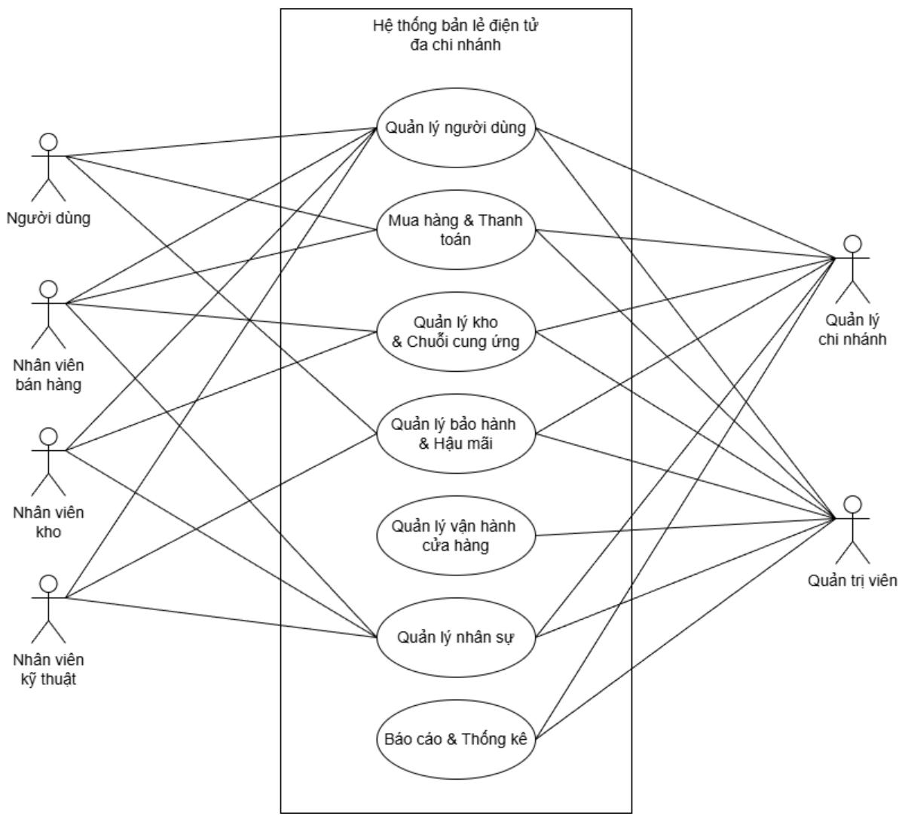

<details>
<summary>flowchart</summary>

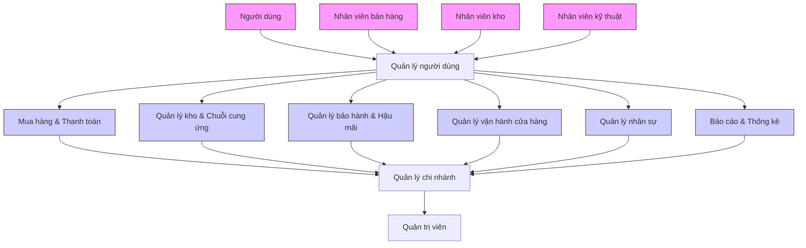
```mermaid
graph TD
    A["Người dùng"] --> B["Quản lý người dùng"]
    C["Nhân viên bản hàng"] --> B
    D["Nhân viên kho"] --> B
    E["Nhân viên kỹ thuật"] --> B
    B --> F["Mua hàng & Thanh toán"]
    B --> G["Quản lý kho & Chuỗi cung ứng"]
    B --> H["Quản lý bảo hành & Hậu mãi"]
    B --> I["Quản lý vận hành cửa hàng"]
    B --> J["Quản lý nhân sự"]
    B --> K["Báo cáo & Thống kê"]
    F --> L["Quản lý chi nhánh"]
    G --> L
    H --> L
    I --> L
    J --> L
    K --> L
    L --> M["Quản trị viên"]
    style A fill:#f9f,stroke:#333
    style C fill:#f9f,stroke:#333
    style D fill:#f9f,stroke:#333
    style E fill:#f9f,stroke:#333
    style F fill:#ccf,stroke:#333
    style G fill:#ccf,stroke:#333
    style H fill:#ccf,stroke:#333
    style I fill:#ccf,stroke:#333
    style J fill:#ccf,stroke:#333
    style K fill:#ccf,stroke:#333
```
</details>

Hình 2.1: Biểu đồ use case tổng quan

# 2.2.2 Biểu đồ use case phân rã

# a, Use case Quản lý người dùng

Hệ thống duy trì hai luồng tạo tài khoản hoàn toàn tách biệt: khách hàng tự đăng ký qua giao diện công khai, còn tài khoản nhân viên do quản trị viên khởi tạo và không thể tự đăng ký. Sự tách biệt này phần ánh bản chất khác nhau giữa người dùng cuối và người dùng nội bộ.

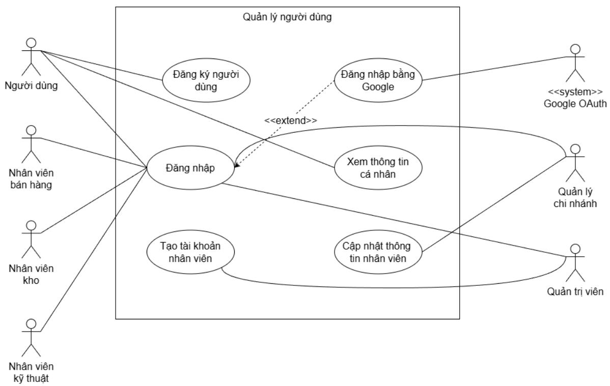

<details>
<summary>flowchart</summary>

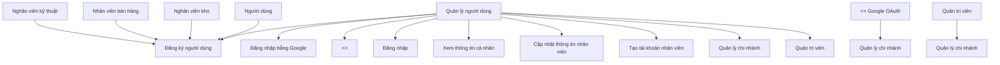
```mermaid
graph TD
    A["Quản lý người dùng"] --> B["Đăng ký người dùng"]
    A --> C["Đăng nhập bằng Google"]
    A --> D["<<extend>>"]
    A --> E["Đăng nhập"]
    A --> F["Xem thông tin cá nhân"]
    A --> G["Cập nhật thông tin nhân viên"]
    A --> H["Tạo tài khoản nhân viên"]
    A --> I["Quản lý chi nhánh"]
    A --> J["Quản trị viên"]
    K["Nghân viên kỹ thuật"] --> B
    L["Nhân viên bán hàng"] --> B
    M["Nghân viên kho"] --> B
    N["Người dùng"] --> B
    O["<<system>> Google OAuth"] --> P["Quản lý chi nhánh"]
    Q["Quản trị viên"] --> R["Quản lý chi nhánh"]
```
</details>

Hình 2.2: Use case Quản lý người dùng

Trong luồng khách hàng, ngoài đăng ký bằng email, hệ thống hỗ trợ đăng nhập qua tài khoản Google với sự tham gia của tác nhân ngoài Google OAuth; đây là lựa chọn tùy chọn cho người dùng nên được mô hình hóa bằng quan hệ «extend» so với đăng nhập thông thường. Sau xác thực, người dùng ở mọi vai trò đều có thể xem thông tin cá nhân và đăng xuất. Trong luồng nội bộ, quản trị viên tạo tài khoản nhân viên, còn quản lý chi nhánh có quyền chính sửa thông tin hồ sơ trong phạm vi phụ trách của mình.

# b, Use case Mua hàng & Thanh toán

Sau khi tìm hiểu và lựa chọn cho mình được sản phẩm ứng ý, khách hàng tiến hành thanh toán qua một trong hai kênh: thể quốc tế qua Stripe, hoặc thanh toán khi nhận hàng. Với kênh trực tuyến Stripe, kết quả giao dịch được xác nhận thông qua cơ chế callback từ phía công thanh toán tương ứng, thể hiện qua đường liên kết từ tác nhân ngoài Stripe vào use case Thanh toán.

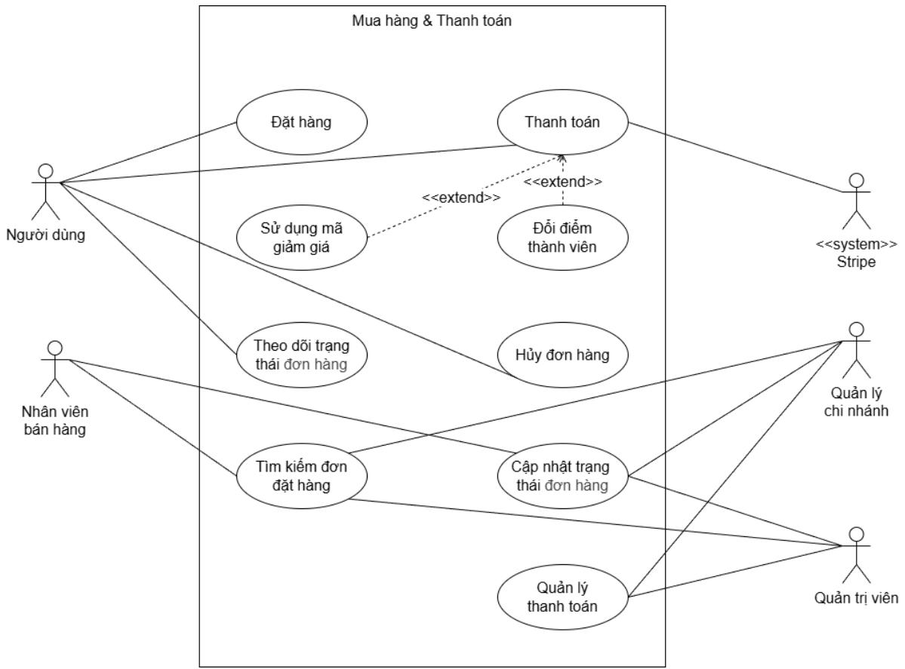

<details>
<summary>flowchart</summary>

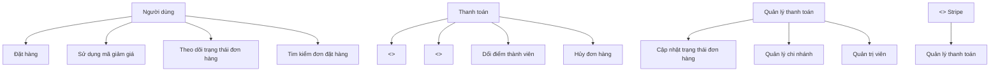
```mermaid
graph TD
    A["Người dùng"] --> B["Đặt hàng"]
    A --> C["Sử dụng mã giảm giá"]
    A --> D["Theo dõi trạng thái đơn hàng"]
    A --> E["Tim kiểm đơn đặt hàng"]
    F["Thanh toán"] --> G["<<extend>>"]
    F --> H["<<extend>>"]
    F --> I["Dổi điểm thành viên"]
    F --> J["Hủy đơn hàng"]
    K["Quản lý thanh toán"] --> L["Cập nhật trạng thái đơn hàng"]
    K --> M["Quản lý chi nhánh"]
    K --> N["Quản trị viên"]
    O["<<system>> Stripe"] --> P["Quản lý thanh toán"]
```
</details>

Hình 2.3: Use case Mua hàng & Thanh toán

Áp mã giảm giá và đổi điểm tích lũy là hai hành động tùy chọn trong bước thanh toán, mỗi hành động được mô hình hóa bằng một quan hệ «extend» riêng. Khách hàng cũng có thể theo dõi trạng thái đơn hàng hoặc hủy đơn sau khi đặt. Về phía xử lý nội bộ, nhân viên bán hàng tham gia vào việc tra cứu và cập nhật trạng thái đơn hàng; quản lý và quản trị viên có thêm quyền quản lý tình trạng thanh toán, cũng như là theo dõi và cập nhật trạng thái đơn hàng trong hệ thống.

# c, Use case Quản lý kho & Chuỗi cung ứng

Ba vai trò gồm nhân viên kho, nhân viên bán hàng, quản lý và quản trị viên đều có quyền truy cập dữ liệu tồn kho, bao gồm xem số lượng hàng theo chi nhánh và tra cứu thiết bị qua mã IMEI. Đây là mức truy cập chung, còn các thao tác ghi, hay cập nhật sẽ có sự phân tầng rõ hơn.

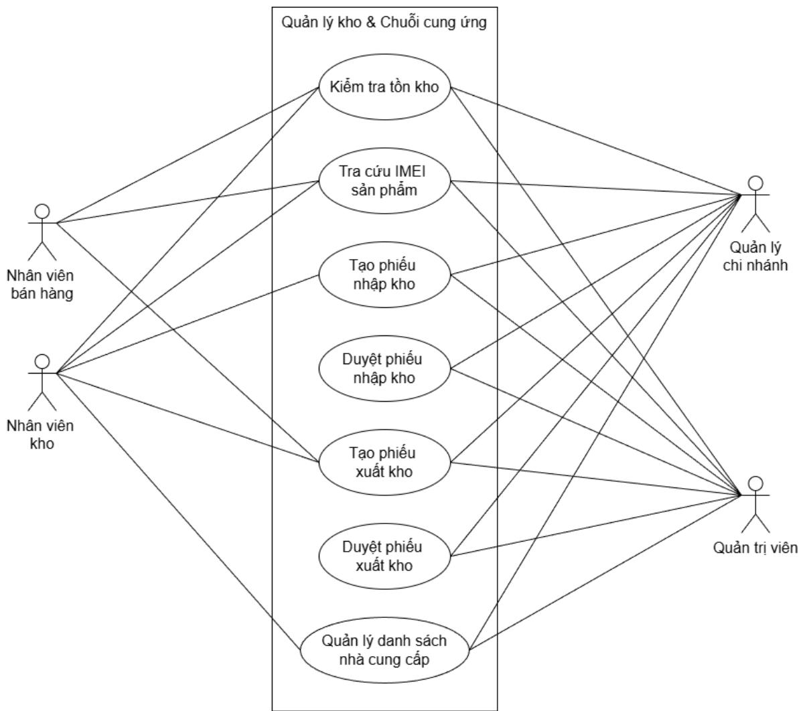

<details>
<summary>flowchart</summary>

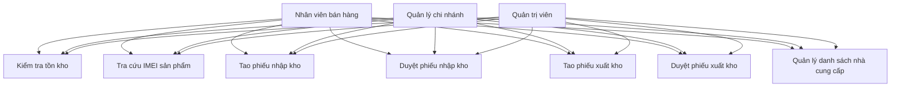
```mermaid
graph TD
    A["Nhân viên bán hàng"] --> B["Kiểm tra tồn kho"]
    A --> C["Tra cứu IMEI sản phẩm"]
    A --> D["Tao phiếu nhập kho"]
    A --> E["Duyệt phiếu nhập kho"]
    A --> F["Tao phiếu xuất kho"]
    A --> G["Duyệt phiếu xuất kho"]
    A --> H["Quản lý danh sách nhà cung cấp"]
    I["Quản lý chi nhánh"] --> B
    I --> C
    I --> D
    I --> E
    I --> F
    I --> G
    I --> H
    J["Quản trị viên"] --> B
    J --> C
    J --> D
    J --> E
    J --> F
    J --> G
    J --> H
```
</details>

Hình 2.4: Use case Quản lý kho & Chuỗi cung ứng

Phiếu nhập kho sẽ có thể do do nhân viên kho, quản lý hoặc quản trị viên lập. Phiếu xuất kho mở rộng thêm cho nhân viên bán hàng, vì nghiệp vụ này sẽ có thể phát sinh từ nhu cầu xuất hàng trực tiếp khi bán hàng tại cửa hàng. Sau khi phiếu được tạo, quản lý hoặc quản trị viên sẽ cần tiến hành phê duyệt và thực hiện những bước tiếp theo trong quy trình bán hàng. Về phía danh sách nhà cung cấp thì hiện tại hệ thống chỉ hỗ trợ tra cứu, chưa có giao diện quản lý đầy đủ.

# d, Use case Quản lý bảo hành & Hậu mãi

Điểm đáng chú ý trong nhóm chức năng này là khách hàng không tự tạo yêu cầu bảo hành. Khi mang thiết bị đến, nhân viên kỹ thuật là người tiếp nhận và khởi tạo yêu cầu trong hệ thống. Khách hàng chỉ giữ vai trò thụ động: xem danh sách yêu cầu đã được ghi nhận và theo dõi tiến độ bảo hành sản phẩm của mình. Ngoài ra, một điểm đặc biệt nữa là nếu có nhu cầu (ví dụ như khi mua các thiết bị cũ), khách hàng cũng hoàn toàn có thể tra cứu được lịch sử sửa chữa chi tiết của sản phẩm mình đang quan tâm trên hệ thống dựa vào định danh IMEI tương ứng của sản phẩm.

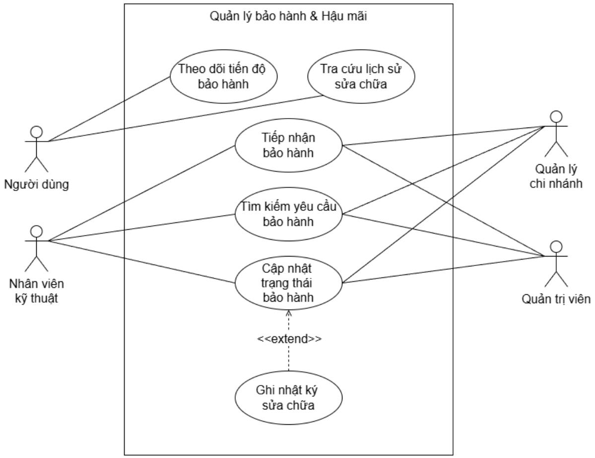

<details>
<summary>flowchart</summary>

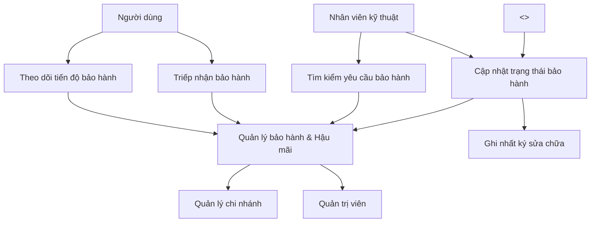
```mermaid
graph TD
    A["Người dùng"] --> B["Theo dõi tiến độ bảo hành"]
    A --> C["Triếp nhận bảo hành"]
    D["Nhân viên kỹ thuật"] --> E["Tìm kiểm yêu cầu bảo hành"]
    D --> F["Cập nhật trạng thái bảo hành"]
    B --> G["Quản lý bảo hành & Hậu mãi"]
    C --> G
    E --> G
    F --> G
    G --> H["Quản lý chi nhánh"]
    G --> I["Quản trị viên"]
    F --> J["Ghi nhất ký sửa chữa"]
    K["<<extend>>"] --> F
```
</details>

Hình 2.5: Use case Quản lý bảo hành & Hậu mãi

Trong quá trình Tiếp nhận bảo hành, kỹ thuật viên sẽ cập nhật trạng thái qua các giai đoạn chẩn đoán, sửa chữa và trả máy, ngoài ra cũng có lựa chọn ghi nhật ký chi tiết từng thao tác kỹ thuật, song song với việc cập nhật tiến độ xử lý. Quản lý và quản trị viên có quyền truy cập toàn bộ danh sách yêu cầu và can thiệp vào bất kỳ bước nào.

# e, Use case Quản lý vận hành cửa hàng

Khác với các nhóm chức năng khác có sự tham gia của nhiều vai trò, toàn bộ nhóm này chỉ dành cho quản trị viên. Lý do là các chức năng ở đây tác động đến cấu hình chung của hệ thống, không giới hạn trong phạm vi một chi nhánh cụ thể.

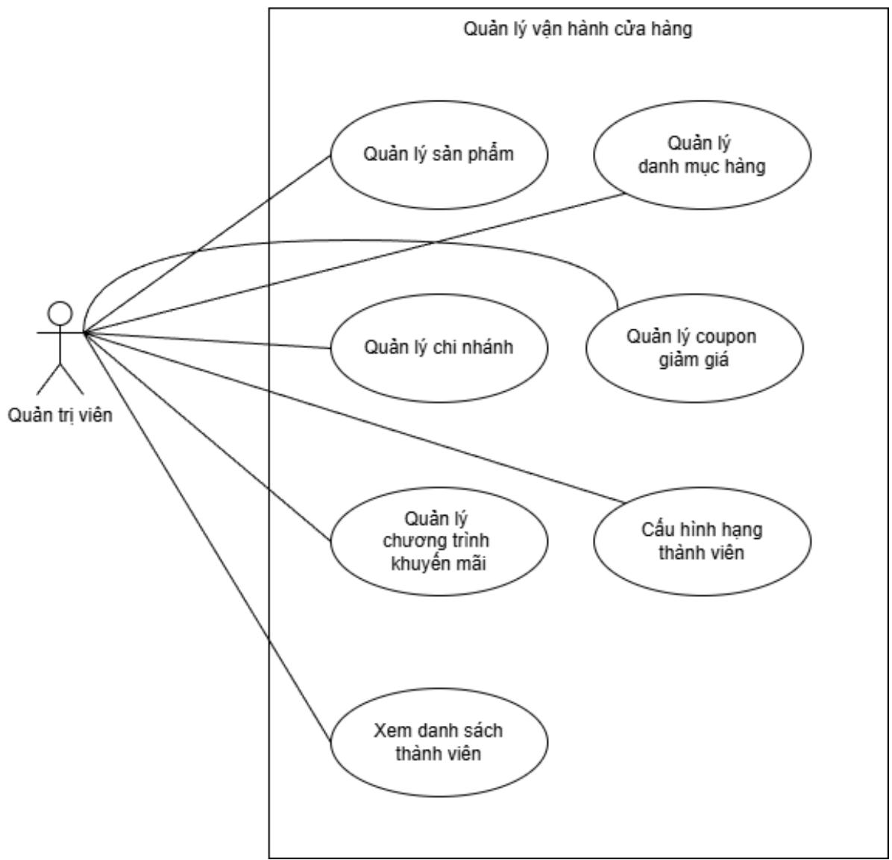

<details>
<summary>flowchart</summary>

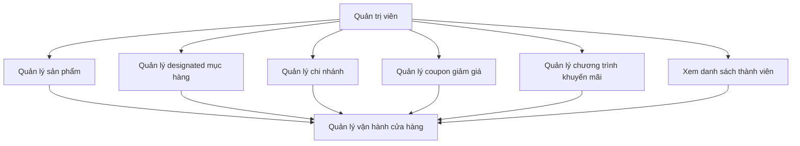
```mermaid
graph TD
    A["Quản trị viên"] --> B["Quản lý sản phẩm"]
    A --> C["Quản lý designated mục hàng"]
    A --> D["Quản lý chi nhánh"]
    A --> E["Quản lý coupon giảm giá"]
    A --> F["Quản lý chương trình khuyến mãi"]
    A --> G["Xem danh sách thành viên"]
    B --> H["Quản lý vận hành cửa hàng"]
    C --> H
    D --> H
    E --> H
    F --> H
    G --> H
```
</details>

Hình 2.6: Use case Quản lý vận hành của hàng

Quản trị viên thực hiện bốn măng chính: quản lý danh mục và thông tin sản phẩm bao gồm biến thể và trạng thái hiển thị; quản lý chi nhánh bao gồm thông tin địa điểm, trạng thái hoạt động và lịch sử chi phí thuê; thiết lập chương trình khuyến mãi dưới dạng mã giảm giá hoặc chương trình giảm giá theo nhóm sản phẩm; và cấu hình chương trình khách hàng thân thiết bao gồm các hạng thành viên, ngưỡng chi tiêu và tỷ lệ chiết khấu tương ứng.

# f, Use case Quản lý nhân sự

Hai chức năng tự phục vụ mà mọi nhân viên đều thực hiện là ghi nhận giờ vào ra trong ca làm việc và xem bằng lương cá nhân theo kỳ. Phần còn lại của nhóm chức năng này thuộc thẩm quyền của quản lý chi nhánh và quản trị viên.

Cấp quản lý xem và chỉnh sửa bằng chấm công, tra cứu thông tin hồ sơ nhân sự như mức lương cơ bản và số người phụ thuộc, sau đó tính lương theo tháng dựa trên dữ liệu ngày công tổng hợp. Sau khi xác nhận thanh toán lương, các cấp quản lý cũng có thể xuất bằng lương tương ứng, để phục vụ các mục đích khai báo cần thiết.

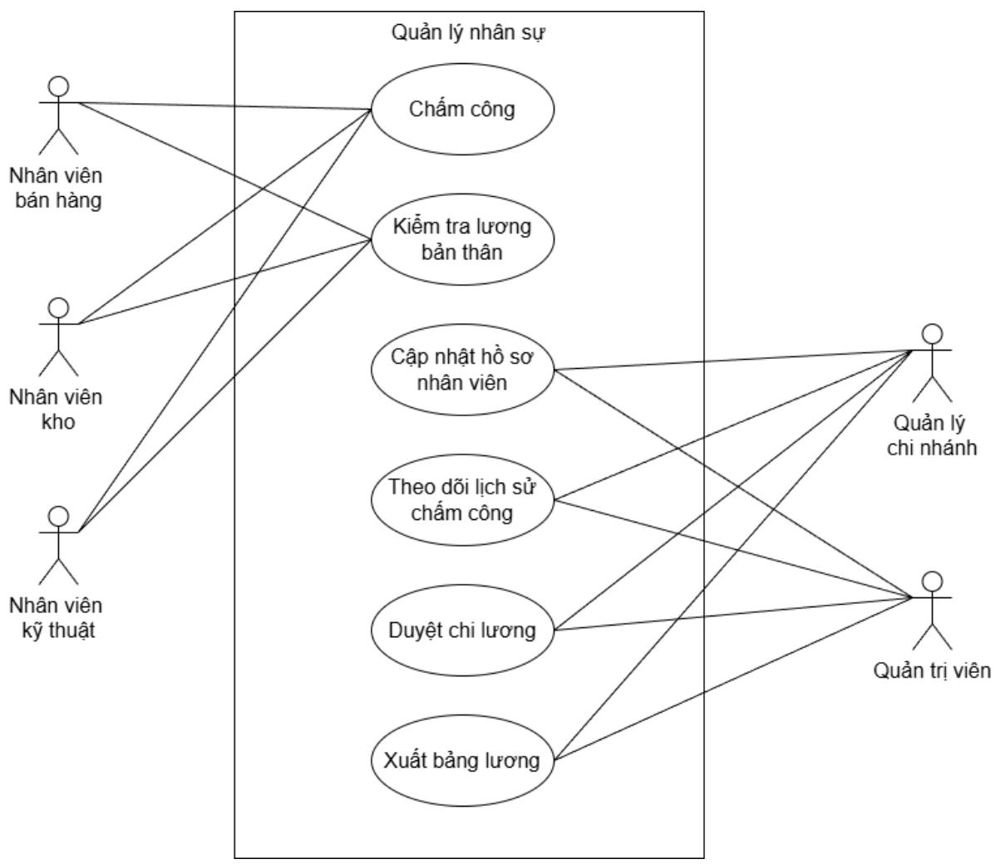

<details>
<summary>flowchart</summary>

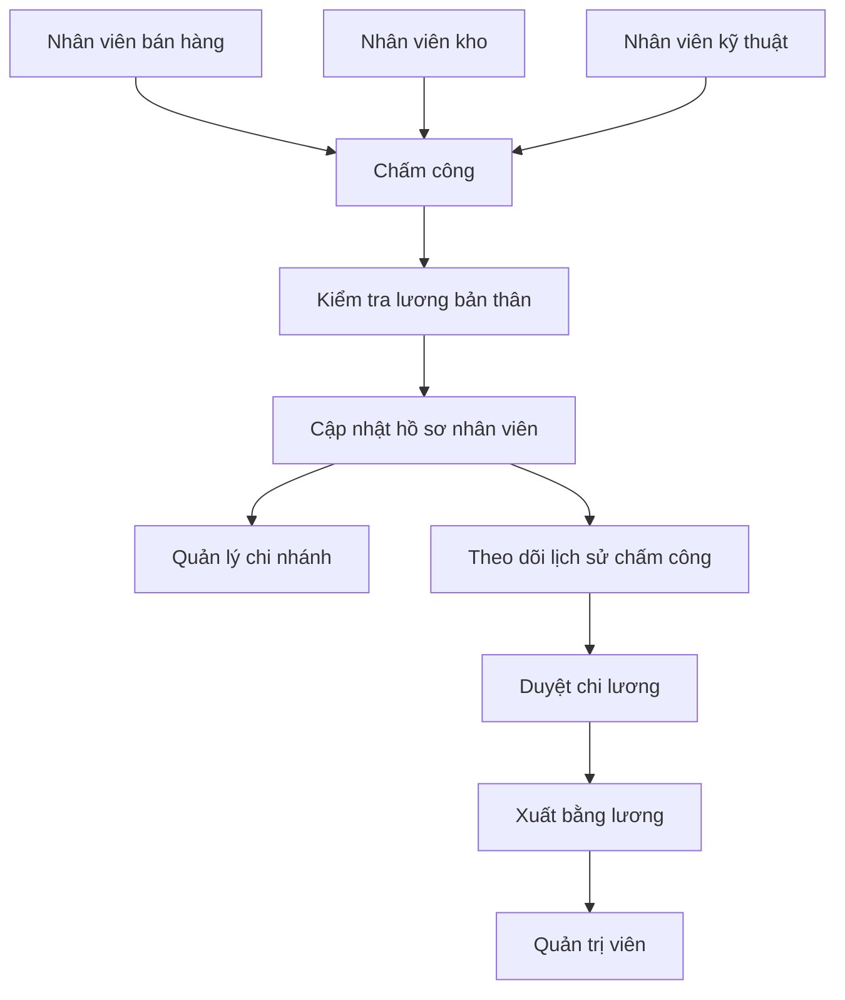
```mermaid
graph TD
    A["Nhân viên bán hàng"] --> B["Chấm công"]
    C["Nhân viên kho"] --> B
    D["Nhân viên kỹ thuật"] --> B
    B --> E["Kiểm tra lương bản thân"]
    E --> F["Cập nhật hồ sơ nhân viên"]
    F --> G["Quản lý chi nhánh"]
    F --> H["Theo dõi lịch sử chấm công"]
    H --> I["Duyệt chi lương"]
    I --> J["Xuất bằng lương"]
    J --> K["Quản trị viên"]
```
</details>

Hình 2.7: Use case Quản lý nhân sự

# g, Use case Báo cáo & Thống kê

Dữ liệu đầu vào cho nhóm chức năng này đến từ nhiều phân hệ: đơn hàng, kho, nhân sự, khuyến mãi và hành vi người dùng. Từ đó, hệ thống tổng hợp thành các báo cáo phục vụ quản lý và quản trị viên ở các góc nhìn khác nhau.

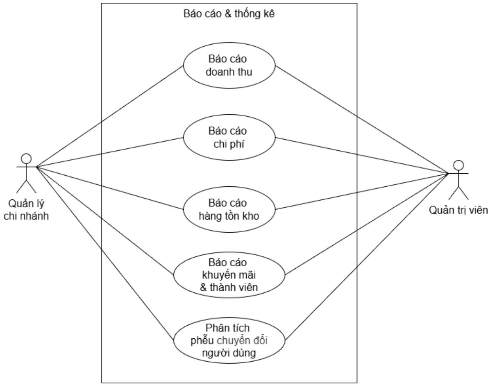

<details>
<summary>flowchart</summary>

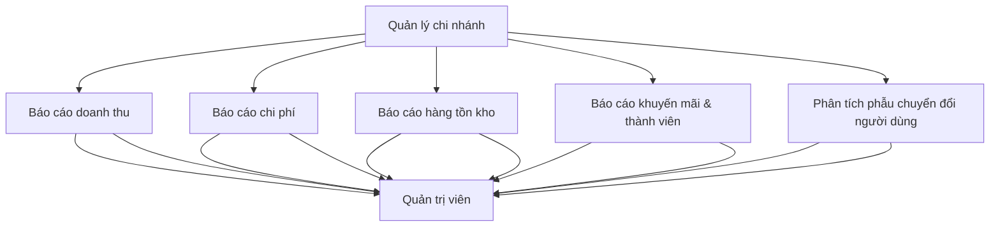
```mermaid
graph TD
    A["Quản lý chi nhánh"] --> B["Báo cáo doanh thu"]
    A --> C["Báo cáo chi phí"]
    A --> D["Báo cáo hàng tồn kho"]
    A --> E["Báo cáo khuyến mãi & thành viên"]
    A --> F["Phân tích phẫu chuyển đổi người dùng"]
    B --> G["Quản trị viên"]
    C --> G
    D --> G
    E --> G
    F --> G
    B --> G
    C --> G
    D --> G
    E --> G
    F --> G
```
</details>

Hình 2.8: Use case Báo cáo & Thống kê

Doanh thu được phân tích theo chiều thời gian, theo chi nhánh và theo sản phẩm; riêng báo cáo liên chi nhánh chỉ quản trị viên mối truy cập được. Chi phí hoạt động sẽ được theo dõi qua các nguồn: chi phí nhập hàng nhập hàng, lương và thuê mặt bằng. Hiệu quả các chương trình khuyến mãi, tình hình hoàn tiền và mức độ tham gia tích điểm cũng được tổng hợp thành báo cáo riêng. Ngoài các báo cáo tỉnh, hệ thống có thêm công cụ phân tích phẫu chuyển đổi, cho phép xác định tỷ lệ người dùng hoàn thành từng bước trong lường mua hàng và phát hiện giai đoạn có tỷ lệ rời bổ cao nhất. Tính năng này sẽ giúp các cấp quản lý có thể biết được hệ thống đang gây tắc nghẽn ở đậu, hay mục nào trên web đang đạt kết quả tốt, từ đó có thể có các biện pháp khác phục cũng như cải thiện nếu cần thiết.

# 2.2.3 Quy trình nghiệp vụ

Hệ thống Apex sẽ được xây dựng xoay quanh nghiệp vụ trọng tâm là mua hàng và thanh toán, trong đó hai luồng này gắn kết chất chế và được thực hiện liên tiếp nhau.

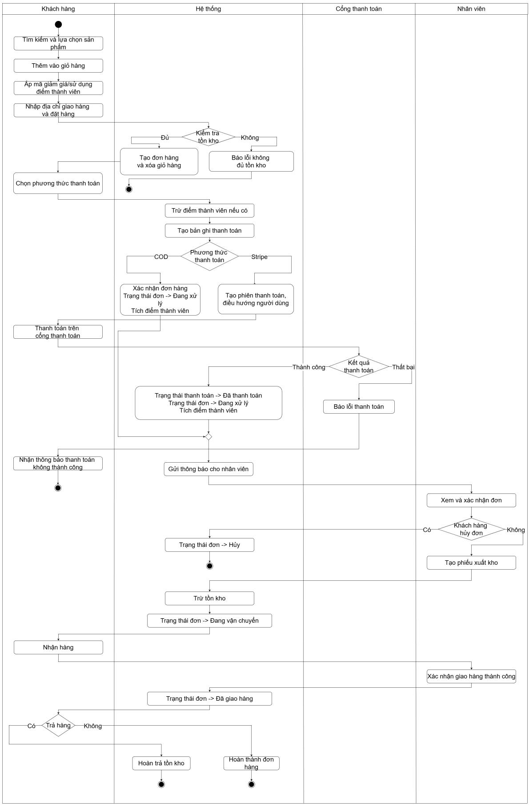

<details>
<summary>flowchart</summary>


```mermaid
graph TD
    A["Tím kiểm và lựa chọn sản phẩm"] --> B["Thềm vào gió hàng"]
    B --> C["Áp mã giảm giá/sử dụng điểm thành viên"]
    C --> D["Nhập địa chỉi giao hàng và đất hàng"]
    D --> E["Chọn phương thức thanh toán"]
    E --> F["Kếm trả tôn kho"]
    F --> G["Tạo đơn hàng và xóa gió hàng"]
    G --> H["Trừ điểm thành viên nếu có"]
    H --> I["Tạo bản ghi thanh toán"]
    I --> J{Phương thức thanh toán}
    J --> K["COD"]
    K --> L["Xác nhận đơn hàng Trang thái đơn --> Đang xử lý Tích điểm thành viên"]
    L --> M["Tạo phiên thanh toán, điều hướng người dùng"]
    M --> N["Thanh toán trên cổng thanh toán"]
    N --> O["Nhận thống báo thanh toán không thành công"]
    O --> P["Gửi thông báo cho nhân viên"]
    P --> Q["Trạng thái đơn --> Hủy"]
    Q --> R["Trừ tổn kho"]
    R --> S["Trạng thái đơn --> Đang vấn chuyển"]
    S --> T["Nhận hàng"]
    T --> U["Trạng thái đơn --> Đã giao hàng"]
    U --> V["Có Trả hàng Không"]
    V --> W["Hoàn trả tôn kho"]
    W --> X["Hoàn thành đơn hàng"]
    X --> Y["Xác nhận giao hàng thành công"]
```
</details>

Hình 2.9: Quy trình mua hàng & Thanh toán

Quy trình bắt đầu từ phía khách hàng. Sau khi tìm kiếm và lựa chọn sản phẩm phù hợp, khách hàng thêm sản phẩm vào giờ hàng, tùy chọn áp dụng mã giảm giá hoặc dùng điểm tích lũy thành viên để giảm giá trị đơn, rời điền địa chỉ giao hàng và xác nhận đặt hàng. Ngay khi nhận được yêu cầu, hệ thống tiến hành kiểm tra tồn kho tại các chi nhánh theo thứ tự ưu tiên. Nếu lượng hàng không đủ để đáp ứng, toàn bộ yêu cầu bị từ chối và khách hàng nhận được thông báo lỗi. Ngược lại, khi kho còn đủ hàng, hệ thống tự động tạo đơn hàng, xóa giờ hàng và trừ số điểm thành viên mà khách hàng đã chọn sử dụng.

Tiếp theo là giai đoạn thanh toán. Hệ thống tạo bản ghi thanh toán và phân luồng theo phương thức mà khách hàng lựa chọn. Với thanh toán khi nhận hàng, đơn hàng lập tức được xác nhận, trạng thái chuyển sang Đang xử lý và điểm thường được cộng vào tài khoản ngay lập tức. Với thanh toán trực tuyến, hệ thống tạo một phiên thanh toán riêng và điều hướng khách hàng sang công thanh toán bên thứ ba. Kết quả giao dịch được gửi ngược về hệ thống: nếu thành công, trạng thái đơn hàng và trạng thái thanh toán được cập nhật đồng thời, điểm thường được tích; nếu thất bại, hệ thống thông báo lỗi và đơn hàng không được kích hoạt.

Sau khi đơn hàng vào trạng thái Đang xử lý, hệ thống gửi thông báo đến nhân viên để xem xét và xác nhận. Nếu tại thời điểm này khách hàng yêu cầu hủy đơn, đơn hàng chuyển sang trạng thái Hủy và toàn bộ quy trình kết thúc. Trong trường hợp ngược lại, nhân viên tạo phiếu xuất kho, hệ thống trừ tồn kho thực tế và cập nhật trạng thái đơn sang Đang vận chuyển. Khi hàng đến tay khách hàng, nhân viên xác nhận giao thành công và đơn hàng chuyển sang Đã giao hàng. Cuối cùng, nếu khách hàng muốn trả hàng, số lượng hàng trả được hoàn lại vào kho; còn nếu không có khiếu nại, đơn hàng kết thúc ở trạng thái Hoàn thành.

# 2.3 Đặc tả chức năng

Sinh viên lựa chọn từ 4 đến 7 use case quan trọng nhất của đồ án để đặc tả chi tiết. Mỗi đặc tả bao gồm ít nhất các thông tin sau: (i) Tên use case, (ii) Luồng sự kiện (chính và phát sinh), (iii) Tiền điều kiện, và (iv) Hậu điều kiện. Sinh viên chỉ vẽ bổ sung biểu đồ hoạt động khi đặc tả use case phúc tạp.

# 2.3.1 Đặc tả use case Mua hàng & Thanh toán

<table><tr><td>Tên ca sử dụng</td><td>Mua hàng &amp; Thanh toán</td><td>ID</td><td>UC01</td><td>Mức quan trọng</td><td>Cao</td></tr><tr><td colspan="6">(Các) tác nhân: Khách hàng, Nhân viên bán hàng, Stripe</td></tr></table>

# Các cổ đông và môi quan tâm:

Khách hàng: Muốn đặt đơn nhanh, áp dụng được ưu đãi đang có, chọn phương thức thanh toán phù hợp và nhận hàng từ chi nhánh gần nhất.

Nhân viên bán hàng: Muôn nhận đơn đã được hệ thống định tuyến tự động về chi nhánh phụ trách, không phải kiểm tra thủ công tồn kho liên chi nhánh.

Hệ thống: Cần kiểm tra tồn kho liên chi nhánh theo thứ tự ưu tiên khoảng cách, đảm bảo tính nguyên tử khi tạo đơn và trừ kho, đồng bộ trạng thái đơn với kết quả callback từ cống thanh toán.

Mô tả ngắn gọn: Ca sử dụng này mô tả quy trình khách hàng đặt mua sản phẩm trực tuyến và thanh toán. Hệ thống quét tồn kho theo thứ tự ưu tiên các chi nhánh, gán đơn về chi nhánh gần khách nhất còn đủ hàng, xử lý thanh toán qua Stripe hoặc COD, sau đó chuyển đơn cho nhân viên chi nhánh xác nhận và xuất kho cho đến khi giao hàng thành công.

# Luồng chính:

1. Khách hàng thêm sản phẩm vào giờ hàng và truy cập trang thanh toán.   
2. Khách hàng điền địa chỉ giao hàng, tùy chọn áp dụng mã giảm giá hoặc đổi điểm thành viên để giảm giá trị đơn.   
3. Khách hàng chọn phương thức thanh toán: thể quốc tế qua Stripe hoặc thanh toán khi nhận hàng (COD), sau đó xác nhận đặt hàng.   
4. Hệ thống kiểm tra tồn kho theo thứ tự ưu tiên các chi nhánh, ưu tiên chi nhánh gần địa chỉ giao nhất; nếu chi nhánh ưu tiên không đủ hàng, hệ thống chuyển sang chi nhánh kế tiếp.   
5. Hệ thống tạo đơn hàng gán với chi nhánh được chọn, xóa giờ hàng và trừ số điểm thành viên đã sử dụng.   
6. Hệ thống tạo bản ghi thanh toán theo phương thức đã chọn: với COD, trạng thái đơn chuyển sang Đang xử lý và điểm thường được cộng vào tài khoản ngay; với Stripe, hệ thống tạo phiên thanh toán và điều hướng khách sang công thanh toán, khi nhận callback thành công mới cập nhật trạng thái đơn sang Đang xử lý và tích điểm thường.   
7. Hệ thống gửi thông báo đến nhân viên bán hàng tại chi nhánh đã được gán đơn để tiếp nhận xử lý.

8. Nhân viên xác nhận đơn và tạo phiếu xuất kho; hệ thống trừ tồn kho thực tế và chuyển trạng thái đơn sang Đang vận chuyển.   
9. Khi hàng đến tay khách, nhân viên xác nhận giao thành công; trạng thái đơn chuyển sang Đã giao hàng.   
10. Sau thời gian không có khiếu nại, đơn hàng tự động chuyển sang trạng thái Hoàn thành. Kết thúc ca sử dụng.

# Lường phụ:

# Luồng 4a – Không chi nhánh nào còn đủ hàng:

1. Tại bước 4, hệ thống duyệt qua toàn bộ chi nhánh nhưng không tìm được chi nhánh nào có đủ tồn kho cho mọi sản phẩm trong đơn.   
2. Hệ thống hủy thao tác đặt đơn, hiển thị thông báo hết hàng kèm danh sách sản phẩm thiếu.   
3. Giổ hàng và điểm thành viên được giữ nguyên, không bị trừ.

# Luồng 6a – Thanh toán Stripe thất bại:

1. Tại bước 6, Stripe trả về callback báo giao dịch thất bại hoặc khách hủy phiên thanh toán giữa chủng.   
2. Hệ thống giữ đơn ở trạng thái Chò thanh toán, hoàn lại điểm thành viên đã trừ và hiện thị thông báo lỗi.   
3. Khách hàng có thể thử thanh toán lại hoặc hủy đơn.

# Luồng 7a – Khách hàng hủy đơn trước khi xuất kho:

1. Trước khi nhân viên xác nhận xuất kho, khách hàng gửi yêu cầu hủy đơn.   
2. Hệ thống chuyển trạng thái đơn sang Hủy, hoàn lại điểm thành viên đã sử dụng và khởi tạo luồng hoàn tiền nếu đã thanh toán qua Stripe.   
3. Kết thúc ca sử dụng.

# Luồng 9a – Khách hàng yêu cầu trả hàng sau khi giao:

1. Sau bước 9, khách hàng yêu cầu trả hàng trong thời gian cho phép.   
2. Nhân viên xác nhận tiếp nhận hàng trả; hệ thống hoàn số lượng tương ứng vào tồn kho của chi nhánh ban đầu và khởi tạo luồng hoàn tiền.

Bảng 2.2: Đặc tả ca sử dụng Mua hàng & Thanh toán

# 2.3.2 Đặc tả use case Quản lý xuất kho

<table><tr><td>Tên ca sử dụng</td><td>Quản lý xuất kho</td><td>ID</td><td>UC02</td><td>Mức quan trọng</td><td>Cao</td></tr><tr><td colspan="6">(Các) tác nhân: Nhân viên kho, Quản lý chi nhánh, Hệ thống (xuất kho tự động khi có đơn hàng)</td></tr><tr><td colspan="6">Các cổ đông và mối quan tâm:Nhân viên kho: Muốn tạo phiếu xuất kho thủ công nhanh chóng, khai báo đúng danh sách IMEI thiết bị thực tế xuất ra khởi kho.Quản lý: Muốn đảm bảo mỗi thiết bị xuất kho đều được truy vết qua IMEI, số lượng tồn kho luôn phần ánh đúng thực tế.Hệ thống: Cần xác minh từng IMEI khai báo thực sự tồn tại trong kho chi nhánh trước khi trừ tồn kho, đảm bảo tính đồng bộ dữ liệu.</td></tr><tr><td colspan="6">Mô tả ngắn gọn: Ca sử dụng này mô tả quy trình nhân viên kho tạo phiếu xuất kho thủ công cho các lý do như hàng hống, điều chuyển nội bộ hoặc bán lẻ tại quầy. Hệ thống kiểm tra tính hợp lệ của từng IMEI trong kho chi nhánh, đồng bộ trừ số lượng tồn kho ngay khi phiếu được xác nhận. Ngoài ra, hệ thống cũng tự động tạo phiếu xuất kho khi nhân viên xác nhận giao hàng cho đơn hàng trực tuyến.</td></tr><tr><td colspan="6">Luồng chính – Xuất kho thủ công:1. Nhân viên kho truy cập trang Quản lý xuất kho và chọn “Tạo phiếu xuất mới”.2. Nhân viên diễn thông tin phiếu: chọn chi nhánh, chọn lý do xuất kho (hàng hống, điều chuyển, bán tại quầy...), ghi chú (tuy chọn).3. Nhân viên thêm từng dòng sản phẩm: chọn sản phẩm, chọn phiên bản, nhập danh sách IMEI của các thiết bị cần xuất.4. Hệ thống tự động tính số lượng xuất dựa trên số IMEI được khai báo.5. Nhân viên xác nhận và gửi phiếu. Hệ thống kiểm tra tính hợp lệ: chi nhánh tồn tại, phiên bản sản phẩm khớp, mỗi dòng có ít nhất một IMEI, từng IMEI phải có trong danh sách tồn kho hiện tại của chi nhánh, số lượng tồn kho đủ để xuất.6. Hệ thống trừ số lượng tồn kho và xoá các IMEI tương ứng khởi danh sách tồn kho của chi nhánh một cách đồng bộ.7. Hệ thống lưu phiếu xuất với trạng thái Hoàn thành. Kết thúc ca sử dụng.</td></tr><tr><td colspan="6">Luồng phụ:</td></tr></table>

# Luồng 5a – IMEI không tồn tại trong kho chi nhánh:

1. Tại bước 5, hệ thống phát hiện một hoặc nhiều IMEI được khai báo không có trong danh sách tồn kho của chi nhánh.   
2. Hệ thống huỷ toàn bộ thao tác, tồn kho không thay đổi, và hiển thị thông báo lỗi chỉ rõ IMEI không hợp lệ.   
3. Nhân viên kiểm tra lại danh sách IMEI và gửi lại (quay về bước 3).

# Luồng 5b – Số lượng tồn kho không đủ:

1. Tại bước 5, số lượng IMEI yêu cầu xuất vượt quá số lượng tồn kho hiện có tại chi nhánh.   
2. Hệ thống huỷ toàn bộ thao tác và hiển thị thông báo số lượng còn lại trong kho.   
3. Nhân viên điều chỉnh lại số lượng và gửi lại.

# Luồng 5c – Xuất kho tự động từ đơn hàng trực tuyến:

1. Nhân viên xác nhận giao hàng cho một đơn hàng trực tuyến trên trang Quản lý đơn hàng.   
2. Hệ thống tự động tạo phiếu xuất kho liên kết với đơn hàng, lý do xuất là bán hàng trực tuyến.   
3. Hệ thống kiểm tra và trừ tồn kho tương tự bước 5–6 của luồng chính. Nếu hợp lệ, phiếu được lưu với trạng thái Hoàn thành mà không cần nhân viên kho can thiệp thêm.

Bảng 2.3: Đặc tả ca sử dụng Quản lý xuất kho   
2.3.3 Đặc tả use case Tiếp nhận bảo hành 

<table><tr><td>Tên ca sử dụng</td><td>Tiếp nhận bảo hành</td><td>ID</td><td>UC03</td><td>Mức quan trọng</td><td>Cao</td></tr><tr><td colspan="6">(Các) tác nhân: Khách hàng, Kỹ thuật viên, Quản lý chi nhánh</td></tr></table>

# Các cổ đông và môi quan tâm:

Khách hàng: Muốn gửi thiết bị lỗi và theo dõi tiến trình sửa chữa theo thời gian thực.

Kỹ thuật viên: Muôn tạo phiếu nhanh chóng, hỗ trợ cả khách văng lai chưa có tài khoản trong hệ thống, dòng thời ghi lại từng bước sửa chữa, linh kiện thay thế và chi phí phát sinh.

Hệ thống: Cần kiểm soát chặt chế thứ tự chuyển trạng thái phiếu bảo hành; tự động gửi thông báo cho khách hàng sau mỗi lần thay đổi.

Mô tả ngắn gọn: Ca sử dụng này mô tả quy trình từ khi khách hàng mang thiết bị đến chi nhánh yêu cầu bảo hành, kỹ thuật viên tạo phiếu tiếp nhận với thông tin IMEI/số sê-ri, cho đến khi cập nhật trạng thái sửa chữa, ghi nhật ký từng bước, và bàn giao máy lại cho khách. Hệ thống gửi thông báo tự động đến khách hàng sau mỗi lần thay đổi trạng thái.

# Luồng chính:

1. Khách hàng mang thiết bị đến chi nhánh. Kỹ thuật viên truy cập trang tạo phiếu bảo hành.

2. Nhập thông tin phiếu: sản phẩm, phiên bản, IMEI/số sê-ri, mô tả lỗi, tình trạng ngoại quan, ảnh thiết bị, ngày dự kiến trả máy.

3. Nhân viên liên kết phiếu với tài khoản khách hàng có sẵn trong hệ thống.

4. Hệ thống tạo phiếu bảo hành với trạng thái Đã tiếp nhận và gửi thông báo đến khách hàng.

5. Kỹ thuật viên mỗ phiếu và chuyển trạng thái sang Đang chẩn đoán. Hệ thống gửi thông báo cập nhật cho khách hàng.

6. Kỹ thuật viên thêm nhật ký sửa chữa: mô tả hành động thực hiện, linh kiện đã thay thế, chi phí phát sinh và ghi chú.

7. Kỹ thuật viên chuyển trạng thái sang Đang sửa chữa. Hệ thống gửi thông báo cho khách hàng.

8. Sau khi hoàn tất, kỹ thuật viên chuyển trạng thái sang Hoàn tất sửa chữa. Hệ thống ghi nhận ngày hoàn thành và gửi thông báo cho khách hàng.

9. Bàn giao máy cho khách và chuyển trạng thái sang Đã trả máy.

10. Kết thúc ca sử dụng.

# Lường phụ:

# Luồng 3a – Khách hàng văng lai chưa có tài khoản:

1. Tại bước 3, khách hàng chưa có tài khoản trong hệ thống.   
2. Nhân viên nhập họ tên và số điện thoại của khách.   
3. Hệ thống tự động tạo tài khoản tạm để lưu thông tin phiếu bảo hành.   
4. Tiếp tục từ bước 4 của luồng chính.

# Luồng 7a – Thiết bị cần chờ linh kiện:

1. Tại bước 7, kỹ thuật viên phát hiện thiếu linh kiện thay thế cần thiết.   
2. Kỹ thuật viên chuyển trạng thái sang Chở linh kiện và thêm nhật ký ghi rõ linh kiện cần đặt.   
3. Hệ thống gửi thông báo cho khách hàng.   
4. Sau khi có đủ linh kiện, kỹ thuật viên chuyển trạng thái trở lại Đang sửa chữa và tiếp tục từ bước 7.

# Luồng 6a – Không thể thêm nhật ký vì máy đã được trả:

1. Tại bước 6, kỹ thuật viên cố gắng thêm nhật ký cho phiếu đã ở trạng thái Đã trả máy.   
2. Hệ thống từ chối thao tác và hiển thị thông báo không thể ghi nhật ký cho thiết bị đã bàn giao.   
3. Kết thúc ca sử dụng.

# Luồng 5b – Chuyển trạng thái không hợp lệ:

1. Kỹ thuật viên cố gắng chuyển sang trạng thái không được phép từ trạng thái hiện tại.   
2. Hệ thống từ chối và hiện thị thông báo lỗi chuyển trạng thái.   
3. Kết thúc ca sử dụng.

Bảng 2.4: Đặc tả ca sử dụng Tiếp nhận bảo hành   
2.3.4 Đặc tả use case Báo cáo doanh thu 

<table><tr><td>Tên ca sử dụng</td><td>Báo cáo doanh thu</td><td>ID</td><td>UC04</td><td>Mức quan trọng</td><td>Cao</td></tr><tr><td colspan="6">(Các) tác nhân: Quản trị viên, Quản lý chi nhánh</td></tr></table>

# Các cổ đông và môi quan tâm:

Quản trị viên: Muốn xem tổng quan toàn hệ thống gồm doanh thu theo từng chi nhánh, hiệu quả chương trình tích điểm thành viên và chi phí lương toàn công ty. Quản lý chi nhánh: Muốn xem số liệu riêng của chi nhánh mình: doanh thu theo thời gian, top sản phẩm bán chạy, chi phí nhập hàng, hoàn trả và chi phí mặt bằng.

Hệ thống: Cần lọc chính xác dữ liệu theo phạm vi chi nhánh của từng người dùng, loại trừ các đơn hàng đã huỷ hoặc đã hoàn tiền khởi thống kê doanh thu.

Mô tả ngắn gọn: Ca sử dụng này mô tả quy trình Quản trị viên hoặc Quản lý chi nhánh truy cập trang báo cáo, chọn loại báo cáo và khoảng thời gian cần xem, hệ thống tổng hợp dữ liệu từ nhiều nguồn (đơn hàng, thanh toán, tồn kho, lương, mặt bằng, điểm thành viên) và trả về kết quả dưới dạng biểu đồ và bằng số liệu.

# Luồng chính:

1. Quản trị viên hoặc Quản lý đăng nhập và truy cập trang Báo cáo tài chính trên bằng điều hành.   
2. Người dùng chọn loại báo cáo cần xem (ví dụ: Doanh thu theo thời gian, Top sản phẩm bán chạy, Chi phí nhập hàng...).   
3. Người dùng thiết lập bộ lọc: khoảng thời gian, chi nhánh (nếu là Quản trị viên).   
4. Hệ thống kiểm tra quyền truy cập: Quản lý chỉ được xem dữ liệu chi nhánh được phân công. Quản trị viên được xem toàn bộ hệ thống.   
5. Hệ thống tổng hợp dữ liệu, loại trừ các đơn hàng đã huỷ hoặc đã hoàn tiền khởi số liệu doanh thu.   
6. Hệ thống trả về kết quả tổng hợp: doanh thu, chi phí, lợi nhuận, số lượng giao dịch và các chỉ số liên quan.   
7. Trang báo cáo hiển thị kết quả dưới dạng biểu đồ và bằng số liệu.   
8. Người dùng có thể chuyển sang loại báo cáo khác và lập lại từ bước 2. Kết thúc ca sử dụng.

# Lường phụ:

# Luồng 4a – Quản lý cố găng xem dữ liệu ngoài phạm vi chi nhánh:

1. Tại bước 4, Quản lý cổ găng xem dữ liệu của chi nhánh khác không được phân công.   
2. Hệ thống tự động giới hạn kết quả trả về chỉ trong phạm vi chi nhánh được phép, bổ qua yêu cầu xem chi nhánh khác.   
3. Kết quả hiển thị chỉ bao gồm dữ liệu thuộc chi nhánh được phân công.

# Luồng 3a – Không có dữ liệu trong khoảng thời gian đã chọn:

1. Tại bước 6, hệ thống không tìm thấy dữ liệu phù hợp trong khoảng thời gian được chọn.   
2. Hệ thống trả về kết quả rỗng với các chỉ số bằng 0.   
3. Trang báo cáo hiền thị thông báo “Không có dữ liệu trong khoảng thời gian này”.

# Luồng 2a – Xem báo cáo doanh thu so sánh giữa các chi nhánh:

1. Quản trị viên chọn loại báo cáo Doanh thu theo chi nhánh.   
2. Hệ thống kiểm tra quyền; nếu người dùng không phải Quản trị viên, hệ thống từ chối truy cập.   
3. Hệ thống tổng hợp và so sánh doanh thu của tất cả chi nhánh trong cùng khoảng thời gian.   
4. Tiếp tục từ bước 7 của luồng chính.

Bảng 2.5: Đặc tả ca sử dụng Báo cáo doanh thu   
2.3.5 Đặc tả use case Duyệt chi lương & Xuất bằng lương 

<table><tr><td>Tên ca sử dụng</td><td>Duyệt chi lương &amp; Xuất bằng lương</td><td>ID</td><td>UC05</td><td>Mức quan trọng</td><td>Cao</td></tr><tr><td colspan="6">(Các) tác nhân: Quản lý chi nhánh, Quản trị viên</td></tr></table>

# Các cổ đông và môi quan tâm:

Quản lý chi nhánh: Muôn tính nhanh lương tháng cho nhân viên chi nhánh mình dựa trên ngày công và doanh số chi nhánh, có thể điều chỉnh thường phạt đột xuất trước khi gửi duyệt.

Quản trị viên: Muôn duyệt chi lương cho toàn chuỗi, kiểm soát tổng chi phí lương theo từng chi nhánh và xuất bằng lương phục vụ khai báo thuế.

Hệ thống: Cần tổng hợp chính xác ngày công và doanh số chi nhánh, áp đúng công thức lương cơ bản cộng thường theo doanh số cộng phụ cấp người phụ thuộc, và đảm bảo bằng lương đã duyệt không bị chỉnh sửa.

Mô tả ngắn gọn: Ca sử dụng này mô tả quy trình tính, duyệt chi và xuất bằng lương theo kỳ. Quản lý chi nhánh khởi tạo bằng lương cho nhân viên trong phạm vi chi nhánh phụ trách dựa trên dữ liệu chấm công và doanh số chi nhánh; quản trị viên duyệt chi và ghi nhận khoản chi vào chi phí của từng chi nhánh, sau đó xuất bằng lương ra file phục vụ khai báo.

# Luồng chính:

1. Quản lý chi nhánh truy cập trang Tính lương và chọn “Tạo bằng lương mới”.   
2. Quản lý chọn kỳ tính lường (tháng) và xác nhận phạm vi chi nhánh phụ trách.   
3. Hệ thống kiểm tra quyền: quản lý chỉ được thao tác trong chi nhánh được phân công.   
4. Hệ thống tổng hợp dữ liệu đầu vào: ngày công thực tế của từng nhân viên từ module Chấm công, tổng doanh thu chi nhánh trong kỳ, mức lương cơ bản và số người phụ thuộc của từng nhân viên.   
5. Hệ thống tính lượng cho từng nhân viên theo công thức: lượng cơ bản nhân tỷ lệ ngày công, cộng thường theo doanh số chi nhánh theo tỷ lệ định trước, cộng phụ cấp người phụ thuộc, trừ các khoản bảo hiểm và thuế.   
6. Hệ thống hiển thị bằng lương tạm tính. Quản lý rà soát và có thể điều chỉnh các khoản đặc biệt như thường đột xuất hoặc phạt kỷ luật.   
7. Quản lý xác nhận và gửi bằng lương lên quản trị viên với trạng thái Chở duyệt.   
8. Quản trị viên mỏ bằng lương, đối chiếu tổng chi với ngân sách chi nhánh và xác nhận duyệt chi.   
9. Hệ thống chuyển trạng thái bằng lương sang Đã duyệt chi, ghi nhận khoản chi vào chi phí lương của chi nhánh và khóa bằng lương không cho chính sửa.

<table><tr><td>10. Người dùng yêu cầu xuất bằng lương; hệ thống tạo file định dạng Excel kèm chi tiết từng khoản và cho phép tải về.11. Kết thúc ca sử dụng.</td></tr><tr><td>Luồng phụ:Luồng 3a – Quản trị viên trực tiếp tính lương cho một chi nhánh:1. Tại bước 3, người thực hiện là quản trị viên thay vì quản lý chi nhánh.2. Quản trị viên được phép chọn bất kỳ chi nhánh nào trong chuỗi và tự duyệt chi sau khi tính lương, bổ qua bước gửi duyệt 7–8.3. Tiếp tục từ bước 4 của luồng chính.Luồng 4a – Nhân viên thiếu dữ liệu chấm công:1. Tại bước 4, một hoặc nhiều nhân viên không có dữ liệu chấm công trong kỳ.2. Hệ thống cảnh báo danh sách nhân viên thiếu dữ liệu và loại tạm khởi bằng lương.3. Quản lý có thể bổ sung công thủ công qua module Chấm công, sau đó tải lại bằng lương.Luồng 8a – Quản trị viên từ chối duyệt chi:1. Tại bước 8, quản trị viên phát hiện sai lệch và từ chối duyệt, kèm lý do.2. Hệ thống chuyển trạng thái bằng lương về Cần chỉnh sửa và gửi thông báo cho quản lý chi nhánh.3. Quản lý chỉnh sửa và gửi lại từ bước 7.Luồng 9a – Yêu cầu chỉnh sửa bằng lương đã duyệt:1. Sau bước 9, người dùng cố gắng chỉnh sửa bằng lương đã ở trạng thái Đã duyệt chi.2. Hệ thống từ chối thao tác và hiển thị thông báo bằng lương đã khóa. Trường hợp cần điều chỉnh, người dùng phải tạo bằng lương bù trừ cho kỳ tiếp theo.</td></tr></table>

Bảng 2.6: Đặc tả ca sử dụng Duyên chi lương & Xuất bằng lương

# 2.4 Yêu cầu phi chức năng

Bên cạnh các chức năng nghiệp vụ, hệ thống cần đáp ứng một tập hợp các yêu cầu phi chức năng nghiêm ngặt nhằm đảm bảo chất lượng vận hành ổn định trong môi trường chuỗi bán lễ đa chi nhánh thực tế. Hệ thống quản trị một chuỗi cửa hàng phân tán đời hồi các giải pháp hạ tầng đặc thù để giải quyết bài toán đồng bộ dữ liệu theo thời gian thực, bảo mật phân quyền cục bộ và duy trì tính sẵn sàng cao khi một chi nhánh gặp sự cố mạng.

Đế trực quan hóa các cam kết về chất lượng dịch vụ, bằng dưới đây sẽ tổng hợp các yêu cầu phi chức năng cốt lõi của hệ thống gắn liền với đặc thù vận hành đa chi nhánh.

<table><tr><td>Khía cạnh</td><td>Giải pháp kỹ thuật</td><td>Ý nghĩa</td></tr><tr><td>Hiệu năng và Tốc độ xử lý</td><td>Tích hợp engine tìm kiếm chuyên dụng Elasticsearch phục vụ truy vấn sản phẩm.Sử dụng bộ nhớ đệm Redis để tối ưu hóa tốc độ truy xuất dữ liệu lắp lại.</td><td>Đảm bảo tốc độ hiển thị và lọc chính xác trạng thái tồn kho thực tế của từng sản phẩm tại từng chi nhánh cụ thể mà không làm nghẽn cơ sở dữ liệu chính khi có lượng truy cập lớn.</td></tr><tr><td>Độ tin cậy &amp; Tính nhất quán</td><td>Cấu hình MongoDB Replica Set sao lưu dữ liệu trên nhiều node.Ràng buộc toàn bộ luồng nghiệp vụ thanh toán, xuất/nhập/điều chuyển kho vào phạm vi MongoDB Transaction.</td><td>Đảm bảo tính nguyên tử của các thao tác trên cơ sở dữ liệu. Triệt tiêu hoàn toàn hiện tượng lệch kho, mất mát số liệu hoặc trùng lắp mã đơn.</td></tr><tr><td>An toàn và Bảo mật</td><td>Xác thực qua cookie HTTP-only, mật khẩu mã hóa một chiều.Cơ chế phân quyền dựa trên vai trò (RBAC) chặt chế kết hợp giao thức HTTPS.</td><td>Thực hiện phân quyền cục bộ tối ưu. Nhân viên chi nhánh nào chỉ có quyền xem và thao tác dữ liệu thuộc phạm vi của chi nhánh đó; thông tin tổng hợp của toàn hệ thống chỉ khả dụng đối với cấp quản lý cao cấp.</td></tr><tr><td>Khả năng sử dụng</td><td>Giao diện Responsive thích ứng đa màn hình (Desktop/Mobile).Hệ sinh thái đa ngôn ngữ và truyền thông tin thời gian thực.</td><td>Giúp nhân viên tại các chi nhánh dễ dàng thao tác trên mọi thiết bị cầm tay. Phần ánh tức thời các biến động đơn hàng, điều chuyển kho giữa các chi nhánh lên màn hình của các nhân viên thuộc các bên liên quan.</td></tr><tr><td>Khả năng bảo trì &amp; Mổ rộng</td><td>Toàn bộ mã nguồn sử dụng ngôn ngữ TypeScript.Thiết kế kiến trúc dạng các module nghiệp vụ độc lập và đóng gói Docker Container.</td><td>Cho phép hệ thống dễ dàng mở rộng, tích hợp thêm chi nhánh mối hoặc kho hàng mới vào chuỗi bán lẻ một cách tự động và nhất quán mà không làm ảnh hưởng đến hoạt động của các chi nhánh hiện hữu.</td></tr></table>

Bảng 2.7: Các yêu cầu phi chức năng

Apex được thiết kế nhằm đáp ứng lượng truy cập đồng thời cao trong các giai đoạn cao điểm của chuỗi bán lẻ. Chức năng tìm kiếm sản phẩm được xây dựng trên nền tầng Elasticsearch phục vụ truy vấn full-text, giảm tải áp lực truy xuất trực tiếp vào cỏ sở dữ liệu chính. Phía frontend, các tài nguyên tĩnh được cấu hình nén dữ liệu và lưu cache trình duyệt dài hạn nhằm tối ưu hóa thời gian tải trang. Đồng thời, hệ thống cũng sử dụng bộ nhớ đệm Redis để lưu trữ kết quả của các truy vấn lặp lại từ hệ thống POS tại các chi nhánh.

Cơ sở dữ liệu chính MongoDB được cấu hình theo mô hình replica set để đảm bảo tính sẵn sàng của dữ liệu. Các lường nghiệp vụ gồm thanh toán, nhập xuất và điều chuyển kho giữa các cơ sở được ràng buộc trong phạm vi Transaction, đảm bảo tính nguyên tử và tính nhất quán dữ liệu khi xảy ra sự cố gián đoạn kết nối mạng cục bộ. Ngoài ra, việc đóng gói các thành phần hệ thống thành các Docker container cho phép tiến hành bảo trì, nâng cấp hoặc khởi động lại từng phần mà không gây ảnh hưởng đến hoạt động vận hành của các quầy POS khác.

Cơ chế xác thực của hệ thống dựa trên token lưu trữ trong cookie bảo mật, kết hợp với mô hình phân quyền RBAC. Cấu trúc này giới hạn quyền truy cập chức năng và dữ liệu của nhân viên theo đúng phạm vi quản lý của từng chi nhánh. Mặt khẩu người dùng được xử lý bằng các thuật toán mã hóa một chiều trước khi lưu trữ. Ô tầng máy chủ, hệ thống thiết lập các cơ chế phòng vệ gồm rate limiting, HTTP header bảo mật và kiểm soát nguồn gốc CORS. Toàn bộ dữ liệu truyền tải giữa trình duyệt, hệ thống POS và máy chủ trung tâm được mã hóa qua giao thức HTTPS.

Giao diện người dùng được phát triển theo chuẩn responsive, hiện thị tương thích trên các cấu hình màn hình máy tính và thiết bị di động. Các tác vụ thay đổi trạng thái hệ thống như tạo đơn hàng, duyệt yêu cầu điều chuyển hoặc cập nhật số lượng tồn kho được xử lý và đồng bộ theo thời gian thực đến các phân hệ liên quan trên toàn chuỗi.

Hệ thống sử dụng TypeScript cho cả client và server, tận dụng cơ chế kiểm tra kiểu tĩnh để phát hiện các lỗi logic trong quá trình biên dịch, hỗ trợ kiểm soát rủi ro khi cập nhật mã nguồn. Kiến trúc hệ thống được phân tách thành các module nghiệp vụ độc lập, hỗ trợ việc đóng gói và triển khai mở rộng quy mô, cho phép tích hợp thêm các chi nhánh mới vào chuỗi phân phối mà không làm thay đổi cấu trúc cốt lỗi hiện tại.

# CHƯƠNG 3. NÊN TẢNG LÝ THUYẾT VÀ CÔNG NGHỆ SỬ DỤNG

Dựa trên các yêu cầu chức năng và phi chức năng đã được phân tích ở Chương 2, chương này sẽ trình bày nền tầng lý thuyết và các công nghệ được lựa chọn để xây dựng hệ thống quản lý bán lẻ điện tử đa chi nhánh. Với mỗi công nghệ, em làm rõ bài toán cụ thể mà công nghệ đó giải quyết, cơ chế kỹ thuật cốt lỗi, lý do được chọn so với các phương án thay thế và cách áp dụng cụ thể trong dự án.

# 3.1 Tổng quan các lựa chọn công nghệ

Bảng 3.1 tóm lược toàn bộ các quyết định công nghệ trong dự án, gom thành 5 nhóm theo vai trò trong kiến trúc. Mỗi dòng nếu công nghệ được chọn, bài toán cụ thể được giải quyết, lý do chính khiển nó được ưu tiên và phương án thay thế đã được cân nhắc. Các phần sau của chương đi vào chi tiết cơ chế kỹ thuật của từng công nghệ và cách áp dụng trong hệ thống.

<table><tr><td>Công nghệ</td><td>Bài toán cụ thể</td><td>Lý do chọn</td><td>Thay thế</td></tr><tr><td colspan="4">Nhóm xử lý nghiệp vụ</td></tr><tr><td>Node.js &amp; Express</td><td>I/O đồng thời cao, định nghĩa REST API</td><td>Event Loop bất đồng bộ, hệ sinh thái lớn, thời gian tiếp cận thấp</td><td>NestJS, Fastify</td></tr><tr><td>TypeScript</td><td>Nhất quán kiểu dữ liệu xuyên codebase lớn</td><td>Kiểm tra kiểu tĩnh tại biên dịch, chia sẻ kiểu giữa client-server</td><td>JavaScript thuần</td></tr><tr><td colspan="4">Nhóm dữ liệu</td></tr><tr><td>MongoDB</td><td>Lưu trữ thực thể cấu trúc linh hoạt, giao tác đa collection</td><td>Document model linh hoạt, pipeline tổng hợp mạnh, transaction qua Replica Set</td><td>PostgreSQL, MySQL</td></tr><tr><td>Redis</td><td>Tăng tốc truy cập dữ liệu lặp lại, quản lý phiên xác thực</td><td>Kho trong bộ nhớ, độ trễ micro-giây, TTL tự động cho từng khoá</td><td>Memcached</td></tr><tr><td>Elasticsearch</td><td>Tìm kiểm full-text trên catalog sản phẩm có xếp hạng</td><td>Inverted index, scoring tích hợp, hiệu năng ổn định ở quy mô lớn</td><td>MongoDB Atlas Search</td></tr><tr><td colspan="4">Giao tiếp thời gian thực và Xác thực</td></tr><tr><td>Socket.IO</td><td>Đầy thông báo nghiệp vụ tới giao diện quản trị</td><td>WebSocket hai chiều, auto-reconnect, fallback polling</td><td>Server-Sent Events</td></tr><tr><td>JSON Web Token</td><td>Xác thực không trạng thái, phân quyền theo vai trò</td><td>Không cần lưu phiên tập trung, mang theo role và TTL, phù hợp triển khai phân tán</td><td>Session cookie</td></tr><tr><td colspan="4">Nhóm giao diện người dùng</td></tr><tr><td>React + Redux Toolkit</td><td>Giao diện tương tác cao với nhiều trạng thái dùng chung</td><td>DOM ảo, component tái sử dụng, luồng dữ liệu một chiều rõ ràng</td><td>Vue, Angular</td></tr><tr><td>Tailwind CSS</td><td>Hệ thống tạo kiểu nhất quán, hỗ trợ responsive</td><td>Utility-first, tránh xung đột naming, prefix responsive trực quan</td><td>Bootstrap, Material UI, Ant Design</td></tr><tr><td colspan="4">Tích hợp dịch vụ và Triển khai</td></tr><tr><td>Stripe</td><td>Xử lý thanh toán thể quốc tế an toàn</td><td>Tuân thủ PCI ở phía Stripe, SDK toàn diện, Webhook xác nhận trạng thái</td><td>PayPal</td></tr><tr><td>Cloudinary</td><td>Lưu trữ và phân phối ảnh sản phẩm</td><td>Biến đổi ảnh qua URL, CDN toàn cầu, giảm tải bằng thông máy chủ</td><td>AWS S3 + CloudFront</td></tr><tr><td>Docker + Compose</td><td>Đóng gói và đồng bộ môi trường dev–prod</td><td>Container hoá đa dịch vụ, khởi động đồng nhất bằng một câu lệnh</td><td>Vagrant</td></tr><tr><td>Nginx</td><td>Reverse proxy, HTTPS, phục vụ têp tỉnh</td><td>Kiến trúc bất đồng bộ, tiêu tổn ít tài nguyên, cấu hình ngắn gọn</td><td>Apache HTTP Server</td></tr></table>

Bảng 3.1: Tóm tắt các lựa chọn công nghệ

# 3.2 Nhóm xử lý nghiệp vụ

Máy chủ sẽ phải tiếp nhận đồng thời lưu lượng từ giao diện khách hàng, các thao tác nghiệp vụ nội bộ và các sự kiện thời gian thực, đồng thời giữ cho một codebase lớn không bị sai kiểu dữ liệu khi truyền qua nhiều tầng khác nhau. Hai lựa chọn cho nhóm này là Node.js (với framework Express) ở lớp runtime và TypeScript ở lớp ngôn ngữ.

# 3.2.1 Node.js và Express

Node.js là môi trường thực thi JavaScript phía máy chủ được xây dựng trên engine V8 của Google, với mô hình I/O bất đồng bộ và Event Loop đơn luồng. Nhỏ kiến trúc này, Node.js có thể xử lý hàng nghìn kết nối đồng thời mà không cần tạo luồng mới cho từng kết nối, đặc biệt hiệu quả với các tác vụ I/O nhiều như truy vấn cơ sở dữ liệu hay gọi dịch vụ ngoài. Express là một framework tối giãn đặt trên Node.js, cung cấp cơ chế định tuyến và middleware để xây dựng REST API có cấu trúc rõ ràng. Trong hệ thống, Express định nghĩa toàn bộ 25 nhóm router nghiệp vụ và là điểm gắn các middleware xác thực, kiểm soát phạm vi chi nhánh và kiểm tra dữ liệu đầu vào.

# 3.2.2 TypeScript

TypeScript là ngôn ngữ do Microsoft phát triển, về bản chất là JavaScript được bổ sung hệ thống kiểm tra kiểu dữ liệu tại thời điểm biên dịch. Trên một dự án có dữ liệu di chuyển qua nhiều tầng — cơ sở dữ liệu, service, router, mạng hay component giao diện — sai lệch kiểu giữa các tầng là một nguồn lỗi khó phát hiện nếu không có kiểm tra kiểu dữ liệu. TypeScript được áp dụng đồng thời ở cả client và server, cho phép chia sẻ các định nghĩa kiểu dữ liệu chung giữa hai phía và phát hiện sớm các sai sót về kiểu dữ liệu giữa máy chủ và giao diện ngay khi mã được biên dịch.

# 3.3 Nhóm dữ liệu

Hạ tầng dữ liệu của hệ thống không chỉ là một cơ sở dữ liệu duy nhất, mà là một tập hợp ba thành phần có vai trò bổ trợ nhau: MongoDB đảm nhận lưu trữ nghiệp vụ chính, Redis đúng phía trước để giảm tải truy vấn lập lại, và Elasticsearch phục vụ riêng cho nhu cầu tìm kiếm. Cách phân chia này phần ánh thực tế là không một hệ quản trị dữ liệu nào được xây dựng tối ưu cho mọi mẫu truy vấn, mà sẽ cần nhiều công cụ khác nhau để phục vụ cho từng tác vụ cụ thể.

# 3.3.1 MongoDB

MongoDB là hệ quản trị cơ sở dữ liệu NoSQL dạng document, lưu trữ bản ghi theo định dạng JSON mở rộng và cho phép mỗi tài liệu có cấu trúc khác nhau. Đặc tính này phù hợp với dữ liệu của hệ thống: mỗi dòng sản phẩm điện tử có bộ thuộc tính kỹ thuật khác nhau, đơn hàng mang các trường khuyến mãi tuỷ kỳ áp dụng, hay phiếu bảo hành chứa chuỗi nhật ký sửa chữa với độ dài khác nhau tuỷ trường hợp. MongoDB còn hỗ trợ pipeline tổng hợp mạnh mê phục vụ tốt các báo cáo nhiều chiều của hệ thống. Trong dự án, MongoDB được vận hành ở chế độ Replica Set để hỗ trợ transaction đa collection, đảm bảo tính nguyên tử cho các nghiệp vụ chạm vào nhiều thực thể như đặt hàng kèm trừ kho và tạo phiếu xuất.

# 3.3.2 Redis

Redis là kho dữ liệu trong RAM, trả về kết quả ở mức micro-giây và hỗ trợ nhiều cấu trúc dữ liệu (chuỗi, hash, set, sorted set) cùng có chế tự hết hạn theo TTL. Vai trò chính của Redis trong hệ thống là một tầng đêm đúng trước MongoDB cho các truy vấn lặp lại với nội dung ít thay đổi — chằng hạn danh mục sản phẩm hay cấu hình chương trình khuyến mãi đang hoạt động. Bên cạnh đó, Redis cũng duy trì danh sách thu hồi mã thông báo đăng nhập (revocation list), bù đắp cho hạn chế cố hữu của JSON Web Token là không thể thu hồi tức thì trước khi hết hạn.

# 3.3.3 Elasticsearch

Một trong những yêu cầu chức năng cốt lỗi của hệ thống là tìm kiếm sản phẩm theo từ khoá nhanh, hỗ trợ khớp gần đúng và xếp hạng kết quả theo độ liên quan. MongoDB cung cấp tìm kiếm toàn văn cơ bản nhưng không đủ linh hoạt về cơ chế tính điểm và hiệu năng khi tập dữ liệu lớn. Elasticsearch là công cụ tìm kiếm phân tán xây dựng trên Apache Lucene, dùng inverted index để ánh xạ mỗi từ trong tài liệu sang danh sách bản ghi chứa từ đó. Cấu trúc này cho phép truy vấn full-text thực thi trong thời gian gần như hằng số bất kể kích thước tập dữ liệu, đồng thời cơ chế tính điểm tích hợp tự động sắp xếp kết quả theo mức độ phù hợp. Trong hệ thống, dữ liệu sản phẩm được đồng bộ sang Elasticsearch mỗi khi có thay đổi, và toàn bộ tìm kiếm từ phía người dùng đều được điều hướng đến Elasticsearch thay vì MongoDB.

# 3.4 Giao tiếp thời gian thực và Xác thực

Hai khía cạnh tương chứng không liên quan nhưng đều thuộc về lớp giao tiếp giữa client và server: Socket.IO đảm nhận đường truyền sự kiện thời gian thực hai chiều, còn JSON Web Token đảm nhận xác thực không trạng thái. Đặc điểm chung của cả hai là tránh phải duy trì trạng thái phiên tập trung trên server, giúp hệ thống có thể mở rộng theo chiều ngang khi cần.

# 3.4.1 Socket.IO

WebSocket là giao thúc cho phép duy trì kết nối hai chiều liên tục giữa client và server, loại bổ nhu cầu truy vấn lặp lại và cho phép server chủ động đầy dữ liệu tối client ngay khi có sự kiện mới. Socket.IO là thư viện đặt trên WebSocket, bổ sung các tính năng cần thiết cho môi trường thực tế: tự động kết nối lại khi mất mạng, có chế phân phòng (rooms) để nhóm các kết nối theo ngữ cảnh, và dự phòng sang HTTP long-polling khi WebSocket không khả dụng. Trong hệ thống, Socket.IO phát các sự kiện như đơn hàng mới, cập nhật trạng thái thanh toán hay yêu cầu bảo hành tối chính giao diện của nhân viên thuộc chi nhánh phụ trách.

# 3.4.2 JSON Web Token

JSON Web Token là tiêu chuẩn mỏ theo đặc tả RFC 7519, đóng gói thông tin xác thực thành một chuỗi đã ký số chứa danh tính người dùng, vai trò và thời hạn của token. Server xác minh chữ ký để chấp nhận yêu cầu mà không cần truy vấn cơ sở dữ liệu session, giảm tải đáng kể cho tầng lưu trữ và phù hợp với mô hình triển khai phân tán. Nhược điểm cố hữu của JWT là không thể thu hồi tức thì trước khi hết hạn; hệ thống xử lý điều này bằng cách dùng access token có thời gian hiệu lực ngắn, kèm refresh token dài hạn lưu trong cookie HTTP-only, và duy trì danh sách vô hiệu hoá trong Redis cho các trường hợp cần đăng xuất cường bức.

# 3.5 Nhóm giao diện người dùng

Giao diện của hệ thống gồm hai phần với độ phúc tạp cao: cửa hàng trực tuyến với trải nghiệm mua sắm liền mạch, và bằng điều khiển quản trị với nhiều trang quản lý, bằng dữ liệu và biểu đồ phân tích. Mô hình trang web truyền thống tải lại toàn bộ trang sau mỗi thao tác không đáp ứng được yêu cầu này. React cùng Redux Toolkit đảm nhận phần dụng giao diện và quản lý trạng thái, còn Tailwind CSS đảm nhận phần tạo kiểu.

# 3.5.1 React và Redux Toolkit

React là thư viện JavaScript do Meta (Facebook) phát triển, xây dựng giao diện theo mô hình khai báo dựa trên các component độc lập và có thể tái sử dụng. Cơ chế cây DOM ảo đảm bảo chỉ những phần thay đổi của giao diện được cập nhật lại trên trình duyệt, giúp duy trì hiệu năng tốt mà vẫn giữ được giao diện có mức độ tương tác cao. Redux Toolkit là phiên bản được khuyến nghị chính thức của thư viện quản lý trạng thái Redux, cung cấp các tiện ích giúp giảm đáng kể lượng mã lặp lại và tích hợp sẵn công cụ xử lý bất đồng bộ. Trong dự án, Store của Redux được tổ chức thành 9 slice reducer. Luồng dữ liệu một chiều của Redux cũng đặc biệt hiệu quả trong việc duy trì ngữ cảnh hệ thống — chằng hạn lưu chi nhánh mà khách hàng đang chọn để hiển thị đúng tồn kho và giá tại chi nhánh đó.

# 3.5.2 Tailwind CSS

Tailwind CSS là framework CSS tiếp cận theo hướng utility-first: thay vì viết CSS riêng cho từng phần tử, lập trình viên sẽ áp dụng trực tiếp các utility class lên HTML. Cách tiếp cận này loại bổ tình trạng xung đột đặt tên class, ngăn tập CSS phình to theo thời gian, và biển cấu hình responsive thành dạng prefix như sm:, md:, lg: trực quan và đồng bộ trên toàn ứng dụng. Với một dự án cần giao diện tuỷ biến cao và muốn kiểm soát toàn bộ phong cách của trang web, Tailwind phù hợp hơn so với các thư viện component có sẵn như Bootstrap, Material UI hay Ant Design vốn áp đặt một bộ phong cách cổ định.

# 3.6 Tích hợp dịch vụ và Triển khai

Cuối cùng là các thành phần không trực tiếp xử lý nghiệp vụ nhưng cần thiết để hệ thống hoạt động được trong môi trường thực tế: tích hợp công thanh toán (Stripe), lưu trữ ảnh sản phẩm (Cloudinary), đóng gói triển khai (Docker) và máy chủ proxy ngược (Nginx). Đặc điểm chung của các lựa chọn ở tầng này là ưu tiên dịch vụ được quản lý sẵn hoặc cấu hình đơn giản, để không phải đầu tư quá nhiều công sức cho các bài toán không thuộc lỗi nghiệp vụ.

# 3.6.1 Stripe — Cổng thanh toán

Stripe là nền tảng thanh toán quốc tế cung cấp bộ SDK toàn diện cùng tài liệu phong phú, xử lý thể tín dụng và thể ghi nợ với độ tin cây đã được kiểm chứng ở quy mô lớn. Toàn bộ thông tin thể nhạy cảm được xử lý trên hạ tầng đạt chuẩn PCI của Stripe, giúp hệ thống nội bộ không phải tự đối mặt với gánh nặng tuân thủ chuẩn này. Trọng thái giao dịch được đồng bộ ngược về hệ thống qua Webhook, đảm bảo backend biết chính xác thời điểm thanh toán thực sự thành công thay vì dựa vào tín hiệu từ phía client — vốn có thể bị mất nếu khách hàng đóng tab giữa chủng. Trong dự án, Stripe được tích hợp cho thanh toán thể, kết hợp với phương thức thanh toán khi nhận hàng làm phương án dự phòng cho khách trong nước.

# 3.6.2 Cloudinary — Lưu trữ phương tiện

Hệ thống sẽ cần lưu trữ và phục vụ lượng lớn ảnh sản phẩm ở nhiều kích thước hiển thị khác nhau, cùng với các hình ảnh đánh giá của khách hàng, hay hình ảnh tình trạng sản phẩm phục vụ cho công tác bảo hành. Lưu trữ trực tiếp trên máy chủ sẽ làm tăng dung lượng chiếm dụng, tạo áp lực bằng thông và gây khó khăn cho việc mở rộng hệ thống theo chiều ngang. Cloudinary là nền tàng quản lý phương tiện trên đám mây, cung cấp dịch vụ lưu trữ, biến đổi và phân phối ảnh qua mạng CDN toàn cầu. Điểm đặc trưng là khả năng biến đổi ảnh qua tham số đường dẫn URL (thay đổi kích thước, định dạng, chất lượng nén) mà không cần cấu hình thêm. So với phương án thay thế phổ biến là Amazon S3 kết hợp CloudFront, Cloudinary tiết kiệm đáng kể công sức cấu hình ban đầu cho một dự án có quy mô như Apex.

# 3.6.3 Docker và Docker Compose

Docker là nền tảng đóng gói ứng dụng cùng toàn bộ thư viện phụ thuộc vào các đơn vị độc lập gọi là container. Mỗi container chạy riêng biệt với hệ điều hành nền, đảm bảo ứng dụng hành xử nhất quán bất kể máy chủ bên ngoài được cấu hình như thế nào, xoá bổ vấn đề kinh diễn "chạy được trên máy dev". Docker Compose mở rộng khả năng này thành điều phối nhiều container, cho phép định nghĩa toàn bộ hệ thống gồm backend, frontend, MongoDB, Redis, Elasticsearch và Nginx trong một tập cấu hình duy nhất và khởi động bằng một câu lệnh. Cách tiếp cận đa tầng (multi-stage build) cũng được áp dụng để giảm dung lượng image cuối cùng, loại bổ các phụ thuộc chỉ cần ở giai đoạn biên dịch.

# 3.6.4 Nginx — Reverse proxy

Nginx là máy chủ HTTP và reverse proxy với kiến trúc xử lý bất đồng bộ, cho phép tiếp nhận hàng nghìn kết nối đồng thời với chi phí tài nguyên thấp. Trong hệ thống, Nginx đúng trước cả backend và frontend, đảm nhiệm ba việc cùng lúc:

tiếp nhận lưu lượng HTTPS từ Internet, định tuyến các yêu cầu có tiền tố /api/ về backend đồng thời nâng cấp các kết nối /socket.io/thành WebSocket bền vững, và phục vụ trực tiếp các tập tỉnh đã build của giao diện người dùng. Chứng chỉ SSL/TLS được cấp tự động bởi Let's Encrypt thông qua công cụ Certbot.

Các công nghệ được lựa chọn trong chương này không đúng riêng lẻ mà hợp thành một stack xuyên suốt. TypeScript đóng vai trò kiểm soát kiểu dữ liệu cho toàn bộ codebase từ tầng dữ liệu đến tầng giao diện. MongoDB ở chế độ Replica Set cho phép thực hiện transaction đa collection phục vụ các nghiệp vụ cần thao tác với nhiều đối tượng; Redis và Elasticsearch chia tải khởi MongoDB cho các loại truy vấn không phù hợp. Socket.IO và JSON Web Token cùng cho phép hệ thống vận hành mà không cần duy trì trạng thái phiên tập trung trên server, mở đường cho khả năng mở rộng theo chiều ngang nếu cần. Phía giao diện, React kết hợp Redux Toolkit và Tailwind CSS tạo ra một bộ công cụ đồng nhất cho cả cửa hàng trực tuyến lẫn bằng điều khiển quản trị. Cuối cùng, Docker đảm bảo toàn bộ stack triển khai được nhất quán giữa các môi trường, còn Stripe và Cloudinary cho phép dự án tận dụng các dịch vụ chuyên dụng thay vì tự xây dựng từ đầu các thành phần không thuộc lỗi nghiệp vụ. Mỗi lựa chọn đều đi kèm một phương án thay thế đã được cân nhắc, đảm bảo các quyết định công nghệ đều được lựa chọn cần thận dựa trên cơ sở so sánh rõ ràng.

# CHƯƠNG 4. PHÂN TÍCH THIẾT KẾ, TRIỂN KHAI VÀ ĐÁNH GIÁ HỆ THỐNG

# 4.1 Thiết kế kiến trúc

# 4.1.1 Lựa chọn kiến trúc phần mềm

Hệ thống bán lẻ điện tử đa chi nhánh Apex được xây dựng theo mô hình client-server, phân tách thành hai phần độc lập là frontend tương tác với người dùng và backend xử lý nghiệp vụ trung tâm. Mô hình này đóng vai trò như một hệ thống quản trị tập trung, giúp liên kết và đồng bộ dữ liệu xuyên suốt giữa các điểm bán lẻ vật lý. Hai thành phần giao tiếp với nhau qua REST API và WebSocket, được triển khai trên các Docker container riêng biệt với Nginx đóng vai trò reverse proxy.

Phía frontend áp dụng kiến trúc Flux thông qua thư viện Redux Toolkit để quản lý luồng dữ liệu một chiều. Lớp View đảm nhận nhiệm vụ hiển thị và phát ra các Action, không chứa logic gọi API trực tiếp. Các Action này sẽ đi qua Dispatcher và Thunk Middleware để thực hiện kết nối với máy chủ. Kết quả được lưu vào một Store duy nhất bao gồm 9 slice reducer. Việc sử dụng Store tập trung đặc biệt hiệu quả trong việc duy trì ngữ cảnh hệ thống, chằng hạn như lưu trữ thông tin chi nhánh đang được khách hàng chọn để hiển thị đúng tồn kho. Hệ thống cũng tiếp nhận các sự kiện thời gian thực từ WebSocket (như biến động tồn kho, đơn hàng, ...) và đưa trực tiếp vào luồng Flux, giúp các thông tin cập nhật được đồng bộ đồng nhất trên toàn hệ thống với nhau.

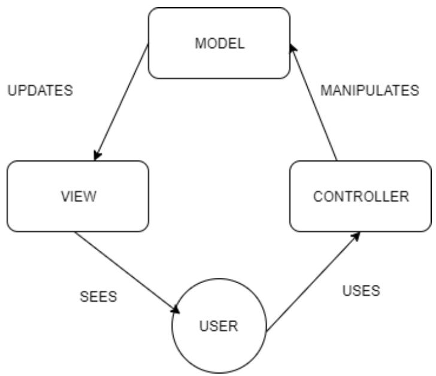

<details>
<summary>flowchart</summary>

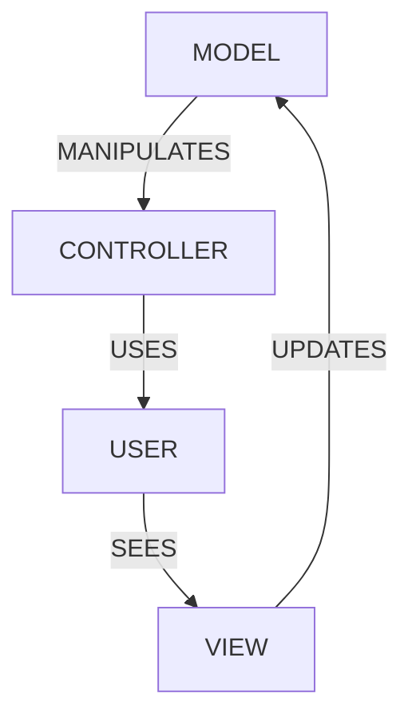
```mermaid
graph TD
    A["MODEL"] -->|MANIPULATES| B["CONTROLLER"]
    B -->|USES| C["USER"]
    C -->|SEES| D["VIEW"]
    D -->|UPDATES| A
```
</details>

Hình 4.1: Kiến trúc Flux ở frontend

Phía backend được tổ chức theo kiến trúc phân tầng với bốn lớp hoạt động lần lượt từ trên xuống: Router, Middleware, Service và Model. Router đóng vai trò tiếp nhận yêu cầu từ 25 nhóm nghiệp vụ. Lớp Middleware thực hiện xác thực, kiểm tra tính hợp lệ bằng DTO schema và đặc biệt quan trọng trong việc phân quyền truy cập theo vai trò (RBAC), đảm bảo nhân viên chỉ có thể thao tác với dữ liệu đơn hàng và kho bãi thuộc chi nhánh của mình. Tầng Service chịu trách nhiệm tính toán các nghiệp vụ phúc tạp mang tính liên kết như: điều phối đơn đặt hàng online về chi nhánh gần nhất, xử lý luân chuyển hàng hóa giữa các chi nhánh, và tổng hợp báo cáo doanh thu toàn hệ thống. Tầng Model dưới cùng giao tiếp với cơ sở dữ liệu MongoDB, nơi các entity (sản phẩm, đơn hàng, nhân viên) đều được thiết kế để tham chiếu chặt chế đến định danh của từng chi nhánh.

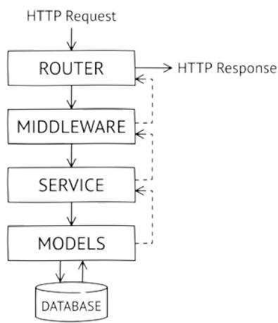

<details>
<summary>flowchart</summary>

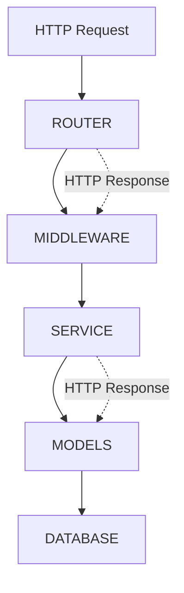
```mermaid
graph TD
    A["HTTP Request"] --> B["ROUTER"]
    B --> C["MIDDLEWARE"]
    C --> D["SERVICE"]
    D --> E["MODELS"]
    E --> F["DATABASE"]
    B -.->|HTTP Response| C
    D -.->|HTTP Response| E
```
</details>

Hình 4.2: Kiến trúc phân tầng ở backend

Ngoài ra, hạ tầng backend còn sử dụng Redis làm bộ nhớ đệm để giảm tải truy vấn sản phẩm cho MongoDB, Elasticsearch để hỗ trợ tìm kiếm sản phẩm một cách nhanh chóng, và Socket.IO để phân luồng sự kiện thời gian thực (ví dụ: đẩy thông báo có đơn hàng mới về cho nhân viên tương ứng). Tóm lại, mô hình này cung cấp một nền tảng vững chắc, linh hoạt để hệ thống Apex vận hành trơn tru quy mô bán lẻ nhiều điểm bán.

# 4.1.2 Thiết kế tổng quan

Hệ thống vận hành dựa trên kiến trúc client-server, tách biệt hoàn toàn giao diện người dùng (frontend) và hệ thống quản trị trung tâm (backend). Các dịch vụ được đóng gói độc lập qua Docker với Nginx làm reverse proxy, đảm bảo khả năng mở rộng khi số lượng chi nhánh tăng lên.

Về mặt xử lý, frontend kiểm soát trạng thái bằng kiến trúc Flux thông qua Redux Toolkit, giúp lường dữ liệu đi theo một chiều khép kín. Giao diện (View) chỉ phát

# CHƯƠNG 4. PHÂN TÍCH THIẾT KẾ, TRIỂN KHAI VÀ ĐÁNH GIÁ HỆ THỐNG

ra các Action, qua Thunk Middleware gọi API, sau đó cập nhật kết quả vào Store duy nhất. Luồng xử lý này giúp frontend dễ dàng "chuyển đổi ngữ cảnh" khi người dùng hoặc quản lý muốn xem dữ liệu (sản phẩm, khuyến mãi, tồn kho) của các chi nhánh khác nhau mà không làm xung đột dữ liệu.

Trong khi đó, backend là hạt nhân điều phối toàn bộ luồng vận hành của chuỗi bán lẻ thông qua kiến trúc bốn tầng nghiệm ngặt. Router định tuyến yêu cầu; Middleware tiền xử lý dữ liệu và đảm bảo tính cô lập dữ liệu giữa các chi nhánh qua hệ thống phân quyền; Service giải quyết các bài toán cốt lỗi của mô hình đa chi nhánh (tối ưu vận chuyển, kiểm soát tồn kho chéo); và Model quản lý tương tác với cơ sở dữ liệu MongoDB - nơi cấu trúc dữ liệu được phân mảnh logic theo từng điểm bán.

Để tối ưu hóa luồng nghiệp vụ lớn, backend tích hợp thêm Redis để cache trạng thái kho của từng chi nhánh, Elasticsearch để lọc sản phẩm theo mức độ khả dụng tại chi nhánh địa phương, và Socket.IO để đồng bộ trạng thái đơn hàng theo thời gian thực tới các quản lý cửa hàng. Nhìn chung, cấu trúc phân tách rõ ràng này giúp hệ thống Apex đáp ứng trọn vẹn sự phúc tạp của một nền tầng thương mại điện tử có nhiều điểm phân phối vật lý, đồng thời tạo thuận lợi cho việc bảo trì mã nguồn.

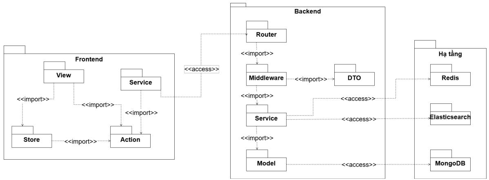

<details>
<summary>flowchart</summary>

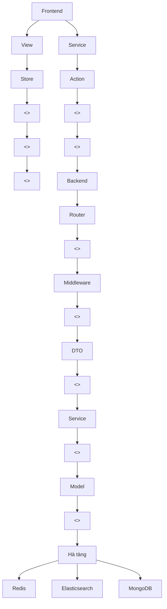
```mermaid
graph TD
    A["Frontend"] --> B["View"]
    A --> C["Service"]
    B --> D["Store"]
    C --> E["Action"]
    D --> F["<<import>>"]
    E --> G["<<import>>"]
    F --> H["<<import>>"]
    G --> I["<<import>>"]
    H --> J["<<access>>"]
    I --> K["Backend"]
    K --> L["Router"]
    L --> M["<<import>>"]
    M --> N["Middleware"]
    N --> O["<<import>>"]
    O --> P["DTO"]
    P --> Q["<<access>>"]
    Q --> R["Service"]
    R --> S["<<import>>"]
    S --> T["Model"]
    T --> U["<<access>>"]
    U --> V["Hà tàng"]
    V --> W["Redis"]
    V --> X["Elasticsearch"]
    V --> Y["MongoDB"]
```
</details>

Hình 4.3: Biểu đồ phụ thuộc gói

Sau khi có cái nhìn tổng quan về kiến trúc hệ thống, phần này sẽ trình bày thiết kế chi tiết gói áp dụng cho use case Quản lý chương trình khuyến mãi. Qua đó, làm rõ cách thức vận hành cũng như lường đi của dữ liệu giữa các tầng thành phần trong hệ thống.

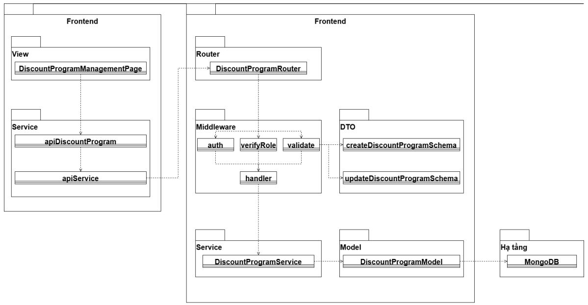

<details>
<summary>flowchart</summary>

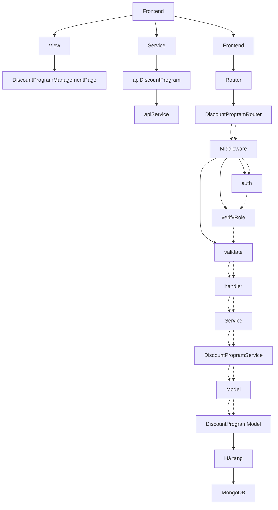
```mermaid
graph TD
    A["Frontend"] --> B["View"]
    B --> C["DiscountProgramManagementPage"]
    A --> D["Service"]
    D --> E["apiDiscountProgram"]
    E --> F["apiService"]
    A --> G["Frontend"]
    G --> H["Router"]
    H --> I["DiscountProgramRouter"]
    I --> J["Middleware"]
    J --> K["auth"]
    J --> L["verifyRole"]
    J --> M["validate"]
    M --> N["handler"]
    N --> O["Service"]
    O --> P["DiscountProgramService"]
    P --> Q["Model"]
    Q --> R["DiscountProgramModel"]
    R --> S["Hà tàng"]
    S --> T["MongoDB"]
    I -.-> J
    J -.-> K
    K -.-> L
    L -.-> M
    M -.-> N
    N -.-> O
    O -.-> P
    P -.-> Q
    Q -.-> R
```
</details>

Hình 4.4: Thiết kế chi tiết gói cho use case Quản lý chương trình khuyến mãi

Khi quản trị viên thực hiện các thao tác quản lý chương trình khuyến mãi (bao gồm xem danh sách, tạo mới, cập nhật hoặc xóa), yêu cầu sẽ được khởi tạo từ lớp View, cụ thể là thành phần DiscountProgramManagementPage. Lớp này phụ thuộc vào module apiDiscountProgram thuộc gói Service ở phía client để thực hiện các lời gọi HTTP tương ứng. Module apiDiscountProgram không trực tiếp thiết lập kết nối mạng mà ủy thác toàn bộ cho đối tượng apiService. Đây là một lớp Singleton dùng chung cho toàn ứng dụng, chịu trách nhiệm cấu hình các thông số như Base URL, timeout, đồng thời tự động xử lý cơ chế làm mới mã thông báo (refresh token) khi phiên đăng nhập hết hạn. Tại tầng giao diện, dữ liệu hiển thị được quản lý cục bộ thông qua hook useState thatay vì lưu trữ trong Redux Store, do thông tin về chương trình khuyến mãi mang tính độc lập và không cần chia sẻ sang các trang khác.

Sau khi apiService gửi yêu cầu HTTP đến server, yêu cầu này sẽ được tiếp nhận bởi DiscountProgramRouter trong gói Router. Router đóng vai trò định tuyến và chuyển tiếp yêu cầu qua một chuỗi các Middleware theo thứ tự cố định trước khi vào tầng xử lý logic. Đầu tiên, middleware auth tiến hành giải mã mã thông báo JWT từ cookie để xác thực danh tính người dùng; tiếp theo, verifyRole sẽ kiểm tra quyền hạn của tài khoản và chặn đúng yêu cầu nếu người dùng không có quyền ADMIN. Đối với các endpoint yêu cầu gửi kèm dữ liệu (tạo mới, cập nhật), middleware validate sẽ được kích hoạt, sử dụng các schema định nghĩa trong gói DTO (như createDiscountProgramSchema hoặc updateDiscountProgramSchema) để kiểm tra tính hợp lệ và chuẩn hóa dữ liệu đầu vào. Môi quan hệ giữa validate và các lớp DTO là quan hệ phụ

# CHƯƠNG 4. PHÂN TÍCH THIẾT KẾ, TRIỂN KHAI VÀ ĐÁNH GIÁ HỆ THỐNG

thuộc tuyến tính theo chiều ngang, thể hiện rõ vai trò hỗ trợ kiểm thử dữ liệu cho tầng Middleware.

Khi vượt qua toàn bộ các bước kiểm tra của Middleware, luồng xử lý sẽ gọi đến gói Service, cụ thể là lớp DiscountProgramService để thực hiện các nghiệp vụ cốt lỗi. Lớp này đảm nhận việc xử lý các thao tác CRUD (tạo, đọc, cập nhật, xóa) chương trình khuyến mãi, đồng thời cung cấp các phương thức như getActivePrograms() và computeEffectivePrice() để phục vụ cho luồng đặt hàng ở các use case khác. Về mặt lưu trữ, DiscountProgramService phụ thuộc trực tiếp vào DiscountProgramModel trong gói Model để thực hiện đọc/ghi dữ liệu xuống có sở dữ liệu MongoDB. Việc DiscountProgramModel là thực thể duy nhất trong gói Model của chức năng này phần ánh đúng thực tế thiết kế: nghiệp vụ quản lý khuyến mãi chỉ thao tác độc lập trên một collection duy nhất và không cần tham chiếu (reference) sang các collection khác.

Tổng kết lại, kiến trúc thiết kế này đảm bảo tính tưởng minh và kiểm soát chặt chẽ luồng dữ liệu: mọi giao tiếp mạng của client đều được chuẩn hóa qua một cửa ngõ duy nhất là apiService, dữ liệu đầu vào tại server luôn được lọc sạch và kiểm thử nghiệm ngặt tại tầng Middleware trước khi chậm tối tầng nghiệp vụ, từ đó giảm thiểu tối đa các lỗi hệ thống và tăng cường tính bảo mật.

# 4.2 Thiết kế chi tiết

# 4.2.1 Thiết kế giao diện

Giao diện của hệ thống Apex được thiết kế theo hướng tối giãn, ưu tiên trải nghiệm người dùng và tính nhất quán trực quan xuyên suốt toàn bộ ứng dụng. Phần giao diện người dùng cuối (khách hàng) và giao diện quản trị được tách biệt rõ ràng về bổ cục, điều hướng và ngôn ngữ hiện thị.

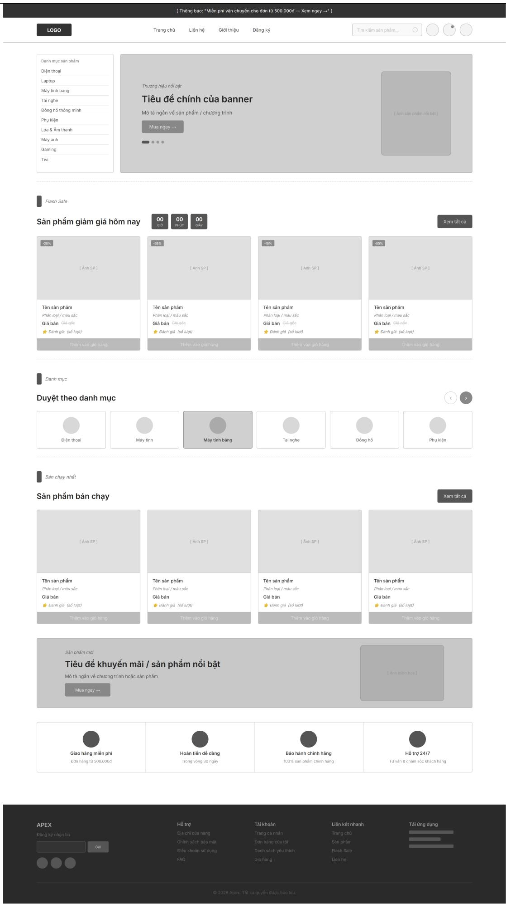

<details>
<summary>text_image</summary>

[ Thông báo: "Miền phi vận chuyển cho đơn từ $500.000d — Xem ngay →"]
LOGO
Trang chủ
Liên hệ
Gidi thiệu
Đăng ký
Tìm kiếm sản phẩm...
Danh mục sản phẩm
Diện thoại
Laptop
Mãy tính bảng
Tai nghe
Đồng hồ thống minh
Phụ kiến
Loa & Âm thanh
Mãy ảnh
Gaming
Tivi
Trường hiệu nổi bật
Tiêu để chính của banner
Mô tả ngắn về sản phẩm / chương trình
Mua ngay →
[ Ảnh sản phẩm nổi bật ]
Flash Sale
Sản phẩm giảm giá hôm nay
00 GIO
00 MORT
00 GIARY
Xem tất cả
-26%
[ Ảnh SP ]
Tên sản phẩm
Phân loại / màu sắc
Giá bán Giáp-gệ
Đánh giá (số juột)
Thêm vào gió hàng
-38%
[ Ảnh SP ]
Tên sản phẩm
Phân loại / màu sắc
Giá bán Giáp-gệ
Đánh giá (số juột)
Thêm vào gió hàng
-5%
[ Ảnh SP ]
Tên sản phẩm
Phân loại / màu sắc
Giá bán Giáp-gệ
Đánh giá (số juột)
Thêm vào gió hàng
-90%
[ Ảnh SP ]
Tên sản phẩm
Phân loại / màu sắc
Giá bán Giáp-gệ
Đánh giá (số juột)
Thêm vào gió hàng
Danh mục
Duyệt theo danh mục
Deện thoại
Mãy tính
Mãy tính bảng
Tai nghe
Đồng hồ
Phụ kiện
Bản chạy nhất
Sản phẩm bán chạy
Xem tất cả
[ Ảnh SP ]
Tên sản phẩm
Phân loại / màu sắc
Giá bán
Đánh giá (số juột)
Thêm vào gió hàng
[ Ảnh SP ]
Tên sản phẩm
Phân loại / màu sắc
Giá bán
Đánh giá (số juột)
Thêm vào gió hàng
[ Ảnh SP ]
Tên sản phẩm
Phân loại / màu sắc
Giá bán Giáp-gệ
Đánh giá (số juột)
Thêm vào gió hàng
[ Ảnh SP ]
Tên sản phẩm
Phân loại / màu sắc
Giá bán Giáp-gệ
Đánh giá (số juột)
Thêm vào gió hàng
Bản chạy mđi
Tiêu để khuyến mãi / sản phẩm nối bật
Mô tả ngắn về chương trình hoặc sản phẩm
Mua ngay →
[ Ảnh minh tọa ]
Giao hàng miễn phí
Đơn hàng từ 500.000d
Hoàn tiến đề đăng
Trong vòng 30 ngày
Bảo hành chính hàng
100% sản phẩm chính hàng
Hỗ trợ 24/7
Tư vấn & chăm sóc khách hàng
APEX
Đăng ký nhận tin
Gũi
Hỗ trợ
Địa chỉ của hàng
Chính sách bảo mật
Điều khoản sız dụng
FAIQ
Tài khoản
Trang cả nhân
Đơn hàng của tôi
Danh sách yêu thích
Giá hàng
Liên hệ
Tải ứng dụng
</details>

Hình 4.5: Thiết kế giao diện Trang chủ

# CHƯƠNG 4. PHÂN TÍCH THIẾT KẾ, TRIỂN KHAI VÀ ĐÁNH GIÁ HỆ THỐNG

Trang chủ là điểm tiếp xúc đầu tiên giữa khách hàng và hệ thống. Bố cục được tổ chức theo chiều dọc gồm các khu vực chức năng liên tiếp: thanh thông báo khuyến mãi ở đầu trang, tiếp theo là header chứa logo thương hiệu, thanh điều hướng, thanh tìm kiếm và các biểu tượng giờ hàng – tài khoản. Phần nội dung chính bao gồm khu vực hero với danh mục sản phẩm bên trái và banner quảng cáo bên phải, tiếp theo là các khối sản phẩm nổi bạt như flash sale có đồng hồ đếm ngược, lưới danh mục, sản phẩm bán chạy, và đãi dịch vụ ở cuối trang.

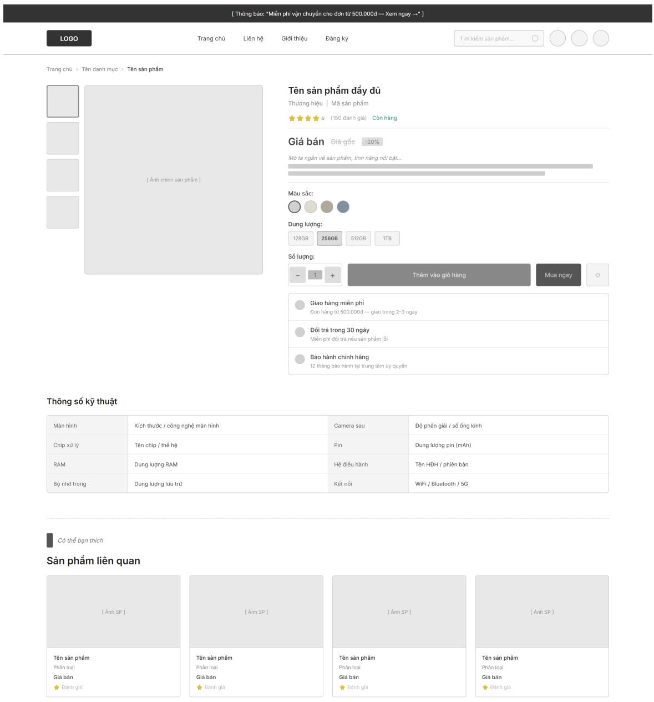

<details>
<summary>text_image</summary>

[Thông báo: "Miễn phí vận chuyển cho đơn tử 500.000đ — Xem ngay →"]
LOGO
Trang chủ
Liền hệ
Giới thiệu
Đăng ký
Tìm kiếm sản phẩm...
Trang chủ > Tên danh mục > Tên sản phẩm
[Ảnh chính sản phẩm]
Tên sản phẩm đầy đủ
Thường hiệu | Mã sản phẩm
★★★★★ (150 đánh giá) Còn hàng
Giá bán
Giá gốc -20%
Mô tả ngắn về sản phẩm, tỉnh năng nối bật...
Màu sắc:
Dung lượng:
128GB 256GB 512GB 1TB
Số lượng:
- 1 +
Thêm vào gió hàng
Mua ngay
Giao hàng miễn phí
Đơn hàng từ 500.000đ — giao trong 2~3 ngày
Đổi trả trong 30 ngày
Miễn phí đối trả nếu sản phẩm lỗi
Bảo hành chính hàng
12 tháng bảo hành tại trung tâm ủy quyền
Thông số kỹ thuật
Mân hình
Kích thước / công nghệ màn hình
Camera sau
Độ phân giải / số ống kính
Chip xử lý
Tên chip / thể hệ
Pin
Dung lượng pin (mAh)
RAM
Dung lượng RAM
Hệ điều hành
Tên HĐH / phiên bản
Bộ nhđ trong
Dung lượng lưu trữ
Kết nối
WiFi / Bluetooth / 5G
Có thể bạn thích
Sản phẩm liên quan
[Ảnh SP]
[Ảnh SP]
[Ảnh SP]
[Ảnh SP]
Tên sản phẩm
Phân loại
Giá bán
Giá bản
Tên sản phẩm
Phân loại
Giá bán
Tên sản phẩm
Phân loại
Giá bán
Tên sản phẩm
Giá bản
</details>

Hình 4.6: Thiết kế giao diện Trang chi tiết sản phẩm

Trang chi tiết sản phẩm cung cấp đầy đủ thông tin cần thiết để người dùng đưa ra quyết định mua hàng. Giao diện được chia thành hai cột: cột trái hiển thị bộ ảnh sản phẩm gồm ảnh thu nhỏ và ảnh chính phóng to; cột phải trình bày tên sản phẩm, thương hiệu, mã sản phẩm, đánh giá sao, giá bán kèm giá gốc và phần trăm giảm giá, tiếp theo là bộ lọc lựa chọn biến thể (màu sắc, dung lượng), bộ chọn số lượng và các nút hành động "Thêm vào giờ hàng" và "Mua ngay". Phía dưới cột phải là khung thông tin giao hàng, đối trả và bảo hành. Phần bằng thông số kỹ thuật và danh sách sản phẩm liên quan được bố trí ở cuối trang.

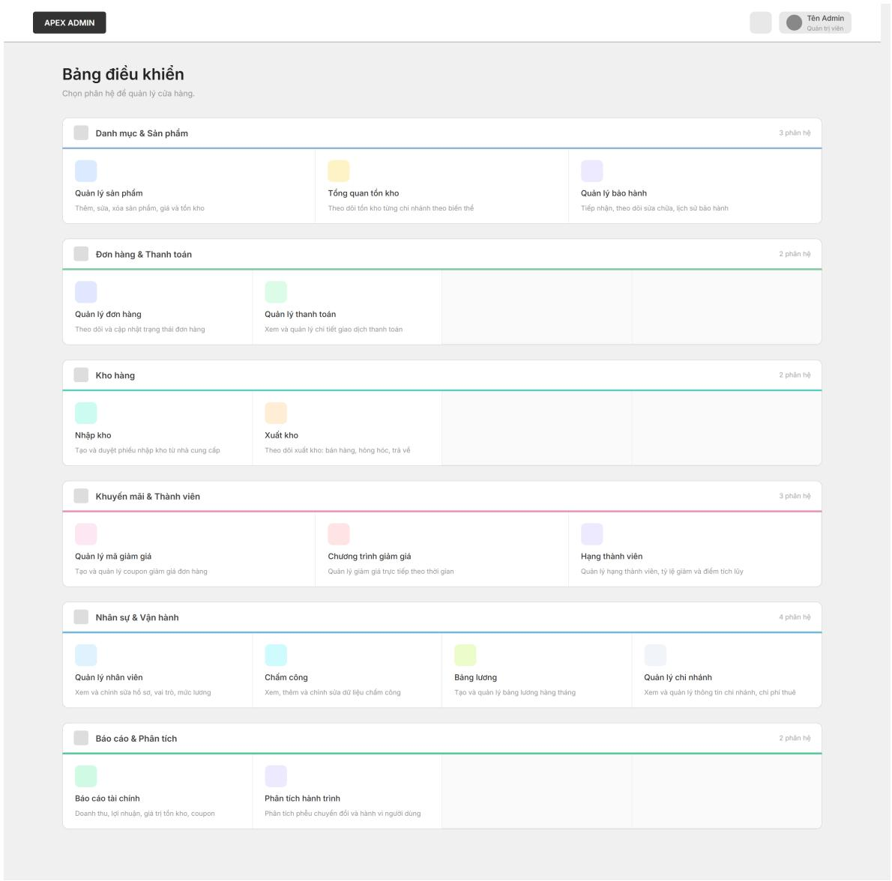

<details>
<summary>text_image</summary>

Bảng điều khiển
Chọn phân hệ để quản lý của hàng.
Danh mục & Sản phẩm
3 phân hệ
Quản lý sản phẩm
Thêm, sữa, xóa sản phẩm, giả và tổn kho
Tổng quan tổn kho
Theo đối tổn kho từng chi nhánh theo biến thế
Quản lý bảo hành
Tiếp nhận, theo dõi sữa chữa, lịch sử bảo hành
Đơn hàng & Thanh toán
2 phân hệ
Quản lý đơn hàng
Theo dõi và cấp nhật trạng thái đơn hàng
Quản lý thanh toán
Xem và quản lý chi tiết giao dịch thanh toán
Kho hàng
2 phân hệ
Nhập kho
Tạo và duyệt phiếu nhập kho từ nhà cung cấp
Xuất kho
Theo đối xuất kho: bán hàng, hỏng hốc, trả vế
Khuyến mãi & Thành viên
3 phân hệ
Quản lý mã giảm giá
Tạo và quản lý coupon giảm giá đơn hàng
Chương trình giảm giá
Quản lý giảm giá trực tiếp theo thời gian
Hạng thành viên
Quản lý hạng thành viên, tỷ lệ giảm và điểm tích lũy
Nhân sự & Vận hành
4 phân hệ
Quản lý nhân viên
Xem và chính sửa hồ sơ, val trò, mức lượng
Chấm công
Xem, thêm và chính sửa dữ liệu chấm công
Băng lượng
Tạo và quản lý bảng lượng hàng tháng
Quản lý chi nhánh
Xem và quản lý thông tin chi nhánh, chi phí thuê
Báo cáo & Phân tích
2 phân hệ
Báo cáo tài chính
Doanh thu, lợi nhuận, giá trị tổn kho, coupon
Phân tích hành trình
Phân tích phẫu chuyển đổi và hành vi người dùng
</details>

Hình 4.7: Thiết kê giao diện Trang quản trị

Giao diện quản trị được thiết kế theo mô hình bằng điều khiển phân chia theo module, trong đó toàn bộ chức năng được nhóm lại thành sáu nhóm nghiệp vụ chính: Danh mục & Sản phẩm, Đơn hàng & Thanh toán, Kho hàng, Khuyến mãi & Thành viên, Nhân sự & Vận hành, và Báo cáo & Phân tích. Mỗi nhóm được trình bày dưới dạng một khối card lưới, trong đó mỗi thể module hiển thị biểu tượng, tên phân hệ và mô tả ngắn về chức năng. Thiết kế này giúp quản trị viên nhanh chóng định vị và truy cập phân hệ cần thiết mà không cần điều hướng qua nhiều

cấp menu.

# 4.2.2 Thiết kê lớp

Phần này trình bày thiết kế chi tiết của ba lớp service cốt lỗi phụ trách quản lý sản phẩm và kho hàng: ProductService, InventoryService và Stock-ExportService.

ProductService (Hình 4.8) là lớp trung tâm quản lý vòng đời của sản phẩm. Lớp này phụ thuộc trực tiếp vào ProductModel và CategoryModel để thao tác dữ liệu, đồng thời liên kết với BranchInventoryModel để kiểm tra tình trạng tồn kho khi trả kết quả về client. Ngoài ra, ProductService phối hợp với DiscountProgramService để tính giá hiệu lực của từng biến thể sản phẩm. Hai thành phần hạ tầng cũng được tích hợp trực tiếp: Redis dùng để cache danh sách sản phẩm nhằm giảm tải truy vấn lặp lại, và Elasticsearch để đồng bộ chỉ mục mỗi khi dữ liệu sản phẩm thay đổi thông qua hàm nội bộ syncProductToElastic. Các nghiệp vụ chính bao gồm thêm mới, cập nhật thông tin, ấn/hiện sản phẩm và truy vấn tình trạng tồn kho theo chi nhánh.

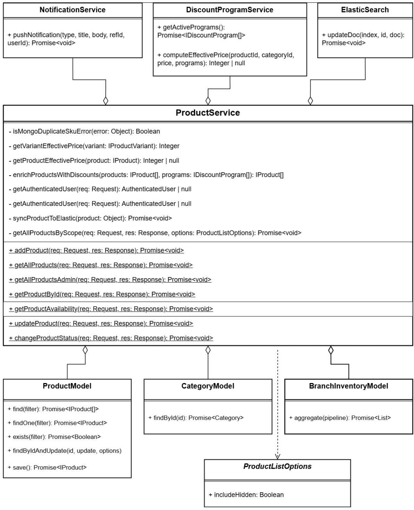

<details>
<summary>flowchart</summary>

```mermaid
graph TD
    A["NotificationService"] --> B["+ pushNotification(type, title, body, refId, userId): Promise<void>"]
    C["DiscountProgramService"] --> D["+ getActivePrograms(): Promise<IDiscountProgram["]> + computeEffectivePrice(productId, categoryId, price, programs): Integer | null]
    E["ElasticSearch"] --> F["+ updateDoc(index, id, doc): Promise<void>"]
    G["ProductService"] --> H["-- isMongoDuplicateSkuError(error: Object): Boolean<br>-- getVariantEffectivePrice(variant: IProductVariant): Integer<br>-- getProductEffectivePrice(product: IProduct): Integer | null<br>-- enrichProductsWithDiscounts(products: IProduct["], programs: IDiscountProgram[]): IProduct[]
-- getAuthenticatedUser(req: Request): AuthenticatedUser | null
-- getAuthenticatedUser(req: Request): AuthenticatedUser | null
-- syncProductToElastic(product: Object): Promise<void>
-- getAllProductsByScope(req: Request, res: Response, options: ProductListOptions): Promise<void>]
    H --> I["+ addProduct(req: Request, res: Response): Promise<void"]
+ getAllProducts(req: Request, res: Response): Promise<void]
+ getAllProductsAdmin(req: Request, res: Response): Promise<void]
+ getProductById(req: Request, res: Response): Promise<void>]
    I --> J["+ getProductAvailability(req: Request, res: Response): Promise<void>"]
    J --> K["+ updateProduct(req: Request, res: Response): Promise<void"]
+ changeProductStatus(req: Request, res: Response): Promise<void>]
    L["ProductModel"] --> M["+ find(filter): Promise<IProduct["]> + findOne(filter): Promise<IProduct> + exists(filter): Promise<Boolean> + findByIdAndUpdate(id, update, options) + save(): Promise<IProduct>]
    N["CategoryModel"] --> O["+ findById(id): PromiseVariely>"]
    P["BranchInventoryModel"] --> Q["+ aggregate(pipeline): PromiseListing>"]
    R["ProductListOptions"] --> S["+ includeHidden: Boolean"]
```
</details>

Hình 4.8: Thiết kế lớp ProductService

InventoryService (Hình 4.9) chịu trách nhiệm tra cứu và hiển thị trạng thái tồn kho theo chiều đa chi nhánh. Lớp này truy vấn BranchInventory-Model — bằng lưu số lượng và danh sách IMEI theo từng cập (chi nhánh, SKU) — và kết hợp với ProductModel, BranchModel để làm giàu dữ liệu trả về. Hàm nội bộ buildZeroQuantitySearchRows xử lý trường hợp đặc biệt: tìm kiếm các SKU chưa có bản ghi tồn kho tại chi nhánh, hỗ trợ nhân viên kho lập phiếu nhập hàng. lookupImei cho phép truy vết IMEI cụ thể trên toàn hệ thống, phục vụ quy trình tiếp nhận bảo hành.

CHƯƠNG 4. PHÂN TÍCH THIẾT KẾ, TRIỂN KHAI VÀ ĐÁNH GIÁ HỆ THỐNG   
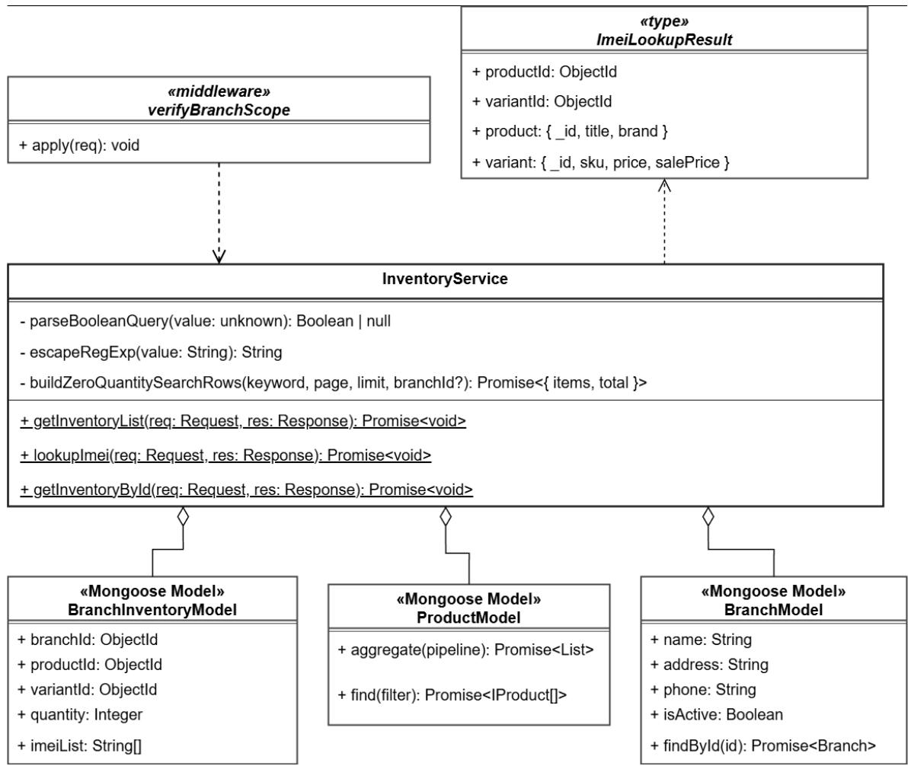

<details>
<summary>flowchart</summary>

```mermaid
graph TD
    A["«middleware» verifyBranchScope"] --> B["InventoryService"]
    C["«type» lmeiLookupResult"] --> B
    B --> D["«Mongose Model» BranchInventoryModel"]
    B --> E["«Mongose Model» ProductModel"]
    B --> F["«Mongose Model» BranchModel"]
    D --> G["+ branchId: ObjectId"]
    D --> H["+ productId: ObjectId"]
    D --> I["+ variantId: ObjectId"]
    D --> J["+ quantity: Integer"]
    D --> K["+ imeiList: String"]]
    E --> L["+ aggregate(pipeline): Promise<List>"]
    E --> M["+ find(filter): Promise<IProduct["]>]
    F --> N["+ name: String"]
    F --> O["+ address: String"]
    F --> P["+ phone: String"]
    F --> Q["+ isActive: Boolean"]
    F --> R["+ findById(id): Promise<Branch>"]
    A -.-> B
```
</details>

Hình 4.9: Thiết kế lớp InventoryService

StockExportService (Hình 4.10) quản lý toàn bộ lường xuất kho, bao gồm cả xuất kho thủ công lẫn xuất kho tự động khi đơn hàng được thanh toán thành công. Hai hàm nội bộ validateImeiAvailability và deductInventory đảm bảo tính nhất quán: mọi thao tác kiểm tra và trừ IMEI khởi Branch-InventoryModel đều được thực thi bên trong MongoDB transaction. Phiếu xuất thủ công hỗ trợ machine trạng thái với hai nhánh chuyển từ PENDING: duyệt sang COMPLETED (trừ kho) hoặc hủy sang CANCELLED (giữ nguyên kho). Hàm reverseInventoryForOrder xử lý nghiệp vụ hoàn kho khi đơn hàng bị hủy, đảm bảo số liệu tồn kho luôn đồng bộ với thực tế.

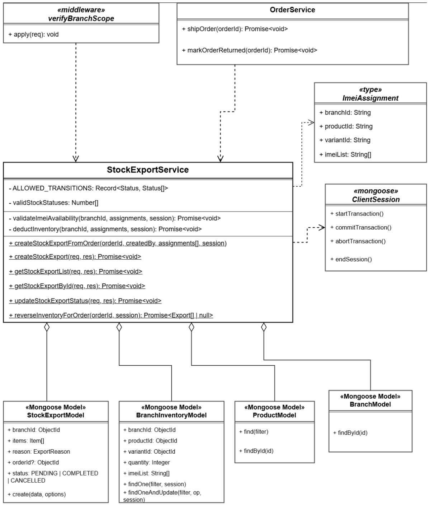

<details>
<summary>flowchart</summary>

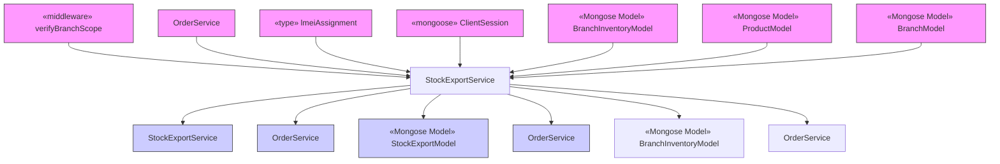
```mermaid
graph TD
    A["«middleware» verifyBranchScope"] --> B["StockExportService"]
    C["OrderService"] --> B
    D["«type» lmeiAssignment"] --> B
    E["«mongoose» ClientSession"] --> B
    F["«Mongose Model» BranchInventoryModel"] --> B
    G["«Mongose Model» ProductModel"] --> B
    H["«Mongose Model» BranchModel"] --> B
    B --> I["StockExportService"]
    B --> J["OrderService"]
    B --> K["«Mongose Model» StockExportModel"]
    B --> L["OrderService"]
    B --> M["«Mongose Model» BranchInventoryModel"]
    B --> N["OrderService"]
    style A fill:#f9f,stroke:#333
    style C fill:#f9f,stroke:#333
    style D fill:#f9f,stroke:#333
    style E fill:#f9f,stroke:#333
    style F fill:#f9f,stroke:#333
    style G fill:#f9f,stroke:#333
    style H fill:#f9f,stroke:#333
    style I fill:#ccf,stroke:#333
    style J fill:#ccf,stroke:#333
    style K fill:#ccf,stroke:#333
    style L fill:#ccf,stroke:#333
```
</details>

Hình 4.10: Thiết kế lớp StockExportService

# a, Trình tự use case Mua hàng & Thanh toán

Hình 4.11 minh họa luồng phối hợp giữa các lớp trong use case mua hàng và thanh toán trực tuyến. Người dùng đặt hàng, OrderService mở transaction kiểm tra tồn kho và tạo đơn. PaymentService gọi StripeService để tạo Checkout Session và trả URL về client. Sau khi thanh toán hoàn tất, callback từ Stripe được xử lý bởi paymentCheckUpdate: cập nhật trạng thái, tích điểm và gửi thông báo.

# CHƯƠNG 4. PHÂN TÍCH THIẾT KẾ, TRIỂN KHAI VÀ ĐÁNH GIÁ HỆ THỐNG

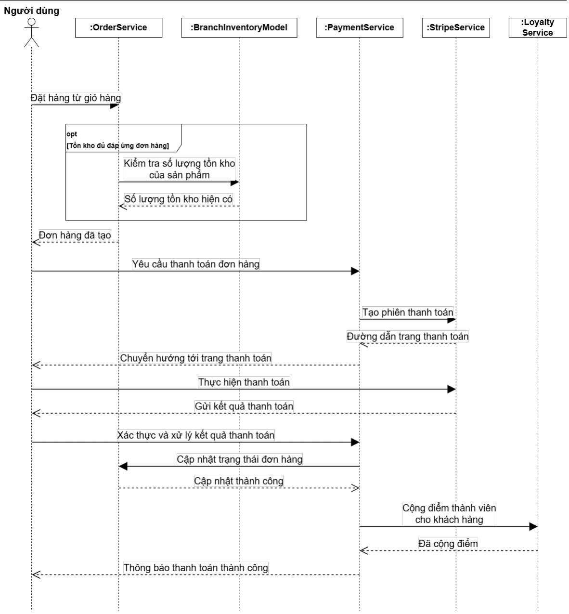

<details>
<summary>flowchart</summary>

```mermaid
graph TD
    A["Người dùng"] --> B[":OrderService"]
    A --> C[":BranchInventoryModel"]
    A --> D[":PaymentService"]
    A --> E[":StripeService"]
    A --> F[":Loyalty Service"]

    B --> G["Đặt hàng từ gió hàng"]
    C --> H["opt [Tổn kho đủ đáp ứng đơn hàng"]]
    C --> I["Kiểm tra số lượng tồn kho của sản phẩm"]
    C --> J["Số lượng tồn kho hiện có"]
    D --> K["Đơn hàng đã tạo"]
    E --> L["Yêu cầu thanh toán đơn hàng"]
    F --> M["Tạo phiên thanh toán"]
    F --> N["Đường dẫn trang thanh toán"]
    G --> O["Chuyển hướng tới trang thanh toán"]
    H --> P["Thực hiện thanh toán"]
    I --> Q["Gửi kết quả thanh toán"]
    J --> R["Xác thực và xử lý kết quả thanh toán"]
    K --> S["Cập nhật trạng thái đơn hàng"]
    L --> T["Cập nhật thành công"]
    M --> U["Cộng điểm thành viên cho khách hàng"]
    N --> V["Đã cộng điểm"]
    O --> W["Thông báo thanh toán thành công"]
    P --> X["Thực hiện thanh toán"]
    Q --> Y["Xác thực và xử lý kết quả thanh toán"]
    R --> Z["Cập nhật trạng thái đơn hàng"]
    S --> AA["Thông báo thanh toán thành công"]
    T --> AB["Cộng điểm thành viên cho khách hàng"]
    U --> AC["Thực hiện thanh toán"]
    V --> AD["Cập nhật thành công"]
    W --> AE["Thực hiện thanh toán"]
```
</details>

Hình 4.11: Sở đồ tuần tự use case Mua hàng & Thanh toán

# b, Trình tự use case Quản lý xuất kho

Hình 4.12 trình bày luồng tạo và duyệt phiếu xuất kho thủ công. Khi nhân viên tạo phiếu, StockExportService lần lượt xác thực chi nhánh qua Branch-Model, kiểm tra sự tồn tại của sản phẩm và variant qua ProductModel, sau đó mỗ transaction để kiểm tra IMEI trong BranchInventoryModel. Nếu hợp lệ, phiếu được tạo với trạng thái COMPLETED và tồn kho được trừ ngay trong cùng transaction. Với phiếu ở trạng thái PENDING, nhân viên có thể duyệt sang COMPLETED (lắp lại kiểm tra IMEI và trừ kho) hoặc hủy sang CANCELLED (không thay đổi tồn kho), toàn bộ đảm bảo tính nhất quán qua MongoDB transaction.

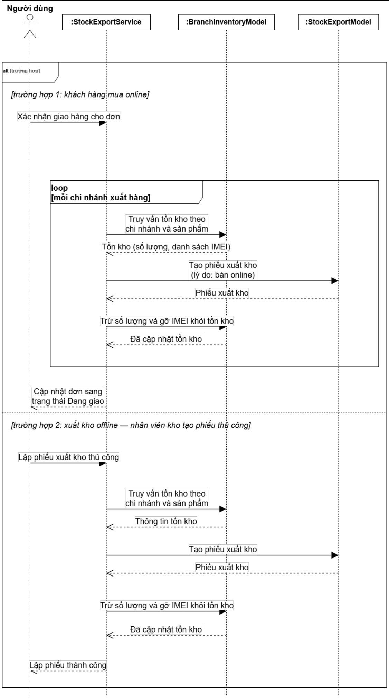

<details>
<summary>flowchart</summary>

```mermaid
graph TD
    A["Người dùng"] --> B[":StockExportService"]
    A --> C[":BranchInventoryModel"]
    A --> D[":StockExportModel"]

    E["alt [trường hợp"]] --> F["[trường hợp 1: khách hàng mua online"]]
    F --> G["Xác nhận giao hàng cho đơn"]

    H["loop [mỗi chi nhánh xuất hàng"]] --> I["Truy vấn tồn kho theo chi nhánh và sản phẩm"]
    I --> J["Tồn kho (số lượng, danh sách IMEI)"]
    J --> K["Tạo phiếu xuất kho (lý do: bán online)"]
    K --> L["Phiếu xuất kho"]
    L --> M["Trừ số lượng và gỗ IMEI khởi tồn kho"]
    M --> N["Đã cập nhật tồn kho"]

    O["Cập nhật đơn sang trang thái Đang giao"] --> P["[trường hợp 2: xuất kho offline — nhân viên kho tạo phiếu thủ công"]]
    P --> Q["Lập phiếu xuất kho thủ công"]
    Q --> R["Truy vấn tồn kho theo chi nhánh và sản phẩm"]
    R --> S["Thông tin tồn kho"]
    S --> T["Tạo phiếu xuất kho"]
    T --> U["Phiếu xuất kho"]
    U --> V["Trừ số lượng và gỗ IMEI khởi tồn kho"]
    V --> W["Đã cập nhật tồn kho"]
    W --> X["Lập phiếu thành công"]
```
</details>

Hình 4.12: Sở đồ tuần tự use case Quản lý xuất kho

# c, Trình tự use case Tiếp nhận bảo hành

Hình 4.13 mô tả luồng tiếp nhận thiết bị bảo hành tại chi nhánh. Nhân viên tra cứu IMEI qua WarrantyService. imei StockLookup: hệ thống tìm bản ghi xuất kho tương ứng trong StockExportModel, sau đó truy ngược用车Model để lấy thông tin khách hàng — giúp tự điển form. Khi nhân viên xác nhận, create WarrantyRequest phân nhánh theo loại khách: nếu có tài khoản thì xác thực qua用车Model, nếu là khách văng lai thì tìm hoặc tạo mới user với email ảo. Phiếu bảo hành được lưu với trạng thái RECEIVED và thông báo được đầy tối khách hàng qua NotificationService.

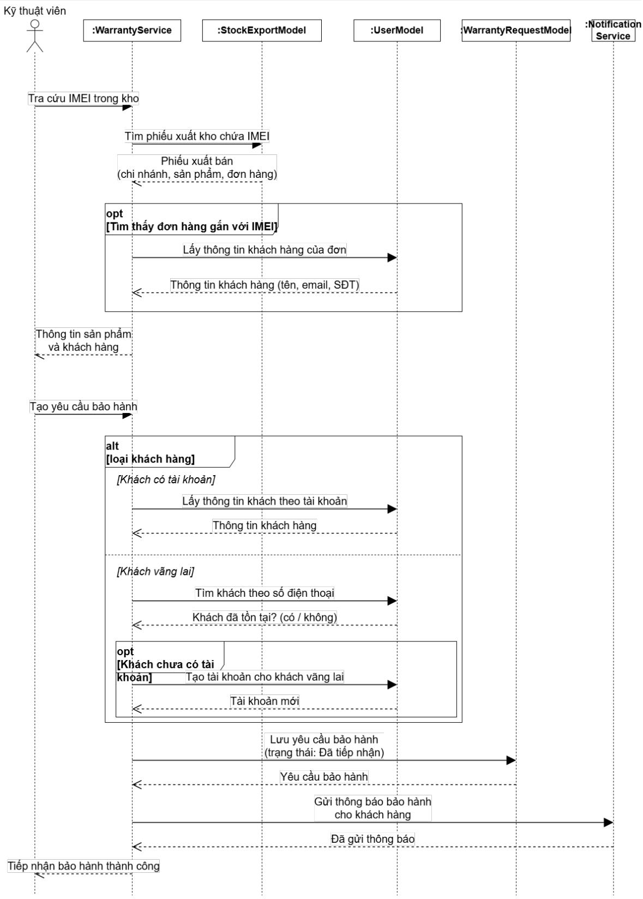

<details>
<summary>flowchart</summary>

```mermaid
graph TD
    A[":WarrantyService"] --> B[":StockExportModel"]
    B --> C[":UserModel"]
    C --> D[":WarrantyRequestMode"]
    D --> E[":Notification Service"]
    F["TracRU IMEI trong kho"] --> G["Tim phieu xuát kho chuá IMEI"]
    G --> H["Phiéu xuát bàn (chi nhánh, sân phám, don hàng)"]
    H --> I["opt [Tim thay don hang gan vói IMEI"]]
    I --> J["Lay thong tin khach hang cua don"]
    J --> K["Thong tin khach hang (tên, email, SDT)"]
    K --> L["Thong tin sân phám và khach hang"]
    L --> M["Tao yeu cuu bao hàn"]
    M --> N["alt [loai khach hang"]]
    N --> O["[Khach có tai khoản"]]
    O --> P["Lay thong tin khach theo tai khoản"]
    P --> Q["Thong tin khach hang"]
    Q --> R["[Khach vang lai"]]
    R --> S["Tim khach theo só dien thoái"]
    S --> T["Khach dā tõn tai? (có / khong)"]
    T --> U["opt [Khach chua có tai khoản"]]
    U --> V["Tao tai khoản cho khach vang lai"]
    V --> W["Tai khoản mói"]
    W --> X["Luu yeu cuu bao hàn (trang thai: Da tiếp nhận)"]
    X --> Y["Yeu cuu bao hàn"]
    Y --> Z["Gui thong bao bao hàn cho khach hang"]
    Z --> AA["Dã gui thong bao"]
    AA --> AB["Tiếp nhan bao hàn thanh cóng"]
```
</details>

Hình 4.13: Sơ đồ tuần tự use case Tiếp nhận bảo hành

# 4.2.3 Thiết kế cơ sở dữ liệu

Hệ thống Apex sử dụng MongoDB — hệ quản trị cơ sở dữ liệu NoSQL hướng tài liệu (document-oriented). Khác với mô hình quan hệ, MongoDB lưu trữ dữ liệu dưới dạng các document JSON với lược đồ linh hoạt, cho phép biểu diễn các cấu

# CHƯƠNG 4. PHÂN TÍCH THIẾT KẾ, TRIỂN KHAI VÀ ĐÁNH GIÁ HỆ THỐNG

trúc lồng nhau một cách tự nhiên. Lựa chọn này phù hợp với đặc thù bán lễ điện tử ở ba khía cạnh: mỗi nhóm sản phẩm (điện thoại, laptop, tai nghe, đồng hồ) có thông số kỹ thuật khác nhau — phù hợp với schema linh hoạt; các bản ghi giao dịch như đơn hàng, phiếu nhập/xuất kho thường được truy xuất cùng với danh mục mặt hàng và danh sách IMEI - phù hợp với cơ chế những (embedding) để giảm phép JOIN; khả năng cấu hình Replica Set hỗ trợ MongoDB Transaction, đảm bảo tính nhất quán cho các nghiệp vụ tồn kho đa chỉ nhánh.

Toàn bộ dữ liệu nghiệp vụ được tổ chức thành 21 collection, phân chia theo 7 nhóm nghiệp vụ. Biểu đồ thực thể liên kết (Hình 4.14) thể hiện các thực thể chính cùng các mối quan hệ giữa chúng.

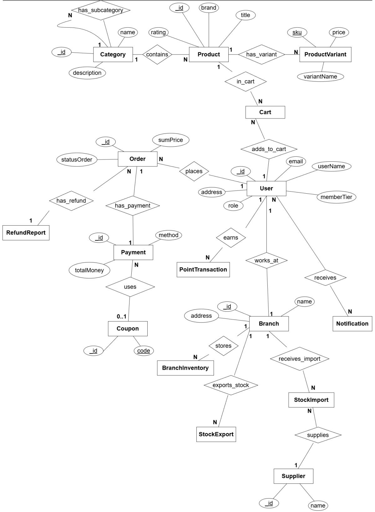

<details>
<summary>flowchart</summary>

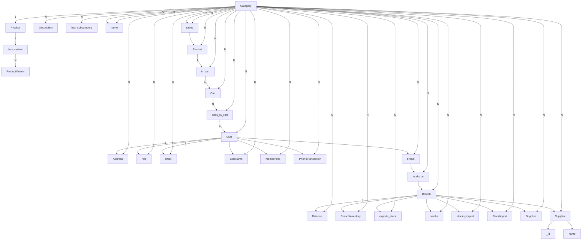
```mermaid
graph TD
    A["Category"] -->|1| B["Product"]
    B -->|1| C["has_variant"]
    C -->|N| D["ProductVariant"]
    A -->|N| E["Description"]
    A -->|N| F["has_subcategory"]
    A -->|N| G["name"]
    A -->|N| H["rating"]
    H --> I["Product"]
    I -->|1| J["in_cart"]
    J -->|N| K["Cart"]
    K -->|N| L["adds_to_cart"]
    L -->|1| M["User"]
    M -->|1| N["Address"]
    M -->|1| O["role"]
    M -->|1| P["email"]
    M --> Q["userName"]
    M --> R["memberTier"]
    M --> S["PhoneTransaction"]
    M --> T["ereals"]
    T --> U["works_at"]
    U --> V["Branch"]
    V -->|1| W["Balance"]
    V --> X["BranchInventory"]
    V --> Y["exports_stock"]
    V --> Z["stocks"]
    V --> AA["stocks_import"]
    V --> AB["StockImport"]
    V --> AC["Supplies"]
    V --> AD["Supplier"]
    AD --> AE["_id"]
    AD --> AF["name"]
    A -->|N| G
    A -->|N| H
    A -->|N| I
    A -->|N| J
    A -->|N| K
    A -->|N| L
    A -->|N| M
    A -->|N| N
    A -->|N| O
    A -->|N| P
    A -->|N| Q
    A -->|N| R
    A -->|N| S
    A -->|N| T
    A -->|N| U
    A -->|N| V
    A -->|N| W
    A -->|N| X
    A -->|N| Y
    A -->|N| Z
    A -->|N| AA
    A -->|N| AB
    A -->|N| AC
    A -->|N| AD
```
</details>

Hình 4.14: Biểu đồ thực thể liên kết

# a, Phân nhóm các collection theo nghiệp vụ

21 collection được tổ chức thành 7 nhóm chức năng, mỗi nhóm phụ trách một măng nghiệp vụ tương ứng với các phân hệ trên giao diện quản trị. Bảng 4.1 liệt kê đầy đủ các collection cùng vai trò của chúng trong hệ thống.

CHƯƠNG 4. PHÂN TÍCH THIẾT KẾ, TRIỂN KHAI VÀ ĐÁNH GIÁ HỆ THỐNG 

<table><tr><td>Nhóm nghiệp vụ</td><td>Collection</td><td>Vai trò</td></tr><tr><td rowspan="2">1. Người dùng &amp; chi nhánh</td><td>User</td><td>Tài khoản người dùng và nhân viên (phân biệt qua role)</td></tr><tr><td>Branch</td><td>Thông tin 33 chi nhánh cùng quản lý và chi phí thuê</td></tr><tr><td rowspan="2">2. Danh mục &amp; sản phẩm</td><td>Category</td><td>Danh mục sản phẩm theo cấu trúc cây (tự tham chiếu)</td></tr><tr><td>Product</td><td>Sản phẩm với các biến thể (variants) và thông số kỹ thuật</td></tr><tr><td rowspan="4">3. Kho hàng &amp; chuỗi cung ứng</td><td>BranchInventory</td><td>Tôn kho theo từng cấp (chi nhánh, biến thể) kèm danh sách IMEI</td></tr><tr><td>Supplier</td><td>Thông tin nhà cung ứng</td></tr><tr><td>StockImport</td><td>Phiếu nhập hàng từ nhà cung cấp</td></tr><tr><td>StockExport</td><td>Phiếu xuất kho</td></tr><tr><td rowspan="4">4. Đơn hàng &amp; thanh toán</td><td>Order</td><td>Đơn đặt hàng với snapshot mặt hàng và IMEI được gán</td></tr><tr><td>Payment</td><td>Thông tin thanh toán (quan hệ 1-1 với Order)</td></tr><tr><td>Coupon</td><td>Mã giảm giá theo phần trăm hoặc số tiền cố định</td></tr><tr><td>DiscountProgram</td><td>Chương trình khuyến mãi tự động theo phạm vi sản phẩm</td></tr><tr><td rowspan="3">5. Tương tác khách hàng</td><td>Cart</td><td>Giố hàng của khách (mỗi dòng một biến thể)</td></tr><tr><td>PointTransaction</td><td>Nhật ký tích/tiêu điểm thành viên</td></tr><tr><td>MemberTierConfig</td><td>Cấu hình hạng thành viên</td></tr><tr><td rowspan="2">6. Bảo hành &amp; sửa chữa</td><td>WarrantyRequest</td><td>Phiếu tiếp nhận bảo hành</td></tr><tr><td>RepairLog</td><td>Nhật ký sửa chữa của kỹ thuật viên</td></tr><tr><td rowspan="2">7. Nhân sự</td><td>Attendance</td><td>Chấm công theo ngày</td></tr><tr><td>Payroll</td><td>Bảng lượng tháng với đầy đủ các khoản thuế và bảo hiểm</td></tr></table>

Bảng 4.1: Phân nhóm 21 collection theo nghiệp vụ

# b, Đặc tả chi tiết các collection trọng tâm

Phần này trình bày chi tiết bốn collection đại diện cho các mẫu thiết kế (design pattern) đặc trưng của hệ thống, bao gồm những tài liệu con, khóa kép, snapshot dữ liệu và tham chiếu đa thực thể. Các collection còn lại tuân theo cấu trúc tương tự nên không được trình bày lặp lại trong báo cáo.

(a) Collection Product — mẫu những biến thể. Môi sản phẩm có thể có nhiều biến thể (ví dụ: iPhone 15 Pro với các tùy chọn dung lượng và màu sắc). Các biến thể được những trực tiếp vào document sản phẩm dưới dạng măng variants, do chúng luôn được truy xuất cùng sản phẩm cha và ít thay đổi độc lập.

<table><tr><td>Trường</td><td>Kiểu dữ liệu</td><td>Mô tả</td></tr><tr><td>_id</td><td>ObjectId</td><td>Khóa chính</td></tr><tr><td>title</td><td>String</td><td>Tên sản phẩm</td></tr><tr><td>brand</td><td>String</td><td>Thương hiệu</td></tr><tr><td>description</td><td>String</td><td>Mô tả ngắn</td></tr><tr><td>specifications</td><td>SpecItem[]</td><td>Thông số kỹ thuật dạng key- value</td></tr><tr><td>variants</td><td>Variant[] (nhúng)</td><td>Danh sách biến thể</td></tr><tr><td>categoryId</td><td>ObjectId →Category</td><td>Danh mục sản phẩm</td></tr><tr><td>rating</td><td>Number</td><td>Điểm đánh giá trung bình</td></tr><tr><td>warrantyPeriod</td><td>Number</td><td>Thời gian bảo hành (tháng)</td></tr><tr><td>isHide</td><td>Number</td><td>Trạng thái hiển thị</td></tr></table>

Bảng 4.2: Câu trúc collection Product

<table><tr><td>Trường</td><td>Kiểu dữ liệu</td><td>Mô tả</td></tr><tr><td>_id</td><td>ObjectId</td><td>ID biến thể</td></tr><tr><td>variantName</td><td>String</td><td>Tên biến thể</td></tr><tr><td>attributes</td><td>SpecItem[]</td><td>Thuộc tính phân biệt (màu sắc, dung lượng)</td></tr><tr><td>images</td><td>String[]</td><td>Danh sách ảnh</td></tr><tr><td>price</td><td>Number</td><td>Giá bán lẻ</td></tr><tr><td>salePrice</td><td>Number</td><td>Giá khuyến mãi</td></tr><tr><td>costPrice</td><td>Number</td><td>Giá nhập</td></tr><tr><td>sku</td><td>String (unique)</td><td>Mã SKU duy nhất</td></tr></table>

Bảng 4.3: Sub-document Variant những trong Product

(b) Collection BranchInventory — mẫu khóa kép đa chi nhánh. Tồn kho được theo dõi độc lập trên từng cặp (chi nhánh, biến thể). Compound unique index trên bộ ba (branchId, productId, variantId) đảm bảo mỗi cặp có duy nhất một bản ghi. Trường imeiList lưu danh sách số IMEI đang có tại kho, cho phép truy vết từng thiết bị riêng lẻ.

<table><tr><td>Trường</td><td>Kiểu dữ liệu</td><td>Mô tả</td></tr><tr><td>branchId</td><td>ObjectId →Branch</td><td>Chi nhánh</td></tr><tr><td>productId</td><td>ObjectId →Product</td><td>Sản phẩm</td></tr><tr><td>variantId</td><td>ObjectId</td><td>Biến thể</td></tr><tr><td>quantity</td><td>Number</td><td>Số lượng tồn kho</td></tr><tr><td>imeiList</td><td>String[]</td><td>Danh sách IMEI/serial tại kho</td></tr></table>

Bảng 4.4: Câu trúc collection BranchInventory

# CHƯƠNG 4. PHÂN TÍCH THIẾT KẾ, TRIỂN KHAI VÀ ĐÁNH GIÁ HỆ THỐNG

(c) Collection Order — mẫu snapshot dữ liệu. Danh sách sản phẩm đặt mua được nhúng dưới dạng măng listProduct với đầy đủ thông tin tại thời điểm đặt hàng (tên, giá, số lượng). Mục đích là tạo snapshot bất biến: khi giá sản phẩm thay đổi sau này, đơn hàng cũ vẫn phần ánh chính xác giá đã thỏa thuận. Trường imeiAssignments ghi nhận từng IMEI cụ thể được gán cho từng mặt hàng, phục vụ truy vết bảo hành.

<table><tr><td>Trường</td><td>Kiểu dữ liệu</td><td>Mô tả</td></tr><tr><td>userId</td><td>ObjectId → User</td><td>Khách hàng đặt đơn</td></tr><tr><td>branchId</td><td>ObjectId → Branch</td><td>Chi nhánh xử lý đơn</td></tr><tr><td>listProduct</td><td>ProductItem[] (nhúng)</td><td>Snapshot mặt hàng tại thời điểm đặt</td></tr><tr><td>sumPrice</td><td>Number</td><td>Tổng giá trị đơn hàng</td></tr><tr><td>toAddress</td><td>String</td><td>Địa chỉ giao hàng</td></tr><tr><td>userName</td><td>String</td><td>Tên người nhận</td></tr><tr><td>numberPhone</td><td>String</td><td>Số điện thoại người nhận</td></tr><tr><td>statusOrder</td><td>Number</td><td>Trạng thái đơn hàng</td></tr><tr><td>imeiAssignments</td><td>ImeiAssignment[]</td><td>Danh sách IMEI gán cho từng mặt hàng</td></tr></table>

Bảng 4.5: Câu trúc collection Order

(d) Collection WarrantyRequest — mẫu tham chiếu đa thực thể. Phiếu bảo hành đồng thời tham chiếu đến năm thực thể khác: khách hàng, đơn hàng gốc, sản phẩm, chi nhánh tiếp nhận và nhân viên tiếp nhận. Trường status theo dõi vòng đời từ RECEIVED đến RETURNED, kết hợp với các collection RepairLog (quan hệ 1-nhiều) để ghi nhật ký thao tác sửa chữa.

<table><tr><td>Trường</td><td>Kiểu dữ liệu</td><td>Mô tả</td></tr><tr><td>customerId</td><td>ObjectId → User</td><td>Khách hàng yêu cầu bảo hành</td></tr><tr><td>orderId</td><td>ObjectId → Order</td><td>Đơn hàng gốc (nếu có)</td></tr><tr><td>productId</td><td>ObjectId → Product</td><td>Sản phẩm bảo hành</td></tr><tr><td>variantId</td><td>ObjectId</td><td>Biến thể sản phẩm</td></tr><tr><td>branchId</td><td>ObjectId → Branch</td><td>Chi nhánh tiếp nhận</td></tr><tr><td>receivedBy</td><td>ObjectId → User</td><td>Nhân viên tiếp nhận</td></tr><tr><td>imeiOrSerial</td><td>String</td><td>IMEI/serial của thiết bị</td></tr><tr><td>issueDescription</td><td>String</td><td>Mô tả lỗi từ khách hàng</td></tr><tr><td>status</td><td>Number (enum)</td><td>RECEIVED / DIAGNOSING / REPAIRING / DONE / RETURNED</td></tr><tr><td>estimatedDate</td><td>Number</td><td>Ngày dự kiến hoàn thành</td></tr><tr><td>completedDate</td><td>Number</td><td>Ngày thực tế hoàn thành</td></tr></table>

Bảng 4.6: Câu trúc collection WarrantyRequest

# c, Chiến lược thiết kế NoSQL

Trong MongoDB, lựa chọn giữa nhúng tài liệu (embedding) và tham chiếu (referencing) ảnh hưởng trực tiếp đến hiệu năng truy vấn cũng như độ phúc tạp của thao tác cập nhật. Hệ thống áp dụng các nguyên tắc trong Bằng 4.7 để cân bằng giữa hiệu năng đọc và tính nhất quán.

<table><tr><td>Trường hợp</td><td>Chiến lược</td><td>Ví dụ áp dụng</td></tr><tr><td>Dữ liệu luôn truy cập cùng nhau, ít thay đổi độc lập</td><td>Nhúng</td><td>Product. variants, StockImport. items</td></tr><tr><td>Dữ liệu thay đổi và được dùng ở nhiều nơi</td><td>Tham chiếu</td><td>Order.userId, BranchInventory. productId</td></tr><tr><td>Cần snapshot bắt biến tại thời điểm giao dịch</td><td>Nhúng snapshot</td><td>Order. listProduct (giá, tên không bị ảnh hưởng khi Product thay đổi)</td></tr></table>

Bảng 4.7: Nguyên tắc embedding & referencing

Đế tối ưu hóa các truy vấn thường xuyên, hệ thống cấu hình một số compound index và unique index trên các collection trọng tâm: BranchInventory có unique index trên (branchId, productId, variantId) để đảm bảo mỗi cặp chỉ nhánh–biến thể chỉ tồn tại một bản ghi; Attendance có unique index trên (employeeId, date) đảm bảo mỗi nhân viên chỉ chấm công một lần mỗi ngày; Payroll có unique index trên (employeeId, month, year)

# CHƯƠNG 4. PHÂN TÍCH THIẾT KẾ, TRIỂN KHAI VÀ ĐÁNH GIÁ HỆ THỐNG

đảm bảo mỗi kỳ lương chỉ có một bằng lương; User có unique index trên email và googleId phục vụ xác thực; cuối cùng, WarrantyRequest có index trên imeiOrSerial để tra cứu nhanh phiếu bảo hành theo số IMEI.

Cuối cùng, để hỗ trợ MongoDB Transaction trong các nghiệp vụ nhạy cảm như khấu trừ tồn kho và tạo đơn hàng, hệ thống cấu hình cơ sở dữ liệu chạy dưới chế độ Replica Set với tên rs0. Đây là điều kiện bắt buộc của MongoDB để cho phép giao dịch ACID trên nhiều document, đảm bảo các thao tác kiểm tra IMEI và trừ kho luôn được thực hiện toàn vẹn trong cùng một transaction.

# 4.3 Xây dựng ứng dụng

# 4.3.1 Thư viện và công cụ sử dụng

<table><tr><td>Mục đích</td><td>Công cụ</td><td>Địa chỉ URL</td></tr><tr><td>IDE lập trình</td><td>Visual Studio Code</td><td>https://code.visualstudio.com/</td></tr><tr><td>Ngôn ngữ lập trình</td><td>TypeScript (5.9.3)</td><td>https://www.typescriptlang.org/</td></tr><tr><td>Runtime môi trường</td><td>Node.js (22.22.2)</td><td>https://nodejs.org/</td></tr><tr><td>Framework Backend</td><td>Express.js (5.1.0)</td><td>https://expressjs.com/</td></tr><tr><td>Framework Frontend</td><td>React (19.1.1)</td><td>https://react.dev/</td></tr><tr><td>Cơ sở dữ liệu NoSQL</td><td>MongoDB / Mongoose (8.19.1)</td><td>https://mongoosejs.com/</td></tr><tr><td>Caching</td><td>Redis (5.8.3)</td><td>https://redis.io/</td></tr><tr><td>Công cụ tìm kiếm</td><td>Elasticsearch (8.10.0)</td><td>https://www.elastic.co/</td></tr><tr><td>Realtime (WebSocket)</td><td>Socket.IO (4.8.3)</td><td>https://socket.io/</td></tr><tr><td>Xác thực</td><td>jsonwebtoken (9.0.2)</td><td>https://github.com/auth0/node-jsonwebtoken</td></tr><tr><td>OAuth 2.0</td><td>passport-google-oauth20 (2.0.0)</td><td>http://www.passportjs.org/</td></tr><tr><td>Quản lý state</td><td>Redux Toolkit (2.11.2)</td><td>https://redux-toolkit.js.org/</td></tr><tr><td>Biểu đồ / Dashboard</td><td>Recharts (3.8.1)</td><td>https://recharts.org/</td></tr><tr><td>CSS Framework</td><td>Tailwind CSS (4.1.14)</td><td>https://tailwindcss.com/</td></tr><tr><td>Animation</td><td>Framer Motion (12.23.24)</td><td>https://www.framer.com/motion/</td></tr><tr><td>Lưu trữ ảnh/file</td><td>Cloudinary (1.41.3)</td><td>https://cloudinary.com/</td></tr><tr><td>Thanh toán</td><td>Stripe (20.0.0)</td><td>https://stripe.com/</td></tr><tr><td>HTTP Client</td><td>Axios (1.13.2)</td><td>https://axios-http.com/</td></tr><tr><td>Containerization</td><td>Docker / Docker Compose</td><td>https://www.docker.com/</td></tr><tr><td>Web server / Reverse proxy</td><td>Nginx</td><td>https://nginx.org/</td></tr></table>

Bảng 4.8: Danh sách thư viện và công cụ sử dụng

# 4.3.2 Kết quả đạt được

Sản phẩm của đồ án là hệ thống quản lý bán lẻ điện tử đa chi nhánh mang tên Apex, gồm hai thành phần được phát triển và triển khai độc lập. Backend là một RESTful API server xây dựng trên Node.js/Express với TypeScript, tổ chức thành 25 nhóm router xử lý toàn bộ logic nghiệp vụ, kết nối cơ sở dữ liệu và tích hợp dịch vụ bên thứ ba. Frontend là một Single-Page Application xây dựng bằng React và TypeScript, cung cấp giao diện riêng biệt cho khách hàng mua sắm và cho đội ngũ nhân viên, quản lý nội bộ. Cả hai thành phần đều được container hóa bằng Docker, điều phối qua Docker Compose và đặt sau Nginx đóng vai trò reverse proxy. Phía server sử dụng MongoDB với Replica Set để đảm bảo tính toàn vẹn của các giao dịch, kết hợp với Redis làm bộ nhớ đệm, Elasticsearch phục vụ full-text search và

Socket.IO cho các sự kiện thời gian thực. Thanh toán trực tuyến được tích hợp qua Stripe.

Yếu tố trọng tâm phân biệt Apex với một ứng dụng thương mại điện tử thông thường là khả năng quản lý đồng thời nhiều chi nhánh độc lập trong cùng một hệ thống. Dữ liệu triển khai gồm 33 chi nhánh, phủ rộng trên 12 quận nội thành và 4 huyện ngoại thành Hà Nội. Mỗi chi nhánh có quản lý riêng, danh mục nhân viên riêng với các vai trò quản lý, nhân viên kho, nhân viên bán hàng, nhân viên kỹ thuật, và tồn kho theo dõi độc lập đến từng SKU — kể cả ở mức serial/IMEI cho các sản phẩm điện tử. Toàn bộ hệ thống quản lý 6.160 sản phẩm thuộc 4 danh mục gốc (Điện thoại, Laptop, Tai nghe, Đồng hồ) được phân cấp thành 85 danh mục theo thương hiệu, với 6.424 SKU và tổng cộng 64.684 bản ghi tồn kho phân tán trên 33 chi nhánh. Phía cung ứng, hệ thống theo dõi giao dịch nhập hàng từ 15 nhà cung cấp.

Apex cũng bao phủ đầy đủ các nghiệp vụ cốt lỗi của một chuỗi bán lẻ: quản lý sản phẩm và tồn kho theo từng chi nhánh; tiếp nhận và xử lý đơn hàng kết hợp thanh toán trực tuyến; nhập kho theo phiếu từ nhà cung cấp, xuất kho nội bộ giữa các chỉ nhánh; tiếp nhận và theo dõi bảo hành/sửa chữa; quản lý chương trình khuyến mãi theo phạm vi sản phẩm hoặc danh mục và mã giảm giá (coupon); tích điểm và phân hạng thành viên ba cấp; chấm công, tính lương và quản lý hồ sơ nhân sự; báo cáo tài chính và thống kê vận hành. Danh mục sản phẩm được lập chỉ mục trên Elasticsearch để phục vụ tìm kiếm full-text, và mọi sự kiện cần thông báo đến nhân viên đều được đầy theo thời gian thực qua Socket.IO.

<table><tr><td>Chỉ số vận hành</td><td>Giá trị</td></tr><tr><td>Số chi nhánh</td><td>33</td></tr><tr><td>Số sản phẩm</td><td>6.160</td></tr><tr><td>Số SKU (biến thể)</td><td>6.424</td></tr><tr><td>Số bản ghi tồn kho (chi nhánh × SKU)</td><td>64.684</td></tr><tr><td>Số danh mục sản phẩm</td><td>85</td></tr><tr><td>Số nhà cung cấp</td><td>15</td></tr></table>

Bảng 4.9: Thông kê quy mô vận hành hệ thống

Về quy mô mã nguồn, toàn bộ hệ thống được viết bằng TypeScript, gồm 477 file phân bổ giữa hai thành phần Backend và Frontend với tổng cộng hơn 52.000 dòng mã.

CHƯƠNG 4. PHÂN TÍCH THIẾT KẾ, TRIỂN KHAI VÀ ĐÁNH GIÁ HỆ THỐNG 

<table><tr><td>Chỉ số</td><td>Backend</td><td>Frontend</td><td>Tổng</td></tr><tr><td>Số lượng file mã nguồn</td><td>144</td><td>333</td><td>477</td></tr><tr><td>Số dòng mã</td><td>17 123</td><td>35 677</td><td>52 800</td></tr><tr><td>Dung lượng thư mục mã nguồn</td><td>582 KB</td><td>2 229 KB</td><td>2 811 KB</td></tr></table>

Bảng 4.10: Thống kê quy mô mã nguồn hệ thống

# 4.3.3 Minh họa các chức năng chính

Sinh viên lựa chọn và đưa ra màn hình cho các chức năng chính, quan trọng, và thú vị nhất. Mỗi giao diện cần phải có lời giải thích ngắn gọn. Khi giải thích, sinh viên có thể kết hợp với các chú thích ở trong hình ảnh giao diện.

# 4.4 Kiểm thủ

# 4.4.1 Kỹ thuật kiểm thủ

Quy trình kiểm thử hệ thống được thực hiện thủ công theo phương pháp kiểm thử hộp đen. Phương pháp này dựa hoàn toàn vào tài liệu đặc tả API và hành vi phần hồi của hệ thống mà không can thiệp vào cấu trúc mã nguồn bên trong. Công cụ hỗ trợ chính là Postman, thực hiện gửi các yêu cầu HTTP trực tiếp đến backend đang vận hành trong môi trường phát triển cục bộ.

# 4.4.2 Kiểm thử chức năng Đăng nhập

Đăng nhập là phân hệ kiểm soát phân quyền và là cửa ngõ cho mọi luồng thao tác của người dùng trên hệ thống. API nhận dữ liệu email và password qua Request Body. Khi xác thực thành công, máy chủ sẽ cấu hình hai cookie HttpOnly bao gồm access\_token, refresh\_token và phần hồi mã trạng thái HTTP 200. Để tăng cường tính bảo mật, cả hai trường hợp sai tài khoản hoặc sai mật khẩu đều trả về chung một thông báo lỗi nhằm ngăn chặn các cuộc tấn công dò quét thông tin.

<table><tr><td>Mô tả</td><td>Đầu vào</td><td>Phần hồi mong đợi</td><td>KQ</td></tr><tr><td>Đăng nhập hợp lệ</td><td>Email và mật khẩu chính xác</td><td>HTTP 200, { &quot;message&quot;: &quot;Login successful&quot;}, cookie được cấu hình</td><td>Đạt</td></tr><tr><td>Sai mật khẩu</td><td>Email đúng, mật khẩu sai</td><td>HTTP 401, { &quot;message&quot;: &quot;Invalid email or pass-word&quot;}</td><td>Đạt</td></tr><tr><td>Email không tồn tại</td><td>Email chưa được đăng ký</td><td>HTTP 401, { &quot;message&quot;: &quot;Invalid email or pass-word&quot;}</td><td>Đạt</td></tr><tr><td>Thiếu trường mật khẩu</td><td>Chỉ gửi trường email</td><td>HTTP 400, { &quot;message&quot;: &quot;pass-word&quot;is re-quired&quot;}</td><td>Đạt</td></tr><tr><td>Truy cập không có quyền xác thực</td><td>Gọi API GET /api/me nhưng thiếu cookie</td><td>HTTP 401, { &quot;error&quot;: &quot;Authentication re-quired&quot;}</td><td>Đạt</td></tr></table>

Bảng 4.11: Ca kiểm thủ chức năng Đăng nhập

# 4.4.3 Kiểm thử chức năng Đặt hàng

Luồng đặt hàng từ giờ hàng yêu cầu tài khoản phải đăng nhập với vai trò USER, có sẵn sản phẩm trong giờ và cung cấp đầy đủ thông tin địa chỉ giao hàng. Trước khi khởi tạo đơn hàng, backend sử dụng cơ chế MongoDB Transaction để kiểm tra và khấu trừ số lượng tồn kho tổng hợp, đảm bảo tính toàn vẹn và nhất quán của dữ liệu dưới các tác vụ đồng thời.

CHƯƠNG 4. PHÂN TÍCH THIẾT KẾ, TRIỂN KHAI VÀ ĐÁNH GIÁ HỆ THỐNG 

<table><tr><td>Mô tả</td><td>Đầu vào</td><td>Phần hồi mong đợi</td><td>KQ</td></tr><tr><td>Đặt hàng thành công</td><td>Giỏ hàng hợp lệ, đủ số lượng tồn kho, có toAddress</td><td>HTTP 201, { &quot;message&quot;: &quot;Order placed successfully&quot;, &quot;data&quot;: {...}}</td><td>Đạt</td></tr><tr><td>Thiếu địa chỉ nhận hàng</td><td>Request Body không chứa toAddress</td><td>HTTP 400, { &quot;message&quot;: &quot;Shipping address is required&quot;}</td><td>Đạt</td></tr><tr><td>Số lượng tồn kho không đủ</td><td>Số lượng đặt vượt quá tồn kho thực tế</td><td>HTTP 400, { &quot;message&quot;: &quot;Not enough stock for&quot;}</td><td>Đạt</td></tr><tr><td>Giỏ hàng trống</td><td>Người dùng chưa có sản phẩm trong giờ</td><td>HTTP 400, { &quot;message&quot;: &quot;Your cart is empty&quot;}</td><td>Không đạt</td></tr><tr><td>Sai vai trò người dùng</td><td>Gọi API bằng tài khoản quản trị AD-MIN</td><td>HTTP 403, { &quot;message&quot;: &quot;Access denied&quot;}</td><td>Đạt</td></tr></table>

Bảng 4.12: Ca kiểm thủ chức năng Đặt hàng

Ca kiểm thử “Giョ hàng trống” ghi nhận kết quả không đạt do sự thiếu đồng bộ trong cơ chế xử lý lỗi giữa tầng Service và tầng Router. Cụ thể, lớp Service ném ra một Exception với thông điệp "Cart is empty", trong khi tầng Router lại thực hiện kiểm tra chuỗi mã lỗi "CART\_EMPTY" để quyết định phần hồi mã mã trạng thái HTTP 400. Sự không trùng khớp này khiển lỗi bị đẩy về middleware xử lý ngoại lệ tập trung cuối chuỗi và trả về lỗi hệ thống HTTP 500 thay vì lỗi nghiệp vụ HTTP 400.

# 4.4.4 Kiểm thử chức năng Nhập kho

Nghiệp vụ nhập kho được giới hạn phân quyền nghiêm ngặt, chỉ cho phép các tài khoản có vai trò ADMIN, MANAGER hoặc WAREHOUSE thực hiện. Đối với nhân viên kho, middleware verifyBranchScope sẽ tự động ghi đề thuộc tính branchId dựa theo chi nhánh làm việc thực tế được lưu trong cơ sở dữ liệu của nhân viên đó, nhằm ngăn chắn hành vi can thiệp dữ liệu từ phía client. Số lượng sản phẩm nhập kho được tính toán trực tiếp dựa trên số lượng phần tử hợp lệ trong măng imeiList, do đó hệ thống sẽ từ chối các yêu cầu có danh sách IMEI rỗng ngay tại tầng DTO.

<table><tr><td>Mô tả</td><td>Đầu vào</td><td>Phần hồi mong đợi</td><td>KQ</td></tr><tr><td>Nhập kho thành công</td><td>Hộp lệ các trường branchId, sup-plierId và danh sách IMEI</td><td>HTTP 201, { &quot;message&quot;: &quot;Stock import created successfully&quot;}</td><td>Đạt</td></tr><tr><td>Danh sách imeiList rỗng</td><td>Truyền măng rỗng imeiList: []</td><td>HTTP 400, { &quot;message&quot;: &quot;imeiList must contain at least one IMEI&quot;}</td><td>Đạt</td></tr><tr><td>Nhà cung cấp không tồn tại</td><td>Mã supplierId không tồn tại trong hệ thống</td><td>HTTP 400, { &quot;message&quot;: &quot;Supplier does not exist&quot;}</td><td>Đạt</td></tr><tr><td>Thiếu mã chi nhánh branchId</td><td>Không truyền trường branchId</td><td>HTTP 400, { &quot;message&quot;: &quot;branchId is required&quot;}</td><td>Đạt</td></tr></table>

Bảng 4.13: Ca kiểm thử chức năng Nhập kho

# 4.4.5 Tổng kết kiểm thử

Hệ thống đã thực hiện triển khai tổng cộng 14 ca kiểm thử tập trung vào 3 phân hệ chức năng cốt lõi. Kết quả ghi nhận có 13 ca kiểm thử đạt yêu cầu và 1 ca kiểm thử không đạt. Lỗi duy nhất này xuất phát từ việc xử lý ngoại lệ bất đồng bộ giữa Service và tầng Router, do có sai sót nhỏ trong quá trình lập trình.

<table><tr><td>Chúc năng</td><td>Số ca KT</td><td>Đạt</td><td>Không đạt</td></tr><tr><td>Đăng nhập</td><td>5</td><td>5</td><td>0</td></tr><tr><td>Đặt hàng</td><td>5</td><td>4</td><td>1</td></tr><tr><td>Nhập kho</td><td>4</td><td>4</td><td>0</td></tr><tr><td>Tổng</td><td>14</td><td>13</td><td>1</td></tr></table>

Bảng 4.14: Tổng kết kết quả kiểm thủ hệ thống

# 4.5 Triển khai

Sau khi hoàn thành giai đoạn phát triển và kiểm thử phần mềm, hệ thống đã được tiến hành đóng gói và triển khai thực tế. Phần này sẽ trình bày chỉ tiết về cấu hình hạ tầng, mô hình vận hành đa container cũng như các kết quả thực nghiệm đạt được trên môi trường production.

# 4.5.1 Môi trường và Hạ tầng triển khai

Hệ thống được triển khai thử nghiệm trên một VPS từ nhà cung cấp DigitalOcean, đặt tại trung tâm dữ liệu Singapore (SGP1) nhằm tối ưu hóa tốc độ đường truyền cho người dùng trong khu vực Việt Nam. Máy chủ vận hành trên hệ điều hành Ubuntu 22.04 LTS với các thông số cấu hình phần cứng chi tiết như sau:

<table><tr><td>Thành phần</td><td>Thông số</td></tr><tr><td>Nhà cung cấpVị trí địa lýKiến trúc CPUBộ nhớ trong (RAM)Dung lượng lưu trữHệ điều hànhTên miền</td><td>DigitalOceanSingapore (SGP1)1 vCPU (Intel)2 GB70 GB SSDUbuntu 22.04 LTSnguyenchiquan.id.vn</td></tr></table>

Bảng 4.15: Cấu hình máy chủ triển khai thực tế

# 4.5.2 Mô hình container hóa và Điều phối dịch vụ

Toàn bộ hệ thống được container hóa bằng nền tảng Docker và điều phối tập trung thông qua Docker Compose. Hệ thống bao gồm 6 dịch vụ hoạt động biệt lập những liên kết chặt chế trong cùng một mạng nội bộ ảo có tên là appnet:

- backend: Úng dụng Node.js (v20) chạy mã nguồn đã qua biên dịch từ TypeScript, lắng nghe tại công 4000.   
- frontend: Giao diện người dùng React đã được tối ưu hóa thành các file tỉnh, phục vụ thông qua máy chủ Nginx Alpine tại công 80.   
- mongodb: Hệ quản trị cơ sở dữ liệu MongoDB 7 được cấu hình chạy dưới chế độ Replica Set (rs0) — đây là điều kiện bắt buộc để hệ thống hỗ trợ cơ chế Transaction.   
- redis: Redis 7, đóng vai trò làm bộ nhớ đệm tốc độ cao và quản lý phiên làm việc.   
- elasticsearch: Elasticsearch 8.12.1 (câu hình single-node), chịu trách nhiệm xử lý các tác vụ tìm kiếm cho danh mục sản phẩm.   
- nginx: Máy chủ Nginx Alpine đóng vai trò làm Reverse Proxy giao tiếp truc tiếp với môi trường Internet qua công 80 (HTTP) và 443 (HTTPS).

Lớp định tuyến Nginx được cấu hình phân tách và điều hướng 3 lường lưu lượng truy cập chính: các yêu cầu HTTP thông thường có tiền tố /api/ sẽ được chuyển tiếp về phía ứng dụng backend; các kết nối dạng mã nguồn mở hướng sự kiện thời gian thực tới đường dẫn /socket.io/ sẽ được nâng cấp thành kết nối WebSocket bền vững; toàn bộ các đường dẫn URL còn lại sẽ do tầng frontend đảm nhận để hiển thị giao diện. Giao thức bảo mật HTTPS được chứng thực bằng chứng chỉ SSL/TLS cấp phát miễn phí bởi tổ chức Let’s Encrypt thông qua công cụ tự động Certbot, hỗ trợ hai tiêu chuẩn mật mã tiên tiến là TLS 1.2 và TLS 1.3.

Quá trình xây dựng ứng dụng áp dụng kỹ thuật đóng gói đa tầng (Multi-stage build). Tầng khởi tạo chịu trách nhiệm cải đặt các thư viện phụ thuộc và biên dịch mã nguồn; tầng thực thi cuối cùng chỉ sao chép các têp kết quả sang một Image node:20-alpine tối giãn. Giải pháp này giúp giảm thiểu tối đa kích thước image đầu ra, tăng tốc độ phân phối và hạn chế các lỗ hống bảo mật.

# 4.5.3 Kết quả thực nghiệm vận hành

Hệ thống hiện tại đã được triển khai thành công và vận hành ổn định tại địa chỉ https://nguyenchiquan.id.vn. Trong phạm vi kiểm thử chức năng diện rộng, hệ thống cho tốc độ phần hồi tốt, luồng dữ liệu xử lý mượt mà và không ghi nhận sự cố hay lỗi xung đột nào liên quan đến hạ tầng mạng lấn máy chủ. Các dịch vụ cốt lỗi bao gồm cơ sở dữ liệu, bộ nhớ đệm, công cụ tìm kiếm và máy chủ revese proxy đều hoạt động đúng thiết kế, đảm bảo hệ thống luôn sẵn sàng đáp ứng tốt các yêu cầu truy cập thông thường.

# CHƯƠNG 5. CÁC GIẢI PHÁP VÀ ĐÓNG GÓP NỘI BẮT

Chương này trình bày bốn đóng góp chính của đồ án, đều xuất phát từ các bài toán đặc thù của mô hình bán lẻ diện tử đa chi nhánh: làm sao để dữ liệu giữa các cửa hàng không bị truy cập chéo, làm sao để một đơn hàng có thể tự động lấy hàng từ nhiều chi nhánh, làm sao để đo được tỷ lệ rời bổ ở mỗi bước trong hành trình mua sắm, và làm sao để tổng hợp số liệu vận hành ở quy mô chuỗi.

# 5.1 Cô lập dữ liệu giữa các chi nhánh ở tầng kiến trúc

# 5.1.1 Bài toán

Apex không phải là một cửa hàng trực tuyến duy nhất, mà là tập hợp của 33 cửa hàng vật lý hoạt động tương đối độc lập, mỗi chi nhánh có quản lý, têp nhân viên và tồn kho riêng. Đặc điểm này tạo ra hai luồng truy cập dữ liệu rất khác nhau cùng tồn tại trong cùng một hệ thống: các nhân viên chi nhánh chỉ được phép xem và thao tác trên dữ liệu của chi nhánh mình, trong khi quản trị viên cần có cái nhìn tổng quan trên toàn hệ thống để ra quyết định điều hành.

Nếu phân quyền chỉ được kiểm tra rời rạc tại từng endpoint, hệ thống dễ phát sinh lỗ hống dạng insecure direct object reference — một quản lý chỉ cần đổi mã chi nhánh trên URL là có thể đọc đơn hàng hoặc báo cáo tài chính của chi nhánh khác. Với 25 nhóm nghiệp vụ, mà đa phần đều có chiều dữ liệu liên quan đến chi nhánh, rà soát thủ công từng endpoint sẽ không phải là cách giải quyết bền vững.

# 5.1.2 Giải pháp

Cách tiếp cận của hệ thống là dồn toàn bộ trách nhiệm xác định phạm vi truy cập vào một điểm duy nhất ở tầng Middleware. Sau bước xác thực JWT và phân quyền vai trò, một middleware kiểm soát phạm vi chi nhánh được chèn thêm vào trước khi yêu cầu chậm tới service xử lý nghiệp vụ. Middleware này không trả dữ liệu hay chặn yêu cầu, nó chỉ đặt lên đối tượng request một trường gọi là phạm vi truy cập theo quy tắc:

- Quản trị viên: trường phạm vi để trống, service được phép đọc tham số chi nhánh từ client để truy cập toàn chuỗi hoặc lọc theo một chi nhánh bất kỳ.   
- Các nhân viên trong chi nhánh: middleware đọc chi nhánh từ chính bản ghi người dùng và ghi đề lên trường phạm vi, bất chấp giá trị mà client gửi lên. Tài khoản nhân viên không gắn với chi nhánh nào sẽ bị từ chối với mã 403.   
- Khách hàng cuối: middleware không áp dụng, vì các endpoint nghiệp vụ nội bộ đã bị chặn ngay từ tầng kiểm tra vai trò trước đó.

Quy ước này tạo ra một sự độc lập về trách nhiệm: service chỉ cần tôn trọng việc đọc từ trường phạm vi thay vì đọc trực tiếp từ tham số client, và tự động không thể bị vượt quyền. Nhân viên gửi mã chi nhánh khác sẽ bị middleware ghi đề trở lại; quản lý đối tham số trên URL cũng không thay đổi được truy vấn cuối cùng. Một hệ quả phụ là service không cần biết người gọi đang đóng vai trò gì — nó chỉ cần biết trường phạm vi có giá trị (lọc theo chi nhánh) hay rỗng (xem toàn hệ thống), từ đó logic nghiệp vụ ở trong service được giữ ngắn gọn và đồng nhất.

Các mô hình dữ liệu cũng được thiết kế ăn khớp với cơ chế trên. Các đối tượng chịu sự phân mảnh logic theo chi nhánh đều giữ một khoá ngoại tham chiếu sang bản ghi chi nhánh, liệt kê trong Bằng 5.1.

<table><tr><td>Thực thể</td><td>Vai trò trong nghiệp vụ</td></tr><tr><td>Tôn kho</td><td>Số lượng và danh sách IMEI cho mỗi cập (chi nhánh, biến thể sản phẩm)</td></tr><tr><td>Phiếu nhập kho</td><td>Phiếu nhập hàng từ nhà cung cấp về một chi nhánh cụ thể</td></tr><tr><td>Phiếu xuất kho</td><td>Phiếu xuất bán hàng, luân chuyển hoặc trả nhà cung cấp</td></tr><tr><td>Đơn hàng</td><td>Đơn hàng được gán chi nhánh xử lý</td></tr><tr><td>Phiếu bảo hành</td><td>Phiếu tiếp nhận bảo hành tại chi nhánh</td></tr><tr><td>Báo cáo hoàn tiền</td><td>Bản ghi hoàn tiền phát sinh tại chi nhánh</td></tr><tr><td>Chấm công</td><td>Bản ghi chấm công của nhân viên thuộc chi nhánh</td></tr><tr><td>Băng lượng</td><td>Băng lượng cấp nhân viên thuộc chi nhánh</td></tr><tr><td>Tài khoản nhân viên</td><td>Gán nhân viên vào một chi nhánh duy nhất</td></tr></table>

Bảng 5.1: Các thực thể được phân tán dữ liệu theo chi nhánh

Ngoài lớp bảo vệ chính từ middleware, các endpoint truy cập bản ghi đơn lẻ qua mã định danh còn cải thêm một lớp kiểm tra thứ hai: so sánh trực tiếp trường chi nhánh của bản ghi với phạm vi truy cập trước khi trả dữ liệu. Đây là biện pháp bảo vệ sâu hơn, đề phòng tình huống mã định danh bị đoán ra hoặc rò rỉ qua kênh khác.

# 5.1.3 Kết quả đạt được

Cùng một middleware được áp dụng cho mọi endpoint nội bộ trên 25 nhóm nghiệp vụ, còn các endpoint công khai cho khách hàng (duyệt sản phẩm, tìm kiếm, đặt hàng) không cần chậm tối. Giải pháp này sẽ giúp việc bổ sung chi nhánh mối gần như không yêu cầu sửa logic kiểm soát truy cập: chỉ cần thêm bản ghi chi nhánh và cấp tài khoản quản lý gắn vào đó. Trên dữ liệu vận hành thực tế với 33 chi nhánh, hơn 64.000 bản ghi tồn kho và hàng nghìn phiếu nhập xuất kho, mô hình đã chạy ổn định suốt giai đoạn kiểm thử.

# 5.2 Điều phối tồn kho và truy vết IMEI xuyên chi nhánh

# 5.2.1 Bài toán

Với một cửa hàng đơn lẻ, đơn hàng chỉ cần trừ kho theo SKU là xong. Còn khi mở rộng sang mô hình chuỗi, mọi thứ phúc tạp hơn nhiều: một đơn hàng online có thể buộc phải lấy hàng từ nhiều chi nhánh khác nhau cùng lúc. Ví dụ khách đặt hai điện thoại cùng mẫu nhưng chi nhánh gần nhất chỉ còn một máy, máy thứ hai phải lấy từ một chi nhánh khác. Đối với sản phẩm điện tử, mỗi đơn vị hàng hoá đều mang IMEI riêng phục vụ bảo hành về sau, nên hệ thống không chỉ cần biết lấy bao nhiều mà còn cần biết lấy chính xác những IMEI nào, từ chi nhánh nào.

Hai ràng buộc đi kèm bài toán này không thể bổ qua. Thứ nhất, thao tác gán IMEI và trừ kho phải là thao tác nguyên tử — không được phép tồn tại trạng thái trung gian như "đã bán IMEI nhưng kho chưa trừ" hoặc ngược lại. Thứ hai, chiến lược gán phải ưu tiên chi nhánh gần địa chỉ giao hàng để giảm chi phí và thời gian vận chuyển.

# 5.2.2 Giải pháp

# a, Mô hình dữ liệu tồn kho phân tán

Dữ liệu tồn kho được đánh chỉ mục duy nhất theo bộ ba: Chi nhánh, Sản phẩm và Biến thể. Trong mỗi bản ghi, con số tồn kho luôn khớp tuyệt đối với số lượng mã IMEI. Tính đồng bộ này được đảm bảo bằng cách: mọi thao tác cộng hoặc trừ kho đều cập nhật cả con số lẫn danh sách IMEI trong cùng một lệnh nguyên tử (atomic) của cơ sở dữ liệu. Nhờ vậy, mã IMEI vừa giúp quản lý chính xác lượng hàng thực tế, vừa đóng vai trò truy vết: mỗi thiết bị chỉ nằm ở một chi nhánh duy nhất tại một thời điểm, và luôn tra cứu được toàn bộ lịch sử từ phiếu nhập đầu tiên đến phiếu xuất cuối cùng.

# b, Xếp hạng chi nhánh theo khoảng cách tại tầng client

Quyết định "lấy hàng từ chi nhánh nào trước" được đầy về phía frontend, thực hiện ngay tại bước thanh toán trước khi gửi yêu cầu tạo đơn lên server. Bước đầu tiên là lấy toạ độ địa lý của khách hàng qua dịch vụ định vị theo địa chỉ IP (ipapi.co). Phương án này không yêu cầu khách cấp quyền truy cập vị trí trình duyệt, đối lại độ chính xác chỉ ở mức quận hoặc thành phố — đủ cho mục đích xếp hạng tương đối giữa các chi nhánh trong cùng đô thị. Tiếp theo, địa chỉ của từng chi nhánh được geocode sang toạ độ qua dịch vụ Nominatim của OpenStreetMap, kết quả được cache trong bộ nhớ phía client để các phép tính tiếp theo trong cùng phiên không phải gọi lại. Cuối cùng, khoảng cách giữa khách và mỗi chi nhánh được tính bằng công thức haversine trên bán kính Trái Đất 6371 km; danh sách chi nhánh sắp xếp tăng dần theo khoảng cách rời được dính kèm vào yêu cầu đặt hàng. Các chi nhánh không geocode được bị đầy xuống cuối danh sách.

Việc đặt thuật toán chọn chi nhánh ở phía client sẽ mang lại một lợi ích: server không phải gọi dịch vụ geocoding bên ngoài trong luồng tạo đơn, vốn là luồng nhạy cảm về độ trễ và độ tin cây. Trường hợp danh sách ưu tiên rỗng (ví dụ dịch vụ định vị IP thất bại), server tự lủi về phương án chọn các chi nhánh còn tồn kho theo thứ tự bản ghi gốc, nên đơn vẫn đặt được dù chiến lược tối ưu không áp dụng được.

Cùng nền tảng định vị này được tái sử dụng ở một điểm khác trong giao diện khách hàng. Tại trang chi tiết sản phẩm, hệ thống hiển thị tình trạng còn hàng tại chi nhánh gần nhất ngay khi khách mở trang, đồng thời cho phép khách yêu cầu định vị chính xác hơn bằng API định vị của trình duyệt nếu sẵn sàng cấp quyền. Mục đích là giúp khách thấy trước khả năng nhận hàng tại chi nhánh quanh mình ngay khi đang cân nhắc mua, chú không phải tối khâu thanh toán mới biết.

# c, Thuật toán gán IMEI tham lam đa chi nhánh

Khi yêu cầu đặt hàng tới server, thủ tục gán IMEI nhận đầu vào là gió hàng và danh sách chi nhánh ưu tiên do client gửi lên. Với mỗi sản phẩm trong giờ, thuật toán duyệt qua danh sách chi nhánh theo thứ tự, mỗi lượt lấy tối đa số lượng IMEI mà chi nhánh đó còn, cho đến khi đủ số lượng yêu cầu hoặc cạn danh sách. Mã giả của thuật toán:

```python
for item in cart:
    remaining = item.quantity
    for branch in branchPriority:
    if remaining == 0: break
    inventory = lookup(branch, item.sku)
    if inventory.imei is empty: continue
    take = min(remaining, count(inventory.imei))
    assignments.append({
    branch, item.sku,
    imei: inventory.imei[0..take]
    })
    remaining -= take
    if remaining > 0:
    throw NOT_ENOUGH_STOCK 
```

Toàn bộ thuật toán chạy bên trong một transaction được mở từ trước. Nhỏ đó, các truy vấn tồn kho trong vòng lặp đọc cùng một snapshot dữ liệu xuyên suốt quá trình gán, không bị chen ngang bởi giao dịch khác. Sau khi gán xong, hệ thống dùng kết quả để tạo nhiều phiếu xuất kho — mỗi chi nhánh một phiếu, tất cả cùng liên kết về một đơn hàng — và trừ tồn kho tương ứng. Nếu bất kỳ bước nào thất bại, toàn bộ giao tác bị rollback và đơn hàng không được tạo, nên không xảy ra trạng thái "đơn đã ghi nhận nhưng kho chưa trừ". Yêu cầu này cũng giải thích vì sao MongoDB được chạy ở chế độ Replica Set ngay từ giai đoạn phát triển: Transaction chỉ khả dụng khi có Replica Set.

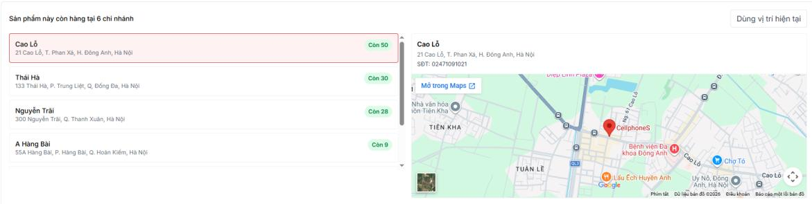

<details>
<summary>text_image</summary>

Sản phẩm này còn hàng tại 6 chi nhánh
Cao Lỗ
21 Cao Lỗ, T. Phan Xà, H. Đông Anh, Hà Nội
Cơn 50
Thái Hà
133 Thái Hà, P. Trung Liệt, Q. Đống Đa, Hà Nội
Cơn 30
Nguyễn Trải
300 Nguyễn Trải, Q. Thanh Xuân, Hà Nội
Cơn 28
A Hàng Bải
55A Hàng Bải, P. Hàng Bải, Q. Hoàn Kiếm, Hà Nội
Cơn 9
Cao Lỗ
21 Cao Lỗ, T. Phan Xà, H. Đông Anh, Hà Nội
SBT: 02471091021
Mô trong Maps
Nhà văn hóa
đơn Tiến Kha
Tiền KHA
Cellphones
Bệnh văn Đa
khoa Đông Anh
Cao Lỗ
Chg Tó
Uy NÔ, Đông
/Anh, Hà Nội
Cao Lỗ
Phóm tả ĐĐI Hubei ĐS 00206
Bảo khoản
Bảo paved mồi Đi bán ĐS
</details>

Hình 5.1: Giao diện hiển thị tình trạng còn hàng tại chi nhánh gần nhất

# d, Truy vết IMEI và liên kết với nghiệp vụ bảo hành

Vì IMEI được ghi nhận ở phiếu xuất kho gắn với chi nhánh và đơn hàng cụ thể, việc tra cứu ngược từ một IMEI bất kỳ sẽ trở nên rất đơn giản: hệ thống tìm phiếu xuất kho chứa IMEI đó, truy ngược về đơn hàng và khách hàng chủ sở hữu, rồi dùng thông tin lấy được để tự điền form tiếp nhận bảo hành.

# 5.2.3 Kết quả đạt được

Một đơn hàng online giờ đây có thể tự động lấy hàng từ nhiều chi nhánh khác nhau mà không cần thao tác thủ công từ nhân viên, đồng thời mỗi đơn vị hàng hoá đều có dấu vết IMEI liên tục từ khi nhập kho đến khi xuất bán. Trên dữ liệu vận hành với 33 chỉ nhánh và 6.424 SKU, hệ thống đã ghi nhận các đơn hàng được phục vụ chéo giữa các chi nhánh nội thành và ngoại thành Hà Nội mà không phát sinh trạng thái tồn kho âm hay IMEI trùng. Bài toán tồn kho phân tán — vốn là điểm yếu phổ biến của các hệ thống thương mại điện tử đơn cửa hàng khi mở rộng sang chuỗi — được xử lý ngay ở tầng kiến trúc, không bị đẩy sang quy trình thủ công.

# 5.3 Phân tích phẫu chuyển đổi với cấu trúc cây phân nhánh

# 5.3.1 Bài toán

Đế cải thiện tỷ lệ chuyển đổi của một sản thuống mại điện tử, người vận hành cần biết khách hàng rời bỏ ở dâu trong hành trình mua sắm: dùng lại sau khi xem sản phẩm, bổ giờ hàng giữa chủng, hay từ bỏ ngay tại bước thanh toán. Các nền tảng đo lường thuống mại như Google Analytics 4 hay Mixpanel có sẵn tính năng phẫu chuyển đổi, nhưng chủ yếu hỗ trợ phẫu tuyến tính, đặt dữ liệu ngoài hệ thống nội bộ và khó kết hợp với các chiều dữ liệu riêng của nghiệp vụ — chẩng hạn lọc phổi theo chi nhánh đặt đơn hay theo hạng thành viên.

Mô hình phẫu tuyến tính cũng không đủ biểu đạt khi cần phân tích các kịch bản phân nhánh. Một ví dụ thường gặp: sau khi xem sản phẩm, khách có thể đi theo hai hướng — "thêm vào giờ rồi mua ngay" hoặc "thêm vào wishlist rồi quay lại mua sau". Phêu tuyến tính buộc phải chọn một trong hai để đo, trong khi câu hỏi thực sự cần trả lời là so sánh hiệu suất chuyển đổi của cả hai con đường. Đồ án vì vậy xây dựng một mô-đun phân tích phẫu chuyển đổi tích hợp ngay trong hệ thống, hỗ trợ cả phẫu tuyến tính lấn phẫu hình cây.

# 5.3.2 Giải pháp

# a, Mô hình sự kiện

Toàn bộ tương tác cần đo lường trên frontend được biểu diễn dưới dạng các sự kiện đồng nhất, mỗi sự kiện gồm một tên (ví dụ xem sản phẩm, thêm vào giờ, mua hàng) và một tập tham số tự do gắn theo ngữ cảnh. Để vừa có khả năng theo dõi hành vi của khách ấn danh, vừa liên kết được hành vi đó với tài khoản sau khi đăng nhập, mỗi sự kiện được kèm bộ định danh ba lớp:

- Định danh ăn danh: UUID lưu trong localStorage của trình duyệt, tồn tại xuyên suốt, không thay đổi các lần đăng nhập/đăng xuất, dùng để theo dõi cùng một thiết bị qua nhiều lượt truy cập.   
- Định danh phiên: UUID lưu trong sessionStorage, được làm mới mỗi khi tab đóng, dùng để gom các sự kiện trong một lượt truy cập.   
- Định danh người dùng: gán sau khi đăng nhập; tại thời điểm đó hệ thống phát thêm một sự kiện gán định danh để liên kết hành vi ăn danh trước đó với tài khoản.

Để tránh tạo áp lực mạng và làm chậm trải nghiệm, sự kiện không được gửi đi từng cái một mà được gom vào một buffer 20 sự kiện rời đầy lên server theo chu kỳ 10 giây hoặc khi tab bị đóng. Đường đi mạng ưu tiên Beacon API của trình duyệt — đây là cơ chế được thiết kế riêng để gửi dữ liệu ngay cả khi trang đang được đóng — và lùi về HTTP request thường với cò giữ kết nối làm phương án dự phòng. Mọi lỗi mạng đều bị nuốt thảm; cò chế đo lường không bao giờ được phép làm ảnh hưởng đến hoạt động chính của ứng dụng.

Phía server, sự kiện được lưu trong MongoDB với bốn chỉ mục hỗn hợp tương ứng với bốn chiều truy vấn phổ biến nhất: theo tên sự kiện và thời gian (phục vụ tính phêu), theo phiên (phục vụ xây dựng lại lượt truy cập), theo định danh ấn danh (phục vụ phân tích cohort), và theo người dùng kết hợp tên sự kiện (phục vụ phân tích theo tài khoản). Một chỉ mục TTL trên trường thời gian đặt thời hạn 90 ngày, dọn dữ liệu cũ tự động mà không cần job dọn đẹp định kỳ.

# b, Ngôn ngữ truy vấn phêu

Phêu được mô tả dưới dạng một măng các bước, mỗi bước gồm tên sự kiện cần khớp và một danh sách bộ lọc tuỷ chọn. Bộ lọc hoạt động trên hai loại trường: các thuộc tính cấp cao của sự kiện (trang, nguồn dẫn, định danh phiên, định danh người dùng...) và các tham số tuỷ ý kèm theo sự kiện. Mười phép toán so sánh được hỗ trợ, liệt kê trong Bảng 5.2; tập toán từ này đủ phong phí để biểu diễn các điều kiện thực tế kiểu "chỉ tính sự kiện thêm vào giờ với giá ≥ 10 triệu đồng" hay "loại các phiên có nguồn dẫn thuộc tập nội bộ".

<table><tr><td>Toán tử</td><td>Ngữ nghĩa</td></tr><tr><td>eq / neq</td><td>Bằng / khác một giá trị</td></tr><tr><td>in / not_in</td><td>Thuộc / không thuộc một tập</td></tr><tr><td>gt / gte</td><td>Lớn hơn / lớn hơn hoặc bằng</td></tr><tr><td>lt / lte</td><td>Nhỏ hơn / nhỏ hơn hoặc bằng</td></tr><tr><td>exists</td><td>Trường tồn tại và khác rỗng</td></tr><tr><td>not_exists</td><td>Trường không tồn tại</td></tr></table>

Bảng 5.2: Tập toán tử bộ lọc của ngôn ngữ truy vấn phêu

Để người vận hành không phải nhớ chính xác tên các trường có thể lọc theo, hệ thống cung cấp hai endpoint phụ trợ trả về danh sách khoá tham số và danh sách giá trị mẫu, được suy ra trực tiếp từ 200 sự kiện gần nhất của mỗi loại. Khi người dùng chọn một tên sự kiện trong giao diện cấu hình phẫu, danh sách trường lọc và gọi ý giá trị tương ứng hiện ngay ra, giảm đáng kể nguy cơ gỗ sai khoá hoặc dùng nhằm giá trị không tồn tại.

# c, Thuật toán tính phêu tuyến tính

Với phẫu gồm n bước, thuật toán duyệt tuần tự và mang theo tập người dùng còn lại sau mỗi bước, mỗi người dùng được gắn mốc thời gian của sự kiện vừa khớp. Điểm cốt yếu là ràng buộc trật tự thời gian: một sự kiện chỉ được tính cho bước i nếu nó xảy ra sau thời điểm sự kiện ở bước i-1 của cùng người dùng. Đây là khác biệt giữa phẫu thật sự — đo dòng chảy theo trình tự — và phép đếm trùng người dùng từng thực hiện đủ các bước tại bất kỳ thời điểm nào. Tập người dùng cần xét có thể lên đến hàng vận, nên mỗi truy vấn được chia batch theo nhóm 5000 định danh để tránh dụng măng đầu vào quá lớn cho cơ sở dữ liệu. Kết quả trả về cho từng bước gồm số người dùng đạt được, tỷ lệ so với bước đầu tiên và tỷ lệ rơi rốt so với bước liền trước.

# d, Mở rộng sang phêu cây

Mô hình phẫu tuyến tính được tổng quát hoá thành phẫu cây bằng cách thay măng bước bằng một măng node, mỗi node mang định danh, định danh cha và định nghĩa bước. Tập node phải tạo thành một cây có đúng một gốc; thuật toán duyệt cây theo BFS từ gốc, mỗi node con kê thừa tập người dùng từ node cha và lọc tiếp theo điều kiện riêng. Cách tổ chức này cho phép diễn đạt các phép so sánh rẽ nhánh: hai nhánh con của cùng một node cha biểu thị hai hướng tiến mà tập người dùng cha có thể rẽ vào, và người vận hành có thể nhìn được trực tiếp tỷ lệ rẽ nhánh cùng hiệu suất chuyển đổi tiếp theo của từng hướng.

Giao diện phân tích được dụng trên một thư viện vẽ flow dạng kéo thả. Cây node được bổ trí tự động theo thuật toán đề quy tính bề rộng cây con để tránh chồng lân, mỗi node hiển thị tên bước, số người dùng đạt được, tỷ lệ tích luỹ và tỷ lệ rơi rót từ node cha. 11 mẫu phẫu cải sẵn (Bảng 5.3) phục vụ các kịch bản phân tích thường gặp, giúp người vận hành không phải dụng phẫu từ đầu cho các bài toán phổ biến.

<table><tr><td>Mẫu phêu</td><td>Mục đích phân tích</td></tr><tr><td>Purchase Funnel</td><td>Hành trình từ xem trang đến mua hàng</td></tr><tr><td>Search → Buy</td><td>Chuyển đổi từ tìm kiếm sang mua</td></tr><tr><td>Cart vs Wishlist</td><td>So sánh hai hướng thêm vào giờ và thêm vào yêu thích</td></tr><tr><td>Multi-path Conversion</td><td>Phêu phân nhánh so sánh người xem trực tiếp và người tìm kiếm</td></tr><tr><td>Sign Up → Purchase</td><td>Hành trình của tài khoản mới đăng ký</td></tr><tr><td>Category Browse → Buy</td><td>Chuyển đổi từ duyệt danh mục đến mua</td></tr><tr><td>Cart Abandonment</td><td>Đo tỷ lệ bổ giờ hàng ở từng bước</td></tr><tr><td>Wishlist → Purchase</td><td>Chuyển đổi từ danh sách yêu thích sang mua</td></tr><tr><td>Coupon Effectiveness</td><td>Hiệu quả của bước áp mã giảm giá trong thanh toán</td></tr><tr><td>Variant Selection → Buy</td><td>Ảnh hưởng của bước chọn biến thể đến chuyển đổi</td></tr></table>

Bảng 5.3: Mẫu phêu cài sẵn trong mô-đun phân tích

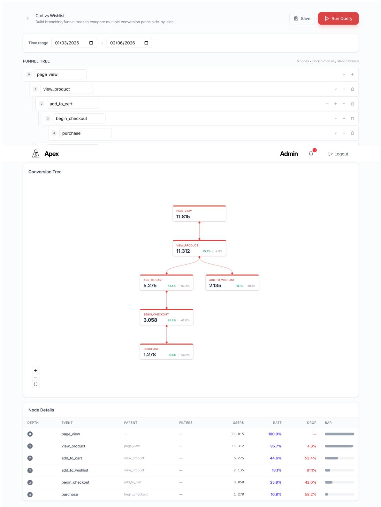

<details>
<summary>bar</summary>

| Stage             | Value   |
| ----------------- | ------- |
| PAGE_VIEW         | 11.815  |
| VIEW_PRODUCT     | 11.312  |
| ADD_TO_CART      | 5.275   |
| ADD_TO_WORLD    | 44.6%   |
| ADD_TO_WORLD    | -53.4%  |
| ADD_TO_WORLD    | -4.3%   |
| BEGIN_CHECKOUT    | 3.058   |
| BEGIN_CHECKOUT   | 25.9%   |
| BEGIN_CHECKOUT   | -42.0%  |
| PURCHASE          | 1.278   |
| PURCHASE          | 10.8%   |
| PURCHASE          | -58.2%  |
| PAGE_VIEW         | 11.815  |
| VIEW_PRODUCT     | 11.312  |
| add_to_cart       | 5.275   |
| add_to_wishlist  | 2.135   |
| begin_checkout    | 3.058   |
| purchase          | 1.278   |
</details>

Hình 5.2: Giao diện phân tích phẫu chuyển đổi dạng cây với mẫu Cart vs Wishlist

# 5.3.3 Kết quả đạt được

Mô-đun phân tích phẫu được tích hợp thẳng vào nhóm chức năng quản trị và dùng chung cơ chế phân quyền với phần còn lại của hệ thống. Việc đặt dữ liệu sự kiện cùng nơi với dữ liệu nghiệp vụ mở ra khả năng kết hợp tự nhiên giữa hành vi và giao dịch — chằng hạn đo tỷ lệ chuyển đổi của một chi nhánh thông qua liên kết định danh người dùng với chi nhánh xử lý đơn, điều khó làm trực tiếp nếu dữ liệu hành vi nằm ở nền tầng đo lường bên ngoài. Bù lại, hệ thống không có ý định cạnh tranh với các nền tầng phân tích thương mại về quy mô: các giới hạn cứng (10 bước cho phẫu tuyến tính, 30 node cho phẫu cây, TTL 90 ngày) được đặt ra để giữ chi phí tính toán và lưu trữ phù hợp với một hạ tầng đơn server.

# 5.4 Tàng báo cáo đa chiều cho chuỗi bán lẻ

# 5.4.1 Bài toán

Một chuỗi bán lẻ điện tử có hàng chục chi nhánh đặt ra nhu cầu báo cáo khác hằng so với một cửa hàng đơn lẻ. Giám đốc chuỗi cần so sánh doanh thu giữa các chi nhánh để tái phân bổ hàng hoá; quản lý chi nhánh muốn biết tỷ suất lợi nhuận của từng dòng sản phẩm tại cửa hàng mình; kế toán cần tổng hợp chi phí thuê mặt bằng, lượng nhân viên và chi phí nhập hàng để dụng báo cáo tài chính. Mỗi vai trò nhìn cùng một tập dữ liệu dưới các lát cắt khác nhau, và đều cần con số phải nhất quán.

Có một chi tiết về tính chính xác mà các báo cáo thông thường hay bổ qua: giá thuê mặt bằng thay đổi theo từng giai đoạn hợp đồng, nên chi phí thuê trên một khoảng thời gian không thể đơn thuần lấy giá thuê hiện tại nhân với số tháng. Để ra con số đúng, hệ thống buộc phải truy ngược lịch sử và áp giá theo từng giai đoạn thực tế.

# 5.4.2 Giải pháp

Hệ thống xây dựng 10 endpoint báo cáo, tất cả đều dùng chung quy ước phân quyền với mô-đun phân quyền theo chi nhánh đã trình bày ở mục 5.1: quản lý chi nhánh chỉ thấy số liệu thuộc chi nhánh mình, quản trị viên thấy bức tranh tổng thể toàn hệ thống. Bảng 5.4 liệt kê tập báo cáo cùng đặc thù tính toán của từng loại.

<table><tr><td>Báo cáo</td><td>Đặc thù tính toán</td></tr><tr><td>Top sản phẩmGiá trị tồn khoDoanh thu theo thời gianDoanh thu theo chi nhánhTác động khuyến mãiChi phí nhập hàngHoàn tiềnLoyaltyChi phí lượngChi phí thuê mặt bằng</td><td>Doanh thu, giá vốn, lợi nhuận gộp và tỷ suất lợi nhuận trên từng SKUQuy ra giá vốn và giá bán, phân chia theo chi nhánhBóc tách doanh thu, chiết khấu và lợi nhuận gộp theo ngày/tháng/nămSo sánh chỉ số kinh doanh giữa các chi nhánh trong cùng kỳPhân rã chiết khấu theo loại (coupon, hạng thành viên, điểm) và xếp hạng mãTổng hợp theo nhà cung cấp hoặc theo chi nhánhPhân tích theo lý do, theo chi nhánh và theo thángPhân phối người dùng theo hạng thành viên và lưu lượng tích/tiêu điểmTổng hợp theo chi nhánh và theo kỳ tháng/nămTính chính xác theo lịch sử giá thuê của từng chi nhánh</td></tr></table>

Bảng 5.4: Tập báo cáo tài chính – vận hành của hệ thống

# a, Lộc đơn rác trước khi tổng hợp

Mọi truy vấn doanh thu đều dùng chung một quy ước loại trừ: đơn bị huỷ hoặc trả lại bị loại từ phía đơn hàng, đồng thời các thanh toán ở trạng thái huỷ, hoàn tiền, thất bại hoặc hết hạn bị loại từ phía thanh toán thông qua phép kết bằng tương ứng. Hai tập trạng thái loại trừ này được tách thành hằng số dùng chung cho mọi pipeline báo cáo. Lý do đơn giản: nếu mỗi báo cáo tự định nghĩa "đơn hợp lệ" theo cách riêng, hai báo cáo cùng nói về doanh thu rất dễ ra hai con số lệch nhau, và việc đối chiếu sẽ trở thành một bài toán khó giải quyết.

# b, Lợi nhuận gộp tính từ giá vốn theo thời điểm đặt

Khi tạo đơn, mỗi mục hàng được snapshot giá vốn tại thời điểm đặt và giữ ngay trong dòng chi tiết của đơn hàng. Cách lưu này tách giá vốn trên đơn ra khởi giá vốn hiện hành của sản phẩm gốc, phục vụ hai mục đích cùng lúc: báo cáo lợi nhuận không bị sai lệch khi giá vốn sản phẩm thay đổi sau bán, và pipeline tổng hợp doanh thu không phải kết thêm về bằng sản phẩm trên hàng nghìn đơn. Lợi nhuận gộp được tính trực tiếp trong pipeline, tỷ suất lợi nhuận quy về công thức (doanh thu – giá vốn) / doanh thu × 100.

# c, Báo cáo chi phí thuê mặt bằng đúng theo lịch sử

Trong số 10 báo cáo, chi phí thuê mặt bằng là loại đời hồi tính toán phúc tạp nhất. Mỗi chi nhánh giữ song song giá thuê hiện hành và một măng lịch sử thay đổi giá, mỗi mục lịch sử gồm số tiền, ngày hiệu lực và ghi chú tuỷ ý. Khi cần tính chi phí trên một khoảng thời gian, thuật toán duyệt từng tháng trong khoảng đó; với mỗi tháng, nó tìm mục lịch sử có ngày hiệu lực sớm hơn hoặc bằng tháng đó và mới nhất, rời cộng giá tương ứng vào tổng. Nếu không có mục lịch sử nào áp dụng được, thuật toán quay về giá hiện hành làm dự phòng. Nhỏ vậy, báo cáo "chi phí thuê quý I" cho ra con số chính xác kể cả khi một chi nhánh đã đổi hợp đồng vào tháng 2.

# d, Thiết kế trả về phân tầng

Môi báo cáo trả về cấu trúc gồm ba phần: một chỉ số tổng, một phần chi tiết theo chiều phân tích chính (thường là theo chi nhánh) và đôi khi là chuỗi thời gian. Câu trúc này khớp tự nhiên với cách hiện thị trên dashboard: ô số lớn ở đầu trang cho chỉ số tổng, biểu đồ cột so sánh giữa các chi nhánh, biểu đồ đường theo thời gian. Cùng một endpoint phục vụ cả hai vai trò xem báo cáo: quản trị viên xem toàn chuỗi nhận được phần chi tiết theo chi nhánh có nhiều dòng, còn quản lý chi nhánh chỉ thấy đúng một dòng số liệu của chi nhánh mình. Frontend dùng cùng một template render cho cả hai trường hợp.


# Apex

Admin


[→ Logout

# Financial Reports

Revenue, profit, inventory value, and key financial metrics

Date Range:

From 01/03/2026

To 02/06/2026

By Month

Revenue

Top Products

Inventory Value

Promotions

Import Cost

Refunds

Loyalty

Payroll Cost

Rent Cost

15.722.438.000 d

Orders

560

4.693.368.000 d

Payroll Cost

187.748.192 d

18 employees

0 d

Rent Cost

8.396.000.000 d

33 active branches × 3 months

Net Profit

-3.890.380.192 d

Revenue & Profit Over Time   
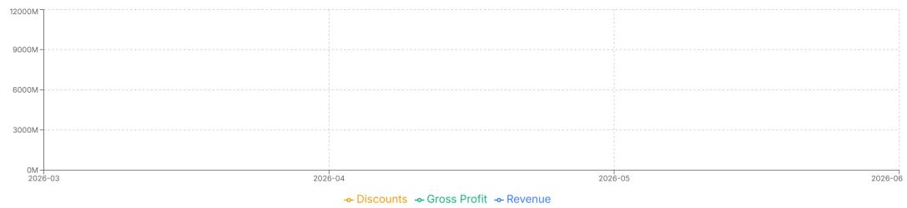

<details>
<summary>line</summary>

| Date    | Discounts | Gross Profit | Revenue |
|---------|-----------|--------------|---------|
| 2026-03 |           |              |         |
| 2026-04 |           |              |         |
| 2026-05 |           |              |         |
| 2026-06 |           |              |         |
</details>

Revenue by Branch   
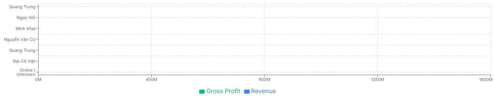

<details>
<summary>bar</summary>

| Region | Gross Profit (M) | Revenue (M) |
| :--- | :--- | :--- |
| Quang Trung | 0 | 0 |
| Ngoc Hôi | 0 | 0 |
| Minh Khai | 0 | 0 |
| Nguyễn Văn Cử | 0 | 0 |
| Quang Trung | 0 | 0 |
| Đại Cổ Việt | 0 | 0 |
| Online / Unknown | 0 | 0 |
</details>

Hình 5.3: Trang báo cáo thống kê tổng hợp doanh thu, lợi nhuận và đơn hàng

# 5.4.3 Kết quả đạt được

Tầng báo cáo phục vụ đồng thời hai vai trò vận hành trên cùng một bộ endpoint, nhỏ middleware cô lập chi nhánh che giâu sự khác biệt về phạm vi dữ liệu khởi logic nghiệp vụ. Việc tách giá vốn snapshot khởi sản phẩm gốc giúp các báo cáo lợi nhuận giữ được ý nghĩa kinh tế đúng đản ngay cả khi giá vốn sản phẩm biến động về sau. Báo cáo chi phí thuê mặt bằng tính đúng theo lịch sử — dù chỉ là một phần nhỏ trong tổng số chỉ tiêu — minh hoạ cho định hướng chung của tầng báo cáo: không dùng ở mức tổng hợp đơn giản, mà cố găng giữ độ chính xác về thời gian ở mức tin cây khi đem ra làm cơ sở cho quyết định tài chính.

# CHƯƠNG 6. KẾT LUẬN VÀ HƯỚNG PHÁT TRIỂN

# 6.1 Kết luận

Hệ thống bán lẻ điện tử đa chỉ nhánh Apex đã được thiết kế, phát triển và cấu hình vận hành thực tế một cách hoàn chỉnh. Phần này sẽ tổng kết lại các kết quả thực nghiệm, thực hiện so sánh tính năng với các giải pháp hiện hành trên thị trường, đồng thời chỉ ra các hạn chế và bài học kinh nghiệm rút ra từ quá trình phát triển hệ thống.

# 6.1.1 So sánh với các giải pháp tương tự

Đế có góc nhìn khách quan về năng lực đáp ứng nghiệp vụ, hệ thống được tiến hành so sánh dưa trên hai phương diện độc lập: trải nghiệm mua sắm của khách hàng (so với các chuỗi bán lẻ lớn như CellPhoneS, FPT Shop, Hoàng Hà Mobile) và phân hệ quản lý vận hành nội bộ (so với các giải pháp quản lý chuyên dụng như Sapo, KiotViet).

Các nền tảng bán lẻ điện tử lớn hiện nay đã có nhiều năm tối ưu hóa hạ tầng và sở hữu hệ sinh thái tính năng phân tán. Dưới đây sẽ là bằng tổng hợp kết quả đối sánh tính năng tại phân hệ khách hàng:

<table><tr><td>Tính năng và Giải pháp</td><td>Apex</td><td>CellPhoneS / FPT / HHM</td></tr><tr><td>Danh mục sản phẩm, tìm kiếm, lọc sản phẩm</td><td>√</td><td>√</td></tr><tr><td>Giỗ hàng, đặt hàng, theo dõi đơn</td><td>√</td><td>√</td></tr><tr><td>Thanh toán trực tuyến quốc tế</td><td>√</td><td>√</td></tr><tr><td>Đánh giá sản phẩm, danh sách yêu thích</td><td>√</td><td>√</td></tr><tr><td>Chương trình tích điểm, hạng thành viên</td><td>√</td><td>√</td></tr><tr><td>Mã giảm giá, chương trình khuyến mãi</td><td>√</td><td>√</td></tr><tr><td>Thông báo thời gian thực (Real-time)</td><td>√</td><td>√</td></tr><tr><td>Ứng dụng di động (Mobile App)</td><td>×</td><td>√</td></tr><tr><td>Hỗ trợ trả góp, mua trả chậm</td><td>×</td><td>√</td></tr><tr><td>Thu cũ đổi mới (Trade-in)</td><td>×</td><td>√</td></tr><tr><td>Tích hợp trực tiếp đơn vị vận chuyển</td><td>×</td><td>√</td></tr></table>

Bảng 6.1: So sánh tính năng trên phân hệ khách hàng

Về các tính năng mua sắm cốt lõi, hệ thống đáp ứng đầy đủ và hoạt động một mà tương đương các giải pháp thương mại. Khoảng cách hiện tại chủ yếu nằm ở các dịch vụ tài chính đặc thù ngành điện tử (như trả góp) và việc liên kết API với các hăng vận chuyển thứ ba — đây là các hạng mục yêu cầu quy trình tích hợp pháp lý phúc tạp thay vì rào cần về mặt công nghệ.

Đối với phân hệ quản trị nội bộ, sẽ cần thực hiện so sánh sâu về mặt nghiệp vụ với Sapo và KiotViet — hai nền tầng SaaS quản lý bán hàng phổ biến nhất tại thị trường Việt Nam hiện nay.

<table><tr><td>Tính năng nghiệp vụ</td><td>Hệ thống này</td><td>Sapo / KiotViet</td></tr><tr><td>Quản lý sản phẩm và danh mục</td><td>√</td><td>√</td></tr><tr><td>Quản lý tồn kho đa chi nhánh</td><td>√</td><td>√</td></tr><tr><td>Nhập kho, xuất kho theo mã IMEI</td><td>√</td><td>√</td></tr><tr><td>Quản lý trạng thái đơn hàng</td><td>√</td><td>√</td></tr><tr><td>Quản lý khách hàng, tích điểm tự động</td><td>√</td><td>√</td></tr><tr><td>Cấu hình linh hoạt chương trình khuyến mãi</td><td>√</td><td>√</td></tr><tr><td>Báo cáo - Thống kê tài chính</td><td>√</td><td>√</td></tr><tr><td>Quản lý bảo hành, tiến trình sửa chữa</td><td>√</td><td>Hạn chế</td></tr><tr><td>Quản lý nhân sự, chấm công, bằng lương</td><td>√</td><td>Hạn chế</td></tr><tr><td>Kết nối phần cứng POS chuyên dụng</td><td>×</td><td>√</td></tr><tr><td>Đồng bộ đơn vị vận chuyển đối tác</td><td>×</td><td>√</td></tr><tr><td>Bán hàng đa kênh (E-commerce Omni-channel)</td><td>×</td><td>√</td></tr><tr><td>Ứng dụng di động quản trị cho nhân viên</td><td>×</td><td>√</td></tr></table>

Bảng 6.2: Đối sánh tính năng trên phân hệ quản lý nội bộ

Tại phân hệ quản lý, hệ thống không chỉ bao phủ đủ các nghiệp vụ nền tảng mà còn đạt chiều sâu tốt hơn ở một số module đặc thù: quy trình bảo hành được quản lý chặt chẽ theo mô hình máy trạng thái có nhật ký sửa chữa chi tiết; phân hệ tính lượng được tự động hóa hoàn toàn dựa trên cấu trúc biểu thuế thu nhập cá nhân lũy tiến và tỷ lệ trích đóng bảo hiểm xã hội hiện hành của Việt Nam. Các tính năng chuyên sâu này ở KiotViet hay Sapo thường yêu cầu doanh nghiệp phải mua thêm module bổ sung hoặc đồng bộ phúc tạp với phần mềm kế toán bên ngoài. Điểm hạn chế hiện tại là hệ thống chưa hỗ trợ giao thức kết nối phần cứng ngoại vi (máy in hóa đơn, máy quét mã vạch, ...) và bán hàng đa kênh.

# 6.1.2 Đánh giá kết quả thực hiện và Hạn chế

Quá trình nghiên cứu và phát triển hệ thống đã hoàn thành các mục tiêu công nghệ đề ra, bao gồm:

- Thiết kế và triển khai hoàn chỉnh kiến trúc RESTful API cho toàn bộ các phân hệ nghiệp vụ cốt lỗi trên nền tầng Node.js, Express và TypeScript.   
- Xây dựng giao diện ứng dụng web SPA có độ phần hồi cao bằng React cho cả hai nhóm đối tượng: khách hàng đại chúng và nhân viên vận hành nội bộ.   
- Tích hợp thành công cống thanh toán bảo mật quốc tế Stripe, xử lý an toàn quy trình giao dịch thể và đồng bộ trạng thái bất đồng bộ qua Webhook.   
- Triển khai giải pháp tìm kiếm hiệu năng cao thông qua Elasticsearch, lọc sản phẩm theo các tiêu chí thông minh và kênh giao tiếp real-time đồng thời bằng Socket.IO.   
- Đóng gói đồng bộ toàn bộ hạ tầng phần mềm bằng Docker/Docker Compose và định tuyến bảo mật tập trung qua máy chủ reverse proxy Nginx kết hợp chứng chỉ SSL Let's Encrypt.

Bên cạnh các kết quả đạt được, hệ thống vẫn tồn tại một số hạn chế kỹ thuật cần khác phục. Quy trình kiểm thử hiện tại hoàn toàn là kiểm thử thủ công, dẫn đến việc phát hiện muộn một số lỗi logic — tiêu biểu là lỗi lệch chuỗi thông điệp ngoại lệ tại luồng đặt hàng khi giờ hàng trống. Ngoài ra, việc triển khai ứng dụng lên máy chủ VPS vẫn chưa được tự động hóa qua pipeline CI/CD, và hệ thống chưa trải qua các bài đánh giá áp lực tải cao để xác định chính xác ngưỡng chịu tải tối đa của phần cứng.

# 6.1.3 Bài học kinh nghiệm

Từ thực tế phát triển dự án, ba bài học lớn về mặt kỹ thuật đã được đúc kết:

- Cấu hình hạ tầng cơ sở dữ liệu: Cơ chế MongoDB Transaction bắt buộc hệ quản trị phải vận hành ở chế độ Replica Set ngay cả trong môi trường phát triển, đây là yếu tố cấu hình cốt lỗi cần chuẩn bị ngay từ giai đoạn thiết kế kiến trúc phần mềm.   
- Chuẩn hóa cấu trúc phần hồi: Việc thiết lập một định dạng mã lỗi và thông điệp ngoại lệ nhất quán giữa các tầng (Service, Middleware, Router) ngay từ giai đoạn đầu là bắt buộc để tránh các lỗi logic tiêm ấn khi liên kết dữ liệu.   
- Tối ưu hóa tài nguyên đóng gói: Mô hình xây dựng Docker image đa tầng chứng minh tính hiệu quả vượt trội trong việc loại bổ hoàn toàn các tập tin rác

của môi trường phát triển, giúp giảm đáng kể dung lượng image khi triển khai thực tế trên môi trường production.

# 6.2 Huống phát triển

Trong giai đoạn tiếp theo, các cải tiến kỹ thuật ngắn hạn sẽ tập trung vào việc tối ưu hóa chất lượng mã nguồn và tự động hóa quy trình vận hành. Hệ thống sẽ tiến hành sửa dứt điểm lỗi không đồng bộ mã lỗi giờ hàng trống tại tầng định tuyến, đồng thời rà soát toàn diện cơ chế bắt ngoại lệ trên toàn bộ cơ sở mã nguồn. Việc xây dựng hệ thống kiểm thủ tự động với hai tầng cốt lỗi: Unit Test cho tầng nghiệp vụ và Integration Test cho các endpoint API quan trọng sẽ được triển khai để đảm bảo tính an toàn dữ liệu. Song song đó, một pipeline CI/CD (như GitHub Actions hoặc GitLab CI) sẽ được cấu hình để tự động hóa hoàn toàn quy trình kiểm tra mã nguồn và biên dịch, triển khai tự động lên máy chủ VPS mỗi khi mã nguồn có cập nhật. Việc thực hiện các bài kiểm thử hiệu năng chịu tải cũng được cân nhắc triển khai để đo lường chính xác mức tiêu thụ tài nguyên phần cứng, đặc biệt là việc tối ưu dung lượng RAM cho dịch vụ Elasticsearch.

Về định hướng kiến trúc dài hạn, hệ thống hướng tới việc mở rộng quy mô và đa dạng hóa nền tầng ứng dụng:

- Đa dạng hóa nền tầng ứng dụng: Phát triển thêm ứng dụng di động native phục vụ cho hai mục đích: giúp khách hàng mua sắm tiện lợi hơn trên thiết bị di động và hỗ trợ nhân viên bán hàng thực hiện quét mã, lên đơn nhanh ngay tai quầy.   
- Mở rộng hệ sinh thái dịch vụ: Tích hợp sâu API với các đơn vị vận chuyển phổ biến (như GHN, GHTK, Viettel Post) nhằm tự động hóa quy trình đầy đơn giao hàng, tính toán cước phí thông minh theo vị trí địa lý và đồng bộ trang thái vận đơn theo thời gian thực.   
- Tích hợp hệ thống gọi ý thông minh: Áp dụng các giải pháp phân tích dữ liệu để xây dựng phân hệ gọi ý sản phẩm cá nhân hóa dưa trên lịch sử xem hàng và hành vi tiêu dùng của từng khách hàng.

# MỘT SỐ LƯU Ý VÊ TÀI LIỆU THAM KHẢO

# Bài báo đăng trên tạp chí khoa học

sandhu1996rbac R. S. Sandhu, E. J. Coyne, H. L. Feinstein, and C. E. Youman, "Role-based access control models," IEEE Computer, vol. 29, no. 2, pp. 38–47, 1996.

fielding2002rest R. T. Fielding and R. N. Taylor, “Principled design of the modern web architecture,” ACM Transactions on Internet Technology, vol. 2, no. 2, pp. 115–150, 2002.

cattell2011nosql R. Cattell, “Scalable SQL and NoSQL data stores,” ACM SIG-MOD Record, vol. 39, no. 4, pp. 12–27, 2011.

# Sách

kleppmann2017designing M. Kleppmann, Designing Data-Intensive Applications: The Big Ideas Behind Reliable, Scalable, and Maintainable Systems. O'Reilly Media, 2017.

fowler2002patterns M. Fowler, Patterns of Enterprise Application Architecture. Addison-Wesley Professional, 2002.

evans2003ddd E. Evans, Domain-Driven Design: Tackling Complexity in the Heart of Software. Addison-Wesley Professional, 2003.

banker2016mongodb K. Banker, D. Garrett, P. Bakkum, and S. Verch, MongoDB in Action, 2nd ed. Manning Publications, 2016.

# Tập san Báo cáo Hội nghị Khoa học

chodorow2013mongodb K. Chodorow, “MongoDB transactions and the path to multi-document ACID,” in Proceedings of the MongoDB World Conference, New York, USA, 2018, pp. 45–58.

gormley2015elasticsearch C. Gormley and Z. Tong, “Elasticsearch: The definitive guide to scalable search,” in Proceedings of the ACM SIGIR Conference on Research and Development in Information Retrieval, Santiago, Chile, 2015, pp. 1101–1104.

# Tài liệu tham khảo từ Internet

mongodb2024docs MongoDB Inc., MongoDB Manual — Replica Sets and Transactions. [Online]. Available: https://www.mongodb.com/docs/manual/core/transactions/ (visited on 05/20/2026).

nodejs2024docs OpenJS Foundation, Node.js Documentation — The Node.js Event Loop, Timers, and process.nextTick(). [Online]. Available: https://nodejs.org/en/docs/guides/event-loop-timers-and-nexttick (visited on 05/20/2026).   
react2024docs Meta Platforms Inc., React Documentation — Reacting to Input with State. [Online]. Available: https://react.dev/learn/reacting-to-input-with-state (visited on 05/20/2026).   
rfc7519 M. Jones, J. Bradley, and N. Sakimura, JSON Web Token (JWT), IETF RFC 7519. [Online]. Available: https://www.rfc-editor.org/rfc/rfc7519 (visited on 05/20/2026).   
rfc6455 I. Fette and A. Melnikov, The WebSocket Protocol, IETF RFC 6455. [Online]. Available: https://www.rfc-editor.org/rfc/rfc6455 (visited on 05/20/2026).   
stripe2024docs Stripe Inc., Stripe API Reference — Checkout Sessions and Webhooks. [Online]. Available: https://docs.stripe.com/api/checkout/sessions (visited on 05/20/2026).   
redis2024docs Redis Ltd., Redis Documentation — Key Eviction and TTL. [Online]. Available: https://redis.io/docs/latest/develop/reference/eviction/ (visited on 05/20/2026).   
elasticsearch2024docs Elasticsearch B.V., Elasticsearch Reference — Inverted Index and Text Analysis. [Online]. Available: https://www.elastic.co/guide/en/elasticsearch/reference/current/index.html (visited on 05/20/2026).   
docker2024docs Docker Inc., Docker Documentation — Multi-stage Builds. [Online]. Available: https://docs.docker.com/build/building/multi-stage/ (visited on 05/20/2026).   
nginx2024docs F5 Inc., NGINX Documentation — Reverse Proxy and Web-Socket Proxying. [Online]. Available: https://nginx.org/en/docs/http/websocket.html (visited on 05/20/2026).