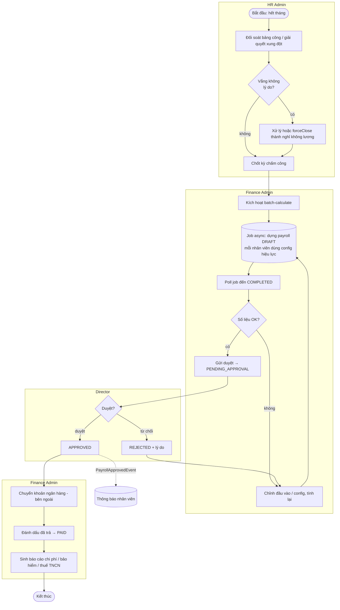
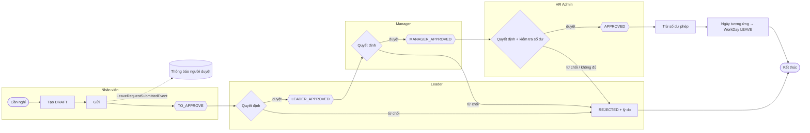
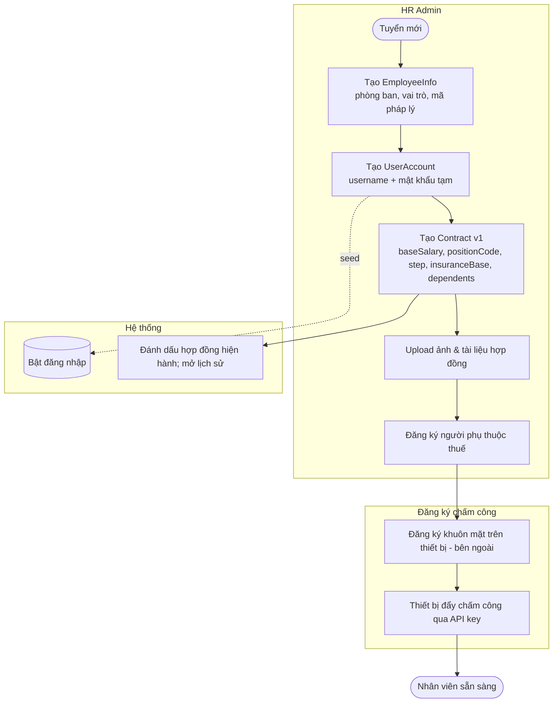
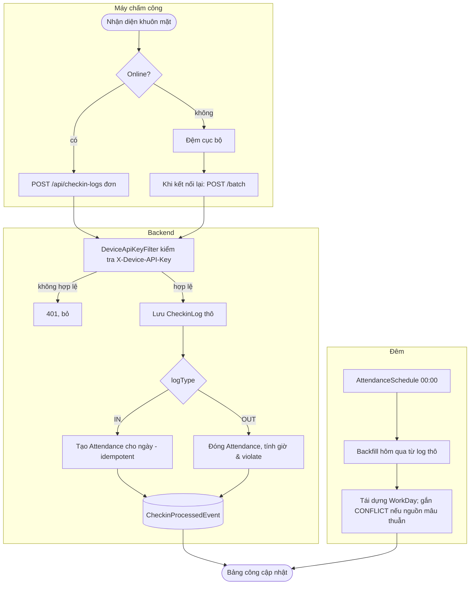

# Sơ đồ Luồng Quy trình (BPMN) — FaceZ HRMS

**Phiên bản:** 1.0 | **Ngày:** 16-06-2026
**Liên quan:** [Use Cases](02-use-cases.md) · [Business Rules](03-business-rules.md) · [Sequence Diagrams](../02-technical/08-sequence-diagrams.md)

Góc nhìn quy trình nghiệp vụ của bốn luồng giá trị cao nhất. Sơ đồ dùng Mermaid (`flowchart`) như một
biến thể BPMN nhẹ; làn (swimlane) thể hiện bằng `subgraph`. Chi tiết kỹ thuật cấp message nằm ở
[Sequence Diagrams](../02-technical/08-sequence-diagrams.md).

---

## 1. Luồng tính lương tháng

**Tiền điều kiện:** đã chốt kỳ chấm công (BR-AT-09); có hợp đồng hiện hành + config hiệu lực (BR-CFG-04).
**Kiểm soát:** tách bạch trách nhiệm — Finance tính, Director phê duyệt (BR-RBAC-04).
**Tự kích hoạt:** `PayrollScheduler` khởi động batch vào ngày 1 mỗi tháng.

---

## 2. Duyệt nghỉ phép đa cấp

Duyệt OT (UC-11) theo **cùng cấu trúc làn và máy trạng thái**; chỉ khác hiệu ứng cuối (OT đã duyệt đưa
vào lương thay vì trừ số dư). Xóa chỉ được phép ở `DRAFT`/`TO_APPROVE` (BR-LV-04).

---

## 3. Onboarding nhân viên mới

**Đầu ra mở khóa các quy trình sau:** cần hợp đồng hiện hành trước khi tính lương (BR-CT-03); cần đăng ký
thiết bị trước các luồng chấm công. Tính duy nhất mã pháp lý (nationalId/taxCode/socialInsuranceCode)
được enforce (UC-02 A1).

---

## 4. Thu nhận dữ liệu chấm công từ máy chấm công

**Độ tin cậy:** đệm offline + upload `/batch` chịu được thiết bị mất kết nối (NFR-4).
**Idempotency:** `IN` trùng cho ngày đã có sẽ bị bỏ qua (BR-AT-02). **Đối soát:** thiếu `OUT` để bản ghi
mở và `violate=true` đến khi cron đêm hoặc HR adjustment sửa. Chi tiết giao thức:
[Integration Design](../02-technical/11-integration-design.md).

---

## Truy vết quy trình → quy tắc

| Quy trình | Quy tắc chính | Use case chính |
|-----------|---------------|----------------|
| Tính lương | BR-PR-*, BR-CFG-04, BR-RBAC-04, BR-AT-09 | UC-09, UC-13, UC-14, UC-15, UC-17 |
| Duyệt nghỉ phép | BR-LV-* | UC-10 |
| Onboarding | BR-CT-*, BR-DC-01 | UC-02..05, UC-20 |
| Thu nhận chấm công | BR-AT-* | UC-06, UC-07, UC-08 |
