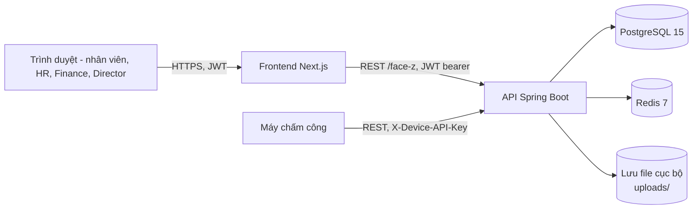
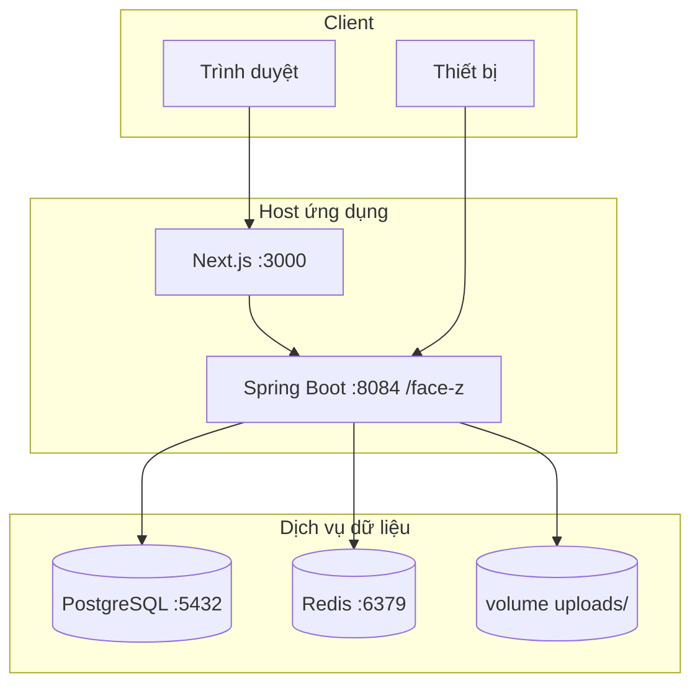

# Tài liệu Kiến trúc Hệ thống (SAD) — FaceZ HRMS

**Phiên bản:** 1.0 | **Ngày:** 16-06-2026
**Liên quan:** [Component Design](09-component-design.md) · [Database Design](06-database-design.md) · [Security](10-security-design.md)

---

## 1. Mục tiêu & yếu tố dẫn dắt kiến trúc

| Yếu tố dẫn dắt | Đáp ứng kiến trúc |
|----------------|-------------------|
| Đúng pháp lý, tái lập được cho mọi kỳ lịch sử | Bảng config hiệu lực theo ngày; engine lương thuần, không trạng thái ẩn |
| Tách bạch trách nhiệm | RBAC theo endpoint + máy trạng thái workflow (maker-checker) |
| Chịu được thiết bị offline | REST stateless + auth device API-key + endpoint upload batch |
| Khả năng kiểm toán | Lớp base JPA auditing; lịch sử chỉ-thêm (hợp đồng, config) |
| An toàn khi đổi schema | Flyway migration có version, `ddl-auto: none` |
| UX vận hành mượt khi job nặng | Batch lương async + job store in-memory + polling từ frontend |

## 2. Bối cảnh hệ thống



Actor ngoài: người dùng cuối qua trình duyệt, và máy chấm công qua REST có API-key. Việc nhận diện sinh
trắc chạy **trên thiết bị**; FaceZ thu nhận `employeeId` đã nhận diện.

## 3. Kiến trúc phân tầng (logic)

```
┌──────────────────────────────────────────────────────────────┐
│ Trình bày — Next.js 15 (App Router, React 19, Tailwind)      │
│   ProtectedRoute · AuthContext · ToastContext · apiClient()   │
├──────────────────────────────────────────────────────────────┤
│ API / Web — Spring MVC Controllers (@RestController)          │
│   Envelope ApiResponse<T> · @PreAuthorize · validate DTO       │
├──────────────────────────────────────────────────────────────┤
│ Bảo mật — Filter: DeviceApiKeyFilter → JwtAuthFilter          │
│   SecurityConfig (stateless) · JwtService (Redis) · BCrypt     │
├──────────────────────────────────────────────────────────────┤
│ Service Ứng dụng / Nghiệp vụ (@Service, @Transactional)       │
│   Attendance · Leave · OT · Payroll · Contract · Config ...    │
│   PayrollCalculationEngine (@Component thuần)                 │
├──────────────────────────────────────────────────────────────┤
│ Sự kiện — Spring ApplicationEvents → NotificationListener     │
│ Lập lịch — @Scheduled (chấm công, lương, hết hạn hợp đồng)    │
├──────────────────────────────────────────────────────────────┤
│ Lưu trữ — Repository Spring Data JPA · Schema Flyway          │
├──────────────────────────────────────────────────────────────┤
│ Kho dữ liệu — PostgreSQL (nguồn sự thật) · Redis (token)     │
└──────────────────────────────────────────────────────────────┘
```

Backend là **modular monolith**: một deployable, phân vùng nội bộ theo package domain
(`domain/<module>/{controller,dto,model,repository,service}`), mối quan tâm xuyên suốt ở `common/` và `configs/`.

## 4. Lựa chọn công nghệ & lý do

| Tầng | Công nghệ | Vì sao | Đánh đổi |
|------|-----------|--------|----------|
| Backend | Spring Boot 4.0.0-M3 (Java 21) | Hệ sinh thái security/JPA/scheduling chín; record, sẵn sàng virtual-thread | Bản milestone — cần ghim version; không phải LTS |
| Lưu trữ | PostgreSQL 15 + Flyway | ACID, `jsonb`, partial unique index (bất biến config); migration tường minh | Phải viết migration tay (`ddl-auto: none`) |
| Cache/token | Redis 7 | Xoay vòng/thu hồi refresh token, đếm rate-limit có TTL | Thêm thành phần hạ tầng cần vận hành |
| Auth | JWT stateless + refresh cookie HTTP-only | Mở rộng ngang; access token ngắn giới hạn rủi ro | Logout cần thu hồi server-side (qua Redis) |
| Frontend | Next.js 15 / React 19 / Tailwind | App Router, DX nhanh (Turbopack), có SSR | Phụ thuộc bản M; khôi phục auth nặng CSR lúc mount |
| Async | Spring `@Async` + `PayrollJobStore` in-memory | Batch không chặn; đơn giản | Trạng thái job không bền qua restart (chấp nhận: re-run được) |
| Biểu đồ | Recharts | Dashboard khai báo | Chỉ phía client |

## 5. Mẫu kiến trúc chính

1. **Engine tính toán thuần** — `PayrollCalculationEngine` không ghi DB/transaction; nhận object đã nạp
   sẵn và trả `DRAFT` chưa lưu. Đường đơn và batch dùng chung logic, không truy vấn thừa. *Đánh đổi:*
   caller phải nạp đủ đầu vào trước.
2. **Config hiệu lực theo ngày** — quy tắc pháp lý là các dòng có version chọn theo kỳ lương, không phải
   hằng số code. Cho phép tái lập lịch sử và đổi mức không cần redeploy.
3. **Async hai phương thức** — `triggerBatch()` (tạo job, trả id) và `@Async runBatch()` tránh bẫy proxy self-invocation của Spring.
4. **Thông báo theo sự kiện** — service domain phát `ApplicationEvent`; một listener sinh thông báo, tách
   producer khỏi module notification.
5. **Envelope phản hồi thống nhất** — mọi endpoint trả `ApiResponse<T>` / `PageResponse<T>`; `apiClient()`
   tập trung gắn token, refresh ngầm, chuẩn hóa lỗi.
6. **Xóa mềm + lịch sử** — `deleteFlag`/`deletedAt`; hợp đồng và config dùng lịch sử chỉ-thêm thay vì sửa tại chỗ.

## 6. Topology runtime / triển khai



- **Dev:** `docker compose` bật PostgreSQL, pgAdmin (5050), Redis; backend & frontend chạy cục bộ.
- **Profile:** `application-dev/staging/prod.yml`; secret qua env (`DB_*`, `REDIS_*`, `JWT_SECRET`, `CORS_ALLOWED_ORIGINS`).
- **Stateless:** API không giữ session; chỉ trạng thái token Redis và file upload cục bộ là có trạng thái.
  Scale ngang cần Redis dùng chung, DB dùng chung, và lưu trữ chia sẻ/object cho `uploads/` (đĩa cục bộ
  hiện tại là giới hạn đơn-node — xem §8).

## 7. Mối quan tâm xuyên suốt

| Mối quan tâm | Cơ chế |
|--------------|--------|
| Xác thực | JWT access (5 phút) + refresh Redis (14 ngày, xoay vòng) |
| Phân quyền | Rule URL trong `SecurityConfig` + method `@PreAuthorize` |
| Auditing | `AuditableEntity` (`createdBy/updatedBy/createdAt/updatedAt`) qua `AuditorAwareImpl` |
| Xử lý lỗi | `GlobalExceptionHandler` → `ApiResponse` kèm message |
| Validation | Bean Validation trên DTO; bất biến tầng service |
| Quan sát | Spring Actuator (`/actuator/health` công khai; endpoint nâng cao chỉ SysAdmin) |
| Lập lịch | Cron `@Scheduled` (chấm công nửa đêm, lương hàng tháng, hết hạn hợp đồng hàng tháng) |
| Giới hạn tần suất | Rate limiter login dùng Redis (10/15 phút/IP) |

## 8. Ràng buộc, khoảng trống & đánh đổi đã biết

- **Job store in-memory** — trạng thái job batch lương mất khi restart; job idempotent/re-run được.
- **File upload cục bộ** — `uploads/` trên đĩa cục bộ cản scale-out đa node ngây thơ; chuyển sang object storage để HA.
- **Xóa mềm chưa enforce toàn cục** — vài repository có thể trả bản ghi đã xóa mềm; kiểm tra theo query.
- **Version framework milestone** — Spring Boot/Next bản M; ghim và test lại trước khi nâng cấp.
- **Đơn tenant** — không cô lập multi-company.
- **Thực thi chi trả bên ngoài** — hệ thống đánh dấu `PAID`; tích hợp ngân hàng ngoài phạm vi.

## 9. Ánh xạ thuộc tính chất lượng

| Thuộc tính | Được hỗ trợ bởi |
|------------|-----------------|
| Bảo mật | §7, [Security Design](10-security-design.md) |
| Khả năng kiểm toán | `AuditableEntity`, lịch sử config/hợp đồng |
| Tái lập | config hiệu lực theo ngày + engine thuần |
| Khả dụng (thiết bị) | device API-key + upload batch |
| Hiệu năng (batch) | async + polling |
| Bảo trì | modular monolith, envelope thống nhất, Flyway |
