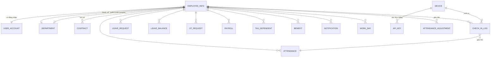
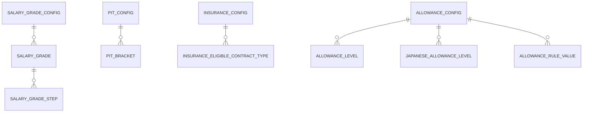

# Thiết kế CSDL (ERD + Data Dictionary) — FaceZ HRMS

**Phiên bản:** 1.0 | **Ngày:** 16-06-2026
**Nguồn sự thật:** Flyway migration `V1`–`V27` trong `facez/src/main/resources/db/migration/` và entity JPA
trong `org.dummy.facez.domain.*.model`. `ddl-auto: none` — schema *chính là* tập migration.
**Liên quan:** [Business Rules](../01-business/03-business-rules.md) · [Component Design](09-component-design.md)

---

## 1. Quy ước

- **Khóa chính:** String UUID `VARCHAR(64/255)` sinh ở tầng service (`UUID.randomUUID()`).
- **Tiền:** VND kiểu `BIGINT` (đồng nguyên) ở payroll/config; vài trường lương cũ lưu `VARCHAR`.
- **Tỷ lệ:** `NUMERIC(6,5)` ràng buộc `[0,1]`.
- **Audit:** bảng có audit mang `created_at, updated_at` (+ `created_by, updated_by` nếu có).
- **Xóa mềm:** `delete_flag BOOLEAN`, `deleted_at TIMESTAMP`.
- **Enum** lưu dạng `VARCHAR` (tên enum Java).

## 2. Sơ đồ Thực thể-Quan hệ (cốt lõi)

> Bốn bảng `*_CONFIG` là **hiệu lực theo ngày** (`effective_from` + `status` DRAFT/PUBLISHED/ARCHIVED).
> Chúng thay thế bảng JSONB `system_config` cũ (vẫn còn để tương thích). Xem §5.

## 3. Tóm tắt quan hệ

| Từ | Đến | Bản số | Khóa |
|----|-----|--------|------|
| `user_account` | `employee_info` | 1:1 (`@MapsId`) | `employee_id` PK/FK |
| `employee_info` | `department` | N:1 | `department_id` |
| `department` | `employee_info` (manager) | 1:1 | `manager_id` UNIQUE |
| `contract` | `employee_info` | N:1 (lịch sử) | `employee_id` |
| `attendance` | `employee_info` | N:1 | `employee_id`; UNIQUE `(employee_id, attendance_date)` |
| `check_in_log` | `employee_info`, `device` | N:1 | `employee_id`, `device_id` |
| `payroll` | `employee_info` | N:1 | `employee_id`; UNIQUE `(employee_id, year, month)` |
| `api_key` | `device` | N:1 | `device_id` |
| `salary_grade` | `salary_grade_config` | N:1 (CASCADE) | `config_id` |
| `pit_bracket` | `pit_config` | N:1 (CASCADE) | `config_id` |

## 4. Data Dictionary — bảng cốt lõi

### 4.1 `employee_info` (V1, mở rộng V6/V16)
| Cột | Kiểu | Null | Ghi chú |
|-----|------|------|---------|
| employee_id | VARCHAR(64) | NO | PK, UUID |
| name | VARCHAR(200) | NO | Họ tên |
| email | VARCHAR(150) | YES | Unique (nghiệp vụ) |
| phone_number | VARCHAR(50) | YES | |
| address | VARCHAR(500) | YES | |
| emergency_contact | VARCHAR(200) | YES | |
| role | VARCHAR(30) | NO | enum `Role` |
| status | VARCHAR(30) | NO | `EmployeeStatus`: ACTIVE/INACTIVE/ON_LEAVE/TERMINATED |
| department_id | VARCHAR(255) | YES | FK → department |
| date_of_joining | date | YES | |
| profile_picture | OID | YES | LOB cũ (thừa; nên dùng URL) |
| profile_picture_url | VARCHAR | YES | Thêm V16; đường dẫn file trong `uploads/` |
| nationalId / taxCode / socialInsuranceCode | VARCHAR | YES | Mã pháp lý (V6), unique (nghiệp vụ) |
| gender | VARCHAR | YES | enum `Gender` |
| delete_flag / deleted_at | BOOLEAN / TIMESTAMP | NO/YES | Xóa mềm |

### 4.2 `user_account` (V1)
| Cột | Kiểu | Null | Ghi chú |
|-----|------|------|---------|
| employee_id | VARCHAR(64) | NO | PK = FK → employee_info (`@MapsId`) |
| username | VARCHAR(100) | NO | UNIQUE |
| password_hash | VARCHAR(100) | NO | BCrypt |
| last_password_hash | VARCHAR(255) | YES | Hash trước (chống tái sử dụng) |
| role | VARCHAR(30) | NO | Quyền được cấp |
| delete_flag / deleted_at | | | Xóa mềm |

### 4.3 `department` (V1)
| Cột | Kiểu | Null | Ghi chú |
|-----|------|------|---------|
| department_id | VARCHAR(255) | NO | PK |
| department_name | VARCHAR(255) | YES | |
| manager_id | VARCHAR(64) | YES | FK → employee_info, **UNIQUE** (một phòng/quản lý) |
| delete_flag / deleted_at | | | |

### 4.4 `contract` (V1, mở rộng V12/V13/V25)
| Cột | Kiểu | Null | Ghi chú |
|-----|------|------|---------|
| id | VARCHAR(255) | NO | PK |
| employee_id | VARCHAR(64) | YES | FK; UNIQUE ở đơn-hợp-đồng cũ |
| contract_type | VARCHAR(255) | YES | quyết định đủ điều kiện bảo hiểm |
| base_salary | BIGINT | YES | `Lhq` |
| position_code | VARCHAR(10) | YES | ánh xạ hệ số + level phụ cấp |
| salary_step | INTEGER | YES | bậc lương (1..10) |
| insurance_base | BIGINT | YES | `Lcb` (mặc định = base_salary) |
| dependent_count | INTEGER | YES | hệ số giảm trừ thuế |
| start_date / end_date | VARCHAR(255) | YES | (ngày kiểu chuỗi cũ) |
| status / terms | VARCHAR | YES | |
| effective_from / effective_to / current | (V13) | | Mẫu lịch sử |
| attachment | BYTEA | YES | cũ; tài liệu qua V25 |
| delete_flag / deleted_at | | | |

### 4.5 `attendance` (V1, V5)
| Cột | Kiểu | Null | Ghi chú |
|-----|------|------|---------|
| attendance_id | VARCHAR(255) | NO | PK |
| employee_id | VARCHAR(64) | YES | FK |
| attendance_date | date | NO | UNIQUE `(employee_id, attendance_date)` |
| check_in / check_out | TIMESTAMP | YES | |
| late_hour / working_hour / paid_hour | NUMERIC(38,2) | YES | tính toán |
| working_day / paid_day | NUMERIC(38,2) | YES | 8h = 1 ngày |
| violate | BOOLEAN | NO | muộn / <8h / thiếu checkout |
| delete_flag / deleted_at | | | |

### 4.6 `check_in_log` (V1)
| Cột | Kiểu | Null | Ghi chú |
|-----|------|------|---------|
| log_id | VARCHAR(255) | NO | PK |
| employee_id | VARCHAR(64) | YES | FK |
| device_id | VARCHAR(255) | YES | FK → device |
| log_time | TIMESTAMP | YES | thời điểm chấm |
| log_type | VARCHAR(255) | YES | `LogTypes`: IN/OUT |
| delete_flag / deleted_at | | | |

### 4.7 `payroll` (V1, V4, V14b)
| Cột | Kiểu | Null | Ghi chú |
|-----|------|------|---------|
| payroll_id | VARCHAR(64) | NO | PK |
| employee_id | VARCHAR(64) | NO | FK; UNIQUE `(employee_id, payroll_year, payroll_month)` |
| payroll_year / payroll_month | INTEGER | NO | kỳ |
| performance_salary | BIGINT | NO | snapshot `Lhq` |
| position_coefficient | BIGINT | NO | `Li` |
| living_allowance / language_allowance / odc_allowance | BIGINT | NO | các phần `HTi` |
| kpi1_score / kpi2_score / kpi_average | DOUBLE | NO | hệ số |
| actual_working_days / standard_working_days | INTEGER | NO | `NCtt` / `Nt` |
| ot_pay / bonus | BIGINT | NO | |
| base_gross / total_gross | BIGINT | NO | |
| insurance_base | BIGINT | NO | cơ sở đã trần |
| bhxh_employee / bhyt_employee / bhtn_employee | BIGINT | NO | khấu trừ nhân viên |
| bhxh_employer / bhyt_employer / bhtn_employer / accident (V14b) | BIGINT | NO | đóng góp doanh nghiệp |
| total_employer_contributions / total_employment_cost (V14b) | BIGINT | NO | |
| dependent_count | INTEGER | NO | |
| taxable_income / pit | BIGINT | NO | |
| net_salary | BIGINT | NO | thực lĩnh |
| status | VARCHAR(20) | NO | `PayrollStatus` |
| notes | VARCHAR(500) | YES | |

### 4.8 Các bảng vận hành khác (thêm V5–V26)
| Bảng | Migration | Mục đích / cột chính |
|------|-----------|----------------------|
| `leave_request` | V1 | `status` (`RequestStatus`), `start_time/end_time`, `reason`; `leave_type` (V10) |
| `leave_balance` | V11 | số dư còn lại theo nhân viên/loại |
| `ot_request` | V1 | khoảng OT + `RequestStatus` |
| `ot_plan` / `ot_plan_employee` | V20 | OT do quản lý lập và thành viên |
| `tax_dependent` | V7 | người phụ thuộc → giảm trừ thuế |
| `benefit` | V1 | base_salary, phụ cấp ăn/nhà/xe/điện thoại, salary_rank |
| `public_holiday` | V9 | ngày lễ loại khỏi ngày công |
| `attendance_period_close` | V5 | đánh dấu tháng đã khóa |
| `attendance_adjustment` | V22 | yêu cầu sửa của nhân viên, duyệt/từ chối |
| `work_day` | V21 | bản ghi ngày đối soát: `WorkDayType`, `WorkDaySource`, `paid_day`, `violation` |
| `timesheet` | V21 | tổng hợp công theo tháng (+ OT, V24) |
| `device` | V1 (+V23) | đăng ký thiết bị, `log_type` |
| `api_key` | V17 | device key hash SHA-256, cờ active |
| `notification` | V18 | hộp thư theo người dùng, cờ đã đọc |
| `public_holiday`, `work_schedule_config` (V8) | | config lịch/lịch làm việc |

## 5. Bảng config pháp lý (V27 — hiệu lực theo ngày)

Mọi bảng `*_config` chung: `id` PK, `effective_from DATE`, `status VARCHAR(20)` (DRAFT/PUBLISHED/ARCHIVED,
mặc định DRAFT), `legal_basis`, cột audit. Index tra cứu `(status, effective_from)`; **partial unique index**
`WHERE status='PUBLISHED'` trên `effective_from` đảm bảo một version published/ngày (BR-CFG-05).

| Config | Bảng con | Cột đáng chú ý |
|--------|----------|----------------|
| `salary_grade_config` | `salary_grade` (grade_code, title, track), `salary_grade_step` (step_no 1..10, amount_thousand_vnd) | `unit`, `minimum_wage_region_i` |
| `pit_config` | `pit_bracket` (seq, income_from, income_to, rate `NUMERIC(6,5)`, quick_deduction) | `personal_relief`, `dependent_relief`, `resolution` |
| `insurance_config` | `insurance_eligible_contract_type` (contract_type) | `government_base_salary`, `insurance_ceiling`, `statutory_min_wage`, `ee_bhxh/ee_bhyt/ee_bhtn`, `er_bhxh_pension/er_bhxh_sickness_maternity/er_bhxh_accident/er_bhyt/er_bhtn`, `probation_exempt` |
| `allowance_config` | `allowance_level` (level_key, meal/phone/transport/housing), `japanese_allowance_level` (jlpt_level, amount), `allowance_rule_value` (kind, value) | `living_prorated`, `japanese_prorated`, `japanese_min_contract_months` |

`allowance_rule_value.kind ∈ {LIVING_ELIGIBLE, JP_ELIGIBLE, JP_EXCLUDED_POSITION, JP_EXCLUDED_LEVEL}`.

> **Cũ:** `system_config` (V1) — config JSONB có version (`config_type`, `config_data`, `active`,
> `effective_date`). Bị bảng typed V27 thay thế; giữ để tương thích (`/api/system-configs`).

## 6. Bất biến toàn vẹn (enforce ở DB)

| Bất biến | Cơ chế |
|----------|--------|
| Một chấm công/nhân viên/ngày | `uk_attendance_employee_date` |
| Một payroll/nhân viên/kỳ | `uk_payroll_employee_period` |
| Một quản lý/phòng ban | UNIQUE `manager_id` |
| Một config published/loại/`effective_from` | partial unique index |
| Bậc lương 1..10 | `chk_salary_grade_step_no` |
| Mọi tỷ lệ bảo hiểm/thuế trong `[0,1]` | ràng buộc `chk_*` |
| Toàn vẹn FK employee/device/department | ràng buộc `fk_*` (ON DELETE NO ACTION) |

## 7. Lưu ý cho lập trình viên

- Schema trộn **cột typed hiện đại** (V6+/V27) với **trường `VARCHAR` cũ** (vd ngày hợp đồng, lương
  benefit) — ưu tiên cột typed; coi tiền/ngày `VARCHAR` là legacy.
- `profile_picture` (OID LOB) thừa so với `profile_picture_url`; code mới dùng URL.
- Luôn thêm thay đổi schema dạng **migration đánh số mới**; không sửa migration đã apply
  (`validate-on-migrate: true`, `out-of-order: false`).
