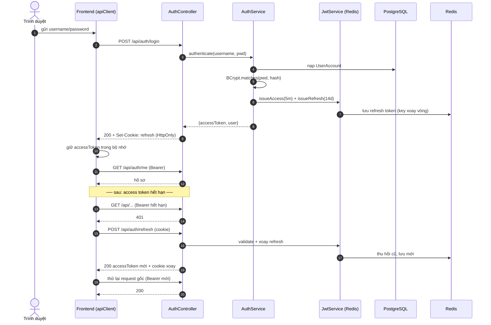
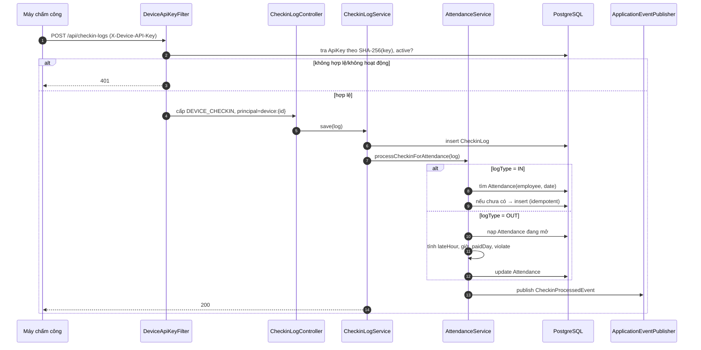
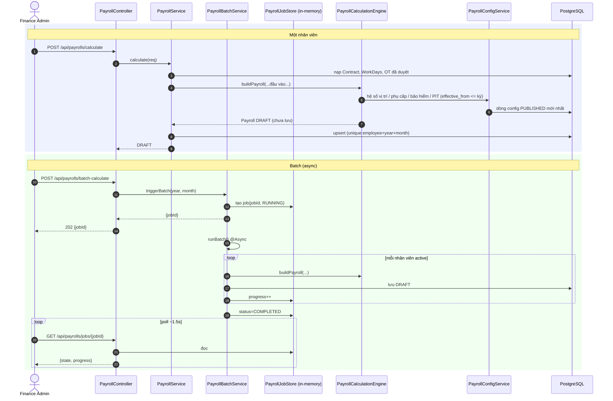
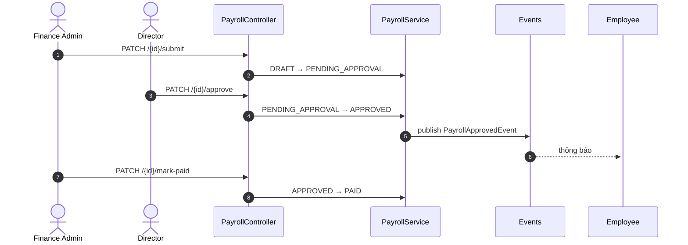
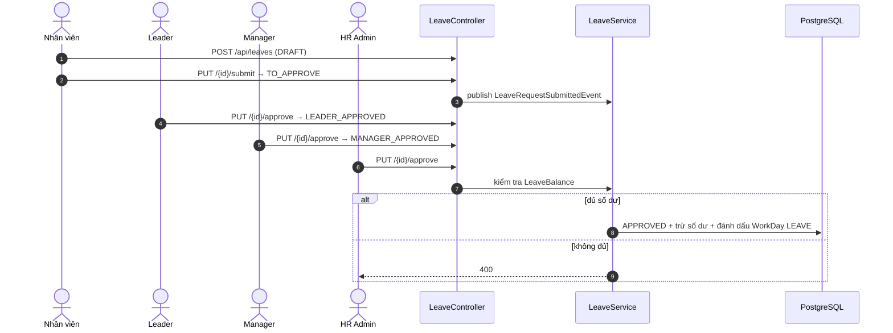

# Sơ đồ Tuần tự (Sequence) — FaceZ HRMS

**Phiên bản:** 1.0 | **Ngày:** 16-06-2026
**Liên quan:** [Security](10-security-design.md) · [Integration](11-integration-design.md) · [Process Flows](../01-business/04-process-flows-bpmn.md)

Sơ đồ tương tác cấp message cho các luồng trải qua nhiều thành phần.

---

## 1. Đăng nhập JWT + Refresh ngầm

**Ghi chú:** access token stateless (kiểm tra bằng chữ ký); refresh token có trạng thái trong Redis
(xoay vòng + thu hồi). Refresh bị thu hồi/hết hạn → 401 → frontend đăng xuất. Rate limiter (10/15 phút/IP)
bọc `/login`.

---

## 2. Thu nhận chấm công → Attendance

**Biến thể batch:** `POST /api/checkin-logs/batch` lặp mảng qua cùng đường `save → processCheckinForAttendance`
(dùng sau đệm offline). Cron đêm `AttendanceSchedule` chạy lại backfill ngày hôm trước và tái dựng `WorkDay`.

---

## 3. Lương tháng (đơn + batch)

**Ghi chú:** engine thuần — mọi đọc DB diễn ra ở service/`PayrollConfigService` *trước* khi gọi engine.
Tra config hiệu lực theo ngày (`effective_from ≤ năm-tháng-01`, `PUBLISHED` mới nhất). Tách bạch trách nhiệm
enforce bằng vai trò ở `submit` (Finance) vs `approve` (Director).

---

## 4. Duyệt nghỉ phép đa cấp (chuyển trạng thái)

