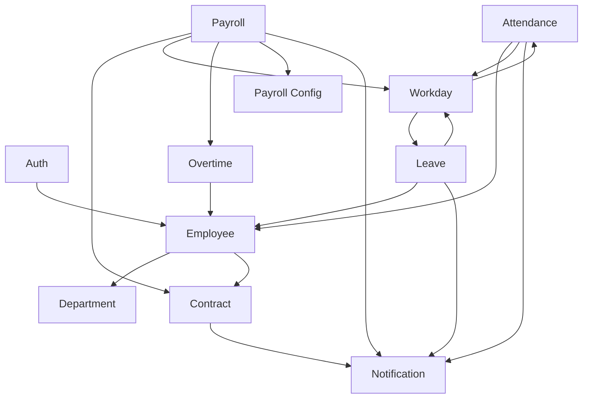

# Thiết kế Thành phần / Module — FaceZ HRMS

**Phiên bản:** 1.0 | **Ngày:** 16-06-2026
**Liên quan:** [System Architecture](05-system-architecture.md) · [Database Design](06-database-design.md) · [API Design](07-api-design.md)

Tài liệu mô tả trách nhiệm, interface công khai (controller/service), phụ thuộc, và lớp nội bộ chính của
mỗi module backend. Cấu trúc module frontend ở cuối.

---

## 0. Hình dạng module chuẩn

Mỗi module domain theo cùng cách chia sub-package:
```
domain/<module>/
  controller/   @RestController — bề mặt HTTP, trả ApiResponse<T>
  dto/          record request/response (Bean Validation)
  model/        @Entity (đa số kế thừa AuditableEntity)
  repository/   interface Spring Data JPA
  service/      logic nghiệp vụ @Service (@Transactional)
  event/        (attendance, notification) ApplicationEvents
  scheduler/    (contract, payroll, attendance) job @Scheduled
```
Mã xuyên suốt ở `common/` (enum, filter, envelope, JWT, exception handler, `AuditableEntity`,
`AuditorAwareImpl`) và `configs/` (`SecurityConfig`, `RedisConfig`, `DataInitializerConfig`,
`JpaAuditingConfig`, `AsyncConfig`).

## 1. Bản đồ module & phụ thuộc



Phụ thuộc trỏ từ bên dùng tới bên cung cấp. Notification chỉ được chạm tới qua **sự kiện**, không gọi
trực tiếp (loose coupling).

---

## 2. Module Auth (`auth/`, `common/services`, `common/filters`)
**Trách nhiệm:** xác thực, cấp/validate/refresh/thu hồi JWT, giới hạn tần suất login.
**Interface công khai:** `AuthController` (`/api/auth/*`).
**Lớp chính:** `AuthService`, `JwtService` (token store Redis + xoay vòng/thu hồi), `JwtUtils`,
`JwtAuthFilter`, `DeviceApiKeyFilter`.
**Phụ thuộc:** Employee (`UserAccount` là `UserDetails`), Redis.
**Ghi chú:** access token stateless; refresh token là trạng thái session server-side duy nhất.

## 3. Module Employee (`domain/employee`)
**Trách nhiệm:** hồ sơ nhân viên, tài khoản, benefit, người phụ thuộc thuế, ảnh đại diện.
**Controller:** `EmployeeController`, `AccountController`, `TaxDependentController`.
**Service chính:** `EmployeeService`, `AccountService`, `TaxDependentService`, `ProfilePictureService`
(upload file vào `uploads/profile-pictures/`, trần 5 MB).
**Entity:** `EmployeeInfo`, `UserAccount` (`@MapsId` 1:1), `Benefit`, `TaxDependent`.
**Bất biến:** username unique; mã pháp lý unique; xóa mềm.

## 4. Module Department (`domain/department`)
**Trách nhiệm:** CRUD phòng ban, gán quản lý.
**Controller:** `DepartmentController`. **Entity:** `Department` (unique `manager_id`).
**Phụ thuộc:** Employee (quản lý + thành viên).

## 5. Module Contract (`domain/contract`)
**Trách nhiệm:** vòng đời hợp đồng có lịch sử; đính kèm tài liệu; thông báo hết hạn.
**Controller:** `ContractController`. **Service:** `ContractService`. **Scheduler:** `ContractExpiryScheduler` (hàng tháng → `ContractExpiringEvent`).
**Entity:** `Contract` (`baseSalary, positionCode, salaryStep, insuranceBase, dependentCount, contractType`, trường lịch sử).
**Bất biến:** đúng một hợp đồng hiện hành/nhân viên (BR-CT-01).

## 6. Module Attendance (`domain/attendance`)
**Trách nhiệm:** thu nhận chấm công thô, suy diễn chấm công ngày, chốt kỳ, thiết bị/API key, ngày lễ, điều chỉnh.
**Controller:** `CheckinLogController`, `AttendanceController`, `AttendanceAdjustmentController`, `DeviceController`, `PublicHolidayController`.
**Service:** `CheckinLogService`, `AttendanceService` (`processCheckinForAttendance`, tính giờ/vi phạm), `PeriodCloseService`, `ApiKeyService`, `PublicHolidayService`.
**Scheduler:** `AttendanceSchedule` (00:00 backfill). **Event:** `CheckinProcessedEvent`.
**Entity:** `CheckinLog`, `Attendance`, `AttendancePeriodClose`, `Device`, `ApiKey`, `PublicHoliday`, `AttendanceAdjustment`.

## 7. Module Workday (`domain/workday`)
**Trách nhiệm:** đối soát chấm công + nghỉ phép + ngày lễ thành `WorkDay` mỗi ngày và `Timesheet` tháng; phát hiện và giải quyết xung đột.
**Controller:** `WorkDayController`, `TimesheetController`.
**Service:** `WorkDayService` (ưu tiên nguồn: MANUAL > còn lại; CONFLICT khi nguồn mâu thuẫn).
**Entity:** `WorkDay` (`WorkDayType`, `WorkDaySource`, `paidDay`, `violation`), `Timesheet`.
**Bị dùng bởi:** Payroll (`NCtt` = Σ `paidDay`).

## 8. Module Leave (`domain/leave`)
**Trách nhiệm:** đơn nghỉ phép duyệt đa cấp; số dư phép.
**Controller:** `LeaveController`. **Service:** `LeaveService`, `LeaveBalanceService`.
**Entity:** `LeaveRequest` (`RequestStatus`, `LeaveType`), `LeaveBalance`.
**Event:** `LeaveRequestSubmittedEvent`.

## 9. Module Overtime (`domain/otrequest`)
**Trách nhiệm:** OT request (cùng máy duyệt như leave) và OT plan.
**Controller:** `OTRequestController`, `OTPlanController`. **Service:** `OTRequestService`, `OTPlanService`.
**Entity:** `OTRequest`, `OTPlan`, `OTPlanEmployee`.
**Bị dùng bởi:** Payroll (OT đã duyệt → `otPay`).

## 10. Module Payroll (`domain/payroll`)
**Trách nhiệm:** tính lương (đơn + batch), workflow maker-checker, phiếu lương, báo cáo, config pháp lý.
**Controller:** `PayrollController`, `PayrollConfigController`, `SystemConfigController` (cũ).
**Service:**
- `PayrollService` — điều phối một nhân viên: nạp đầu vào → engine → lưu.
- `PayrollBatchService` — `triggerBatch()` (đồng bộ, trả `jobId`) + `runBatch()` (`@Async`); trạng thái qua `PayrollJobStore`.
- `PayrollCalculationEngine` — `@Component` **thuần**, không DB/transaction; `buildPayroll(...)` trả `DRAFT` chưa lưu (xem [Business Rules §1](../01-business/03-business-rules.md)).
- `PayrollConfigService` — tra config hiệu lực theo ngày (hệ số vị trí, phụ cấp, tỷ lệ bảo hiểm/PIT, lương tối thiểu).
- `PayrollReportService` — tổng hợp chi phí lao động / đối chiếu bảo hiểm / tổng hợp PIT.
- `SystemConfigService` — config JSONB cũ.
**Scheduler:** `PayrollScheduler` (ngày 1 hàng tháng → batch).
**Entity:** `Payroll`; model config `SalaryGradeConfig/SalaryGrade/SalaryGradeStep`, `PitConfig/PitBracket`, `InsuranceConfig/InsuranceEligibleContractType`, `AllowanceConfig/AllowanceLevel/JapaneseAllowanceLevel/AllowanceRuleValue`, `SystemConfig` cũ.
**Hợp đồng interface (engine):**
```
buildPayroll(employeeId, year, month, nt, contract,
             List<WorkDay>, List<OTRequest> approvedOt,
             kpi1Rating, kpi2Rating, japaneseLevel,
             odcAllowance, bonus, notes,
             Double kpi1Override, Double kpi2Override) : Payroll(DRAFT, chưa lưu)
```

## 11. Module Notification (`domain/notification`)
**Trách nhiệm:** thông báo trong app theo sự kiện.
**Controller:** `NotificationController`. **Service:** `NotificationService.send()`.
**Listener:** `NotificationEventListener` xử lý `LeaveRequestSubmittedEvent`, `PayrollApprovedEvent`, `ContractExpiringEvent`, `CheckinProcessedEvent`.
**Entity:** `Notification` (theo người dùng, cờ đã đọc). **Coupling:** chỉ sự kiện vào.

## 12. Thành phần xuyên suốt (`common/`, `configs/`)
| Thành phần | Vai trò |
|------------|---------|
| `ApiResponse<T>` / `PageResponse<T>` | Envelope phản hồi thống nhất |
| `GlobalExceptionHandler` | Ánh xạ exception → `ApiResponse` + status |
| `AuditableEntity` / `AuditorAwareImpl` / `JpaAuditingConfig` | `createdBy/updatedBy/createdAt/updatedAt` |
| `SecurityConfig` | Filter chain, rule URL, CORS, BCrypt |
| `RedisConfig` | Kết nối token / rate-limit |
| `AsyncConfig` | Thread pool cho `@Async` batch |
| `DataInitializerConfig` | Seed admin mặc định `admin/admin123` |

## 13. Cấu trúc module frontend (`facez-front/src/app`)
- **`commons/`** — `types/index.ts` (mọi DTO), `utils/ApiCallUtil.tsx` (`apiClient()` — điểm vào mạng duy nhất: gắn token, refresh ngầm, chuẩn hóa lỗi), `utils/formatters.ts`.
- **`services/`** — một file/module backend (vd `PayrollConfigService.ts`, `ContractService.ts`), mỗi file bọc `apiClient`.
- **`components/`** — feature chia ba file: `*Content.tsx` (state + layout), `*Table.tsx` (fetch phân trang, theo refresh-key), `*FormModal.tsx` (tạo/sửa qua `Modal` dùng chung). UI tái dùng ở `components/common/`.
- **contexts** — `AuthContext` (`useAuth`), `ToastContext` (`useToast`), cung cấp ở `layout.tsx` gốc.
- **routing** — nhóm route theo vai trò (`employees/`, `managers/`, `hr/`, `finance/`, `director/`, `system/`) bảo vệ bởi `ProtectedRoute`.

## 14. Lưu ý ổn định interface
- **Chữ ký engine** và **envelope `ApiResponse`** là hợp đồng được phụ thuộc nhiều nhất; đổi cẩn trọng.
- Tra config **chỉ** qua `PayrollConfigService` (engine không đọc trực tiếp bảng config).
- Sự kiện mới phải được xử lý trong `NotificationEventListener` để hiện cho người dùng.
