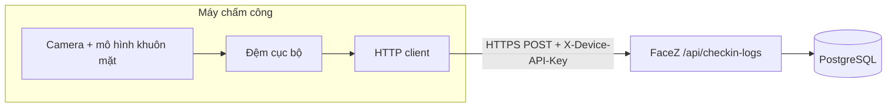
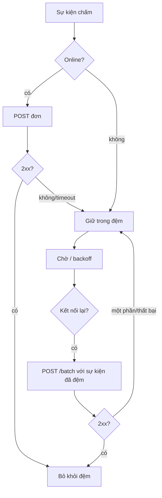

# Tài liệu Thiết kế Tích hợp — FaceZ HRMS

**Phiên bản:** 1.0 | **Ngày:** 16-06-2026
**Phạm vi:** Tích hợp với **máy chấm công (nhận diện khuôn mặt)** bên ngoài — tích hợp ngoài duy nhất ở
bản nền hiện tại. **Liên quan:** [Sequence §2](08-sequence-diagrams.md) · [Security §5](10-security-design.md) · [API §8](07-api-design.md)

---

## 1. Bối cảnh tích hợp



Thiết bị **nhận diện khuôn mặt cục bộ** và phân giải `employeeId`. FaceZ **không** chạy mô hình sinh trắc
— nó thu nhận sự kiện chấm công đã nhận diện. Điều này giữ dữ liệu sinh trắc ngoài HRMS và làm hợp đồng
trở thành một feed sự kiện đơn giản, kiểm toán được.

## 2. Giao thức & truyền tải

| Khía cạnh | Quyết định |
|-----------|-----------|
| Giao thức | HTTP/REST trên TLS (JSON) |
| Endpoint | `POST /api/checkin-logs` (đơn), `POST /api/checkin-logs/batch` (mảng) |
| Auth | Header `X-Device-API-Key` (kiểm tra SHA-256); hoặc JWT HR/SysAdmin cho nhập tay |
| Content-Type | `application/json` |
| Idempotency | `IN` cho ngày đã có bị bỏ qua server-side (BR-AT-02) |

> REST (không phải MQTT) là thiết kế hiện tại: thiết bị là HTTP client, backend là server. Envelope
> `ApiResponse` thống nhất và filter bảo mật hiện có áp dụng nguyên vẹn. Nếu tương lai cần push/streaming
> hoặc thiết bị hạn chế, MQTT có thể đứng trước một bridge POST tới cùng endpoint.

## 3. Schema payload

### 3.1 Một lần chấm — `POST /api/checkin-logs`
```json
{
  "employeeId": "emp-123",
  "deviceId":   "dev-LOBBY-1",
  "logType":    "IN",            // IN | OUT  (LogTypes)
  "logTime":    "2026-06-16T08:02:11"
}
```

### 3.2 Upload batch — `POST /api/checkin-logs/batch`
```json
[
  { "employeeId": "emp-123", "deviceId": "dev-LOBBY-1", "logType": "IN",  "logTime": "2026-06-16T08:02:11" },
  { "employeeId": "emp-123", "deviceId": "dev-LOBBY-1", "logType": "OUT", "logTime": "2026-06-16T17:31:40" },
  { "employeeId": "emp-777", "deviceId": "dev-LOBBY-1", "logType": "IN",  "logTime": "2026-06-16T08:15:02" }
]
```

| Trường | Kiểu | Quy tắc |
|--------|------|---------|
| `employeeId` | string | Phải trỏ tới nhân viên tồn tại (FK) |
| `deviceId` | string | Phải trỏ tới thiết bị đã đăng ký (FK) |
| `logType` | enum | `IN` hoặc `OUT` |
| `logTime` | ISO-8601 local datetime | Server dùng giờ địa phương cho kỳ lương |

### 3.3 Phản hồi
```json
{ "success": true, "message": "2 logs processed", "data": { "accepted": 2, "skipped": 0 } }
```

## 4. Xác thực thiết bị & quản lý key

- HR cấp key/thiết bị qua `POST /api/devices/{deviceId}/api-keys`; **raw key trả về một lần**.
- Thiết bị lưu raw key trong cấu hình an toàn và gửi qua `X-Device-API-Key`.
- Server chỉ lưu `SHA-256(rawKey)`; `DeviceApiKeyFilter` validate với key **active**.
- Xoay vòng: cấp key mới, deploy lên thiết bị, rồi `deactivate` key cũ (chồng lấp không downtime).
- Phản ứng khi lộ: deactivate ngay — thiết bị bị khóa ở request kế tiếp.

## 5. Độ tin cậy: đệm offline, retry, kết nối lại



**Yêu cầu thiết kế cho client thiết bị:**
- **Đệm** các lần chấm cục bộ (lưu trữ bền) đến khi nhận `2xx`.
- **Retry** với exponential backoff khi lỗi mạng/5xx; **không** bỏ sự kiện chưa ack.
- **Batch** đệm khi kết nối lại qua `/batch`; sự kiện mang `logTime` gốc (không phải giờ upload).
- **Chịu idempotency:** gửi lại an toàn — server bỏ qua `IN` trùng cho ngày đã có và đối soát đêm sửa phần thiếu.
- **Đồng hồ:** giữ đồng hồ thiết bị đồng bộ NTP; `logTime` quyết định tính đúng của chấm công.

**Đối soát server-side:** `AttendanceSchedule` (00:00) backfill ngày hôm trước từ log thô và
`WorkDayService` tái dựng `WorkDay`, gắn `CONFLICT` khi nguồn mâu thuẫn (HR giải quyết).

## 6. Hợp đồng xử lý lỗi

| Tình huống | HTTP | Hành động thiết bị |
|------------|------|--------------------|
| API key sai/không hoạt động | 401 | Dừng; cảnh báo ops; không retry đến khi cấp lại key |
| Employee/device không xác định (FK) | 400 | Log; cách ly sự kiện cho HR xem xét |
| Payload sai định dạng | 400 | Bỏ sau khi log (lỗi client) |
| Server 5xx / timeout | 5xx | Retry với backoff; giữ trong đệm |
| `IN` trùng | 200 (`skipped`) | Coi như thành công; bỏ khỏi đệm |

## 7. Ghi chú công suất & thứ tự

- Sự kiện xử lý theo thứ tự gửi trong một batch; ghép cặp `IN`/`OUT` theo nhân viên+ngày, nên giao
  không đúng thứ tự giữa các batch vẫn đối soát được (bản ghi mở được đóng bởi `OUT` đến sau).
- Kích thước batch nên bị thiết bị giới hạn (vd ≤ vài trăm/request) để giữ transaction nhỏ; tồn đọng rất
  lớn nên chia khúc.

## 8. Tích hợp tương lai / ngoài phạm vi

- **Payroll → file ngân hàng / cổng thanh toán:** hiện `mark-paid` là đổi trạng thái thủ công; xuất
  file ngân hàng là ứng viên tích hợp tương lai.
- **Nhà cung cấp định danh (SSO/LDAP):** chưa tích hợp; xác thực cục bộ (BCrypt + JWT).
- **Xuất ERP/kế toán ngoài:** báo cáo tài chính hiện là CSV; có thể tiến tới tích hợp API/file.
