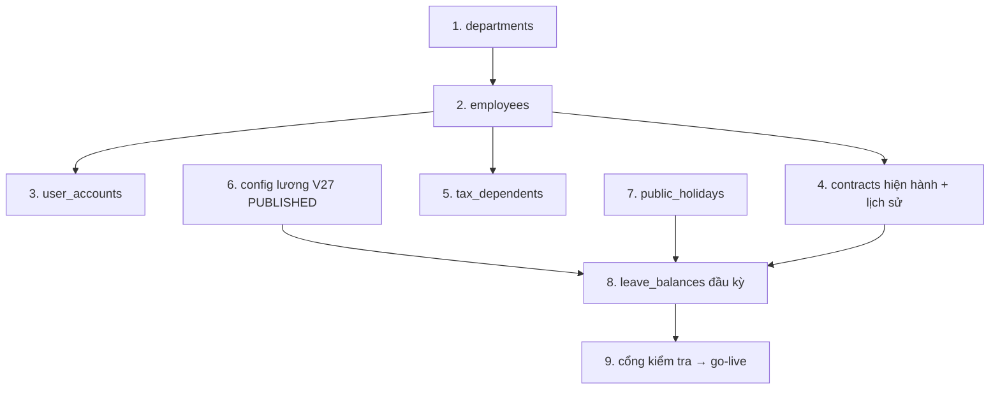

# Kế hoạch Di trú Dữ liệu — FaceZ HRMS

**Phiên bản:** 1.0 | **Ngày:** 16-06-2026
**Liên quan:** [Database Design](../02-technical/06-database-design.md) · [Deployment Guide](13-deployment-guide.md) · [Business Rules](../01-business/03-business-rules.md)

Bao quát việc đưa dữ liệu HR hiện có của tổ chức (bảng tính / phần mềm cũ) vào FaceZ, cộng với seed
**cấu hình lương hiệu lực theo ngày** bắt buộc trước mọi lần chạy lương.

---

## 1. Phạm vi & nguồn

| Nguồn cũ | Bảng đích |
|----------|-----------|
| Bảng tính danh mục nhân viên | `employee_info`, `user_account` |
| Cơ cấu tổ chức | `department` (+ liên kết quản lý) |
| Hợp đồng hiện tại | `contract` (một hiện hành/nhân viên, mở lịch sử) |
| Người phụ thuộc thuế | `tax_dependent` |
| Chấm công lịch sử (tùy chọn) | `attendance` / `check_in_log` (thường bắt đầu mới từ go-live) |
| Số dư phép (chuyển tiếp) | `leave_balance` |
| Bảng mức pháp lý (bậc lương, PIT, bảo hiểm, phụ cấp) | Bảng config V27 (`*_config` + con) |
| Ngày lễ | `public_holiday` |

**Chiến lược:** di trú **dữ liệu danh mục/tham chiếu** (nhân viên, phòng ban, hợp đồng, config, ngày lễ,
số dư phép đầu kỳ). Dữ liệu giao dịch (chấm công, payroll) thường **bắt đầu tại go-live**; payroll lịch
sử giữ ở hệ thống cũ để tham chiếu thay vì tính lại.

## 2. Công cụ

- **Schema** do Flyway sở hữu (`V1`–`V27`); di trú chỉ nạp **dữ liệu** vào schema đã migrate.
- **Script seed/nạp** đã có trong `facez/src/main/resources/scripts/`:
  - `insert_mock_data.py` — nhân viên/phòng ban/hợp đồng mẫu (mẫu để nạp thật).
  - `insert_extra_tables.py` — bảng phụ trợ.
  - `insert_payroll_configs.py` — seed config lương hiệu lực theo ngày V27 (bậc lương, PIT, bảo hiểm,
    phụ cấp) dạng version `PUBLISHED`.
- Di trú thật = chỉnh các script này (hoặc job ETL) để đọc file nguồn đã làm sạch và insert với
  **giá trị tương thích tầng service** (PK String UUID, tên enum, tiền VND `BIGINT`).

## 3. Quy tắc mapping trường

| Mối quan tâm | Quy tắc |
|--------------|---------|
| Khóa chính | Sinh String UUID; giữ crosswalk `legacy_id → uuid` để re-run và join |
| Enum | Ánh xạ mã cũ sang tên enum chính xác (`Role`, `EmployeeStatus`, `LeaveType`, `ContractType`) |
| Tiền | Chuyển sang VND `BIGINT` đồng nguyên; bậc lương ở `amount_thousand_vnd` |
| Ngày | Ngày ISO; neo kỳ lương = `năm-tháng-01`; `effective_from` config phải trước lần chạy đầu |
| Mã pháp lý | Enforce tính duy nhất (nationalId/taxCode/socialInsuranceCode) trước khi nạp |
| Liên kết quản lý | Một quản lý/phòng ban — xử lý trùng trước khi nạp |
| Cơ sở bảo hiểm | Mặc định bằng lương cơ bản nếu nguồn cũ thiếu cơ sở bảo hiểm riêng |
| Người phụ thuộc | `contract.dependent_count` phải khớp số dòng `tax_dependent` |

## 4. Trình tự di trú (theo thứ tự phụ thuộc)

1. **Phòng ban** (chưa gán quản lý).
2. **Nhân viên** → rồi back-fill `manager_id` cho phòng ban.
3. **Tài khoản** (mật khẩu tạm; ép đổi lần đầu).
4. **Hợp đồng** — đặt đúng một `current=true`/nhân viên; mở lịch sử.
5. **Người phụ thuộc thuế**.
6. **Config lương** — publish bậc lương/PIT/bảo hiểm/phụ cấp với `effective_from ≤ kỳ đầu`.
7. **Ngày lễ** cho năm liên quan.
8. **Số dư phép đầu kỳ** (chuyển tiếp).
9. **Cổng kiểm tra** (§5) trước khi tuyên bố go-live.

## 5. Kiểm tra sau di trú

| ID | Kiểm tra | Điều kiện đạt |
|----|----------|---------------|
| V-01 | Số dòng | đã nạp == số dòng nguồn đã làm sạch theo bảng |
| V-02 | Toàn vẹn tham chiếu | không FK mồ côi (employee/department/device) |
| V-03 | Một hợp đồng hiện hành/nhân viên | `count(current=true)=1` cho mọi nhân viên |
| V-04 | Một quản lý/phòng ban | không trùng `manager_id` |
| V-05 | Tính duy nhất mã pháp lý | không trùng nationalId/taxCode/SI |
| V-06 | Config hiệu lực | có dòng `PUBLISHED` mỗi loại với `effective_from ≤ kỳ` |
| V-07 | Bất biến config | bậc 1..10; mọi tỷ lệ ∈ [0,1] (check constraint giữ vững) |
| V-08 | Smoke login | một user đã di trú đăng nhập được; `/me` trả đúng role/phòng ban |
| V-09 | Dry-run payroll | tính một nhân viên cho kỳ đã chốt; so với số liệu cũ trong dung sai |
| V-10 | Số dư phép | số dư đã di trú khớp bảng chuyển tiếp |

**V-09 là cổng nghiệm thu:** đối chiếu lương tính của một mẫu nhân viên đã di trú với hệ thống cũ; điều
tra mọi sai lệch ngoài làm tròn trước khi go-live.

## 6. Kế hoạch rollback

- **Backup trước di trú:** dump PostgreSQL đầy đủ (`pg_dump`) DB đích ngay trước khi nạp; snapshot bucket
  MinIO và volume `uploads/`.
- **Nạp theo transaction:** bọc mỗi bảng trong một transaction; lỗi thì rollback bước đó.
- **Re-run idempotent:** dùng crosswalk `legacy_id → uuid` và upsert để re-run không nhân đôi.
- **Rollback toàn bộ:** nếu kiểm tra thất bại không cứu được, restore `pg_dump` và snapshot object, sửa
  nguồn/mapping, và chạy lại từ bước 1.
- **Rollback schema:** migration Flyway chỉ-tiến — **không** sửa tay migration đã apply; lỗi schema được
  sửa bằng migration mới, không revert `V*`.

## 7. Checklist cutover

- [ ] File nguồn đã làm sạch, khử trùng lặp, và HR ký duyệt.
- [ ] Đã tạo và lưu crosswalk `legacy_id → uuid`.
- [ ] Đã backup + snapshot trước di trú.
- [ ] Bước 1–8 thực thi đúng thứ tự; log số dòng mỗi bước.
- [ ] Kiểm tra V-01…V-10 đều đạt (V-09 đã đối chiếu).
- [ ] Đã đổi mật khẩu admin mặc định; ép user đã di trú đổi mật khẩu.
- [ ] Thiết bị đã đăng ký + cấp key (chấm công bắt đầu tại go-live).
- [ ] Hệ thống cũ đóng băng (chỉ đọc) để tránh phân kỳ.
- [ ] Ghi nhận ký duyệt go-live.
