# Thiết kế Lớp · Cơ sở dữ liệu · Form CRUD — FaceZ HRMS

> Tài liệu trích xuất **từ source code thực tế** (entity, Flyway migration, DTO) tại thời điểm review, kèm các điểm chưa nhất quán cần xử lý trước khi triển khai các phần còn thiếu (Device CRUD, số dư nghỉ phép, quản lý tài khoản).
> Nguồn: `facez/src/main/java/.../model/`, `facez/src/main/resources/db/migration/`, `.../dto/`.

---

# PHẦN 1 — THIẾT KẾ LỚP (CLASS DESIGN)

## 1.1 Sơ đồ lớp tổng thể (theo code thực tế)

```mermaid
classDiagram
    class AuditableEntity {
        <<MappedSuperclass>>
        +LocalDateTime createdAt
        +LocalDateTime updatedAt
        +String createdBy
        +String updatedBy
    }

    class EmployeeInfo {
        +String employeeId «PK»
        +String name
        +Role role
        +EmployeeStatus status
        +String email, phoneNumber, address
        +LocalDate dateOfJoining, dateOfBirth
        +String nationalId «UK», taxCode «UK», socialInsuranceCode «UK»
        +String bankAccountNumber, bankName, bankBranch
        +Gender gender
        +String hometown, emergencyContact
        +byte[] profilePicture  «redundant»
        +String profilePictureUrl
        +boolean deleteFlag
    }
    class UserAccount {
        +String employeeId «PK/FK @MapsId»
        +String username «UK»
        +String passwordHash
        +String lastPasswordHash
        +Role role  «duplicated»
        +boolean deleteFlag
    }
    class Department {
        +String departmentId «PK»
        +String departmentName
        +EmployeeInfo manager «cascade ALL»
        +boolean deleteFlag
    }
    class Contract {
        +String id «PK»
        +String contractType, status, salaryRank
        +LocalDate startDate, endDate
        +LocalDate effectiveFrom, effectiveTo
        +boolean current
        +Long baseSalary, insuranceBase
        +String positionCode
        +Integer salaryStep, dependentCount
        +byte[] attachment
        +boolean deleteFlag
    }
    class Attendance {
        +String attendanceId «PK»
        +LocalDate attendanceDate
        +LocalDateTime checkIn, checkOut
        +BigDecimal lateHour, workingHour, paidHour, workingDay, paidDay
        +boolean violate, deleteFlag
    }
    class CheckinLog {
        +String logId «PK»
        +Device device
        +LocalDateTime logTime
        +LogTypes logType
        +boolean deleteFlag
    }
    class Device {
        +String deviceId «PK»
        +String deviceName
        +LogTypes logType
        +boolean deleteFlag
    }
    class ApiKey {
        +String id «PK»
        +String keyHash
        +Device device
        +boolean active
        +LocalDateTime createdAt, lastUsedAt
    }
    class LeaveRequest {
        +String leaveRequestId «PK»
        +LeaveType leaveType
        +String reason
        +LocalDateTime startTime, endTime
        +RequestStatus status
        +BigDecimal durationHours
        +boolean balanceDeducted, deleteFlag
    }
    class LeaveBalance {
        +String id «PK»
        +int leaveYear
        +LeaveType leaveType
        +BigDecimal entitlementDays, carriedOverDays
        +BigDecimal pendingDays, usedDays, remainingDays
        +BigDecimal carryOverCap
    }
    class OTRequest {
        +String otRequestId «PK»
        +LocalDateTime startTime, endTime
        +RequestStatus status
        +boolean deleteFlag
    }
    class Payroll {
        +String payrollId «PK»
        +int payrollYear, payrollMonth
        +long performanceSalary, positionCoefficient
        +long livingAllowance, languageAllowance, odcAllowance
        +double kpi1Score, kpi2Score, kpiAverage
        +int actualWorkingDays, standardWorkingDays
        +long otPay, bonus, baseGross, totalGross
        +long insuranceBase, bhxhEmployee, bhytEmployee, bhtnEmployee
        +int dependentCount
        +long taxableIncome, pit
        +long bhxhEmployer, bhytEmployer, bhtnEmployer, workplaceAccidentInsurance
        +long totalEmployerContributions, totalEmploymentCost, netSalary
        +PayrollStatus status
        +String rejectionReason, notes
    }
    class TaxDependent {
        +String id «PK»
        +String fullName, nationalId, relationship
        +LocalDate dateOfBirth, registrationDate
        +boolean active
    }
    class PublicHoliday {
        +String id «PK»
        +int holidayYear
        +LocalDate holidayDate
        +String name
        +boolean compensatoryDay
    }
    class AttendancePeriodClose {
        +String id «PK»
        +int closeYear, closeMonth
        +String closedBy, notes
        +LocalDateTime closedAt
    }
    class SystemConfig {
        +String id «PK»
        +String configType, version
        +LocalDate effectiveDate
        +String legalBasis
        +JsonNode configData «jsonb»
        +boolean active
    }
    class Notification {
        +String notificationId «PK»
        +String title, message, type
        +boolean read
        +LocalDateTime createdAt
    }
    class Benefit {
        +String benefitRank «PK»
        +EmployeeLevels employeeLevel
        +String housing/meal/vehicle/phoneBenefit
        +boolean deleteFlag
    }

    AuditableEntity <|-- EmployeeInfo
    AuditableEntity <|-- UserAccount
    AuditableEntity <|-- Contract
    AuditableEntity <|-- Attendance
    AuditableEntity <|-- LeaveRequest
    AuditableEntity <|-- OTRequest
    AuditableEntity <|-- Payroll
    AuditableEntity <|-- SystemConfig

    UserAccount "1" --> "1" EmployeeInfo : @MapsId (shared PK)
    EmployeeInfo "*" --> "1" Department : department_id
    Department "1" --> "0..1" EmployeeInfo : manager_id
    Contract "*" --> "1" EmployeeInfo
    Attendance "*" --> "1" EmployeeInfo
    LeaveRequest "*" --> "1" EmployeeInfo
    LeaveBalance "*" --> "1" EmployeeInfo
    OTRequest "*" --> "1" EmployeeInfo
    Payroll "*" --> "1" EmployeeInfo
    TaxDependent "*" --> "1" EmployeeInfo
    Notification "*" --> "1" EmployeeInfo : recipient
    CheckinLog "*" --> "1" EmployeeInfo
    CheckinLog "*" --> "1" Device
    ApiKey "*" --> "1" Device
```

## 1.2 Vấn đề ở tầng lớp (class-level) cần xử lý

| # | Mức | Lớp | Vấn đề | Đề xuất |
|---|:---:|---|---|---|
| C1 | 🔴 | `Payroll` | Vừa `extends AuditableEntity` (đã có createdAt/updatedAt) **vừa khai báo lại** `createdAt`/`updatedAt` của riêng nó → trùng cột, nhập nhằng nguồn ghi | Xóa 2 trường thừa, dùng của AuditableEntity |
| C2 | 🔴 | `Notification` | Có `title`, `type` **NOT NULL** trong entity nhưng migration V18 (chạy thật) **không tạo 2 cột này** → lưu notification sẽ lỗi runtime | Thêm migration V20 bổ sung `title`, `type`; hoặc sửa entity |
| C3 | 🔴 | `Notification` | Trường `read` map cột `read`, nhưng bảng dùng `read_flag` (V18) → không có `@Column(name="read_flag")` | Thêm `@Column(name="read_flag")` |
| C4 | 🟡 | `EmployeeInfo` | Tồn tại song song `byte[] profilePicture` (@Lob/OID) **và** `profilePictureUrl` | Bỏ blob, chỉ giữ URL (đồng bộ GAP-C) |
| C5 | 🟡 | `Role` | Lưu ở **cả** `EmployeeInfo.role` lẫn `UserAccount.role` → hai nguồn sự thật, dễ lệch | Chọn 1 nguồn (khuyến nghị `UserAccount`) |
| C6 | 🟡 | `Department` | `@OneToOne(cascade=ALL)` tới manager + `EmployeeInfo.department` cũng `cascade=ALL` | Bỏ `cascade=ALL`, chỉ giữ liên kết FK |
| C7 | 🟡 | `Benefit` | Không `extends AuditableEntity`, tự khai createdAt/updatedAt/deleteFlag; **không có controller/service/UI** → bảng mồ côi | Xóa hẳn hoặc nối vào salary-grade config |
| C8 | 🟡 | `LeaveBalance`, `Device`, `CheckinLog`, `TaxDependent`, `PublicHoliday`, `ApiKey`, `Notification` | Không kế thừa AuditableEntity; soft-delete áp dụng không đồng đều | Thống nhất chuẩn audit + soft delete |
| C9 | 🟢 | nhiều `@Id` | Độ dài khoá không nhất quán (`VARCHAR(64)` vs `VARCHAR(255)` vs không khai báo) | Chuẩn hóa UUID `VARCHAR(36)`/`(64)` |
| C10 | 🟢 | Tiền tệ | `Contract` dùng `Long` (nullable), `Payroll` dùng `long` primitive | Thống nhất kiểu + xử lý null |

---

# PHẦN 2 — KIỂM TRA THIẾT KẾ DATABASE

## 2.1 Tổng quan schema
19 bảng + 1 view (`ot_monthly_summary`). Quan hệ trung tâm: `employee_info` (1:1 `user_account` qua shared PK; 1:N hầu hết bảng nghiệp vụ). Quan hệ vòng `department ↔ employee_info` (mỗi bên trỏ nhau) xử lý bằng FK trì hoãn — **đúng kỹ thuật**.

Các điểm **tốt**: dùng `numeric` cho ngày công/giờ; partial index `idx_api_key_hash ... WHERE active`; unique nghiệp vụ đúng (`uk_attendance_employee_date`, `uk_payroll_employee_period(employee_id, year, month)`, `uk_leave_balance_employee_year_type`); JSONB cho config động; index hợp lý cho truy vấn theo kỳ.

## 2.2 Vấn đề nghiêm trọng

### D1 🔴 — Chuỗi migration V1–V18 KHÔNG chạy sạch (constraint trùng tên)
`V1` tạo `uk_payroll_employee_period UNIQUE (employee_id, payroll_year, payroll_month)`.
Sau đó **V2, V3, V4 đều lặp lại** `ADD CONSTRAINT uk_payroll_employee_period UNIQUE (employee_id)`:
- Trùng **tên constraint** → PostgreSQL báo lỗi "constraint already exists" ngay tại V2 → **Flyway dừng**.
- Ngữ nghĩa cũng sai: `UNIQUE(employee_id)` = mỗi nhân viên chỉ 1 bảng lương **mãi mãi** (mâu thuẫn với yêu cầu 1 bảng lương/tháng).

→ Hệ quả: bộ migration "chính thức" có thể chưa từng migrate thành công; dự án đang dựa vào **`V19_final.sql`** (consolidated, chạy tay). Cần dọn lại V2–V4 và bỏ ràng buộc sai.

### D2 🔴 — `V19_final.sql` LỆCH với entity và với V1–V18
`V19` được mô tả là "tái tạo toàn bộ schema" nhưng khác thực tế ở nhiều chỗ:

| Đối tượng | V19_final | Migration thật / Entity | Hậu quả |
|---|---|---|---|
| `public_holiday.compensatory_day` | `DATE` | `BOOLEAN` (V9 + entity `boolean`) | Sai kiểu → Hibernate map lỗi |
| `department.parent_id` + `fk_department_parent` | Có (tự tham chiếu) | **Không có** trong entity/V1–V18 | Cột thừa, không map |
| `contract.notes` | Có | **Không có** trong entity Contract | Cột thừa |
| `notification.title`, `type` | Có | **Không có** trong V18; **có** trong entity | V19 đúng hơn V18 nhưng V19 không được Flyway chạy |

→ Hai nguồn schema (`V1–V18` vs `V19_final`) **không hội tụ**. Người mới clone có thể nhận schema khác nhau tùy cách chạy. **Cần chọn một nguồn chuẩn duy nhất.**

### D3 🔴 — Seed PIT trong DB vẫn là 11.000.000 / 4.400.000
`V15` và `V19` seed `personalDeduction: 11000000`, `dependentDeduction: 4400000` (cũ). Trong khi luận văn (vừa cập nhật) ghi **15.500.000 / 6.200.000** theo NQ 110/2025. → **Code và luận văn lệch nhau.** Nếu giữ số mới trong báo cáo, phải sửa seed config tương ứng (hoặc ngược lại) để demo khớp.

### D4 🟡 — `compensatory_day` mơ hồ về ngữ nghĩa
Entity/V9: `boolean` (đánh dấu là ngày bù). V19: `DATE` (ngày làm bù). Hai cách hiểu khác nhau → cần chốt: cờ boolean hay ngày cụ thể.

### D5 🟡 — Bảng `benefit` mồ côi
Tồn tại qua nhiều migration nhưng không có controller/service/UI nào dùng. Hoặc xóa, hoặc tích hợp vào `system_config (SALARY_GRADE)`.

### D6 🟡 — Cột blob `profile_picture OID` còn tồn tại song song `profile_picture_url`
Lưu ảnh dạng OID/large object khó scale, đã có cột URL thay thế nhưng chưa drop. Nên drop blob ở migration mới.

### D7 🟡 — Tên `config_type` không khớp tài liệu
Tài liệu/luận văn liệt kê `SALARY_GRADE, ALLOWANCE, PIT, INSURANCE`. Seed thực tế dùng `WORK_SCHEDULE`, `PIT_BRACKETS`. → Thống nhất danh mục enum config_type.

### D8 🟡 — `work_schedule` seed `08:30` vs tài liệu `08:00`
Cấu hình giờ vào làm seed là `08:30`; luận văn (Chương 4/8) ghi mốc 08:00 để tính đi muộn. Cần khớp.

### D9 🟢 — Một số FK `ON DELETE NO ACTION` + soft delete không đồng nhất
Một số bảng `ON DELETE CASCADE` (tax_dependent, leave_balance, api_key, notification), số khác `NO ACTION` (contract, attendance...). Kết hợp với soft-delete (deleteFlag) áp dụng không đều → chính sách xóa chưa nhất quán.

## 2.3 Khuyến nghị ưu tiên DB
1. **Chốt một nguồn schema** (khuyến nghị: dọn V1–V18 cho chạy sạch, bỏ `V19_final` hoặc biến nó thành tài liệu tham khảo). Sửa D1.
2. **Thêm migration mới (V20)** đồng bộ entity↔bảng: `notification.title/type/read_flag`, drop `profile_picture` blob, sửa `compensatory_day`.
3. **Quyết định số liệu PIT** (D3) cho khớp luận văn.
4. Dọn bảng `benefit`, chuẩn hóa audit/soft-delete.

---

# PHẦN 3 — THIẾT KẾ FORM THEO HƯỚNG PRODUCTION

> Phần này được nâng cấp theo chuẩn rút ra từ form thực tế (VMS OT Registration). Mục tiêu: mỗi form đủ giàu để **vận hành thật**, không chỉ CRUD tối thiểu.
> Quy ước trạng thái trường: ✅ Đã có · ➕ Thêm mới · 🔁 Sửa/đổi. Cột **Nguồn** chỉ rõ trường map cột entity sẵn có hay cần thêm cột/bảng (liên kết Phần 1–2).

## 3.0 Chuẩn thiết kế form (áp dụng cho mọi form)

Rút ra từ form VMS, mọi form nghiệp vụ của FaceZ nên tuân theo 8 nguyên tắc:

1. **Phân vùng rõ ràng (sections):** Header (ngữ cảnh) → Chi tiết (dữ liệu chính) → Metadata duyệt (người duyệt điền). Không đổ tất cả vào một khối phẳng.
2. **Đánh dấu bắt buộc (`*`)** + validate hai lớp (client tức thì + server).
3. **Trường tính sẵn / read-only:** hiển thị ngay số giờ, số ngày, số dư còn lại, các *totals* — người dùng thấy kết quả trước khi gửi.
4. **Cảnh báo nội tuyến (inline warning):** đẩy logic nghiệp vụ **đã có ở backend** lên form (vượt 40h/tháng, vượt số dư, trùng ngày, chưa chốt kỳ) — hiển thị ngay trên dòng/khối, không đợi submit mới báo lỗi.
5. **Đính kèm bằng chứng (evidences):** đơn từ (OT, nghỉ ốm) cho phép upload minh chứng.
6. **Stepper trạng thái:** thực thể có workflow (Leave/OT/Payroll) hiển thị `Draft → Leader → Manager → HR/Director → Approved / Rejected` trực quan ngay trên form.
7. **Hiển thị audit:** ai tạo/sửa, thời điểm (read-only) — tận dụng `AuditableEntity`.
8. **Preview trước khi lưu:** thao tác tính toán (payroll) cho xem kết quả dự kiến trước khi ghi.

---

## 3.1 Form ưu tiên nâng cấp (P0–P1)

### 3.1.1 Đăng ký OT — `OTRegistrationModal` 🔁 (thiết kế lại, P0)

> Hiện tại chỉ `{startTime, endTime}` — mức prototype. Thiết kế lại theo mô hình **master–detail** giống VMS.

**Vùng Header (1 đơn / tháng):**

| Trường | Kiểu | Bắt buộc | Trạng thái | Nguồn / Ghi chú |
|---|---|:---:|:---:|---|
| Nhân viên | auto | — | ✅ | current user |
| Quản lý duyệt | auto, read-only | — | ➕ | suy từ phòng ban |
| Tháng OT | month picker | ✓ | ➕ | gom các dòng theo kỳ |
| Tổng giờ đăng ký | computed | — | ➕ | Σ các dòng |
| Tổng giờ thực tế | computed | — | ➕ | điền khi duyệt |
| Tổng giờ được trả | computed | — | ➕ | điền khi duyệt |
| Trạng thái | stepper | — | ➕ UI | `RequestStatus` |

**Vùng dòng OT — bảng con `ot_request_line` (➕ bảng mới):**

| Cột | Kiểu | Bắt buộc | Trạng thái | Validate / Ghi chú |
|---|---|:---:|:---:|---|
| Ngày | date | ✓ | ➕ | |
| Từ giờ | time | ✓ | ✅ (start) | |
| Đến giờ | time | ✓ | ✅ (end) | phải > từ giờ |
| Loại OT | select(WEEKDAY/WEEKEND/HOLIDAY) | auto | ➕ | tự suy từ ngày + `public_holiday`, cho phép sửa |
| Hệ số | read-only | — | ➕ | tra từ config theo loại (×1.5/×2.0/×3.0) |
| WFH/BZ | flag | — | ➕ | làm từ xa / tại văn phòng |
| Giờ đăng ký | computed | — | ➕ | từ Từ–Đến |
| Lý do | text | ✓ | ➕ | **bắt buộc** — hiện OT chưa có |
| Bằng chứng | file | tùy | ➕ | minh chứng OT |
| ⚠ Cảnh báo | inline | — | ➕ | "Vượt 40h/tháng" / "Vượt 200h/năm" / "Trùng ngày" — *backend đã có logic* |
| Xóa dòng | button | — | ➕ | chỉ khi DRAFT |

**Vùng metadata duyệt (chỉ người duyệt thấy/sửa):** `Giờ thực tế`, `Giờ được trả`, `Late approved` (flag), `HR Notes`, `Attendance Notes` — tất cả ➕.

> **Phương án tối thiểu (nếu chưa làm master–detail ngay):** giữ 1 đơn = 1 khoảng thời gian nhưng **bắt buộc thêm**: `reason*`, `otCategory`, `wfh`, `evidences`, hiển thị `registrationHours` tính sẵn + cột **Cảnh báo** vượt giới hạn. Đây là mức P0 tối thiểu chấp nhận được.

### 3.1.2 Đơn nghỉ phép — `LeaveFormModal` 🔁 (làm giàu, P1)

**Header:** Nhân viên (auto), Loại nghỉ `leaveType*` (✅), Quản lý duyệt (➕ auto), **Số dư còn lại** theo loại nghỉ (➕ computed, hiển thị ngay), Trạng thái stepper (➕).

**Chi tiết:**

| Trường | Kiểu | Bắt buộc | Trạng thái | Validate / Ghi chú |
|---|---|:---:|:---:|---|
| Từ ngày/giờ | datetime | ✓ | ✅ | |
| Đến ngày/giờ | datetime | ✓ | ✅ | > từ |
| Nghỉ nửa ngày | flag | — | ➕ | half-day (sáng/chiều) |
| Số ngày tính sẵn | computed | — | ➕ | từ khoảng thời gian, trừ ngày lễ |
| Lý do | text | ✓ | ✅ | |
| Đính kèm | file | tùy | ➕ | giấy khám bệnh cho SICK… |
| ⚠ Cảnh báo | inline | — | ➕ | "Vượt số dư: còn X ngày" / "Trùng ngày với đơn #…" / "Loại nghỉ này không trừ số dư" |

### 3.1.3 Stepper trạng thái dùng chung — `ApprovalStepper` ➕ (P1)
Component dùng lại cho Leave/OT/Payroll: hiển thị chuỗi `RequestStatus`/`PayrollStatus` với bước hiện tại được tô đậm, bước REJECTED tô đỏ + lý do. Đặt đầu mỗi form/chi tiết.

---

## 3.2 Form hiện có — đề xuất bổ sung (P2)

### Nhân viên — `EmployeeFormModal` ✅ (đã giàu)
Bổ sung: chia **tab** (Cá nhân / Pháp lý–Lương / Tài khoản) cho gọn; validate trùng `nationalId`/`taxCode`/`socialInsuranceCode` ngay trên form; upload ảnh **trong** form thay vì bước tách rời.

### Hợp đồng — `ContractFormModal` ✅
Bổ sung: **upload file hợp đồng** trong form (entity có `attachment` nhưng form chưa nhập); hiển thị `effectiveTo` (read-only, suy ra); ⚠ cảnh báo **chồng lấp hiệu lực** với hợp đồng `current`; xem nhanh hợp đồng đang hiệu lực của nhân viên.

### Phòng ban — `DepartmentFormModal` ✅
Sửa: `parentId` cần **thêm field vào entity** (DTO đã có, entity chưa — xem D2); hiển thị **số nhân viên** trong phòng (read-only); chặn xóa khi còn nhân viên.

### Tính lương — `PayrollCalcModal` ✅
Bổ sung: chỉ báo **"kỳ đã chốt?"** ngay trên form (đỏ nếu chưa); **preview** bảng lương dự kiến (gross/net/thuế) trước khi lưu; hiển thị dữ liệu nguồn (lương hợp đồng, số ngày công đã chốt).

### Sửa chấm công — `AttendanceEditModal` ✅
Bổ sung: `editReason*` (bắt buộc — vì sửa chấm công nhạy cảm); hiển thị audit (ai/khi nào sửa); preview lại `lateHour/workingHour` sau khi sửa.

### Cấu hình hệ thống — `SystemConfigModal` ✅ (đang dùng JSON thô)
Bổ sung: **form có cấu trúc theo từng `configType`** thay vì editor JSON: bảng bậc thuế (PIT brackets) sửa được từng dòng, form tỷ lệ bảo hiểm, bảng thang lương — giảm rủi ro nhập sai JSON.

### Ngày lễ — `PublicHolidayFormModal` ✅
Bổ sung: **form sửa** (cần `PUT` — hiện thiếu); nhập **hàng loạt cả năm**.

---

## 3.3 Form còn thiếu — thiết kế production đầy đủ

### 3.3.1 Thiết bị chấm công — `DeviceFormModal` + `DeviceApiKeyPanel` ❌ (thiếu cả backend)

**Form thiết bị (tạo/sửa):**

| Trường | Kiểu | Bắt buộc | Trạng thái | Nguồn |
|---|---|:---:|:---:|---|
| Mã thiết bị | text/auto | ✓ | ✅ | `device_id` |
| Tên thiết bị | text | ✓ | ✅ | `device_name` |
| Loại log | select(IN/OUT/BOTH) | ✓ | ✅ | `log_type` |
| Vị trí lắp đặt | text | — | ➕ | **thêm cột** `location` |
| Đang hoạt động | toggle | — | ➕ | **thêm cột** `active` |

**Panel API Key (`DeviceApiKeyPanel`):** nút **Tạo key** → modal hiển thị `rawKey` **một lần** (nút copy, cảnh báo không xem lại được); bảng key của thiết bị: `keyHash` rút gọn, `active`, `createdAt`, `lastUsedAt`, nút **Vô hiệu hóa**. → Cần backend: Device CRUD + list/deactivate key (xem mục A.1 review trước) + sửa path `/api-key→/api-keys`.

### 3.3.2 Số dư nghỉ phép — `LeaveBalanceInitModal` + `LeaveBalanceAdjustModal` ❌ (service rỗng)

**Khởi tạo hàng loạt (`LeaveBalanceInitModal`):**

| Trường | Kiểu | Bắt buộc | Trạng thái | Ghi chú |
|---|---|:---:|:---:|---|
| Năm | year | ✓ | ➕ | `leave_year` |
| Loại nghỉ | select | ✓ | ➕ | mặc định ANNUAL |
| Số ngày phép | number | ✓ | ➕ | `entitlement_days` (vd 12) |
| Trần chuyển tiếp | number | — | ➕ | `carry_over_cap` (mặc định 5) |
| Phạm vi áp dụng | radio | ✓ | ➕ | Toàn bộ / theo phòng ban |
| ⚠ Cảnh báo | inline | — | ➕ | "Đã tồn tại số dư năm này cho N nhân viên — sẽ bỏ qua/ghi đè?" |

**Điều chỉnh từng người (`LeaveBalanceAdjustModal`):** `employeeId`, `leaveYear`, `leaveType`, `entitlementDays`, `carriedOverDays`, hiển thị read-only `pending/used/remaining`, **lý do điều chỉnh*** (ghi audit). → Cần triển khai thật `initialiseAnnualBalances` + endpoint `POST /api/leaves/balances` + `PATCH /{id}`.

### 3.3.3 Quản lý tài khoản — `UserAccountActionsModal` ❌ (thiếu API)

| Hành động | Trường | Trạng thái | Ghi chú |
|---|---|:---:|---|
| Reset mật khẩu (admin) | `employeeId`, `newPassword` (hoặc sinh tạm) | ➕ | endpoint reset-password |
| Khóa / mở tài khoản | toggle `active` + lý do | ➕ | lock/unlock |
| Đổi vai trò | `role` (select) | ➕ | ⚠ đồng bộ cả `employee_info.role` lẫn `user_account.role` nếu chưa gộp (C5) |

---

## 3.4 Tổng hợp thay đổi schema phát sinh từ thiết kế form

| Form | Cột/bảng cần thêm | Liên kết |
|---|---|---|
| OT Registration | bảng `ot_request_line` (date, from, to, category, wfh, reason, evidence, reg_hours…); cột metadata duyệt | mới hoàn toàn |
| Leave | `half_day` flag, cột đính kèm/evidence | mở rộng `leave_request` |
| Contract | (đã có `attachment`) — chỉ cần nối form | — |
| Department | `parent_id` vào **entity** | D2 |
| Device | `location`, `active` | A.1 |
| Attendance edit | `edit_reason` | — |
| Notification | `title`, `type`, `read_flag` (đồng bộ entity) | C2, C3 |

---

## Tóm tắt — thứ tự thực hiện đề xuất
1. **Sửa lớp/DB nền** (Phần 1–2): C1–C3 (Payroll, Notification), chốt schema + V20, số liệu PIT (D3).
2. **Bổ sung field entity** cho form: `Device.location/active`, `Department.parentId`, `leave_request.half_day`, `attendance.edit_reason`.
3. **P0 — Nâng cấp Form OT** (reason/category/wfh/evidences/warning; cân nhắc master–detail) — yếu nhất, tác động lớn nhất.
4. **P1 — Làm giàu Form Leave** + `ApprovalStepper` dùng chung.
5. **Code 3 luồng thiếu**: Device, LeaveBalance, UserAccount (kèm form đã thiết kế ở 3.3).
6. **P2 — Tinh chỉnh** các form còn lại (preview payroll, SystemConfig có cấu trúc, sửa ngày lễ…).
